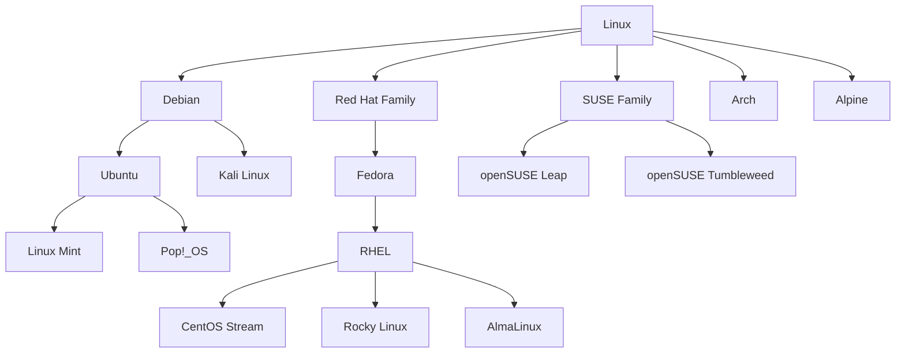

# Linux Overview

## Linux Fundamentals Guide

A comprehensive guide from basic concepts to advanced daily administration topics.

This guide is designed for learners, support engineers, system administrators, DevOps engineers, and developers who work on Linux systems.

---

### How to Use This Guide

- Read sections 1 to 5 first if you are new to Linux.
- Practice sections 7 to 13 on a lab VM or cloud instance.
- Copy commands exactly, but understand them before running as `root`.
- Prefer non-production systems when testing permissions, user management, or file operations.

> Tip:
> The fastest way to learn Linux is to read a concept, run the command, inspect the result, and repeat.

> Warning:
> Many commands in this guide can modify or delete data.
> Always verify the target path before pressing Enter.

---

### Table of Contents

1. [Linux Overview](#1-linux-overview)
2. [Linux Distributions](#2-linux-distributions)
3. [Linux Architecture](#3-linux-architecture)
4. [Boot Process](#4-boot-process)
5. [File System Hierarchy (FHS)](#5-file-system-hierarchy-fhs)
6. [Linux File Types](#6-linux-file-types)
7. [Basic Commands](#7-basic-commands)
8. [File Permissions and Ownership](#8-file-permissions-and-ownership)
9. [Users and Groups](#9-users-and-groups)
10. [I/O Redirection and Piping](#10-io-redirection-and-piping)
11. [Text Processing](#11-text-processing)
12. [Compression and Archiving](#12-compression-and-archiving)
13. [Help and Documentation](#13-help-and-documentation)

---

## 1. Linux Overview

### 1.1 What Is Linux?

Linux is an operating system kernel.

A kernel is the core software layer that talks to hardware and manages system resources.

Linux handles:

- CPU scheduling
- Memory management
- Device drivers
- Storage access
- Networking
- Process control
- Security boundaries

When most people say “Linux,” they usually mean a complete operating system built around the Linux kernel.

That complete system often includes:

- GNU userland tools
- a shell such as Bash or Zsh
- system libraries such as glibc or musl
- a package manager
- service management tools
- desktop or server software

### 1.2 Kernel vs Distribution

The Linux kernel is only one part of the full system.

A Linux distribution bundles the kernel with tools and policies so users can install and operate a complete environment.

Examples of what a distribution adds:

- installer
- package repository
- default shell
- init system
- desktop environment or server defaults
- security policies
- support lifecycle
- documentation

A simple mental model:

- Kernel = engine
- Distribution = complete vehicle

### 1.3 Why People Say GNU/Linux

GNU is a large collection of free software tools created by the GNU Project.

Many classic Linux systems combined the Linux kernel with GNU components.

Common GNU components include:

- Bash
- coreutils
- GCC
- glibc
- grep
- sed
- tar

That is why some people use the term GNU/Linux.

It highlights that the usable system is more than the kernel alone.

Not every Linux distribution is strictly GNU-based.

For example:

- Alpine Linux commonly uses musl and BusyBox.
- Android uses the Linux kernel but is not a traditional GNU/Linux distribution.

### 1.4 Key Characteristics of Linux

Linux is widely used because it is:

- open source
- portable
- stable
- scriptable
- multiuser
- multitasking
- network-friendly
- highly customizable
- well suited for automation

Linux is common in:

- servers
- cloud platforms
- containers
- embedded devices
- supercomputers
- developer workstations
- networking appliances
- security labs

### 1.5 Linux in the Real World

Linux powers a large percentage of internet infrastructure.

It is the default operating system for many cloud workloads.

It dominates in containers because Docker and Kubernetes ecosystems are Linux-native.

It is also widely used in edge devices and appliances.

Examples:

- web servers
- application servers
- CI/CD runners
- container hosts
- firewalls
- routers
- NAS devices
- IoT devices
- smartphones through Android

### 1.6 Linux vs Unix

Linux is Unix-like.

It was inspired by Unix design principles.

However, Linux is not the original Unix.

Important comparison points:

| Area | Linux | Traditional Unix |
|---|---|---|
| Source model | Usually open source | Often proprietary |
| Hardware support | Very broad | Often tied to vendor hardware |
| Cost | Often free | Often commercial |
| Distros | Many | Fewer vendor variants |
| Common use | Cloud, servers, containers, desktops | Enterprise legacy systems |

Unix design ideas that Linux inherits include:

- everything is treated like a file interface when possible
- small tools can be combined together
- text streams are powerful
- users, groups, and permissions matter
- shells enable automation

### 1.7 Linux History Timeline

| Year | Event |
|---|---|
| 1969 | Unix development begins at Bell Labs |
| 1983 | GNU Project is announced by Richard Stallman |
| 1991 | Linus Torvalds announces the Linux kernel |
| 1992 | Linux kernel is relicensed under GPL |
| 1993 | Debian and Slackware appear |
| 1994 | Linux kernel 1.0 is released |
| 1998 | Enterprise Linux interest grows rapidly |
| 2004 | Ubuntu is first released |
| 2011 | systemd adoption expands across distributions |
| 2013 | Docker popularizes containers on Linux |
| 2014+ | Kubernetes and cloud-native adoption accelerate |
| Present | Linux is dominant in servers, cloud, and containers |

### 1.8 Milestones Explained

#### Unix foundations

Unix influenced shell design, permissions, process management, and the philosophy of small composable tools.

#### GNU Project

The GNU Project created many tools needed for a complete free operating system environment.

#### Linux kernel birth

Linus Torvalds began Linux as a personal project and it quickly became a global collaborative effort.

#### Distribution era

Distributions made Linux practical to install, update, and support.

#### Enterprise adoption

Linux became a serious platform for web hosting, databases, and application servers.

#### Cloud-native era

Linux became the foundation for virtual machines, containers, orchestration, and automation.

### 1.9 Core Linux Philosophy

Common Linux habits come from a few principles:

- prefer text-based configuration
- automate repetitive work
- combine simple commands with pipes
- store logs and state predictably
- separate privileged tasks from normal user work
- favor transparency over hidden behavior

### 1.10 What Beginners Should Master First

Start with these building blocks:

- navigating directories
- reading files
- editing files
- understanding permissions
- redirecting output
- using `grep`, `find`, and `tar`
- reading `man` pages
- knowing when `sudo` is required

> Tip:
> Linux becomes much easier once you understand paths, permissions, processes, and text streams.

---

## 1. Linux Distributions
### 1.1 What Is a Distribution?
A Linux distribution, or distro, is a packaged operating system built around the Linux kernel.

A distro provides:

- kernel packages
- userland tools
- repositories
- security updates
- package manager
- installer
- defaults for networking, services, and storage

### 1.2 Why So Many Distros Exist
Different distributions optimize for different goals.

Common goals include:

- beginner friendliness
- enterprise support
- server stability
- bleeding-edge software
- minimal size
- security hardening
- container use
- customization

### 1.3 Major Distribution Comparison
| Distribution | Family | Package Manager | Release Style | Best For | Notes |
|---|---|---|---|---|---|
| Ubuntu | Debian | `apt` | Regular LTS and interim | Beginners, servers, cloud | Large community and docs |
| Debian | Independent | `apt` | Stable branches | Stable servers, base systems | Conservative and reliable |
| Fedora | Red Hat | `dnf` | Fast release cycle | Developers, modern desktops, testbed | Often introduces new tech first |
| RHEL | Red Hat | `dnf` | Enterprise lifecycle | Enterprises, supported production | Paid support and certifications |
| CentOS Stream | Red Hat | `dnf` | Rolling preview to RHEL | Development aligned with RHEL | Replaced classic CentOS model |
| Rocky Linux | Red Hat | `dnf` | Enterprise rebuild | RHEL-compatible environments | Community-driven |
| AlmaLinux | Red Hat | `dnf` | Enterprise rebuild | RHEL-compatible environments | Community-focused alternative |
| Arch Linux | Independent | `pacman` | Rolling release | Advanced users, custom systems | Minimal and highly configurable |
| Alpine Linux | Independent | `apk` | Small stable releases | Containers, embedded systems | Uses musl and BusyBox |
| openSUSE Leap | SUSE | `zypper` | Stable release | Enterprise-like desktop/server | Good admin tooling |
| openSUSE Tumbleweed | SUSE | `zypper` | Rolling release | Latest packages with testing | Strong for developers |
| Linux Mint | Ubuntu/Debian | `apt` | Stable desktop focus | Desktop users | Friendly user experience |

### 1.4 Distribution Families
Distributions often inherit packages, design choices, or release policies from parent projects.



### 1.5 Debian and Debian-Based Systems
Debian is known for stability and a strong free software culture.

It is common in:

- servers
- cloud images
- base containers
- appliances

Ubuntu builds on Debian and makes Linux more approachable for many users.

Ubuntu strengths:

- excellent documentation
- wide cloud support
- long-term support releases
- popular developer ecosystem

Mint focuses on desktop usability.

Kali focuses on security testing tools.

### 1.6 Red Hat Family
Fedora is often the innovation platform.

RHEL is the enterprise product with certification and support.

CentOS Stream sits between Fedora and RHEL as a preview path.

Rocky Linux and AlmaLinux are RHEL-compatible community distributions.

Typical uses:

- enterprise application servers
- middleware
- databases
- regulated environments
- certification-based deployments

### 1.7 SUSE Family
SUSE and openSUSE are well known in enterprise and data center environments.

They are respected for:

- YaST administration tooling
- strong package management with `zypper`
- enterprise integration
- stable server workflows

### 1.8 Arch Family
Arch Linux prioritizes simplicity, user control, and a rolling release model.

Arch is attractive for:

- advanced users
- minimal setups
- learning internals
- highly customized desktops

Arch users are expected to read documentation carefully and manage upgrades actively.

### 1.9 Alpine Linux
Alpine Linux is extremely small.

It is popular in:

- containers
- embedded systems
- minimal attack surface deployments

Key traits:

- musl libc instead of glibc
- BusyBox userland
- `apk` package manager
- lightweight images

> Warning:
> Alpine can behave differently from glibc-based systems.
> Some binaries compiled for Ubuntu or Debian may not run without adjustment.

### 1.10 Choosing the Right Distribution
Choose a distribution based on workload.

#### For beginners

- Ubuntu
- Linux Mint

#### For stable general-purpose servers

- Ubuntu LTS
- Debian Stable
- RHEL
- Rocky Linux
- AlmaLinux
- openSUSE Leap

#### For learning internals

- Arch Linux
- Debian minimal install

#### For bleeding-edge developer environments

- Fedora
- openSUSE Tumbleweed
- Arch Linux

#### For containers and minimal systems

- Alpine Linux
- Debian slim images
- Ubuntu minimal images

### 1.11 Package Manager Cheat Sheet
| Family | Commands | Notes |
|---|---|---|
| Debian/Ubuntu | `apt install`, `apt remove`, `apt update`, `apt upgrade` | High-level package manager |
| Red Hat/Fedora | `dnf install`, `dnf remove`, `dnf check-update`, `dnf upgrade` | `yum` is legacy on older systems |
| Arch | `pacman -S`, `pacman -R`, `pacman -Sy`, `pacman -Syu` | Powerful but needs care |
| Alpine | `apk add`, `apk del`, `apk update`, `apk upgrade` | Fast and lightweight |
| SUSE | `zypper install`, `zypper remove`, `zypper refresh`, `zypper update` | Strong dependency handling |

### 1.12 Repository Concepts
Most Linux packages are installed from signed repositories.

This provides:

- trusted software sources
- dependency resolution
- update tracking
- easier automation

Repository concepts to know:

- enabled repos
- GPG signing keys
- mirrors
- package metadata cache
- stable vs testing channels

### 1.13 LTS vs Rolling Release
#### LTS

Long-term support releases prioritize stability.

Benefits:

- fewer surprises
- longer security support
- easier enterprise planning

Tradeoff:

- older software versions

#### Rolling release

Rolling distributions continuously update packages.

Benefits:

- newer software
- latest kernels and toolchains

Tradeoff:

- more change risk
- higher maintenance attention

### 1.14 Practical Distro Selection Examples
#### Small web server in production

Recommended options:

- Ubuntu LTS
- Debian Stable
- Rocky Linux

Reason:

- stable packages
- long support
- abundant documentation

#### Developer laptop for container and cloud tooling

Recommended options:

- Fedora
- Ubuntu LTS
- openSUSE Tumbleweed

Reason:

- fresh tooling
- good hardware support
- active ecosystems

#### Security lab machine

Recommended options:

- Kali Linux
- Ubuntu with selected security tools

#### Tiny container base image

Recommended options:

- Alpine Linux
- Debian slim

### 1.15 Distro Command Examples
```bash
## Ubuntu or Debian
sudo apt update
sudo apt install nginx

## Fedora, RHEL, Rocky, AlmaLinux
sudo dnf install nginx

## Arch Linux
sudo pacman -S nginx

## Alpine Linux
sudo apk add nginx

## openSUSE
sudo zypper install nginx
```

> Tip:
> Learn one distro deeply first.
> After that, switching families mostly means learning a different package manager, service naming style, and release philosophy.

---

