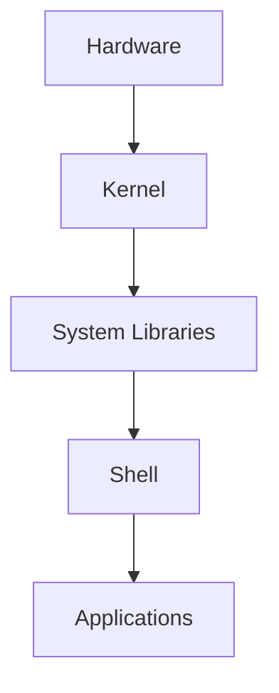

# 3. Linux Architecture

## 3.1 Big Picture

### 📸 Linux Kernel Architecture

> *Source: Wikimedia Commons — Linux kernel interactive map*

### 📸 Linux Architecture Layers

> *Source: Wikimedia Commons — Linux kernel in system architecture*

Linux systems are layered.

The lower layers talk to hardware.

The upper layers provide user-facing tools and applications.

## 3.2 Hardware Layer

This is the physical or virtual machine layer.

Examples:

- CPU
- RAM
- disks
- network cards
- GPUs
- USB devices
- firmware

The kernel uses drivers to communicate with hardware.

## 3.3 Kernel Layer

The kernel is the privileged core of the operating system.

Main kernel responsibilities:

- process scheduling
- virtual memory management
- device management
- filesystems
- networking stack
- security enforcement
- inter-process communication

The kernel runs in kernel space.

Kernel space is protected from normal user applications.

## 3.4 System Libraries

System libraries provide standard interfaces that applications call.

Examples:

- glibc
- musl
- OpenSSL libraries
- ncurses

Applications usually do not talk directly to the kernel.

They call libraries, and libraries use system calls to reach the kernel.

## 3.5 Shell Layer

The shell is a command interpreter.

Popular shells include:

- Bash
- Zsh
- Fish
- Ksh
- Dash

A shell lets users:

- run commands
- navigate files
- redirect input and output
- script tasks
- manage environment variables

## 3.6 Application Layer

Applications sit on top of libraries and shell interfaces.

Examples:

- `nginx`
- `python`
- `vim`
- `git`
- `docker`
- desktop browsers

## 3.7 User Space vs Kernel Space

### Kernel space

- full hardware access
- highly privileged
- mistakes can crash the system

### User space

- where normal programs run
- isolated from kernel internals
- crashes usually affect only the program

## 3.8 System Calls

System calls are the boundary between applications and the kernel.

Common categories:

- file operations
- process control
- memory allocation
- networking
- permissions

Examples of system call concepts:

- open
- read
- write
- fork
- exec
- socket

## 3.9 Why Architecture Matters

Understanding the architecture helps you troubleshoot problems.

Examples:

- app fails because a shared library is missing
- device not detected because driver support is absent
- process denied because permissions are insufficient
- shell command fails because PATH is incorrect

## 3.10 Linux Architecture Summary Table

| Layer | Role | Examples |
|---|---|---|
| Hardware | Physical resources | CPU, disk, NIC |
| Kernel | Core OS control | Scheduler, VFS, TCP/IP |
| Libraries | Standard interfaces | glibc, musl |
| Shell | Command interpreter | Bash, Zsh |
| Applications | User workloads | nginx, vim, python |

> Tip:
> When debugging, ask yourself which layer is failing.
> Hardware, kernel, library, shell, and application issues often look different.

---

