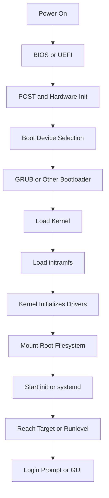

# 4. Boot Process

> **📌 Disclaimer**: Any third-party logos, screenshots, or diagrams referenced in this document are used for educational purposes only. All trademarks belong to their respective owners.


## 4.1 Overview

### 📸 Linux Boot Process

> *Source: Wikimedia Commons — Linux boot sequence from BIOS to desktop*

Linux booting is the chain of events that takes a machine from power-on to a usable login prompt or service-ready state.

Typical stages:

- firmware initialization
- bootloader execution
- kernel loading
- initramfs work
- root filesystem mount
- init system startup
- service activation
- login prompt or graphical session



## 4.2 BIOS vs UEFI

### BIOS

BIOS is older firmware.

It initializes hardware and looks for bootable media.

### UEFI

UEFI is the modern replacement.

It supports:

- larger disks
- Secure Boot
- EFI system partitions
- more flexible boot management

## 4.3 POST

POST stands for Power-On Self-Test.

The firmware checks key hardware components before boot continues.

Common checks:

- CPU availability
- memory initialization
- keyboard status on some systems
- storage device presence

## 4.4 Bootloader

The bootloader loads the Linux kernel into memory.

GRUB is the most common bootloader on Linux systems.

Common GRUB capabilities:

- boot menu display
- kernel parameter editing
- multiple OS support
- rescue mode access
- chainloading

Important files often associated with GRUB:

- `/boot/grub/grub.cfg`
- `/etc/default/grub`
- EFI boot files under `/boot/efi`

> Warning:
> Do not edit generated GRUB config files blindly.
> On many systems you should update `/etc/default/grub` and regenerate configuration using the distro tools.

## 4.5 Kernel Loading

The bootloader loads:

- the kernel image
- initial RAM filesystem image
- kernel command-line parameters

The kernel then:

- initializes core subsystems
- detects hardware
- loads built-in drivers
- begins mounting the root environment

## 4.6 initramfs

`initramfs` is a temporary early userspace environment.

It helps the kernel prepare enough drivers and tools to mount the real root filesystem.

This is important when the root filesystem depends on:

- RAID
- LVM
- encrypted disks
- unusual storage controllers
- network boot features

## 4.7 Root Filesystem Mount

After early initialization, the real root filesystem is mounted.

The system then switches from initramfs to the actual root filesystem.

## 4.8 init and systemd

Historically, Linux systems used SysV init.

Many modern distributions use systemd.

The init system is process ID 1.

It is the first long-running userspace process.

Its job is to start and supervise the rest of the system.

Common init responsibilities:

- starting services
- handling targets or runlevels
- managing dependencies
- cleaning temporary state
- responding to shutdown and reboot requests

## 4.9 Runlevels vs systemd Targets

### Traditional SysV runlevels

| Runlevel | Meaning |
|---|---|
| 0 | Halt |
| 1 | Single-user or rescue |
| 2 | Multi-user, distro-specific |
| 3 | Multi-user text mode |
| 4 | Unused or custom |
| 5 | Multi-user graphical |
| 6 | Reboot |

### Common systemd targets

| Target | Purpose |
|---|---|
| `poweroff.target` | Shut down system |
| `rescue.target` | Single-user rescue mode |
| `multi-user.target` | Multi-user text mode |
| `graphical.target` | Graphical environment |
| `reboot.target` | Reboot system |

## 4.10 Inspecting the Boot Process

Useful commands:

```bash
uname -r
systemctl get-default
systemctl list-units --type=service
journalctl -b
lsblk
cat /proc/cmdline
```

What they help with:

- confirm kernel version
- view default systemd target
- inspect services
- read boot logs
- inspect block devices
- inspect kernel boot parameters

## 4.11 Common Boot Problems

### GRUB menu not appearing

Possible causes:

- hidden timeout
- corrupted bootloader config
- EFI entry problems

### Kernel panic

Possible causes:

- missing root filesystem
- broken initramfs
- incompatible kernel modules

### Stuck in emergency mode

Possible causes:

- failed filesystem check
- bad `/etc/fstab`
- missing mount dependencies

### Service startup failures

Possible causes:

- bad configuration files
- missing network
- missing dependencies

## 4.12 Troubleshooting Boot Issues

Use these tools carefully:

```bash
journalctl -b -p err
systemctl --failed
cat /etc/fstab
lsblk -f
mount
```

Questions to ask:

- Did the kernel boot successfully?
- Did the root filesystem mount?
- Did systemd reach the expected target?
- Which service failed first?

## 4.13 Boot Process Summary

1. Firmware starts.
2. Hardware is initialized.
3. Boot device is chosen.
4. Bootloader runs.
5. Kernel and initramfs load.
6. Kernel initializes drivers.
7. Root filesystem mounts.
8. `init` or `systemd` starts.
9. Services start.
10. System reaches a login target.

> Tip:
> If a Linux system does not boot, divide the problem into stages.
> Firmware, bootloader, kernel, filesystem, and init failures each leave different clues.

---
