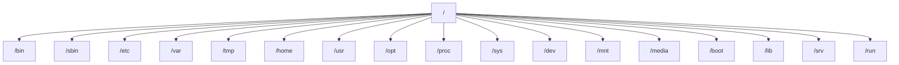

# File System Hierarchy (FHS)

> Includes Linux file types so no fundamentals content is lost during the split.

## 5. File System Hierarchy (FHS)

### 📸 Linux Filesystem Hierarchy

> *Source: Wikimedia Commons — Standard Unix/Linux filesystem hierarchy*

### 5.1 What Is FHS?

FHS stands for Filesystem Hierarchy Standard.

It defines common directory purposes so Linux systems remain understandable and consistent.

Even across distributions, the general layout is similar.

### 5.2 Why the Hierarchy Matters

When you know where things belong, you can:

- find configuration files quickly
- locate logs
- diagnose storage growth
- package software correctly
- back up the right paths
- troubleshoot services faster

### 5.3 High-Level View



### 5.4 Root Directory `/`

This is the top of the entire filesystem tree.

Everything begins from `/`.

Examples:

- `/etc/ssh/sshd_config`
- `/var/log/messages`
- `/home/user/.bashrc`

### 5.5 `/bin`

Historically, `/bin` stored essential user commands required for booting and single-user mode.

Typical commands once found here:

- `ls`
- `cp`
- `mv`
- `cat`
- `bash`

On many modern systems, `/bin` is a symlink into `/usr/bin`.

Why it exists conceptually:

- essential commands available early in boot
- standard location for core user binaries

### 5.6 `/sbin`

Historically, `/sbin` stored essential system administration commands.

Examples:

- `fsck`
- `ip`
- `mount`
- `reboot`
- `shutdown`

On many systems, `/sbin` may also be merged into `/usr/sbin`.

### 5.7 `/etc`

`/etc` contains system-wide configuration files.

Examples:

- `/etc/passwd`
- `/etc/shadow`
- `/etc/hosts`
- `/etc/fstab`
- `/etc/ssh/sshd_config`
- `/etc/systemd/system/`

Characteristics:

- text-heavy
- human-editable
- critical for system behavior

> Warning:
> Back up configuration files before editing critical items like `/etc/fstab`, SSH configs, or sudo policy files.

### 5.8 `/var`

`/var` stores variable data that changes during normal operation.

Common subdirectories:

- `/var/log`
- `/var/spool`
- `/var/cache`
- `/var/lib`
- `/var/tmp`

Examples:

- service logs
- package caches
- mail queues
- database files
- state data for applications

### 5.9 `/tmp`

`/tmp` stores temporary files.

Important traits:

- writable by many users
- often cleared on reboot or cleanup policy
- not suitable for permanent storage

Security note:

- permissions usually include the sticky bit
- users typically cannot delete each other’s files there

### 5.10 `/home`

`/home` stores personal directories for normal users.

Examples:

- `/home/alex`
- `/home/devops`

Typical contents:

- documents
- downloads
- scripts
- shell dotfiles
- SSH keys
- user-specific application settings

### 5.11 `/root`

Although not in the requested list, `/root` is worth knowing.

It is the home directory of the `root` user.

It is separate from `/home`.

### 5.12 `/usr`

`/usr` contains userland applications, libraries, and documentation.

Common subdirectories:

- `/usr/bin`
- `/usr/sbin`
- `/usr/lib`
- `/usr/share`
- `/usr/local`

Think of `/usr` as the main software tree for the installed system.

#### `/usr/bin`

Most user commands live here on modern systems.

#### `/usr/sbin`

System administration commands often live here.

#### `/usr/lib`

Shared libraries and internal support files.

#### `/usr/share`

Architecture-independent data.

Examples:

- man pages
- icons
- locale files
- documentation

#### `/usr/local`

Locally installed software that is not managed by the distro package manager often goes here.

Examples:

- `/usr/local/bin`
- `/usr/local/lib`
- `/usr/local/share`

### 5.13 `/opt`

`/opt` stores optional add-on software packages.

This is common for:

- third-party applications
- vendor packages
- self-contained tools

Example:

- `/opt/vendor-app/`

### 5.14 `/proc`

`/proc` is a virtual filesystem.

It exposes kernel and process information.

It does not behave like normal persistent storage.

Useful files:

- `/proc/cpuinfo`
- `/proc/meminfo`
- `/proc/uptime`
- `/proc/cmdline`
- `/proc/<PID>/`

Example:

```bash
cat /proc/cpuinfo
cat /proc/meminfo
```

### 5.15 `/sys`

`/sys` is another virtual filesystem.

It exposes device and kernel object information.

It is widely used by the kernel, udev, and low-level tooling.

Examples:

- device attributes
- driver information
- power settings

### 5.16 `/dev`

`/dev` contains device files.

These files represent hardware or pseudo-devices.

Examples:

- `/dev/sda`
- `/dev/null`
- `/dev/zero`
- `/dev/random`
- `/dev/tty`

### 5.17 `/mnt`

`/mnt` is a traditional temporary mount point for administrators.

It is often used when manually mounting filesystems.

Example:

```bash
sudo mount /dev/sdb1 /mnt
```

### 5.18 `/media`

`/media` is commonly used for removable media.

Examples:

- USB drives
- external disks
- optical media

Desktop environments often mount media here automatically.

### 5.19 `/boot`

`/boot` contains files required for booting.

Examples:

- kernel images
- initramfs images
- bootloader files
- GRUB configuration components

If `/boot` fills up, kernel updates may fail.

### 5.20 `/lib`

`/lib` contains essential shared libraries and kernel modules.

On many systems, this may be linked or merged with `/usr/lib`.

It remains conceptually important because:

- early boot programs need libraries
- kernel modules are stored under library trees

### 5.21 `/srv`

`/srv` stores data served by system services.

Examples:

- web content
- FTP data
- application-served static assets

Example layout:

- `/srv/www/`
- `/srv/ftp/`

### 5.22 `/run`

`/run` stores volatile runtime data.

It exists only during booted runtime.

Common contents:

- PID files
- sockets
- locks
- runtime status info

`/run` is typically mounted as tmpfs.

### 5.23 Common Subdirectories in `/var`

#### `/var/log`

Stores logs.

Examples:

- system logs
- authentication logs
- service logs

#### `/var/lib`

Stores persistent application state.

Examples:

- package manager metadata
- databases
- service state

#### `/var/cache`

Stores cached data that can usually be recreated.

#### `/var/spool`

Stores queued work.

Examples:

- print jobs
- mail queues
- scheduled task queues

#### `/var/tmp`

Temporary files that may persist longer than `/tmp`.

### 5.24 Inspecting the Hierarchy

Useful commands:

```bash
pwd
ls /
ls /etc
ls /var/log
find /etc -maxdepth 1 -type f | head
```

### 5.25 Storage and Capacity Awareness

Directories that often grow unexpectedly:

- `/var/log`
- `/var/lib`
- `/tmp`
- `/home`
- `/opt`

Useful commands:

```bash
df -h
du -sh /var/* 2>/dev/null | sort -h
```

### 5.26 FHS Quick Reference Table

| Path | Purpose | Typical Content |
|---|---|---|
| `/` | Root of filesystem | Everything starts here |
| `/bin` | Essential user binaries | `ls`, `cp`, `cat` |
| `/sbin` | Essential admin binaries | `mount`, `fsck` |
| `/etc` | Configuration | service configs, passwd files |
| `/var` | Variable data | logs, cache, state |
| `/tmp` | Temporary files | scratch data |
| `/home` | User homes | personal files |
| `/usr` | Main software tree | binaries, libs, docs |
| `/opt` | Optional software | vendor apps |
| `/proc` | Process and kernel info | virtual files |
| `/sys` | Kernel device model | virtual files |
| `/dev` | Device files | disks, terminals |
| `/mnt` | Manual mounts | temporary mount points |
| `/media` | Removable media | USB mounts |
| `/boot` | Boot files | kernels, GRUB |
| `/lib` | Essential libraries | shared libs, modules |
| `/srv` | Service data | web content |
| `/run` | Runtime state | PIDs, sockets |

### 5.27 Practical Examples

#### Example 1: Find SSH server config

```bash
ls /etc/ssh
cat /etc/ssh/sshd_config
```

#### Example 2: Check recent logs

```bash
ls /var/log
sudo tail -n 50 /var/log/syslog
```

#### Example 3: Identify mounted devices

```bash
ls /dev/sd*
lsblk
```

#### Example 4: See kernel command line

```bash
cat /proc/cmdline
```

> Tip:
> If you do not know where a Linux file should live, first ask whether it is configuration, executable code, variable state, temporary data, or user data.

---

## 6. Linux File Types

### 6.1 Overview

Linux supports multiple file types.

You can often identify them with `ls -l`, `stat`, or `file`.

The first character of `ls -l` output is especially important.

### 6.2 File Type Indicators in `ls -l`

| Indicator | Type |
|---|---|
| `-` | Regular file |
| `d` | Directory |
| `l` | Symbolic link |
| `c` | Character device |
| `b` | Block device |
| `p` | Named pipe |
| `s` | Socket |

### 6.3 Regular File

A regular file stores data.

Examples:

- text files
- scripts
- images
- binaries
- archives

Example:

```bash
touch notes.txt
ls -l notes.txt
file notes.txt
```

### 6.4 Directory

A directory stores references to files and subdirectories.

It organizes the filesystem tree.

Example:

```bash
mkdir project
ls -ld project
```

### 6.5 Symbolic Link

A symbolic link points to another path.

It is similar to a shortcut.

Properties:

- can point across filesystems
- can point to directories
- can become broken if target disappears

Example:

```bash
ln -s /etc/hosts hosts-link
ls -l hosts-link
```

### 6.6 Hard Link

A hard link is an additional directory entry pointing to the same inode as another file.

Properties:

- refers to the same underlying file data
- does not cross filesystems in normal use
- usually not used for directories
- remains valid if the original filename is removed

Example:

```bash
echo "hello" > original.txt
ln original.txt hardlink.txt
ls -li original.txt hardlink.txt
```

### 6.7 Character Device

Character devices transfer data as a stream of characters.

Examples:

- terminals
- serial ports
- `/dev/null`

Example:

```bash
ls -l /dev/null
```

### 6.8 Block Device

Block devices transfer data in blocks.

They are used for storage devices.

Examples:

- disks
- partitions
- loop devices

Example:

```bash
ls -l /dev/sda
lsblk
```

### 6.9 Named Pipe

A named pipe, or FIFO, allows one process to send data to another.

Example:

```bash
mkfifo mypipe
ls -l mypipe
```

### 6.10 Socket

Sockets enable inter-process communication.

They are common for:

- daemons
- local service communication
- networked services

Example:

```bash
ss -lx
```

### 6.11 Inspecting File Types

Useful commands:

```bash
ls -l
stat /etc/passwd
file /bin/ls
find . -type l
```

### 6.12 Why File Types Matter

Understanding file types helps when:

- diagnosing broken symlinks
- managing device access
- backing up data correctly
- troubleshooting service sockets
- securing writable directories

> Tip:
> Use `ls -l` first, then `stat`, then `file` if you need deeper detail.

---

