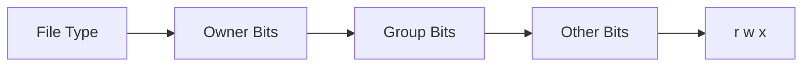

# 8. File Permissions and Ownership

> **📌 Disclaimer**: Any third-party logos, screenshots, or diagrams referenced in this document are used for educational purposes only. All trademarks belong to their respective owners.


This chapter explains `chmod` (Change Mode), `chown` (Change Owner), `chgrp` (Change Group), SUID (Set User ID), SGID (Set Group ID), ACL (Access Control List), DAC (Discretionary Access Control), and MAC (Mandatory Access Control) so permission changes are clear the first time you see them.

## 8.1 Why Permissions Matter

Linux is a multiuser operating system.

Permissions control who can read, write, or execute files and directories.

They are central to:

- security
- isolation
- service behavior
- collaboration

## 8.2 Ownership Basics

Every file has:

- a user owner
- a group owner
- permission bits

Example:

```bash
ls -l /etc/passwd
```

Sample style of output:

```text
-rw-r--r-- 1 root root 2048 Jan  1 10:00 /etc/passwd
```

Breakdown:

- `-` = regular file
- `rw-` = owner permissions
- `r--` = group permissions
- `r--` = others permissions
- first `root` = owner
- second `root` = group

## 8.3 Permission Types

| Symbol | Meaning |
|---|---|
| `r` | Read |
| `w` | Write |
| `x` | Execute |
| `-` | Permission not granted |

For files:

- read = view contents
- write = modify contents
- execute = run as program or script

For directories:

- read = list contents
- write = create or remove entries
- execute = enter directory and access items by name

## 8.4 Permission Structure

### 📸 Linux File Permissions

> *Source: Wikimedia Commons — Unix file permission bits*



## 8.5 Numeric Values

| Permission | Value |
|---|---|
| `r` | 4 |
| `w` | 2 |
| `x` | 1 |

Add the values to compute numeric modes.

Examples:

- `rwx` = 7
- `rw-` = 6
- `r-x` = 5
- `r--` = 4
- `---` = 0

## 8.6 Numeric Permission Calculation Table

| Numeric | Symbolic | Meaning |
|---|---|---|
| 0 | `---` | No permissions |
| 1 | `--x` | Execute only |
| 2 | `-w-` | Write only |
| 3 | `-wx` | Write and execute |
| 4 | `r--` | Read only |
| 5 | `r-x` | Read and execute |
| 6 | `rw-` | Read and write |
| 7 | `rwx` | Read, write, execute |

## 8.7 Common Modes

| Mode | Typical Use |
|---|---|
| `644` | Normal file |
| `600` | Private file |
| `755` | Executable script or directory |
| `700` | Private directory or script |
| `775` | Shared group-writable directory |
| `777` | Almost never appropriate |

> Warning:
> Avoid `777` unless you fully understand the risk.
> It grants write access to everyone.

## 8.8 `chmod`

### Purpose

Change file mode bits.

### Syntax

```bash
chmod MODE file
chmod [ugoa][+-=][rwx] file
```

### Numeric Examples

```bash
chmod 644 notes.txt
chmod 755 deploy.sh
chmod 700 ~/.ssh
```

### Symbolic Examples

```bash
chmod u+x deploy.sh
chmod g-w report.txt
chmod o-r secret.txt
chmod ug+rw shared.txt
```

### Recursive Example

```bash
chmod -R 755 scripts/
```

### Notes

Use recursive permission changes carefully.

Directories and files often need different execute settings.

## 8.9 `chown`

### Purpose

Change file owner and optionally group.

### Syntax

```bash
chown user file
chown user:group file
```

### Examples

```bash
sudo chown alice report.txt
sudo chown alice:developers app.conf
sudo chown -R www-data:www-data /var/www/html
```

### Notes

Usually requires root privileges.

## 8.10 `chgrp`

### Purpose

Change group ownership.

### Syntax

```bash
chgrp group file
```

### Examples

```bash
sudo chgrp developers app.conf
sudo chgrp -R www-data /srv/www
```

## 8.11 `umask`

### Purpose

Set default permission mask for newly created files and directories.

### Concept

A umask removes permissions from the default creation mode.

Typical defaults:

- files start near `666`
- directories start near `777`

Then the umask subtracts permissions.

### Examples

| Umask | New File | New Directory |
|---|---|---|
| `022` | `644` | `755` |
| `027` | `640` | `750` |
| `077` | `600` | `700` |

### Commands

```bash
umask
umask 022
umask 077
```

### Notes

A stricter umask is useful for private environments and automation.

## 8.12 Special Permission Bits

### SUID

Set User ID causes a program to run with the file owner’s privileges.

Numeric prefix contribution:

- SUID = 4

Example permission form:

- `4755`

Typical use:

- `/usr/bin/passwd`

### SGID

Set Group ID causes execution with the file’s group privileges.

On directories, new files may inherit the directory’s group.

Numeric prefix contribution:

- SGID = 2

Example permission form:

- `2755`

### Sticky Bit

On directories, only the file owner, directory owner, or root can delete contained files.

Numeric prefix contribution:

- Sticky bit = 1

Typical directory:

- `/tmp`

Example permission form:

- `1777`

## 8.13 Special Bits Table

| Numeric Prefix | Special Bit | Example | Meaning |
|---|---|---|---|
| 4 | SUID | `4755` | Run with owner identity |
| 2 | SGID | `2755` | Run with group identity or inherit group on dir |
| 1 | Sticky | `1777` | Protected deletion in directory |

## 8.14 Viewing ACLs

Traditional permissions are simple but limited.

Access Control Lists allow more granular permissions.

### `getfacl`

```bash
getfacl file.txt
getfacl shared-dir/
```

### `setfacl`

```bash
setfacl -m u:alice:rw file.txt
setfacl -m g:devs:rwx shared-dir
setfacl -x u:alice file.txt
setfacl -b file.txt
```

## 8.15 When ACLs Are Useful

Use ACLs when:

- one extra user needs access without changing owner
- multiple teams share a directory
- standard owner/group/other is too coarse

## 8.16 Directory Permission Behavior

This is a common beginner confusion.

For directories:

- `r` lets you list names
- `w` lets you create or remove entries
- `x` lets you enter and traverse

A directory without execute permission may be unreadable in practice even if read is set.

## 8.17 Practical Permission Examples

### Private SSH directory

```bash
chmod 700 ~/.ssh
chmod 600 ~/.ssh/id_rsa
chmod 644 ~/.ssh/id_rsa.pub
```

### Shared group directory

```bash
sudo mkdir -p /srv/shared
sudo chown root:developers /srv/shared
sudo chmod 2775 /srv/shared
```

### Make a script executable

```bash
chmod u+x backup.sh
```

## 8.18 Auditing Permissions

Useful commands:

```bash
ls -l
find . -perm -4000
find . -perm -2000
find /tmp -maxdepth 1 -type d -ls
namei -l /path/to/file
```

## 8.19 Permission Troubleshooting

Questions to ask:

- who owns the file?
- what group owns the file?
- what are the mode bits?
- is a parent directory blocking access?
- is SELinux or AppArmor involved?
- are ACLs present?

## 8.20 Best Practices

- grant least privilege
- avoid world-writable files
- use groups for collaboration
- use ACLs only when needed
- preserve ownership during backup with `cp -a` or `rsync -a`
- protect private keys strictly

> Tip:
> If a user says “permission denied,” check the full path, not just the target file.
> One parent directory with missing execute permission is enough to block access.

---
