# 13. Essential Network Protocols for Linux

This chapter is a practical field guide to the core protocols that Linux administrators meet every day.
It focuses on what the protocol does.
It shows what packets usually look like.
It explains where the protocol sits in the stack.
It includes Linux commands you can run immediately.
It highlights security tradeoffs.
It uses Mermaid diagrams heavily so you can visualize the flow.

---

## 13.1 Learning goals

By the end of this chapter, you should be able to:
- identify which protocol solves which problem
- map a hostname lookup from application to authoritative DNS server
- explain how SSH authenticates a user and encrypts the session
- describe DHCP lease allocation and renewal
- mount and troubleshoot NFS exports
- explain SMTP delivery and IMAP retrieval
- compare FTP, FTPS, SFTP, and SCP correctly
- describe LDAP bind and search operations
- explain how SNMP polling and traps work
- recognize standard ports from memory
- decide which protocols are encrypted and which are legacy risks

## 13.2 How to read the diagrams

The diagrams in this chapter use a few recurring ideas:
- left to right usually means request then response
- arrows show network messages or logical dependencies
- `<br/>` inside labels means a line break inside a node
- green ideas usually indicate success or trusted state
- warning notes call out insecure or legacy behavior

## 13.3 Protocol overview map

### 📸 TCP/IP Protocol Suite

> *Source: Wikimedia Commons — TCP/IP protocol suite and connections*

The application layer contains the protocol the user or service cares about.
The transport layer carries that protocol between endpoints.
Most business applications ride on TCP.
A few protocols prefer UDP for speed or broadcast behavior.

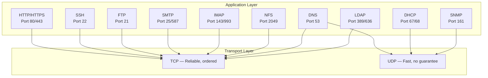

## 13.4 Why Linux administrators care about protocols

A Linux system is rarely isolated.
It resolves names.
It obtains IP configuration.
It opens secure shells.
It fetches packages over HTTPS.
It mounts shared storage.
It sends alert emails.
It authenticates against a directory.
It exposes metrics to monitoring systems.

When something breaks, protocol knowledge narrows the search space quickly.
If DNS fails, a web server can be healthy but unreachable by name.
If DHCP fails, the host may never get a usable address.
If LDAP fails, login can break even when the server is alive.
If NFS stalls, applications may hang while waiting on storage.

## 13.5 Quick transport refresher

### 13.5.1 TCP

TCP provides:
- connection setup
- sequence numbers
- retransmission
- ordering
- flow control
- congestion control

Use TCP when:
- correctness matters more than tiny latency gains
- the application expects a byte stream
- loss recovery should happen below the application

### 13.5.2 UDP

UDP provides:
- source port
- destination port
- length
- checksum

UDP does not provide:
- connection state
- retransmission
- ordering
- congestion handling for the application

Use UDP when:
- the application can tolerate loss
- the application implements its own recovery logic
- broadcast or multicast is required
- the interaction must be lightweight

### 13.5.3 Visual transport comparison

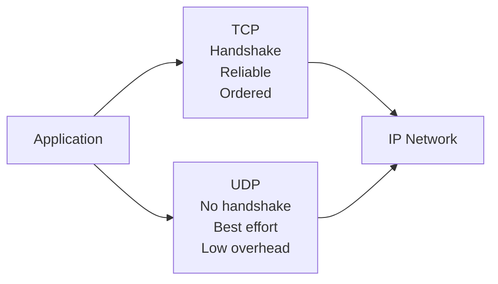

### 13.5.4 TCP three-way handshake

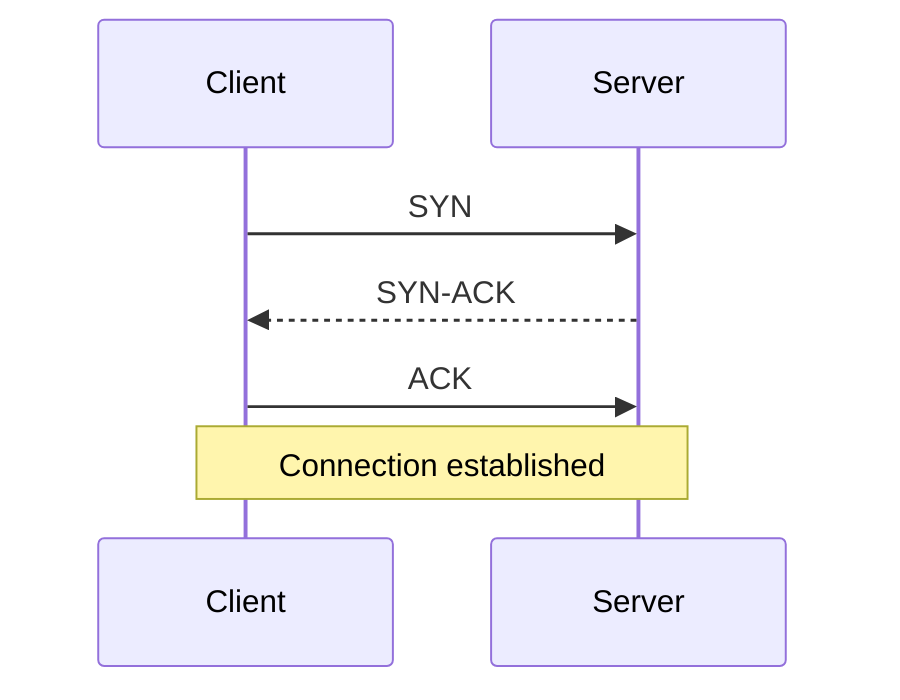

### 13.5.5 Useful Linux commands for transport debugging

```bash
ss -tulpn
ss -tn state established
sudo tcpdump -nn -i any port 53
sudo tcpdump -nn -i any tcp port 22
sudo lsof -i -P -n | grep LISTEN
```

---

# 13.6 HTTP and HTTPS

HTTP is still the most common protocol Linux administrators observe.
Package repositories use it.
APIs use it.
Web applications use it.
Cloud metadata services often expose it.
Prometheus exporters expose metrics over it.
Reverse proxies terminate it.

## 13.6.1 What HTTP does

HTTP is an application protocol for transferring representations of resources.
A resource may be:
- a web page
- an API object
- a JSON document
- an image
- a software package
- a metrics endpoint

## 13.6.2 Default ports

| Service | Port | Notes |
|---|---:|---|
| HTTP | 80 | Unencrypted by default |
| HTTPS | 443 | HTTP over TLS |

## 13.6.3 Request and response model

HTTP is a request and response protocol.
The client asks.
The server answers.
Each request includes:
- a method
- a path
- headers
- optionally a body

Each response includes:
- a status code
- headers
- optionally a body

## 13.6.4 Basic request flow

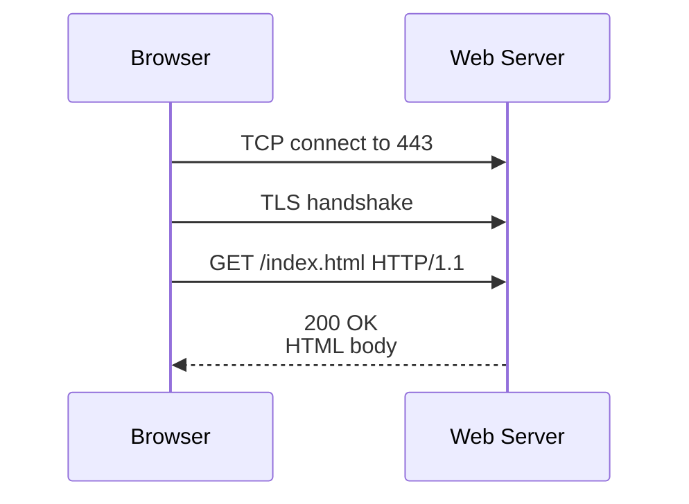

## 13.6.5 Example request

```http
GET /api/health HTTP/1.1
Host: app.example.com
User-Agent: curl/8.5.0
Accept: application/json
Authorization: Bearer TOKEN
```

## 13.6.6 Example response

```http
HTTP/1.1 200 OK
Content-Type: application/json
Cache-Control: no-store
Content-Length: 17

{"status":"ok"}
```

## 13.6.7 Common methods

| Method | Meaning | Typical use |
|---|---|---|
| `GET` | Read | Fetch data |
| `POST` | Submit or create | Login, create object |
| `PUT` | Replace | Replace full object |
| `PATCH` | Modify | Partial update |
| `DELETE` | Remove | Delete object |
| `HEAD` | Headers only | Probe endpoint |
| `OPTIONS` | Capabilities | CORS and introspection |

## 13.6.8 Common status codes

| Code | Meaning | Operational interpretation |
|---|---|---|
| `200` | OK | Normal success |
| `201` | Created | Object successfully created |
| `301` | Moved permanently | Redirect maintained by client or browser |
| `302` | Found | Temporary redirect |
| `400` | Bad request | Client sent invalid data |
| `401` | Unauthorized | Missing or invalid credentials |
| `403` | Forbidden | Credentials valid but insufficient |
| `404` | Not found | Path or object missing |
| `429` | Too many requests | Rate limiting |
| `500` | Internal server error | Application failed |
| `502` | Bad gateway | Proxy got bad upstream reply |
| `503` | Service unavailable | Backend down or overloaded |
| `504` | Gateway timeout | Upstream too slow |

## 13.6.9 HTTP troubleshooting commands

```bash
curl -I https://example.com/
curl -v https://example.com/
curl -L http://example.com/
curl -o /dev/null -s -w 'dns=%{time_namelookup} connect=%{time_connect} tls=%{time_appconnect} total=%{time_total}\n' https://example.com/
openssl s_client -connect example.com:443 -servername example.com
```

## 13.6.10 HTTPS handshake summary

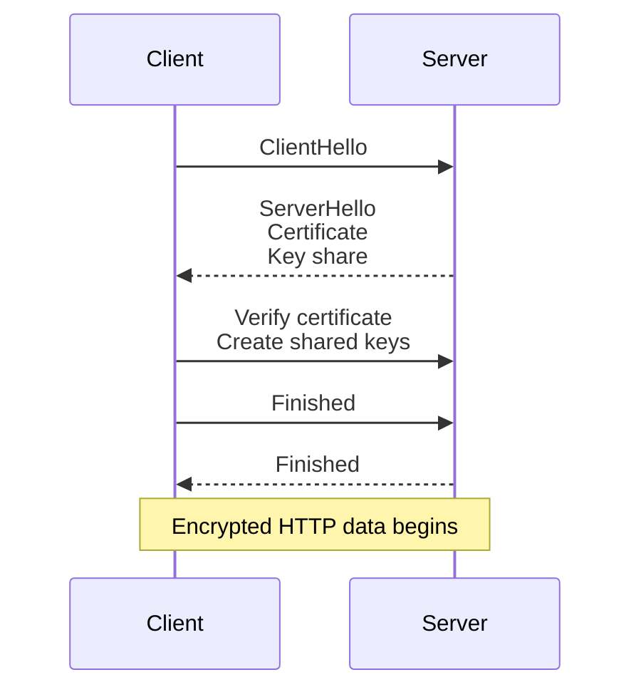

## 13.6.11 Why HTTPS matters

HTTPS gives you:
- confidentiality
- integrity
- server identity verification

Without HTTPS:
- credentials can be read on the wire
- cookies can be stolen
- content can be modified in transit
- users can be redirected to malicious pages

---

# 13.7 SSH — Secure Shell

SSH is the standard remote administration protocol on Linux.
It provides:
- encrypted login
- remote command execution
- file transfer via SFTP and SCP
- port forwarding
- tunneling
- agent forwarding

## 13.7.1 Default port

| Service | Port | Transport |
|---|---:|---|
| SSH | 22 | TCP |

## 13.7.2 High-level SSH flow

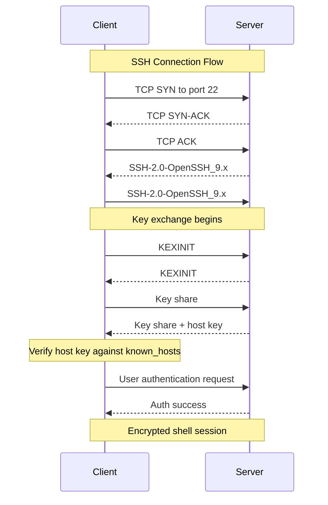

## 13.7.3 What happens first

The SSH server listens on TCP port 22.
The client initiates a TCP connection.
The peers exchange version strings.
They negotiate algorithms.
They perform key exchange.
The client validates the server host key.
Only after the secure channel exists does user authentication begin.

## 13.7.4 SSH handshake layers

| Step | Purpose |
|---|---|
| TCP connect | Build a reliable byte stream |
| Version exchange | Confirm SSH protocol version |
| Algorithm negotiation | Pick ciphers, MACs, key exchange, host key type |
| Key exchange | Build shared secrets |
| Host key verification | Prevent silent impersonation |
| User authentication | Prove user identity |
| Channel open | Start shell, exec, SFTP, or port forward |

## 13.7.5 Password authentication flow

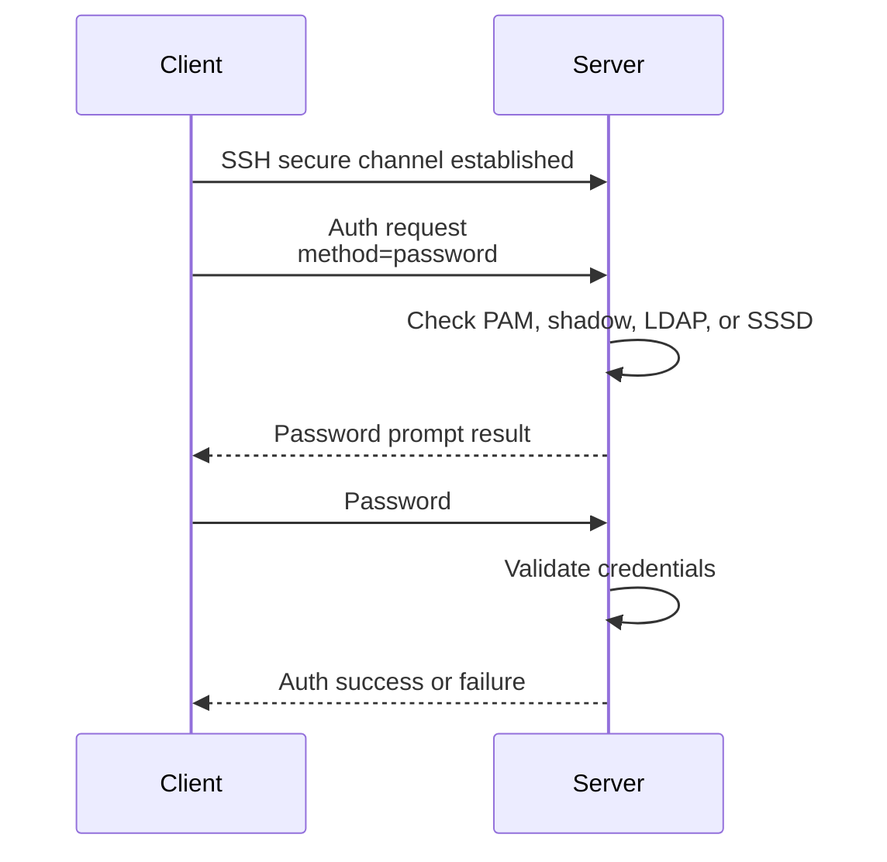

## 13.7.6 Key authentication flow

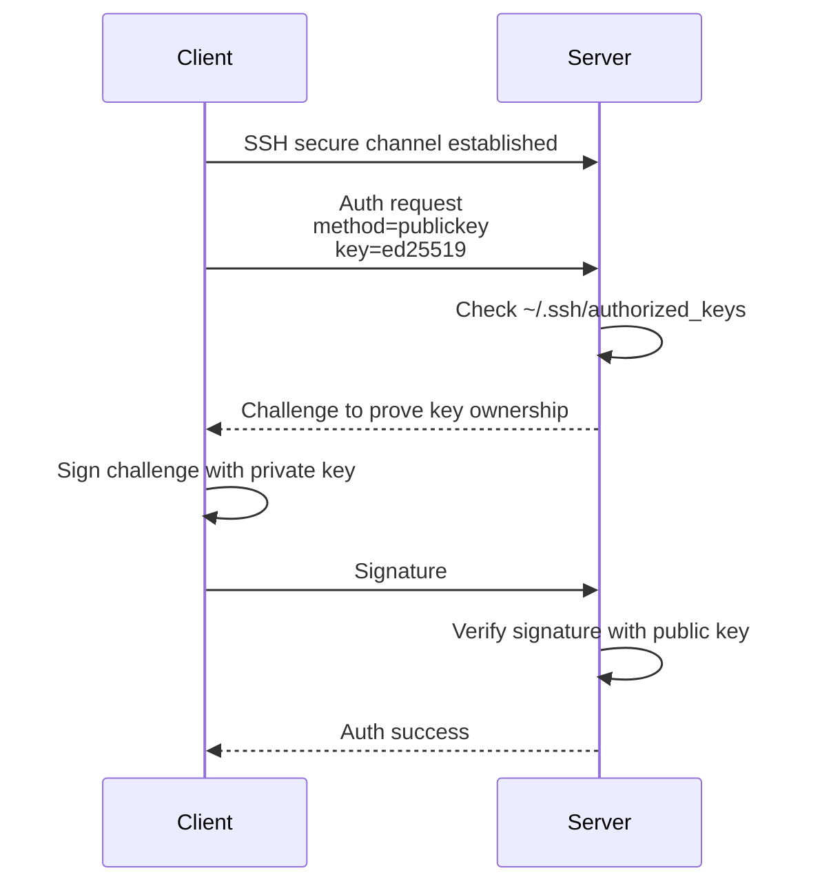

## 13.7.7 Password auth versus key auth

| Topic | Password auth | Public key auth |
|---|---|---|
| Secret sent to server | Password | No private key sent |
| Brute force exposure | High if allowed publicly | Lower when password auth is disabled |
| Automation | Poor | Excellent |
| MFA support | Possible through PAM | Possible with certificates or extra layers |
| Recommended for admins | Usually no | Yes |

## 13.7.8 Host keys versus user keys

Host keys identify the server.
User keys identify the user.
These are different trust relationships.

| Key type | Typical location | Purpose |
|---|---|---|
| Server host key | `/etc/ssh/ssh_host_*` | Proves server identity |
| User private key | `~/.ssh/id_ed25519` | Proves user identity |
| Authorized keys | `~/.ssh/authorized_keys` | Lists allowed user public keys |
| Known hosts | `~/.ssh/known_hosts` | Caches trusted host keys |

## 13.7.9 Core SSH files

```text
~/.ssh/config
~/.ssh/id_ed25519
~/.ssh/id_ed25519.pub
~/.ssh/authorized_keys
~/.ssh/known_hosts
/etc/ssh/sshd_config
```

## 13.7.10 Common SSH commands

```bash
ssh user@server.example.com
ssh -p 2222 user@server.example.com
ssh -i ~/.ssh/id_ed25519 user@server.example.com
ssh -v user@server.example.com
ssh-copy-id user@server.example.com
scp file.txt user@server.example.com:/tmp/
sftp user@server.example.com
```

## 13.7.11 Generating a key pair

```bash
ssh-keygen -t ed25519 -C 'admin@example.com'
```

## 13.7.12 Copying a key to a server

```bash
ssh-copy-id -i ~/.ssh/id_ed25519.pub user@server.example.com
```

## 13.7.13 Minimal client config example

```sshconfig
Host prod-web
    HostName web01.example.com
    User admin
    Port 22
    IdentityFile ~/.ssh/id_ed25519
    ServerAliveInterval 30
    ForwardAgent no
```

## 13.7.14 Local port forwarding

Local forwarding exposes a remote service on your local machine.
A common use is connecting securely to a remote database.

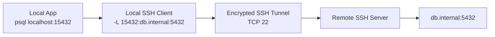

Command:

```bash
ssh -L 15432:db.internal:5432 admin@bastion.example.com
```

## 13.7.15 Remote port forwarding

Remote forwarding exposes a local service on the remote machine.
This is useful for publishing a service behind NAT to a bastion.

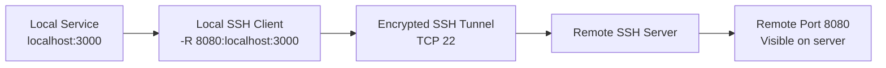

Command:

```bash
ssh -R 8080:localhost:3000 admin@bastion.example.com
```

## 13.7.16 Dynamic port forwarding

Dynamic forwarding turns SSH into a SOCKS proxy.
Applications that support SOCKS can send arbitrary traffic through the SSH tunnel.

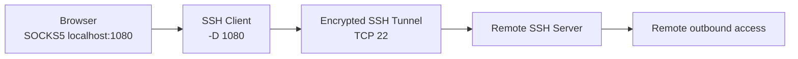

Command:

```bash
ssh -D 1080 admin@bastion.example.com
```

## 13.7.17 SSH agent forwarding

Agent forwarding lets the remote server ask your local SSH agent to sign authentication challenges.
Your private key stays on the local workstation.
However, the remote server can ask the agent to sign during the session.
That means agent forwarding should only be used on hosts you trust deeply.

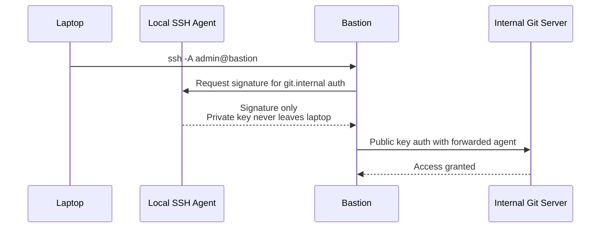

## 13.7.18 Agent forwarding command

```bash
ssh -A admin@bastion.example.com
```

## 13.7.19 SSH multiplexing

Multiplexing reuses one TCP connection for multiple SSH sessions.
It reduces connection setup overhead.

```sshconfig
Host *
    ControlMaster auto
    ControlPath ~/.ssh/cm-%r@%h:%p
    ControlPersist 10m
```

## 13.7.20 SSH hardening checklist

- disable password authentication when keys are deployed
- disable root login over SSH
- restrict allowed users or groups
- prefer `ed25519` or modern RSA settings
- rotate weak host keys out of service
- use fail2ban or network ACLs for internet-exposed hosts
- enable MFA where practical
- keep OpenSSH updated
- avoid unnecessary agent forwarding
- log and review authentication attempts

## 13.7.21 Example `sshd_config` hardening

```conf
Port 22
Protocol 2
PermitRootLogin no
PasswordAuthentication no
PubkeyAuthentication yes
PermitEmptyPasswords no
ChallengeResponseAuthentication no
UsePAM yes
AllowUsers admin deploy
X11Forwarding no
AllowAgentForwarding no
```

## 13.7.22 SSH troubleshooting commands

```bash
ssh -vvv user@server.example.com
sudo sshd -T | sort
sudo journalctl -u ssh -u sshd --since '1 hour ago'
ss -tnlp | grep ':22 '
sudo tcpdump -nn -i any tcp port 22
```

## 13.7.23 Common SSH failures

| Symptom | Likely cause |
|---|---|
| `Permission denied (publickey)` | Key not in `authorized_keys` or wrong permissions |
| Host key verification failed | Host key changed or DNS points elsewhere |
| Connection timed out | Network path or firewall issue |
| Connection refused | `sshd` not listening |
| Agent refused operation | Agent not loaded or forwarding blocked |

---

# 13.8 DNS — Domain Name System

DNS translates human-friendly names into machine-usable answers.
Most often that means mapping a hostname to an IP address.
But DNS also stores:
- mail routing information
- service locations
- verification tokens
- delegation data
- reverse mappings
- certificate authority policy hints

If DNS is slow, many other services appear slow.
If DNS is broken, many other services appear broken.
That is why DNS is one of the highest-value protocols to understand.

## 13.8.1 Default port and transport

| Service | Port | Transport | Notes |
|---|---:|---|---|
| DNS | 53 | UDP | Most queries and responses |
| DNS | 53 | TCP | Zone transfers, large responses, DNSSEC, retries |

## 13.8.2 Key DNS roles

| Role | What it does |
|---|---|
| Stub resolver | Small client-side resolver used by the OS or libc |
| Local cache | Short-circuit answers from `/etc/hosts` or caching service |
| Recursive resolver | Performs the full lookup on behalf of the client |
| Root server | Knows where TLD servers live |
| TLD server | Knows where delegated domains live |
| Authoritative server | Holds the final answers for the zone |

## 13.8.3 Full recursive lookup

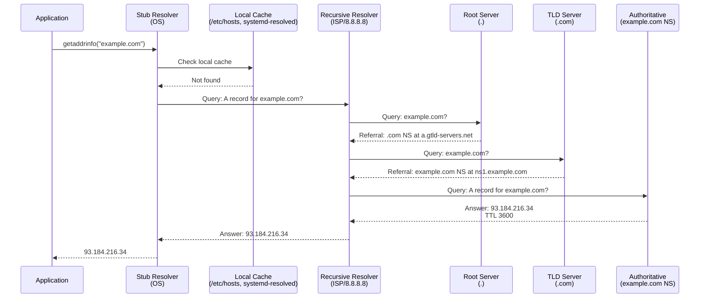

## 13.8.4 What the application actually calls

Many Linux applications do not call DNS directly.
They call a libc resolver function such as:
- `getaddrinfo()`
- `getnameinfo()`
- `res_query()`

That function may consult:
- `/etc/hosts`
- `systemd-resolved`
- `nscd`
- remote recursive resolvers from `/etc/resolv.conf`

## 13.8.5 Linux resolver path

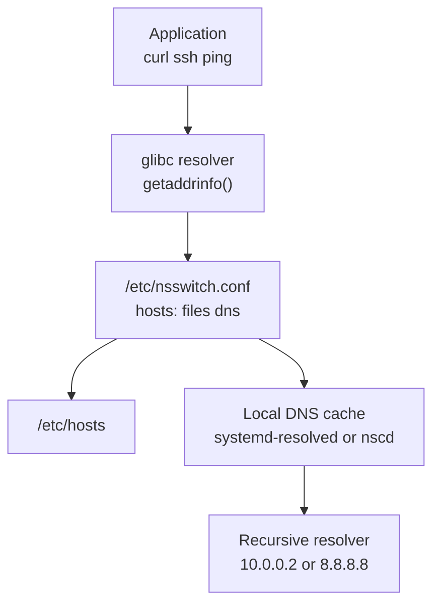

## 13.8.6 Local configuration files

### `/etc/resolv.conf`

```conf
nameserver 10.0.0.2
nameserver 1.1.1.1
search corp.example.com example.com
options timeout:2 attempts:2 ndots:1
```

### `/etc/hosts`

```text
127.0.0.1 localhost
192.168.50.10 bastion.example.com bastion
192.168.50.20 db01.example.com db01
```

### `/etc/nsswitch.conf`

```conf
hosts: files dns
```

This means the system checks `files` first.
Then it checks DNS.
That ordering matters.
A stale `/etc/hosts` entry can override perfectly healthy DNS.

## 13.8.7 Recursive versus iterative resolution

Recursive resolution means the client asks one resolver to get the final answer.
Iterative resolution means a server responds with a referral to another server.
Normal client behavior is recursive.
Normal server-to-server delegation behavior is iterative.

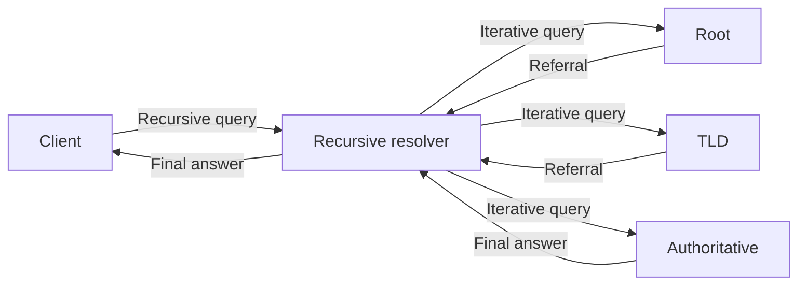

## 13.8.8 Caching and TTL

DNS answers are cached for their TTL.
TTL means time to live.
The cache entry expires when the TTL reaches zero.
Short TTLs give faster change propagation.
Long TTLs reduce query load.

Operational tradeoff:
- short TTLs are flexible
- long TTLs are efficient

## 13.8.9 Example `dig` usage

```bash
dig example.com
dig example.com A
dig example.com AAAA
dig example.com MX
dig example.com TXT
dig @8.8.8.8 example.com A
dig +short example.com
dig +trace example.com
dig -x 192.0.2.50
```

## 13.8.10 Example `host` usage

```bash
host example.com
host -t mx example.com
host -t txt example.com
host 192.0.2.50
```

## 13.8.11 Example `resolvectl` usage

```bash
resolvectl status
resolvectl query example.com
resolvectl flush-caches
```

## 13.8.12 Reading `dig` output

Important fields:
- `QUESTION SECTION`
- `ANSWER SECTION`
- `AUTHORITY SECTION`
- `ADDITIONAL SECTION`
- response code
- flags such as `aa`, `rd`, `ra`
- query time
- server used
- TTL per answer

## 13.8.13 Common DNS record types

| Record | Meaning | Typical example |
|---|---|---|
| `A` | Name to IPv4 address | `www.example.com -> 203.0.113.10` |
| `AAAA` | Name to IPv6 address | `www.example.com -> 2001:db8::10` |
| `CNAME` | Alias to another hostname | `api.example.com -> lb123.example.net` |
| `MX` | Mail exchanger | `example.com -> mail.example.com` |
| `TXT` | Free-form text | SPF, DKIM, domain validation |
| `NS` | Nameserver delegation | `example.com -> ns1.example.com` |
| `SOA` | Start of authority | Zone metadata |
| `PTR` | Reverse mapping | `10.113.0.203.in-addr.arpa -> web01.example.com` |
| `SRV` | Service locator | `_ldap._tcp.example.com` |
| `CAA` | Certificate authority authorization | Which CA may issue certs |

## 13.8.14 A record

An `A` record maps a name to an IPv4 address.
This is the most common DNS answer users think about.

Example zone line:

```dns
www.example.com. 3600 IN A 203.0.113.10
```

Lookup command:

```bash
dig www.example.com A +short
```

Typical use cases:
- websites
- APIs
- load balancer frontends
- bastion hosts

Visual flow:

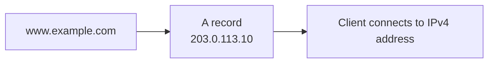

## 13.8.15 AAAA record

An `AAAA` record maps a name to an IPv6 address.
It is the IPv6 equivalent of an `A` record.

Example zone line:

```dns
www.example.com. 3600 IN AAAA 2001:db8:10::10
```

Lookup command:

```bash
dig www.example.com AAAA +short
```

Visual flow:

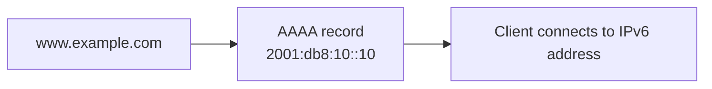

## 13.8.16 CNAME record

A `CNAME` record creates an alias from one name to another name.
The final target still needs an `A` or `AAAA` record.

Example zone lines:

```dns
api.example.com. 300 IN CNAME prod-lb.us-east-1.elb.amazonaws.com.
prod-lb.us-east-1.elb.amazonaws.com. 60 IN A 198.51.100.20
```

Lookup command:

```bash
dig api.example.com CNAME
```

Visual flow:

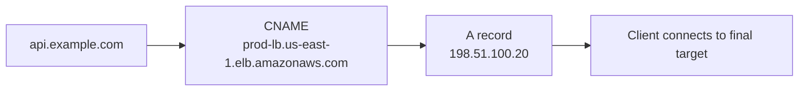

Operational note:
A `CNAME` cannot coexist with most other record types at the same exact owner name.
That is why zone apex aliases often need provider-specific `ALIAS` or `ANAME` features.

## 13.8.17 MX record

An `MX` record tells the world which mail server accepts mail for a domain.
It includes a priority value.
Lower numbers are preferred.

Example zone lines:

```dns
example.com. 3600 IN MX 10 mail1.example.com.
example.com. 3600 IN MX 20 mail2.example.com.
mail1.example.com. 3600 IN A 203.0.113.25
mail2.example.com. 3600 IN A 203.0.113.26
```

Lookup command:

```bash
dig example.com MX
```

Visual flow:

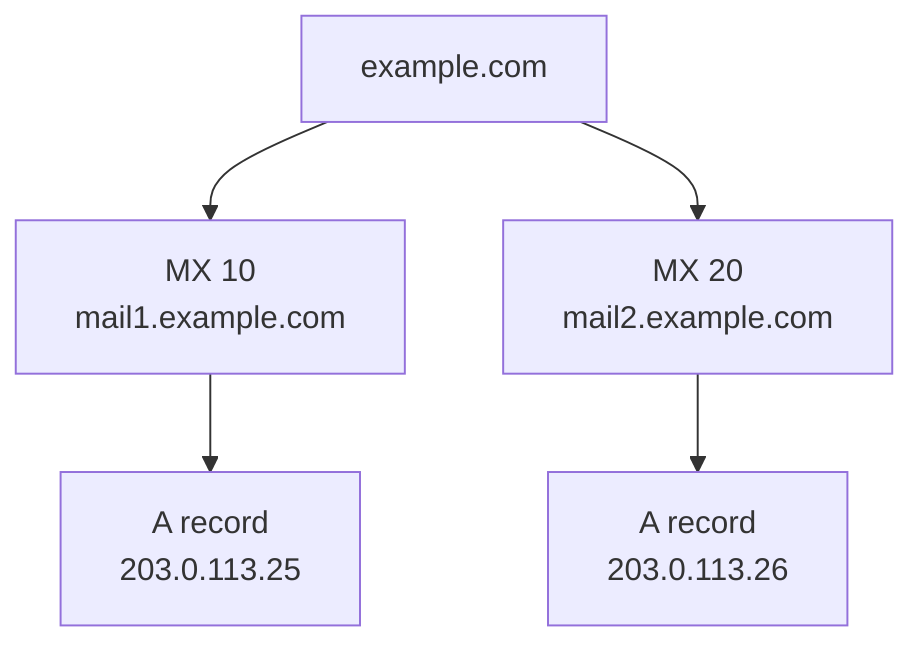

## 13.8.18 TXT record

A `TXT` record carries arbitrary text.
Common uses include:
- SPF policy
- DKIM public key material
- DMARC policy
- domain ownership validation
- service verification tokens

Example zone lines:

```dns
example.com. 300 IN TXT "v=spf1 ip4:203.0.113.25 include:_spf.google.com -all"
_dmarc.example.com. 300 IN TXT "v=DMARC1; p=quarantine; rua=mailto:dmarc@example.com"
```

Lookup command:

```bash
dig example.com TXT
```

Visual flow:

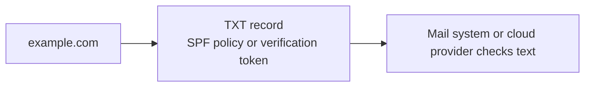

## 13.8.19 NS record

An `NS` record delegates a zone to authoritative nameservers.
At the parent zone, this is the delegation point.
Inside the zone, it states the authoritative nameservers for the zone itself.

Example zone lines:

```dns
example.com. 172800 IN NS ns1.example.net.
example.com. 172800 IN NS ns2.example.net.
```

Lookup command:

```bash
dig example.com NS
```

Visual flow:

```mermaid
graph LR
    PARENT["Parent zone<br/>.com"] --> DELEG["NS records<br/>ns1.example.net<br/>ns2.example.net"]
    DELEG --> AUTH["Authoritative servers for example.com"]
```

## 13.8.20 SOA record

The `SOA` record defines essential zone metadata.
It includes:
- primary nameserver
- responsible mailbox
- serial number
- refresh interval
- retry interval
- expire timer
- minimum negative cache TTL

Example zone line:

```dns
example.com. 3600 IN SOA ns1.example.net. hostmaster.example.com. 2025060201 7200 3600 1209600 3600
```

Lookup command:

```bash
dig example.com SOA
```

Visual flow:

```mermaid
graph LR
    ZONE["example.com zone"] --> SOA["SOA<br/>serial refresh retry expire minimum"]
    SOA --> SECONDARY["Secondary DNS servers use metadata for transfers"]
```

## 13.8.21 PTR record

A `PTR` record maps an IP address back to a hostname.
This is reverse DNS.
It is common for:
- mail server reputation checks
- logging clarity
- service validation

Example zone line:

```dns
10.113.0.203.in-addr.arpa. 3600 IN PTR web01.example.com.
```

Lookup command:

```bash
dig -x 203.0.113.10
```

Visual flow:

```mermaid
graph LR
    IP["203.0.113.10"] --> REVERSE["PTR lookup<br/>10.113.0.203.in-addr.arpa"]
    REVERSE --> NAME["web01.example.com"]
```

## 13.8.22 SRV record

An `SRV` record identifies the host and port for a named service.
It is common in LDAP, Kerberos, SIP, and some service discovery patterns.

Example zone line:

```dns
_ldap._tcp.example.com. 3600 IN SRV 10 5 389 ldap01.example.com.
```

Fields are:
- priority
- weight
- port
- target

Lookup command:

```bash
dig _ldap._tcp.example.com SRV
```

Visual flow:

```mermaid
graph LR
    SERVICE["_ldap._tcp.example.com"] --> SRV["SRV<br/>priority 10<br/>weight 5<br/>port 389<br/>ldap01.example.com"]
    SRV --> CLIENT["LDAP client connects to ldap01.example.com:389"]
```

## 13.8.23 CAA record

A `CAA` record states which certificate authorities may issue certificates for the domain.
It helps reduce unauthorized certificate issuance.

Example zone line:

```dns
example.com. 3600 IN CAA 0 issue "letsencrypt.org"
```

Lookup command:

```bash
dig example.com CAA
```

Visual flow:

```mermaid
graph LR
    DOMAIN["example.com"] --> CAA["CAA<br/>issue letsencrypt.org"]
    CAA --> CA["CA checks policy before issuing certificate"]
```

## 13.8.24 DNS response codes you should know

| Code | Meaning | What it suggests |
|---|---|---|
| `NOERROR` | Query succeeded | Normal answer or empty answer set |
| `NXDOMAIN` | Name does not exist | Wrong hostname or missing zone entry |
| `SERVFAIL` | Server failed to answer | Upstream issue, DNSSEC issue, or broken authority |
| `REFUSED` | Server rejected query | ACL or policy block |
| `FORMERR` | Format error | Malformed query or incompatible feature |

## 13.8.25 DNS over UDP and TCP

Most small queries use UDP.
TCP is used when:
- the response is too large
- EDNS or DNSSEC increases size
- a truncated UDP answer sets the `TC` bit
- a zone transfer occurs

```mermaid
graph LR
    Q["DNS query"] --> SIZE["Is response small enough?"]
    SIZE -->|"Yes"| UDP["UDP 53"]
    SIZE -->|"No"| TCP["TCP 53"]
    TCP --> XFER["Large answer or AXFR/IXFR"]
```

## 13.8.26 Zone transfer idea

A secondary nameserver needs the zone contents from the primary.
That transfer uses TCP.
Full transfer is `AXFR`.
Incremental transfer is `IXFR`.

```mermaid
sequenceDiagram
    participant Secondary
    participant Primary
    Secondary->>Primary: SOA query for example.com
    Primary-->>Secondary: Higher serial available
    Secondary->>Primary: AXFR or IXFR request over TCP 53
    Primary-->>Secondary: Zone data stream
    Secondary->>Secondary: Replace or update local zone copy
```

## 13.8.27 Example BIND zone fragment

```dns
$TTL 3600
@   IN SOA ns1.example.net. hostmaster.example.com. 2025060201 7200 3600 1209600 3600
    IN NS  ns1.example.net.
    IN NS  ns2.example.net.
@   IN MX  10 mail.example.com.
@   IN A   203.0.113.10
www IN A   203.0.113.10
api IN CNAME www
mail IN A  203.0.113.25
```

## 13.8.28 Example DNS troubleshooting workflow

1. Check local `/etc/hosts`.
2. Check resolver configuration.
3. Query the configured recursive resolver.
4. Query a known-good public resolver.
5. Query authoritative servers directly.
6. Check TTL and cached old answers.
7. If mail is affected, check `MX`, `SPF`, `DKIM`, and reverse DNS.

## 13.8.29 Helpful troubleshooting commands

```bash
getent hosts example.com
cat /etc/resolv.conf
grep '^hosts:' /etc/nsswitch.conf
resolvectl query example.com
resolvectl statistics
nslookup example.com
host -t ns example.com
dig +trace example.com
```

## 13.8.30 Typical DNS failure patterns

| Symptom | Probable cause |
|---|---|
| Local host resolves wrong IP | Stale `/etc/hosts` or cache |
| Only one client fails | Local resolver config or VPN split DNS |
| Public users fail but internal users succeed | Split-horizon DNS or private-only records |
| Mail rejected | Missing PTR, SPF, DKIM, or MX |
| `SERVFAIL` from validating resolver | DNSSEC or authority problem |
| Random latency spikes | Slow recursive resolver or packet loss |

## 13.8.31 Split-horizon DNS

Split-horizon means different clients receive different answers for the same name.
Internal clients may get private IPs.
External clients may get public IPs.
This is useful but can complicate troubleshooting.

```mermaid
graph TD
    NAME["app.example.com"] --> INT["Internal resolver<br/>10.0.0.25"]
    NAME --> EXT["Public resolver<br/>198.51.100.25"]
    INT --> PRIV["Returns 10.10.20.30"]
    EXT --> PUB["Returns 203.0.113.30"]
```

## 13.8.32 DNS security notes

- plain DNS has no confidentiality
- clients usually trust the recursive resolver fully
- cache poisoning and spoofing are historical risks
- DNSSEC adds authenticity but not privacy
- DNS over TLS and DNS over HTTPS add privacy in some designs
- zone transfers should be restricted
- public recursive resolvers should not be exposed unnecessarily

## 13.8.33 DNS mini lab

Try these commands on a Linux system:

```bash
dig example.com
dig example.com MX
dig example.com TXT
dig +short example.com
host example.com
getent hosts example.com
```

Observe:
- how long answers are cached
- whether IPv6 answers appear
- which nameserver is used
- whether the system checks `/etc/hosts` first

---

# 13.9 DHCP — Dynamic Host Configuration Protocol

DHCP gives a device its network identity automatically.
Without DHCP, many hosts would require manual configuration.
That is manageable for a few servers.
It is not manageable for large fleets of laptops, phones, printers, VMs, and IoT devices.

A DHCP server typically provides:
- IP address
- subnet mask
- default gateway
- DNS servers
- lease time
- optional search domain
- optional NTP server
- other vendor-specific options

## 13.9.1 Default ports and transport

| Role | Port | Transport |
|---|---:|---|
| DHCP server | 67 | UDP |
| DHCP client | 68 | UDP |

## 13.9.2 Why DHCP uses broadcast first

A new client often has no IP address yet.
It may not know the subnet.
It may not know the gateway.
It therefore begins with a broadcast request.

## 13.9.3 The DORA process

DORA stands for:
- Discover
- Offer
- Request
- Acknowledge

```mermaid
sequenceDiagram
    participant Client as 💻 New Device<br/>(No IP yet)
    participant Server as 🖥️ DHCP Server<br/>(192.168.1.1)
    Note over Client,Server: DORA Process
    Client->>Server: 1. DISCOVER (broadcast)<br/>"I need an IP address!"
    Note right of Server: Server checks available pool
    Server-->>Client: 2. OFFER<br/>"How about 192.168.1.50?"<br/>Subnet 255.255.255.0<br/>Gateway 192.168.1.1<br/>DNS 8.8.8.8<br/>Lease 24 hours
    Client->>Server: 3. REQUEST<br/>"I'll take 192.168.1.50"
    Server-->>Client: 4. ACK<br/>"It's yours for 24 hours"
    Note over Client: Client configures interface<br/>IP 192.168.1.50/24
    Note over Client,Server: Lease Renewal at 50%
    Client->>Server: REQUEST (unicast)<br/>"Can I keep 192.168.1.50?"
    Server-->>Client: ACK<br/>"Renewed for another 24 hours"
```

## 13.9.4 Step-by-step explanation

### Discover

The client sends a broadcast because it does not yet know the server.
The source IP is usually `0.0.0.0`.
The destination is broadcast.

### Offer

One or more servers may respond with an offer.
The offer includes:
- proposed IP address
- subnet mask
- gateway
- DNS servers
- lease duration

### Request

The client selects one offer and requests it.
This informs other DHCP servers that their offers were not chosen.

### ACK

The chosen server confirms the lease.
The client then applies the configuration.

## 13.9.5 Broadcast view of DORA

```mermaid
graph LR
    C1["Client<br/>0.0.0.0"] --> D["DHCPDISCOVER<br/>Broadcast"]
    D --> S1["DHCP Server"]
    S1 --> O["DHCPOFFER<br/>192.168.1.50"]
    O --> C2["Client"]
    C2 --> R["DHCPREQUEST<br/>Broadcast or directed"]
    R --> S2["DHCP Server"]
    S2 --> A["DHCPACK"]
    A --> CFG["Client configures interface"]
```

## 13.9.6 What a lease really means

A lease is temporary permission to use an address.
The address belongs to the network policy.
The client only borrows it.
This allows:
- reuse of addresses
- easier inventory
- automatic recovery from stale clients

## 13.9.7 Lease timers

Important timers:
- `T1` usually 50 percent of lease time
- `T2` usually 87.5 percent of lease time
- expiration at 100 percent

Meaning:
- at `T1`, the client tries to renew with the original server
- at `T2`, it tries to rebind with any available server
- at expiration, the address is no longer valid

```mermaid
graph LR
    START["Lease start"] --> T1["50%<br/>Renew"]
    T1 --> T2["87.5%<br/>Rebind"]
    T2 --> END["100%<br/>Lease expires"]
```

## 13.9.8 Renewal flow

```mermaid
sequenceDiagram
    participant Client
    participant Server
    Note over Client,Server: T1 renewal
    Client->>Server: DHCPREQUEST for current lease
    Server-->>Client: DHCPACK with new expiration
    Note over Client,Server: T2 rebind if original server does not answer
    Client->>Server: DHCPREQUEST to any server
    Server-->>Client: DHCPACK or DHCPNAK
```

## 13.9.9 DHCP relay agents

Broadcast traffic does not cross routers by default.
That is why large routed networks often use a DHCP relay.
The relay listens for client broadcasts on a subnet and forwards them to a central DHCP server.

```mermaid
graph LR
    CLIENT["Client on VLAN 20"] --> RELAY["Router or relay agent<br/>ip helper-address"]
    RELAY --> SERVER["Central DHCP server"]
    SERVER --> RELAY
    RELAY --> CLIENT
```

## 13.9.10 Reservations

A reservation gives the same IP to a known MAC address every time.
This is useful for:
- printers
- IP phones
- appliances
- servers that should be stable without static config on the host

## 13.9.11 Static IP versus reservation

| Approach | Where managed | Best for |
|---|---|---|
| Static IP on host | On the device itself | Fixed servers with tight control |
| DHCP reservation | On the DHCP server | Centrally managed predictable clients |
| Dynamic lease | On the DHCP server | General endpoints |

## 13.9.12 Linux DHCP client tools

Different Linux distributions may use:
- `dhclient`
- `systemd-networkd`
- `NetworkManager`
- `dhcpcd`

Useful commands:

```bash
ip addr
ip route
resolvectl status
nmcli device show
journalctl -u NetworkManager --since '30 min ago'
sudo dhclient -v eth0
```

## 13.9.13 Example Linux troubleshooting flow

1. Check link state with `ip link`.
2. Check whether the NIC has a carrier.
3. Run `ip addr` to see if an address exists.
4. Check default route.
5. Check DNS servers.
6. Renew the lease.
7. Watch logs.
8. Capture DHCP packets if necessary.

## 13.9.14 DHCP packet capture example

```bash
sudo tcpdump -nn -i any port 67 or port 68
```

Expected packet names:
- `DHCPDISCOVER`
- `DHCPOFFER`
- `DHCPREQUEST`
- `DHCPACK`

## 13.9.15 Common DHCP failure patterns

| Symptom | Likely cause |
|---|---|
| No IP address at all | DHCP server unreachable or relay missing |
| APIPA address `169.254.x.x` | Lease failed and link-local fallback used |
| Wrong subnet | Misconfigured scope or relay |
| No default route | Missing DHCP option for router |
| DNS missing | DHCP option not supplied |
| Lease denied | Pool exhausted or MAC policy block |

## 13.9.16 DHCP security notes

DHCP itself is not authenticated strongly in common deployments.
That means rogue servers are possible on untrusted networks.
Protect against this with:
- switch DHCP snooping
- port security
- trusted uplinks only
- network segmentation

## 13.9.17 Example `dnsmasq` snippet

```conf
dhcp-range=192.168.1.50,192.168.1.150,255.255.255.0,24h
dhcp-option=option:router,192.168.1.1
dhcp-option=option:dns-server,1.1.1.1,8.8.8.8
```

## 13.9.18 DHCP mini lab

Try to answer these on a lab machine:
- what address was leased
- how long is the lease
- which DNS server was assigned
- which default gateway was assigned
- what happens when you renew

Useful commands:

```bash
ip addr show
ip route
resolvectl dns
sudo dhclient -r eth0
sudo dhclient -v eth0
```

---

# 13.10 NFS — Network File System

NFS allows Linux systems to share directories over the network as if they were local filesystems.
It is common in:
- legacy enterprise environments
- virtualization clusters
- research compute farms
- internal shared asset stores
- container host support tooling

## 13.10.1 Default port and transport

| Service | Port | Transport |
|---|---:|---|
| NFSv4 | 2049 | TCP |
| rpcbind or portmapper | 111 | TCP and UDP |
| mountd and helpers | Variable | Often used more with older NFS versions |

## 13.10.2 Why NFS matters operationally

If an NFS mount is slow:
- shells may hang on `ls`
- application startups may stall
- backups may block
- jobs may wait on file locks or metadata

If an NFS mount disappears:
- services can block in uninterruptible sleep
- boot can slow if `fstab` is not tuned properly
- data consistency concerns can appear

## 13.10.3 Basic NFS flow

```mermaid
sequenceDiagram
    participant Client as NFS Client
    participant RPC as RPC or Portmapper
    participant NFS as NFS Server
    participant FS as Server Filesystem
    Client->>RPC: Query: NFS service port?
    RPC-->>Client: NFS is on port 2049
    Client->>NFS: MOUNT /srv/nfs/shared
    NFS-->>Client: File handle + OK
    Note over Client,FS: File operations
    Client->>NFS: LOOKUP report.txt
    NFS->>FS: stat /srv/nfs/shared/report.txt
    FS-->>NFS: File handle
    NFS-->>Client: File handle
    Client->>NFS: READ handle offset 0 count 4096
    NFS->>FS: read data
    FS-->>NFS: data
    NFS-->>Client: 4096 bytes
```

## 13.10.4 NFS architecture view

```mermaid
graph LR
    APP["Application on client"] --> VFS["Linux VFS"]
    VFS --> KCLI["Kernel NFS client"]
    KCLI --> NET["TCP 2049"]
    NET --> KSRV["Kernel NFS server"]
    KSRV --> XFS["Exported filesystem"]
```

## 13.10.5 NFSv3 versus NFSv4

| Version | Notes |
|---|---|
| NFSv3 | Older, more helper daemons, more port complexity |
| NFSv4 | Cleaner design, stronger integration, one main port 2049 |

In modern Linux deployments, prefer NFSv4 unless you have a compatibility constraint.

## 13.10.6 Exports on the server

The NFS server exports directories to selected clients.
The export policy lives in `/etc/exports`.

Example:

```exports
/srv/nfs/shared 192.168.1.0/24(rw,sync,no_subtree_check)
/srv/nfs/readonly 192.168.1.0/24(ro,sync,no_subtree_check)
```

## 13.10.7 Meaning of common export options

| Option | Meaning |
|---|---|
| `rw` | Read and write |
| `ro` | Read only |
| `sync` | Reply after data is committed more safely |
| `async` | Faster but riskier if server crashes |
| `no_subtree_check` | Disable subtree verification |
| `root_squash` | Map remote root to anonymous user |
| `no_root_squash` | Do not map remote root, usually avoid |

## 13.10.8 Server setup example

```bash
sudo apt install -y nfs-kernel-server
sudo mkdir -p /srv/nfs/shared
sudo chown -R nobody:nogroup /srv/nfs/shared
echo '/srv/nfs/shared 192.168.1.0/24(rw,sync,no_subtree_check,root_squash)' | sudo tee -a /etc/exports
sudo exportfs -ra
sudo systemctl enable --now nfs-server nfs-kernel-server
```

## 13.10.9 Client mount example

```bash
sudo mkdir -p /mnt/shared
sudo mount -t nfs nfs01.example.com:/srv/nfs/shared /mnt/shared
mount | grep nfs
```

## 13.10.10 Persistent mount example

```fstab
nfs01.example.com:/srv/nfs/shared  /mnt/shared  nfs4  defaults,_netdev,x-systemd.automount,nofail  0  0
```

Why these options matter:
- `_netdev` tells the system it depends on networking
- `x-systemd.automount` mounts on access instead of at boot
- `nofail` avoids hard boot failure if the share is unavailable

## 13.10.11 Read and write path

```mermaid
sequenceDiagram
    participant App as Application
    participant Client as NFS Client
    participant Server as NFS Server
    participant Disk as Server Disk
    App->>Client: open("report.txt")
    Client->>Server: LOOKUP report.txt
    Server-->>Client: File handle
    App->>Client: read()
    Client->>Server: READ handle offset count
    Server->>Disk: fetch blocks
    Disk-->>Server: blocks
    Server-->>Client: data
    Client-->>App: bytes returned
```

## 13.10.12 File locking note

NFS supports advisory locking semantics.
Applications that assume local-disk semantics can behave poorly if they are not NFS-aware.
Always validate workload behavior before placing critical databases on NFS.

## 13.10.13 Identity and permissions

Permissions are still Unix permissions.
That means UID and GID mapping matters.
If the client says a file is owned by UID 1001, the server interprets that UID numerically.
Mismatched identities can cause confusing permission problems.

## 13.10.14 Root squash

`root_squash` is a key safety control.
It maps remote root user activity to an anonymous identity on the server.
Without it, root on any client could act like root on the export.

```mermaid
graph LR
    RROOT["Remote root user"] --> SQUASH["root_squash"]
    SQUASH --> ANON["anonymous uid or gid on server"]
```

## 13.10.15 Useful inspection commands

```bash
showmount -e nfs01.example.com
rpcinfo -p nfs01.example.com
nfsstat -m
findmnt -t nfs,nfs4
exportfs -v
```

## 13.10.16 Packet capture example

```bash
sudo tcpdump -nn -i any host nfs01.example.com and port 2049
```

## 13.10.17 Common NFS problems

| Symptom | Likely cause |
|---|---|
| `mount.nfs: access denied` | Export does not allow this client |
| Permission denied on files | UID or GID mismatch or root squash expected |
| Mount hangs | Firewall or server unreachable |
| Stale file handle | File changed or export reconfigured underneath clients |
| Slow reads | Network latency, small rsize or wsize, or overloaded storage |

## 13.10.18 Firewall considerations

Open only the required ports.
NFSv4 is much simpler to firewall than old NFSv3 helper ports.
That is one more reason to prefer NFSv4.

## 13.10.19 NFS security guidance

- keep NFS on trusted networks
- use export restrictions by subnet or host
- keep `root_squash` enabled
- prefer read-only exports where possible
- avoid exposing NFS to the public internet
- consider Kerberos for stronger authentication in sensitive environments

## 13.10.20 NFS mini lab

On the server:

```bash
sudo exportfs -v
sudo ss -tnlp | grep 2049
```

On the client:

```bash
showmount -e nfs01.example.com
sudo mount -t nfs4 nfs01.example.com:/srv/nfs/shared /mnt/shared
ls -la /mnt/shared
```

Observe:
- how ownership appears
- whether writes succeed
- whether remount after reboot works cleanly

---

# 13.11 SMTP, IMAP, and POP3 — How Email Moves

Email on the internet is not a single protocol.
It is a workflow built from multiple protocols.
SMTP sends and relays mail.
IMAP synchronizes mailbox contents.
POP3 downloads mail in a simpler model.
DNS supports the system through MX records.
TLS protects many modern sessions.

## 13.11.1 Core roles in mail delivery

| Role | Function |
|---|---|
| Mail user agent | User-facing client such as Thunderbird, Outlook, or a webmail backend |
| Submission server | Authenticated SMTP endpoint for sending user mail |
| Relay server | Passes mail between mail systems |
| Destination MX host | Receives mail for a domain |
| Mailbox store | Holds the user's messages |
| IMAP server | Lets clients sync the mailbox |

## 13.11.2 Important ports

| Protocol | Port | Usage |
|---|---:|---|
| SMTP | 25 | Server-to-server relay |
| SMTPS | 465 | Implicit TLS submission |
| SMTP submission | 587 | Authenticated submission, often STARTTLS |
| IMAP | 143 | Mail access, plain or STARTTLS |
| IMAPS | 993 | IMAP over implicit TLS |
| POP3 | 110 | Older retrieval model |
| POP3S | 995 | POP3 over implicit TLS |

## 13.11.3 Basic email delivery flow

```mermaid
sequenceDiagram
    participant Sender as 📧 sender@gmail.com
    participant Gmail as Gmail SMTP<br/>(smtp.gmail.com:587)
    participant DNS as DNS
    participant Receiver as Receiver SMTP<br/>(mail.example.com:25)
    participant Inbox as 📬 user@example.com
    Sender->>Gmail: Send email to user@example.com
    Gmail->>DNS: MX record for example.com?
    DNS-->>Gmail: mail.example.com priority 10
    Gmail->>Receiver: EHLO gmail.com
    Receiver-->>Gmail: 250 OK
    Gmail->>Receiver: MAIL FROM:<sender@gmail.com>
    Receiver-->>Gmail: 250 OK
    Gmail->>Receiver: RCPT TO:<user@example.com>
    Receiver-->>Gmail: 250 OK
    Gmail->>Receiver: DATA
    Gmail->>Receiver: Subject: Hello...<CRLF>.<CRLF>
    Receiver-->>Gmail: 250 Message accepted
    Note over Receiver,Inbox: Mail delivered into mailbox store
    Inbox->>Receiver: IMAP fetch new mail
```

## 13.11.4 Submission versus relay

Users usually send mail to port `587` or `465`.
Servers relay mail to other servers on port `25`.
That distinction matters.
A host that allows arbitrary relay on port `25` is a serious security problem.

## 13.11.5 SMTP conversation basics

A classic SMTP session contains commands such as:
- `EHLO`
- `MAIL FROM`
- `RCPT TO`
- `DATA`
- `QUIT`

Example:

```text
EHLO client.example.com
MAIL FROM:<alice@example.net>
RCPT TO:<bob@example.com>
DATA
Subject: Test

Hello Bob
.
QUIT
```

## 13.11.6 SMTP command sequence diagram

```mermaid
sequenceDiagram
    participant Client
    participant Server
    Client->>Server: TCP connect to 25 or 587
    Server-->>Client: 220 mail.example.com ESMTP ready
    Client->>Server: EHLO client.example.net
    Server-->>Client: 250 capabilities
    Client->>Server: STARTTLS or AUTH if required
    Client->>Server: MAIL FROM:<alice@example.net>
    Server-->>Client: 250 OK
    Client->>Server: RCPT TO:<bob@example.com>
    Server-->>Client: 250 OK
    Client->>Server: DATA
    Server-->>Client: 354 End data with <CRLF>.<CRLF>
    Client->>Server: Message body
    Client->>Server: .
    Server-->>Client: 250 queued as 12345
    Client->>Server: QUIT
    Server-->>Client: 221 Bye
```

## 13.11.7 MX lookup before delivery

Before one server can deliver mail to another domain, it must ask DNS where to send the message.
That is what the MX record provides.

```mermaid
graph LR
    SENDER["Sending mail server"] --> DNS["DNS MX lookup<br/>example.com"]
    DNS --> MX["mail.example.com"]
    MX --> IP["A or AAAA lookup"]
    IP --> DEST["Destination SMTP server"]
```

## 13.11.8 Queuing and retry behavior

Mail is store-and-forward.
That means if the destination is temporarily unavailable, the sender usually queues and retries later.
This is very different from an interactive protocol like SSH.

```mermaid
graph TD
    MSG["Message created"] --> TRY1["Attempt delivery"]
    TRY1 -->|"250 OK"| DONE["Delivered"]
    TRY1 -->|"4xx temporary failure"| QUEUE["Keep in queue"]
    QUEUE --> RETRY["Retry later"]
    RETRY --> DONE
    TRY1 -->|"5xx permanent failure"| BOUNCE["Generate bounce"]
```

## 13.11.9 STARTTLS versus implicit TLS

| Mode | Port | Meaning |
|---|---:|---|
| SMTP plain then STARTTLS | 25 or 587 | Upgrade an existing cleartext connection to TLS |
| SMTPS implicit TLS | 465 | Start TLS immediately after TCP connect |

## 13.11.10 STARTTLS flow

```mermaid
sequenceDiagram
    participant Client
    participant Server
    Client->>Server: EHLO client.example.com
    Server-->>Client: 250 STARTTLS AUTH SIZE
    Client->>Server: STARTTLS
    Server-->>Client: 220 Ready to start TLS
    Note over Client,Server: TLS handshake occurs
    Client->>Server: EHLO client.example.com
    Server-->>Client: 250 AUTH PLAIN LOGIN
```

## 13.11.11 IMAP retrieval flow

IMAP keeps mail on the server and synchronizes state.
That means:
- folders stay on the server
- read or unread state can sync across devices
- search can happen server-side
- message flags can be consistent across clients

```mermaid
sequenceDiagram
    participant User as Mail Client
    participant IMAP as IMAP Server
    participant Store as Mailbox Store
    User->>IMAP: Connect to 993
    User->>IMAP: LOGIN or AUTHENTICATE
    IMAP-->>User: OK authenticated
    User->>IMAP: SELECT INBOX
    IMAP->>Store: Open mailbox
    Store-->>IMAP: Message index
    User->>IMAP: FETCH 1:* FLAGS BODY.PEEK[HEADER]
    IMAP-->>User: Message headers and flags
    User->>IMAP: FETCH 42 BODY[]
    IMAP-->>User: Full message body
```

## 13.11.12 POP3 retrieval flow

POP3 is simpler.
Traditionally it downloads messages and may delete them from the server.
It is less suited for multi-device synchronization.

```mermaid
sequenceDiagram
    participant User as Mail Client
    participant POP as POP3 Server
    User->>POP: Connect to 110 or 995
    POP-->>User: +OK server ready
    User->>POP: USER alice
    User->>POP: PASS secret
    POP-->>User: +OK mailbox locked
    User->>POP: LIST
    POP-->>User: Message list
    User->>POP: RETR 1
    POP-->>User: Full message
    User->>POP: QUIT
```

## 13.11.13 IMAP versus POP3

| Topic | IMAP | POP3 |
|---|---|---|
| Server-side folders | Yes | Minimal |
| Multi-device sync | Excellent | Weak |
| Read state sync | Yes | Usually no |
| Offline download | Possible | Primary model |
| Modern recommendation | Preferred | Rare unless legacy need |

## 13.11.14 Mail authentication and policy records

Modern email depends heavily on DNS text records for trust policy.
Important terms:
- SPF
- DKIM
- DMARC

### SPF

SPF states which servers may send mail for a domain.

```dns
example.com. 300 IN TXT "v=spf1 ip4:203.0.113.25 include:_spf.google.com -all"
```

### DKIM

DKIM signs messages cryptographically.
The public key is published in DNS.

```dns
selector1._domainkey.example.com. 300 IN TXT "v=DKIM1; k=rsa; p=MIIBIjANBg..."
```

### DMARC

DMARC publishes policy and reporting instructions.

```dns
_dmarc.example.com. 300 IN TXT "v=DMARC1; p=quarantine; rua=mailto:dmarc@example.com"
```

## 13.11.15 Mail delivery path with policy checks

```mermaid
graph TD
    MSG["Message arrives"] --> SPF["Check SPF"]
    SPF --> DKIM["Check DKIM"]
    DKIM --> DMARC["Evaluate DMARC alignment"]
    DMARC --> PASS["Accept or score positively"]
    DMARC --> FAIL["Quarantine or reject"]
```

## 13.11.16 Useful Linux mail diagnostics

```bash
dig example.com MX
dig example.com TXT
dig _dmarc.example.com TXT
openssl s_client -starttls smtp -connect mail.example.com:25
openssl s_client -connect mail.example.com:465
swaks --to user@example.com --server mail.example.com
```

## 13.11.17 Reading the SMTP queue

Different MTAs expose queue information differently.
Examples:
- Postfix uses `mailq` or `postqueue -p`
- Exim uses `exim -bp`
- Sendmail uses `mailq`

Postfix examples:

```bash
mailq
postqueue -p
postfix status
sudo journalctl -u postfix --since '1 hour ago'
```

## 13.11.18 Common SMTP response classes

| Code | Meaning |
|---|---|
| `220` | Service ready |
| `221` | Service closing transmission channel |
| `250` | Requested action completed |
| `354` | Start mail input |
| `421` | Service not available |
| `450` | Mailbox unavailable temporarily |
| `451` | Local processing error |
| `550` | Mailbox unavailable permanently |
| `554` | Transaction failed |

## 13.11.19 Common mail problems

| Symptom | Likely cause |
|---|---|
| Outbound mail stuck in queue | Remote MX unavailable or blocked |
| Mail rejected as spam | SPF, DKIM, DMARC, PTR, or reputation issue |
| Client cannot send | Wrong submission port or auth required |
| Client cannot read mail | IMAP or POP3 auth or TLS issue |
| TLS handshake failure | Certificate or protocol mismatch |

## 13.11.20 Mini lab: inspect a public mail domain

```bash
dig gmail.com MX
dig gmail.com TXT
openssl s_client -starttls smtp -connect gmail-smtp-in.l.google.com:25
```

Observe:
- MX priorities
- SMTP banner
- STARTTLS support
- certificate identity

---

# 13.12 FTP, FTPS, SFTP, and SCP — Visual Comparison

File transfer protocols are easy to confuse because the names sound similar.
They are not the same.
Their security properties differ dramatically.
Their network behavior differs too.

## 13.12.1 Quick comparison table

| Protocol | Default port | Encryption | Transport model | Common use today |
|---|---:|---|---|---|
| FTP | 21 control, 20 or passive ports for data | No | Separate control and data channels | Legacy only |
| FTPS | 21 explicit TLS or 990 implicit TLS | Yes | FTP semantics plus TLS | Compatibility with partners |
| SFTP | 22 | Yes | SSH subsystem | Preferred secure transfer |
| SCP | 22 | Yes | SSH copy protocol | Simple point-to-point copy |

## 13.12.2 Visual comparison map

```mermaid
graph TD
    FTP["FTP<br/>Port 21<br/>Plaintext"] --> TCP1["TCP"]
    FTPS["FTPS<br/>Port 21 or 990<br/>TLS"] --> TCP2["TCP"]
    SFTP["SFTP<br/>Port 22<br/>SSH subsystem"] --> TCP3["TCP"]
    SCP["SCP<br/>Port 22<br/>SSH copy"] --> TCP4["TCP"]
```

## 13.12.3 Classic FTP control and data channels

FTP is unusual because it uses one connection for commands and another for data.
That design complicates NAT and firewalls.

```mermaid
graph LR
    CLIENT["FTP Client"] --> CTRL["Control channel<br/>TCP 21"]
    CTRL --> SERVER["FTP Server"]
    CLIENT --> DATA["Separate data channel<br/>TCP 20 or passive high port"]
    DATA --> SERVER
```

## 13.12.4 Active FTP

In active FTP, the client tells the server where to connect back for the data channel.
This often fails through NAT or strict firewalls.

```mermaid
sequenceDiagram
    participant Client
    participant Server
    Client->>Server: Control connection to port 21
    Client->>Server: PORT 192,168,1,10,195,80
    Client->>Server: LIST
    Server->>Client: Data connection from port 20 to client port 50000
    Server-->>Client: Directory listing data
```

## 13.12.5 Passive FTP

Passive FTP is more firewall-friendly.
The server opens a listening high port and tells the client where to connect.

```mermaid
sequenceDiagram
    participant Client
    participant Server
    Client->>Server: Control connection to port 21
    Client->>Server: PASV
    Server-->>Client: Entering Passive Mode 203,0,113,20,195,81
    Client->>Server: Data connection to server high port 50001
    Client->>Server: LIST
    Server-->>Client: Directory listing data
```

## 13.12.6 Why FTP is risky

FTP sends credentials in plaintext unless wrapped in TLS.
Anyone with packet visibility can capture:
- username
- password
- filenames
- file contents

## 13.12.7 FTPS

FTPS adds TLS to FTP.
There are two common models:
- explicit TLS on port `21`
- implicit TLS on port `990`

```mermaid
graph LR
    C["FTPS Client"] --> CTRL["Control channel<br/>FTP + TLS"]
    CTRL --> S["FTPS Server"]
    C --> DATA["Data channel<br/>Also protected with TLS"]
    DATA --> S
```

## 13.12.8 SFTP

SFTP is not FTP over SSH.
It is an SSH subsystem with its own message types.
It uses one encrypted connection on port `22`.
That makes it much simpler to firewall and audit.

```mermaid
graph LR
    CLIENT["SFTP Client"] --> SSH["SSH transport<br/>TCP 22"]
    SSH --> SUB["SFTP subsystem"]
    SUB --> FS["Remote filesystem operations"]
```

## 13.12.9 SFTP request flow

```mermaid
sequenceDiagram
    participant Client
    participant SSH as SSH Server
    participant SFTP as SFTP Subsystem
    Client->>SSH: SSH connect and authenticate
    SSH-->>Client: Auth success
    Client->>SSH: Request subsystem sftp
    SSH->>SFTP: Start SFTP subsystem
    Client->>SFTP: OPEN /upload/report.csv
    Client->>SFTP: WRITE chunks
    Client->>SFTP: CLOSE file
    SFTP-->>Client: Status OK
```

## 13.12.10 SCP

SCP is a simpler remote copy method over SSH.
It is great for quick file copies.
For advanced remote directory browsing or resumable workflow, SFTP tools are often nicer.

```mermaid
graph LR
    SRC["Local file"] --> SCP["scp command"]
    SCP --> SSH["SSH transport<br/>TCP 22"]
    SSH --> DST["Remote path"]
```

## 13.12.11 Command examples

### FTP client example

```bash
ftp ftp.example.com
```

### SFTP examples

```bash
sftp user@files.example.com
sftp -P 2222 user@files.example.com
put report.csv
get backup.tar.gz
ls
pwd
```

### SCP examples

```bash
scp report.csv user@files.example.com:/uploads/
scp -r website/ user@files.example.com:/var/www/
scp -P 2222 backup.tar.gz user@files.example.com:/backups/
```

## 13.12.12 Choosing between SFTP and SCP

| Need | Better choice |
|---|---|
| Interactive file browsing | SFTP |
| One quick copy command | SCP |
| Resume and advanced clients | SFTP |
| Secure partner compatibility | SFTP unless partner mandates FTPS |

## 13.12.13 Firewall implications

| Protocol | Firewall complexity |
|---|---|
| FTP | High |
| FTPS | High and encrypted control can complicate inspection |
| SFTP | Low |
| SCP | Low |

## 13.12.14 Security recommendation summary

- avoid plain FTP on modern networks
- use SFTP by default for secure transfers
- use SCP for quick trusted administrative copies
- use FTPS only when a third party requires classic FTP semantics with encryption

## 13.12.15 Example server packages

```bash
sudo apt install -y vsftpd
sudo systemctl enable --now vsftpd
sudo apt install -y openssh-server
sudo systemctl enable --now ssh
```

## 13.12.16 Common transfer problems

| Symptom | Likely cause |
|---|---|
| FTP login works but listing fails | Passive ports blocked |
| SFTP auth fails | SSH key or account issue |
| SCP hangs | SSH connectivity or host key problem |
| FTPS cert warning | TLS cert not trusted or wrong hostname |

## 13.12.17 Mini lab: compare protocols

Try:

```bash
ssh -v user@host
sftp user@host
scp test.txt user@host:/tmp/
```

Notice:
- SFTP and SCP reuse SSH auth
- only one TCP port is needed
- host key verification is shared with SSH

---

# 13.13 LDAP — Directory Authentication and Lookup

LDAP stands for Lightweight Directory Access Protocol.
It is used to query and modify directory services.
A directory is optimized for reads and structured identity information.
Common stored objects include:
- users
- groups
- hosts
- service accounts
- organizational units
- policies

Linux environments often use LDAP directly or indirectly through:
- OpenLDAP
- Active Directory
- FreeIPA
- SSSD
- PAM and NSS integration

## 13.13.1 Default ports

| Service | Port | Notes |
|---|---:|---|
| LDAP | 389 | Plain or STARTTLS |
| LDAPS | 636 | Implicit TLS |

## 13.13.2 What LDAP is good at

LDAP is strong at:
- centralized identity
- group membership lookup
- user attribute lookup
- authentication workflows
- access control decisions by directory membership

LDAP is not usually where you store high-write transactional application data.
That is what relational databases or key-value stores are for.

## 13.13.3 Directory information tree

LDAP data is arranged as a tree called the directory information tree.
Each entry has a distinguished name.

```mermaid
graph TD
    ROOT["dc=example,dc=com"] --> PEOPLE["ou=People"]
    ROOT --> GROUPS["ou=Groups"]
    PEOPLE --> USER1["uid=alice"]
    PEOPLE --> USER2["uid=bob"]
    GROUPS --> G1["cn=admins"]
    GROUPS --> G2["cn=developers"]
```

## 13.13.4 Distinguished names and attributes

Example DN:

```text
uid=alice,ou=People,dc=example,dc=com
```

Example attributes:
- `uid`
- `cn`
- `sn`
- `mail`
- `uidNumber`
- `gidNumber`
- `memberOf`

## 13.13.5 Typical LDAP authentication flow

```mermaid
sequenceDiagram
    participant User as Linux Login
    participant NSS as NSS or PAM
    participant SSSD as SSSD
    participant LDAP as LDAP Server
    User->>NSS: Login as alice
    NSS->>SSSD: Need identity and auth data
    SSSD->>LDAP: Bind as service account
    LDAP-->>SSSD: Bind success
    SSSD->>LDAP: Search uid=alice under ou=People
    LDAP-->>SSSD: User DN and attributes
    SSSD->>LDAP: Bind as uid=alice with supplied password
    LDAP-->>SSSD: Auth success or failure
    SSSD-->>NSS: Result + groups
    NSS-->>User: Login allowed or denied
```

## 13.13.6 Anonymous bind versus authenticated bind

Some directories allow anonymous read of limited attributes.
Many production directories disable anonymous access.
A safer common model is:
- bind as a low-privilege service account for searches
- locate the user's DN
- bind as the user to verify credentials

## 13.13.7 Search flow in detail

```mermaid
sequenceDiagram
    participant App
    participant LDAP
    App->>LDAP: Bind with service account
    LDAP-->>App: Success
    App->>LDAP: Search base=ou=People,dc=example,dc=com<br/>filter=(uid=alice)
    LDAP-->>App: uid=alice DN + attributes
    App->>LDAP: Optional second bind as uid=alice
    LDAP-->>App: Auth result
```

## 13.13.8 Example LDAP search command

```bash
ldapsearch -x -H ldap://ldap.example.com -b dc=example,dc=com '(uid=alice)'
```

## 13.13.9 Example LDAP search with bind DN

```bash
ldapsearch -x -H ldap://ldap.example.com \
  -D 'cn=lookup,ou=ServiceAccounts,dc=example,dc=com' \
  -W \
  -b 'dc=example,dc=com' \
  '(uid=alice)'
```

## 13.13.10 STARTTLS flow

```mermaid
sequenceDiagram
    participant Client
    participant LDAP
    Client->>LDAP: Connect to port 389
    Client->>LDAP: Extended request STARTTLS
    LDAP-->>Client: Ready for TLS
    Note over Client,LDAP: TLS handshake occurs
    Client->>LDAP: Bind request over encrypted channel
    LDAP-->>Client: Bind response
```

## 13.13.11 LDAPS flow

```mermaid
graph LR
    CLIENT["LDAP client"] --> TLS["Implicit TLS<br/>TCP 636"]
    TLS --> SERVER["LDAP server"]
    SERVER --> TREE["Directory data"]
```

## 13.13.12 Search filters

Common filters:

```text
(uid=alice)
(&(objectClass=person)(uid=alice))
(|(uid=alice)(mail=alice@example.com))
(memberOf=cn=admins,ou=Groups,dc=example,dc=com)
```

## 13.13.13 Groups and authorization

Authentication answers the question:
- who are you

Authorization answers the question:
- what may you do

LDAP often helps with authorization by providing group membership.
Example group entry:

```ldif
dn: cn=admins,ou=Groups,dc=example,dc=com
objectClass: groupOfNames
cn: admins
member: uid=alice,ou=People,dc=example,dc=com
member: uid=bob,ou=People,dc=example,dc=com
```

## 13.13.14 Linux integration components

| Component | Role |
|---|---|
| PAM | Authentication stack |
| NSS | Name service lookup for users and groups |
| SSSD | Caching and integration layer |
| `ldapsearch` | Manual query tool |
| `getent` | Check NSS-resolved user and group data |

## 13.13.15 Identity lookup on Linux

Useful commands:

```bash
getent passwd alice
getent group admins
id alice
sssctl user-checks alice
```

## 13.13.16 LDAP entry example in LDIF

```ldif
dn: uid=alice,ou=People,dc=example,dc=com
objectClass: inetOrgPerson
objectClass: posixAccount
cn: Alice Admin
sn: Admin
uid: alice
mail: alice@example.com
uidNumber: 10001
gidNumber: 10001
homeDirectory: /home/alice
loginShell: /bin/bash
```

## 13.13.17 LDAP modify example

```ldif
dn: uid=alice,ou=People,dc=example,dc=com
changetype: modify
replace: loginShell
loginShell: /bin/zsh
```

Apply with:

```bash
ldapmodify -x -D 'cn=admin,dc=example,dc=com' -W -f change.ldif
```

## 13.13.18 Common directory layouts

```text
dc=example,dc=com
ou=People
ou=Groups
ou=Hosts
ou=ServiceAccounts
```

## 13.13.19 LDAP versus Active Directory note

Active Directory supports LDAP for directory queries and many authentication-related integrations.
But AD is more than LDAP alone.
It also includes Kerberos, Group Policy, DNS integration, and other Microsoft-specific services.

## 13.13.20 Common LDAP problems

| Symptom | Likely cause |
|---|---|
| User lookup works but login fails | Bind auth failure or PAM issue |
| TLS failure on 636 | Certificate mismatch or trust issue |
| Group lookups wrong | Search base or schema mismatch |
| Slow logins | Directory latency or SSSD cache issue |
| `Invalid credentials` | Wrong bind DN or password |

## 13.13.21 LDAP security guidance

- prefer TLS via STARTTLS or LDAPS
- avoid anonymous write access entirely
- restrict service account permissions
- do not expose directory servers broadly
- validate certificates properly
- log bind failures and excessive search volume

## 13.13.22 LDAP mini lab

```bash
ldapsearch -x -H ldap://ldap.example.com -b dc=example,dc=com '(uid=alice)'
getent passwd alice
id alice
```

Observe:
- whether the user appears through NSS
- whether the UID and GID map correctly
- whether group memberships align with expected access

---

# 13.14 SNMP — Simple Network Management Protocol

SNMP is used for monitoring and managing network devices and some servers.
It is common on:
- switches
- routers
- firewalls
- UPS units
- printers
- storage arrays
- older Linux server monitoring stacks

SNMP is not a general secure remote shell.
It is a management and telemetry protocol.

## 13.14.1 Default ports

| Service | Port | Transport |
|---|---:|---|
| SNMP polling | 161 | UDP |
| SNMP traps | 162 | UDP |

## 13.14.2 Core actors

| Actor | Role |
|---|---|
| Manager | Monitoring system that asks questions |
| Agent | Software on device answering questions |
| MIB | Human-readable schema for OIDs |
| OID | Numeric object identifier for values |
| Trap receiver | Server that listens for unsolicited alerts |

## 13.14.3 Polling model

```mermaid
sequenceDiagram
    participant NMS as Monitoring Server
    participant Agent as Device SNMP Agent
    NMS->>Agent: GET sysName.0
    Agent-->>NMS: switch-01
    NMS->>Agent: GET ifInOctets.5
    Agent-->>NMS: 482993312
    NMS->>Agent: GET ifOperStatus.5
    Agent-->>NMS: up
```

## 13.14.4 Trap model

A trap is unsolicited.
The device sends it when something happens.
Examples:
- interface down
- power event
- temperature alert
- authentication failure

```mermaid
sequenceDiagram
    participant Agent as Device Agent
    participant NMS as Trap Receiver
    Note over Agent: Interface Gi0/1 goes down
    Agent->>NMS: Trap<br/>ifOperStatus changed to down
    NMS-->>Agent: Optional acknowledgement at app level only
```

## 13.14.5 Polling versus traps

| Topic | Polling | Trap |
|---|---|---|
| Who starts exchange | Manager | Agent |
| Best for | Regular metrics | Immediate events |
| Reliability model | Repeated checks | Best effort notification |
| Typical cadence | Every 30 to 300 seconds | On event |

## 13.14.6 OID tree idea

SNMP values live in a hierarchical numeric tree.
For example:
- `1.3.6.1.2.1.1.5.0` is often `sysName.0`
- `1.3.6.1.2.1.1.1.0` is often `sysDescr.0`

```mermaid
graph TD
    ROOT["1"] --> ISO["1.3 iso.org.dod.internet"]
    ISO --> MGMT["1.3.6.1.2.1 mib-2"]
    MGMT --> SYSTEM["system"]
    SYSTEM --> NAME["sysName.0"]
    SYSTEM --> DESCR["sysDescr.0"]
```

## 13.14.7 SNMP versions

| Version | Security characteristics |
|---|---|
| SNMPv1 | Very old, community strings only |
| SNMPv2c | Common historically, community strings only |
| SNMPv3 | Adds authentication and privacy support |

## 13.14.8 Community strings

In SNMPv1 and SNMPv2c, the community string behaves like a shared password.
Common defaults like `public` and `private` are insecure.
Do not expose them on untrusted networks.

## 13.14.9 SNMPv3 security model

SNMPv3 can provide:
- authentication
- integrity
- optional encryption called privacy

```mermaid
graph LR
    MANAGER["SNMP Manager"] --> AUTH["SNMPv3 auth"]
    AUTH --> PRIV["SNMPv3 privacy optional"]
    PRIV --> AGENT["SNMP Agent"]
```

## 13.14.10 Useful SNMP commands

```bash
snmpget -v2c -c public router.example.com sysName.0
snmpwalk -v2c -c public router.example.com 1.3.6.1.2.1.1
snmpwalk -v3 -l authPriv -u monitor -a SHA -A 'authpass' -x AES -X 'privpass' router.example.com system
snmptrapd -f -Lo
```

## 13.14.11 Reading interface counters

Monitoring systems often poll interface byte counters.
From those counters they calculate rates.
That is how bandwidth graphs are built.

```mermaid
graph LR
    POLL1["Poll 1<br/>ifInOctets=1000000"] --> DELTA["Compute delta over time"]
    POLL2["Poll 2<br/>ifInOctets=1600000"] --> DELTA
    DELTA --> RATE["Bits per second graph"]
```

## 13.14.12 Linux SNMP agent example

A Linux server may run `snmpd`.
Configuration often lives in `/etc/snmp/snmpd.conf`.

Example minimal snippet:

```conf
rocommunity monitor 192.168.1.0/24
sysLocation ServerRoomA
sysContact ops@example.com
```

## 13.14.13 SNMP walk concept

A walk requests a subtree of values.
This is useful for discovery and troubleshooting.

```mermaid
sequenceDiagram
    participant Manager
    participant Agent
    Manager->>Agent: GETNEXT system subtree start
    Agent-->>Manager: sysDescr.0 = Linux host
    Manager->>Agent: GETNEXT next OID
    Agent-->>Manager: sysObjectID.0 = ...
    Manager->>Agent: GETNEXT next OID
    Agent-->>Manager: sysUpTime.0 = ...
```

## 13.14.14 Common SNMP problems

| Symptom | Likely cause |
|---|---|
| No reply on port 161 | Firewall, agent down, wrong version |
| Authentication failure | Wrong community or SNMPv3 credentials |
| Trap receiver sees nothing | Port 162 blocked or destination wrong |
| Data present but weird names | Missing MIB files on manager |
| Monitoring gaps | Poll interval too long or packet loss |

## 13.14.15 SNMP security guidance

- prefer SNMPv3 on modern networks
- restrict source IPs that may query the agent
- never use default community strings
- avoid exposing SNMP to the public internet
- monitor for auth failures
- encrypt where possible

## 13.14.16 SNMP mini lab

```bash
snmpget -v2c -c public localhost sysName.0
snmpwalk -v2c -c public localhost system
ss -ulpn | grep ':161 '
```

Observe:
- whether the agent is listening
- whether your query source is allowed
- whether names resolve to friendly MIB labels

---

# 13.15 Common Ports Reference Table

Memorizing every port is not necessary.
But recognizing the common ones saves time during troubleshooting.
The table below is a practical quick reference for Linux administrators.

## 13.15.1 Core ports

| Port | Protocol | Service | Description |
|---:|---|---|---|
| 20 | TCP | FTP data | Legacy active FTP data channel |
| 21 | TCP | FTP control | Legacy FTP control channel |
| 22 | TCP | SSH | Secure shell, SFTP, SCP, tunneling |
| 23 | TCP | Telnet | Insecure remote terminal, avoid on modern networks |
| 25 | TCP | SMTP | Server-to-server mail relay |
| 53 | TCP and UDP | DNS | Name resolution and zone transfer |
| 67 | UDP | DHCP server | DHCP server listening port |
| 68 | UDP | DHCP client | DHCP client listening port |
| 69 | UDP | TFTP | Very simple file transfer, often PXE-related |
| 80 | TCP | HTTP | Unencrypted web traffic |
| 88 | TCP and UDP | Kerberos | Authentication protocol used heavily in AD and FreeIPA |
| 110 | TCP | POP3 | Mail retrieval |
| 111 | TCP and UDP | rpcbind | RPC port mapping for legacy NFS and RPC services |
| 123 | UDP | NTP | Time synchronization |
| 135 | TCP | MS RPC endpoint mapper | Common in Windows environments |
| 137 | UDP | NetBIOS name service | Legacy Windows naming |
| 138 | UDP | NetBIOS datagram | Legacy Windows browsing |
| 139 | TCP | NetBIOS session service | Legacy SMB transport |
| 143 | TCP | IMAP | Mail access |
| 161 | UDP | SNMP | Polling and queries |
| 162 | UDP | SNMP trap | Alerts from devices |
| 179 | TCP | BGP | Routing protocol between routers |
| 389 | TCP and UDP | LDAP | Directory queries and binds |
| 443 | TCP | HTTPS | Encrypted web traffic |
| 445 | TCP | SMB | Windows file sharing and many NAS services |
| 465 | TCP | SMTPS | Implicit TLS for mail submission |
| 514 | UDP | Syslog | Network log forwarding in classic mode |
| 587 | TCP | SMTP submission | Authenticated mail submission |
| 631 | TCP and UDP | IPP | Printing |
| 636 | TCP | LDAPS | LDAP over implicit TLS |
| 873 | TCP | rsync | Remote file sync service |
| 993 | TCP | IMAPS | IMAP over TLS |
| 995 | TCP | POP3S | POP3 over TLS |
| 1080 | TCP | SOCKS | Generic proxy, often with SSH dynamic forwarding |
| 1194 | UDP | OpenVPN | VPN service |
| 1433 | TCP | Microsoft SQL Server | Database service |
| 1521 | TCP | Oracle listener | Oracle database service |
| 2049 | TCP | NFS | Network file system |
| 2375 | TCP | Docker API | Insecure when exposed without TLS |
| 2376 | TCP | Docker API TLS | Docker API with TLS |
| 3128 | TCP | Squid | Common HTTP proxy port |
| 3306 | TCP | MySQL | MySQL and MariaDB |
| 3389 | TCP | RDP | Remote desktop |
| 3899 | TCP | LDAP alt | Occasionally used by appliances |
| 4369 | TCP | Erlang epmd | Used by RabbitMQ and Erlang nodes |
| 5000 | TCP | Registry or app | Common alternate HTTP app port |
| 5432 | TCP | PostgreSQL | Database service |
| 5601 | TCP | Kibana | Web UI for Elastic stack |
| 5672 | TCP | AMQP | RabbitMQ plaintext AMQP |
| 5683 | UDP | CoAP | Constrained application protocol |
| 5900 | TCP | VNC | Remote graphical console |
| 5985 | TCP | WinRM HTTP | Windows remote management |
| 5986 | TCP | WinRM HTTPS | Windows remote management with TLS |
| 6379 | TCP | Redis | In-memory data store |
| 6443 | TCP | Kubernetes API | Control plane endpoint |
| 6514 | TCP | Syslog TLS | Encrypted syslog transport |
| 6667 | TCP | IRC | Chat protocol |
| 7001 | TCP | WebLogic | Application server |
| 7199 | TCP | Cassandra JMX | Management interface |
| 7474 | TCP | Neo4j HTTP | Graph database UI |
| 7687 | TCP | Neo4j Bolt | Graph database driver port |
| 8000 | TCP | Alternate HTTP | Development or app servers |
| 8080 | TCP | Alternate HTTP | Proxies and app servers |
| 8086 | TCP | InfluxDB | Time-series database |
| 8096 | TCP | Jellyfin | Media server |
| 8443 | TCP | Alternate HTTPS | Admin consoles and APIs |
| 8500 | TCP | Consul HTTP API | Service discovery API |
| 8600 | TCP and UDP | Consul DNS | Service discovery via DNS |
| 9042 | TCP | Cassandra CQL | Cassandra query language |
| 9090 | TCP | Prometheus | Metrics server UI and API |
| 9092 | TCP | Kafka | Kafka brokers |
| 9100 | TCP | Node exporter or JetDirect | Metrics or printer raw socket |
| 9200 | TCP | Elasticsearch | REST API |
| 9300 | TCP | Elasticsearch transport | Node communication |
| 9418 | TCP | Git native | Unencrypted Git protocol |
| 10050 | TCP | Zabbix agent | Monitoring agent |
| 10051 | TCP | Zabbix server | Monitoring server |
| 11211 | TCP and UDP | Memcached | Cache service |
| 15672 | TCP | RabbitMQ management | Web UI |
| 27017 | TCP | MongoDB | Database service |

## 13.15.2 Port memorization tips

- `22` usually means SSH
- `53` usually means DNS
- `80` and `443` usually mean web traffic
- `389` and `636` point to LDAP
- `161` and `162` point to SNMP
- `2049` strongly suggests NFS
- `3306`, `5432`, and `6379` usually mean databases or caches

## 13.15.3 View listening ports on Linux

```bash
ss -tulpn
ss -tnlp
ss -unlp
sudo lsof -i -P -n | grep LISTEN
```

## 13.15.4 Verify remote port reachability

```bash
nc -vz server.example.com 22
nc -vz server.example.com 443
curl -vk https://server.example.com:8443/
openssl s_client -connect mail.example.com:465
```

---

# 13.16 Protocol Security — Which Are Encrypted?

Security starts with understanding what the protocol protects.
Some protocols were designed before encryption was common.
Others were designed with security as a default.
Some can operate in both modes.

## 13.16.1 Visual security map

```mermaid
graph TD
    subgraph Encrypted["🔒 Encrypted"]
        HTTPS["HTTPS 443"]
        SSH2["SSH 22"]
        IMAPS["IMAPS 993"]
        SMTPS["SMTPS 465 or 587"]
        LDAPS["LDAPS 636"]
        FTPS["FTPS 990"]
        SFTP["SFTP 22"]
    end
    subgraph Unencrypted["⚠️ Unencrypted"]
        HTTP2["HTTP 80"]
        FTP2["FTP 21"]
        TELNET["Telnet 23"]
        SMTP2["SMTP 25"]
        IMAP2["IMAP 143"]
        SNMP2["SNMPv1 or v2 161"]
        LDAP2["LDAP 389 without TLS"]
        POP3["POP3 110"]
    end
```

## 13.16.2 Security table

| Protocol | Default encryption state | Better secure form | Admin guidance |
|---|---|---|---|
| HTTP | No | HTTPS | Redirect or disable plain HTTP where possible |
| FTP | No | SFTP or FTPS | Prefer SFTP |
| Telnet | No | SSH | Do not use Telnet on modern systems |
| SMTP | Mixed | STARTTLS or SMTPS | Use TLS and modern mail auth |
| IMAP | Mixed | IMAPS or STARTTLS | Prefer TLS |
| POP3 | Mixed | POP3S or STARTTLS | Prefer TLS |
| LDAP | No by default | LDAPS or STARTTLS | Avoid plain binds |
| SNMPv1 or v2c | Weak shared secret | SNMPv3 | Prefer SNMPv3 |
| SSH | Yes | SSH | Strong default when configured well |
| DNS | No privacy by default | DNSSEC for authenticity, DoT or DoH for privacy | Keep context in mind |
| DHCP | No | Network controls around it | Rely on switch protections and trusted networks |
| NFS | Usually internal trust model | NFS with Kerberos where needed | Keep on trusted networks |

## 13.16.3 What encryption protects

Encryption usually protects:
- confidentiality
- integrity
- peer identity at least on the server side

Encryption does not automatically solve:
- authorization design
- credential hygiene
- endpoint compromise
- weak passwords
- overly broad access control

## 13.16.4 Practical protocol hardening checklist

### Web and APIs
- force HTTPS
- renew certificates automatically
- disable obsolete TLS versions
- set secure cookies where applicable

### SSH
- disable password auth when possible
- disable root login
- use key-based auth
- review `known_hosts` warnings carefully

### Mail
- enable STARTTLS or implicit TLS
- publish SPF, DKIM, and DMARC
- monitor queue and rejection logs

### LDAP
- use LDAPS or STARTTLS
- restrict service account permissions
- validate certificates

### SNMP
- prefer SNMPv3
- limit sources by IP
- never use default communities

### DHCP
- use DHCP snooping on switches
- trust only authorized uplinks

### NFS
- keep on private networks
- use `root_squash`
- restrict exports tightly

## 13.16.5 Attack surface mindset

Every listening port expands the attack surface.
The safest service is the one not exposed.
If a service must exist:
- bind it only where needed
- firewall it tightly
- patch it promptly
- log it meaningfully
- monitor for unusual activity

## 13.16.6 Common mistakes to avoid

- exposing database ports directly to the internet
- leaving LDAP or SMTP in plaintext when credentials cross networks
- using FTP because it seems familiar
- forwarding SSH agent to untrusted hosts
- enabling `no_root_squash` casually on NFS
- using SNMP community string `public`
- ignoring certificate warnings during troubleshooting

---

# 13.17 Cross-Protocol Troubleshooting Playbook

When a service fails, avoid guessing.
Trace the path layer by layer.

## 13.17.1 A simple decision tree

```mermaid
graph TD
    START["Service seems broken"] --> NET["Can client reach server IP?"]
    NET -->|"No"| L3["Check routing, firewall, link, VLAN"]
    NET -->|"Yes"| NAME["Does name resolve correctly?"]
    NAME -->|"No"| DNS["Check DNS or /etc/hosts"]
    NAME -->|"Yes"| PORT["Is target port listening?"]
    PORT -->|"No"| SVC["Check service status and bind address"]
    PORT -->|"Yes"| TLSQ["Is TLS required?"]
    TLSQ -->|"Yes"| TLS["Check certs, trust, hostname, protocol version"]
    TLSQ -->|"No"| AUTH["Check authentication and app logs"]
    TLS --> AUTH
    AUTH --> DONE["Resolve root cause"]
```

## 13.17.2 Universal first commands

```bash
ip addr
ip route
ping -c 2 gateway.example.com
getent hosts target.example.com
ss -tulpn
sudo journalctl -xe --since '30 min ago'
```

## 13.17.3 Packet capture patterns

```bash
sudo tcpdump -nn -i any host target.example.com
sudo tcpdump -nn -i any port 53
sudo tcpdump -nn -i any tcp port 22
sudo tcpdump -nn -i any port 67 or port 68
sudo tcpdump -nn -i any port 161 or port 162
```

## 13.17.4 Protocol-specific quick checks

| Protocol | First commands to try |
|---|---|
| HTTP or HTTPS | `curl -vk URL`, `openssl s_client -connect host:443 -servername host` |
| SSH | `ssh -vvv user@host`, `ss -tnlp | grep :22` |
| DNS | `dig name`, `dig +trace name`, `getent hosts name` |
| DHCP | `ip addr`, `journalctl`, `tcpdump port 67 or 68` |
| NFS | `showmount -e server`, `rpcinfo -p server`, `mount | grep nfs` |
| SMTP | `dig MX domain`, `openssl s_client -starttls smtp -connect host:25` |
| LDAP | `ldapsearch`, `getent passwd user`, `id user` |
| SNMP | `snmpget`, `snmpwalk`, `ss -ulpn | grep 161` |

---

# 13.18 Protocol Selection Cheat Sheet

Use this quick mapping when choosing a tool or protocol.

| Need | Best protocol | Why |
|---|---|---|
| Remote shell | SSH | Secure, standard, flexible |
| Secure file transfer | SFTP | SSH-based and simple to firewall |
| Quick file copy | SCP | Easy one-liners over SSH |
| Name to IP lookup | DNS | Distributed and cached |
| Automatic host addressing | DHCP | Centralized and scalable |
| Shared Linux filesystem | NFS | Native multi-host file access |
| Sending email | SMTP | Standard mail transport |
| Mail synchronization | IMAP | Good for multiple clients |
| Central identity lookup | LDAP | Directory-optimized schema |
| Device monitoring | SNMP | Standard telemetry and traps |

---

# 13.19 Summary

The protocols in this chapter form the daily language of Linux operations.
Understanding them gives you a mental model for almost every outage class.

Remember these anchors:
- SSH is secure remote administration on `22`
- DNS translates names on `53`
- DHCP assigns addresses on `67` and `68`
- NFS shares files on `2049`
- SMTP moves mail on `25`, `465`, and `587`
- IMAP reads synchronized mail on `143` and `993`
- LDAP centralizes identities on `389` and `636`
- SNMP exposes monitoring data on `161` and `162`
- SFTP and SCP ride on SSH and are preferred over FTP
- encrypted variants should be the default choice wherever possible

## 13.19.1 Practice goals

To build confidence, practice these workflows in a lab:
- resolve names with `dig` and `getent`
- log in with SSH keys
- renew a DHCP lease
- mount an NFS share
- inspect an SMTP banner and MX records
- copy files with SFTP and SCP
- query LDAP with `ldapsearch`
- poll an SNMP agent

## 13.19.2 Final reminder

When debugging, do not start with the application only.
Start with the path.
Check name resolution.
Check reachability.
Check port availability.
Check encryption.
Check authentication.
Check authorization.
That sequence resolves most protocol-related problems far faster than random trial and error.
