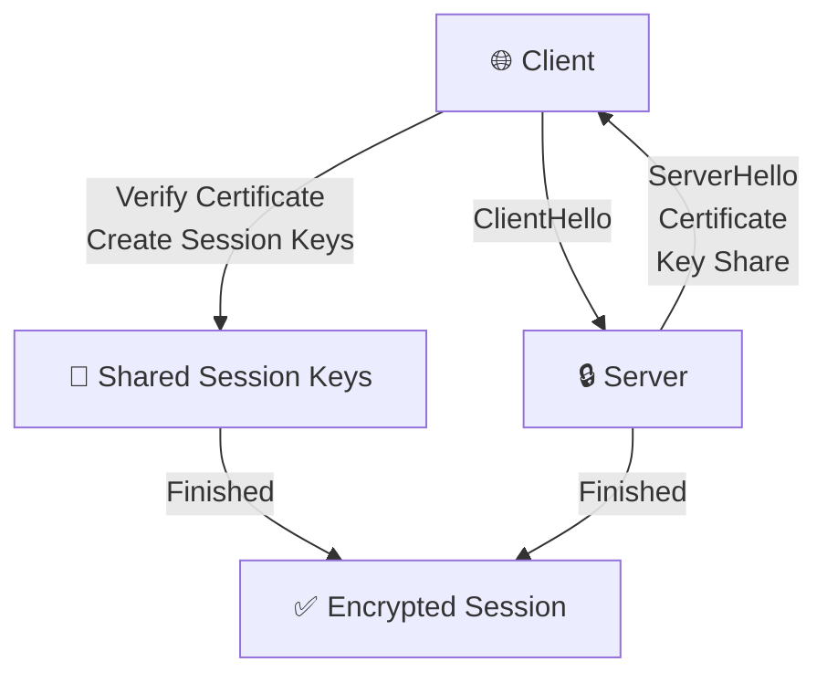
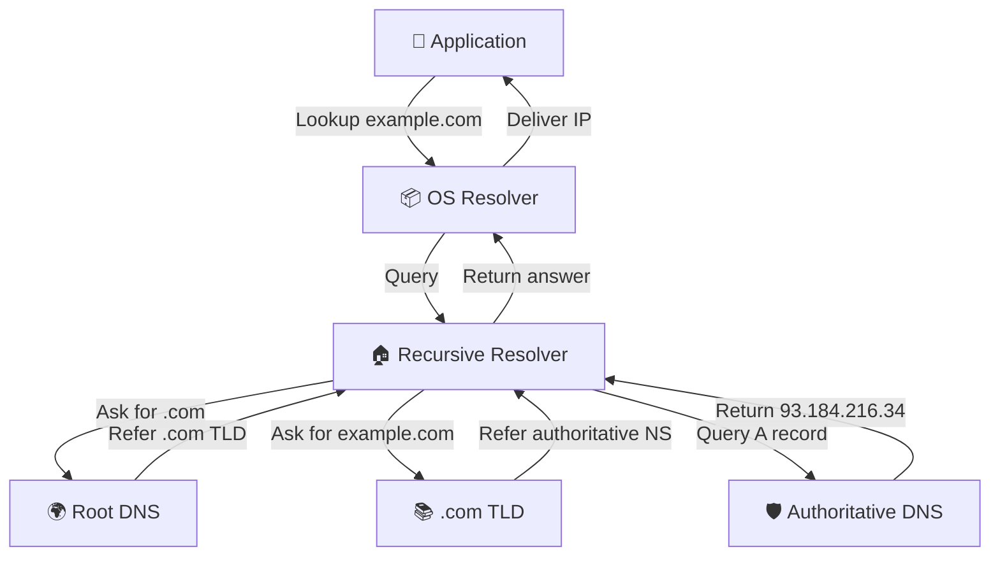

# 15. Essential Protocols
## 15.1 HTTP (HyperText Transfer Protocol)
HTTP is the application-layer protocol used by web browsers, APIs, reverse proxies, load balancers, and service-to-service communication.
Core characteristics:
- client-server request/response model
- stateless at the protocol layer
- uses methods, headers, status codes, and optional message bodies
- commonly carried over TLS as HTTPS
## 15.2 HTTP Versions
| Version | Characteristics |
|---|---|
| HTTP/1.1 | Text-based, persistent connections, universally supported |
| HTTP/2 | Binary framing, multiplexing, header compression |
| HTTP/3 | Runs over QUIC on UDP, better connection behavior on unstable networks |
Operationally, HTTP/1.1 is still everywhere, HTTP/2 is standard for modern browsers and proxies, and HTTP/3 adoption is growing for internet-facing services.
## 15.3 HTTP Request Structure
Example request:
```http
GET /api/health HTTP/1.1
Host: example.com
User-Agent: curl/8.5.0
Accept: */*
Authorization: Bearer eyJhbGciOi...
```
Example response:
```http
HTTP/1.1 200 OK
Content-Type: application/json
Cache-Control: no-store
Content-Length: 17
{"status":"ok"}
```
## 15.4 HTTP Methods
| Method | Typical use |
|---|---|
| `GET` | Read data |
| `POST` | Create a resource or submit data |
| `PUT` | Replace a resource |
| `PATCH` | Partially update a resource |
| `DELETE` | Remove a resource |
| `HEAD` | Fetch headers only |
| `OPTIONS` | Discover methods or CORS behavior |
Examples:
```bash
curl -X GET https://api.example.com/users
curl -X POST https://api.example.com/users -H 'Content-Type: application/json' -d '{"name":"alice"}'
curl -X PUT https://api.example.com/users/42 -H 'Content-Type: application/json' -d '{"name":"alice","role":"admin"}'
curl -X PATCH https://api.example.com/users/42 -H 'Content-Type: application/json' -d '{"role":"editor"}'
curl -X DELETE https://api.example.com/users/42
```
## 15.5 HTTP Status Codes
| Class | Meaning |
|---|---|
| `1xx` | Informational |
| `2xx` | Success |
| `3xx` | Redirection |
| `4xx` | Client error |
| `5xx` | Server error |
Common codes:
| Status | Meaning | Operational meaning |
|---|---|---|
| `200 OK` | Request succeeded | Normal successful read or action |
| `201 Created` | Resource created | Common after a POST create action |
| `301 Moved Permanently` | Permanent redirect | URL moved long-term |
| `302 Found` | Temporary redirect | App or login redirects |
| `400 Bad Request` | Invalid request | Missing field, invalid JSON, malformed syntax |
| `401 Unauthorized` | Authentication failed or missing | Token absent or invalid |
| `403 Forbidden` | Authenticated but not permitted | Access control denied |
| `404 Not Found` | Missing resource | Wrong path, host, or object ID |
| `500 Internal Server Error` | Application-side failure | Unhandled exception or broken config |
| `502 Bad Gateway` | Upstream failure | Reverse proxy got an invalid upstream response |
| `503 Service Unavailable` | Service unavailable | Maintenance, overload, or readiness failure |
| `504 Gateway Timeout` | Upstream timed out | Backend too slow or unreachable |
## 15.6 Important HTTP Headers
| Header | Purpose |
|---|---|
| `Content-Type` | Describes request or response body format |
| `Authorization` | Carries credentials such as Bearer tokens |
| `Cache-Control` | Controls browser or intermediary caching |
| `Cookie` | Sends session or application state |
| `User-Agent` | Identifies the client |
| `Accept` | Lists preferred response types |
| `Host` | Selects the target virtual host |
| `Location` | Redirect target or resource location |
Examples:
```bash
curl -H 'Authorization: Bearer TOKEN' https://api.example.com/me
curl -H 'Content-Type: application/json' -d '{"env":"prod"}' https://api.example.com/deployments
curl -H 'Cache-Control: no-cache' https://example.com/
```
## 15.7 Testing HTTP with `curl`
Verbose output:
```bash
curl -v https://example.com/
```
Output excerpt:
```text
* Connected to example.com (93.184.216.34) port 443
> GET / HTTP/1.1
> Host: example.com
> User-Agent: curl/8.5.0
< HTTP/1.1 200 OK
< Content-Type: text/html
< Content-Length: 1256
```
Send JSON in a POST request:
```bash
curl -X POST https://api.example.com/items \
  -H 'Content-Type: application/json' \
  -H 'Authorization: Bearer TOKEN' \
  -d '{"name":"db-backup","enabled":true}'
```
Fetch only headers:
```bash
curl -I https://example.com/
```
Follow redirects:
```bash
curl -L http://example.com/
```
Inspect timing:
```bash
curl -o /dev/null -s -w 'dns=%{time_namelookup} connect=%{time_connect} tls=%{time_appconnect} starttransfer=%{time_starttransfer} total=%{time_total}\n' https://example.com/
```
## 15.8 HTTPS, SSL, and TLS
HTTPS means HTTP carried over TLS. It provides confidentiality, integrity, and server identity verification.
- SSL (Secure Sockets Layer) is deprecated.
- TLS (Transport Layer Security) is the modern replacement.
- TLS 1.2 is still common and acceptable.
- TLS 1.3 is preferred on modern systems.
## 15.9 How TLS Works
At a high level:
1. The client connects and sends a `ClientHello`.
2. The server replies with `ServerHello`, certificate data, and key exchange information.
3. The client validates the certificate chain and hostname.
4. Both sides derive shared symmetric session keys.
5. Encrypted application traffic begins.
Why the protocol switches to symmetric encryption after the handshake:
- symmetric encryption is much faster for bulk traffic
- the handshake establishes trust and session keys
- the rest of the session uses those keys efficiently
## 15.10 Certificate Chain
A normal trust chain is:
- Root CA
- Intermediate CA
- Server certificate
Clients validate:
- certificate expiry
- hostname match
- trust chain completeness
- issuing CA trust
## 15.11 Self-Signed vs CA-Signed Certificates
| Type | Good for | Limitation |
|---|---|---|
| Self-signed | Labs, internal testing, bootstrap use | Clients must trust it manually |
| CA-signed | Public websites, APIs, normal production services | Requires CA issuance and renewal process |
## 15.12 Let's Encrypt with `certbot`
Ubuntu example for Nginx:
```bash
sudo apt update
sudo apt install -y certbot python3-certbot-nginx
sudo certbot --nginx -d example.com -d www.example.com
sudo certbot renew --dry-run
```
Apache example:
```bash
sudo apt install -y certbot python3-certbot-apache
sudo certbot --apache -d example.com -d www.example.com
```
## 15.13 Useful `openssl` Commands
Generate a private key:
```bash
openssl genrsa -out server.key 4096
```
Generate a CSR:
```bash
openssl req -new -key server.key -out server.csr
```
Create a self-signed certificate:
```bash
openssl req -x509 -nodes -days 365 -newkey rsa:4096 -keyout server.key -out server.crt
```
Inspect a certificate:
```bash
openssl x509 -in server.crt -text -noout
```
Verify a certificate:
```bash
openssl verify -CAfile ca-bundle.crt server.crt
```
Test a TLS endpoint:
```bash
openssl s_client -connect example.com:443 -servername example.com
```
Useful output to inspect includes subject, issuer, expiry dates, negotiated TLS version, and cipher suite.
## 15.14 Mermaid: TLS Handshake Flow

## 15.15 DNS (Domain Name System)
DNS maps hostnames to records such as IP addresses, mail exchangers, service locations, and reverse lookups.
Typical lookup flow:
1. An application requests `www.example.com`.
2. The OS resolver checks local sources and cache.
3. A recursive resolver performs upstream lookup if needed.
4. Root servers refer the resolver to the correct TLD.
5. The TLD refers the resolver to authoritative servers.
6. The authoritative server returns the final record.
7. The response is cached according to TTL.
Recursive vs iterative queries:
- recursive resolution means the resolver does the work on behalf of the client
- iterative referrals happen between DNS servers during lookup
## 15.16 Common DNS Record Types
| Record | Purpose |
|---|---|
| `A` | IPv4 address mapping |
| `AAAA` | IPv6 address mapping |
| `CNAME` | Alias to another name |
| `MX` | Mail routing |
| `TXT` | Arbitrary text, SPF, DKIM, verification |
| `NS` | Authoritative nameserver |
| `SOA` | Zone authority metadata |
| `PTR` | Reverse DNS |
| `SRV` | Service location |
## 15.17 Resolver Files
`/etc/resolv.conf` defines nameservers and options:
```conf
nameserver 10.0.0.2
nameserver 1.1.1.1
search example.com corp.example.com
options timeout:2 attempts:2
```
`/etc/hosts` provides local static overrides:
```text
127.0.0.1 localhost
192.168.1.50 web01.example.com web01
10.10.30.10 db01.example.com db01
```
`/etc/nsswitch.conf` controls lookup order:
```conf
hosts: files dns
```
This means the system checks `/etc/hosts` before DNS.
## 15.18 DNS Query Tools
Look up records with `dig`:
```bash
dig example.com
dig example.com MX
dig example.com TXT
dig -x 192.0.2.10
dig @8.8.8.8 example.com A
dig +short example.com
```
Example short output:
```text
93.184.216.34
```
Use `nslookup`:
```bash
nslookup example.com
nslookup -type=mx example.com
```
Use `host`:
```bash
host example.com
host -t txt example.com
host 192.0.2.10
```
Operational checks:
```bash
dig NS example.com
dig MX example.com
dig @ns1.example.com example.com SOA
```
## 15.19 Mermaid: DNS Resolution Flow

## 15.20 NFS (Network File System)
NFS lets one Linux system export a directory so another Linux system can mount it across the network.
Common uses:
- shared team directories
- centralized assets
- backup targets
- home directory or application data sharing inside trusted networks
Core concepts:
| Item | Meaning |
|---|---|
| Export | Server-side shared directory |
| Mount | Client-side attachment of the export |
| `/etc/exports` | NFS export definition file |
| `exportfs -ra` | Reload export definitions |
| `mount -t nfs` | Manual client mount |
| `autofs` | On-demand automatic mounting |
## 15.21 NFSv3 vs NFSv4
| Version | Notes |
|---|---|
| NFSv3 | Older, more helper protocol dependencies |
| NFSv4 | Cleaner design, better identity model, preferred for modern deployments |
Basic export example:
```exports
/srv/nfs/share 192.168.1.0/24(rw,sync,no_subtree_check)
```
Meaning:
- `rw` — read/write access
- `sync` — safer synchronous writes
- `no_subtree_check` — avoids subtree validation overhead
Client mount example:
```bash
sudo mkdir -p /mnt/nfs
sudo mount -t nfs nfs01.example.com:/srv/nfs/share /mnt/nfs
mount | grep nfs
```
Persistent mount in `/etc/fstab`:
```fstab
nfs01.example.com:/srv/nfs/share  /mnt/nfs  nfs  defaults,_netdev  0  0
```
Use `autofs` when you want the share mounted only on access.
Security guidance:
- keep NFS inside trusted networks
- restrict clients by subnet or host
- prefer NFSv4
- use firewall controls
- consider Kerberos where strong authentication is required
## 15.22 Mermaid: NFS Client-Server Architecture

## 15.23 FTP, SFTP, and FTPS
| Protocol | Security model | Typical recommendation |
|---|---|---|
| FTP | Plaintext by default | Avoid unless required for legacy compatibility |
| FTPS | FTP with TLS | Use only when a partner specifically requires FTP semantics |
| SFTP | SSH-based secure file transfer | Preferred secure option for most Linux environments |
Important note: SFTP is not the same protocol as FTP. It is an SSH subsystem and uses SSH authentication and encryption.
If FTP is absolutely required, `vsftpd` is a common server package:
```bash
sudo apt install -y vsftpd
sudo dnf install -y vsftpd
sudo systemctl enable --now vsftpd
```
In most production cases, prefer SFTP because SSH is already present and far easier to secure.
## 15.24 SMTP, IMAP, and POP3
| Protocol | Purpose | Common ports |
|---|---|---|
| SMTP | Sending and relaying mail | `25`, `465`, `587` |
| IMAP | Reading and synchronizing mail on the server | `143`, `993` |
| POP3 | Simpler mail retrieval and download model | `110` |
Port guidance:
- `25` — server-to-server SMTP relay
- `465` — SMTPS, implicit TLS
- `587` — mail submission with authentication, usually STARTTLS
- `143` — IMAP
- `993` — IMAPS
- `110` — POP3
