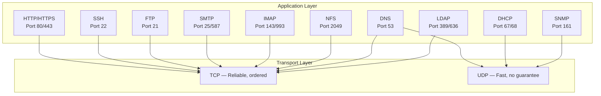
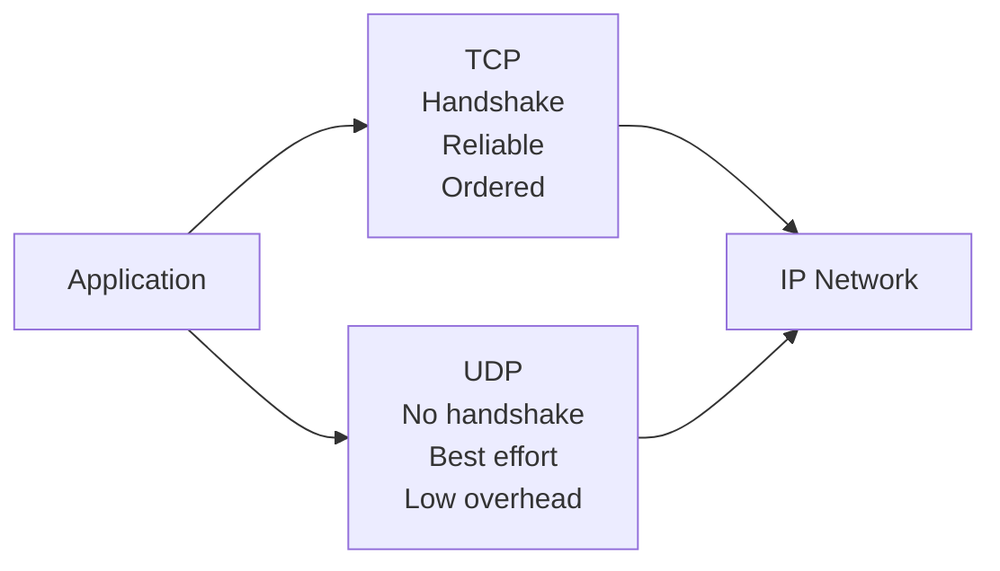
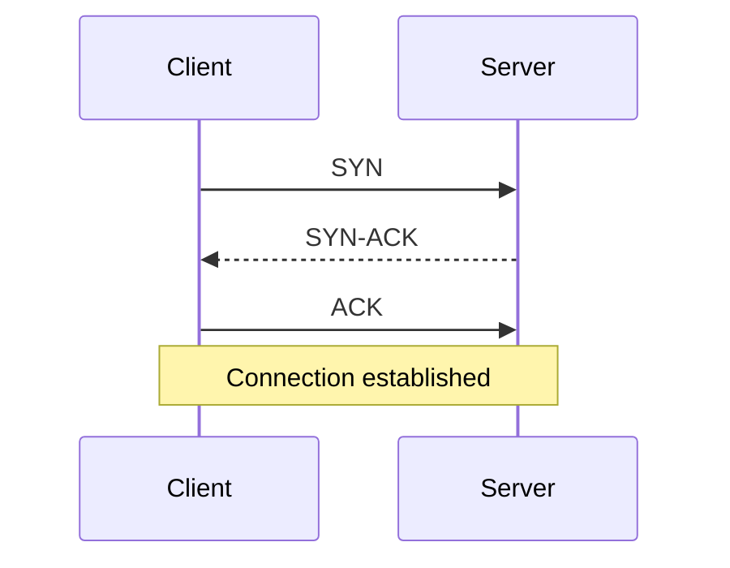

# 13. Essential Network Protocols for Linux

This chapter is now a compact protocol index. It keeps the shared foundations, then links to focused files for each major protocol family.

> **📌 Disclaimer**: Any third-party logos, screenshots, or diagrams referenced in this document are used for educational purposes only. All trademarks belong to their respective owners.


This chapter is a practical field guide to the core protocols that Linux administrators meet every day.
It focuses on what the protocol does.
It shows what packets usually look like.
It explains where the protocol sits in the stack.
It includes Linux commands you can run immediately.
It highlights security tradeoffs.
It uses Mermaid diagrams heavily so you can visualize the flow.

---

## 13.1 Learning goals

By the end of this chapter, you should be able to:
- identify which protocol solves which problem
- map a hostname lookup from application to authoritative DNS server
- explain how SSH authenticates a user and encrypts the session
- describe DHCP lease allocation and renewal
- mount and troubleshoot NFS exports
- explain SMTP delivery and IMAP retrieval
- compare FTP, FTPS, SFTP, and SCP correctly
- describe LDAP bind and search operations
- explain how SNMP polling and traps work
- recognize standard ports from memory
- decide which protocols are encrypted and which are legacy risks

## 13.2 How to read the diagrams

The diagrams in this chapter use a few recurring ideas:
- left to right usually means request then response
- arrows show network messages or logical dependencies
- `<br/>` inside labels means a line break inside a node
- green ideas usually indicate success or trusted state
- warning notes call out insecure or legacy behavior

## 13.3 Protocol overview map

### 📸 TCP/IP Protocol Suite

> *Source: Wikimedia Commons — TCP/IP protocol suite and connections*

The application layer contains the protocol the user or service cares about.
The transport layer carries that protocol between endpoints.
Most business applications ride on TCP.
A few protocols prefer UDP for speed or broadcast behavior.



## 13.4 Why Linux administrators care about protocols

A Linux system is rarely isolated.
It resolves names.
It obtains IP configuration.
It opens secure shells.
It fetches packages over HTTPS.
It mounts shared storage.
It sends alert emails.
It authenticates against a directory.
It exposes metrics to monitoring systems.

When something breaks, protocol knowledge narrows the search space quickly.
If DNS fails, a web server can be healthy but unreachable by name.
If DHCP fails, the host may never get a usable address.
If LDAP fails, login can break even when the server is alive.
If NFS stalls, applications may hang while waiting on storage.

## 13.5 Quick transport refresher

### 13.5.1 TCP

TCP provides:
- connection setup
- sequence numbers
- retransmission
- ordering
- flow control
- congestion control

### 13.5.2 UDP

UDP provides:
- source port
- destination port
- length
- checksum

UDP does not provide:
- connection state
- retransmission
- ordering
- congestion handling for the application

### 13.5.3 Visual transport comparison



### 13.5.4 TCP three-way handshake



### 13.5.5 Useful Linux commands for transport debugging

```bash
ss -tulpn
ss -tn state established
sudo tcpdump -nn -i any port 53
sudo tcpdump -nn -i any tcp port 22
sudo lsof -i -P -n | grep LISTEN
```

## Split protocol chapters

| Original section | Focused file | Topic |
|---|---|---|
| 13.6.x | [13a-http-and-https.md](13a-http-and-https.md) | HTTP, HTTPS, requests, responses, and TLS handshake |
| 13.7.x | [13b-ssh.md](13b-ssh.md) | SSH transport, authentication, tunneling, and hardening |
| 13.8.x | [13c-dns.md](13c-dns.md) | DNS resolution path, record types, and troubleshooting |
| 13.9.x | [13d-dhcp.md](13d-dhcp.md) | DHCP leases, DORA, relay agents, and failure patterns |
| 13.10.x | [13e-nfs.md](13e-nfs.md) | NFS exports, mounting, permissions, and root squash |
| 13.11.x | [13f-smtp-imap-pop3.md](13f-smtp-imap-pop3.md) | SMTP delivery, IMAP sync, POP3 retrieval, and mail policy |
| 13.12.x | [13g-ftp-sftp-scp.md](13g-ftp-sftp-scp.md) | FTP, FTPS, SFTP, SCP, and firewall implications |
| 13.13.x | [13h-ldap.md](13h-ldap.md) | LDAP binds, searches, directory trees, and Linux integration |
| 13.14.x | [13i-snmp.md](13i-snmp.md) | SNMP polling, traps, versions, and security guidance |

# 13.15 Common Ports Reference Table

| Port | Protocol | Service |
|---:|---|---|
| 22 | TCP | SSH, SFTP, SCP |
| 25 / 465 / 587 | TCP | SMTP relay and secure submission |
| 53 | TCP and UDP | DNS |
| 67 / 68 | UDP | DHCP server and client |
| 80 / 443 | TCP | HTTP and HTTPS |
| 110 / 995 | TCP | POP3 and POP3S |
| 143 / 993 | TCP | IMAP and IMAPS |
| 161 / 162 | UDP | SNMP polling and traps |
| 389 / 636 | TCP | LDAP and LDAPS |
| 2049 | TCP | NFS |

# 13.16 Protocol Security — Which Are Encrypted?

| Protocol | Default encryption state | Better secure form | Admin guidance |
|---|---|---|---|
| HTTP | No | HTTPS | Redirect or disable plain HTTP where possible |
| FTP | No | SFTP or FTPS | Prefer SFTP for secure administration |
| SMTP | Mixed | STARTTLS or SMTPS | Use TLS and modern mail authentication |
| IMAP / POP3 | Mixed | IMAPS, POP3S, or STARTTLS | Prefer encrypted mail access |
| LDAP | No by default | LDAPS or STARTTLS | Avoid plain binds |
| SNMPv1 / SNMPv2c | Weak shared secret | SNMPv3 | Prefer SNMPv3 |
| DNS | No privacy by default | DNSSEC, DoT, or DoH depending on need | Separate authenticity from privacy goals |
| DHCP | No | Network controls around it | Rely on trusted switching and DHCP snooping |
| NFS | Trust-based by default | NFS with Kerberos where needed | Keep on trusted networks |
| SSH | Yes | SSH | Strong default when configured well |

# 13.17 Cross-Protocol Troubleshooting Playbook

1. Check reachability with `ip addr`, `ip route`, `ping`, and `ss -tulpn`.
2. Verify name resolution with `getent hosts`, `dig`, or `resolvectl query`.
3. Confirm the target port is listening and reachable.
4. If TLS is involved, validate certificates, hostname matching, and protocol versions.
5. Review authentication, authorization, and application logs last.

| Protocol | First commands to try |
|---|---|
| HTTP or HTTPS | `curl -vk URL`, `openssl s_client -connect host:443 -servername host` |
| SSH | `ssh -vvv user@host`, then check port 22 with `ss -tnlp` |
| DNS | `dig name`, `dig +trace name`, `getent hosts name` |
| DHCP | `ip addr`, `journalctl`, `tcpdump port 67 or 68` |
| NFS | `showmount -e server`, `rpcinfo -p server`, then review current mounts |
| SMTP | `dig MX domain`, `openssl s_client -starttls smtp -connect host:25` |
| LDAP | `ldapsearch`, `getent passwd user`, `id user` |
| SNMP | `snmpget`, `snmpwalk`, then confirm UDP 161 is listening with `ss -ulpn` |

# 13.19 Summary

The protocols in this chapter form the daily language of Linux operations.
Use the split files for full walkthroughs, and use this index for the map, port memory aids, and quick troubleshooting path.

## 13.19.1 Practice goals

To build confidence, practice these workflows in a lab:
- resolve names with `dig` and `getent`
- log in with SSH keys
- renew a DHCP lease
- mount an NFS share
- inspect an SMTP banner and MX records
- copy files with SFTP and SCP
- query LDAP with `ldapsearch`
- poll an SNMP agent
