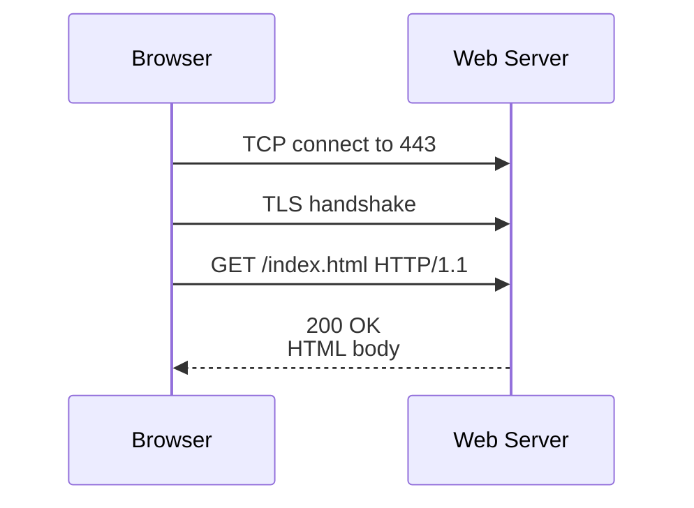
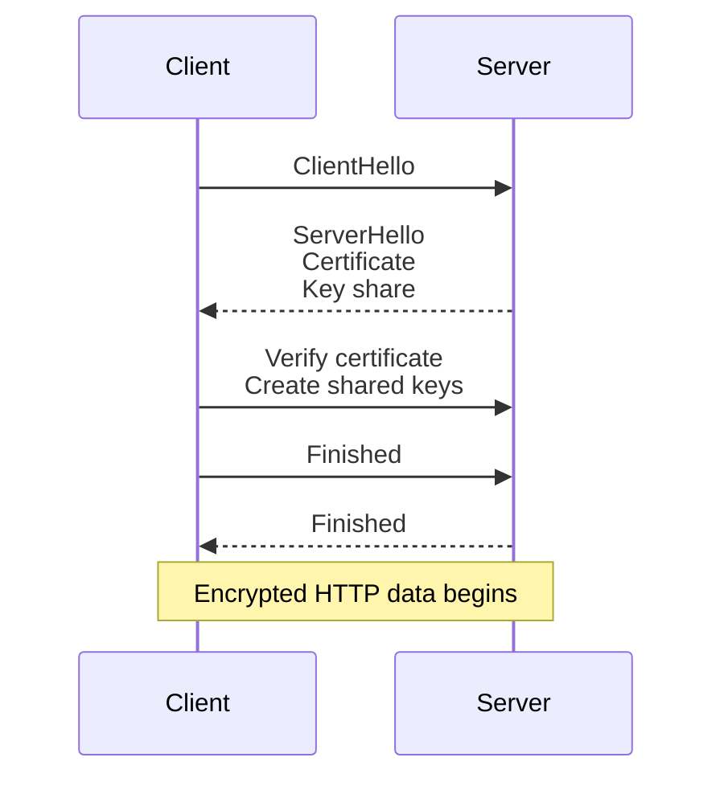

# 13a. HTTP and HTTPS

HTTP and HTTPS carry web pages, APIs, package downloads, and countless service-to-service calls. This split chapter keeps the original 13.6.x numbering so existing references remain accurate.


> **Key Terms**
> - **HTTP** — *HyperText Transfer Protocol*: Web request and response protocol.
> - **HTTPS** — *HyperText Transfer Protocol Secure*: HTTP protected by TLS.
> - **TLS** — *Transport Layer Security*: Encrypts data in transit.
> - **TCP** — *Transmission Control Protocol*: Reliable transport used by HTTP and HTTPS.
> - **curl** — *Client URL*: Common Linux tool for testing HTTP endpoints.
>
> **Cross-references**
> - [Protocol index](13-essential-protocols.md) for the overview, ports, security map, and troubleshooting checklist.
> - [13c DNS](13c-dns.md)
> - [13b SSH](13b-ssh.md)
> - [13f SMTP, IMAP, and POP3](13f-smtp-imap-pop3.md)

HTTP is still the most common protocol Linux administrators observe.
Package repositories use it.
APIs use it.
Web applications use it.
Cloud metadata services often expose it.
Prometheus exporters expose metrics over it.
Reverse proxies terminate it.

## 13.6.1 What HTTP does

HTTP is an application protocol for transferring representations of resources.
A resource may be:
- a web page
- an API object
- a JSON document
- an image
- a software package
- a metrics endpoint

## 13.6.2 Default ports

| Service | Port | Notes |
|---|---:|---|
| HTTP | 80 | Unencrypted by default |
| HTTPS | 443 | HTTP over TLS |

## 13.6.3 Request and response model

HTTP is a request and response protocol.
The client asks.
The server answers.
Each request includes:
- a method
- a path
- headers
- optionally a body

Each response includes:
- a status code
- headers
- optionally a body

## 13.6.4 Basic request flow



## 13.6.5 Example request

```http
GET /api/health HTTP/1.1
Host: app.example.com
User-Agent: curl/8.5.0
Accept: application/json
Authorization: Bearer TOKEN
```

## 13.6.6 Example response

```http
HTTP/1.1 200 OK
Content-Type: application/json
Cache-Control: no-store
Content-Length: 17

{"status":"ok"}
```

## 13.6.7 Common methods

| Method | Meaning | Typical use |
|---|---|---|
| `GET` | Read | Fetch data |
| `POST` | Submit or create | Login, create object |
| `PUT` | Replace | Replace full object |
| `PATCH` | Modify | Partial update |
| `DELETE` | Remove | Delete object |
| `HEAD` | Headers only | Probe endpoint |
| `OPTIONS` | Capabilities | CORS and introspection |

## 13.6.8 Common status codes

| Code | Meaning | Operational interpretation |
|---|---|---|
| `200` | OK | Normal success |
| `201` | Created | Object successfully created |
| `301` | Moved permanently | Redirect maintained by client or browser |
| `302` | Found | Temporary redirect |
| `400` | Bad request | Client sent invalid data |
| `401` | Unauthorized | Missing or invalid credentials |
| `403` | Forbidden | Credentials valid but insufficient |
| `404` | Not found | Path or object missing |
| `429` | Too many requests | Rate limiting |
| `500` | Internal server error | Application failed |
| `502` | Bad gateway | Proxy got bad upstream reply |
| `503` | Service unavailable | Backend down or overloaded |
| `504` | Gateway timeout | Upstream too slow |

## 13.6.9 HTTP troubleshooting commands

```bash
curl -I https://example.com/
curl -v https://example.com/
curl -L http://example.com/
curl -o /dev/null -s -w 'dns=%{time_namelookup} connect=%{time_connect} tls=%{time_appconnect} total=%{time_total}\n' https://example.com/
openssl s_client -connect example.com:443 -servername example.com
```

## 13.6.10 HTTPS handshake summary



## 13.6.11 Why HTTPS matters

HTTPS gives you:
- confidentiality
- integrity
- server identity verification

Without HTTPS:
- credentials can be read on the wire
- cookies can be stolen
- content can be modified in transit
- users can be redirected to malicious pages

---
