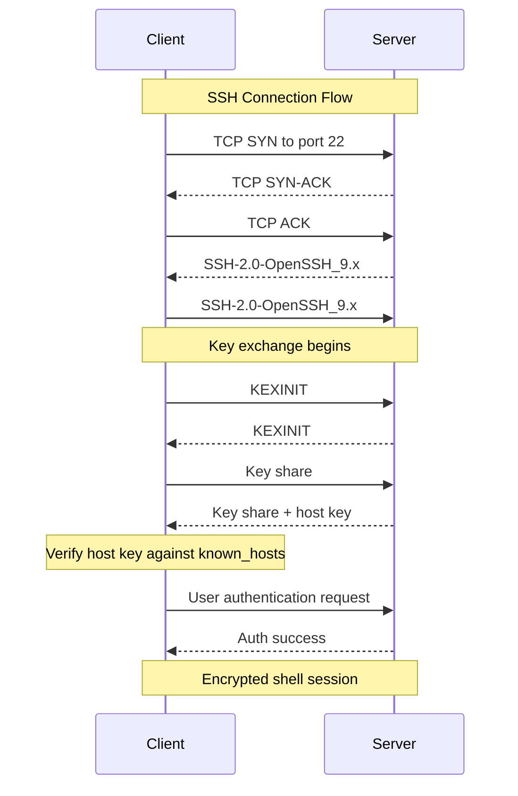
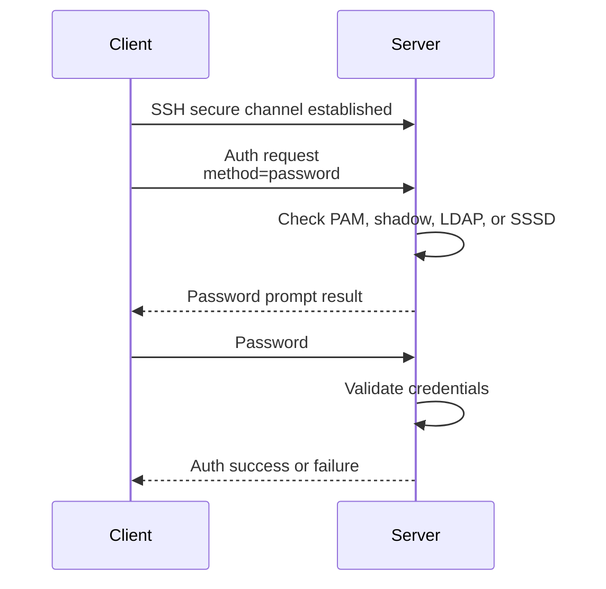
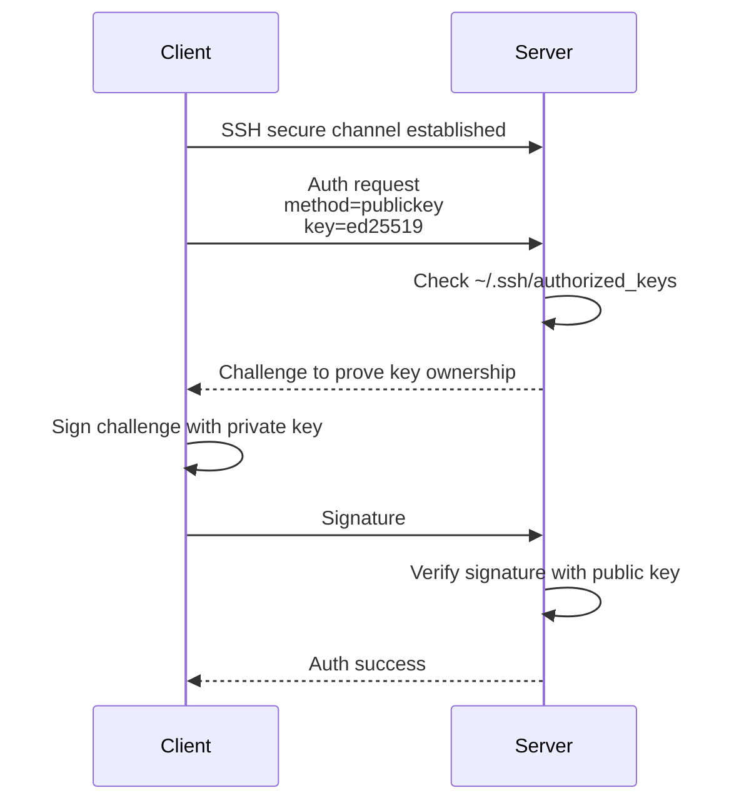
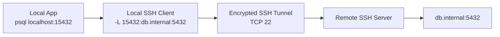
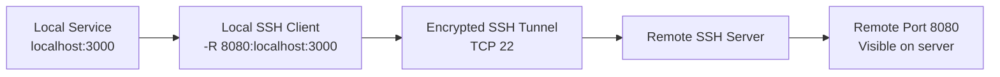
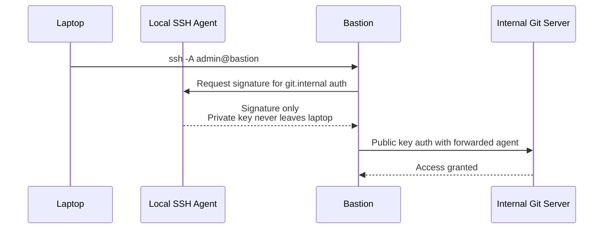

# 13b. SSH

SSH is the standard secure remote administration protocol for Linux. This file preserves the original 13.7.x numbering and groups the transport, authentication, tunneling, and hardening material in one place.


> **Key Terms**
> - **SSH** — *Secure Shell*: Encrypted remote login, command, and tunneling protocol.
> - **SFTP** — *SSH File Transfer Protocol*: Interactive file transfer carried over SSH.
> - **SCP** — *Secure Copy Protocol*: Simple file copy over SSH.
> - **ed25519** — *Edwards-curve Digital Signature Algorithm using Curve25519*: Modern, fast SSH key type.
> - **RSA** — *Rivest–Shamir–Adleman*: Older but widely supported public-key algorithm.
> - **MFA** — *Multi-Factor Authentication*: Adds extra authentication factors beyond a password or key.
>
> **Cross-references**
> - [Protocol index](13-essential-protocols.md) for the overview, ports, security map, and troubleshooting checklist.
> - [13g FTP, FTPS, SFTP, and SCP](13g-ftp-sftp-scp.md)
> - [13c DNS](13c-dns.md)
> - [13a HTTP and HTTPS](13a-http-and-https.md)

SSH is the standard remote administration protocol on Linux.
It provides:
- encrypted login
- remote command execution
- file transfer via SFTP and SCP
- port forwarding
- tunneling
- agent forwarding

## 13.7.1 Default port

| Service | Port | Transport |
|---|---:|---|
| SSH | 22 | TCP |

## 13.7.2 High-level SSH flow



## 13.7.3 What happens first

The SSH server listens on TCP port 22.
The client initiates a TCP connection.
The peers exchange version strings.
They negotiate algorithms.
They perform key exchange.
The client validates the server host key.
Only after the secure channel exists does user authentication begin.

## 13.7.4 SSH handshake layers

| Step | Purpose |
|---|---|
| TCP connect | Build a reliable byte stream |
| Version exchange | Confirm SSH protocol version |
| Algorithm negotiation | Pick ciphers, MACs, key exchange, host key type |
| Key exchange | Build shared secrets |
| Host key verification | Prevent silent impersonation |
| User authentication | Prove user identity |
| Channel open | Start shell, exec, SFTP, or port forward |

## 13.7.5 Password authentication flow



## 13.7.6 Key authentication flow



## 13.7.7 Password auth versus key auth

| Topic | Password auth | Public key auth |
|---|---|---|
| Secret sent to server | Password | No private key sent |
| Brute force exposure | High if allowed publicly | Lower when password auth is disabled |
| Automation | Poor | Excellent |
| MFA support | Possible through PAM | Possible with certificates or extra layers |
| Recommended for admins | Usually no | Yes |

## 13.7.8 Host keys versus user keys

Host keys identify the server.
User keys identify the user.
These are different trust relationships.

| Key type | Typical location | Purpose |
|---|---|---|
| Server host key | `/etc/ssh/ssh_host_*` | Proves server identity |
| User private key | `~/.ssh/id_ed25519` | Proves user identity |
| Authorized keys | `~/.ssh/authorized_keys` | Lists allowed user public keys |
| Known hosts | `~/.ssh/known_hosts` | Caches trusted host keys |

## 13.7.9 Core SSH files

```text
~/.ssh/config
~/.ssh/id_ed25519
~/.ssh/id_ed25519.pub
~/.ssh/authorized_keys
~/.ssh/known_hosts
/etc/ssh/sshd_config
```

## 13.7.10 Common SSH commands

```bash
ssh user@server.example.com
ssh -p 2222 user@server.example.com
ssh -i ~/.ssh/id_ed25519 user@server.example.com
ssh -v user@server.example.com
ssh-copy-id user@server.example.com
scp file.txt user@server.example.com:/tmp/
sftp user@server.example.com
```

## 13.7.11 Generating a key pair

```bash
ssh-keygen -t ed25519 -C 'admin@example.com'
```

## 13.7.12 Copying a key to a server

```bash
ssh-copy-id -i ~/.ssh/id_ed25519.pub user@server.example.com
```

## 13.7.13 Minimal client config example

```sshconfig
Host prod-web
    HostName web01.example.com
    User admin
    Port 22
    IdentityFile ~/.ssh/id_ed25519
    ServerAliveInterval 30
    ForwardAgent no
```

## 13.7.14 Local port forwarding

Local forwarding exposes a remote service on your local machine.
A common use is connecting securely to a remote database.



Command:

```bash
ssh -L 15432:db.internal:5432 admin@bastion.example.com
```

## 13.7.15 Remote port forwarding

Remote forwarding exposes a local service on the remote machine.
This is useful for publishing a service behind NAT to a bastion.



Command:

```bash
ssh -R 8080:localhost:3000 admin@bastion.example.com
```

## 13.7.16 Dynamic port forwarding

Dynamic forwarding turns SSH into a SOCKS proxy.
Applications that support SOCKS can send arbitrary traffic through the SSH tunnel.


Command:

```bash
ssh -D 1080 admin@bastion.example.com
```

## 13.7.17 SSH agent forwarding

Agent forwarding lets the remote server ask your local SSH agent to sign authentication challenges.
Your private key stays on the local workstation.
However, the remote server can ask the agent to sign during the session.
That means agent forwarding should only be used on hosts you trust deeply.



## 13.7.18 Agent forwarding command

```bash
ssh -A admin@bastion.example.com
```

## 13.7.19 SSH multiplexing

Multiplexing reuses one TCP connection for multiple SSH sessions.
It reduces connection setup overhead.

```sshconfig
Host *
    ControlMaster auto
    ControlPath ~/.ssh/cm-%r@%h:%p
    ControlPersist 10m
```

## 13.7.20 SSH hardening checklist

- disable password authentication when keys are deployed
- disable root login over SSH
- restrict allowed users or groups
- prefer `ed25519` or modern RSA settings
- rotate weak host keys out of service
- use fail2ban or network ACLs for internet-exposed hosts
- enable MFA where practical
- keep OpenSSH updated
- avoid unnecessary agent forwarding
- log and review authentication attempts

## 13.7.21 Example `sshd_config` hardening

```conf
Port 22
Protocol 2
PermitRootLogin no
PasswordAuthentication no
PubkeyAuthentication yes
PermitEmptyPasswords no
ChallengeResponseAuthentication no
UsePAM yes
AllowUsers admin deploy
X11Forwarding no
AllowAgentForwarding no
```

## 13.7.22 SSH troubleshooting commands

```bash
ssh -vvv user@server.example.com
sudo sshd -T | sort
sudo journalctl -u ssh -u sshd --since '1 hour ago'
ss -tnlp | grep ':22 '
sudo tcpdump -nn -i any tcp port 22
```

## 13.7.23 Common SSH failures

| Symptom | Likely cause |
|---|---|
| `Permission denied (publickey)` | Key not in `authorized_keys` or wrong permissions |
| Host key verification failed | Host key changed or DNS points elsewhere |
| Connection timed out | Network path or firewall issue |
| Connection refused | `sshd` not listening |
| Agent refused operation | Agent not loaded or forwarding blocked |

---
