# 13c. DNS

DNS is one of the highest-leverage protocols in Linux operations because so many other services depend on it. This file keeps the original 13.8.x numbering for backward compatibility.


> **Key Terms**
> - **DNS** — *Domain Name System*: Translates names into addresses and other records.
> - **TCP** — *Transmission Control Protocol*: Used for zone transfers and large DNS replies.
> - **UDP** — *User Datagram Protocol*: Used by most standard DNS queries.
> - **TTL** — *Time To Live*: Controls how long answers may be cached.
> - **A, AAAA, CNAME, MX** — *Common DNS record types*: Map names, aliases, and mail destinations.
> - **SOA, PTR, SRV, CAA** — *Operational DNS record types*: Support authority, reverse lookups, service discovery, and certificate policy.
>
> **Cross-references**
> - [Protocol index](13-essential-protocols.md) for the overview, ports, security map, and troubleshooting checklist.
> - [13a HTTP and HTTPS](13a-http-and-https.md)
> - [13d DHCP](13d-dhcp.md)
> - [13f SMTP, IMAP, and POP3](13f-smtp-imap-pop3.md)

DNS translates human-friendly names into machine-usable answers.
Most often that means mapping a hostname to an IP address.
But DNS also stores:
- mail routing information
- service locations
- verification tokens
- delegation data
- reverse mappings
- certificate authority policy hints

If DNS is slow, many other services appear slow.
If DNS is broken, many other services appear broken.
That is why DNS is one of the highest-value protocols to understand.

## 13.8.1 Default port and transport

| Service | Port | Transport | Notes |
|---|---:|---|---|
| DNS | 53 | UDP | Most queries and responses |
| DNS | 53 | TCP | Zone transfers, large responses, DNSSEC, retries |

## 13.8.2 Key DNS roles

| Role | What it does |
|---|---|
| Stub resolver | Small client-side resolver used by the OS or libc |
| Local cache | Short-circuit answers from `/etc/hosts` or caching service |
| Recursive resolver | Performs the full lookup on behalf of the client |
| Root server | Knows where TLD servers live |
| TLD server | Knows where delegated domains live |
| Authoritative server | Holds the final answers for the zone |

## 13.8.3 Full recursive lookup

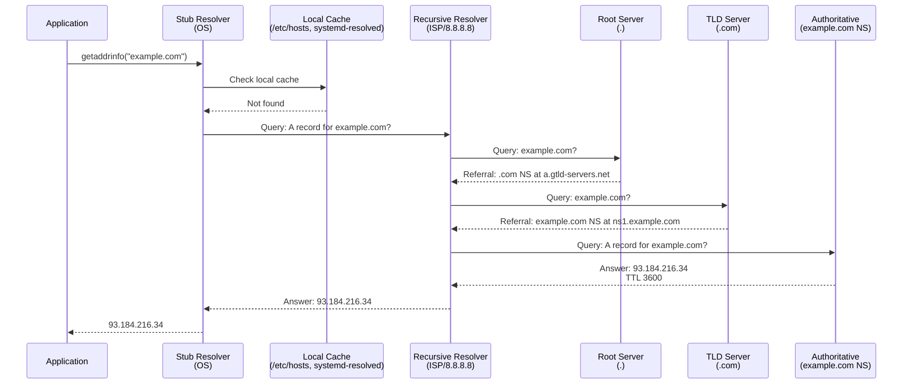

## 13.8.4 What the application actually calls

Many Linux applications do not call DNS directly.
They call a libc resolver function such as:
- `getaddrinfo()`
- `getnameinfo()`
- `res_query()`

That function may consult:
- `/etc/hosts`
- `systemd-resolved`
- `nscd`
- remote recursive resolvers from `/etc/resolv.conf`

## 13.8.5 Linux resolver path

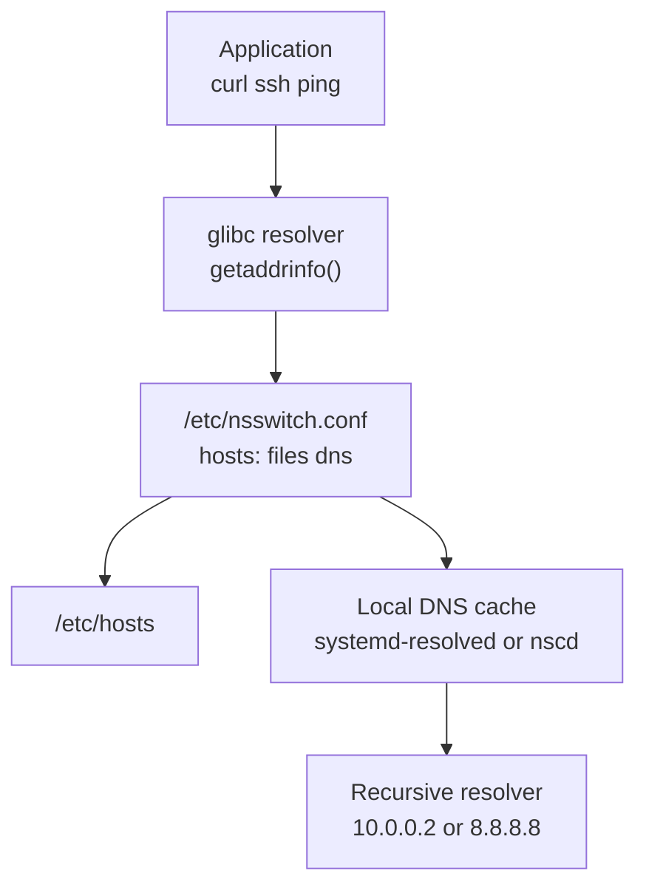

## 13.8.6 Local configuration files

### `/etc/resolv.conf`

```conf
nameserver 10.0.0.2
nameserver 1.1.1.1
search corp.example.com example.com
options timeout:2 attempts:2 ndots:1
```

### `/etc/hosts`

```text
127.0.0.1 localhost
192.168.50.10 bastion.example.com bastion
192.168.50.20 db01.example.com db01
```

### `/etc/nsswitch.conf`

```conf
hosts: files dns
```

This means the system checks `files` first.
Then it checks DNS.
That ordering matters.
A stale `/etc/hosts` entry can override perfectly healthy DNS.

## 13.8.7 Recursive versus iterative resolution

Recursive resolution means the client asks one resolver to get the final answer.
Iterative resolution means a server responds with a referral to another server.
Normal client behavior is recursive.
Normal server-to-server delegation behavior is iterative.

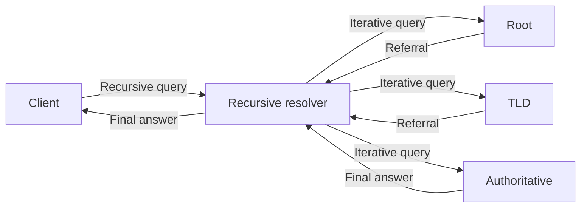

## 13.8.8 Caching and TTL

DNS answers are cached for their TTL.
TTL means time to live.
The cache entry expires when the TTL reaches zero.
Short TTLs give faster change propagation.
Long TTLs reduce query load.

Operational tradeoff:
- short TTLs are flexible
- long TTLs are efficient

## 13.8.9 Example `dig` usage

```bash
dig example.com
dig example.com A
dig example.com AAAA
dig example.com MX
dig example.com TXT
dig @8.8.8.8 example.com A
dig +short example.com
dig +trace example.com
dig -x 192.0.2.50
```

## 13.8.10 Example `host` usage

```bash
host example.com
host -t mx example.com
host -t txt example.com
host 192.0.2.50
```

## 13.8.11 Example `resolvectl` usage

```bash
resolvectl status
resolvectl query example.com
resolvectl flush-caches
```

## 13.8.12 Reading `dig` output

Important fields:
- `QUESTION SECTION`
- `ANSWER SECTION`
- `AUTHORITY SECTION`
- `ADDITIONAL SECTION`
- response code
- flags such as `aa`, `rd`, `ra`
- query time
- server used
- TTL per answer

## 13.8.13 Common DNS record types

| Record | Meaning | Typical example |
|---|---|---|
| `A` | Name to IPv4 address | `www.example.com -> 203.0.113.10` |
| `AAAA` | Name to IPv6 address | `www.example.com -> 2001:db8::10` |
| `CNAME` | Alias to another hostname | `api.example.com -> lb123.example.net` |
| `MX` | Mail exchanger | `example.com -> mail.example.com` |
| `TXT` | Free-form text | SPF, DKIM, domain validation |
| `NS` | Nameserver delegation | `example.com -> ns1.example.com` |
| `SOA` | Start of authority | Zone metadata |
| `PTR` | Reverse mapping | `10.113.0.203.in-addr.arpa -> web01.example.com` |
| `SRV` | Service locator | `_ldap._tcp.example.com` |
| `CAA` | Certificate authority authorization | Which CA may issue certs |

## 13.8.14 A record

An `A` record maps a name to an IPv4 address.
This is the most common DNS answer users think about.

Example zone line:

```dns
www.example.com. 3600 IN A 203.0.113.10
```

Lookup command:

```bash
dig www.example.com A +short
```

Typical use cases:
- websites
- APIs
- load balancer frontends
- bastion hosts

Visual flow:

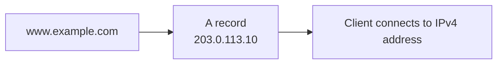

## 13.8.15 AAAA record

An `AAAA` record maps a name to an IPv6 address.
It is the IPv6 equivalent of an `A` record.

Example zone line:

```dns
www.example.com. 3600 IN AAAA 2001:db8:10::10
```

Lookup command:

```bash
dig www.example.com AAAA +short
```

Visual flow:

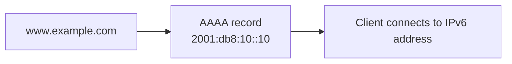

## 13.8.16 CNAME record

A `CNAME` record creates an alias from one name to another name.
The final target still needs an `A` or `AAAA` record.

Example zone lines:

```dns
api.example.com. 300 IN CNAME prod-lb.us-east-1.elb.amazonaws.com.
prod-lb.us-east-1.elb.amazonaws.com. 60 IN A 198.51.100.20
```

Lookup command:

```bash
dig api.example.com CNAME
```

Visual flow:

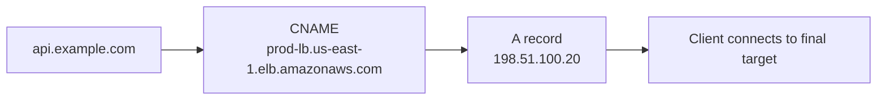

Operational note:
A `CNAME` cannot coexist with most other record types at the same exact owner name.
That is why zone apex aliases often need provider-specific `ALIAS` or `ANAME` features.

## 13.8.17 MX record

An `MX` record tells the world which mail server accepts mail for a domain.
It includes a priority value.
Lower numbers are preferred.

Example zone lines:

```dns
example.com. 3600 IN MX 10 mail1.example.com.
example.com. 3600 IN MX 20 mail2.example.com.
mail1.example.com. 3600 IN A 203.0.113.25
mail2.example.com. 3600 IN A 203.0.113.26
```

Lookup command:

```bash
dig example.com MX
```

Visual flow:

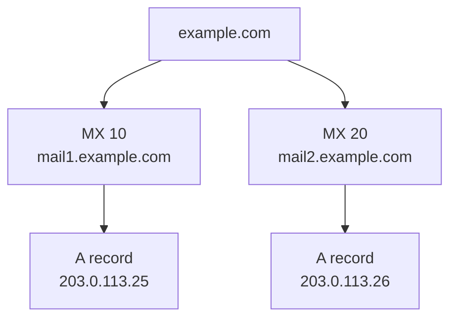

## 13.8.18 TXT record

A `TXT` record carries arbitrary text.
Common uses include:
- SPF policy
- DKIM public key material
- DMARC policy
- domain ownership validation
- service verification tokens

Example zone lines:

```dns
example.com. 300 IN TXT "v=spf1 ip4:203.0.113.25 include:_spf.google.com -all"
_dmarc.example.com. 300 IN TXT "v=DMARC1; p=quarantine; rua=mailto:dmarc@example.com"
```

Lookup command:

```bash
dig example.com TXT
```

Visual flow:


## 13.8.19 NS record

An `NS` record delegates a zone to authoritative nameservers.
At the parent zone, this is the delegation point.
Inside the zone, it states the authoritative nameservers for the zone itself.

Example zone lines:

```dns
example.com. 172800 IN NS ns1.example.net.
example.com. 172800 IN NS ns2.example.net.
```

Lookup command:

```bash
dig example.com NS
```

Visual flow:


## 13.8.20 SOA record

The `SOA` record defines essential zone metadata.
It includes:
- primary nameserver
- responsible mailbox
- serial number
- refresh interval
- retry interval
- expire timer
- minimum negative cache TTL

Example zone line:

```dns
example.com. 3600 IN SOA ns1.example.net. hostmaster.example.com. 2025060201 7200 3600 1209600 3600
```

Lookup command:

```bash
dig example.com SOA
```

Visual flow:

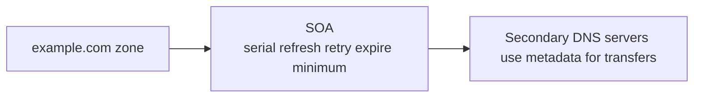

## 13.8.21 PTR record

A `PTR` record maps an IP address back to a hostname.
This is reverse DNS.
It is common for:
- mail server reputation checks
- logging clarity
- service validation

Example zone line:

```dns
10.113.0.203.in-addr.arpa. 3600 IN PTR web01.example.com.
```

Lookup command:

```bash
dig -x 203.0.113.10
```

Visual flow:

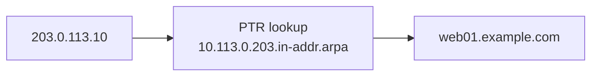

## 13.8.22 SRV record

An `SRV` record identifies the host and port for a named service.
It is common in LDAP, Kerberos, SIP, and some service discovery patterns.

Example zone line:

```dns
_ldap._tcp.example.com. 3600 IN SRV 10 5 389 ldap01.example.com.
```

Fields are:
- priority
- weight
- port
- target

Lookup command:

```bash
dig _ldap._tcp.example.com SRV
```

Visual flow:

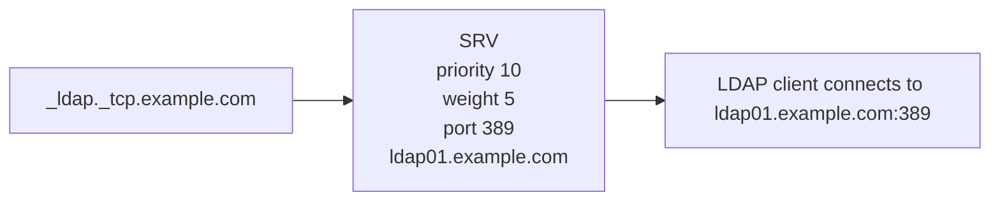

## 13.8.23 CAA record

A `CAA` record states which certificate authorities may issue certificates for the domain.
It helps reduce unauthorized certificate issuance.

Example zone line:

```dns
example.com. 3600 IN CAA 0 issue "letsencrypt.org"
```

Lookup command:

```bash
dig example.com CAA
```

Visual flow:

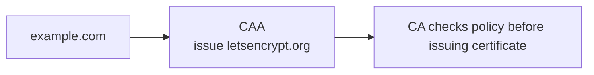

## 13.8.24 DNS response codes you should know

| Code | Meaning | What it suggests |
|---|---|---|
| `NOERROR` | Query succeeded | Normal answer or empty answer set |
| `NXDOMAIN` | Name does not exist | Wrong hostname or missing zone entry |
| `SERVFAIL` | Server failed to answer | Upstream issue, DNSSEC issue, or broken authority |
| `REFUSED` | Server rejected query | ACL or policy block |
| `FORMERR` | Format error | Malformed query or incompatible feature |

## 13.8.25 DNS over UDP and TCP

Most small queries use UDP.
TCP is used when:
- the response is too large
- EDNS or DNSSEC increases size
- a truncated UDP answer sets the `TC` bit
- a zone transfer occurs

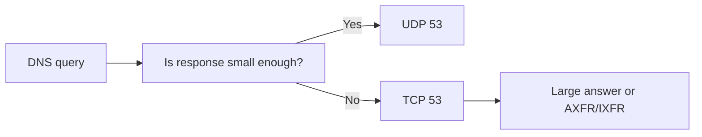

## 13.8.26 Zone transfer idea

A secondary nameserver needs the zone contents from the primary.
That transfer uses TCP.
Full transfer is `AXFR`.
Incremental transfer is `IXFR`.

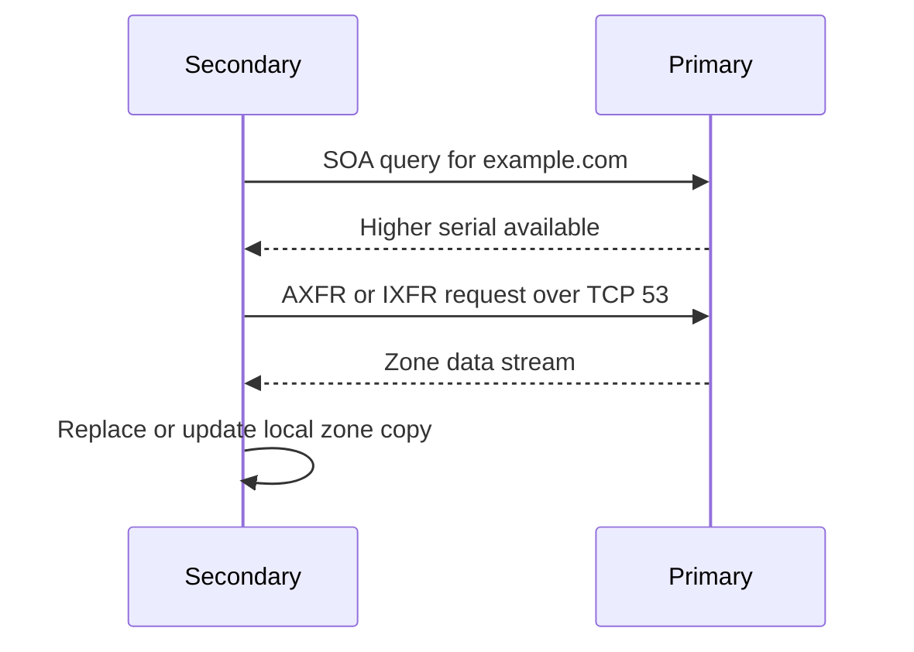

## 13.8.27 Example BIND zone fragment

```dns
$TTL 3600
@   IN SOA ns1.example.net. hostmaster.example.com. 2025060201 7200 3600 1209600 3600
    IN NS  ns1.example.net.
    IN NS  ns2.example.net.
@   IN MX  10 mail.example.com.
@   IN A   203.0.113.10
www IN A   203.0.113.10
api IN CNAME www
mail IN A  203.0.113.25
```

## 13.8.28 Example DNS troubleshooting workflow

1. Check local `/etc/hosts`.
2. Check resolver configuration.
3. Query the configured recursive resolver.
4. Query a known-good public resolver.
5. Query authoritative servers directly.
6. Check TTL and cached old answers.
7. If mail is affected, check `MX`, `SPF`, `DKIM`, and reverse DNS.

## 13.8.29 Helpful troubleshooting commands

```bash
getent hosts example.com
cat /etc/resolv.conf
grep '^hosts:' /etc/nsswitch.conf
resolvectl query example.com
resolvectl statistics
nslookup example.com
host -t ns example.com
dig +trace example.com
```

## 13.8.30 Typical DNS failure patterns

| Symptom | Probable cause |
|---|---|
| Local host resolves wrong IP | Stale `/etc/hosts` or cache |
| Only one client fails | Local resolver config or VPN split DNS |
| Public users fail but internal users succeed | Split-horizon DNS or private-only records |
| Mail rejected | Missing PTR, SPF, DKIM, or MX |
| `SERVFAIL` from validating resolver | DNSSEC or authority problem |
| Random latency spikes | Slow recursive resolver or packet loss |

## 13.8.31 Split-horizon DNS

Split-horizon means different clients receive different answers for the same name.
Internal clients may get private IPs.
External clients may get public IPs.
This is useful but can complicate troubleshooting.

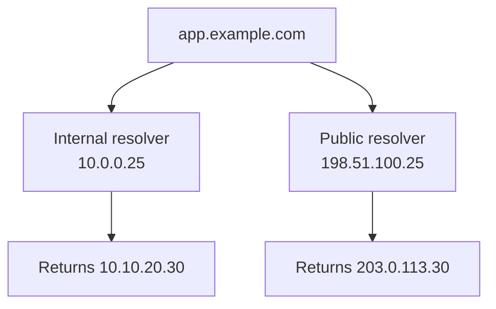

## 13.8.32 DNS security notes

- plain DNS has no confidentiality
- clients usually trust the recursive resolver fully
- cache poisoning and spoofing are historical risks
- DNSSEC adds authenticity but not privacy
- DNS over TLS and DNS over HTTPS add privacy in some designs
- zone transfers should be restricted
- public recursive resolvers should not be exposed unnecessarily

## 13.8.33 DNS mini lab

Try these commands on a Linux system:

```bash
dig example.com
dig example.com MX
dig example.com TXT
dig +short example.com
host example.com
getent hosts example.com
```

Observe:
- how long answers are cached
- whether IPv6 answers appear
- which nameserver is used
- whether the system checks `/etc/hosts` first

---
