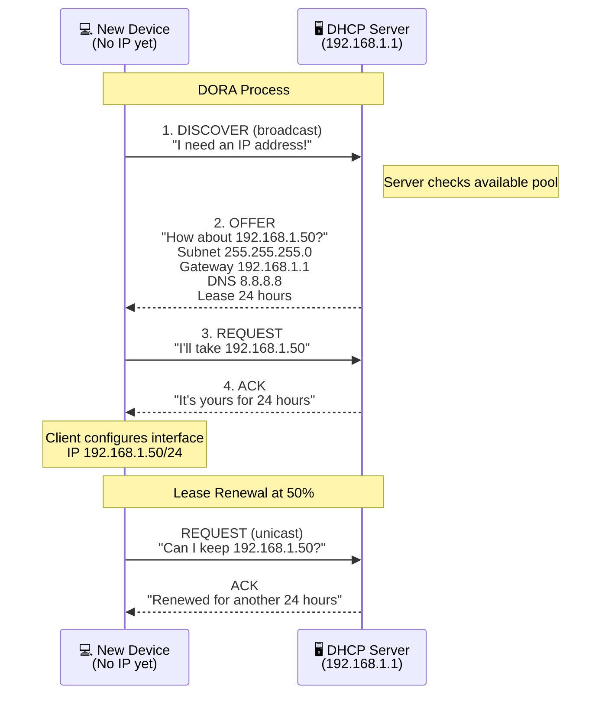
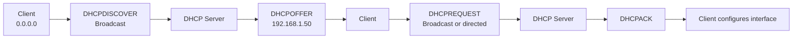
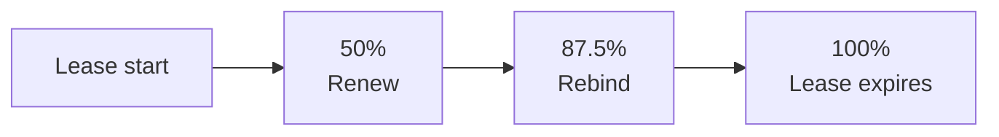
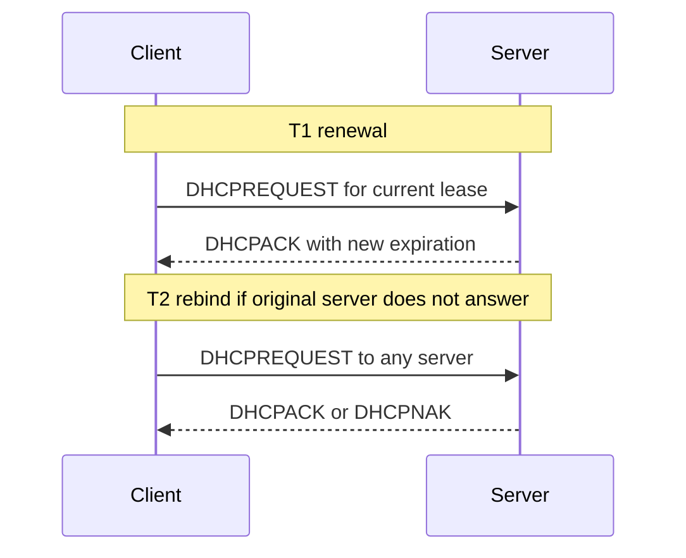
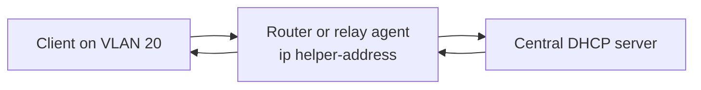

# 13d. DHCP

DHCP automates IP configuration so hosts can join a network quickly and consistently. This file preserves the original 13.9.x numbering.

See the [master glossary](../00-glossary-and-full-forms.md) for the complete abbreviation reference used across the repo.

> **Key Terms**
> - **DHCP** — *Dynamic Host Configuration Protocol*: Automatically assigns IP settings to clients.
> - **DORA** — *Discover, Offer, Request, Acknowledge*: Four-step DHCP lease exchange.
> - **UDP** — *User Datagram Protocol*: Transport used by DHCP.
> - **DNS** — *Domain Name System*: Common DHCP option distributed to clients.
> - **NTP** — *Network Time Protocol*: Optional time server information that DHCP can provide.
> - **VLAN** — *Virtual Local Area Network*: Often requires DHCP relay between segments.
>
> **Cross-references**
> - [Protocol index](13-essential-protocols.md) for the overview, ports, security map, and troubleshooting checklist.
> - [13c DNS](13c-dns.md)
> - [13e NFS](13e-nfs.md)
> - [13i SNMP](13i-snmp.md)

DHCP gives a device its network identity automatically.
Without DHCP, many hosts would require manual configuration.
That is manageable for a few servers.
It is not manageable for large fleets of laptops, phones, printers, VMs, and IoT devices.

A DHCP server typically provides:
- IP address
- subnet mask
- default gateway
- DNS servers
- lease time
- optional search domain
- optional NTP server
- other vendor-specific options

## 13.9.1 Default ports and transport

| Role | Port | Transport |
|---|---:|---|
| DHCP server | 67 | UDP |
| DHCP client | 68 | UDP |

## 13.9.2 Why DHCP uses broadcast first

A new client often has no IP address yet.
It may not know the subnet.
It may not know the gateway.
It therefore begins with a broadcast request.

## 13.9.3 The DORA process

DORA stands for:
- Discover
- Offer
- Request
- Acknowledge



## 13.9.4 Step-by-step explanation

### Discover

The client sends a broadcast because it does not yet know the server.
The source IP is usually `0.0.0.0`.
The destination is broadcast.

### Offer

One or more servers may respond with an offer.
The offer includes:
- proposed IP address
- subnet mask
- gateway
- DNS servers
- lease duration

### Request

The client selects one offer and requests it.
This informs other DHCP servers that their offers were not chosen.

### ACK

The chosen server confirms the lease.
The client then applies the configuration.

## 13.9.5 Broadcast view of DORA



## 13.9.6 What a lease really means

A lease is temporary permission to use an address.
The address belongs to the network policy.
The client only borrows it.
This allows:
- reuse of addresses
- easier inventory
- automatic recovery from stale clients

## 13.9.7 Lease timers

Important timers:
- `T1` usually 50 percent of lease time
- `T2` usually 87.5 percent of lease time
- expiration at 100 percent

Meaning:
- at `T1`, the client tries to renew with the original server
- at `T2`, it tries to rebind with any available server
- at expiration, the address is no longer valid



## 13.9.8 Renewal flow



## 13.9.9 DHCP relay agents

Broadcast traffic does not cross routers by default.
That is why large routed networks often use a DHCP relay.
The relay listens for client broadcasts on a subnet and forwards them to a central DHCP server.



## 13.9.10 Reservations

A reservation gives the same IP to a known MAC address every time.
This is useful for:
- printers
- IP phones
- appliances
- servers that should be stable without static config on the host

## 13.9.11 Static IP versus reservation

| Approach | Where managed | Best for |
|---|---|---|
| Static IP on host | On the device itself | Fixed servers with tight control |
| DHCP reservation | On the DHCP server | Centrally managed predictable clients |
| Dynamic lease | On the DHCP server | General endpoints |

## 13.9.12 Linux DHCP client tools

Different Linux distributions may use:
- `dhclient`
- `systemd-networkd`
- `NetworkManager`
- `dhcpcd`

Useful commands:

```bash
ip addr
ip route
resolvectl status
nmcli device show
journalctl -u NetworkManager --since '30 min ago'
sudo dhclient -v eth0
```

## 13.9.13 Example Linux troubleshooting flow

1. Check link state with `ip link`.
2. Check whether the NIC has a carrier.
3. Run `ip addr` to see if an address exists.
4. Check default route.
5. Check DNS servers.
6. Renew the lease.
7. Watch logs.
8. Capture DHCP packets if necessary.

## 13.9.14 DHCP packet capture example

```bash
sudo tcpdump -nn -i any port 67 or port 68
```

Expected packet names:
- `DHCPDISCOVER`
- `DHCPOFFER`
- `DHCPREQUEST`
- `DHCPACK`

## 13.9.15 Common DHCP failure patterns

| Symptom | Likely cause |
|---|---|
| No IP address at all | DHCP server unreachable or relay missing |
| APIPA address `169.254.x.x` | Lease failed and link-local fallback used |
| Wrong subnet | Misconfigured scope or relay |
| No default route | Missing DHCP option for router |
| DNS missing | DHCP option not supplied |
| Lease denied | Pool exhausted or MAC policy block |

## 13.9.16 DHCP security notes

DHCP itself is not authenticated strongly in common deployments.
That means rogue servers are possible on untrusted networks.
Protect against this with:
- switch DHCP snooping
- port security
- trusted uplinks only
- network segmentation

## 13.9.17 Example `dnsmasq` snippet

```conf
dhcp-range=192.168.1.50,192.168.1.150,255.255.255.0,24h
dhcp-option=option:router,192.168.1.1
dhcp-option=option:dns-server,1.1.1.1,8.8.8.8
```

## 13.9.18 DHCP mini lab

Try to answer these on a lab machine:
- what address was leased
- how long is the lease
- which DNS server was assigned
- which default gateway was assigned
- what happens when you renew

Useful commands:

```bash
ip addr show
ip route
resolvectl dns
sudo dhclient -r eth0
sudo dhclient -v eth0
```

---
