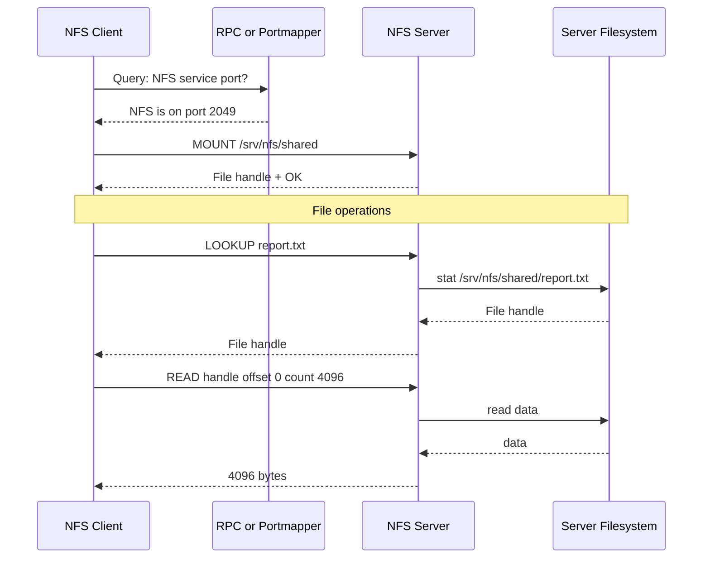
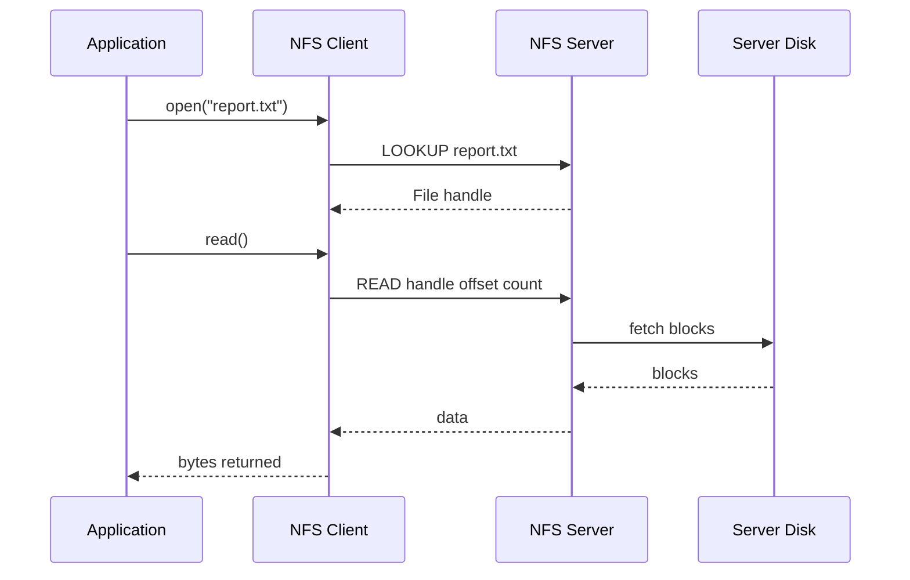

# 13e. NFS

NFS lets Linux systems consume shared storage as mounted filesystems. This file keeps the original 13.10.x numbering and the practical troubleshooting examples.


> **Key Terms**
> - **NFS** — *Network File System*: Remote file sharing protocol common in Linux environments.
> - **TCP** — *Transmission Control Protocol*: Primary transport for NFSv4.
> - **RPC** — *Remote Procedure Call*: Older NFS helper services often depend on RPC mapping.
> - **NAS** — *Network Attached Storage*: Common platform category that exposes NFS shares.
> - **Kerberos** — *Network authentication protocol*: Often paired with NFSv4 for stronger authentication.
>
> **Cross-references**
> - [Protocol index](13-essential-protocols.md) for the overview, ports, security map, and troubleshooting checklist.
> - [13d DHCP](13d-dhcp.md)
> - [13h LDAP](13h-ldap.md)
> - [13c DNS](13c-dns.md)

NFS allows Linux systems to share directories over the network as if they were local filesystems.
It is common in:
- legacy enterprise environments
- virtualization clusters
- research compute farms
- internal shared asset stores
- container host support tooling

## 13.10.1 Default port and transport

| Service | Port | Transport |
|---|---:|---|
| NFSv4 | 2049 | TCP |
| rpcbind or portmapper | 111 | TCP and UDP |
| mountd and helpers | Variable | Often used more with older NFS versions |

## 13.10.2 Why NFS matters operationally

If an NFS mount is slow:
- shells may hang on `ls`
- application startups may stall
- backups may block
- jobs may wait on file locks or metadata

If an NFS mount disappears:
- services can block in uninterruptible sleep
- boot can slow if `fstab` is not tuned properly
- data consistency concerns can appear

## 13.10.3 Basic NFS flow



## 13.10.4 NFS architecture view


## 13.10.5 NFSv3 versus NFSv4

| Version | Notes |
|---|---|
| NFSv3 | Older, more helper daemons, more port complexity |
| NFSv4 | Cleaner design, stronger integration, one main port 2049 |

In modern Linux deployments, prefer NFSv4 unless you have a compatibility constraint.

## 13.10.6 Exports on the server

The NFS server exports directories to selected clients.
The export policy lives in `/etc/exports`.

Example:

```exports
/srv/nfs/shared 192.168.1.0/24(rw,sync,no_subtree_check)
/srv/nfs/readonly 192.168.1.0/24(ro,sync,no_subtree_check)
```

## 13.10.7 Meaning of common export options

| Option | Meaning |
|---|---|
| `rw` | Read and write |
| `ro` | Read only |
| `sync` | Reply after data is committed more safely |
| `async` | Faster but riskier if server crashes |
| `no_subtree_check` | Disable subtree verification |
| `root_squash` | Map remote root to anonymous user |
| `no_root_squash` | Do not map remote root, usually avoid |

## 13.10.8 Server setup example

```bash
sudo apt install -y nfs-kernel-server
sudo mkdir -p /srv/nfs/shared
sudo chown -R nobody:nogroup /srv/nfs/shared
echo '/srv/nfs/shared 192.168.1.0/24(rw,sync,no_subtree_check,root_squash)' | sudo tee -a /etc/exports
sudo exportfs -ra
sudo systemctl enable --now nfs-server nfs-kernel-server
```

## 13.10.9 Client mount example

```bash
sudo mkdir -p /mnt/shared
sudo mount -t nfs nfs01.example.com:/srv/nfs/shared /mnt/shared
mount | grep nfs
```

## 13.10.10 Persistent mount example

```fstab
nfs01.example.com:/srv/nfs/shared  /mnt/shared  nfs4  defaults,_netdev,x-systemd.automount,nofail  0  0
```

Why these options matter:
- `_netdev` tells the system it depends on networking
- `x-systemd.automount` mounts on access instead of at boot
- `nofail` avoids hard boot failure if the share is unavailable

## 13.10.11 Read and write path



## 13.10.12 File locking note

NFS supports advisory locking semantics.
Applications that assume local-disk semantics can behave poorly if they are not NFS-aware.
Always validate workload behavior before placing critical databases on NFS.

## 13.10.13 Identity and permissions

Permissions are still Unix permissions.
That means UID and GID mapping matters.
If the client says a file is owned by UID 1001, the server interprets that UID numerically.
Mismatched identities can cause confusing permission problems.

## 13.10.14 Root squash

`root_squash` is a key safety control.
It maps remote root user activity to an anonymous identity on the server.
Without it, root on any client could act like root on the export.


## 13.10.15 Useful inspection commands

```bash
showmount -e nfs01.example.com
rpcinfo -p nfs01.example.com
nfsstat -m
findmnt -t nfs,nfs4
exportfs -v
```

## 13.10.16 Packet capture example

```bash
sudo tcpdump -nn -i any host nfs01.example.com and port 2049
```

## 13.10.17 Common NFS problems

| Symptom | Likely cause |
|---|---|
| `mount.nfs: access denied` | Export does not allow this client |
| Permission denied on files | UID or GID mismatch or root squash expected |
| Mount hangs | Firewall or server unreachable |
| Stale file handle | File changed or export reconfigured underneath clients |
| Slow reads | Network latency, small rsize or wsize, or overloaded storage |

## 13.10.18 Firewall considerations

Open only the required ports.
NFSv4 is much simpler to firewall than old NFSv3 helper ports.
That is one more reason to prefer NFSv4.

## 13.10.19 NFS security guidance

- keep NFS on trusted networks
- use export restrictions by subnet or host
- keep `root_squash` enabled
- prefer read-only exports where possible
- avoid exposing NFS to the public internet
- consider Kerberos for stronger authentication in sensitive environments

## 13.10.20 NFS mini lab

On the server:

```bash
sudo exportfs -v
sudo ss -tnlp | grep 2049
```

On the client:

```bash
showmount -e nfs01.example.com
sudo mount -t nfs4 nfs01.example.com:/srv/nfs/shared /mnt/shared
ls -la /mnt/shared
```

Observe:
- how ownership appears
- whether writes succeed
- whether remount after reboot works cleanly

---
