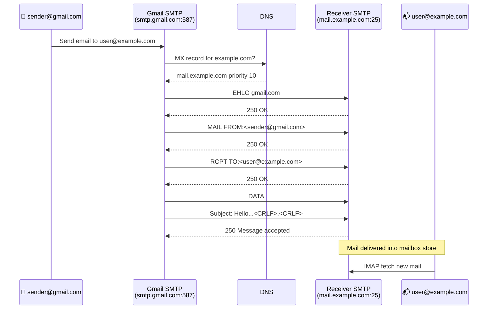
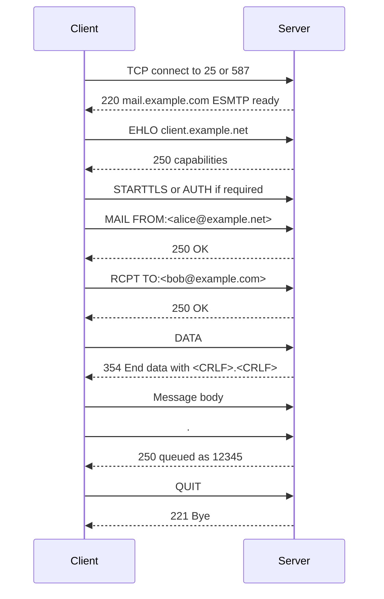
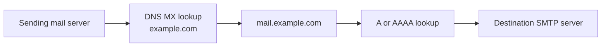
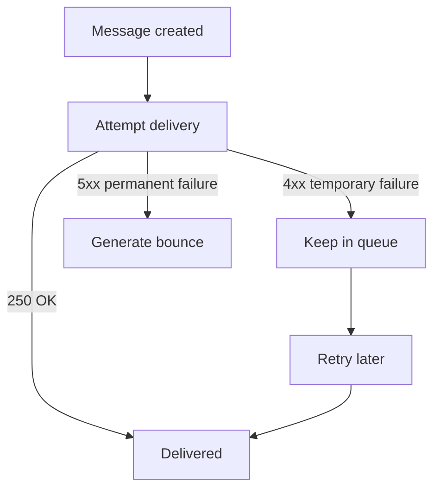
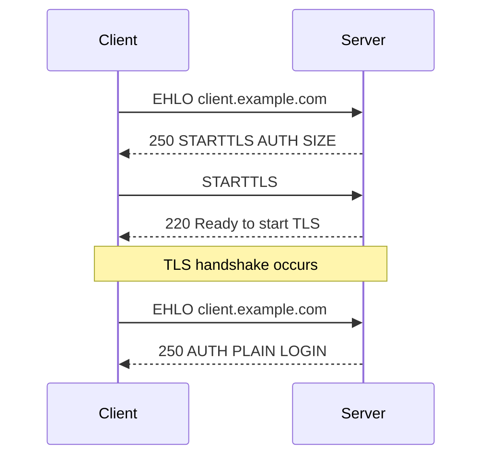
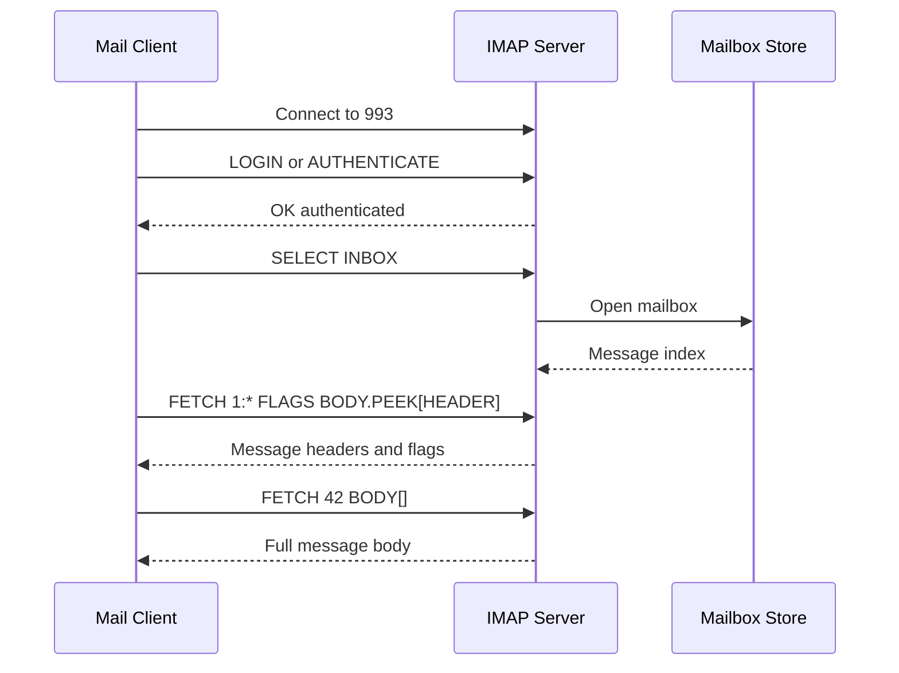
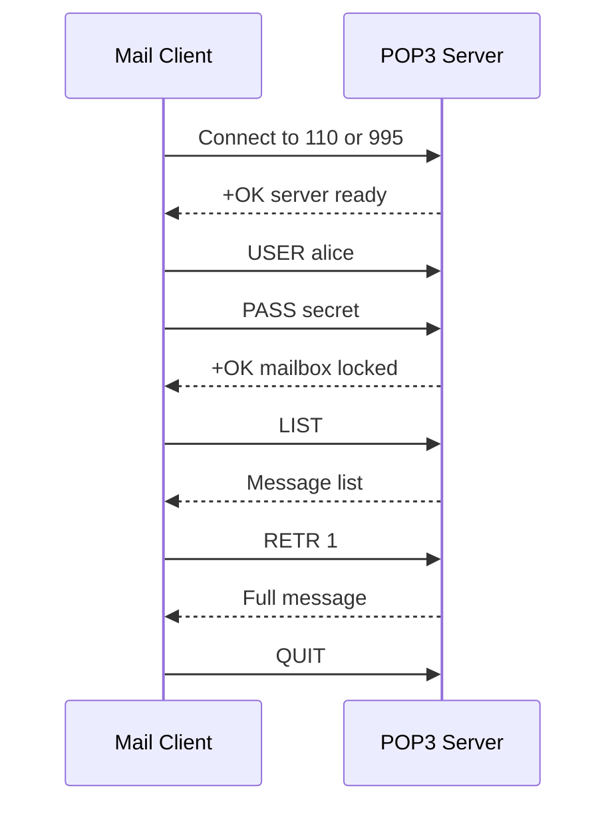
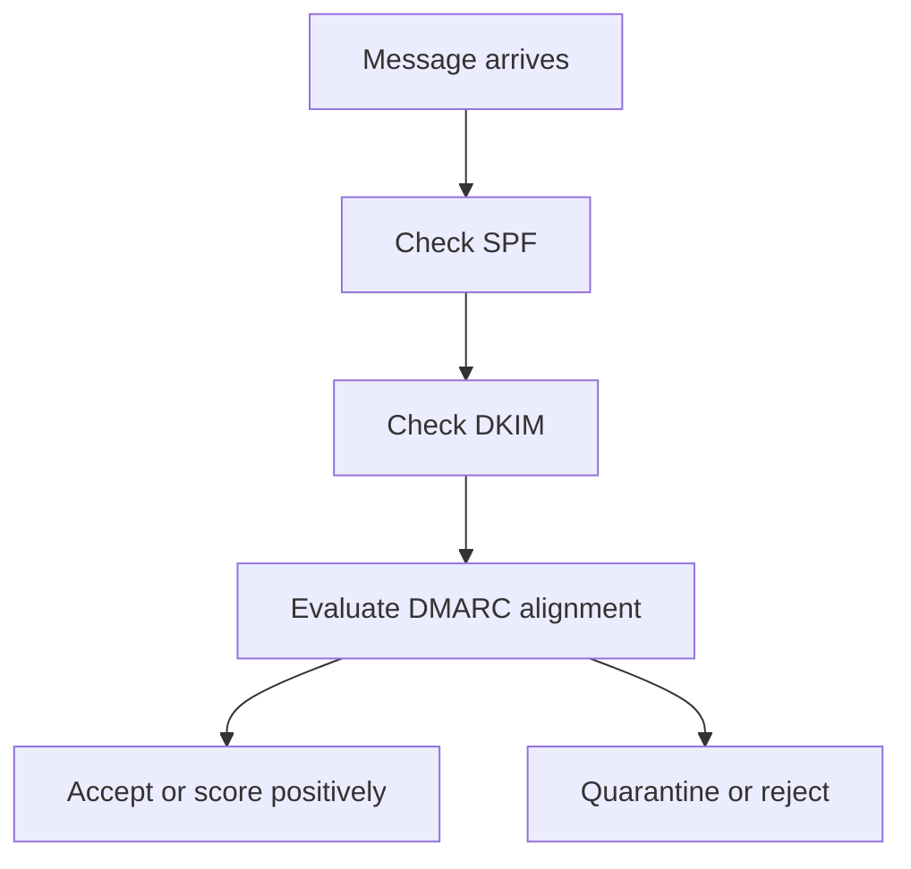

# 13f. SMTP, IMAP, and POP3

Email delivery is a workflow made of multiple protocols rather than one service. This file keeps the original 13.11.x numbering for backward compatibility.


> **Key Terms**
> - **SMTP** — *Simple Mail Transfer Protocol*: Sends and relays email.
> - **IMAP** — *Internet Message Access Protocol*: Synchronizes mailboxes while keeping server-side state.
> - **POP3** — *Post Office Protocol v3*: Downloads mail in a simpler client-side model.
> - **TLS** — *Transport Layer Security*: Protects modern mail sessions.
> - **MX, SPF, DKIM, DMARC** — *Mail-related DNS records and policies*: Direct mail flow and authentication checks.
>
> **Cross-references**
> - [Protocol index](13-essential-protocols.md) for the overview, ports, security map, and troubleshooting checklist.
> - [13c DNS](13c-dns.md)
> - [13a HTTP and HTTPS](13a-http-and-https.md)
> - [13g FTP, FTPS, SFTP, and SCP](13g-ftp-sftp-scp.md)

Email on the internet is not a single protocol.
It is a workflow built from multiple protocols.
SMTP sends and relays mail.
IMAP synchronizes mailbox contents.
POP3 downloads mail in a simpler model.
DNS supports the system through MX records.
TLS protects many modern sessions.

## 13.11.1 Core roles in mail delivery

| Role | Function |
|---|---|
| Mail user agent | User-facing client such as Thunderbird, Outlook, or a webmail backend |
| Submission server | Authenticated SMTP endpoint for sending user mail |
| Relay server | Passes mail between mail systems |
| Destination MX host | Receives mail for a domain |
| Mailbox store | Holds the user's messages |
| IMAP server | Lets clients sync the mailbox |

## 13.11.2 Important ports

| Protocol | Port | Usage |
|---|---:|---|
| SMTP | 25 | Server-to-server relay |
| SMTPS | 465 | Implicit TLS submission |
| SMTP submission | 587 | Authenticated submission, often STARTTLS |
| IMAP | 143 | Mail access, plain or STARTTLS |
| IMAPS | 993 | IMAP over implicit TLS |
| POP3 | 110 | Older retrieval model |
| POP3S | 995 | POP3 over implicit TLS |

## 13.11.3 Basic email delivery flow



## 13.11.4 Submission versus relay

Users usually send mail to port `587` or `465`.
Servers relay mail to other servers on port `25`.
That distinction matters.
A host that allows arbitrary relay on port `25` is a serious security problem.

## 13.11.5 SMTP conversation basics

A classic SMTP session contains commands such as:
- `EHLO`
- `MAIL FROM`
- `RCPT TO`
- `DATA`
- `QUIT`

Example:

```text
EHLO client.example.com
MAIL FROM:<alice@example.net>
RCPT TO:<bob@example.com>
DATA
Subject: Test

Hello Bob
.
QUIT
```

## 13.11.6 SMTP command sequence diagram



## 13.11.7 MX lookup before delivery

Before one server can deliver mail to another domain, it must ask DNS where to send the message.
That is what the MX record provides.



## 13.11.8 Queuing and retry behavior

Mail is store-and-forward.
That means if the destination is temporarily unavailable, the sender usually queues and retries later.
This is very different from an interactive protocol like SSH.



## 13.11.9 STARTTLS versus implicit TLS

| Mode | Port | Meaning |
|---|---:|---|
| SMTP plain then STARTTLS | 25 or 587 | Upgrade an existing cleartext connection to TLS |
| SMTPS implicit TLS | 465 | Start TLS immediately after TCP connect |

## 13.11.10 STARTTLS flow



## 13.11.11 IMAP retrieval flow

IMAP keeps mail on the server and synchronizes state.
That means:
- folders stay on the server
- read or unread state can sync across devices
- search can happen server-side
- message flags can be consistent across clients



## 13.11.12 POP3 retrieval flow

POP3 is simpler.
Traditionally it downloads messages and may delete them from the server.
It is less suited for multi-device synchronization.



## 13.11.13 IMAP versus POP3

| Topic | IMAP | POP3 |
|---|---|---|
| Server-side folders | Yes | Minimal |
| Multi-device sync | Excellent | Weak |
| Read state sync | Yes | Usually no |
| Offline download | Possible | Primary model |
| Modern recommendation | Preferred | Rare unless legacy need |

## 13.11.14 Mail authentication and policy records

Modern email depends heavily on DNS text records for trust policy.
Important terms:
- SPF
- DKIM
- DMARC

### SPF

SPF states which servers may send mail for a domain.

```dns
example.com. 300 IN TXT "v=spf1 ip4:203.0.113.25 include:_spf.google.com -all"
```

### DKIM

DKIM signs messages cryptographically.
The public key is published in DNS.

```dns
selector1._domainkey.example.com. 300 IN TXT "v=DKIM1; k=rsa; p=MIIBIjANBg..."
```

### DMARC

DMARC publishes policy and reporting instructions.

```dns
_dmarc.example.com. 300 IN TXT "v=DMARC1; p=quarantine; rua=mailto:dmarc@example.com"
```

## 13.11.15 Mail delivery path with policy checks



## 13.11.16 Useful Linux mail diagnostics

```bash
dig example.com MX
dig example.com TXT
dig _dmarc.example.com TXT
openssl s_client -starttls smtp -connect mail.example.com:25
openssl s_client -connect mail.example.com:465
swaks --to user@example.com --server mail.example.com
```

## 13.11.17 Reading the SMTP queue

Different MTAs expose queue information differently.
Examples:
- Postfix uses `mailq` or `postqueue -p`
- Exim uses `exim -bp`
- Sendmail uses `mailq`

Postfix examples:

```bash
mailq
postqueue -p
postfix status
sudo journalctl -u postfix --since '1 hour ago'
```

## 13.11.18 Common SMTP response classes

| Code | Meaning |
|---|---|
| `220` | Service ready |
| `221` | Service closing transmission channel |
| `250` | Requested action completed |
| `354` | Start mail input |
| `421` | Service not available |
| `450` | Mailbox unavailable temporarily |
| `451` | Local processing error |
| `550` | Mailbox unavailable permanently |
| `554` | Transaction failed |

## 13.11.19 Common mail problems

| Symptom | Likely cause |
|---|---|
| Outbound mail stuck in queue | Remote MX unavailable or blocked |
| Mail rejected as spam | SPF, DKIM, DMARC, PTR, or reputation issue |
| Client cannot send | Wrong submission port or auth required |
| Client cannot read mail | IMAP or POP3 auth or TLS issue |
| TLS handshake failure | Certificate or protocol mismatch |

## 13.11.20 Mini lab: inspect a public mail domain

```bash
dig gmail.com MX
dig gmail.com TXT
openssl s_client -starttls smtp -connect gmail-smtp-in.l.google.com:25
```

Observe:
- MX priorities
- SMTP banner
- STARTTLS support
- certificate identity

---
