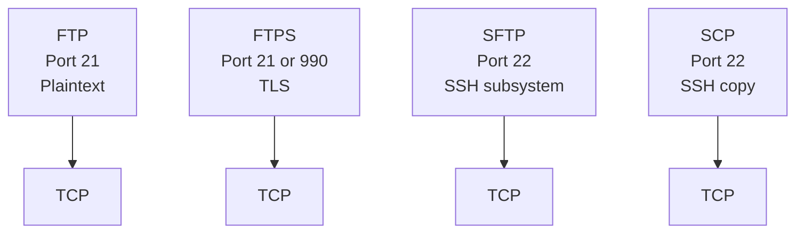
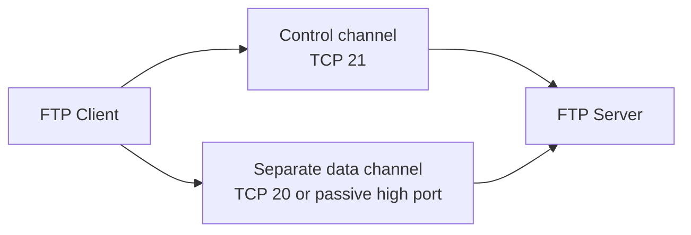
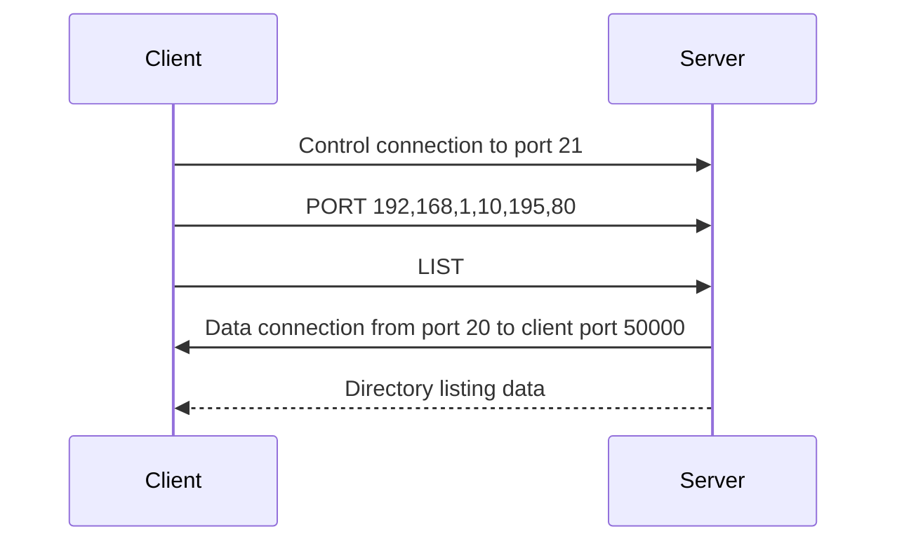
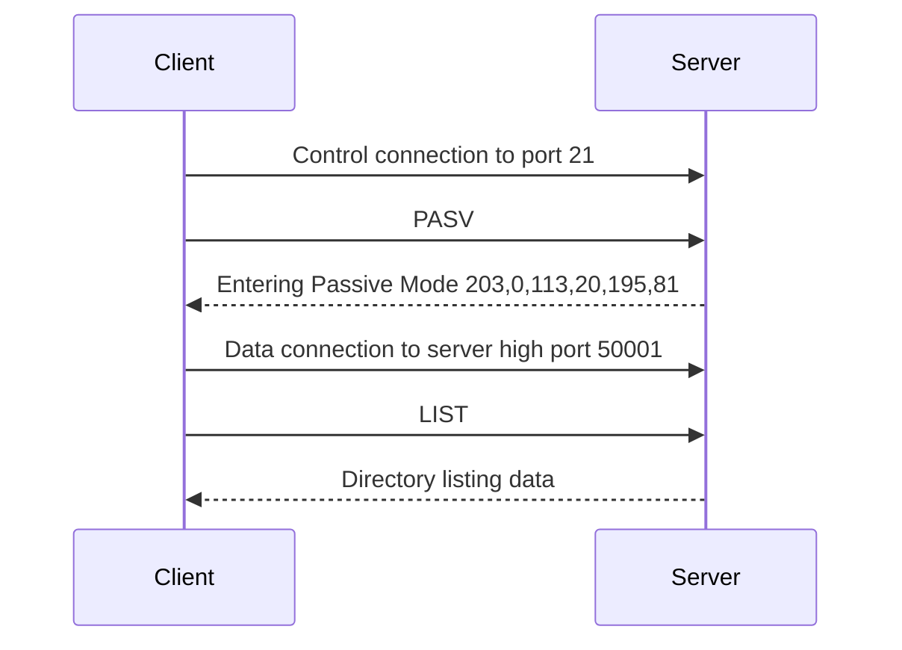
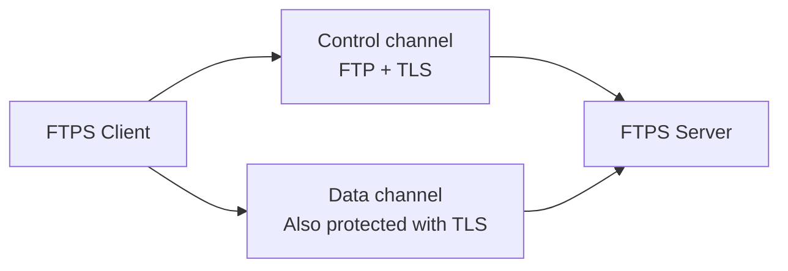
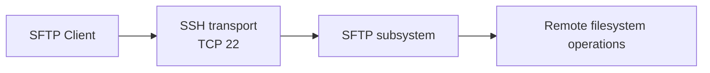
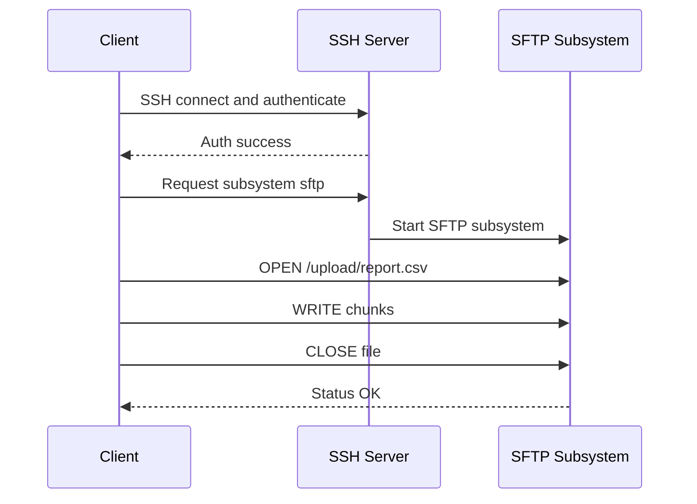

# 13g. FTP, FTPS, SFTP, and SCP

These file-transfer names sound similar but behave very differently on the wire. This file preserves the original 13.12.x numbering and the security comparison.

See the [master glossary](../00-glossary-and-full-forms.md) for the complete abbreviation reference used across the repo.

> **Key Terms**
> - **FTP** — *File Transfer Protocol*: Legacy plaintext file transfer protocol.
> - **FTPS** — *FTP Secure (FTP over TLS)*: FTP protected by TLS.
> - **SFTP** — *SSH File Transfer Protocol*: Secure transfer subsystem over SSH.
> - **SCP** — *Secure Copy Protocol*: Direct file copy over SSH.
> - **SSH, TLS, NAT** — *Related terms*: Explain the secure transports and firewall implications behind these protocols.
>
> **Cross-references**
> - [Protocol index](13-essential-protocols.md) for the overview, ports, security map, and troubleshooting checklist.
> - [13b SSH](13b-ssh.md)
> - [13a HTTP and HTTPS](13a-http-and-https.md)
> - [13f SMTP, IMAP, and POP3](13f-smtp-imap-pop3.md)

File transfer protocols are easy to confuse because the names sound similar.
They are not the same.
Their security properties differ dramatically.
Their network behavior differs too.

## 13.12.1 Quick comparison table

| Protocol | Default port | Encryption | Transport model | Common use today |
|---|---:|---|---|---|
| FTP | 21 control, 20 or passive ports for data | No | Separate control and data channels | Legacy only |
| FTPS | 21 explicit TLS or 990 implicit TLS | Yes | FTP semantics plus TLS | Compatibility with partners |
| SFTP | 22 | Yes | SSH subsystem | Preferred secure transfer |
| SCP | 22 | Yes | SSH copy protocol | Simple point-to-point copy |

## 13.12.2 Visual comparison map



## 13.12.3 Classic FTP control and data channels

FTP is unusual because it uses one connection for commands and another for data.
That design complicates NAT and firewalls.



## 13.12.4 Active FTP

In active FTP, the client tells the server where to connect back for the data channel.
This often fails through NAT or strict firewalls.



## 13.12.5 Passive FTP

Passive FTP is more firewall-friendly.
The server opens a listening high port and tells the client where to connect.



## 13.12.6 Why FTP is risky

FTP sends credentials in plaintext unless wrapped in TLS.
Anyone with packet visibility can capture:
- username
- password
- filenames
- file contents

## 13.12.7 FTPS

FTPS adds TLS to FTP.
There are two common models:
- explicit TLS on port `21`
- implicit TLS on port `990`



## 13.12.8 SFTP

SFTP is not FTP over SSH.
It is an SSH subsystem with its own message types.
It uses one encrypted connection on port `22`.
That makes it much simpler to firewall and audit.



## 13.12.9 SFTP request flow



## 13.12.10 SCP

SCP is a simpler remote copy method over SSH.
It is great for quick file copies.
For advanced remote directory browsing or resumable workflow, SFTP tools are often nicer.


## 13.12.11 Command examples

### FTP client example

```bash
ftp ftp.example.com
```

### SFTP examples

```bash
sftp user@files.example.com
sftp -P 2222 user@files.example.com
put report.csv
get backup.tar.gz
ls
pwd
```

### SCP examples

```bash
scp report.csv user@files.example.com:/uploads/
scp -r website/ user@files.example.com:/var/www/
scp -P 2222 backup.tar.gz user@files.example.com:/backups/
```

## 13.12.12 Choosing between SFTP and SCP

| Need | Better choice |
|---|---|
| Interactive file browsing | SFTP |
| One quick copy command | SCP |
| Resume and advanced clients | SFTP |
| Secure partner compatibility | SFTP unless partner mandates FTPS |

## 13.12.13 Firewall implications

| Protocol | Firewall complexity |
|---|---|
| FTP | High |
| FTPS | High and encrypted control can complicate inspection |
| SFTP | Low |
| SCP | Low |

## 13.12.14 Security recommendation summary

- avoid plain FTP on modern networks
- use SFTP by default for secure transfers
- use SCP for quick trusted administrative copies
- use FTPS only when a third party requires classic FTP semantics with encryption

## 13.12.15 Example server packages

```bash
sudo apt install -y vsftpd
sudo systemctl enable --now vsftpd
sudo apt install -y openssh-server
sudo systemctl enable --now ssh
```

## 13.12.16 Common transfer problems

| Symptom | Likely cause |
|---|---|
| FTP login works but listing fails | Passive ports blocked |
| SFTP auth fails | SSH key or account issue |
| SCP hangs | SSH connectivity or host key problem |
| FTPS cert warning | TLS cert not trusted or wrong hostname |

## 13.12.17 Mini lab: compare protocols

Try:

```bash
ssh -v user@host
sftp user@host
scp test.txt user@host:/tmp/
```

Notice:
- SFTP and SCP reuse SSH auth
- only one TCP port is needed
- host key verification is shared with SSH

---
