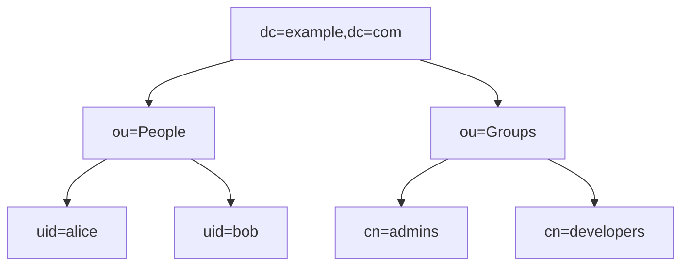
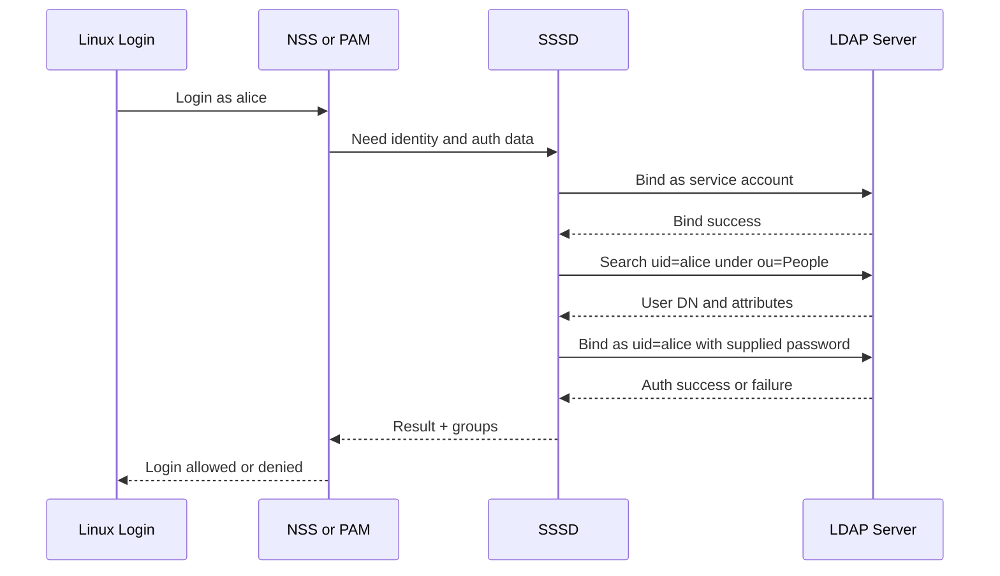
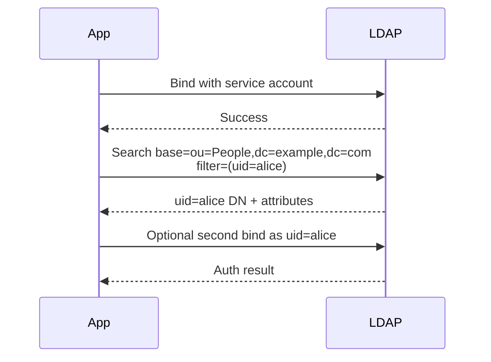
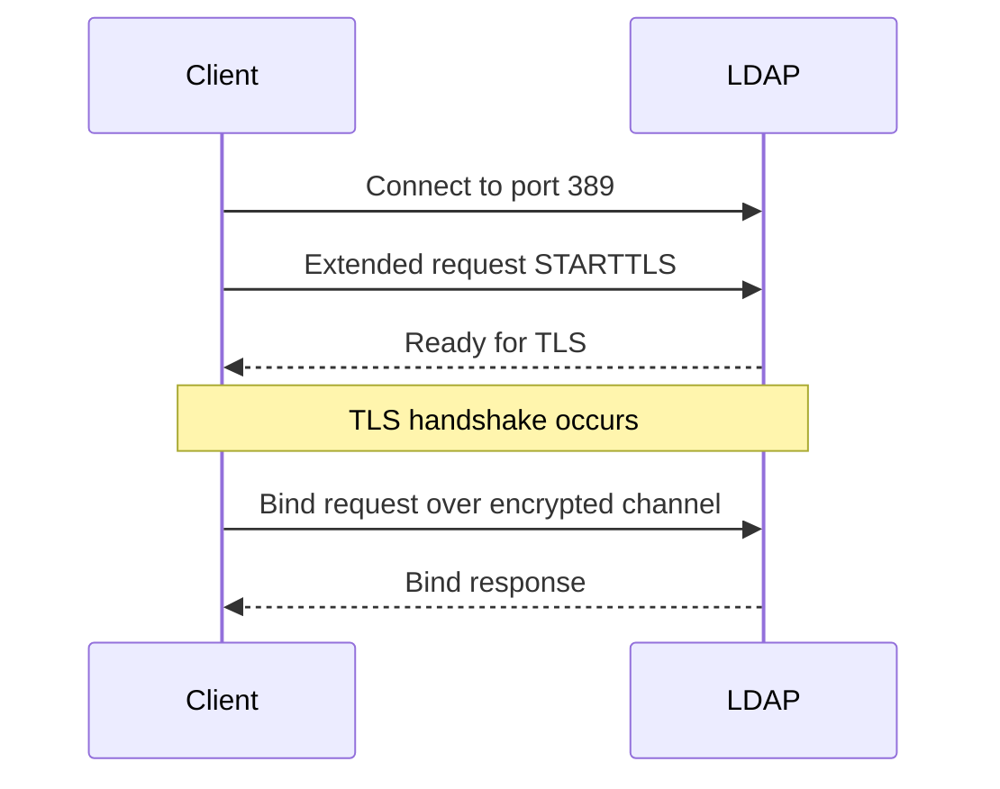
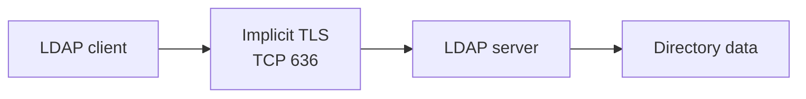

# 13h. LDAP

LDAP provides structured directory lookup for users, groups, hosts, and service accounts. This file keeps the original 13.13.x numbering.


> **Key Terms**
> - **LDAP** — *Lightweight Directory Access Protocol*: Directory query and update protocol.
> - **LDAPS** — *LDAP over SSL/TLS*: LDAP protected by implicit TLS.
> - **TLS** — *Transport Layer Security*: Encrypts bind and search traffic.
> - **PAM, NSS, SSSD** — *Linux integration components*: Bridge Linux logins and identity lookups to directories.
> - **RBAC** — *Role-Based Access Control*: Often enforced using directory group membership.
>
> **Cross-references**
> - [Protocol index](13-essential-protocols.md) for the overview, ports, security map, and troubleshooting checklist.
> - [13c DNS](13c-dns.md)
> - [13b SSH](13b-ssh.md)
> - [13e NFS](13e-nfs.md)

LDAP stands for Lightweight Directory Access Protocol.
It is used to query and modify directory services.
A directory is optimized for reads and structured identity information.
Common stored objects include:
- users
- groups
- hosts
- service accounts
- organizational units
- policies

Linux environments often use LDAP directly or indirectly through:
- OpenLDAP
- Active Directory
- FreeIPA
- SSSD
- PAM and NSS integration

## 13.13.1 Default ports

| Service | Port | Notes |
|---|---:|---|
| LDAP | 389 | Plain or STARTTLS |
| LDAPS | 636 | Implicit TLS |

## 13.13.2 What LDAP is good at

LDAP is strong at:
- centralized identity
- group membership lookup
- user attribute lookup
- authentication workflows
- access control decisions by directory membership

LDAP is not usually where you store high-write transactional application data.
That is what relational databases or key-value stores are for.

## 13.13.3 Directory information tree

LDAP data is arranged as a tree called the directory information tree.
Each entry has a distinguished name.



## 13.13.4 Distinguished names and attributes

Example DN:

```text
uid=alice,ou=People,dc=example,dc=com
```

Example attributes:
- `uid`
- `cn`
- `sn`
- `mail`
- `uidNumber`
- `gidNumber`
- `memberOf`

## 13.13.5 Typical LDAP authentication flow



## 13.13.6 Anonymous bind versus authenticated bind

Some directories allow anonymous read of limited attributes.
Many production directories disable anonymous access.
A safer common model is:
- bind as a low-privilege service account for searches
- locate the user's DN
- bind as the user to verify credentials

## 13.13.7 Search flow in detail



## 13.13.8 Example LDAP search command

```bash
ldapsearch -x -H ldap://ldap.example.com -b dc=example,dc=com '(uid=alice)'
```

## 13.13.9 Example LDAP search with bind DN

```bash
ldapsearch -x -H ldap://ldap.example.com \
  -D 'cn=lookup,ou=ServiceAccounts,dc=example,dc=com' \
  -W \
  -b 'dc=example,dc=com' \
  '(uid=alice)'
```

## 13.13.10 STARTTLS flow



## 13.13.11 LDAPS flow



## 13.13.12 Search filters

Common filters:

```text
(uid=alice)
(&(objectClass=person)(uid=alice))
(|(uid=alice)(mail=alice@example.com))
(memberOf=cn=admins,ou=Groups,dc=example,dc=com)
```

## 13.13.13 Groups and authorization

Authentication answers the question:
- who are you

Authorization answers the question:
- what may you do

LDAP often helps with authorization by providing group membership.
Example group entry:

```ldif
dn: cn=admins,ou=Groups,dc=example,dc=com
objectClass: groupOfNames
cn: admins
member: uid=alice,ou=People,dc=example,dc=com
member: uid=bob,ou=People,dc=example,dc=com
```

## 13.13.14 Linux integration components

| Component | Role |
|---|---|
| PAM | Authentication stack |
| NSS | Name service lookup for users and groups |
| SSSD | Caching and integration layer |
| `ldapsearch` | Manual query tool |
| `getent` | Check NSS-resolved user and group data |

## 13.13.15 Identity lookup on Linux

Useful commands:

```bash
getent passwd alice
getent group admins
id alice
sssctl user-checks alice
```

## 13.13.16 LDAP entry example in LDIF

```ldif
dn: uid=alice,ou=People,dc=example,dc=com
objectClass: inetOrgPerson
objectClass: posixAccount
cn: Alice Admin
sn: Admin
uid: alice
mail: alice@example.com
uidNumber: 10001
gidNumber: 10001
homeDirectory: /home/alice
loginShell: /bin/bash
```

## 13.13.17 LDAP modify example

```ldif
dn: uid=alice,ou=People,dc=example,dc=com
changetype: modify
replace: loginShell
loginShell: /bin/zsh
```

Apply with:

```bash
ldapmodify -x -D 'cn=admin,dc=example,dc=com' -W -f change.ldif
```

## 13.13.18 Common directory layouts

```text
dc=example,dc=com
ou=People
ou=Groups
ou=Hosts
ou=ServiceAccounts
```

## 13.13.19 LDAP versus Active Directory note

Active Directory supports LDAP for directory queries and many authentication-related integrations.
But AD is more than LDAP alone.
It also includes Kerberos, Group Policy, DNS integration, and other Microsoft-specific services.

## 13.13.20 Common LDAP problems

| Symptom | Likely cause |
|---|---|
| User lookup works but login fails | Bind auth failure or PAM issue |
| TLS failure on 636 | Certificate mismatch or trust issue |
| Group lookups wrong | Search base or schema mismatch |
| Slow logins | Directory latency or SSSD cache issue |
| `Invalid credentials` | Wrong bind DN or password |

## 13.13.21 LDAP security guidance

- prefer TLS via STARTTLS or LDAPS
- avoid anonymous write access entirely
- restrict service account permissions
- do not expose directory servers broadly
- validate certificates properly
- log bind failures and excessive search volume

## 13.13.22 LDAP mini lab

```bash
ldapsearch -x -H ldap://ldap.example.com -b dc=example,dc=com '(uid=alice)'
getent passwd alice
id alice
```

Observe:
- whether the user appears through NSS
- whether the UID and GID map correctly
- whether group memberships align with expected access

---
