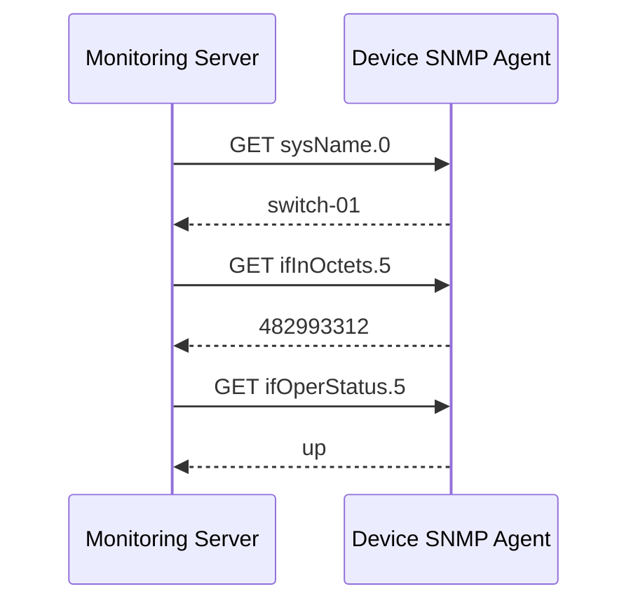
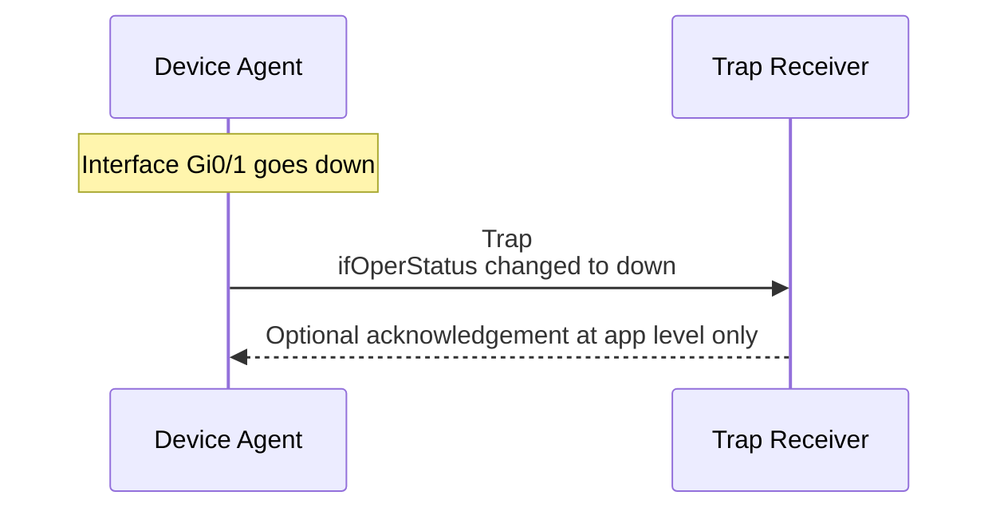
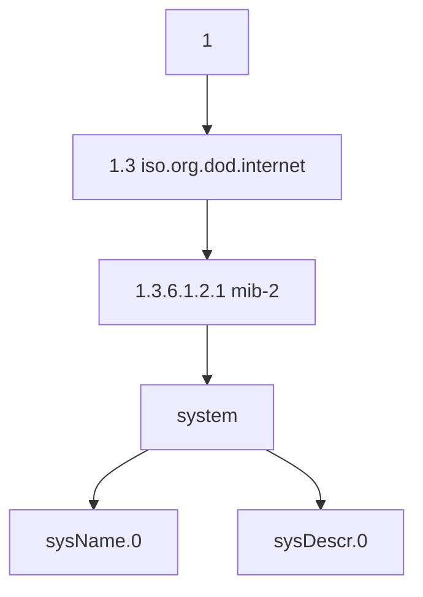
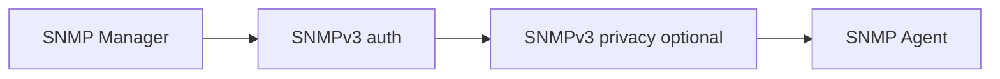
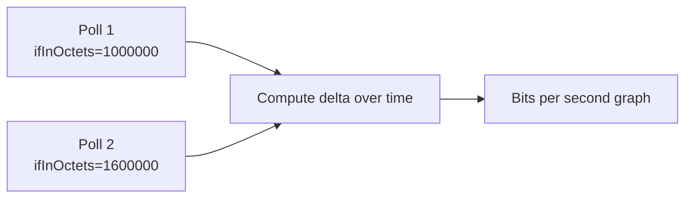
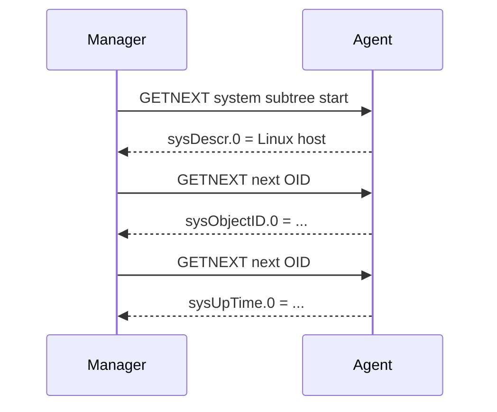

# 13i. SNMP

SNMP remains a foundational protocol for monitoring network devices, power systems, and legacy server stacks. This file preserves the original 13.14.x numbering.


> **Key Terms**
> - **SNMP** — *Simple Network Management Protocol*: Monitoring and management protocol for devices.
> - **MIB** — *Management Information Base*: Schema that names SNMP objects.
> - **OID** — *Object Identifier*: Numeric identifier for an SNMP value.
> - **UDP** — *User Datagram Protocol*: Transport used by classic SNMP polling and traps.
> - **AES, SHA** — *Security algorithms*: Commonly used by SNMPv3 for privacy and authentication.
>
> **Cross-references**
> - [Protocol index](13-essential-protocols.md) for the overview, ports, security map, and troubleshooting checklist.
> - [13d DHCP](13d-dhcp.md)
> - [13h LDAP](13h-ldap.md)

SNMP is used for monitoring and managing network devices and some servers.
It is common on:
- switches
- routers
- firewalls
- UPS units
- printers
- storage arrays
- older Linux server monitoring stacks

SNMP is not a general secure remote shell.
It is a management and telemetry protocol.

## 13.14.1 Default ports

| Service | Port | Transport |
|---|---:|---|
| SNMP polling | 161 | UDP |
| SNMP traps | 162 | UDP |

## 13.14.2 Core actors

| Actor | Role |
|---|---|
| Manager | Monitoring system that asks questions |
| Agent | Software on device answering questions |
| MIB | Human-readable schema for OIDs |
| OID | Numeric object identifier for values |
| Trap receiver | Server that listens for unsolicited alerts |

## 13.14.3 Polling model



## 13.14.4 Trap model

A trap is unsolicited.
The device sends it when something happens.
Examples:
- interface down
- power event
- temperature alert
- authentication failure



## 13.14.5 Polling versus traps

| Topic | Polling | Trap |
|---|---|---|
| Who starts exchange | Manager | Agent |
| Best for | Regular metrics | Immediate events |
| Reliability model | Repeated checks | Best effort notification |
| Typical cadence | Every 30 to 300 seconds | On event |

## 13.14.6 OID tree idea

SNMP values live in a hierarchical numeric tree.
For example:
- `1.3.6.1.2.1.1.5.0` is often `sysName.0`
- `1.3.6.1.2.1.1.1.0` is often `sysDescr.0`



## 13.14.7 SNMP versions

| Version | Security characteristics |
|---|---|
| SNMPv1 | Very old, community strings only |
| SNMPv2c | Common historically, community strings only |
| SNMPv3 | Adds authentication and privacy support |

## 13.14.8 Community strings

In SNMPv1 and SNMPv2c, the community string behaves like a shared password.
Common defaults like `public` and `private` are insecure.
Do not expose them on untrusted networks.

## 13.14.9 SNMPv3 security model

SNMPv3 can provide:
- authentication
- integrity
- optional encryption called privacy



## 13.14.10 Useful SNMP commands

```bash
snmpget -v2c -c public router.example.com sysName.0
snmpwalk -v2c -c public router.example.com 1.3.6.1.2.1.1
snmpwalk -v3 -l authPriv -u monitor -a SHA -A 'authpass' -x AES -X 'privpass' router.example.com system
snmptrapd -f -Lo
```

## 13.14.11 Reading interface counters

Monitoring systems often poll interface byte counters.
From those counters they calculate rates.
That is how bandwidth graphs are built.



## 13.14.12 Linux SNMP agent example

A Linux server may run `snmpd`.
Configuration often lives in `/etc/snmp/snmpd.conf`.

Example minimal snippet:

```conf
rocommunity monitor 192.168.1.0/24
sysLocation ServerRoomA
sysContact ops@example.com
```

## 13.14.13 SNMP walk concept

A walk requests a subtree of values.
This is useful for discovery and troubleshooting.



## 13.14.14 Common SNMP problems

| Symptom | Likely cause |
|---|---|
| No reply on port 161 | Firewall, agent down, wrong version |
| Authentication failure | Wrong community or SNMPv3 credentials |
| Trap receiver sees nothing | Port 162 blocked or destination wrong |
| Data present but weird names | Missing MIB files on manager |
| Monitoring gaps | Poll interval too long or packet loss |

## 13.14.15 SNMP security guidance

- prefer SNMPv3 on modern networks
- restrict source IPs that may query the agent
- never use default community strings
- avoid exposing SNMP to the public internet
- monitor for auth failures
- encrypt where possible

## 13.14.16 SNMP mini lab

```bash
snmpget -v2c -c public localhost sysName.0
snmpwalk -v2c -c public localhost system
ss -ulpn | grep ':161 '
```

Observe:
- whether the agent is listening
- whether your query source is allowed
- whether names resolve to friendly MIB labels

---
