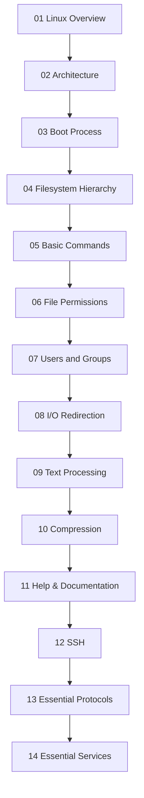

# 📖 Linux Fundamentals

> Foundation concepts from basic to intermediate — start here if you're new to Linux.

This fundamentals guide has been split into topic-focused files so you can learn one area at a time without scrolling through a single massive document.

## 📑 Topics

| # | Topic | Description |
|---|-------|-------------|
| 01 | [Linux Overview](./01-linux-overview.md) | What Linux is, kernel vs distro, history, distributions |
| 02 | [Architecture](./02-architecture.md) | Kernel, shell, libraries, user space layers |
| 03 | [Boot Process](./03-boot-process.md) | BIOS/UEFI → GRUB → Kernel → systemd |
| 04 | [Filesystem Hierarchy](./04-filesystem-hierarchy.md) | FHS directories plus Linux file types |
| 05 | [Basic Commands](./05-basic-commands.md) | Navigation, file management, inspection commands |
| 06 | [File Permissions](./06-file-permissions.md) | chmod, chown, umask, SUID, SGID, sticky bit, ACLs |
| 07 | [Users and Groups](./07-users-and-groups.md) | useradd, usermod, passwd, sudo, account files |
| 08 | [I/O Redirection](./08-io-redirection.md) | stdin, stdout, stderr, pipes, tee, xargs |
| 09 | [Text Processing](./09-text-processing.md) | grep, sed, awk, cut, sort, uniq, tr, diff |
| 10 | [Compression](./10-compression.md) | tar, gzip, bzip2, xz, zip |
| 11 | [Help & Documentation](./11-help-documentation.md) | man, info, whatis, apropos, practice, review |
| 12 | [SSH — Secure Shell](./12-ssh.md) | SSH login, keys, config, tunnels, SCP, SFTP, database access |
| 13 | [Essential Protocols](./13-essential-protocols.md) | HTTP, TLS, DNS, NFS, FTP/SFTP, SMTP, IMAP, POP3 |
| 14 | [Setting Up Essential Services](./14-setting-up-essential-services.md) | SSH, NFS, BIND9, Nginx, Apache setup and verification |

## 🗺️ Learning Path

## ✅ Recommended Start

- New to Linux: begin with **01 → 05**
- Admin-focused learning: continue with **06 → 08**
- Daily shell productivity: focus heavily on **09 → 11**
- Remote access and networking foundation: continue with **12 → 14**

> Tip:
> Practice commands in a lab VM, container, or non-production system before using them on important machines.
