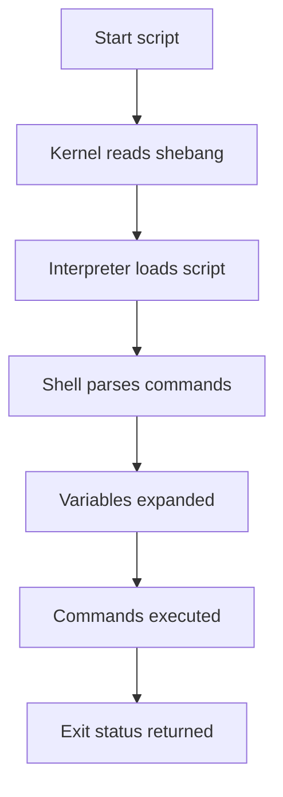

# Introduction to Shell

> Shell types, shebangs, execution flow, and script basics.

## 1. Introduction to Shell

### 1.1 What Is a Shell?

A shell is a command-line interpreter that provides a user interface for interacting with an operating system.

It reads commands.

It interprets them.

It executes programs.

It can also run scripts.

A shell script is a text file containing commands that the shell can execute.

Shell scripting is used for:

- Automation
- System administration
- DevOps workflows
- Deployment pipelines
- Log analysis
- Backups
- Monitoring
- File processing
- Text transformation
- Scheduled jobs

### 1.2 Why Learn Shell Scripting?

Shell scripting is useful because:

- It is available on most Unix-like systems.
- It glues system tools together effectively.
- It is ideal for automation tasks.
- It integrates with utilities like `grep`, `awk`, `sed`, `find`, and `xargs`.
- It can be used in CI/CD pipelines.
- It is lightweight and fast to start.

### 1.3 Types of Shells

Different shells provide different features.

| Shell | Description | Common Use Case | Notes |
| --- | --- | --- | --- |
| `sh` | Original Bourne shell interface or POSIX shell link | Portable scripts | Often linked to another shell |
| `bash` | Bourne Again Shell | General scripting and interactive use | Very common on Linux |
| `zsh` | Extended Bourne-style shell | Interactive users and scripting | Powerful completion and customization |
| `fish` | Friendly Interactive Shell | User-friendly interactive shell | Not POSIX-compatible |
| `dash` | Debian Almquist shell | Fast POSIX shell scripts | Lightweight and fast |

#### 1.3.1 `sh`

- Focuses on portability.
- Best for scripts that must run across many systems.
- Avoids shell-specific extensions.

#### 1.3.2 `bash`

- Most popular scripting shell on Linux.
- Supports arrays, associative arrays, `[[ ]]`, arithmetic expansion, process substitution, and more.
- Great for both beginners and advanced users.

#### 1.3.3 `zsh`

- Strong interactive shell.
- Powerful globbing.
- Supports advanced completion.
- Many `bash` scripts work with small adjustments.

#### 1.3.4 `fish`

- Designed for usability.
- Syntax differs from POSIX shells.
- Good for interactive work.
- Less common for portable production scripts.

#### 1.3.5 `dash`

- Very fast startup.
- Often used for system scripts requiring POSIX compliance.
- Lacks Bash-only features like arrays and `[[ ]]`.

### 1.4 Choosing the Right Shell

Use this quick guidance:

| Need | Recommended Shell |
| --- | --- |
| Maximum portability | `sh` / POSIX-compliant shell |
| Feature-rich scripting | `bash` |
| Interactive productivity | `zsh` |
| Beginner-friendly interactive use | `fish` |
| Fast minimal scripts | `dash` |

### 1.5 Shebang Line

The shebang tells the system which interpreter should run the script.

Basic example:

```bash
#!/bin/bash
```

Portable environment lookup:

```bash
#!/usr/bin/env bash
```

POSIX shell example:

```sh
#!/bin/sh
```

#### When to use `/usr/bin/env`

Use it when:

- The interpreter location may vary.
- You want to respect the current environment.
- You are working on systems where Bash is not always in `/bin/bash`.

#### When to use an absolute path

Use it when:

- You need predictable interpreter location.
- Your environment is controlled.
- You want clarity in production systems.

### 1.6 Making Scripts Executable

Create a script:

```bash
cat > hello.sh <<'EOF'
#!/usr/bin/env bash
echo "Hello, world!"
EOF
```

Make it executable:

```bash
chmod +x hello.sh
```

Run it:

```bash
./hello.sh
```

You can also run it explicitly with a shell:

```bash
bash hello.sh
```

### 1.7 How Script Execution Works



### 1.8 Script File Basics

Recommended conventions:

- Use `.sh` for readability.
- Include a shebang.
- Keep scripts in version control.
- Add comments for non-obvious logic.
- Use Unix line endings.

### 1.9 First Example Script

```bash
#!/usr/bin/env bash

name="Shell"
echo "Hello, $name scripting!"
```

### 1.10 Running with Debugging

```bash
bash -x script.sh
```

Or inside the script:

```bash
set -x
```

### 1.11 Interactive vs Non-Interactive Shells

| Type | Meaning |
| --- | --- |
| Interactive shell | User types commands directly |
| Non-interactive shell | Shell runs commands from a script |

Interactive shells often load startup files such as:

- `.bashrc`
- `.zshrc`
- `.profile`

Scripts should not rely on interactive shell configuration unless explicitly sourced.

### 1.12 Login vs Non-Login Shells

| Type | Common Startup Files |
| --- | --- |
| Login shell | `.profile`, `.bash_profile`, `.zprofile` |
| Non-login shell | `.bashrc`, `.zshrc` |

### 1.13 Common Script Use Cases

- Rename files in bulk
- Check disk usage
- Parse logs
- Backup directories
- Deploy applications
- Rotate logs
- Start background services
- Monitor processes

### 1.14 Comments in Shell Scripts

Single-line comment:

```bash
# This is a comment
```

Inline comment:

```bash
echo "done"  # status output
```

### 1.15 Script Header Template

```bash
#!/usr/bin/env bash
set -euo pipefail

# Description: Example script header
# Usage: ./script.sh [args]
# Author: Your Name
```

### 1.16 Common Mistakes in Beginner Scripts

- Missing shebang
- Not quoting variables
- Assuming Bash features in `sh`
- Ignoring exit codes
- Parsing command output unsafely
- Using spaces around `=` in assignments

Incorrect:

```bash
name = value
```

Correct:

```bash
name=value
```

### 1.17 Bash Version Check

```bash
echo "$BASH_VERSION"
```

### 1.18 Detect Current Shell

```bash
echo "$SHELL"
ps -p $$
```

### 1.19 Minimal Portable Script

```sh
#!/bin/sh
printf '%s\n' 'Portable shell script'
```

### 1.20 Section Summary

At this point you should understand:

- What a shell is
- Major shell types
- How shebang lines work
- How to make a script executable
- Basic script execution flow

---
