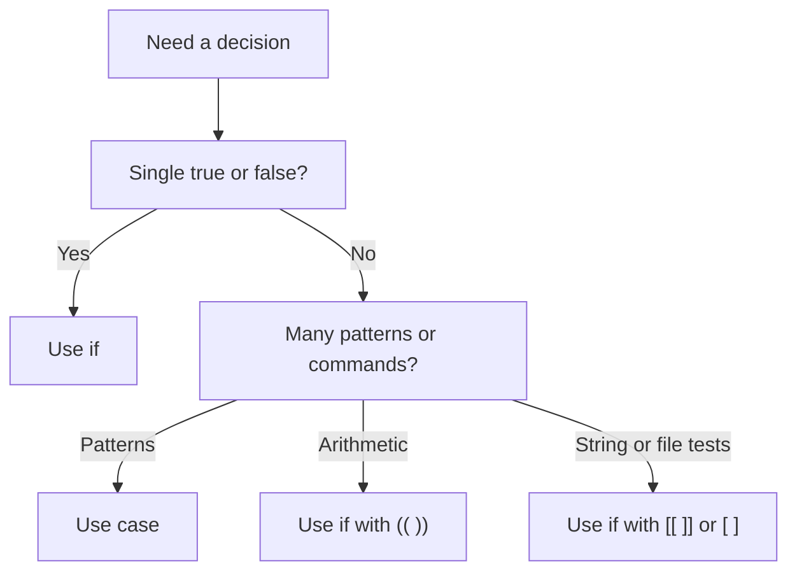

# Conditionals

> Branching with if, elif, else, case, and shell test forms.

## 5. Conditional Statements
### 5.1 `if` Statement
Basic form:

```bash
if condition; then
  commands
fi
```

Example:

```bash
if [[ -f /etc/passwd ]]; then
  echo "passwd exists"
fi
```

### 5.2 `if/else`
```bash
if [[ -d logs ]]; then
  echo "logs exists"
else
  echo "logs missing"
fi
```

### 5.3 `if/elif/else`
```bash
score=82

if (( score >= 90 )); then
  echo "A"
elif (( score >= 75 )); then
  echo "B"
else
  echo "C"
fi
```

### 5.4 `test`, `[ ]`, and `[[ ]]`
| Form | Notes |
| --- | --- |
| `test expr` | Old style |
| `[ expr ]` | Widely used |
| `[[ expr ]]` | Bash/Ksh/Zsh enhanced syntax |

Prefer `[[ ]]` in Bash because it:

- Handles pattern matching well
- Avoids some word-splitting issues
- Supports `&&`, `||`, and regex `=~`

### 5.5 `case` Statement
Use `case` for multiple pattern-based branches.

```bash
case "$1" in
  start)
    echo "Starting"
    ;;
  stop)
    echo "Stopping"
    ;;
  restart)
    echo "Restarting"
    ;;
  *)
    echo "Usage: $0 {start|stop|restart}"
    ;;
esac
```

### 5.6 Pattern Matching in `case`
```bash
case "$file" in
  *.log)
    echo "Log file"
    ;;
  *.csv)
    echo "CSV file"
    ;;
  *)
    echo "Unknown type"
    ;;
esac
```

### 5.7 Nested Conditions
```bash
if [[ -n ${user:-} ]]; then
  if [[ $user == admin ]]; then
    echo "Admin access"
  fi
fi
```

### 5.8 One-Line Conditions
```bash
[[ -f config.yml ]] && echo "Found"
[[ -f config.yml ]] || echo "Missing"
```

Be careful when chaining commands that may fail for reasons other than condition logic.

### 5.9 Arithmetic Conditions
```bash
if (( retries < max_retries )); then
  ((retries++))
fi
```

### 5.10 File-Based Decision Example
```bash
if [[ -s app.log ]]; then
  echo "Log has data"
else
  echo "Log empty or missing"
fi
```

### 5.11 Choosing Between `if` and `case`
| Situation | Better Choice |
| --- | --- |
| One simple true/false decision | `if` |
| Numeric comparison | `if` with `(( ))` |
| Many fixed options | `case` |
| Pattern-based branching | `case` |

### 5.12 Decision Tree for Shell Constructs


### 5.13 Common Mistakes
Incorrect spacing:

```bash
if[ "$x" = 1 ]; then
  echo bad
fi
```

Correct:

```bash
if [ "$x" = 1 ]; then
  echo good
fi
```

### 5.14 Comparing Strings Safely
```bash
if [[ ${role:-} == "admin" ]]; then
  echo "Privileged"
fi
```

### 5.15 Matching Multiple Patterns in `case`
```bash
case "$env" in
  dev|test)
    echo "Non-production"
    ;;
  prod)
    echo "Production"
    ;;
esac
```

### 5.16 Fallthrough Behavior in Bash `case`
Bash supports `;&` and `;;&` in advanced cases.

```bash
case "$value" in
  a)
    echo "A"
    ;&
  b)
    echo "B"
    ;;
esac
```

### 5.17 Section Summary
Conditional constructs let scripts react to:

- input
- file state
- numeric thresholds
- string patterns

---
