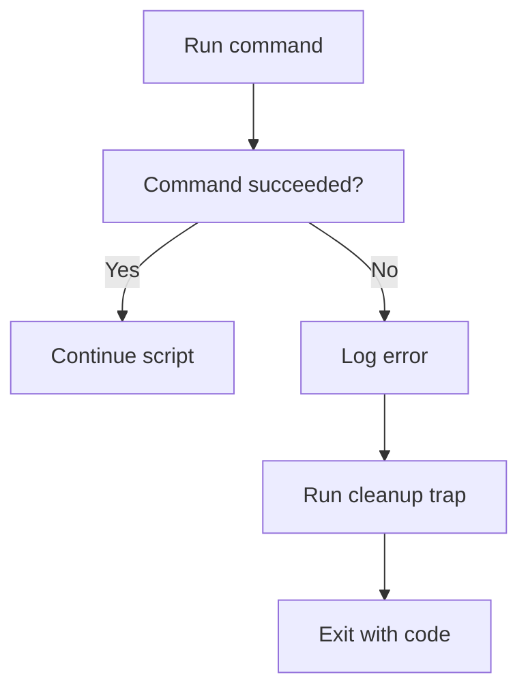

# Error Handling

> Strict mode, traps, cleanup handlers, retries, and exit codes.

## 10. Error Handling

### 10.1 Why Error Handling Matters

Good scripts fail clearly and safely.

Without error handling, scripts may:

- continue after failures
- corrupt data
- produce partial results
- hide real problems

### 10.2 `set -e`

Exit on command failure.

```bash
set -e
```

Be aware that `set -e` has exceptions in conditionals, pipelines, and command lists.

### 10.3 `set -u`

Treat unset variables as errors.

```bash
set -u
```

### 10.4 `set -o pipefail`

Fail a pipeline if any command fails.

```bash
set -o pipefail
```

### 10.5 Common Safe Header

```bash
set -euo pipefail
```

### 10.6 `trap`

Use `trap` to run cleanup code.

```bash
cleanup() {
  echo "Cleaning up"
}

trap cleanup EXIT
```

### 10.7 Trap Specific Signals

```bash
trap 'echo "Interrupted"; exit 130' INT
trap 'echo "Terminated"; exit 143' TERM
```

### 10.8 Exit Codes

Convention:

| Code | Meaning |
| --- | --- |
| `0` | Success |
| `1` | General error |
| `2` | Misuse of shell builtins |
| `126` | Command found but not executable |
| `127` | Command not found |
| `130` | Script terminated by Ctrl+C |

### 10.9 Explicit Exit

```bash
exit 1
```

### 10.10 Error Function

```bash
die() {
  printf 'ERROR: %s\n' "$*" >&2
  exit 1
}
```

### 10.11 Warning Function

```bash
warn() {
  printf 'WARN: %s\n' "$*" >&2
}
```

### 10.12 Cleanup Function Pattern

```bash
cleanup() {
  [[ -n ${temp_file:-} && -e ${temp_file:-} ]] && rm -f -- "$temp_file"
}
trap cleanup EXIT
```

### 10.13 Check Command Status Directly

```bash
if ! cp source.txt dest.txt; then
  echo "Copy failed" >&2
  exit 1
fi
```

### 10.14 Error Handling Flow



### 10.15 Trap ERR in Bash

```bash
set -E
trap 'echo "Error on line $LINENO"' ERR
```

Useful for debugging and centralized error reporting.

### 10.16 Ignore Certain Errors Deliberately

```bash
rm -f missing.file || true
```

Use carefully.

### 10.17 Grouped Error Context

```bash
if ! {
  step_one
  step_two
  step_three
}; then
  die "Workflow failed"
fi
```

### 10.18 Safer Temporary Resource Cleanup

Use a trap for files, directories, background jobs, or locks.

```bash
cleanup() {
  [[ -n ${pid:-} ]] && kill "$pid" 2>/dev/null || true
}
trap cleanup EXIT
```

### 10.19 Logging Failed Commands

```bash
trap 'printf "Failed command: %s\n" "$BASH_COMMAND" >&2' ERR
```

### 10.20 Retrying Failures

```bash
retry() {
  local attempts=$1
  shift
  local n=1
  until "$@"; do
    if (( n >= attempts )); then
      return 1
    fi
    ((n++))
    sleep 1
  done
}
```

### 10.21 Section Summary

Robust scripts combine:

- strict mode
- explicit checks
- traps
- useful exit codes
- cleanup handlers

---
