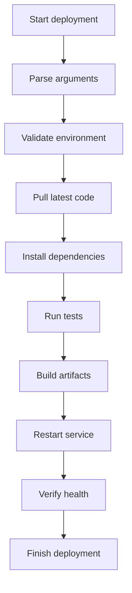

# Real-World Scripts

> Production-style examples for rotation, backup, monitoring, deployment, and more.

## 14. Real-World Scripts
This section provides practical examples you can adapt for production use.

### 14.1 Log Rotation Script
```bash
#!/usr/bin/env bash
set -euo pipefail

log_dir="${1:-./logs}"
archive_dir="$log_dir/archive"
mkdir -p "$archive_dir"

timestamp=$(date +%Y%m%d_%H%M%S)

for file in "$log_dir"/*.log; do
  [[ -e $file ]] || continue
  base=$(basename "$file")
  mv -- "$file" "$archive_dir/${base%.log}_$timestamp.log"
  gzip "$archive_dir/${base%.log}_$timestamp.log"
done

echo "Log rotation complete"
```

How it works:

- finds `.log` files
- moves them into an archive directory
- adds a timestamp
- compresses archived logs

### 14.2 Backup Script
```bash
#!/usr/bin/env bash
set -euo pipefail

src=${1:?Source directory required}
dest=${2:?Destination directory required}

timestamp=$(date +%Y%m%d_%H%M%S)
backup_name="backup_$timestamp.tar.gz"

mkdir -p "$dest"
tar -czf "$dest/$backup_name" -C "$src" .

echo "Created backup: $dest/$backup_name"
```

Possible improvements:

- checksum verification
- retention cleanup
- remote sync
- exclude patterns

### 14.3 Monitoring Script
```bash
#!/usr/bin/env bash
set -euo pipefail

threshold=${1:-80}
usage=$(df / | awk 'NR==2 {gsub(/%/, "", $5); print $5}')

if (( usage >= threshold )); then
  printf 'ALERT: disk usage is %s%%\n' "$usage"
else
  printf 'OK: disk usage is %s%%\n' "$usage"
fi
```

### 14.4 Deployment Script
```bash
#!/usr/bin/env bash
set -euo pipefail

app_dir=${1:?Application directory required}
branch=${2:-main}

cd "$app_dir"

git fetch origin
git checkout "$branch"
git pull --ff-only origin "$branch"

if [[ -f package.json ]]; then
  npm install
  npm run build
fi

echo "Deployment completed for branch $branch"
```

### 14.5 CSV Parser Script
```bash
#!/usr/bin/env bash
set -euo pipefail

csv_file=${1:?CSV file required}

while IFS=',' read -r id name email; do
  printf 'ID=%s NAME=%s EMAIL=%s\n' "$id" "$name" "$email"
done < "$csv_file"
```

Note:

This simple parser works for basic CSV.

It does not fully support quoted commas or embedded newlines.

For complex CSV, use dedicated tools such as Python's CSV module.

### 14.6 More Robust Backup Script with Logging
```bash
#!/usr/bin/env bash
set -euo pipefail

log() {
  printf '%s [INFO] %s\n' "$(date '+%F %T')" "$*"
}

die() {
  printf '%s [ERROR] %s\n' "$(date '+%F %T')" "$*" >&2
  exit 1
}

src=${1:-}
dest=${2:-}
[[ -n $src ]] || die "Source required"
[[ -d $src ]] || die "Source directory not found: $src"
[[ -n $dest ]] || die "Destination required"
mkdir -p "$dest"

timestamp=$(date +%Y%m%d_%H%M%S)
archive="$dest/backup_$timestamp.tar.gz"

log "Creating backup $archive"
tar -czf "$archive" -C "$src" .
log "Backup complete"
```

### 14.7 Health Check Script
```bash
#!/usr/bin/env bash
set -euo pipefail

url=${1:?URL required}
if curl -fsS "$url" >/dev/null; then
  echo "Healthy"
else
  echo "Unhealthy" >&2
  exit 1
fi
```

### 14.8 File Cleanup Script
```bash
#!/usr/bin/env bash
set -euo pipefail

dir=${1:?Directory required}
days=${2:-7}

find "$dir" -type f -mtime "+$days" -print -delete
```

### 14.9 Batch Rename Script
```bash
#!/usr/bin/env bash
set -euo pipefail

prefix=${1:-img}
count=1

for file in ./*.jpg; do
  [[ -e $file ]] || continue
  new_name=$(printf '%s_%03d.jpg' "$prefix" "$count")
  mv -- "$file" "$new_name"
  ((count++))
done
```

### 14.10 Config-Driven Script Pattern
```bash
#!/usr/bin/env bash
set -euo pipefail

config_file=${1:-config.env}
[[ -f $config_file ]] || {
  echo "Missing config: $config_file" >&2
  exit 1
}

set -a
source "$config_file"
set +a

echo "Running for env: ${APP_ENV:-unknown}"
```

### 14.11 Parallel Ping Script
```bash
#!/usr/bin/env bash
set -euo pipefail

hosts=("$@")
pids=()

check_host() {
  local host=$1
  if ping -c 1 "$host" >/dev/null 2>&1; then
    echo "$host OK"
  else
    echo "$host FAIL"
  fi
}

for host in "${hosts[@]}"; do
  check_host "$host" &
  pids+=("$!")
done

for pid in "${pids[@]}"; do
  wait "$pid"
done
```

### 14.12 Deployment Flow Diagram


### 14.13 Real-World Patterns to Reuse
- `die` function for failures
- `log` function with timestamps
- `cleanup` trap
- `getopts` for CLI flags
- lock files for singleton execution
- retry wrappers around network operations

### 14.14 Production Readiness Checklist
| Area | Questions |
| --- | --- |
| Input validation | Are all arguments validated? |
| Error handling | Are failures explicit? |
| Logging | Are actions logged clearly? |
| Concurrency | Could parallel runs conflict? |
| Cleanup | Are temporary resources removed? |
| Security | Are inputs quoted and trusted? |
| Portability | Does syntax match the shebang? |

### 14.15 Section Summary
Real-world scripts should balance:

- readability
- safety
- observability
- portability
- maintainability

---
