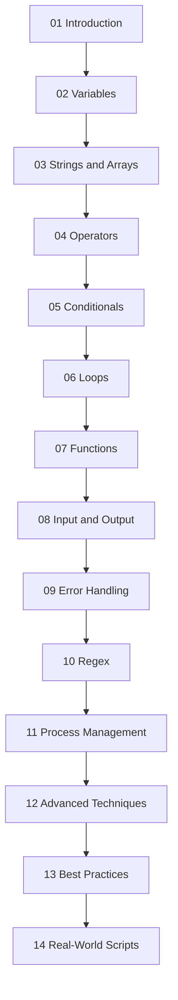

# Shell Scripting Guide

This guide has been split into smaller, topic-focused files for easier reading and navigation. All original content has been preserved, with the appendix and extended practice material folded into the best-practices reference.

## Table of Contents

1. [01-introduction.md](./01-introduction.md) - Shell types, shebangs, script execution, and first-script fundamentals.
2. [02-variables.md](./02-variables.md) - Variable declaration, scope, environment variables, and special parameters.
3. [03-strings-and-arrays.md](./03-strings-and-arrays.md) - String manipulation plus indexed and associative arrays.
4. [04-operators.md](./04-operators.md) - Arithmetic, comparison, logical, string, and file test operators.
5. [05-conditionals.md](./05-conditionals.md) - `if`, `elif`, `else`, `case`, and test forms like `[ ]` and `[[ ]]`.
6. [06-loops.md](./06-loops.md) - `for`, `while`, `until`, `select`, `break`, and `continue`.
7. [07-functions.md](./07-functions.md) - Functions, arguments, return statuses, and reusable libraries.
8. [08-input-output.md](./08-input-output.md) - `read`, `echo`, `printf`, redirection, and here documents.
9. [09-error-handling.md](./09-error-handling.md) - Strict mode, traps, cleanup patterns, retries, and exit codes.
10. [10-regex.md](./10-regex.md) - Basic and extended regex, Bash `=~`, and practical matching patterns.
11. [11-process-management.md](./11-process-management.md) - Background jobs, `wait`, subshells, and process substitution.
12. [12-advanced-techniques.md](./12-advanced-techniques.md) - `getopts`, signals, `mktemp`, `flock`, debugging, and advanced shell patterns.
13. [13-best-practices.md](./13-best-practices.md) - Best practices, quick references, appendix material, and extended practice notes.
14. [14-real-world-scripts.md](./14-real-world-scripts.md) - Production-style examples for log rotation, backups, monitoring, deployment, and more.

## Recommended Learning Path

## Suggested Order

- Start with the fundamentals in files 01-04.
- Learn control flow with files 05-07.
- Move into I/O, reliability, and text processing with files 08-10.
- Finish with process control, advanced patterns, best practices, and real-world examples in files 11-14.
