# Networking Fundamentals

> A deep visual guide to how TCP/IP and practical networking actually work on Linux systems, switches, routers, and the public Internet.

This chapter replaces the earlier summary with a much more comprehensive walkthrough.
It is designed to answer both "what layer is this?" and "what packet is actually on the wire right now?".
Every major concept starts with a Mermaid diagram, then moves into step-by-step explanation, Linux observation commands, and real-world examples.

## Table of Contents

- [1. OSI Model — Visual Layer-by-Layer](#section-1)
- [2. TCP/IP Model vs OSI — Side-by-Side Visual](#section-2)
- [3. How Data Travels Through the Network — Step by Step](#section-3)
- [4. TCP Three-Way Handshake — Detailed Visual](#section-4)
- [5. TCP Connection Termination — 4-Way Close](#section-5)
- [6. TCP State Machine — Full Diagram](#section-6)
- [7. TCP vs UDP — Visual Comparison](#section-7)
- [8. IP Addressing — Visual Explanation](#section-8)
- [9. How Routing Works — Visual](#section-9)
- [10. DNS Resolution — Step-by-Step Visual](#section-10)
- [11. Packet Encapsulation — How Data Gets Wrapped](#section-11)
- [12. ARP — How MAC Addresses Are Resolved](#section-12)
- [13. Network Troubleshooting Flow](#section-13)
- [14. Practical Packet Observation Cookbook](#section-14)
- [15. Quick Reference Tables](#section-15)
- [16. Glossary and Mental Models](#section-16)

## How to read this chapter

- When you see **Application data**, think of the payload your program cares about.
- When you see **Segment**, think of TCP or UDP adding ports and transport metadata.
- When you see **Packet**, think of IP deciding where traffic should go next.
- When you see **Frame**, think of the local link and MAC-address forwarding.
- When you see **Bits**, think of electrical, optical, or radio signaling on the medium.
- When you troubleshoot, always move from the lowest failing layer upward.
- When you capture traffic, compare what the application thinks it sent versus what the wire actually carried.
- When you design networks, remember that addressing, routing, name resolution, and security policies all interact.

---

## Section 1
## 1. OSI Model — Visual Layer-by-Layer
<a id="section-1"></a>

### 📸 OSI Model Layers

> *Source: Wikimedia Commons — OSI 7-layer reference model*

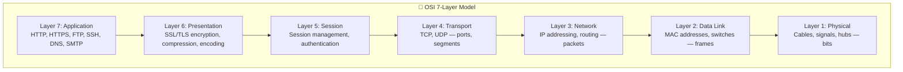

The OSI model is a teaching model, not a protocol suite you configure directly.
Its value is that it gives you a disciplined way to ask: **what job is this layer responsible for, and what information is visible there?**

### 1.1 Quick layer summary

| Layer | Name | Main job | PDU | Example devices |
|---|---|---|---|---|
| 7 | Application | User-facing network services and protocols | Data | Browsers, web servers, mail servers, DNS software |
| 6 | Presentation | Format translation, encryption, compression | Data | TLS libraries, API gateways, proxies |
| 5 | Session | Dialog setup, continuity, checkpoints | Data | Session managers, RPC runtimes, auth brokers |
| 4 | Transport | End-to-end ports, reliability, multiplexing | Segment or datagram | Stateful firewalls, load balancers, hosts |
| 3 | Network | Logical addressing and routing | Packet | Routers, L3 switches, hosts |
| 2 | Data Link | Local delivery on the current link | Frame | Switches, bridges, NICs, access points |
| 1 | Physical | Signals on the medium | Bits | Cables, fiber, radio, transceivers, hubs |

### 1.1 Layer 7: Application

#### What happens at this layer

- The application layer is where protocols expose business meaning to software and users.
- A browser creates an HTTP request.
- A mail server speaks SMTP.
- A resolver sends DNS queries.
- An SSH client negotiates an interactive remote shell.

#### Protocol Data Unit

- PDU name: **Data**

#### Key protocols

- HTTP
- HTTPS
- DNS
- SSH
- SMTP
- FTP
- IMAP
- LDAP

#### Real-world analogy

- A customer placing a specific order at a service desk.

#### Devices that operate here

- Browsers
- Web servers
- DNS servers
- Mail servers
- Proxy applications

#### Useful Linux observation commands

- `curl -I https://example.com`
- `dig example.com`
- `ssh user@host`

#### Practical example

- When you click a link, the browser builds an HTTP request with headers, cookies, and method semantics.

### 1.2 Layer 6: Presentation

#### What happens at this layer

- The presentation layer transforms data into a form both sides can understand.
- It handles encryption, serialization, character encoding, and compression concerns.
- In real networks, TLS often feels like the most visible presentation-layer function.
- JSON, Protobuf, ASN.1, image encoding, and gzip all fit the mental model here.

#### Protocol Data Unit

- PDU name: **Data**

#### Key protocols

- TLS
- SSL historical
- gzip
- MIME
- UTF-8 encoding

#### Real-world analogy

- Translating a message into a common language and sealing it in a locked envelope.

#### Devices that operate here

- TLS terminators
- Reverse proxies
- API gateways
- Application runtimes

#### Useful Linux observation commands

- `openssl s_client -connect example.com:443`
- `curl --compressed https://example.com`

#### Practical example

- During HTTPS, the HTTP payload is encrypted before the wire sees it, so intermediaries can route packets but not read the application content.

### 1.3 Layer 5: Session

#### What happens at this layer

- The session layer tracks the conversation over time.
- It manages when a dialog begins, whether it stays authenticated, and how it resumes after interruptions.
- Modern stacks often blur session responsibilities into the application or transport layer.
- Still, the concept is useful for thinking about login continuity, RPC sessions, and negotiated dialogues.

#### Protocol Data Unit

- PDU name: **Data**

#### Key protocols

- NetBIOS session service
- RPC
- SMB session setup
- TLS sessions
- Application auth tokens

#### Real-world analogy

- Checking in at a hotel and keeping the same reservation active during your stay.

#### Devices that operate here

- App servers
- Auth systems
- Session stores
- Remote desktop brokers

#### Useful Linux observation commands

- `ss -tanp`
- `journalctl -u sshd`
- `klist`

#### Practical example

- A user logs into a web application and keeps a valid session cookie while making multiple requests.

### 1.4 Layer 4: Transport

#### What happens at this layer

- The transport layer provides end-to-end delivery between processes, not just hosts.
- Ports identify which application should receive the data.
- TCP adds sequence numbers, acknowledgments, retransmissions, and flow control.
- UDP sends datagrams without building reliability into the transport itself.

#### Protocol Data Unit

- PDU name: **Segment for TCP, datagram for UDP**

#### Key protocols

- TCP
- UDP
- QUIC conceptually rides UDP but provides transport features

#### Real-world analogy

- A courier service that tracks package order and delivery confirmations, or a postcard service with no confirmation at all.

#### Devices that operate here

- Hosts
- Stateful firewalls
- Load balancers
- L4 proxies

#### Useful Linux observation commands

- `ss -tulpen`
- `netstat -tulpen`
- `tcpdump -ni any tcp`

#### Practical example

- A server can listen on TCP port 443 and UDP port 443 at the same time because protocol plus port plus address define the socket context.

### 1.5 Layer 3: Network

#### What happens at this layer

- The network layer gives hosts logical addresses and decides which next hop gets the packet closer to the destination.
- IP headers carry source and destination IP addresses, TTL, protocol numbers, and fragmentation metadata.
- Routers operate here by inspecting destination IP addresses and consulting routing tables.
- This is where subnets, default gateways, and longest-prefix-match matter.

#### Protocol Data Unit

- PDU name: **Packet**

#### Key protocols

- IPv4
- IPv6
- ICMP
- IPsec

#### Real-world analogy

- A postal system reading city and street information to send mail toward the right destination region.

#### Devices that operate here

- Routers
- L3 switches
- Hosts with routing tables
- VPN gateways

#### Useful Linux observation commands

- `ip route`
- `ip -6 route`
- `ping`
- `traceroute`
- `tracepath`

#### Practical example

- A laptop sees that 93.184.216.34 is not on the local subnet, so it sends the packet to its default gateway.

### 1.6 Layer 2: Data Link

#### What happens at this layer

- The data link layer handles local delivery on a specific network segment.
- Ethernet frames carry source and destination MAC addresses.
- Switches learn which MAC addresses live behind which ports and forward frames accordingly.
- ARP and IPv6 Neighbor Discovery help map Layer 3 addresses to Layer 2 identifiers on the local link.

#### Protocol Data Unit

- PDU name: **Frame**

#### Key protocols

- Ethernet
- Wi-Fi MAC
- ARP
- 802.1Q VLAN

#### Real-world analogy

- A building mailroom delivering envelopes to the correct office suite on the current floor.

#### Devices that operate here

- Switches
- Bridges
- NICs
- Wireless access points

#### Useful Linux observation commands

- `ip link`
- `ip neigh`
- `ethtool eth0`
- `tcpdump -eni any`

#### Practical example

- Before a host can send to the router, it must know the router interface MAC address and wrap the IP packet in an Ethernet frame.

### 1.7 Layer 1: Physical

#### What happens at this layer

- The physical layer is the actual transmission of bits as voltage changes, light pulses, or radio waves.
- It includes cable quality, signal strength, transceivers, duplex mode, speed negotiation, and link state.
- If the link is physically down, higher layers never get a chance to work.
- Many mysterious application failures begin as physical problems that show up first as drops, flaps, or CRC errors.

#### Protocol Data Unit

- PDU name: **Bits**

#### Key protocols

- 1000BASE-T
- 10GBASE-SR
- 802.11 PHY families

#### Real-world analogy

- The road pavement and electrical power that let any delivery vehicle move at all.

#### Devices that operate here

- Cables
- SFP modules
- Patch panels
- Hubs
- NIC PHYs
- Wireless radios

#### Useful Linux observation commands

- `ip link show`
- `ethtool eth0`
- `dmesg | grep -i link`

#### Practical example

- A duplex mismatch may create collisions and terrible throughput even though IP addresses and routes are configured correctly.

### 1.8 Why layers matter in troubleshooting

- If `ip link` shows the interface is down, do not start by changing DNS.
- If ARP fails, TCP cannot connect even if the server is healthy.
- If TCP connects but the browser still shows an error, the problem may be TLS or HTTP.
- If DNS resolves incorrectly, packet capture at the TCP layer may look fine while the application still reaches the wrong server.
- A clean troubleshooting habit is to identify the lowest layer that is definitely working, then move one layer higher.

---

## Section 2
## 2. TCP/IP Model vs OSI — Side-by-Side Visual
<a id="section-2"></a>

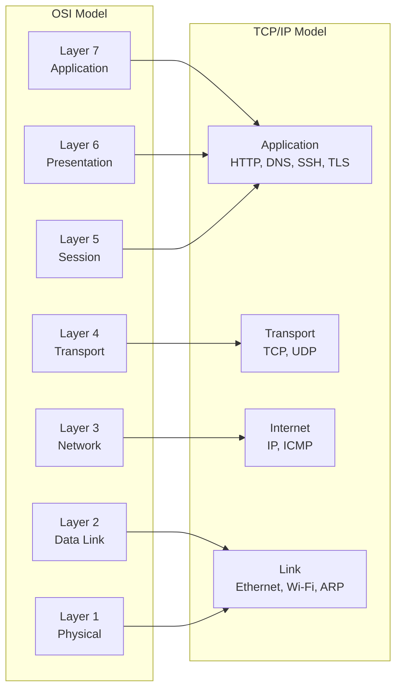

The TCP/IP model is what operating systems and protocol stacks actually implement most directly.
The OSI model is still useful because it gives more descriptive names to the kinds of work happening inside the stack.

### 2.1 Mapping table

| OSI layer | TCP/IP layer | What you usually touch on Linux |
|---|---|---|
| Application + Presentation + Session | Application | `curl`, `dig`, `ssh`, NGINX, Apache, TLS settings, app auth |
| Transport | Transport | `ss`, socket listeners, firewall port rules, retransmissions |
| Network | Internet | `ip addr`, `ip route`, `ping`, `traceroute`, policy routing |
| Data Link + Physical | Link | `ip link`, `ethtool`, bridges, VLANs, MAC addresses, ARP |

### 2.2 Why two models exist

- OSI was designed as a layered reference framework for understanding interoperable networking.
- TCP/IP emerged from the protocols that won in practice on real networks and later the Internet.
- Engineers still say "Layer 3 problem" or "Layer 7 issue" because OSI labels are concise and intuitive.
- When you read Linux documentation, you will often see the practical TCP/IP stack mixed with OSI terminology.

### 2.3 A mental shortcut

- If the question is **which application protocol is this?**, think Application.
- If the question is **which process and which port?**, think Transport.
- If the question is **which IP and which route?**, think Internet or Network.
- If the question is **which NIC, MAC, switch port, or wireless link?**, think Link or Data Link.
- If the question is **is the cable or radio path good?**, think Physical.

### 2.4 Real-world example

A user says: "The website is down."
That single symptom can map to very different layers:

- The cable to the server NIC is loose.
- The default gateway is wrong.
- TCP port 443 is blocked by a firewall rule.
- The TLS certificate is expired.
- The HTTP application returns a 500 error.

This is why layered thinking prevents random guessing.

### 2.5 Commands by model

| Question | Layer focus | Practical commands |
|---|---|---|
| Can I resolve the hostname? | Application | `dig`, `resolvectl query`, `getent hosts` |
| Can I reach the port? | Transport | `ss`, `nc -vz`, `tcpdump` |
| Can I reach the network? | Internet | `ip route get`, `ping`, `tracepath` |
| Do I know the next-hop MAC? | Link | `ip neigh`, `arp -n`, `tcpdump -e arp` |
| Is the interface physically healthy? | Physical | `ip link`, `ethtool`, interface counters |

---

## Section 3
## 3. How Data Travels Through the Network — Step by Step
<a id="section-3"></a>

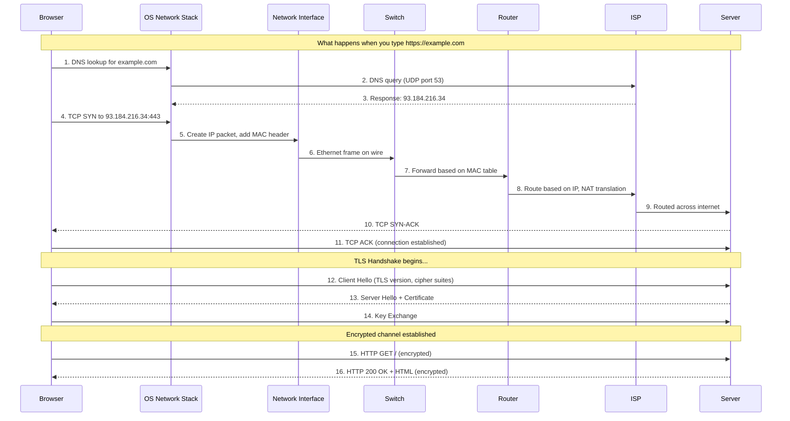

Typing a URL triggers far more than a single packet.
The browser, the operating system, the LAN, the router, the ISP, and the destination service all do different jobs in sequence.

### 3.1 Expanded end-to-end walkthrough

1. You type `https://example.com` into the browser address bar.
2. The browser parses the scheme, hostname, optional port, and path.
3. Because the scheme is HTTPS, the browser expects TCP plus TLS and usually destination port 443.
4. The browser checks whether it already has a valid connection in its connection pool.
5. If not, the OS resolver path is used to turn `example.com` into an IP address.
6. The resolver checks the browser cache, OS cache, and local DNS cache.
7. If the answer is not cached, a DNS query is sent to a configured recursive resolver.
8. That DNS query is usually UDP to port 53, although large answers or retries can use TCP.
9. The recursive resolver may consult root, TLD, and authoritative servers, then returns an answer.
10. Now the client knows the destination IP address, for example `93.184.216.34`.
11. The OS checks the local routing table to decide whether that destination is on-link or remote.
12. Because the destination is remote, the host chooses its default gateway as the next hop.
13. To send a frame to the gateway, the host needs the gateway MAC address.
14. If the MAC is not cached, the host performs ARP on IPv4 or Neighbor Discovery on IPv6.
15. Once the gateway MAC is known, the client can build an Ethernet frame.
16. Inside that frame is an IP packet.
17. Inside that IP packet is a TCP segment containing a SYN.
18. The SYN leaves the NIC and enters the switch.
19. The switch reads the destination MAC address and forwards the frame toward the router port.
20. The router strips the Layer 2 header because the incoming Ethernet frame is only valid on that local segment.
21. The router inspects the destination IP address and consults its routing table.
22. If the packet is going to the Internet from a private LAN, the router may also perform source NAT.
23. The router then rewrites the Layer 2 header for the next link and forwards the packet onward.
24. Across the Internet, many routers repeat that same Layer 3 decision and Layer 2 rewrite cycle hop by hop.
25. Eventually the server receives the SYN and replies with SYN-ACK.
26. The client sends the final ACK, so the TCP connection is established.
27. Now the TLS handshake begins to authenticate the server and negotiate encryption keys.
28. The client sends a ClientHello that advertises versions, extensions, SNI, and cipher capabilities.
29. The server replies with ServerHello, certificate data, and key agreement parameters.
30. The client validates the certificate chain and hostname.
31. If validation succeeds, both sides derive shared traffic keys.
32. The HTTP request can now travel inside the encrypted TLS record stream.
33. The server decrypts the request, processes the application logic, and builds a response.
34. The HTTP response is encrypted, segmented by TCP, packetized by IP, framed on each local link, and returned hop by hop.
35. The browser decrypts the response, parses HTML, and then often repeats the process for CSS, JavaScript, images, and API calls.

### 3.2 What changes and what stays the same

- The **source and destination MAC addresses** change on every Layer 2 hop.
- The **source and destination IP addresses** usually stay the same end to end, unless NAT changes them.
- The **TCP source and destination ports** stay associated with the flow, unless a NAT device rewrites them.
- The **TTL or Hop Limit** decreases at each routed hop.
- The **payload** remains the application data after decryption context is applied at the endpoint.

### 3.3 What the browser sees versus what the wire sees

| Viewpoint | What it cares about | Example |
|---|---|---|
| Browser | URL, cookies, headers, TLS validity, content | `GET / HTTP/1.1` |
| Operating system | Sockets, routes, DNS, neighbor entries, retransmissions | ephemeral port `53124` to `93.184.216.34:443` |
| Switch | Source and destination MAC addresses on the current VLAN | forward out port 12 |
| Router | Destination IP and next hop decision | default route to ISP |
| Server | TCP state, TLS session, HTTP request | send `200 OK` |

### 3.4 Useful commands to observe the journey

- `dig example.com`
- `resolvectl query example.com`
- `ip route get 93.184.216.34`
- `ip neigh show`
- `ss -tanp | grep :443`
- `sudo tcpdump -ni any host 93.184.216.34`
- `sudo tcpdump -ni any port 53 or port 443`
- `traceroute example.com`
- `curl -vk https://example.com/`

### 3.5 Wireshark filters for the same flow

- `dns`
- `tcp.port == 443`
- `ip.addr == 93.184.216.34`
- `tls.handshake.type == 1` for ClientHello
- `http` for unencrypted HTTP only
- `tcp.flags.syn == 1 && tcp.flags.ack == 0` for initial SYN packets

### 3.6 Real-world example

- A slow website may not be a slow server; it might be delayed DNS, repeated SYN retransmissions, or packet loss during TLS handshake.
- A website reachable from mobile data but not from office Wi-Fi often points to local DNS, firewall, MTU, or proxy policy differences.
- If only the first page loads but images fail, look for extra hostnames, CDNs, mixed IPv4/IPv6 behavior, or blocked domains.

---

## Section 4
## 4. TCP Three-Way Handshake — Detailed Visual
<a id="section-4"></a>

### 📸 TCP Three-Way Handshake — Animated

> *Source: Wikimedia Commons — TCP connection establishment*

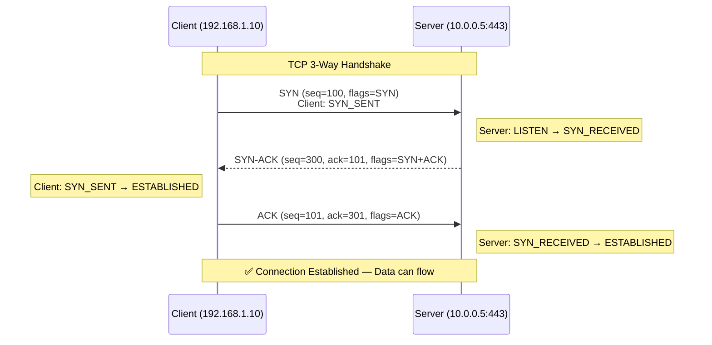

TCP is connection-oriented, which means both sides coordinate before sending reliable application data.

### 4.1 Step 1 — SYN

- SYN means **synchronize sequence numbers**.
- The client chooses an initial sequence number, here shown as `100`.
- The segment tells the server: "I want to start a TCP conversation, and my first sequence space begins here."
- At this stage the client enters the `SYN_SENT` state.

### 4.2 Step 2 — SYN-ACK

- The server was in `LISTEN` waiting for incoming SYN packets.
- When it receives the SYN, it allocates state for the half-open connection.
- It replies with its own SYN plus an ACK.
- The ACK value is `101`, meaning "I received your SYN carrying sequence number 100, and I expect the next byte to be 101."
- The server now enters `SYN_RECEIVED`.

### 4.3 Step 3 — ACK

- The client acknowledges the server sequence number by sending `ack=301`.
- That tells the server the client successfully received the SYN-ACK.
- Once this packet arrives, both sides consider the connection established.
- Now HTTP, TLS, SSH, PostgreSQL, or any other application payload can start flowing.

### 4.4 Why sequence numbers matter

- TCP is a byte-stream protocol, not a message protocol.
- Sequence numbers let each side know where each byte fits in the stream.
- Acknowledgments tell the sender which bytes arrived successfully.
- If data is lost, the sender can retransmit the missing sequence range.
- This is how TCP restores ordered delivery over an unreliable IP network.

### 4.5 What if the SYN is lost?

- If the original SYN never reaches the server, no SYN-ACK returns.
- The client waits for a retransmission timeout.
- Then the client sends another SYN with the same connection attempt semantics.
- Repeated SYN retransmissions usually indicate filtering, path failure, packet loss, or a dead target.
- In packet capture, you will see multiple SYN packets and no completing ACK.

### 4.6 SYN flood attack explanation

- A SYN flood sends huge numbers of SYN packets, often with spoofed source addresses.
- The server allocates resources for many half-open connections stuck in `SYN_RECEIVED`.
- If the backlog fills, legitimate clients may not connect.
- Defenses include SYN cookies, rate limiting, upstream filtering, and load balancing.
- You can observe many incomplete handshakes by watching a large volume of incoming SYNs without final ACKs.

### 4.7 Commands to observe a handshake

- `sudo tcpdump -ni any "tcp port 443 and (tcp[tcpflags] & (tcp-syn|tcp-ack) != 0)"`
- `ss -tan state syn-sent`
- `ss -tan state syn-recv`
- `netstat -s | grep -i retrans`
- `curl -vk https://example.com/`

### 4.8 Wireshark filters

- `tcp.flags.syn == 1 && tcp.flags.ack == 0`
- `tcp.flags.syn == 1 && tcp.flags.ack == 1`
- `tcp.analysis.retransmission`

### 4.9 Real-world examples

- If you can ping a host but cannot connect to TCP port 443, the handshake may be blocked by a firewall or a closed port.
- If the SYN arrives and the SYN-ACK leaves but never returns to the client, the reverse path may be broken.
- If a cloud security group allows the port but the host firewall drops the SYN, captures on the VM show the packet while the application never accepts it.

---

## Section 5
## 5. TCP Connection Termination (4-Way)
<a id="section-5"></a>

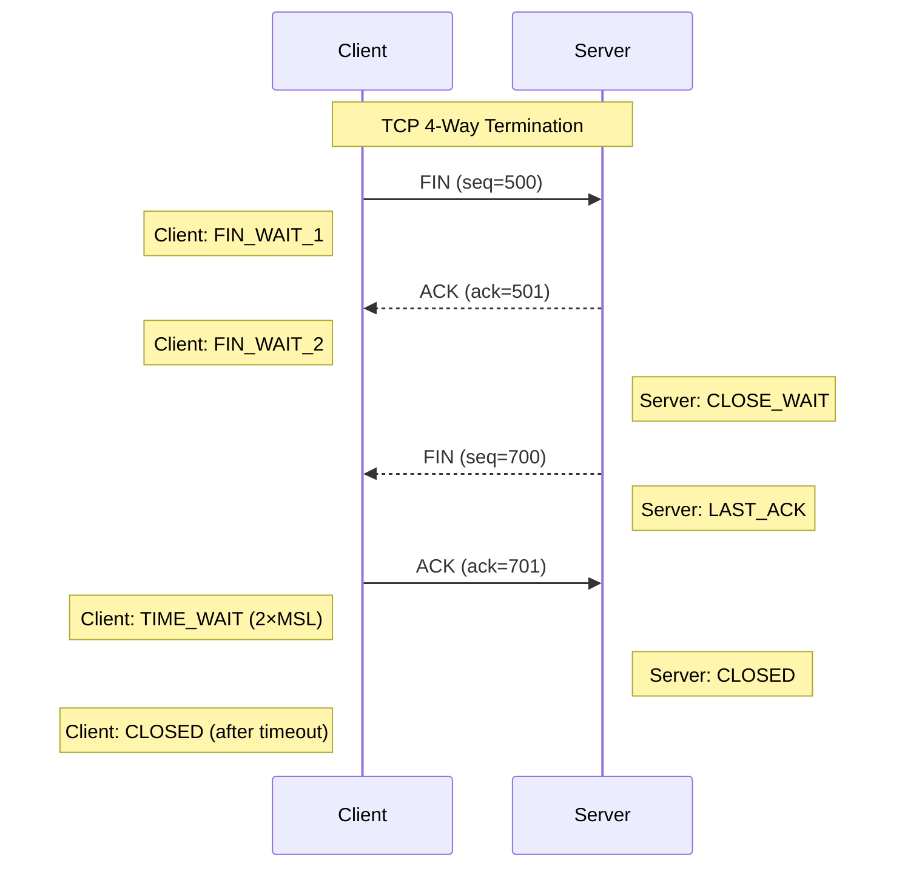

A TCP close is often asymmetric because each direction of the byte stream shuts down independently.

### 5.1 Client sends FIN

- FIN means the client has no more data to send in that direction.
- The client enters `FIN_WAIT_1`.
- The other direction can still remain open until the server is ready to finish.

### 5.2 Server acknowledges FIN

- The ACK confirms the FIN was received.
- The client enters `FIN_WAIT_2`.
- The server enters `CLOSE_WAIT`, meaning it received the peer close but may still send remaining data.

### 5.3 Server sends its own FIN

- When the server application is done sending, it sends FIN.
- The server enters `LAST_ACK` and waits for the final ACK from the client.

### 5.4 Client sends final ACK

- The client acknowledges the server FIN.
- The client enters `TIME_WAIT` to absorb delayed packets and prevent confusion with future connections using similar tuples.
- After the timeout expires, the client goes to `CLOSED`.

### 5.5 Why TIME_WAIT exists

- TIME_WAIT lasts for 2×MSL, where MSL is the maximum segment lifetime.
- It protects against delayed packets from an old connection being mistaken for packets from a new one.
- It also ensures the final ACK can be retransmitted if the peer resends its FIN.
- Many short-lived connections can create many sockets in TIME_WAIT, which is normal on busy clients and proxies.

### 5.6 Commands to observe termination

- `ss -tan state fin-wait-1`
- `ss -tan state fin-wait-2`
- `ss -tan state time-wait`
- `ss -tan state close-wait`
- `sudo tcpdump -ni any "tcp[tcpflags] & (tcp-fin|tcp-ack) != 0"`

### 5.7 Real-world example

- If an application leaks sockets in `CLOSE_WAIT`, it usually means the remote side closed but the local application failed to close its file descriptor.
- If you see huge numbers of `TIME_WAIT` sockets on a client host, it may simply be making many short outbound connections.

---

## Section 6
## 6. TCP State Machine — Full Diagram
<a id="section-6"></a>

### 📸 TCP Connection States

> *Source: Wikimedia Commons — TCP finite state machine*

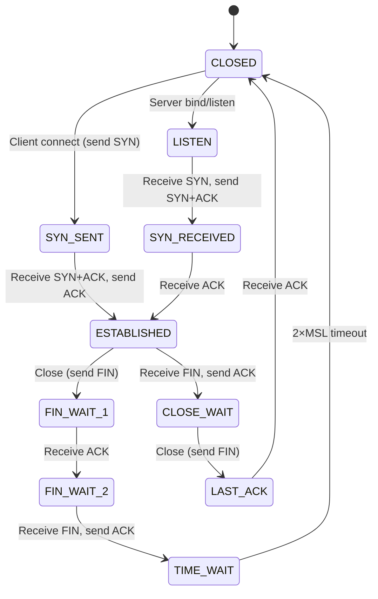

The TCP state machine explains why the same connection can look different on each endpoint at the same moment.

### 6.1 State-by-state meaning

| State | Meaning | Why you care |
|---|---|---|
| CLOSED | No connection exists. | Initial idle state or fully terminated connection. |
| LISTEN | Server is waiting for incoming SYN packets. | Common on daemons like NGINX, SSH, PostgreSQL. |
| SYN_SENT | Client has sent SYN and is waiting for SYN-ACK. | Useful when diagnosing outbound connect failures. |
| SYN_RECEIVED | Server got SYN and replied with SYN-ACK, waiting for final ACK. | Half-open state vulnerable to SYN flooding. |
| ESTABLISHED | Both sides can exchange data. | Normal state for active TCP sessions. |
| FIN_WAIT_1 | Local endpoint sent FIN and waits for ACK or FIN. | Beginning of active close. |
| FIN_WAIT_2 | Local FIN was acknowledged, waiting for peer FIN. | Peer may still send remaining data. |
| CLOSE_WAIT | Peer sent FIN, local side acknowledged it, app has not closed yet. | Often indicates app-side resource handling issues when persistent. |
| LAST_ACK | Local side sent FIN after being in CLOSE_WAIT and waits for final ACK. | Final stage before fully closing. |
| TIME_WAIT | Endpoint waits 2×MSL after sending the final ACK. | Common on active-closer side. |

### 6.2 Common diagnostic interpretations

- Lots of `SYN_SENT` means clients are trying to connect but not completing the handshake.
- Lots of `SYN_RECEIVED` can mean handshake pressure, packet loss, or SYN flood conditions.
- Lots of `ESTABLISHED` is expected on a busy service.
- Lots of `CLOSE_WAIT` usually means the application is not closing accepted sockets promptly after peer shutdown.
- Lots of `TIME_WAIT` is normal on connection-heavy clients and proxies, though tuning and reuse strategies require care.

### 6.3 Commands to inspect states

- `ss -tan`
- `ss -tan state established`
- `ss -tan state close-wait`
- `ss -tan state time-wait`
- `netstat -ant | less -F`
- `watch -n 1 "ss -tan state syn-recv"`

### 6.4 Real-world examples

- A reverse proxy with many backend issues may show many `SYN_SENT` sessions toward the upstream service.
- A memory-leaking application can leave connections in `CLOSE_WAIT` because user-space code forgot to close them.
- A load test client can create thousands of `TIME_WAIT` sockets after aggressively opening and closing short HTTP connections.

### 6.5 State transitions as a story

1. A server starts and listens on port 443.
2. A client initiates a connection with SYN.
3. The client briefly lives in `SYN_SENT`.
4. The server briefly lives in `SYN_RECEIVED`.
5. Both transition to `ESTABLISHED` after the third packet.
6. One side decides to close first and enters `FIN_WAIT_1`.
7. The peer acknowledges and enters `CLOSE_WAIT`.
8. After sending its own FIN, the peer enters `LAST_ACK`.
9. The active closer enters `TIME_WAIT` after acknowledging the peer FIN.
10. Eventually the connection disappears into `CLOSED`.

---

## Section 7
## 7. TCP vs UDP — Visual Comparison
<a id="section-7"></a>

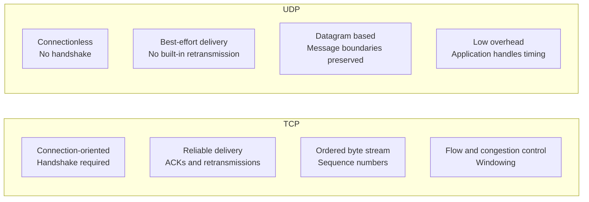

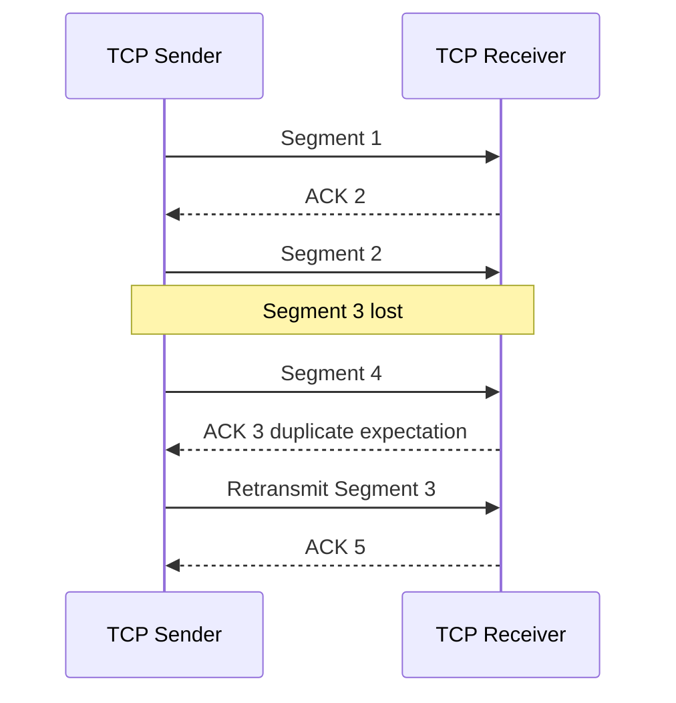

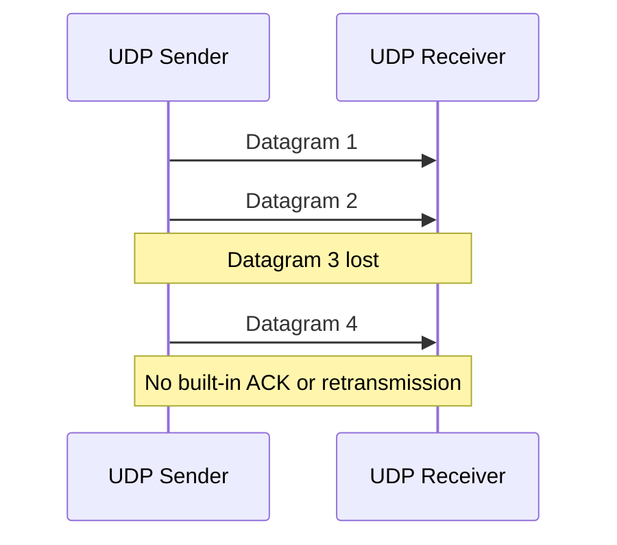

TCP and UDP are both transport-layer protocols, but they make different tradeoffs.

### 7.1 Side-by-side comparison table

| Feature | TCP | UDP |
|---|---|---|
| Connection model | Connection-oriented | Connectionless |
| Reliability | Built-in acknowledgments and retransmission | Best effort only |
| Ordering | Guaranteed in-order delivery to the application stream | No ordering guarantee |
| Data model | Byte stream | Datagrams |
| Overhead | Higher | Lower |
| Latency sensitivity | Can increase with retransmission and congestion control | Good for time-sensitive workloads |
| Typical use cases | Web, SSH, databases, APIs | DNS, VoIP, streaming, telemetry, gaming |

### 7.2 Header fields that matter

| Protocol | Key header fields | Why they matter |
|---|---|---|
| TCP | Source port, destination port, sequence, acknowledgment, flags, window, checksum | Implements reliable stateful transport |
| UDP | Source port, destination port, length, checksum | Keeps the transport header small and simple |

### 7.3 When TCP is the right choice

- You need reliable delivery of all bytes.
- The application cannot tolerate missing or re-ordered data.
- You want established middleware, proxies, firewalls, and load balancers to handle the protocol easily.
- Examples include HTTPS, SSH, SMB, IMAP, PostgreSQL, and most REST APIs.

### 7.4 When UDP is the right choice

- You care more about timeliness than perfect delivery.
- The application can recover from missing datagrams or has its own reliability scheme.
- You want very low overhead and preserved message boundaries.
- Examples include DNS queries, RTP media, syslog forwarding, SNMP, and many online games.

### 7.5 Important nuance: UDP is not automatically faster

- UDP avoids connection setup and built-in retransmission, but the application may need its own reliability logic.
- QUIC rides over UDP but reintroduces reliability, encryption, and stream control in user space.
- A badly designed UDP application can perform worse than TCP on lossy networks.

### 7.6 Commands to observe TCP and UDP

- `ss -tulpen`
- `ss -uap`
- `sudo tcpdump -ni any tcp`
- `sudo tcpdump -ni any udp`
- `netstat -su`
- `netstat -st`

### 7.7 Wireshark filters

- `tcp`
- `udp`
- `dns`
- `tcp.analysis.retransmission`
- `udp.port == 53`

### 7.8 Real-world examples

- A voice call uses UDP-based media because waiting for retransmission would make speech sound choppy and late.
- An HTTPS API uses TCP because every byte of the request and response must arrive reliably and in order.
- A DNS lookup often uses UDP because the query is small and benefits from low overhead, but TCP is used when answers are too large or for zone transfers.

---

## Section 8
## 8. IP Addressing — Visual Explanation
<a id="section-8"></a>

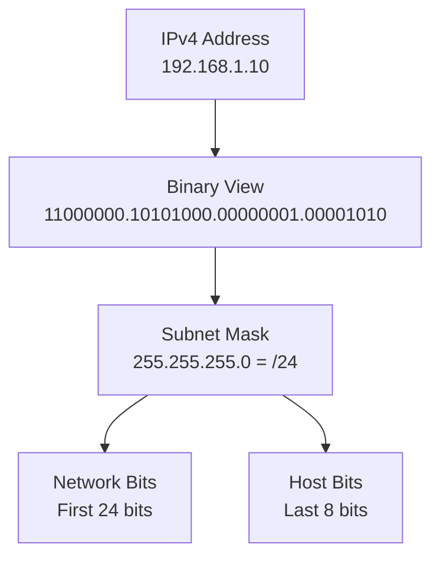

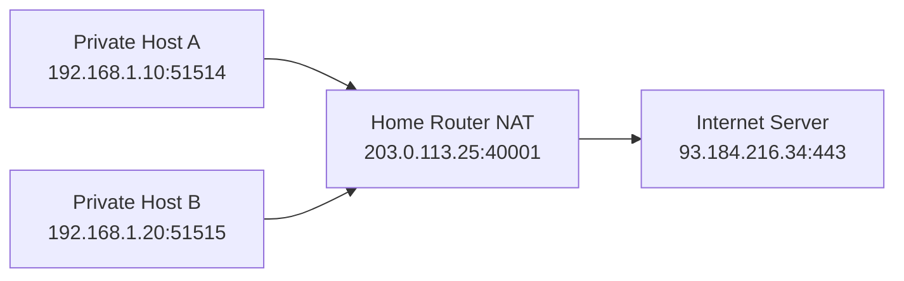

An IP address identifies a host interface in a logical network, but the prefix length tells you which part is network and which part is host.

### 8.1 IPv4 structure

### 📸 IP Packet Structure

> *Source: Wikimedia Commons — IPv4 packet header format*

```text
192.168.1.10
11000000.10101000.00000001.00001010
```

IPv4 addresses are 32 bits long.
Human-friendly dotted-decimal notation groups the bits into four octets.

### 8.2 Subnet mask visual

```text
255.255.255.0  =  11111111.11111111.11111111.00000000
                 |----------- network -----------| host |
```

A `/24` prefix means the first 24 bits are the network portion.
The remaining 8 bits identify hosts inside that network.

### 8.3 CIDR notation explained

- `192.168.1.10/24` means the interface address is `192.168.1.10` and the network prefix length is 24 bits.
- `10.0.0.0/8` means the network portion is the first 8 bits.
- `172.16.32.0/20` means the first 20 bits are network and the remaining 12 bits are host bits.
- CIDR replaced rigid classful addressing and allows flexible subnet sizing.

### 8.4 Common prefix sizes

| CIDR | Mask | Total addresses | Typical use |
|---|---|---:|---|
| /8 | 255.0.0.0 | 16,777,216 | Very large private or routed block |
| /16 | 255.255.0.0 | 65,536 | Large private segment design |
| /24 | 255.255.255.0 | 256 | Typical LAN subnet |
| /25 | 255.255.255.128 | 128 | Split a /24 in two |
| /26 | 255.255.255.192 | 64 | Small server subnet |
| /30 | 255.255.255.252 | 4 | Legacy point-to-point link |
| /32 | 255.255.255.255 | 1 | Single host route |

### 8.5 Network, broadcast, and usable hosts

- In classic IPv4 subnetting, the all-zero host value is the network address.
- The all-ones host value is the broadcast address.
- Usable hosts live in between, except for special cases like `/31` point-to-point addressing.
- Example: `192.168.1.0/24` gives network `192.168.1.0`, broadcast `192.168.1.255`, and usable hosts `192.168.1.1` to `192.168.1.254`.

### 8.6 Private IPv4 ranges (RFC 1918)

| Range | CIDR | Use |
|---|---|---|
| 10.0.0.0 - 10.255.255.255 | 10.0.0.0/8 | Large private addressing space |
| 172.16.0.0 - 172.31.255.255 | 172.16.0.0/12 | Medium private addressing space |
| 192.168.0.0 - 192.168.255.255 | 192.168.0.0/16 | Home and small office networks |

### 8.7 Other important IPv4 ranges

- `127.0.0.0/8` is loopback.
- `169.254.0.0/16` is link-local auto-configuration.
- `224.0.0.0/4` is multicast.
- `0.0.0.0` can mean unspecified address or default route context depending on usage.

### 8.8 NAT and PAT explained

- NAT changes IP addresses between address domains, often private to public.
- PAT, often called overload or many-to-one NAT, also rewrites source ports so many clients can share one public IP.
- Example: `192.168.1.10:51514` becomes `203.0.113.25:40001` on the Internet-facing side.
- Return traffic is mapped back using the translation table.

### 8.9 Commands to inspect addressing

- `ip addr`
- `ip route`
- `ip route get 8.8.8.8`
- `hostname -I`
- `nmcli device show`

### 8.10 Practical examples

- A laptop at `192.168.1.50/24` and a printer at `192.168.1.60/24` are on the same subnet, so they can communicate directly after ARP resolution.
- A host at `192.168.1.50/24` reaching `10.0.0.20` must send to a router because the destination is outside the local prefix.
- Two overlapping private subnets across a VPN create confusion because routing cannot uniquely identify the remote side without translation or redesign.

### 8.11 IPv6 note

- IPv6 uses 128-bit addresses, usually written in hexadecimal.
- A common LAN prefix is `/64`.
- IPv6 does not use ARP; it uses Neighbor Discovery over ICMPv6.
- NAT is not a design requirement in IPv6 the way it is in many IPv4 deployments.

---

## Section 9
## 9. How Routing Works — Visual
<a id="section-9"></a>

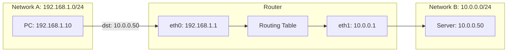

Routing is the process of choosing the next hop that gets a packet closer to its destination.

### 9.1 Step-by-step forwarding decision

1. The PC wants to reach `10.0.0.50`.
2. The PC compares the destination with its own subnet `192.168.1.0/24`.
3. Because `10.0.0.50` is not local, the PC sends the packet to its default gateway `192.168.1.1`.
4. The router receives the packet on `eth0`.
5. The router strips the incoming Layer 2 header and examines the destination IP.
6. The router searches its routing table for the longest matching prefix.
7. It finds that `10.0.0.0/24` is directly connected to `eth1`.
8. The router creates a new outgoing frame on `eth1` and forwards the packet toward the server.

### 9.2 Example routing table

```text
Destination        Gateway        Interface   Notes
192.168.1.0/24     connected      eth0        Local LAN
10.0.0.0/24        connected      eth1        Server LAN
0.0.0.0/0          203.0.113.1    wan0        Default route to ISP
```

### 9.3 Longest-prefix match

- Routers do not just pick the first route.
- They pick the most specific matching prefix.
- A `/24` is more specific than `/16`.
- A `/32` host route is more specific than both.
- This is why precise routes override broad defaults.

### 9.4 What changes on a routed hop

- The source and destination MAC addresses are rewritten for the new local link.
- The destination IP address stays the same unless NAT is applied.
- The TTL decreases by one.
- The IP checksum is updated accordingly in IPv4.

### 9.5 Commands to inspect routing

- `ip route`
- `ip route get 10.0.0.50`
- `ip rule show`
- `traceroute 10.0.0.50`
- `tracepath 10.0.0.50`

### 9.6 Real-world examples

- If a host has the wrong default gateway, it can talk locally but not reach remote networks.
- If two routes overlap, the most specific route wins.
- If a cloud route table lacks a path back to your subnet, the forward packet may arrive while the reply never returns.

---

## Section 10
## 10. DNS Resolution — Step by Step Visual
<a id="section-10"></a>

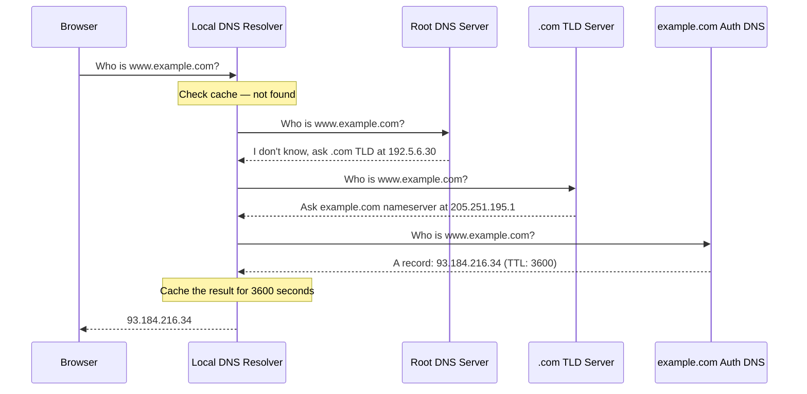

DNS turns names into resource records so applications can reach services without hardcoding IP addresses.

### 10.1 Recursive lookup story

1. The browser needs the IP for `www.example.com`.
2. It asks the local stub resolver, usually via the OS resolver library.
3. The local resolver forwards the query to a recursive resolver such as your ISP resolver, enterprise resolver, or public DNS service.
4. If the recursive resolver has no cached answer, it starts an iterative resolution process.
5. It asks a root server where `.com` information lives.
6. The root server responds with a referral to the `.com` TLD nameservers.
7. The resolver asks a `.com` TLD server where `example.com` is authoritative.
8. The TLD server responds with the authoritative nameserver details.
9. The resolver asks the authoritative nameserver for the `A` record of `www.example.com`.
10. The authoritative server responds with the IP address and TTL.
11. The recursive resolver caches the result for the TTL period.
12. The answer is returned to the browser so the next network phase can begin.

### 10.2 Common record types

| Record | Meaning | Example use |
|---|---|---|
| A | IPv4 address record | `example.com -> 93.184.216.34` |
| AAAA | IPv6 address record | `example.com -> 2606:2800:220:1:248:1893:25c8:1946` |
| CNAME | Alias to another name | `www -> app-lb.example.net` |
| MX | Mail exchange server | Mail delivery routing |
| NS | Authoritative nameserver | Delegation for a zone |
| TXT | Arbitrary text metadata | SPF, domain verification |

### 10.3 Why DNS problems feel random

- Caching means different clients can see different answers at the same time.
- Split-horizon DNS can intentionally return different answers inside and outside a network.
- A stale resolver cache can make a service appear down on one host and healthy on another.
- IPv6 and IPv4 responses may differ, so one protocol family can work while the other fails.

### 10.4 Commands to observe DNS

- `dig www.example.com`
- `dig @8.8.8.8 www.example.com`
- `dig +trace www.example.com`
- `resolvectl status`
- `resolvectl query www.example.com`
- `sudo tcpdump -ni any port 53`

### 10.5 Wireshark filters

- `dns`
- `dns.flags.response == 0` for queries
- `dns.flags.response == 1` for replies
- `udp.port == 53 or tcp.port == 53`

### 10.6 Real-world examples

- A website may be healthy at its IP, but if DNS points to an old load balancer, users still cannot reach it.
- A typo in an `A` record can break only one subdomain while the rest of the zone works.
- A missing AAAA record can cause IPv6-only clients to fail while IPv4 clients succeed.

---

## Section 11
## 11. Packet Encapsulation — How Data Gets Wrapped
<a id="section-11"></a>

### 📸 Data Encapsulation

> *Source: Wikimedia Commons — Protocol data unit encapsulation*

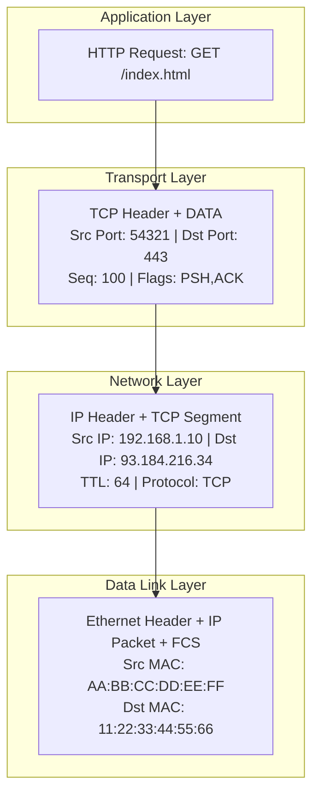

Encapsulation is the process of wrapping higher-layer data with lower-layer headers as it moves down the stack.

### 11.1 From app data to wire format

1. The application creates data, such as an HTTP request.
2. TCP adds source port, destination port, sequence numbers, flags, and checksum information.
3. IP adds source IP, destination IP, TTL, fragmentation-related fields, and protocol identifier.
4. Ethernet adds source MAC, destination MAC, EtherType, and frame check information.
5. The NIC sends the resulting bits over copper, fiber, or radio.

### 11.2 Decapsulation on the receiving side

1. The NIC receives bits and reconstructs a frame.
2. The Ethernet layer validates local delivery and hands the payload upward.
3. The IP layer checks the destination IP and protocol field.
4. The TCP layer reorders segments, verifies checksums, and places bytes into the receive buffer.
5. The application reads the original data stream.

### 11.3 Why encapsulation matters

- Different layers can solve different problems independently.
- A switch can forward a frame without understanding HTTP.
- A router can route a packet without understanding TLS payload contents.
- An application can read HTTP headers without knowing the exact switch port the frame crossed.

### 11.4 Commands to observe encapsulation

- `sudo tcpdump -ni any -e -vv host 93.184.216.34`
- `sudo tcpdump -ni any -XX port 443`
- `wireshark and expand Ethernet, IP, and TCP layers in packet details`
- `ss -tanp`

### 11.5 Real-world example

- An HTTP request can be perfectly formed at Layer 7 and still fail if the host never learns the next-hop MAC address at Layer 2.
- A packet capture that includes Ethernet headers can prove whether the host is talking to the right gateway even before you inspect the IP payload.

---

## Section 12
## 12. ARP — How MAC Addresses Are Resolved
<a id="section-12"></a>

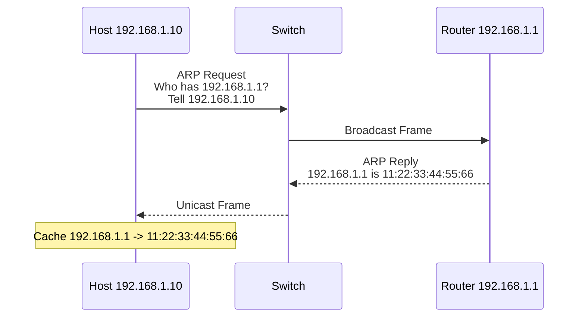

ARP is used on IPv4 local networks to map an IP address to a MAC address.

### 12.1 Why ARP is necessary

- IP decides the destination host or next hop logically.
- Ethernet still needs a destination MAC address to deliver the frame on the local segment.
- ARP fills that gap for IPv4 networks.

### 12.2 ARP request and reply flow

1. The sender decides the target is local or identifies the default gateway as the next hop.
2. If the MAC is not in the ARP cache, the sender broadcasts an ARP request.
3. All hosts on the local broadcast domain receive the request.
4. Only the device owning the target IP replies with its MAC address.
5. The sender stores the mapping in its ARP or neighbor cache for reuse.
6. The original IP packet can now be wrapped in an Ethernet frame and sent.

### 12.3 Important ARP concepts

- ARP works only on the local Layer 2 segment.
- A host does not ARP for a remote Internet server; it ARPs for the local gateway.
- ARP caches age out over time and are refreshed when needed.
- ARP spoofing can redirect traffic by lying about MAC ownership, which is why secure switching features matter in some environments.

### 12.4 Commands to observe ARP

- `ip neigh show`
- `arp -n`
- `sudo tcpdump -ni any arp`
- `ip monitor neigh`

### 12.5 Wireshark filters

- `arp`
- `arp.opcode == 1` for request
- `arp.opcode == 2` for reply

### 12.6 Real-world examples

- If a host can ping itself and its interface is up but it cannot reach the gateway, missing or wrong ARP entries are a strong clue.
- If two devices claim the same IP, ARP instability can create intermittent connectivity and duplicate-address warnings.

---

## Section 13
## 13. Network Troubleshooting Flow
<a id="section-13"></a>

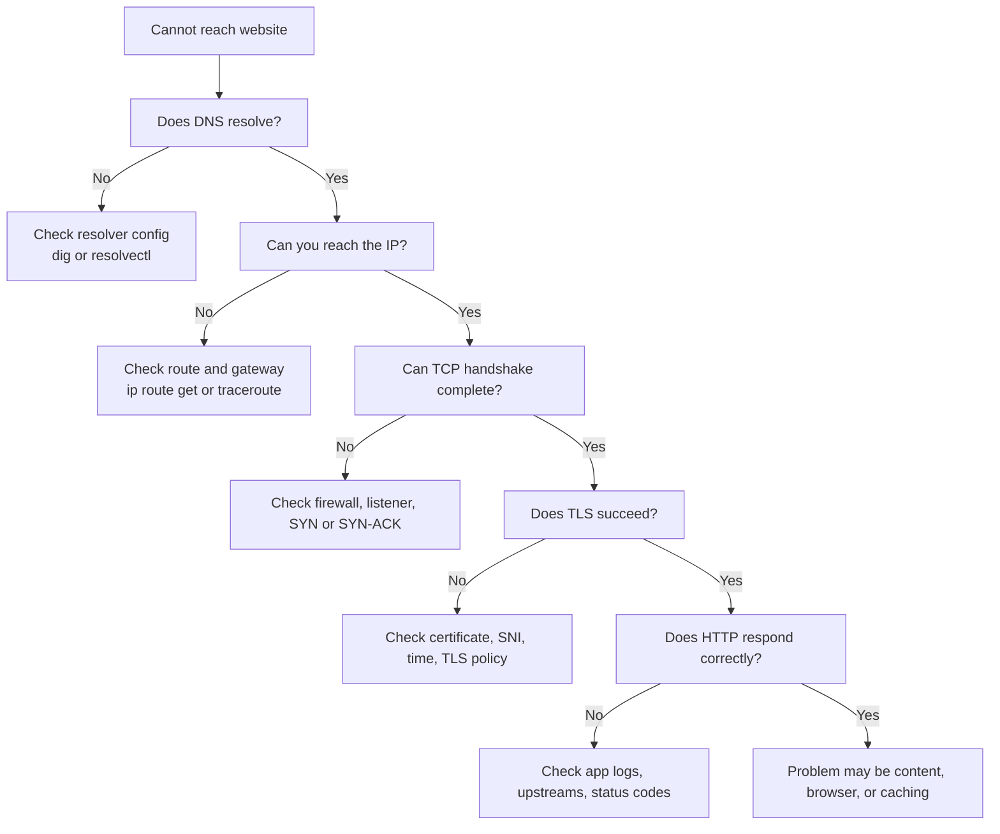

Troubleshooting improves dramatically when you test one layer at a time instead of changing many things at once.

### 13.1 Layered decision process

1. Confirm the user symptom precisely: timeout, name error, certificate warning, connection refused, or bad content.
2. Test DNS resolution.
3. Test basic IP reachability and route selection.
4. Test Layer 2 adjacency and gateway reachability if the destination is remote.
5. Test TCP handshake or UDP reachability.
6. Test TLS negotiation if the service is encrypted.
7. Test the application protocol itself with a tool like `curl`.
8. Correlate with server-side logs and packet captures if needed.

### 13.2 Common symptom map

| Symptom | Likely layer focus | First commands |
|---|---|---|
| `Name or service not known` | DNS / Application | `dig`, `resolvectl query` |
| `No route to host` | Network / Routing | `ip route`, `ip route get` |
| Connection timeout | Transport / Filtering / Path | `tcpdump`, `ss`, firewall checks |
| `Connection refused` | Transport / Application listener | `ss -ltnp`, service status |
| TLS certificate error | Presentation / TLS | `openssl s_client`, system time check |
| HTTP 500 | Application | app logs, upstream logs, `curl -v` |

### 13.3 Practical command sequence

- `dig example.com`
- `ip route get 93.184.216.34`
- `ping -c 3 <gateway>`
- `traceroute 93.184.216.34`
- `ss -tanp | grep 443`
- `sudo tcpdump -ni any host 93.184.216.34`
- `openssl s_client -connect example.com:443 -servername example.com`
- `curl -vk https://example.com/`

### 13.4 Real-world examples

- If DNS fails, do not waste time looking at TCP retransmissions yet.
- If DNS succeeds but `ip route get` shows the wrong outgoing interface, fix routing first.
- If the route is right but there is no SYN-ACK, inspect firewalls, security groups, NAT, or the remote listener.
- If TLS fails after TCP succeeds, check certificates, server name indication, clock skew, and TLS version mismatch.
- If `curl` gets a 200 but the browser still fails, think browser cache, proxy policy, cookies, or JavaScript errors.

---

## Section 14
## 14. Practical Packet Observation Cookbook
<a id="section-14"></a>

This section gives you concrete commands and what to look for.

### 14.1 Watch DNS queries from this host

- Command: `sudo tcpdump -ni any port 53`
- What to look for: Look for outgoing query and matching reply.
- Why it matters: It narrows the failing layer before you change configuration.
- Real-world use: Run it during an outage and compare with a healthy host.

### 14.2 Watch SYN packets to HTTPS

- Command: `sudo tcpdump -ni any "tcp port 443 and tcp[tcpflags] & tcp-syn != 0"`
- What to look for: Look for SYN, SYN-ACK, ACK sequence.
- Why it matters: It narrows the failing layer before you change configuration.
- Real-world use: Run it during an outage and compare with a healthy host.

### 14.3 Watch ARP on the LAN

- Command: `sudo tcpdump -ni any arp`
- What to look for: Look for who-has and is-at exchange.
- Why it matters: It narrows the failing layer before you change configuration.
- Real-world use: Run it during an outage and compare with a healthy host.

### 14.4 See chosen route to a destination

- Command: `ip route get 93.184.216.34`
- What to look for: Look for selected interface, source IP, and gateway.
- Why it matters: It narrows the failing layer before you change configuration.
- Real-world use: Run it during an outage and compare with a healthy host.

### 14.5 List listening TCP ports

- Command: `ss -ltnp`
- What to look for: Confirm the service is actually listening.
- Why it matters: It narrows the failing layer before you change configuration.
- Real-world use: Run it during an outage and compare with a healthy host.

### 14.6 List listening UDP ports

- Command: `ss -lunp`
- What to look for: Confirm UDP servers such as DNS or syslog are bound.
- Why it matters: It narrows the failing layer before you change configuration.
- Real-world use: Run it during an outage and compare with a healthy host.

### 14.7 Inspect neighbor table

- Command: `ip neigh show`
- What to look for: Verify next-hop MAC entries exist and are reachable.
- Why it matters: It narrows the failing layer before you change configuration.
- Real-world use: Run it during an outage and compare with a healthy host.

### 14.8 Inspect link health

- Command: `ethtool eth0`
- What to look for: Check speed, duplex, and link detected.
- Why it matters: It narrows the failing layer before you change configuration.
- Real-world use: Run it during an outage and compare with a healthy host.

### 14.9 Check TCP retransmissions counters

- Command: `netstat -s | grep -i retrans`
- What to look for: Rising counters often correlate with loss or filtering.
- Why it matters: It narrows the failing layer before you change configuration.
- Real-world use: Run it during an outage and compare with a healthy host.

### 14.10 Trace path MTU hints

- Command: `tracepath example.com`
- What to look for: Useful for MTU black hole suspicion.
- Why it matters: It narrows the failing layer before you change configuration.
- Real-world use: Run it during an outage and compare with a healthy host.

### 14.11 View TLS certificate from the wire side

- Command: `openssl s_client -connect example.com:443 -servername example.com`
- What to look for: Inspect certificate chain and negotiated protocol.
- Why it matters: It narrows the failing layer before you change configuration.
- Real-world use: Run it during an outage and compare with a healthy host.

### 14.12 Issue a verbose HTTP request

- Command: `curl -vk https://example.com/`
- What to look for: Observe DNS, TCP, TLS, and HTTP in one tool output.
- Why it matters: It narrows the failing layer before you change configuration.
- Real-world use: Run it during an outage and compare with a healthy host.

### 14.13 Common Wireshark display filters

- Show all DNS packets: `dns`
- Show initial SYN packets: `tcp.flags.syn == 1 && tcp.flags.ack == 0`
- Show SYN-ACK packets: `tcp.flags.syn == 1 && tcp.flags.ack == 1`
- Show retransmissions: `tcp.analysis.retransmission`
- Show ARP traffic: `arp`
- Show TLS handshakes: `tls.handshake`
- Show HTTP requests: `http.request`
- Show packets to a host: `ip.addr == 93.184.216.34`
- Show ICMP errors: `icmp or icmpv6`
- Show only UDP 53: `udp.port == 53`

### 14.14 Packet capture reading checklist

- Who initiated the flow?
- Which interface saw the first packet?
- Did name resolution happen first?
- Did ARP or Neighbor Discovery complete?
- Did the handshake complete?
- Did the server reply at the TCP layer but fail later at TLS or HTTP?
- Are retransmissions or duplicate ACKs present?
- Is NAT rewriting addresses or ports?
- Does the path change when you compare healthy and unhealthy traces?

---

## Section 15
## 15. Quick Reference Tables
<a id="section-15"></a>

### 15.1 Common well-known ports

| Service | Port | Protocol | Typical purpose |
|---|---:|---|---|
| FTP data | 20 | TCP | Legacy file transfer data channel |
| FTP control | 21 | TCP | Legacy file transfer control channel |
| SSH | 22 | TCP | Remote shell and secure copy |
| SMTP | 25 | TCP | Mail transfer |
| DNS | 53 | UDP/TCP | Name resolution |
| DHCP server | 67 | UDP | Address assignment server |
| DHCP client | 68 | UDP | Address assignment client |
| HTTP | 80 | TCP | Unencrypted web traffic |
| POP3 | 110 | TCP | Legacy mail retrieval |
| NTP | 123 | UDP | Time synchronization |
| IMAP | 143 | TCP | Mail retrieval and sync |
| SNMP | 161 | UDP | Network management |
| HTTPS | 443 | TCP | Encrypted web traffic |
| SMB | 445 | TCP | Windows file sharing |
| LDAPS | 636 | TCP | Encrypted LDAP |
| NFS | 2049 | TCP/UDP | Network file system |
| OpenVPN | 1194 | UDP | VPN transport |
| WireGuard | 51820 | UDP | VPN transport |

### 15.2 Useful Linux networking commands

| Goal | Command |
|---|---|
| Show addresses | `ip addr` |
| Show routes | `ip route` |
| Show links | `ip link` |
| Show neighbors | `ip neigh` |
| Show TCP/UDP sockets | `ss -tulpen` |
| Test ICMP reachability | `ping` |
| Trace a path | `traceroute` or `tracepath` |
| Query DNS | `dig` or `resolvectl query` |
| Capture packets | `tcpdump` |
| Inspect NIC settings | `ethtool` |

### 15.3 PDU quick reference

- Application, Presentation, Session: Data
- Transport: Segment or datagram
- Network: Packet
- Data Link: Frame
- Physical: Bits

### 15.4 Common failure symptoms

- No carrier: Layer 1 or 2 physical issue.
- ARP incomplete: local Layer 2 reachability issue.
- No route to host: Layer 3 routing issue.
- SYN retransmissions: transport path or filtering issue.
- TLS alert: certificate or protocol mismatch issue.
- HTTP 5xx: application issue.

---

## Section 16
## 16. Glossary and Mental Models
<a id="section-16"></a>

### 16.1 Glossary

- **ACK**: A TCP acknowledgment indicating the next byte expected from the peer.
- **ARP**: Address Resolution Protocol, used to map IPv4 addresses to MAC addresses on a local link.
- **CIDR**: Classless Inter-Domain Routing, notation such as `/24` that tells you the prefix length.
- **Datagram**: A self-contained message unit used by connectionless transports such as UDP.
- **Default gateway**: The router a host uses for destinations outside the local subnet.
- **DNS**: Domain Name System, which maps names to resource records.
- **Encapsulation**: Wrapping higher-layer data with lower-layer headers.
- **Ethernet frame**: A Layer 2 unit carrying MAC addresses and an upper-layer payload.
- **FIN**: A TCP flag meaning the sender has finished sending data in one direction.
- **FQDN**: Fully Qualified Domain Name.
- **Hop**: One routed step between source and destination.
- **IP packet**: A Layer 3 unit carrying source and destination IP addressing metadata.
- **MAC address**: A Layer 2 hardware identifier used on the local segment.
- **MTU**: Maximum Transmission Unit, the largest payload that fits on a link without fragmentation.
- **NAT**: Network Address Translation between address domains.
- **PDU**: Protocol Data Unit, the name of the data object at a given layer.
- **Port**: A transport-layer identifier for a service endpoint on a host.
- **Retransmission**: Sending a TCP segment again because the original was assumed lost.
- **Segment**: A TCP transport-layer data unit.
- **SNI**: Server Name Indication, a TLS extension carrying the intended hostname.
- **SYN**: A TCP flag used to synchronize sequence numbers and start a connection.
- **TTL**: Time To Live, reduced by each routed hop to prevent loops.
- **Window size**: TCP flow-control advertisement indicating how much data the receiver can currently accept.

### 16.2 Mental model summaries

- OSI layers are a troubleshooting map.
- TCP/IP is the practical implementation map.
- MAC addresses matter only on the current local link.
- IP addresses matter across routed networks.
- Ports identify applications, not machines by themselves.
- Routers move packets between networks by longest-prefix match.
- Switches move frames inside a local Layer 2 domain by MAC learning.
- DNS tells you where to go by name.
- ARP tells you how to reach the next hop on the current Ethernet segment.
- TCP gives you a reliable ordered byte stream on top of an unreliable IP network.

## Appendix A — End-to-End Troubleshooting Scenarios

### Appendix A.1 Website does not resolve

- Start by identifying the lowest confirmed healthy layer.
- Capture the exact user symptom and timestamp.
- Compare behavior from a healthy source and an unhealthy source.
- Check DNS, route selection, and neighbor resolution before changing application settings.
- Use packet capture to prove whether packets leave, arrive, and return.
- Correlate captures with server logs and firewall counters.
- Document the root cause so the same symptom is easier next time.

### Appendix A.2 Website resolves but does not connect

- Start by identifying the lowest confirmed healthy layer.
- Capture the exact user symptom and timestamp.
- Compare behavior from a healthy source and an unhealthy source.
- Check DNS, route selection, and neighbor resolution before changing application settings.
- Use packet capture to prove whether packets leave, arrive, and return.
- Correlate captures with server logs and firewall counters.
- Document the root cause so the same symptom is easier next time.

### Appendix A.3 TCP connects but TLS fails

- Start by identifying the lowest confirmed healthy layer.
- Capture the exact user symptom and timestamp.
- Compare behavior from a healthy source and an unhealthy source.
- Check DNS, route selection, and neighbor resolution before changing application settings.
- Use packet capture to prove whether packets leave, arrive, and return.
- Correlate captures with server logs and firewall counters.
- Document the root cause so the same symptom is easier next time.

### Appendix A.4 TLS works but HTTP returns errors

- Start by identifying the lowest confirmed healthy layer.
- Capture the exact user symptom and timestamp.
- Compare behavior from a healthy source and an unhealthy source.
- Check DNS, route selection, and neighbor resolution before changing application settings.
- Use packet capture to prove whether packets leave, arrive, and return.
- Correlate captures with server logs and firewall counters.
- Document the root cause so the same symptom is easier next time.

### Appendix A.5 Only one VLAN cannot reach the service

- Start by identifying the lowest confirmed healthy layer.
- Capture the exact user symptom and timestamp.
- Compare behavior from a healthy source and an unhealthy source.
- Check DNS, route selection, and neighbor resolution before changing application settings.
- Use packet capture to prove whether packets leave, arrive, and return.
- Correlate captures with server logs and firewall counters.
- Document the root cause so the same symptom is easier next time.

### Appendix A.6 Works on IPv4 but not IPv6

- Start by identifying the lowest confirmed healthy layer.
- Capture the exact user symptom and timestamp.
- Compare behavior from a healthy source and an unhealthy source.
- Check DNS, route selection, and neighbor resolution before changing application settings.
- Use packet capture to prove whether packets leave, arrive, and return.
- Correlate captures with server logs and firewall counters.
- Document the root cause so the same symptom is easier next time.

### Appendix A.7 Works locally but not through VPN

- Start by identifying the lowest confirmed healthy layer.
- Capture the exact user symptom and timestamp.
- Compare behavior from a healthy source and an unhealthy source.
- Check DNS, route selection, and neighbor resolution before changing application settings.
- Use packet capture to prove whether packets leave, arrive, and return.
- Correlate captures with server logs and firewall counters.
- Document the root cause so the same symptom is easier next time.

### Appendix A.8 Intermittent packet loss under load

- Start by identifying the lowest confirmed healthy layer.
- Capture the exact user symptom and timestamp.
- Compare behavior from a healthy source and an unhealthy source.
- Check DNS, route selection, and neighbor resolution before changing application settings.
- Use packet capture to prove whether packets leave, arrive, and return.
- Correlate captures with server logs and firewall counters.
- Document the root cause so the same symptom is easier next time.

### Appendix A.9 Connection stalls after initial data

- Start by identifying the lowest confirmed healthy layer.
- Capture the exact user symptom and timestamp.
- Compare behavior from a healthy source and an unhealthy source.
- Check DNS, route selection, and neighbor resolution before changing application settings.
- Use packet capture to prove whether packets leave, arrive, and return.
- Correlate captures with server logs and firewall counters.
- Document the root cause so the same symptom is easier next time.

### Appendix A.10 One-way traffic after NAT

- Start by identifying the lowest confirmed healthy layer.
- Capture the exact user symptom and timestamp.
- Compare behavior from a healthy source and an unhealthy source.
- Check DNS, route selection, and neighbor resolution before changing application settings.
- Use packet capture to prove whether packets leave, arrive, and return.
- Correlate captures with server logs and firewall counters.
- Document the root cause so the same symptom is easier next time.

### Appendix A.11 Random slowness during peak hours

- Start by identifying the lowest confirmed healthy layer.
- Capture the exact user symptom and timestamp.
- Compare behavior from a healthy source and an unhealthy source.
- Check DNS, route selection, and neighbor resolution before changing application settings.
- Use packet capture to prove whether packets leave, arrive, and return.
- Correlate captures with server logs and firewall counters.
- Document the root cause so the same symptom is easier next time.

### Appendix A.12 Duplicate IP address symptoms

- Start by identifying the lowest confirmed healthy layer.
- Capture the exact user symptom and timestamp.
- Compare behavior from a healthy source and an unhealthy source.
- Check DNS, route selection, and neighbor resolution before changing application settings.
- Use packet capture to prove whether packets leave, arrive, and return.
- Correlate captures with server logs and firewall counters.
- Document the root cause so the same symptom is easier next time.

### Appendix A.13 Asymmetric routing suspicion

- Start by identifying the lowest confirmed healthy layer.
- Capture the exact user symptom and timestamp.
- Compare behavior from a healthy source and an unhealthy source.
- Check DNS, route selection, and neighbor resolution before changing application settings.
- Use packet capture to prove whether packets leave, arrive, and return.
- Correlate captures with server logs and firewall counters.
- Document the root cause so the same symptom is easier next time.

### Appendix A.14 Many CLOSE_WAIT sockets on server

- Start by identifying the lowest confirmed healthy layer.
- Capture the exact user symptom and timestamp.
- Compare behavior from a healthy source and an unhealthy source.
- Check DNS, route selection, and neighbor resolution before changing application settings.
- Use packet capture to prove whether packets leave, arrive, and return.
- Correlate captures with server logs and firewall counters.
- Document the root cause so the same symptom is easier next time.

### Appendix A.15 Huge TIME_WAIT on client host

- Start by identifying the lowest confirmed healthy layer.
- Capture the exact user symptom and timestamp.
- Compare behavior from a healthy source and an unhealthy source.
- Check DNS, route selection, and neighbor resolution before changing application settings.
- Use packet capture to prove whether packets leave, arrive, and return.
- Correlate captures with server logs and firewall counters.
- Document the root cause so the same symptom is easier next time.

### Appendix A.16 DNS answers differ by location

- Start by identifying the lowest confirmed healthy layer.
- Capture the exact user symptom and timestamp.
- Compare behavior from a healthy source and an unhealthy source.
- Check DNS, route selection, and neighbor resolution before changing application settings.
- Use packet capture to prove whether packets leave, arrive, and return.
- Correlate captures with server logs and firewall counters.
- Document the root cause so the same symptom is easier next time.

### Appendix A.17 Only HTTPS fails while HTTP works

- Start by identifying the lowest confirmed healthy layer.
- Capture the exact user symptom and timestamp.
- Compare behavior from a healthy source and an unhealthy source.
- Check DNS, route selection, and neighbor resolution before changing application settings.
- Use packet capture to prove whether packets leave, arrive, and return.
- Correlate captures with server logs and firewall counters.
- Document the root cause so the same symptom is easier next time.

### Appendix A.18 SSH works but large file transfer stalls

- Start by identifying the lowest confirmed healthy layer.
- Capture the exact user symptom and timestamp.
- Compare behavior from a healthy source and an unhealthy source.
- Check DNS, route selection, and neighbor resolution before changing application settings.
- Use packet capture to prove whether packets leave, arrive, and return.
- Correlate captures with server logs and firewall counters.
- Document the root cause so the same symptom is easier next time.

### Appendix A.19 Ping works but app still fails

- Start by identifying the lowest confirmed healthy layer.
- Capture the exact user symptom and timestamp.
- Compare behavior from a healthy source and an unhealthy source.
- Check DNS, route selection, and neighbor resolution before changing application settings.
- Use packet capture to prove whether packets leave, arrive, and return.
- Correlate captures with server logs and firewall counters.
- Document the root cause so the same symptom is easier next time.

### Appendix A.20 Cloud security group versus host firewall mismatch

- Start by identifying the lowest confirmed healthy layer.
- Capture the exact user symptom and timestamp.
- Compare behavior from a healthy source and an unhealthy source.
- Check DNS, route selection, and neighbor resolution before changing application settings.
- Use packet capture to prove whether packets leave, arrive, and return.
- Correlate captures with server logs and firewall counters.
- Document the root cause so the same symptom is easier next time.

## Appendix B — Practical Observation Commands by Layer

### Appendix B — Application

- `curl -v http://example.com`
- `curl -vk https://example.com`
- `dig example.com`
- `ssh -vv user@host`

### Appendix B — Presentation

- `openssl s_client -connect example.com:443 -servername example.com`
- `curl --compressed https://example.com`

### Appendix B — Session

- `ss -tanp`
- `journalctl -u sshd`
- `klist`

### Appendix B — Transport

- `ss -tulpen`
- `netstat -st`
- `netstat -su`
- `tcpdump -ni any tcp or udp`

### Appendix B — Network

- `ip addr`
- `ip route`
- `ip route get 8.8.8.8`
- `ping`
- `traceroute`
- `tracepath`

### Appendix B — Data Link

- `ip link`
- `ip neigh`
- `arp -n`
- `bridge link`
- `tcpdump -eni any`

### Appendix B — Physical

- `ethtool eth0`
- `ip -s link`
- `dmesg | grep -i link`

## Appendix C — Packet Journey Mini-Stories

### Appendix C.1 Browser to HTTPS website

- Name resolution or service discovery identifies the target.
- The source host selects a route and next hop.
- Neighbor resolution provides the needed local Layer 2 destination.
- Transport builds the right socket conversation or datagram.
- IP forwards hop by hop until the destination network is reached.
- The destination stack decapsulates and hands data to the application.
- The response follows the reverse logic, though not always the exact same physical path.

### Appendix C.2 Laptop to SSH server

- Name resolution or service discovery identifies the target.
- The source host selects a route and next hop.
- Neighbor resolution provides the needed local Layer 2 destination.
- Transport builds the right socket conversation or datagram.
- IP forwards hop by hop until the destination network is reached.
- The destination stack decapsulates and hands data to the application.
- The response follows the reverse logic, though not always the exact same physical path.

### Appendix C.3 Host to local default gateway

- Name resolution or service discovery identifies the target.
- The source host selects a route and next hop.
- Neighbor resolution provides the needed local Layer 2 destination.
- Transport builds the right socket conversation or datagram.
- IP forwards hop by hop until the destination network is reached.
- The destination stack decapsulates and hands data to the application.
- The response follows the reverse logic, though not always the exact same physical path.

### Appendix C.4 Resolver to authoritative DNS server

- Name resolution or service discovery identifies the target.
- The source host selects a route and next hop.
- Neighbor resolution provides the needed local Layer 2 destination.
- Transport builds the right socket conversation or datagram.
- IP forwards hop by hop until the destination network is reached.
- The destination stack decapsulates and hands data to the application.
- The response follows the reverse logic, though not always the exact same physical path.

### Appendix C.5 Client to database over private subnet

- Name resolution or service discovery identifies the target.
- The source host selects a route and next hop.
- Neighbor resolution provides the needed local Layer 2 destination.
- Transport builds the right socket conversation or datagram.
- IP forwards hop by hop until the destination network is reached.
- The destination stack decapsulates and hands data to the application.
- The response follows the reverse logic, though not always the exact same physical path.

### Appendix C.6 VoIP phone sending UDP media

- Name resolution or service discovery identifies the target.
- The source host selects a route and next hop.
- Neighbor resolution provides the needed local Layer 2 destination.
- Transport builds the right socket conversation or datagram.
- IP forwards hop by hop until the destination network is reached.
- The destination stack decapsulates and hands data to the application.
- The response follows the reverse logic, though not always the exact same physical path.

### Appendix C.7 Kubernetes pod talking to a service VIP

- Name resolution or service discovery identifies the target.
- The source host selects a route and next hop.
- Neighbor resolution provides the needed local Layer 2 destination.
- Transport builds the right socket conversation or datagram.
- IP forwards hop by hop until the destination network is reached.
- The destination stack decapsulates and hands data to the application.
- The response follows the reverse logic, though not always the exact same physical path.

### Appendix C.8 VPN client reaching an internal API

- Name resolution or service discovery identifies the target.
- The source host selects a route and next hop.
- Neighbor resolution provides the needed local Layer 2 destination.
- Transport builds the right socket conversation or datagram.
- IP forwards hop by hop until the destination network is reached.
- The destination stack decapsulates and hands data to the application.
- The response follows the reverse logic, though not always the exact same physical path.

### Appendix C.9 Load balancer forwarding to backend node

- Name resolution or service discovery identifies the target.
- The source host selects a route and next hop.
- Neighbor resolution provides the needed local Layer 2 destination.
- Transport builds the right socket conversation or datagram.
- IP forwards hop by hop until the destination network is reached.
- The destination stack decapsulates and hands data to the application.
- The response follows the reverse logic, though not always the exact same physical path.

### Appendix C.10 Server sending syslog to central collector

- Name resolution or service discovery identifies the target.
- The source host selects a route and next hop.
- Neighbor resolution provides the needed local Layer 2 destination.
- Transport builds the right socket conversation or datagram.
- IP forwards hop by hop until the destination network is reached.
- The destination stack decapsulates and hands data to the application.
- The response follows the reverse logic, though not always the exact same physical path.

## Appendix D — Checklist Before Changing Production Networking

- [ ] Confirm maintenance window and blast radius.
- [ ] Record current IP addresses, routes, neighbor entries, and listeners.
- [ ] Capture a known-good packet trace if possible.
- [ ] Know the rollback plan and console access path.
- [ ] Check DNS TTLs before moving public services.
- [ ] Validate host firewall and upstream policy alignment.
- [ ] Avoid overlapping subnets in VPN or hybrid designs.
- [ ] Verify MTU when overlays, tunnels, or MPLS paths are involved.
- [ ] Monitor retransmissions, drops, and application error rates during the change.
- [ ] Update diagrams and docs after the change succeeds.

## Appendix E — Quick Quiz Prompts

- Which layer cares about ports?
- Which addresses change at every routed hop?
- Why does a host ARP for the gateway instead of a remote server?
- What does SYN actually synchronize?
- Why can TIME_WAIT be normal?
- What is the difference between a packet and a frame?
- Why can DNS failure look like an application outage?
- What does longest-prefix match mean?
- Why can ping work while HTTPS fails?
- Why is UDP useful for real-time media?

## Appendix F — Detailed Notes by Topic

### Appendix F — Layering

- Layers let engineers separate concerns.
- Layers also help vendors build interoperable products.
- In real systems, layers can blur, but the troubleshooting value remains high.
- Every packet capture is easier to understand when you know which fields belong to which layer.
- Observation commands:
  - `tcpdump -ni any`
  - `wireshark packet details pane`

### Appendix F — Switching

- Switches learn source MAC addresses.
- Unknown unicast traffic may be flooded within the VLAN until learned.
- Broadcast traffic reaches all ports in the broadcast domain.
- VLANs split Layer 2 domains without requiring separate physical switches.
- Observation commands:
  - `bridge link`
  - `tcpdump -eni any`

### Appendix F — Routing

- Routers break broadcast domains.
- Each routed interface belongs to a different IP subnet.
- Routing tables tell a router what next hop or interface to use.
- Dynamic routing protocols exchange reachability information automatically.
- Observation commands:
  - `ip route`
  - `traceroute`

### Appendix F — TCP reliability

- ACKs confirm byte ranges, not abstract messages.
- Retransmission timers handle loss.
- Congestion control protects the network from overload.
- Receive windows protect slow receivers from being overwhelmed.
- Observation commands:
  - `ss -tan`
  - `netstat -s`
  - `tcpdump -ni any tcp`

### Appendix F — DNS behavior

- Resolvers cache answers to reduce latency and load.
- Negative responses can also be cached.
- TTL changes are not instantaneous everywhere.
- Authoritative servers answer for zones they control.
- Observation commands:
  - `dig +trace example.com`
  - `tcpdump -ni any port 53`

### Appendix F — NAT behavior

- Outbound NAT commonly rewrites the source IP.
- PAT also rewrites source ports to multiplex many flows.
- Inbound publishing requires static mappings or proxies.
- State tracking matters for returning traffic.
- Observation commands:
  - `conntrack -L`
  - `tcpdump on inside and outside interfaces`

### Appendix F — TLS basics

- TLS authenticates and encrypts.
- Certificates bind identities to public keys.
- SNI helps multi-tenant servers present the right certificate.
- Handshake failures can be caused by time skew, policy mismatch, or trust-chain errors.
- Observation commands:
  - `openssl s_client -connect host:443 -servername host`
  - `wireshark tls.handshake`

### Appendix F — MTU awareness

- A packet larger than the path MTU may be fragmented or dropped depending on settings.
- Tunnels reduce effective payload size.
- Path MTU problems often appear as stalls on larger transfers.
- Tracepath is handy because it can reveal MTU-related issues without full packet capture.
- Observation commands:
  - `tracepath host`
  - `tcpdump -ni any`

## Final Summary

- Applications create meaning.
- TCP and UDP move data between processes.
- IP moves packets between networks.
- Ethernet and Wi-Fi move frames on local links.
- DNS tells you where to go by name.
- ARP tells you how to reach the next hop locally.
- Routing chooses the path.
- TCP handshakes create reliable conversations.
- TLS protects the content.
- Packet captures reveal what actually happened.

## Appendix G — Network Reasoning Drills

Use these drills to practice thinking like the host, the switch, the router, and the server at the same time.

### G.1 Host perspective drills

1. If DNS fails, what exact destination IP is the host missing?
2. If DNS succeeds, what route will the host pick?
3. If the destination is remote, which default gateway will the host choose?
4. Does the host already know the next-hop MAC address?
5. If not, should it ARP for the remote host or for the gateway?
6. Which source IP will the host place in the outgoing packet?
7. Which source port will the host choose for the new TCP flow?
8. What TCP state should the client be in right after sending the first SYN?
9. If the host sees no SYN-ACK, is the problem guaranteed to be on the server?
10. If `ip route get` chooses the wrong interface, which layer should you fix first?
11. If the destination is local, does the host need routing or only Layer 2 resolution?
12. If the host has two default routes, which metrics influence the choice?
13. If the interface is down, can DNS, TCP, or TLS succeed?
14. If the MTU is too large, which symptoms might appear first?
15. If the host is behind NAT, which address does the application think it used versus what the Internet sees?

### G.2 Switch perspective drills

1. Which frame fields does a switch examine first?
2. Does the switch care about TCP port 443 while forwarding an Ethernet frame?
3. What happens when the destination MAC is unknown to the switch table?
4. Why can a switch forward traffic even when it has no idea what HTTP means?
5. What is flooded inside a VLAN: broadcast, unknown unicast, or both?
6. Why do MAC addresses change hop by hop while IP addresses often stay stable end to end?
7. If ARP broadcast frames are missing on a capture, what local issue might exist?
8. Which device breaks the Layer 2 broadcast domain: switch or router?
9. If two hosts are on different VLANs, can a switch alone route between them without Layer 3 logic?
10. What evidence in `tcpdump -e` tells you the frame reached the expected gateway MAC?

### G.3 Router perspective drills

1. What part of the packet does the router inspect to make a forwarding decision?
2. Why does the router discard the incoming Ethernet header and build a new one for the next hop?
3. What does longest-prefix match mean in a real routing table?
4. Why can a `/32` route override a broader `/24` route?
5. What field decreases at every routed hop and protects against loops?
6. If a packet arrives but the return route is missing, what symptom will the client likely see?
7. At what point does NAT usually rewrite source or destination addresses?
8. If NAT is also doing PAT, what else might be rewritten besides the IP address?
9. Why can the forward path and return path be different?
10. If a router has no matching route and no default route, what happens to the packet?
11. Which Linux commands show the same thinking process a router uses?
12. Why can `traceroute` reveal different hops than a simple `ping`?
13. If the router knows the route but not the next-hop MAC, what protocol helps next?
14. What happens to the IP checksum on IPv4 after TTL changes?
15. Why are cloud route tables and on-host routes both relevant in hybrid environments?

### G.4 TCP reasoning drills

1. What does SYN synchronize?
2. Why is TCP called a byte-stream protocol instead of a message protocol?
3. What does an ACK number actually mean?
4. Why can duplicate ACKs suggest loss or reordering?
5. Why does TCP need retransmission timers even if applications can retry too?
6. If the server never sends SYN-ACK, which states might you observe on the client?
7. If the client never sends the final ACK, which state might remain on the server?
8. Why is `CLOSE_WAIT` often an application bug rather than a network bug?
9. Why is `TIME_WAIT` often normal rather than dangerous?
10. How can a SYN flood consume server resources without completing real sessions?
11. If packet loss occurs after the handshake, what counters or capture clues help prove it?
12. Why can TCP recover from missing segments but UDP normally does not?
13. Why can a reset look different from a timeout during troubleshooting?
14. What is the difference between `Connection refused` and silent packet drop from the TCP perspective?
15. Why can application latency increase even when the route stays identical?

### G.5 DNS reasoning drills

1. If the browser says the site cannot be found, what is the first DNS question to test?
2. If `dig` works against `8.8.8.8` but not against the local resolver, where is the fault likely concentrated?
3. Why can one host still fail after DNS was already fixed globally?
4. What role does TTL play in rollout speed and stale answers?
5. Why can split-horizon DNS make inside and outside results differ on purpose?
6. What record type usually maps a web hostname to an IPv4 address?
7. What record type usually maps a hostname to an IPv6 address?
8. Why might a hostname resolve correctly but the browser still show a certificate error?
9. Why does `dig +trace` show more than a normal lookup?
10. What is the difference between an authoritative answer and a recursive answer?

### G.6 Practical compare-and-contrast drills

1. Compare what `curl -vk https://example.com` tells you that `ping example.com` does not.
2. Compare what `ip route get <dst>` tells you that `dig <name>` does not.
3. Compare what `ss -tanp` tells you that `ip neigh` does not.
4. Compare what `tcpdump -ni any port 53` tells you that `resolvectl query` does not.
5. Compare what `openssl s_client` tells you that a plain TCP connect test does not.
6. Compare what `tcpdump -e` tells you that a capture without Ethernet headers does not.
7. Compare what `traceroute` reveals that `ping` may hide.
8. Compare what a server log reveals that packet capture cannot decode from encrypted payloads.
9. Compare what the browser knows versus what the router knows during the same request.
10. Compare what changes at Layer 2 versus Layer 3 at every hop.

### G.7 Fast incident prompts

- Did the name resolve?
- Did the host choose the right route?
- Did ARP or Neighbor Discovery succeed?
- Did the SYN leave the source host?
- Did the SYN-ACK return?
- Did TLS complete?
- Did the application return a useful status code?
- Did NAT or firewall policy rewrite or drop the traffic?
- Did the response come back on the expected path?
- Did packet capture confirm the assumption?

### G.8 Closing mental model

- Ask what the source host knows.
- Ask what the next hop knows.
- Ask what the destination acknowledged.
- Ask which layer is the lowest confirmed working layer.
- Ask what changed between healthy and unhealthy traffic.
- Ask what evidence proves the answer instead of merely suggesting it.

