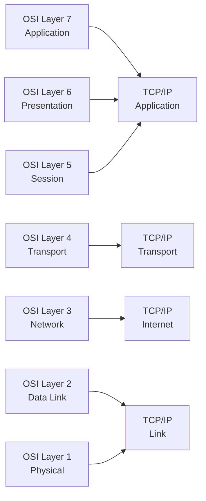

# Networking Fundamentals

Linux networking becomes easier when you understand the layers, addressing model, and packet flow. This section covers the concepts that every administrator should know before changing live network settings.

## 1.1 What is a network?

A network is a collection of devices that exchange data across physical or virtual links.

Common examples:

- A laptop connected to a home router over Wi-Fi.
- A Linux VM communicating with a database server on a private subnet.
- Containers connected through a bridge on one host.
- Multiple data centers linked through VPN tunnels.

A network has several basic components:

- Endpoints
- Interfaces
- Media
- Addresses
- Protocols
- Routing
- Services
- Security controls

## 1.2 Key networking terms

| Term | Meaning |
|---|---|
| Host | Any device on a network |
| Interface | A network attachment point such as `eth0` or `ens33` |
| MAC address | Layer 2 hardware address |
| IP address | Layer 3 logical address |
| Port | Layer 4 endpoint identifier |
| Protocol | Rules governing communication |
| Gateway | Router used to reach other networks |
| Subnet | Logical IP network segment |
| CIDR | Classless Inter-Domain Routing notation |
| MTU | Maximum Transmission Unit |
| DNS | Domain Name System |
| NAT | Network Address Translation |
| VLAN | Virtual LAN |

## 1.3 OSI model

The OSI model is a conceptual framework with seven layers.

| OSI Layer | Name | Examples | Typical Linux Relevance |
|---|---|---|---|
| 7 | Application | HTTP, SSH, DNS, SMTP | `curl`, `ssh`, `dig`, web servers |
| 6 | Presentation | TLS, encoding | OpenSSL, certificate handling |
| 5 | Session | Sessions, RPC | SSH sessions, TLS sessions |
| 4 | Transport | TCP, UDP | Ports, sockets, `ss`, `netstat` |
| 3 | Network | IPv4, IPv6, ICMP | `ip route`, routing, ping |
| 2 | Data Link | Ethernet, ARP, VLAN | `ip link`, bridges, VLAN tags |
| 1 | Physical | Cables, NICs, radio | NIC speed, duplex, link state |

### 1.3.1 Why the OSI model matters

The OSI model helps isolate problems.

Examples:

- Link down issues are often Layer 1 or 2.
- Wrong IP or missing route is Layer 3.
- Blocked port is usually Layer 4.
- Application-level error is Layer 7.

## 1.4 TCP/IP model

The TCP/IP model is more practical and commonly used in real-world networking.

| TCP/IP Layer | Maps to OSI | Examples |
|---|---|---|
| Application | OSI 5-7 | HTTP, HTTPS, SSH, DNS |
| Transport | OSI 4 | TCP, UDP |
| Internet | OSI 3 | IP, ICMP |
| Link | OSI 1-2 | Ethernet, Wi-Fi, ARP |

## 1.5 OSI vs TCP/IP Mermaid diagram



## 1.6 Encapsulation

Data is wrapped with headers as it moves down the stack.

| Layer | Unit |
|---|---|
| Application | Data |
| Transport | Segment or datagram |
| Network | Packet |
| Data Link | Frame |
| Physical | Bits |

Packet journey:

1. Application generates data.
2. TCP or UDP adds a header.
3. IP adds source and destination IPs.
4. Ethernet adds source and destination MAC addresses.
5. Bits are transmitted.

## 1.7 Ethernet basics

Ethernet is the dominant Layer 2 technology in Linux server environments.

Important ideas:

- Frames contain source and destination MAC addresses.
- Switches forward frames using MAC tables.
- Broadcast frames go to all ports in the VLAN.
- ARP resolves IPv4 addresses to MAC addresses.
- Neighbor Discovery is used for IPv6.

## 1.8 IP addressing overview

Linux supports IPv4 and IPv6.

### 1.8.1 IPv4 basics

IPv4 addresses are 32 bits.

Examples:

- `192.168.1.10`
- `10.0.0.5`
- `172.16.100.20`

IPv4 ranges commonly used:

| Range | Purpose |
|---|---|
| `10.0.0.0/8` | Private |
| `172.16.0.0/12` | Private |
| `192.168.0.0/16` | Private |
| `127.0.0.0/8` | Loopback |
| `169.254.0.0/16` | Link-local |
| `224.0.0.0/4` | Multicast |

### 1.8.2 IPv6 basics

IPv6 addresses are 128 bits.

Examples:

- `2001:db8::10`
- `fe80::1`
- `fd00::1234`

Common IPv6 ranges:

| Range | Purpose |
|---|---|
| `::1/128` | Loopback |
| `fe80::/10` | Link-local |
| `fc00::/7` | Unique local |
| `2000::/3` | Global unicast |
| `ff00::/8` | Multicast |

## 1.9 Public vs private addressing

Private IPs are not routable on the public Internet without NAT or tunneling.

Use private addresses for:

- Internal app tiers
- Kubernetes nodes
- Database backends
- Management networks

Use public addresses for:

- Internet-facing load balancers
- Public APIs
- Bastion hosts

## 1.10 Subnetting concepts

Subnetting divides an IP network into smaller logical networks.

Why subnet?

- Security separation
- Better broadcast control
- Clearer routing
- Environment isolation
- Improved IP management

### 1.10.1 Network address and broadcast address

For an IPv4 subnet:

- Network address identifies the subnet.
- Broadcast address reaches all hosts in the subnet.
- Usable host addresses lie between them.

Example:

- CIDR: `192.168.10.0/24`
- Network: `192.168.10.0`
- Broadcast: `192.168.10.255`
- Usable range: `192.168.10.1` to `192.168.10.254`

## 1.11 CIDR notation

CIDR expresses the prefix length.

Examples:

| CIDR | Subnet Mask | Total Addresses | Usable Hosts |
|---|---|---:|---:|
| `/8` | `255.0.0.0` | 16,777,216 | 16,777,214 |
| `/16` | `255.255.0.0` | 65,536 | 65,534 |
| `/24` | `255.255.255.0` | 256 | 254 |
| `/25` | `255.255.255.128` | 128 | 126 |
| `/26` | `255.255.255.192` | 64 | 62 |
| `/27` | `255.255.255.224` | 32 | 30 |
| `/28` | `255.255.255.240` | 16 | 14 |
| `/29` | `255.255.255.248` | 8 | 6 |
| `/30` | `255.255.255.252` | 4 | 2 |
| `/31` | `255.255.255.254` | 2 | point-to-point |
| `/32` | `255.255.255.255` | 1 | host route |

## 1.12 Binary view of subnetting

Example IPv4 address:

```text
192.168.1.10 = 11000000.10101000.00000001.00001010
```

Example `/24` mask:

```text
255.255.255.0 = 11111111.11111111.11111111.00000000
```

The `1` bits represent the network portion.

## 1.13 Subnetting examples

### 1.13.1 Split a `/24` into two `/25` subnets

Original network:

- `192.168.1.0/24`

Resulting subnets:

- `192.168.1.0/25`
- `192.168.1.128/25`

### 1.13.2 Split a `/24` into four `/26` subnets

- `192.168.1.0/26`
- `192.168.1.64/26`
- `192.168.1.128/26`
- `192.168.1.192/26`

### 1.13.3 Quick reference for common subnet sizes

| Prefix | Hosts | Typical Use |
|---|---:|---|
| `/32` | 1 | Loopback, host route |
| `/31` | 2 | Point-to-point links |
| `/30` | 2 usable | Legacy point-to-point |
| `/29` | 6 usable | Small infrastructure block |
| `/28` | 14 usable | DMZ segment |
| `/27` | 30 usable | Small server subnet |
| `/26` | 62 usable | Department network |
| `/24` | 254 usable | Standard LAN |
| `/23` | 510 usable | Larger LAN |

## 1.14 Default gateway

A host uses a default gateway when the destination is outside its local subnet.

Example:

- Host: `192.168.1.10/24`
- Gateway: `192.168.1.1`

If the host sends traffic to `8.8.8.8`, it forwards it to the gateway.

## 1.15 Routing basics

Routers make forwarding decisions using routing tables.

Linux also maintains routing tables.

Common route types:

- Connected routes
- Static routes
- Dynamic routes
- Default routes
- Host routes

Example routing table logic:

1. Look for the most specific match.
2. Use longest prefix match.
3. Forward through the chosen interface and next hop.

## 1.16 ARP and Neighbor Discovery

### 1.16.1 ARP for IPv4

ARP maps IP addresses to MAC addresses.

Example workflow:

1. Host wants to reach `192.168.1.20`.
2. Host broadcasts an ARP request.
3. Target replies with its MAC address.
4. Host caches the result.

Useful commands:

```bash
ip neigh show
arp -n
```

### 1.16.2 Neighbor Discovery for IPv6

IPv6 uses ICMPv6 Neighbor Discovery instead of ARP.

Functions include:

- Neighbor solicitation
- Neighbor advertisement
- Router solicitation
- Router advertisement

## 1.17 TCP vs UDP

| Feature | TCP | UDP |
|---|---|---|
| Connection-oriented | Yes | No |
| Reliability | Yes | No built-in reliability |
| Ordering | Yes | No guaranteed ordering |
| Overhead | Higher | Lower |
| Typical Uses | SSH, HTTPS, SMTP | DNS, VoIP, streaming, DHCP |

### 1.17.1 TCP characteristics

TCP provides:

- Three-way handshake
- Sequencing
- Retransmission
- Flow control
- Congestion control

### 1.17.2 UDP characteristics

UDP provides:

- Low latency
- Low overhead
- No connection state
- Best-effort delivery

## 1.18 TCP three-way handshake

```text
Client -> SYN -> Server
Client <- SYN-ACK <- Server
Client -> ACK -> Server
```

Termination usually uses FIN and ACK packets.

## 1.19 Ports and sockets

A socket is an endpoint defined by IP + port + protocol.

Examples:

- `192.168.1.10:22/tcp`
- `0.0.0.0:443/tcp`
- `[::]:53/udp`

Port ranges:

| Range | Meaning |
|---|---|
| 0-1023 | Well-known |
| 1024-49151 | Registered |
| 49152-65535 | Ephemeral |

## 1.20 MTU and fragmentation

MTU defines the largest packet payload a link can carry without fragmentation.

Common MTUs:

| Medium | MTU |
|---|---:|
| Ethernet | 1500 |
| Jumbo Ethernet | 9000 |
| WireGuard default interface payload planning | varies |
| VPN overlays | often lower than 1500 |

Problems caused by wrong MTU:

- Slow connections
- Broken HTTPS
- Stalled SSH over VPN
- PMTU black holes

Useful command:

```bash
ip link show
```

## 1.21 ICMP basics

ICMP is used for control and diagnostic messages.

Examples:

- Echo request/reply used by `ping`
- Destination unreachable
- Time exceeded used by `traceroute`
- Redirect messages

Do not block all ICMP blindly. Many network features depend on it.

## 1.22 Unicast, broadcast, multicast, anycast

| Type | Description |
|---|---|
| Unicast | One sender to one receiver |
| Broadcast | One sender to all hosts in a broadcast domain |
| Multicast | One sender to a subscribed group |
| Anycast | One address served by multiple nodes, nearest one responds |

## 1.23 Half-duplex vs full-duplex

Modern Ethernet usually runs full-duplex.

Mismatch symptoms:

- Packet loss
- Late collisions
- Very poor throughput

## 1.24 DNS, DHCP, NAT at a glance

| Service | Purpose |
|---|---|
| DNS | Resolves names to addresses |
| DHCP | Automatically assigns network settings |
| NAT | Translates addresses between networks |

## 1.25 Linux interface naming

Common interface names on modern systems:

- `lo`
- `eth0`
- `ens160`
- `enp0s3`
- `wlan0`
- `bond0`
- `br0`
- `vlan10`
- `wg0`
- `tun0`

Predictable interface naming often uses forms like `ens33` or `enp1s0`.

## 1.26 Loopback interface

The loopback interface `lo` is used for local host communication.

Important addresses:

- IPv4: `127.0.0.1`
- IPv6: `::1`

Use cases:

- Local service binding
- Internal health checks
- Development environments

## 1.27 Linux networking philosophy

Linux treats networking objects as modular building blocks.

Examples:

- Interfaces
- Addresses
- Routes
- Rules
- Namespaces
- Bridges
- VLANs
- Tunnels
- Firewall chains

This makes Linux extremely flexible for:

- Servers
- Routers
- Firewalls
- VPN gateways
- Container hosts
- Virtualization platforms

## 1.28 Quick command map for fundamentals

| Goal | Command |
|---|---|
| Show IP addresses | `ip addr` |
| Show links | `ip link` |
| Show routes | `ip route` |
| Show neighbors | `ip neigh` |
| Show sockets | `ss -tulpen` |
| Test reachability | `ping` |
| Query DNS | `dig` |

## 1.29 Fundamental best practices

- Use `ip` over legacy tools when possible.
- Document subnet allocations.
- Avoid overlapping address spaces.
- Use consistent naming for VLANs and interfaces.
- Prefer key-based SSH authentication.
- Keep DNS and time sync healthy.
- Monitor drops, errors, and retransmits.

## 1.30 Summary

Networking fundamentals provide the language for every later section in this guide. If you understand addressing, routing, layers, and packet flow, most Linux networking tasks become systematic rather than mysterious.

---

## B.1 Common well-known ports

| Service | Port | Protocol |
|---|---:|---|
| FTP data | 20 | TCP |
| FTP control | 21 | TCP |
| SSH | 22 | TCP |
| Telnet | 23 | TCP |
| SMTP | 25 | TCP |
| DNS | 53 | UDP/TCP |
| DHCP server | 67 | UDP |
| DHCP client | 68 | UDP |
| HTTP | 80 | TCP |
| POP3 | 110 | TCP |
| NTP | 123 | UDP |
| IMAP | 143 | TCP |
| SNMP | 161 | UDP |
| HTTPS | 443 | TCP |
| SMB | 445 | TCP |
| LDAPS | 636 | TCP |
| NFS | 2049 | TCP/UDP |
| OpenVPN | 1194 | UDP by default |
| WireGuard | 51820 | UDP commonly |

## B.2 Protocol quick notes

- ICMP is crucial for diagnostics.
- TCP is reliable and connection-oriented.
- UDP is lightweight and connectionless.
- ARP is IPv4 local address resolution.
- ICMPv6 carries critical neighbor and router discovery.

---

## B.2 Protocol quick notes

- ICMP is crucial for diagnostics.
- TCP is reliable and connection-oriented.
- UDP is lightweight and connectionless.
- ARP is IPv4 local address resolution.
- ICMPv6 carries critical neighbor and router discovery.

---

## D.1 General networking checklist

- [ ] Use predictable interface naming and documentation.
- [ ] Use private addressing plans consistently.
- [ ] Avoid overlapping subnets.
- [ ] Use static IPs for servers and infrastructure nodes.
- [ ] Keep DNS records accurate.
- [ ] Monitor link errors and drops.
- [ ] Validate MTU across overlays and VPNs.

---

## E.3 Production network design reminders

- Separate management, application, storage, and backup networks when justified.
- Keep routing simple unless policy routing is truly needed.
- Standardize on a firewall framework per environment.
- Avoid mixing many persistence methods on the same host.
- Keep diagrams, subnets, and DNS names synchronized.

---

## E.12 IPv6 reminders

- Use `ping -6`, `traceroute -6`, `dig AAAA`, and `ip -6 route`.
- Do not assume disabling IPv4 firewall protects IPv6 traffic.
- Router advertisements may affect addressing and routes.
- Neighbor Discovery replaces ARP.
