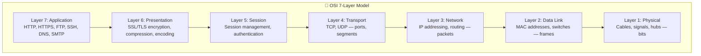
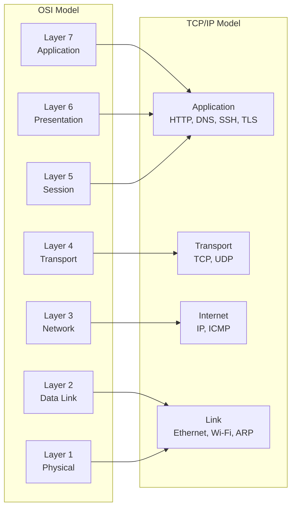

# OSI and TCP/IP

← Back to [01-fundamentals.md](./01-fundamentals.md)

The layered mental model behind networking and how TCP/IP maps to OSI.

---

## 1. OSI Model — Visual Layer-by-Layer

### 📸 OSI Model Layers

> *Source: Wikimedia Commons — OSI 7-layer reference model*

The OSI model is a teaching model, not a protocol suite you configure directly.
Its value is that it gives you a disciplined way to ask: **what job is this layer responsible for, and what information is visible there?**

### 1.1 Quick layer summary

| Layer | Name | Main job | PDU | Example devices |
|---|---|---|---|---|
| 7 | Application | User-facing network services and protocols | Data | Browsers, web servers, mail servers, DNS software |
| 6 | Presentation | Format translation, encryption, compression | Data | TLS libraries, API gateways, proxies |
| 5 | Session | Dialog setup, continuity, checkpoints | Data | Session managers, RPC runtimes, auth brokers |
| 4 | Transport | End-to-end ports, reliability, multiplexing | Segment or datagram | Stateful firewalls, load balancers, hosts |
| 3 | Network | Logical addressing and routing | Packet | Routers, L3 switches, hosts |
| 2 | Data Link | Local delivery on the current link | Frame | Switches, bridges, NICs, access points |
| 1 | Physical | Signals on the medium | Bits | Cables, fiber, radio, transceivers, hubs |

### 1.1 Layer 7: Application

#### What happens at this layer

- The application layer is where protocols expose business meaning to software and users.
- A browser creates an HTTP request.
- A mail server speaks SMTP.
- A resolver sends DNS queries.
- An SSH client negotiates an interactive remote shell.

#### Protocol Data Unit

- PDU name: **Data**

#### Key protocols

- HTTP
- HTTPS
- DNS
- SSH
- SMTP
- FTP
- IMAP
- LDAP

#### Real-world analogy

- A customer placing a specific order at a service desk.

#### Devices that operate here

- Browsers
- Web servers
- DNS servers
- Mail servers
- Proxy applications

#### Useful Linux observation commands

- `curl -I https://example.com`
- `dig example.com`
- `ssh user@host`

#### Practical example

- When you click a link, the browser builds an HTTP request with headers, cookies, and method semantics.

### 1.2 Layer 6: Presentation

#### What happens at this layer

- The presentation layer transforms data into a form both sides can understand.
- It handles encryption, serialization, character encoding, and compression concerns.
- In real networks, TLS often feels like the most visible presentation-layer function.
- JSON, Protobuf, ASN.1, image encoding, and gzip all fit the mental model here.

#### Protocol Data Unit

- PDU name: **Data**

#### Key protocols

- TLS
- SSL historical
- gzip
- MIME
- UTF-8 encoding

#### Real-world analogy

- Translating a message into a common language and sealing it in a locked envelope.

#### Devices that operate here

- TLS terminators
- Reverse proxies
- API gateways
- Application runtimes

#### Useful Linux observation commands

- `openssl s_client -connect example.com:443`
- `curl --compressed https://example.com`

#### Practical example

- During HTTPS, the HTTP payload is encrypted before the wire sees it, so intermediaries can route packets but not read the application content.

### 1.3 Layer 5: Session

#### What happens at this layer

- The session layer tracks the conversation over time.
- It manages when a dialog begins, whether it stays authenticated, and how it resumes after interruptions.
- Modern stacks often blur session responsibilities into the application or transport layer.
- Still, the concept is useful for thinking about login continuity, RPC sessions, and negotiated dialogues.

#### Protocol Data Unit

- PDU name: **Data**

#### Key protocols

- NetBIOS session service
- RPC
- SMB session setup
- TLS sessions
- Application auth tokens

#### Real-world analogy

- Checking in at a hotel and keeping the same reservation active during your stay.

#### Devices that operate here

- App servers
- Auth systems
- Session stores
- Remote desktop brokers

#### Useful Linux observation commands

- `ss -tanp`
- `journalctl -u sshd`
- `klist`

#### Practical example

- A user logs into a web application and keeps a valid session cookie while making multiple requests.

### 1.4 Layer 4: Transport

#### What happens at this layer

- The transport layer provides end-to-end delivery between processes, not just hosts.
- Ports identify which application should receive the data.
- TCP adds sequence numbers, acknowledgments, retransmissions, and flow control.
- UDP sends datagrams without building reliability into the transport itself.

#### Protocol Data Unit

- PDU name: **Segment for TCP, datagram for UDP**

#### Key protocols

- TCP
- UDP
- QUIC conceptually rides UDP but provides transport features

#### Real-world analogy

- A courier service that tracks package order and delivery confirmations, or a postcard service with no confirmation at all.

#### Devices that operate here

- Hosts
- Stateful firewalls
- Load balancers
- L4 proxies

#### Useful Linux observation commands

- `ss -tulpen`
- `netstat -tulpen`
- `tcpdump -ni any tcp`

#### Practical example

- A server can listen on TCP port 443 and UDP port 443 at the same time because protocol plus port plus address define the socket context.

### 1.5 Layer 3: Network

#### What happens at this layer

- The network layer gives hosts logical addresses and decides which next hop gets the packet closer to the destination.
- IP headers carry source and destination IP addresses, TTL, protocol numbers, and fragmentation metadata.
- Routers operate here by inspecting destination IP addresses and consulting routing tables.
- This is where subnets, default gateways, and longest-prefix-match matter.

#### Protocol Data Unit

- PDU name: **Packet**

#### Key protocols

- IPv4
- IPv6
- ICMP
- IPsec

#### Real-world analogy

- A postal system reading city and street information to send mail toward the right destination region.

#### Devices that operate here

- Routers
- L3 switches
- Hosts with routing tables
- VPN gateways

#### Useful Linux observation commands

- `ip route`
- `ip -6 route`
- `ping`
- `traceroute`
- `tracepath`

#### Practical example

- A laptop sees that 93.184.216.34 is not on the local subnet, so it sends the packet to its default gateway.

### 1.6 Layer 2: Data Link

#### What happens at this layer

- The data link layer handles local delivery on a specific network segment.
- Ethernet frames carry source and destination MAC addresses.
- Switches learn which MAC addresses live behind which ports and forward frames accordingly.
- ARP and IPv6 Neighbor Discovery help map Layer 3 addresses to Layer 2 identifiers on the local link.

#### Protocol Data Unit

- PDU name: **Frame**

#### Key protocols

- Ethernet
- Wi-Fi MAC
- ARP
- 802.1Q VLAN

#### Real-world analogy

- A building mailroom delivering envelopes to the correct office suite on the current floor.

#### Devices that operate here

- Switches
- Bridges
- NICs
- Wireless access points

#### Useful Linux observation commands

- `ip link`
- `ip neigh`
- `ethtool eth0`
- `tcpdump -eni any`

#### Practical example

- Before a host can send to the router, it must know the router interface MAC address and wrap the IP packet in an Ethernet frame.

### 1.7 Layer 1: Physical

#### What happens at this layer

- The physical layer is the actual transmission of bits as voltage changes, light pulses, or radio waves.
- It includes cable quality, signal strength, transceivers, duplex mode, speed negotiation, and link state.
- If the link is physically down, higher layers never get a chance to work.
- Many mysterious application failures begin as physical problems that show up first as drops, flaps, or CRC errors.

#### Protocol Data Unit

- PDU name: **Bits**

#### Key protocols

- 1000BASE-T
- 10GBASE-SR
- 802.11 PHY families

#### Real-world analogy

- The road pavement and electrical power that let any delivery vehicle move at all.

#### Devices that operate here

- Cables
- SFP modules
- Patch panels
- Hubs
- NIC PHYs
- Wireless radios

#### Useful Linux observation commands

- `ip link show`
- `ethtool eth0`
- `dmesg | grep -i link`

#### Practical example

- A duplex mismatch may create collisions and terrible throughput even though IP addresses and routes are configured correctly.

### 1.8 Why layers matter in troubleshooting

- If `ip link` shows the interface is down, do not start by changing DNS.
- If ARP fails, TCP cannot connect even if the server is healthy.
- If TCP connects but the browser still shows an error, the problem may be TLS or HTTP.
- If DNS resolves incorrectly, packet capture at the TCP layer may look fine while the application still reaches the wrong server.
- A clean troubleshooting habit is to identify the lowest layer that is definitely working, then move one layer higher.

---

## Section 2
## 2. TCP/IP Model vs OSI — Side-by-Side Visual

The TCP/IP model is what operating systems and protocol stacks actually implement most directly.
The OSI model is still useful because it gives more descriptive names to the kinds of work happening inside the stack.

### 2.1 Mapping table

| OSI layer | TCP/IP layer | What you usually touch on Linux |
|---|---|---|
| Application + Presentation + Session | Application | `curl`, `dig`, `ssh`, NGINX, Apache, TLS settings, app auth |
| Transport | Transport | `ss`, socket listeners, firewall port rules, retransmissions |
| Network | Internet | `ip addr`, `ip route`, `ping`, `traceroute`, policy routing |
| Data Link + Physical | Link | `ip link`, `ethtool`, bridges, VLANs, MAC addresses, ARP |

### 2.2 Why two models exist

- OSI was designed as a layered reference framework for understanding interoperable networking.
- TCP/IP emerged from the protocols that won in practice on real networks and later the Internet.
- Engineers still say "Layer 3 problem" or "Layer 7 issue" because OSI labels are concise and intuitive.
- When you read Linux documentation, you will often see the practical TCP/IP stack mixed with OSI terminology.

### 2.3 A mental shortcut

- If the question is **which application protocol is this?**, think Application.
- If the question is **which process and which port?**, think Transport.
- If the question is **which IP and which route?**, think Internet or Network.
- If the question is **which NIC, MAC, switch port, or wireless link?**, think Link or Data Link.
- If the question is **is the cable or radio path good?**, think Physical.

### 2.4 Real-world example

A user says: "The website is down."
That single symptom can map to very different layers:

- The cable to the server NIC is loose.
- The default gateway is wrong.
- TCP port 443 is blocked by a firewall rule.
- The TLS certificate is expired.
- The HTTP application returns a 500 error.

This is why layered thinking prevents random guessing.

### 2.5 Commands by model

| Question | Layer focus | Practical commands |
|---|---|---|
| Can I resolve the hostname? | Application | `dig`, `resolvectl query`, `getent hosts` |
| Can I reach the port? | Transport | `ss`, `nc -vz`, `tcpdump` |
| Can I reach the network? | Internet | `ip route get`, `ping`, `tracepath` |
| Do I know the next-hop MAC? | Link | `ip neigh`, `arp -n`, `tcpdump -e arp` |
| Is the interface physically healthy? | Physical | `ip link`, `ethtool`, interface counters |

---
