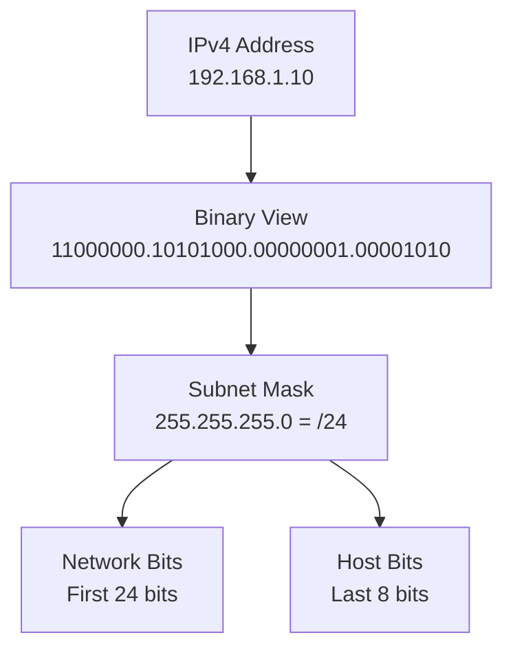
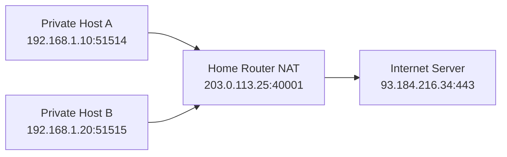
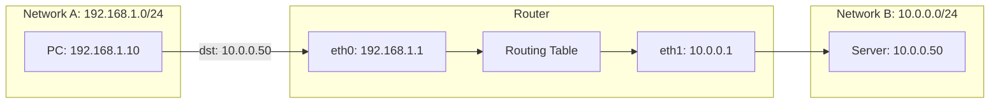
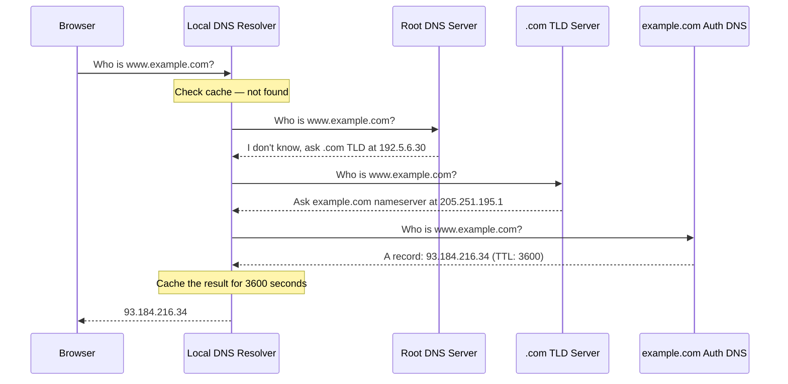
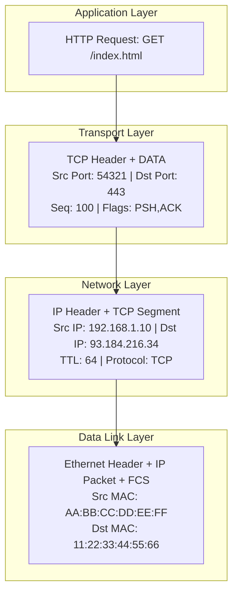

# IP Addressing

← Back to [01-fundamentals.md](./01-fundamentals.md)

IPv4, IPv6, subnetting, CIDR, and packet encapsulation basics.

---

## 8. IP Addressing — Visual Explanation
<a id="section-8"></a>





An IP address identifies a host interface in a logical network, but the prefix length tells you which part is network and which part is host.

### 8.1 IPv4 structure

### 📸 IP Packet Structure

> *Source: Wikimedia Commons — IPv4 packet header format*

```text
192.168.1.10
11000000.10101000.00000001.00001010
```

IPv4 addresses are 32 bits long.
Human-friendly dotted-decimal notation groups the bits into four octets.

### 8.2 Subnet mask visual

```text
255.255.255.0  =  11111111.11111111.11111111.00000000
                 |----------- network -----------| host |
```

A `/24` prefix means the first 24 bits are the network portion.
The remaining 8 bits identify hosts inside that network.

### 8.3 CIDR notation explained

- `192.168.1.10/24` means the interface address is `192.168.1.10` and the network prefix length is 24 bits.
- `10.0.0.0/8` means the network portion is the first 8 bits.
- `172.16.32.0/20` means the first 20 bits are network and the remaining 12 bits are host bits.
- CIDR replaced rigid classful addressing and allows flexible subnet sizing.

### 8.4 Common prefix sizes

| CIDR | Mask | Total addresses | Typical use |
|---|---|---:|---|
| /8 | 255.0.0.0 | 16,777,216 | Very large private or routed block |
| /16 | 255.255.0.0 | 65,536 | Large private segment design |
| /24 | 255.255.255.0 | 256 | Typical LAN subnet |
| /25 | 255.255.255.128 | 128 | Split a /24 in two |
| /26 | 255.255.255.192 | 64 | Small server subnet |
| /30 | 255.255.255.252 | 4 | Legacy point-to-point link |
| /32 | 255.255.255.255 | 1 | Single host route |

### 8.5 Network, broadcast, and usable hosts

- In classic IPv4 subnetting, the all-zero host value is the network address.
- The all-ones host value is the broadcast address.
- Usable hosts live in between, except for special cases like `/31` point-to-point addressing.
- Example: `192.168.1.0/24` gives network `192.168.1.0`, broadcast `192.168.1.255`, and usable hosts `192.168.1.1` to `192.168.1.254`.

### 8.6 Private IPv4 ranges (RFC 1918)

| Range | CIDR | Use |
|---|---|---|
| 10.0.0.0 - 10.255.255.255 | 10.0.0.0/8 | Large private addressing space |
| 172.16.0.0 - 172.31.255.255 | 172.16.0.0/12 | Medium private addressing space |
| 192.168.0.0 - 192.168.255.255 | 192.168.0.0/16 | Home and small office networks |

### 8.7 Other important IPv4 ranges

- `127.0.0.0/8` is loopback.
- `169.254.0.0/16` is link-local auto-configuration.
- `224.0.0.0/4` is multicast.
- `0.0.0.0` can mean unspecified address or default route context depending on usage.

### 8.8 NAT and PAT explained

- NAT changes IP addresses between address domains, often private to public.
- PAT, often called overload or many-to-one NAT, also rewrites source ports so many clients can share one public IP.
- Example: `192.168.1.10:51514` becomes `203.0.113.25:40001` on the Internet-facing side.
- Return traffic is mapped back using the translation table.

### 8.9 Commands to inspect addressing

- `ip addr`
- `ip route`
- `ip route get 8.8.8.8`
- `hostname -I`
- `nmcli device show`

### 8.10 Practical examples

- A laptop at `192.168.1.50/24` and a printer at `192.168.1.60/24` are on the same subnet, so they can communicate directly after ARP resolution.
- A host at `192.168.1.50/24` reaching `10.0.0.20` must send to a router because the destination is outside the local prefix.
- Two overlapping private subnets across a VPN create confusion because routing cannot uniquely identify the remote side without translation or redesign.

### 8.11 IPv6 note

- IPv6 uses 128-bit addresses, usually written in hexadecimal.
- A common LAN prefix is `/64`.
- IPv6 does not use ARP; it uses Neighbor Discovery over ICMPv6.
- NAT is not a design requirement in IPv6 the way it is in many IPv4 deployments.

---

## Section 9
## 9. How Routing Works — Visual
<a id="section-9"></a>



Routing is the process of choosing the next hop that gets a packet closer to its destination.

### 9.1 Step-by-step forwarding decision

1. The PC wants to reach `10.0.0.50`.
2. The PC compares the destination with its own subnet `192.168.1.0/24`.
3. Because `10.0.0.50` is not local, the PC sends the packet to its default gateway `192.168.1.1`.
4. The router receives the packet on `eth0`.
5. The router strips the incoming Layer 2 header and examines the destination IP.
6. The router searches its routing table for the longest matching prefix.
7. It finds that `10.0.0.0/24` is directly connected to `eth1`.
8. The router creates a new outgoing frame on `eth1` and forwards the packet toward the server.

### 9.2 Example routing table

```text
Destination        Gateway        Interface   Notes
192.168.1.0/24     connected      eth0        Local LAN
10.0.0.0/24        connected      eth1        Server LAN
0.0.0.0/0          203.0.113.1    wan0        Default route to ISP
```

### 9.3 Longest-prefix match

- Routers do not just pick the first route.
- They pick the most specific matching prefix.
- A `/24` is more specific than `/16`.
- A `/32` host route is more specific than both.
- This is why precise routes override broad defaults.

### 9.4 What changes on a routed hop

- The source and destination MAC addresses are rewritten for the new local link.
- The destination IP address stays the same unless NAT is applied.
- The TTL decreases by one.
- The IP checksum is updated accordingly in IPv4.

### 9.5 Commands to inspect routing

- `ip route`
- `ip route get 10.0.0.50`
- `ip rule show`
- `traceroute 10.0.0.50`
- `tracepath 10.0.0.50`

### 9.6 Real-world examples

- If a host has the wrong default gateway, it can talk locally but not reach remote networks.
- If two routes overlap, the most specific route wins.
- If a cloud route table lacks a path back to your subnet, the forward packet may arrive while the reply never returns.

---

## Section 10
## 10. DNS Resolution — Step by Step Visual
<a id="section-10"></a>



DNS turns names into resource records so applications can reach services without hardcoding IP addresses.

### 10.1 Recursive lookup story

1. The browser needs the IP for `www.example.com`.
2. It asks the local stub resolver, usually via the OS resolver library.
3. The local resolver forwards the query to a recursive resolver such as your ISP resolver, enterprise resolver, or public DNS service.
4. If the recursive resolver has no cached answer, it starts an iterative resolution process.
5. It asks a root server where `.com` information lives.
6. The root server responds with a referral to the `.com` TLD nameservers.
7. The resolver asks a `.com` TLD server where `example.com` is authoritative.
8. The TLD server responds with the authoritative nameserver details.
9. The resolver asks the authoritative nameserver for the `A` record of `www.example.com`.
10. The authoritative server responds with the IP address and TTL.
11. The recursive resolver caches the result for the TTL period.
12. The answer is returned to the browser so the next network phase can begin.

### 10.2 Common record types

| Record | Meaning | Example use |
|---|---|---|
| A | IPv4 address record | `example.com -> 93.184.216.34` |
| AAAA | IPv6 address record | `example.com -> 2606:2800:220:1:248:1893:25c8:1946` |
| CNAME | Alias to another name | `www -> app-lb.example.net` |
| MX | Mail exchange server | Mail delivery routing |
| NS | Authoritative nameserver | Delegation for a zone |
| TXT | Arbitrary text metadata | SPF, domain verification |

### 10.3 Why DNS problems feel random

- Caching means different clients can see different answers at the same time.
- Split-horizon DNS can intentionally return different answers inside and outside a network.
- A stale resolver cache can make a service appear down on one host and healthy on another.
- IPv6 and IPv4 responses may differ, so one protocol family can work while the other fails.

### 10.4 Commands to observe DNS

- `dig www.example.com`
- `dig @8.8.8.8 www.example.com`
- `dig +trace www.example.com`
- `resolvectl status`
- `resolvectl query www.example.com`
- `sudo tcpdump -ni any port 53`

### 10.5 Wireshark filters

- `dns`
- `dns.flags.response == 0` for queries
- `dns.flags.response == 1` for replies
- `udp.port == 53 or tcp.port == 53`

### 10.6 Real-world examples

- A website may be healthy at its IP, but if DNS points to an old load balancer, users still cannot reach it.
- A typo in an `A` record can break only one subdomain while the rest of the zone works.
- A missing AAAA record can cause IPv6-only clients to fail while IPv4 clients succeed.

---

## Section 11
## 11. Packet Encapsulation — How Data Gets Wrapped
<a id="section-11"></a>

### 📸 Data Encapsulation

> *Source: Wikimedia Commons — Protocol data unit encapsulation*



Encapsulation is the process of wrapping higher-layer data with lower-layer headers as it moves down the stack.

### 11.1 From app data to wire format

1. The application creates data, such as an HTTP request.
2. TCP adds source port, destination port, sequence numbers, flags, and checksum information.
3. IP adds source IP, destination IP, TTL, fragmentation-related fields, and protocol identifier.
4. Ethernet adds source MAC, destination MAC, EtherType, and frame check information.
5. The NIC sends the resulting bits over copper, fiber, or radio.

### 11.2 Decapsulation on the receiving side

1. The NIC receives bits and reconstructs a frame.
2. The Ethernet layer validates local delivery and hands the payload upward.
3. The IP layer checks the destination IP and protocol field.
4. The TCP layer reorders segments, verifies checksums, and places bytes into the receive buffer.
5. The application reads the original data stream.

### 11.3 Why encapsulation matters

- Different layers can solve different problems independently.
- A switch can forward a frame without understanding HTTP.
- A router can route a packet without understanding TLS payload contents.
- An application can read HTTP headers without knowing the exact switch port the frame crossed.

### 11.4 Commands to observe encapsulation

- `sudo tcpdump -ni any -e -vv host 93.184.216.34`
- `sudo tcpdump -ni any -XX port 443`
- `wireshark and expand Ethernet, IP, and TCP layers in packet details`
- `ss -tanp`

### 11.5 Real-world example

- An HTTP request can be perfectly formed at Layer 7 and still fail if the host never learns the next-hop MAC address at Layer 2.
- A packet capture that includes Ethernet headers can prove whether the host is talking to the right gateway even before you inspect the IP payload.

---
