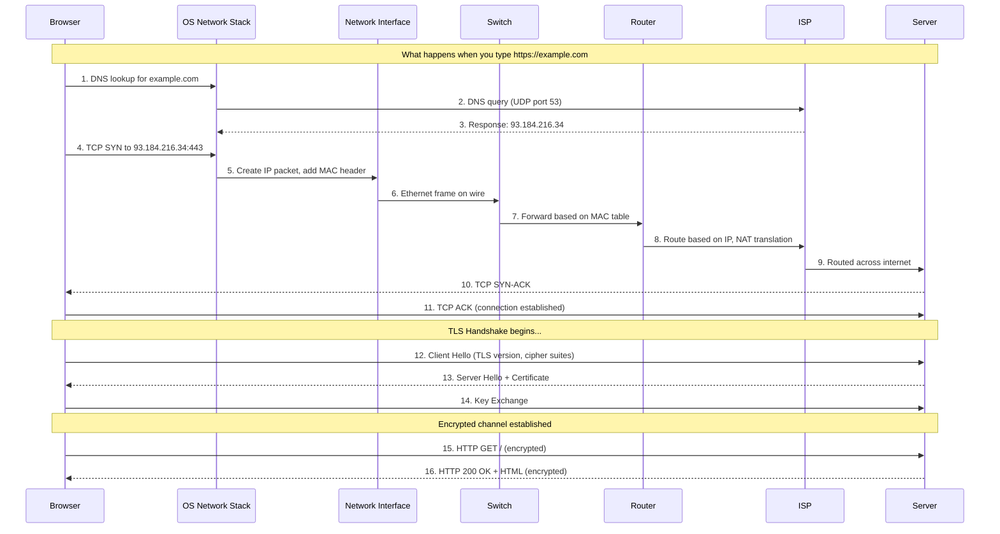
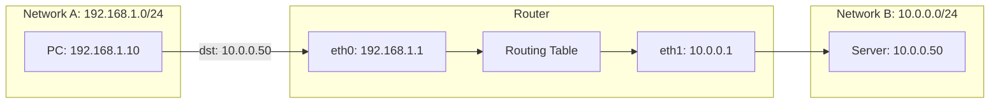
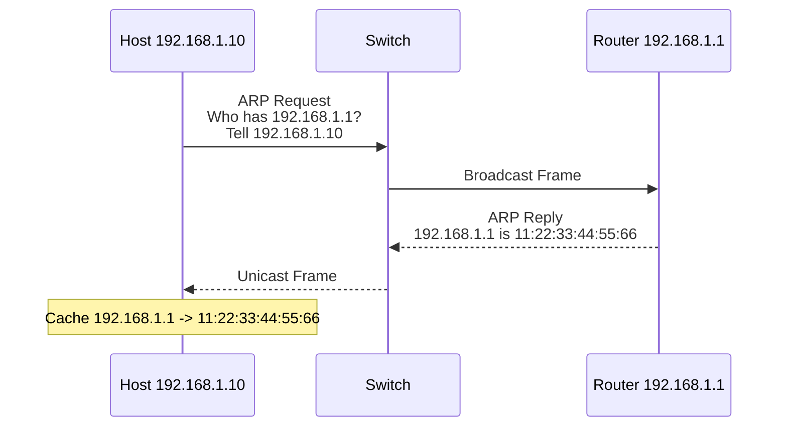

# Routing and Switching

← Back to [01-fundamentals.md](./01-fundamentals.md)

How packets move, how routes are chosen, and how ARP resolves local next hops.

---

## 3. How Data Travels Through the Network — Step by Step
<a id="section-3"></a>



Typing a URL triggers far more than a single packet.
The browser, the operating system, the LAN, the router, the ISP, and the destination service all do different jobs in sequence.

### 3.1 Expanded end-to-end walkthrough

1. You type `https://example.com` into the browser address bar.
2. The browser parses the scheme, hostname, optional port, and path.
3. Because the scheme is HTTPS, the browser expects TCP plus TLS and usually destination port 443.
4. The browser checks whether it already has a valid connection in its connection pool.
5. If not, the OS resolver path is used to turn `example.com` into an IP address.
6. The resolver checks the browser cache, OS cache, and local DNS cache.
7. If the answer is not cached, a DNS query is sent to a configured recursive resolver.
8. That DNS query is usually UDP to port 53, although large answers or retries can use TCP.
9. The recursive resolver may consult root, TLD, and authoritative servers, then returns an answer.
10. Now the client knows the destination IP address, for example `93.184.216.34`.
11. The OS checks the local routing table to decide whether that destination is on-link or remote.
12. Because the destination is remote, the host chooses its default gateway as the next hop.
13. To send a frame to the gateway, the host needs the gateway MAC address.
14. If the MAC is not cached, the host performs ARP on IPv4 or Neighbor Discovery on IPv6.
15. Once the gateway MAC is known, the client can build an Ethernet frame.
16. Inside that frame is an IP packet.
17. Inside that IP packet is a TCP segment containing a SYN.
18. The SYN leaves the NIC and enters the switch.
19. The switch reads the destination MAC address and forwards the frame toward the router port.
20. The router strips the Layer 2 header because the incoming Ethernet frame is only valid on that local segment.
21. The router inspects the destination IP address and consults its routing table.
22. If the packet is going to the Internet from a private LAN, the router may also perform source NAT.
23. The router then rewrites the Layer 2 header for the next link and forwards the packet onward.
24. Across the Internet, many routers repeat that same Layer 3 decision and Layer 2 rewrite cycle hop by hop.
25. Eventually the server receives the SYN and replies with SYN-ACK.
26. The client sends the final ACK, so the TCP connection is established.
27. Now the TLS handshake begins to authenticate the server and negotiate encryption keys.
28. The client sends a ClientHello that advertises versions, extensions, SNI, and cipher capabilities.
29. The server replies with ServerHello, certificate data, and key agreement parameters.
30. The client validates the certificate chain and hostname.
31. If validation succeeds, both sides derive shared traffic keys.
32. The HTTP request can now travel inside the encrypted TLS record stream.
33. The server decrypts the request, processes the application logic, and builds a response.
34. The HTTP response is encrypted, segmented by TCP, packetized by IP, framed on each local link, and returned hop by hop.
35. The browser decrypts the response, parses HTML, and then often repeats the process for CSS, JavaScript, images, and API calls.

### 3.2 What changes and what stays the same

- The **source and destination MAC addresses** change on every Layer 2 hop.
- The **source and destination IP addresses** usually stay the same end to end, unless NAT changes them.
- The **TCP source and destination ports** stay associated with the flow, unless a NAT device rewrites them.
- The **TTL or Hop Limit** decreases at each routed hop.
- The **payload** remains the application data after decryption context is applied at the endpoint.

### 3.3 What the browser sees versus what the wire sees

| Viewpoint | What it cares about | Example |
|---|---|---|
| Browser | URL, cookies, headers, TLS validity, content | `GET / HTTP/1.1` |
| Operating system | Sockets, routes, DNS, neighbor entries, retransmissions | ephemeral port `53124` to `93.184.216.34:443` |
| Switch | Source and destination MAC addresses on the current VLAN | forward out port 12 |
| Router | Destination IP and next hop decision | default route to ISP |
| Server | TCP state, TLS session, HTTP request | send `200 OK` |

### 3.4 Useful commands to observe the journey

- `dig example.com`
- `resolvectl query example.com`
- `ip route get 93.184.216.34`
- `ip neigh show`
- `ss -tanp | grep :443`
- `sudo tcpdump -ni any host 93.184.216.34`
- `sudo tcpdump -ni any port 53 or port 443`
- `traceroute example.com`
- `curl -vk https://example.com/`

### 3.5 Wireshark filters for the same flow

- `dns`
- `tcp.port == 443`
- `ip.addr == 93.184.216.34`
- `tls.handshake.type == 1` for ClientHello
- `http` for unencrypted HTTP only
- `tcp.flags.syn == 1 && tcp.flags.ack == 0` for initial SYN packets

### 3.6 Real-world example

- A slow website may not be a slow server; it might be delayed DNS, repeated SYN retransmissions, or packet loss during TLS handshake.
- A website reachable from mobile data but not from office Wi-Fi often points to local DNS, firewall, MTU, or proxy policy differences.
- If only the first page loads but images fail, look for extra hostnames, CDNs, mixed IPv4/IPv6 behavior, or blocked domains.

---

## 9. How Routing Works — Visual
<a id="section-9"></a>



Routing is the process of choosing the next hop that gets a packet closer to its destination.

### 9.1 Step-by-step forwarding decision

1. The PC wants to reach `10.0.0.50`.
2. The PC compares the destination with its own subnet `192.168.1.0/24`.
3. Because `10.0.0.50` is not local, the PC sends the packet to its default gateway `192.168.1.1`.
4. The router receives the packet on `eth0`.
5. The router strips the incoming Layer 2 header and examines the destination IP.
6. The router searches its routing table for the longest matching prefix.
7. It finds that `10.0.0.0/24` is directly connected to `eth1`.
8. The router creates a new outgoing frame on `eth1` and forwards the packet toward the server.

### 9.2 Example routing table

```text
Destination        Gateway        Interface   Notes
192.168.1.0/24     connected      eth0        Local LAN
10.0.0.0/24        connected      eth1        Server LAN
0.0.0.0/0          203.0.113.1    wan0        Default route to ISP
```

### 9.3 Longest-prefix match

- Routers do not just pick the first route.
- They pick the most specific matching prefix.
- A `/24` is more specific than `/16`.
- A `/32` host route is more specific than both.
- This is why precise routes override broad defaults.

### 9.4 What changes on a routed hop

- The source and destination MAC addresses are rewritten for the new local link.
- The destination IP address stays the same unless NAT is applied.
- The TTL decreases by one.
- The IP checksum is updated accordingly in IPv4.

### 9.5 Commands to inspect routing

- `ip route`
- `ip route get 10.0.0.50`
- `ip rule show`
- `traceroute 10.0.0.50`
- `tracepath 10.0.0.50`

### 9.6 Real-world examples

- If a host has the wrong default gateway, it can talk locally but not reach remote networks.
- If two routes overlap, the most specific route wins.
- If a cloud route table lacks a path back to your subnet, the forward packet may arrive while the reply never returns.

---

## 12. ARP — How MAC Addresses Are Resolved
<a id="section-12"></a>



ARP is used on IPv4 local networks to map an IP address to a MAC address.

### 12.1 Why ARP is necessary

- IP decides the destination host or next hop logically.
- Ethernet still needs a destination MAC address to deliver the frame on the local segment.
- ARP fills that gap for IPv4 networks.

### 12.2 ARP request and reply flow

1. The sender decides the target is local or identifies the default gateway as the next hop.
2. If the MAC is not in the ARP cache, the sender broadcasts an ARP request.
3. All hosts on the local broadcast domain receive the request.
4. Only the device owning the target IP replies with its MAC address.
5. The sender stores the mapping in its ARP or neighbor cache for reuse.
6. The original IP packet can now be wrapped in an Ethernet frame and sent.

### 12.3 Important ARP concepts

- ARP works only on the local Layer 2 segment.
- A host does not ARP for a remote Internet server; it ARPs for the local gateway.
- ARP caches age out over time and are refreshed when needed.
- ARP spoofing can redirect traffic by lying about MAC ownership, which is why secure switching features matter in some environments.

### 12.4 Commands to observe ARP

- `ip neigh show`
- `arp -n`
- `sudo tcpdump -ni any arp`
- `ip monitor neigh`

### 12.5 Wireshark filters

- `arp`
- `arp.opcode == 1` for request
- `arp.opcode == 2` for reply

### 12.6 Real-world examples

- If a host can ping itself and its interface is up but it cannot reach the gateway, missing or wrong ARP entries are a strong clue.
- If two devices claim the same IP, ARP instability can create intermittent connectivity and duplicate-address warnings.

---
