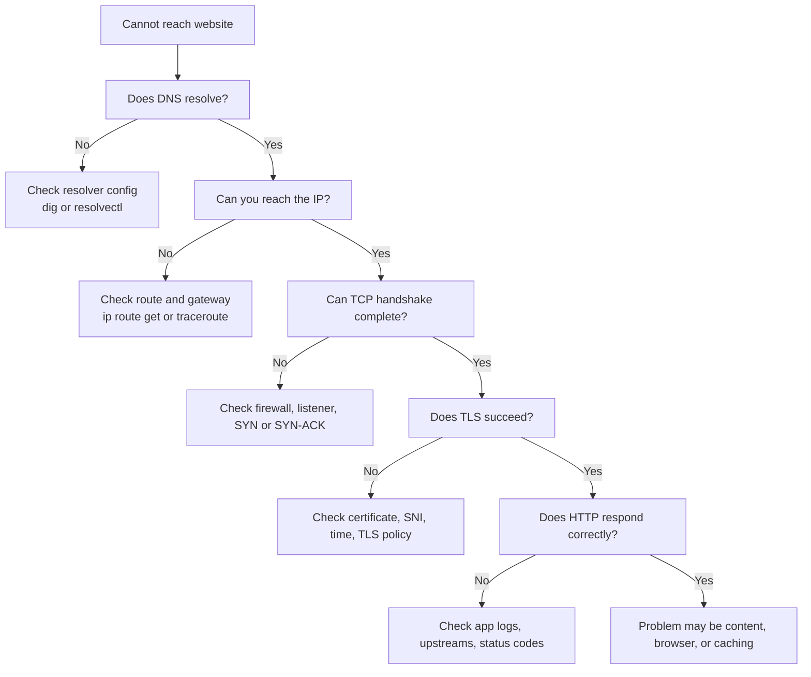

# Network Tools

← Back to [01-fundamentals.md](./01-fundamentals.md)

Layered troubleshooting tools, packet observation workflows, and practical command sets.

---

## 13. Network Troubleshooting Flow

Troubleshooting improves dramatically when you test one layer at a time instead of changing many things at once.

### 13.1 Layered decision process

1. Confirm the user symptom precisely: timeout, name error, certificate warning, connection refused, or bad content.
2. Test DNS resolution.
3. Test basic IP reachability and route selection.
4. Test Layer 2 adjacency and gateway reachability if the destination is remote.
5. Test TCP handshake or UDP reachability.
6. Test TLS negotiation if the service is encrypted.
7. Test the application protocol itself with a tool like `curl`.
8. Correlate with server-side logs and packet captures if needed.

### 13.2 Common symptom map

| Symptom | Likely layer focus | First commands |
|---|---|---|
| `Name or service not known` | DNS / Application | `dig`, `resolvectl query` |
| `No route to host` | Network / Routing | `ip route`, `ip route get` |
| Connection timeout | Transport / Filtering / Path | `tcpdump`, `ss`, firewall checks |
| `Connection refused` | Transport / Application listener | `ss -ltnp`, service status |
| TLS certificate error | Presentation / TLS | `openssl s_client`, system time check |
| HTTP 500 | Application | app logs, upstream logs, `curl -v` |

### 13.3 Practical command sequence

- `dig example.com`
- `ip route get 93.184.216.34`
- `ping -c 3 <gateway>`
- `traceroute 93.184.216.34`
- `ss -tanp | grep 443`
- `sudo tcpdump -ni any host 93.184.216.34`
- `openssl s_client -connect example.com:443 -servername example.com`
- `curl -vk https://example.com/`

### 13.4 Real-world examples

- If DNS fails, do not waste time looking at TCP retransmissions yet.
- If DNS succeeds but `ip route get` shows the wrong outgoing interface, fix routing first.
- If the route is right but there is no SYN-ACK, inspect firewalls, security groups, NAT, or the remote listener.
- If TLS fails after TCP succeeds, check certificates, server name indication, clock skew, and TLS version mismatch.
- If `curl` gets a 200 but the browser still fails, think browser cache, proxy policy, cookies, or JavaScript errors.

---

## Section 14
## 14. Practical Packet Observation Cookbook

This section gives you concrete commands and what to look for.

### 14.1 Watch DNS queries from this host

- Command: `sudo tcpdump -ni any port 53`
- What to look for: Look for outgoing query and matching reply.
- Why it matters: It narrows the failing layer before you change configuration.
- Real-world use: Run it during an outage and compare with a healthy host.

### 14.2 Watch SYN packets to HTTPS

- Command: `sudo tcpdump -ni any "tcp port 443 and tcp[tcpflags] & tcp-syn != 0"`
- What to look for: Look for SYN, SYN-ACK, ACK sequence.
- Why it matters: It narrows the failing layer before you change configuration.
- Real-world use: Run it during an outage and compare with a healthy host.

### 14.3 Watch ARP on the LAN

- Command: `sudo tcpdump -ni any arp`
- What to look for: Look for who-has and is-at exchange.
- Why it matters: It narrows the failing layer before you change configuration.
- Real-world use: Run it during an outage and compare with a healthy host.

### 14.4 See chosen route to a destination

- Command: `ip route get 93.184.216.34`
- What to look for: Look for selected interface, source IP, and gateway.
- Why it matters: It narrows the failing layer before you change configuration.
- Real-world use: Run it during an outage and compare with a healthy host.

### 14.5 List listening TCP ports

- Command: `ss -ltnp`
- What to look for: Confirm the service is actually listening.
- Why it matters: It narrows the failing layer before you change configuration.
- Real-world use: Run it during an outage and compare with a healthy host.

### 14.6 List listening UDP ports

- Command: `ss -lunp`
- What to look for: Confirm UDP servers such as DNS or syslog are bound.
- Why it matters: It narrows the failing layer before you change configuration.
- Real-world use: Run it during an outage and compare with a healthy host.

### 14.7 Inspect neighbor table

- Command: `ip neigh show`
- What to look for: Verify next-hop MAC entries exist and are reachable.
- Why it matters: It narrows the failing layer before you change configuration.
- Real-world use: Run it during an outage and compare with a healthy host.

### 14.8 Inspect link health

- Command: `ethtool eth0`
- What to look for: Check speed, duplex, and link detected.
- Why it matters: It narrows the failing layer before you change configuration.
- Real-world use: Run it during an outage and compare with a healthy host.

### 14.9 Check TCP retransmissions counters

- Command: `netstat -s | grep -i retrans`
- What to look for: Rising counters often correlate with loss or filtering.
- Why it matters: It narrows the failing layer before you change configuration.
- Real-world use: Run it during an outage and compare with a healthy host.

### 14.10 Trace path MTU hints

- Command: `tracepath example.com`
- What to look for: Useful for MTU black hole suspicion.
- Why it matters: It narrows the failing layer before you change configuration.
- Real-world use: Run it during an outage and compare with a healthy host.

### 14.11 View TLS certificate from the wire side

- Command: `openssl s_client -connect example.com:443 -servername example.com`
- What to look for: Inspect certificate chain and negotiated protocol.
- Why it matters: It narrows the failing layer before you change configuration.
- Real-world use: Run it during an outage and compare with a healthy host.

### 14.12 Issue a verbose HTTP request

- Command: `curl -vk https://example.com/`
- What to look for: Observe DNS, TCP, TLS, and HTTP in one tool output.
- Why it matters: It narrows the failing layer before you change configuration.
- Real-world use: Run it during an outage and compare with a healthy host.

### 14.13 Common Wireshark display filters

- Show all DNS packets: `dns`
- Show initial SYN packets: `tcp.flags.syn == 1 && tcp.flags.ack == 0`
- Show SYN-ACK packets: `tcp.flags.syn == 1 && tcp.flags.ack == 1`
- Show retransmissions: `tcp.analysis.retransmission`
- Show ARP traffic: `arp`
- Show TLS handshakes: `tls.handshake`
- Show HTTP requests: `http.request`
- Show packets to a host: `ip.addr == 93.184.216.34`
- Show ICMP errors: `icmp or icmpv6`
- Show only UDP 53: `udp.port == 53`

### 14.14 Packet capture reading checklist

- Who initiated the flow?
- Which interface saw the first packet?
- Did name resolution happen first?
- Did ARP or Neighbor Discovery complete?
- Did the handshake complete?
- Did the server reply at the TCP layer but fail later at TLS or HTTP?
- Are retransmissions or duplicate ACKs present?
- Is NAT rewriting addresses or ports?
- Does the path change when you compare healthy and unhealthy traces?

---

## Appendix B — Practical Observation Commands by Layer

### Appendix B — Application

- `curl -v http://example.com`
- `curl -vk https://example.com`
- `dig example.com`
- `ssh -vv user@host`

### Appendix B — Presentation

- `openssl s_client -connect example.com:443 -servername example.com`
- `curl --compressed https://example.com`

### Appendix B — Session

- `ss -tanp`
- `journalctl -u sshd`
- `klist`

### Appendix B — Transport

- `ss -tulpen`
- `netstat -st`
- `netstat -su`
- `tcpdump -ni any tcp or udp`

### Appendix B — Network

- `ip addr`
- `ip route`
- `ip route get 8.8.8.8`
- `ping`
- `traceroute`
- `tracepath`

### Appendix B — Data Link

- `ip link`
- `ip neigh`
- `arp -n`
- `bridge link`
- `tcpdump -eni any`

### Appendix B — Physical

- `ethtool eth0`
- `ip -s link`
- `dmesg | grep -i link`

## Appendix E — Quick Quiz Prompts

- Which layer cares about ports?
- Which addresses change at every routed hop?
- Why does a host ARP for the gateway instead of a remote server?
- What does SYN actually synchronize?
- Why can TIME_WAIT be normal?
- What is the difference between a packet and a frame?
- Why can DNS failure look like an application outage?
- What does longest-prefix match mean?
- Why can ping work while HTTPS fails?
- Why is UDP useful for real-time media?

## Appendix F — Detailed Notes by Topic

### Appendix F — Layering

- Layers let engineers separate concerns.
- Layers also help vendors build interoperable products.
- In real systems, layers can blur, but the troubleshooting value remains high.
- Every packet capture is easier to understand when you know which fields belong to which layer.
- Observation commands:
  - `tcpdump -ni any`
  - `wireshark packet details pane`

### Appendix F — Switching

- Switches learn source MAC addresses.
- Unknown unicast traffic may be flooded within the VLAN until learned.
- Broadcast traffic reaches all ports in the broadcast domain.
- VLANs split Layer 2 domains without requiring separate physical switches.
- Observation commands:
  - `bridge link`
  - `tcpdump -eni any`

### Appendix F — Routing

- Routers break broadcast domains.
- Each routed interface belongs to a different IP subnet.
- Routing tables tell a router what next hop or interface to use.
- Dynamic routing protocols exchange reachability information automatically.
- Observation commands:
  - `ip route`
  - `traceroute`

### Appendix F — TCP reliability

- ACKs confirm byte ranges, not abstract messages.
- Retransmission timers handle loss.
- Congestion control protects the network from overload.
- Receive windows protect slow receivers from being overwhelmed.
- Observation commands:
  - `ss -tan`
  - `netstat -s`
  - `tcpdump -ni any tcp`

### Appendix F — DNS behavior

- Resolvers cache answers to reduce latency and load.
- Negative responses can also be cached.
- TTL changes are not instantaneous everywhere.
- Authoritative servers answer for zones they control.
- Observation commands:
  - `dig +trace example.com`
  - `tcpdump -ni any port 53`

### Appendix F — NAT behavior

- Outbound NAT commonly rewrites the source IP.
- PAT also rewrites source ports to multiplex many flows.
- Inbound publishing requires static mappings or proxies.
- State tracking matters for returning traffic.
- Observation commands:
  - `conntrack -L`
  - `tcpdump on inside and outside interfaces`

### Appendix F — TLS basics

- TLS authenticates and encrypts.
- Certificates bind identities to public keys.
- SNI helps multi-tenant servers present the right certificate.
- Handshake failures can be caused by time skew, policy mismatch, or trust-chain errors.
- Observation commands:
  - `openssl s_client -connect host:443 -servername host`
  - `wireshark tls.handshake`

### Appendix F — MTU awareness

- A packet larger than the path MTU may be fragmented or dropped depending on settings.
- Tunnels reduce effective payload size.
- Path MTU problems often appear as stalls on larger transfers.
- Tracepath is handy because it can reveal MTU-related issues without full packet capture.
- Observation commands:
  - `tracepath host`
  - `tcpdump -ni any`

## Final Summary

- Applications create meaning.
- TCP and UDP move data between processes.
- IP moves packets between networks.
- Ethernet and Wi-Fi move frames on local links.
- DNS tells you where to go by name.
- ARP tells you how to reach the next hop locally.
- Routing chooses the path.
- TCP handshakes create reliable conversations.
- TLS protects the content.
- Packet captures reveal what actually happened.

## Appendix G — Network Reasoning Drills

Use these drills to practice thinking like the host, the switch, the router, and the server at the same time.

### G.1 Host perspective drills

1. If DNS fails, what exact destination IP is the host missing?
2. If DNS succeeds, what route will the host pick?
3. If the destination is remote, which default gateway will the host choose?
4. Does the host already know the next-hop MAC address?
5. If not, should it ARP for the remote host or for the gateway?
6. Which source IP will the host place in the outgoing packet?
7. Which source port will the host choose for the new TCP flow?
8. What TCP state should the client be in right after sending the first SYN?
9. If the host sees no SYN-ACK, is the problem guaranteed to be on the server?
10. If `ip route get` chooses the wrong interface, which layer should you fix first?
11. If the destination is local, does the host need routing or only Layer 2 resolution?
12. If the host has two default routes, which metrics influence the choice?
13. If the interface is down, can DNS, TCP, or TLS succeed?
14. If the MTU is too large, which symptoms might appear first?
15. If the host is behind NAT, which address does the application think it used versus what the Internet sees?

### G.2 Switch perspective drills

1. Which frame fields does a switch examine first?
2. Does the switch care about TCP port 443 while forwarding an Ethernet frame?
3. What happens when the destination MAC is unknown to the switch table?
4. Why can a switch forward traffic even when it has no idea what HTTP means?
5. What is flooded inside a VLAN: broadcast, unknown unicast, or both?
6. Why do MAC addresses change hop by hop while IP addresses often stay stable end to end?
7. If ARP broadcast frames are missing on a capture, what local issue might exist?
8. Which device breaks the Layer 2 broadcast domain: switch or router?
9. If two hosts are on different VLANs, can a switch alone route between them without Layer 3 logic?
10. What evidence in `tcpdump -e` tells you the frame reached the expected gateway MAC?

### G.3 Router perspective drills

1. What part of the packet does the router inspect to make a forwarding decision?
2. Why does the router discard the incoming Ethernet header and build a new one for the next hop?
3. What does longest-prefix match mean in a real routing table?
4. Why can a `/32` route override a broader `/24` route?
5. What field decreases at every routed hop and protects against loops?
6. If a packet arrives but the return route is missing, what symptom will the client likely see?
7. At what point does NAT usually rewrite source or destination addresses?
8. If NAT is also doing PAT, what else might be rewritten besides the IP address?
9. Why can the forward path and return path be different?
10. If a router has no matching route and no default route, what happens to the packet?
11. Which Linux commands show the same thinking process a router uses?
12. Why can `traceroute` reveal different hops than a simple `ping`?
13. If the router knows the route but not the next-hop MAC, what protocol helps next?
14. What happens to the IP checksum on IPv4 after TTL changes?
15. Why are cloud route tables and on-host routes both relevant in hybrid environments?

### G.4 TCP reasoning drills

1. What does SYN synchronize?
2. Why is TCP called a byte-stream protocol instead of a message protocol?
3. What does an ACK number actually mean?
4. Why can duplicate ACKs suggest loss or reordering?
5. Why does TCP need retransmission timers even if applications can retry too?
6. If the server never sends SYN-ACK, which states might you observe on the client?
7. If the client never sends the final ACK, which state might remain on the server?
8. Why is `CLOSE_WAIT` often an application bug rather than a network bug?
9. Why is `TIME_WAIT` often normal rather than dangerous?
10. How can a SYN flood consume server resources without completing real sessions?
11. If packet loss occurs after the handshake, what counters or capture clues help prove it?
12. Why can TCP recover from missing segments but UDP normally does not?
13. Why can a reset look different from a timeout during troubleshooting?
14. What is the difference between `Connection refused` and silent packet drop from the TCP perspective?
15. Why can application latency increase even when the route stays identical?

### G.5 DNS reasoning drills

1. If the browser says the site cannot be found, what is the first DNS question to test?
2. If `dig` works against `8.8.8.8` but not against the local resolver, where is the fault likely concentrated?
3. Why can one host still fail after DNS was already fixed globally?
4. What role does TTL play in rollout speed and stale answers?
5. Why can split-horizon DNS make inside and outside results differ on purpose?
6. What record type usually maps a web hostname to an IPv4 address?
7. What record type usually maps a hostname to an IPv6 address?
8. Why might a hostname resolve correctly but the browser still show a certificate error?
9. Why does `dig +trace` show more than a normal lookup?
10. What is the difference between an authoritative answer and a recursive answer?

### G.6 Practical compare-and-contrast drills

1. Compare what `curl -vk https://example.com` tells you that `ping example.com` does not.
2. Compare what `ip route get <dst>` tells you that `dig <name>` does not.
3. Compare what `ss -tanp` tells you that `ip neigh` does not.
4. Compare what `tcpdump -ni any port 53` tells you that `resolvectl query` does not.
5. Compare what `openssl s_client` tells you that a plain TCP connect test does not.
6. Compare what `tcpdump -e` tells you that a capture without Ethernet headers does not.
7. Compare what `traceroute` reveals that `ping` may hide.
8. Compare what a server log reveals that packet capture cannot decode from encrypted payloads.
9. Compare what the browser knows versus what the router knows during the same request.
10. Compare what changes at Layer 2 versus Layer 3 at every hop.

### G.7 Fast incident prompts

- Did the name resolve?
- Did the host choose the right route?
- Did ARP or Neighbor Discovery succeed?
- Did the SYN leave the source host?
- Did the SYN-ACK return?
- Did TLS complete?
- Did the application return a useful status code?
- Did NAT or firewall policy rewrite or drop the traffic?
- Did the response come back on the expected path?
- Did packet capture confirm the assumption?

### G.8 Closing mental model

- Ask what the source host knows.
- Ask what the next hop knows.
- Ask what the destination acknowledged.
- Ask which layer is the lowest confirmed working layer.
- Ask what changed between healthy and unhealthy traffic.
- Ask what evidence proves the answer instead of merely suggesting it.
