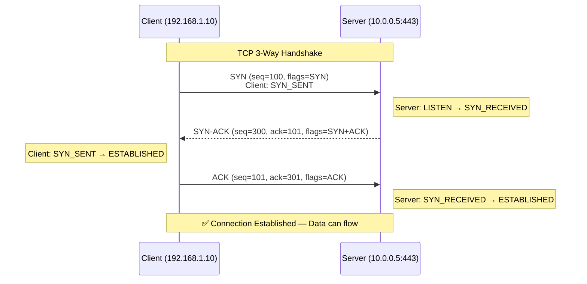
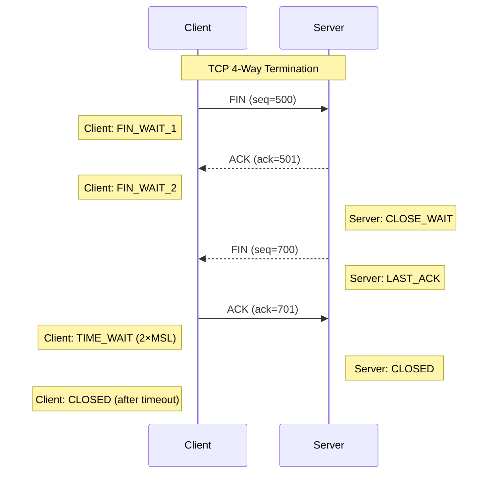
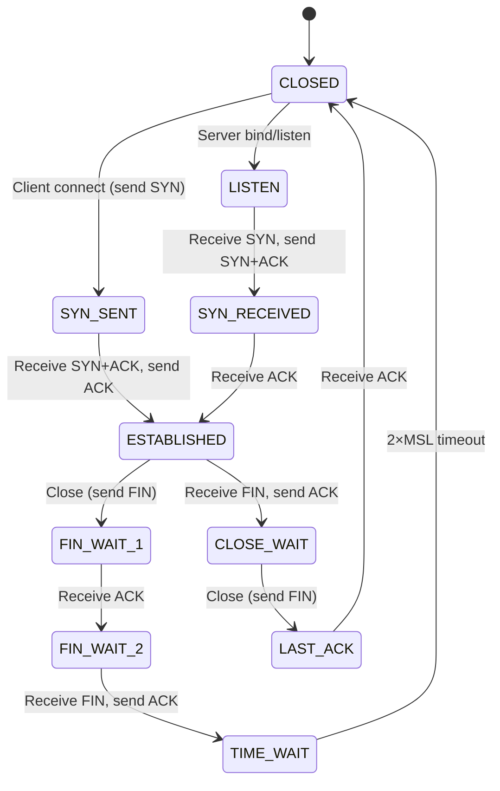
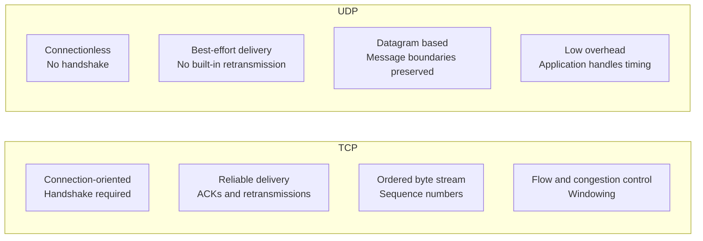
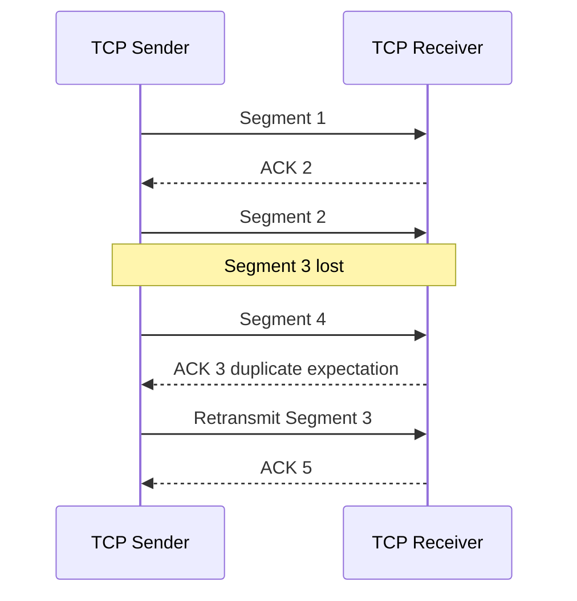
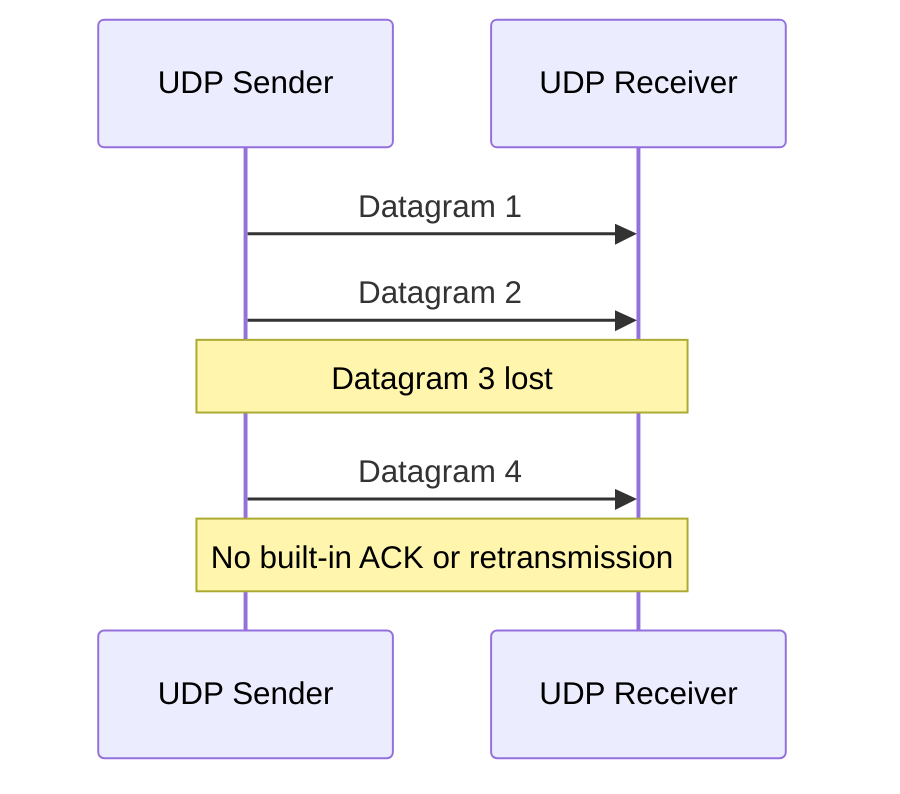

# TCP Behavior and State

← Back to [01-fundamentals.md](./01-fundamentals.md)

Handshake, teardown, connection states, and protocol comparison guidance.

---

## 4. TCP Three-Way Handshake — Detailed Visual

### 📸 TCP Three-Way Handshake — Animated

> *Source: Wikimedia Commons — TCP connection establishment*

TCP is connection-oriented, which means both sides coordinate before sending reliable application data.

### 4.1 Step 1 — SYN

- SYN means **synchronize sequence numbers**.
- The client chooses an initial sequence number, here shown as `100`.
- The segment tells the server: "I want to start a TCP conversation, and my first sequence space begins here."
- At this stage the client enters the `SYN_SENT` state.

### 4.2 Step 2 — SYN-ACK

- The server was in `LISTEN` waiting for incoming SYN packets.
- When it receives the SYN, it allocates state for the half-open connection.
- It replies with its own SYN plus an ACK.
- The ACK value is `101`, meaning "I received your SYN carrying sequence number 100, and I expect the next byte to be 101."
- The server now enters `SYN_RECEIVED`.

### 4.3 Step 3 — ACK

- The client acknowledges the server sequence number by sending `ack=301`.
- That tells the server the client successfully received the SYN-ACK.
- Once this packet arrives, both sides consider the connection established.
- Now HTTP, TLS, SSH, PostgreSQL, or any other application payload can start flowing.

### 4.4 Why sequence numbers matter

- TCP is a byte-stream protocol, not a message protocol.
- Sequence numbers let each side know where each byte fits in the stream.
- Acknowledgments tell the sender which bytes arrived successfully.
- If data is lost, the sender can retransmit the missing sequence range.
- This is how TCP restores ordered delivery over an unreliable IP network.

### 4.5 What if the SYN is lost?

- If the original SYN never reaches the server, no SYN-ACK returns.
- The client waits for a retransmission timeout.
- Then the client sends another SYN with the same connection attempt semantics.
- Repeated SYN retransmissions usually indicate filtering, path failure, packet loss, or a dead target.
- In packet capture, you will see multiple SYN packets and no completing ACK.

### 4.6 SYN flood attack explanation

- A SYN flood sends huge numbers of SYN packets, often with spoofed source addresses.
- The server allocates resources for many half-open connections stuck in `SYN_RECEIVED`.
- If the backlog fills, legitimate clients may not connect.
- Defenses include SYN cookies, rate limiting, upstream filtering, and load balancing.
- You can observe many incomplete handshakes by watching a large volume of incoming SYNs without final ACKs.

### 4.7 Commands to observe a handshake

- `sudo tcpdump -ni any "tcp port 443 and (tcp[tcpflags] & (tcp-syn|tcp-ack) != 0)"`
- `ss -tan state syn-sent`
- `ss -tan state syn-recv`
- `netstat -s | grep -i retrans`
- `curl -vk https://example.com/`

### 4.8 Wireshark filters

- `tcp.flags.syn == 1 && tcp.flags.ack == 0`
- `tcp.flags.syn == 1 && tcp.flags.ack == 1`
- `tcp.analysis.retransmission`

### 4.9 Real-world examples

- If you can ping a host but cannot connect to TCP port 443, the handshake may be blocked by a firewall or a closed port.
- If the SYN arrives and the SYN-ACK leaves but never returns to the client, the reverse path may be broken.
- If a cloud security group allows the port but the host firewall drops the SYN, captures on the VM show the packet while the application never accepts it.

---

## Section 5
## 5. TCP Connection Termination (4-Way)

A TCP close is often asymmetric because each direction of the byte stream shuts down independently.

### 5.1 Client sends FIN

- FIN means the client has no more data to send in that direction.
- The client enters `FIN_WAIT_1`.
- The other direction can still remain open until the server is ready to finish.

### 5.2 Server acknowledges FIN

- The ACK confirms the FIN was received.
- The client enters `FIN_WAIT_2`.
- The server enters `CLOSE_WAIT`, meaning it received the peer close but may still send remaining data.

### 5.3 Server sends its own FIN

- When the server application is done sending, it sends FIN.
- The server enters `LAST_ACK` and waits for the final ACK from the client.

### 5.4 Client sends final ACK

- The client acknowledges the server FIN.
- The client enters `TIME_WAIT` to absorb delayed packets and prevent confusion with future connections using similar tuples.
- After the timeout expires, the client goes to `CLOSED`.

### 5.5 Why TIME_WAIT exists

- TIME_WAIT lasts for 2×MSL, where MSL is the maximum segment lifetime.
- It protects against delayed packets from an old connection being mistaken for packets from a new one.
- It also ensures the final ACK can be retransmitted if the peer resends its FIN.
- Many short-lived connections can create many sockets in TIME_WAIT, which is normal on busy clients and proxies.

### 5.6 Commands to observe termination

- `ss -tan state fin-wait-1`
- `ss -tan state fin-wait-2`
- `ss -tan state time-wait`
- `ss -tan state close-wait`
- `sudo tcpdump -ni any "tcp[tcpflags] & (tcp-fin|tcp-ack) != 0"`

### 5.7 Real-world example

- If an application leaks sockets in `CLOSE_WAIT`, it usually means the remote side closed but the local application failed to close its file descriptor.
- If you see huge numbers of `TIME_WAIT` sockets on a client host, it may simply be making many short outbound connections.

---

## Section 6
## 6. TCP State Machine — Full Diagram

### 📸 TCP Connection States

> *Source: Wikimedia Commons — TCP finite state machine*

The TCP state machine explains why the same connection can look different on each endpoint at the same moment.

### 6.1 State-by-state meaning

| State | Meaning | Why you care |
|---|---|---|
| CLOSED | No connection exists. | Initial idle state or fully terminated connection. |
| LISTEN | Server is waiting for incoming SYN packets. | Common on daemons like NGINX, SSH, PostgreSQL. |
| SYN_SENT | Client has sent SYN and is waiting for SYN-ACK. | Useful when diagnosing outbound connect failures. |
| SYN_RECEIVED | Server got SYN and replied with SYN-ACK, waiting for final ACK. | Half-open state vulnerable to SYN flooding. |
| ESTABLISHED | Both sides can exchange data. | Normal state for active TCP sessions. |
| FIN_WAIT_1 | Local endpoint sent FIN and waits for ACK or FIN. | Beginning of active close. |
| FIN_WAIT_2 | Local FIN was acknowledged, waiting for peer FIN. | Peer may still send remaining data. |
| CLOSE_WAIT | Peer sent FIN, local side acknowledged it, app has not closed yet. | Often indicates app-side resource handling issues when persistent. |
| LAST_ACK | Local side sent FIN after being in CLOSE_WAIT and waits for final ACK. | Final stage before fully closing. |
| TIME_WAIT | Endpoint waits 2×MSL after sending the final ACK. | Common on active-closer side. |

### 6.2 Common diagnostic interpretations

- Lots of `SYN_SENT` means clients are trying to connect but not completing the handshake.
- Lots of `SYN_RECEIVED` can mean handshake pressure, packet loss, or SYN flood conditions.
- Lots of `ESTABLISHED` is expected on a busy service.
- Lots of `CLOSE_WAIT` usually means the application is not closing accepted sockets promptly after peer shutdown.
- Lots of `TIME_WAIT` is normal on connection-heavy clients and proxies, though tuning and reuse strategies require care.

### 6.3 Commands to inspect states

- `ss -tan`
- `ss -tan state established`
- `ss -tan state close-wait`
- `ss -tan state time-wait`
- `netstat -ant | less -F`
- `watch -n 1 "ss -tan state syn-recv"`

### 6.4 Real-world examples

- A reverse proxy with many backend issues may show many `SYN_SENT` sessions toward the upstream service.
- A memory-leaking application can leave connections in `CLOSE_WAIT` because user-space code forgot to close them.
- A load test client can create thousands of `TIME_WAIT` sockets after aggressively opening and closing short HTTP connections.

### 6.5 State transitions as a story

1. A server starts and listens on port 443.
2. A client initiates a connection with SYN.
3. The client briefly lives in `SYN_SENT`.
4. The server briefly lives in `SYN_RECEIVED`.
5. Both transition to `ESTABLISHED` after the third packet.
6. One side decides to close first and enters `FIN_WAIT_1`.
7. The peer acknowledges and enters `CLOSE_WAIT`.
8. After sending its own FIN, the peer enters `LAST_ACK`.
9. The active closer enters `TIME_WAIT` after acknowledging the peer FIN.
10. Eventually the connection disappears into `CLOSED`.

---

## Section 7
## 7. TCP vs UDP — Visual Comparison

TCP and UDP are both transport-layer protocols, but they make different tradeoffs.

### 7.1 Side-by-side comparison table

| Feature | TCP | UDP |
|---|---|---|
| Connection model | Connection-oriented | Connectionless |
| Reliability | Built-in acknowledgments and retransmission | Best effort only |
| Ordering | Guaranteed in-order delivery to the application stream | No ordering guarantee |
| Data model | Byte stream | Datagrams |
| Overhead | Higher | Lower |
| Latency sensitivity | Can increase with retransmission and congestion control | Good for time-sensitive workloads |
| Typical use cases | Web, SSH, databases, APIs | DNS, VoIP, streaming, telemetry, gaming |

### 7.2 Header fields that matter

| Protocol | Key header fields | Why they matter |
|---|---|---|
| TCP | Source port, destination port, sequence, acknowledgment, flags, window, checksum | Implements reliable stateful transport |
| UDP | Source port, destination port, length, checksum | Keeps the transport header small and simple |

### 7.3 When TCP is the right choice

- You need reliable delivery of all bytes.
- The application cannot tolerate missing or re-ordered data.
- You want established middleware, proxies, firewalls, and load balancers to handle the protocol easily.
- Examples include HTTPS, SSH, SMB, IMAP, PostgreSQL, and most REST APIs.

### 7.4 When UDP is the right choice

- You care more about timeliness than perfect delivery.
- The application can recover from missing datagrams or has its own reliability scheme.
- You want very low overhead and preserved message boundaries.
- Examples include DNS queries, RTP media, syslog forwarding, SNMP, and many online games.

### 7.5 Important nuance: UDP is not automatically faster

- UDP avoids connection setup and built-in retransmission, but the application may need its own reliability logic.
- QUIC rides over UDP but reintroduces reliability, encryption, and stream control in user space.
- A badly designed UDP application can perform worse than TCP on lossy networks.

### 7.6 Commands to observe TCP and UDP

- `ss -tulpen`
- `ss -uap`
- `sudo tcpdump -ni any tcp`
- `sudo tcpdump -ni any udp`
- `netstat -su`
- `netstat -st`

### 7.7 Wireshark filters

- `tcp`
- `udp`
- `dns`
- `tcp.analysis.retransmission`
- `udp.port == 53`

### 7.8 Real-world examples

- A voice call uses UDP-based media because waiting for retransmission would make speech sound choppy and late.
- An HTTPS API uses TCP because every byte of the request and response must arrive reliably and in order.
- A DNS lookup often uses UDP because the query is small and benefits from low overhead, but TCP is used when answers are too large or for zone transfers.

---
