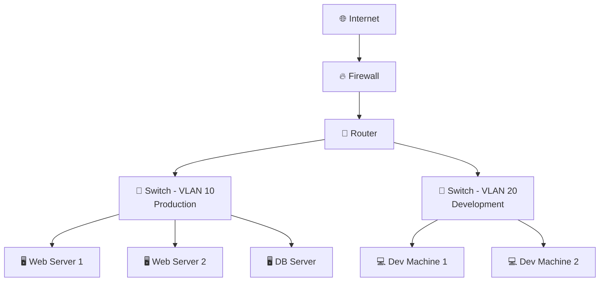

# Network Hardware

Linux administrators spend a lot of time looking at logical constructs such as addresses, routes, sockets, and firewall rules, but real production networks are built on physical or virtual devices that each have a distinct job. Knowing what the surrounding hardware is supposed to do helps you decide whether a Linux problem is local to the host or caused by switching, routing, filtering, or load-distribution behavior elsewhere in the path.

### Where these devices fit in the stack

| Device | Primary Layer | Main Job | Linux Relevance |
|---|---|---|---|
| Hub | Layer 1 | Repeat electrical signals | Rare, mostly historical |
| Switch | Layer 2 | Forward frames using MAC addresses | VLANs, trunks, loop issues |
| Router | Layer 3 | Forward packets between IP networks | Gateways, NAT, policy routing |
| Firewall | Layer 3-7 | Enforce security policy | Host firewalls, edge filtering |
| Load balancer | Layer 4 or 7 | Distribute traffic across servers | Reverse proxy, high availability |

### What is a Switch?

A switch is a Layer 2 device that forwards Ethernet frames based on destination MAC address. In a server rack, top-of-rack switches commonly connect Linux hosts, storage arrays, hypervisors, and uplinks to routers or firewalls.

#### How a switch learns

A switch builds a MAC address table, often called a CAM table, by observing the source MAC address on incoming frames.

Basic learning behavior:

1. A frame arrives on port 5 from MAC `52:54:00:aa:bb:01`.
2. The switch records that MAC on port 5.
3. When another host later sends to that MAC, the switch forwards only to port 5.
4. If the destination MAC is unknown, the switch floods the frame within the same VLAN.
5. Broadcast and many multicast frames are also flooded inside the VLAN.

Operational consequences:

- MAC learning reduces unnecessary traffic compared with hubs.
- Wrong VLAN assignment causes hosts to appear disconnected even when the link is up.
- MAC flapping usually indicates a loop, a miswired port-channel, or a VM moving between hypervisors.

#### Managed vs unmanaged switches

| Type | Characteristics | Best Fit |
|---|---|---|
| Unmanaged | Plug-and-play, fixed behavior, no VLAN or monitoring controls | Small labs, home use |
| Managed | VLANs, trunks, STP, SNMP, SPAN, QoS, ACLs, PoE visibility | Production networks |

Managed switches are preferred in business and data center environments because they let you control segmentation, observe traffic, and troubleshoot path issues without guessing.

#### VLANs on switches

A VLAN creates a separate Layer 2 broadcast domain on the same physical switch infrastructure.

Common patterns:

- Access port: carries one untagged VLAN for an endpoint.
- Trunk port: carries multiple VLANs, usually using 802.1Q tags.
- Native VLAN: untagged VLAN on a trunk. Keep it deliberate and documented.
- Voice VLAN: common on office switches for IP phones.

Example design:

- VLAN 10: production servers
- VLAN 20: development systems
- VLAN 30: storage network
- VLAN 99: switch management

On Linux, a host connected to a trunk can expose VLAN-tagged interfaces such as `eth0.10` and `eth0.20`.

```bash
sudo ip link add link eth0 name eth0.10 type vlan id 10
sudo ip addr add 10.10.10.20/24 dev eth0.10
sudo ip link set eth0.10 up
```

#### Spanning Tree Protocol (STP)

STP prevents Layer 2 loops. Without STP, redundant switch paths can create broadcast storms, MAC flapping, and total outage conditions.

What STP does:

- Elects a root bridge.
- Calculates a loop-free forwarding topology.
- Places some ports into blocking or discarding state.
- Converges after a topology change.

Operational notes:

- Rapid STP is common in modern environments.
- Edge ports toward servers are often configured with PortFast or an equivalent fast-transition feature.
- BPDU Guard is often enabled on access ports to prevent accidental switch-to-switch loops.

#### Port mirroring and SPAN

Port mirroring copies traffic from one or more switch ports or VLANs to a monitoring port. This is useful when you need packet captures without running `tcpdump` directly on the workload.

Common uses:

- IDS or NDR sensors
- Incident response captures
- Validating application flows
- Debugging packet loss or retransmissions

Be aware that oversubscribed mirror sessions can drop packets on busy links.

#### PoE

Power over Ethernet delivers electrical power over the same cable used for data.

Typical PoE-powered devices:

- Access points
- IP phones
- Cameras
- Badge readers

For Linux operators, PoE matters because a server room issue may actually be an upstream power-budget problem on the switch powering a remote device.

#### Practical: Configuring VLANs on a managed switch

The exact syntax depends on the vendor, but the workflow is similar everywhere.

Example objective:

- Port 1 uplink to router or firewall as a trunk
- Ports 2-10 in VLAN 10 for production
- Ports 11-20 in VLAN 20 for development
- Port 24 as a SPAN destination

Vendor-neutral workflow:

1. Create VLAN 10 and VLAN 20.
2. Configure port 1 as a trunk allowing VLANs 10 and 20.
3. Configure ports 2-10 as access ports in VLAN 10.
4. Configure ports 11-20 as access ports in VLAN 20.
5. Enable STP edge mode on server-facing access ports.
6. Save configuration and document the port map.

Cisco-like example:

```text
vlan 10
 name PROD
vlan 20
 name DEV
interface gi1/0/1
 switchport mode trunk
 switchport trunk allowed vlan 10,20
interface range gi1/0/2-10
 switchport mode access
 switchport access vlan 10
 spanning-tree portfast
interface range gi1/0/11-20
 switchport mode access
 switchport access vlan 20
 spanning-tree portfast
monitor session 1 source interface gi1/0/2 both
monitor session 1 destination interface gi1/0/24
```

Linux-side validation after the switch change:

```bash
ip -br link
ip -d link show eth0
bridge vlan show
ping -c 3 10.10.10.1
arp -n
```

If the Linux host loses connectivity after a VLAN change, verify these items first:

- Is the switch port access or trunk, and does it match the host expectation?
- Is the host using a plain interface or VLAN subinterface?
- Is the expected VLAN allowed on the trunk?
- Is STP temporarily blocking the port?
- Does the router or firewall have an interface in that VLAN?

### What is a Router?

A router is a Layer 3 device that forwards packets between different IP networks. In enterprise environments, the default gateway for a subnet is usually a router interface, a firewall interface, or a Layer 3 switch virtual interface.

#### Routing table and default gateway

Routers forward based on a routing table.

A route typically contains:

- Destination prefix
- Next hop or exit interface
- Metric or administrative preference
- Source of the route such as connected, static, or dynamic

Example logic:

1. A packet is destined for `203.0.113.25`.
2. The router looks for the longest prefix match.
3. If no more specific route exists, it uses the default route.
4. The router decrements TTL and forwards the packet.

For Linux hosts, the most visible router is the default gateway.

```bash
ip route
ip route get 8.8.8.8
```

#### Static vs dynamic routing

| Method | Description | Typical Use |
|---|---|---|
| Static routing | Manually defined routes | Small networks, simple paths, stub segments |
| RIP | Older distance-vector protocol | Legacy only |
| OSPF | Common interior gateway protocol | Data centers, enterprises |
| EIGRP | Cisco-centric dynamic routing | Mixed or Cisco-heavy environments |
| BGP | Inter-domain and advanced policy routing | Internet edge, cloud WAN, large-scale routing |

Dynamic routing matters to Linux operators when the surrounding network advertises prefixes to cloud edges, VPNs, or on-premises core routers. Even if Linux itself is not participating in OSPF or BGP, it is affected by convergence time and route policy.

#### NAT and PAT

Home routers usually perform NAT so many private hosts can share one public IP.

Key ideas:

- SNAT changes the source address on outbound traffic.
- DNAT changes the destination address on inbound traffic.
- PAT maps many internal sessions to one public IP by using different source ports.
- Return traffic is matched using connection tracking state.

Common outcome:

- Host `192.168.1.50` opens HTTPS to the Internet.
- The router rewrites source `192.168.1.50:52344` to `198.51.100.20:45001`.
- Replies return to the router.
- The router reverses the mapping and sends the packets back to the internal host.

#### Linux as a router

Linux can act as a router for labs, branch sites, cloud gateways, or container hosts.

Core requirements:

- At least two interfaces or routed paths
- IP forwarding enabled
- Firewall rules that allow forwarding
- NAT rules if private clients need Internet access through the Linux router

Enable forwarding temporarily:

```bash
sudo sysctl -w net.ipv4.ip_forward=1
sudo sysctl -w net.ipv6.conf.all.forwarding=1
```

Persist it:

```bash
cat <<'EOF' | sudo tee /etc/sysctl.d/99-router.conf
net.ipv4.ip_forward = 1
net.ipv6.conf.all.forwarding = 1
EOF
sudo sysctl --system
```

Minimal `nftables` router policy with masquerade:

```nft
table inet filter {
  chain forward {
    type filter hook forward priority 0;
    policy drop;
    ct state established,related accept
    iifname "ens192" oifname "ens160" accept
    iifname "ens160" oifname "ens192" ct state established,related accept
  }
}

table ip nat {
  chain postrouting {
    type nat hook postrouting priority 100;
    oifname "ens160" masquerade
  }
}
```

Equivalent `iptables` example:

```bash
sudo iptables -A FORWARD -i ens192 -o ens160 -j ACCEPT
sudo iptables -A FORWARD -i ens160 -o ens192 -m conntrack --ctstate ESTABLISHED,RELATED -j ACCEPT
sudo iptables -t nat -A POSTROUTING -o ens160 -j MASQUERADE
```

#### Practical: Setting up Linux as a router between two networks

Example topology:

- `ens160`: upstream WAN, `198.51.100.10/30`, gateway `198.51.100.9`
- `ens192`: internal LAN, `10.30.0.1/24`
- Client on LAN: `10.30.0.20/24`, gateway `10.30.0.1`

Step 1: assign addresses.

```bash
sudo ip addr add 198.51.100.10/30 dev ens160
sudo ip addr add 10.30.0.1/24 dev ens192
sudo ip link set ens160 up
sudo ip link set ens192 up
sudo ip route add default via 198.51.100.9
```

Step 2: enable forwarding.

```bash
sudo sysctl -w net.ipv4.ip_forward=1
```

Step 3: allow forwarding and NAT.

```bash
sudo nft add table inet filter
sudo nft 'add chain inet filter forward { type filter hook forward priority 0; policy drop; }'
sudo nft add rule inet filter forward ct state established,related accept
sudo nft add rule inet filter forward iifname "ens192" oifname "ens160" accept
sudo nft add table ip nat
sudo nft 'add chain ip nat postrouting { type nat hook postrouting priority 100; }'
sudo nft add rule ip nat postrouting oifname "ens160" masquerade
```

Step 4: configure the client.

```bash
sudo ip addr add 10.30.0.20/24 dev eth0
sudo ip route add default via 10.30.0.1
printf 'nameserver 1.1.1.1\n' | sudo tee /etc/resolv.conf
```

Step 5: verify end to end.

```bash
ping -c 3 10.30.0.1
ping -c 3 198.51.100.9
ping -c 3 1.1.1.1
traceroute 8.8.8.8
sudo tcpdump -ni ens160 host 1.1.1.1
```

Common failure points:

- Forwarding not enabled
- NAT missing on the outbound interface
- Forward chain default drop without allow rules
- Upstream router missing return route when NAT is not used
- Client default gateway pointing to the wrong host

### What is a Hub? (Legacy)

A hub is a Layer 1 repeater. It does not learn addresses and does not forward selectively. Every frame is repeated out every other port.

Why hubs disappeared:

- Shared collision domain
- Half-duplex operation
- Low performance
- No traffic isolation
- No VLAN support
- No security separation

If you ever see behavior that looks like every host can observe every other host's traffic, you are almost certainly dealing with a mirror port, tap, or virtualization issue rather than a real hub, because hubs are now rare in production.

### What is a Firewall?

A firewall is a policy enforcement point that allows, rejects, logs, redirects, or inspects traffic according to security rules.

#### Network vs host-based firewalls

| Type | Deployment Point | Typical Tools |
|---|---|---|
| Network firewall | At segment boundaries or Internet edge | Dedicated appliance, cloud security gateway |
| Host firewall | On the Linux system itself | `nftables`, `iptables`, `firewalld`, `ufw` |

Use both where justified:

- Network firewall for coarse segmentation and ingress control
- Host firewall for workload-specific least privilege

#### Stateful vs stateless inspection

A stateless firewall evaluates packets independently.

A stateful firewall tracks connections and can safely allow return traffic for established sessions.

Typical stateful rule concept:

```bash
sudo nft add rule inet filter input ct state established,related accept
```

Stateful inspection is the norm for modern Linux and network firewalls because it keeps policy readable and reduces the number of explicit return-path rules.

#### Next-generation firewalls

NGFW platforms may add:

- Application identification
- Intrusion prevention
- TLS inspection
- URL filtering
- User identity awareness
- Threat intelligence feeds

These capabilities are powerful but can also complicate troubleshooting because a packet may pass basic reachability tests while still being blocked by application-layer policy.

#### Linux as a firewall

A Linux host can be a perfectly capable firewall for servers, virtual appliances, or cloud routers.

Minimal example using `nftables`:

```nft
table inet filter {
  chain input {
    type filter hook input priority 0;
    policy drop;
    iifname "lo" accept
    ct state established,related accept
    tcp dport { 22, 443 } accept
    ip protocol icmp accept
    ip6 nexthdr ipv6-icmp accept
  }
}
```

Operational guidance:

- Keep an out-of-band path before tightening rules.
- Allow loopback and established traffic first.
- Treat IPv6 as first-class, not optional.
- Persist rules and verify after reboot.

### What is a Load Balancer?

A load balancer distributes requests across multiple backend servers so one failed or overloaded host does not take down the service.

#### Layer 4 vs Layer 7 load balancing

| Type | Decision Based On | Common Tools | Typical Use |
|---|---|---|---|
| Layer 4 | IP, port, TCP or UDP metadata | HAProxy TCP mode, Nginx stream | Databases, raw TCP services, TLS pass-through |
| Layer 7 | HTTP host, path, headers, cookies | HAProxy HTTP mode, Nginx, cloud ALB | Web apps, APIs, path-based routing |

#### Common algorithms

| Algorithm | Behavior | Good Fit |
|---|---|---|
| Round-robin | Sends requests in order | Similar backends |
| Least connections | Chooses backend with fewest active sessions | Uneven request durations |
| IP hash | Same client IP tends to hit same backend | Simple persistence |
| Weighted round-robin | Higher-capacity nodes receive more traffic | Mixed server sizes |

#### Health checks

A load balancer is only useful if it stops sending traffic to unhealthy targets.

Health checks may test:

- TCP connect only
- HTTP status code
- Specific path such as `/healthz`
- TLS handshake success
- Custom scripts or agent responses

Good health checks are:

- Fast
- Deterministic
- Representative of real service state
- Not dependent on fragile downstream systems unless required

#### Session persistence

Some applications still require a client to return to the same backend.

Sticky-session methods include:

- Source IP hash
- Load balancer cookie
- Application cookie
- Consistent hashing

Use persistence only when the application cannot be made stateless, because it reduces scheduling flexibility.

### Typical network topology



### Infrastructure troubleshooting checklist

When a Linux server loses network connectivity, ask these questions in order:

1. Is the physical or virtual link up?
2. Is the switch port in the correct VLAN?
3. Is the MAC address learning on the expected port?
4. Does the host have the correct IP and subnet?
5. Is the default gateway reachable?
6. Is a firewall dropping the traffic?
7. Is a load balancer or NAT device rewriting the flow in an unexpected way?
8. Is the return path symmetric?

---

## E.29 Bare metal networking caveats

On physical servers, also validate:

- Switch port mode
- LLDP data if available
- Bond member cabling
- STP state
- Optics compatibility
- NIC firmware or driver
