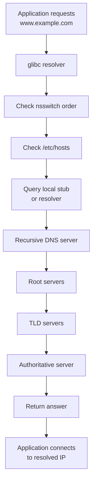

# DNS

DNS is one of the most critical services in Linux networking. Many “network problems” are actually DNS problems.

## 3.1 What DNS does

DNS translates names into data such as:

- A records for IPv4
- AAAA records for IPv6
- CNAME aliases
- MX mail routing
- TXT metadata
- NS delegation
- PTR reverse lookup
- SRV service discovery

## 3.2 Name resolution components on Linux

Important files and services:

- `/etc/resolv.conf`
- `/etc/hosts`
- `/etc/nsswitch.conf`
- `systemd-resolved`
- Local caching resolvers
- Recursive resolvers
- Authoritative DNS servers

## 3.3 `/etc/resolv.conf`

This file defines resolver behavior for many programs.

Common entries:

```conf
nameserver 1.1.1.1
nameserver 8.8.8.8
search example.com corp.example.com
options timeout:2 attempts:3 rotate
```

### 3.3.1 Key directives

| Directive | Meaning |
|---|---|
| `nameserver` | DNS server to query |
| `search` | Suffixes appended to short names |
| `domain` | Default local domain |
| `options` | Resolver behavior tuning |

### 3.3.2 Common caveat

`/etc/resolv.conf` may be managed automatically by:

- NetworkManager
- `systemd-resolved`
- DHCP client scripts
- Cloud-init

Always verify ownership before editing.

## 3.4 `/etc/hosts`

This file provides static name-to-address mappings.

Example:

```conf
127.0.0.1   localhost
192.168.10.20   web01 web01.example.com
192.168.10.21   db01 db01.example.com
```

Use `/etc/hosts` for:

- Bootstrap during DNS outages
- Small lab environments
- Local testing

Avoid relying on it for large-scale dynamic infrastructure.

## 3.5 `/etc/nsswitch.conf`

This file controls lookup order.

Typical example:

```conf
hosts: files dns myhostname
```

Meaning:

1. Check `/etc/hosts`
2. Query DNS
3. Use local hostname plugin if applicable

## 3.6 DNS resolution flow Mermaid diagram



## 3.7 `dig`

`dig` is the preferred DNS query tool.

### 3.7.1 Query A record

```bash
dig example.com
```

### 3.7.2 Query specific server

```bash
dig @1.1.1.1 example.com
```

### 3.7.3 Query record type

```bash
dig example.com MX
dig example.com AAAA
dig -x 8.8.8.8
```

### 3.7.4 Short output

```bash
dig +short example.com
```

### 3.7.5 Trace delegation

```bash
dig +trace example.com
```

## 3.8 `nslookup`

Still widely used, though `dig` is usually more detailed.

Examples:

```bash
nslookup example.com
nslookup example.com 8.8.8.8
```

## 3.9 `host`

Simple and concise DNS lookup tool.

Examples:

```bash
host example.com
host 8.8.8.8
host -t MX example.com
```

## 3.10 Resolver testing workflow

Check in this order:

1. `/etc/nsswitch.conf`
2. `/etc/hosts`
3. `/etc/resolv.conf`
4. Stub resolver service status
5. DNS server reachability
6. Authoritative answer correctness

## 3.11 `systemd-resolved`

Many modern distributions use `systemd-resolved`.

Useful commands:

```bash
systemctl status systemd-resolved
resolvectl status
resolvectl query example.com
```

### 3.11.1 Stub resolver behavior

`/etc/resolv.conf` may point to:

```text
127.0.0.53
```

This is the local stub resolver provided by `systemd-resolved`.

### 3.11.2 Flush DNS cache

```bash
sudo resolvectl flush-caches
```

## 3.12 Common DNS record types

| Record | Purpose | Example |
|---|---|---|
| A | IPv4 address | `web.example.com -> 192.0.2.10` |
| AAAA | IPv6 address | `web.example.com -> 2001:db8::10` |
| CNAME | Alias | `www -> web` |
| MX | Mail exchange | `10 mail.example.com` |
| NS | Name server | `ns1.example.com` |
| PTR | Reverse mapping | `10.2.0.192.in-addr.arpa` |
| TXT | Arbitrary text | SPF, DKIM, verification |
| SRV | Service discovery | `_ldap._tcp.example.com` |

## 3.13 Forward vs reverse DNS

Forward DNS:

- Name to IP

Reverse DNS:

- IP to name

Reverse lookups are commonly important for:

- Mail servers
- Logs
- Monitoring
- Identity checks

## 3.14 Search domains and short names

If `search example.com` is configured, querying `web01` may expand to `web01.example.com`.

This can be convenient but can also cause confusing delays or misresolutions in multi-domain environments.

## 3.15 Split DNS

Split DNS returns different answers depending on client location or view.

Examples:

- Internal users get `10.0.0.10`
- External users get `203.0.113.10`

Useful for:

- Internal load balancers
- Hybrid cloud
- VPN users

## 3.16 Caching and TTL

TTL defines how long a response may be cached.

Short TTL:

- Easier failover
- Higher query load

Long TTL:

- Better cache efficiency
- Slower propagation of changes

## 3.17 Diagnosing DNS failures

Symptoms:

- `ping 8.8.8.8` works but `ping example.com` fails
- Package manager cannot resolve mirrors
- SSH by hostname fails but SSH by IP works

Commands:

```bash
getent hosts example.com
dig example.com
resolvectl query example.com
cat /etc/resolv.conf
cat /etc/nsswitch.conf
```

## 3.18 BIND overview

BIND is a common DNS server implementation.

Packages often include:

- `bind`
- `bind9`
- `named`
- `bind-utils`

## 3.19 BIND configuration files

Typical paths vary by distro.

Common files:

- `/etc/named.conf`
- `/etc/bind/named.conf`
- `/etc/bind/named.conf.options`
- `/etc/bind/named.conf.local`
- Zone files under `/var/named/` or `/etc/bind/`

## 3.20 Minimal BIND caching resolver example

Example excerpt:

```conf
options {
    directory "/var/named";
    recursion yes;
    allow-query { any; };
    listen-on port 53 { 127.0.0.1; 192.168.10.53; };
    forwarders {
        1.1.1.1;
        8.8.8.8;
    };
    dnssec-validation auto;
};
```

## 3.21 BIND authoritative zone example

Zone declaration:

```conf
zone "example.com" IN {
    type master;
    file "example.com.zone";
};
```

Zone file example:

```dns
$TTL 3600
@   IN  SOA ns1.example.com. admin.example.com. (
        2024010101
        3600
        900
        604800
        86400 )
    IN  NS  ns1.example.com.
ns1 IN  A   192.168.10.53
www IN  A   192.168.10.20
api IN  A   192.168.10.30
mail IN A   192.168.10.40
@   IN  MX  10 mail.example.com.
```

## 3.22 Validate BIND configuration

```bash
sudo named-checkconf
sudo named-checkzone example.com /var/named/example.com.zone
```

## 3.23 Start and enable BIND

```bash
sudo systemctl enable --now named
sudo systemctl status named
```

or on Debian/Ubuntu:

```bash
sudo systemctl enable --now bind9
sudo systemctl status bind9
```

## 3.24 DNS over UDP and TCP

DNS commonly uses UDP/53.

It can also use TCP/53 for:

- Zone transfers
- Large responses
- Fallback when truncation occurs

## 3.25 EDNS and larger responses

Modern DNS often relies on EDNS to handle larger payloads.

Watch for:

- Firewalls dropping fragmented DNS
- Misbehaving middleboxes
- MTU issues on VPNs

## 3.26 `/etc/hosts` vs DNS

| Feature | `/etc/hosts` | DNS |
|---|---|---|
| Scale | Very small | Large-scale |
| Central management | No | Yes |
| Dynamic updates | Manual | Possible |
| Reverse lookup | Manual and limited | Standardized |
| Good for bootstrap | Yes | Yes |

## 3.27 `getent` is your friend

`getent` respects NSS configuration.

Examples:

```bash
getent hosts example.com
getent ahosts example.com
getent passwd root
```

This is often better than assuming a program uses raw DNS directly.

## 3.28 DNS security basics

- Restrict recursion on public resolvers.
- Use DNSSEC validation where appropriate.
- Limit zone transfer access.
- Avoid open resolvers.
- Log query rates and anomalies.

## 3.29 Common DNS issues

- Stale cache
- Wrong search domain
- Missing PTR record
- Broken `resolv.conf` symlink
- Stub resolver failure
- Split DNS mismatch
- Firewall blocking port 53 UDP or TCP
- Incorrect zone serial

<a id="dns-deep-dive"></a>
## 🌐 DNS Deep Dive

The earlier DNS section covered the Linux resolver path and core query tools. This deep dive focuses on operating DNS infrastructure safely: authoritative zones, recursive resolvers, forward and reverse records, validation commands, and BIND9 examples that are complete enough to use in a lab or adapt for production.

### Recursive vs authoritative DNS

A recursive resolver answers client questions by walking the DNS hierarchy or by using cache. An authoritative server answers for zones it hosts directly.

Production guidance:

- Keep public authoritative servers separate from internal recursive resolvers.
- Restrict recursion to trusted networks.
- Allow zone transfers only to approved secondaries.
- Use different views or separate servers if internal and external answers differ.

### DNS record types with real examples

| Type | Purpose | Realistic Example | Notes |
|---|---|---|---|
| `A` | IPv4 host record | `app1.corp.example.internal. IN A 10.20.30.21` | Most common internal service record |
| `AAAA` | IPv6 host record | `app1.corp.example.internal. IN AAAA 2001:db8:20:30::21` | Publish only if the service really works on IPv6 |
| `CNAME` | Alias to another name | `grafana.corp.example.internal. IN CNAME app-lb.corp.example.internal.` | Alias target must resolve to another name, not an IP |
| `MX` | Mail exchange | `example.com. IN MX 10 mail1.example.com.` | Mail systems often depend on matching PTR and HELO identity |
| `NS` | Nameserver delegation | `corp.example.internal. IN NS ns1.corp.example.internal.` | Zone apex needs authoritative NS records |
| `PTR` | Reverse lookup | `21.30.20.10.in-addr.arpa. IN PTR app1.corp.example.internal.` | Useful for logs, mail, and identity tooling |
| `TXT` | Free-form text | `example.com. IN TXT "v=spf1 mx -all"` | Also used for domain verification and DKIM |
| `SRV` | Service location | `_kerberos._tcp.corp.example.internal. IN SRV 0 5 88 dc1.corp.example.internal.` | Common in AD, SIP, and service discovery |
| `CAA` | Certificate authority authorization | `example.com. IN CAA 0 issue "letsencrypt.org"` | Limits which CA may issue certs |
| `SOA` | Zone authority metadata | `corp.example.internal. IN SOA ns1.corp.example.internal. dnsadmin.example.com. ...` | One per zone; serial is critical |

### BIND9 package installation

Debian and Ubuntu:

```bash
sudo apt update
sudo apt install -y bind9 bind9-utils dnsutils
```

RHEL, Rocky, AlmaLinux, or CentOS Stream:

```bash
sudo dnf install -y bind bind-utils
```

Useful service names:

- Debian or Ubuntu: `named` or `bind9` depending on packaging
- RHEL family: `named`

### Important BIND9 paths

| Purpose | Debian or Ubuntu | RHEL family |
|---|---|---|
| Main config | `/etc/bind/named.conf` | `/etc/named.conf` |
| Local zones include | `/etc/bind/named.conf.local` | commonly inline in `/etc/named.conf` |
| Options include | `/etc/bind/named.conf.options` | commonly inline in `/etc/named.conf` |
| Zone files | `/etc/bind/` or `/var/cache/bind/` | `/var/named/` |
| Service account | `bind` | `named` |

### Secure recursive resolver example

The following BIND9 options file creates an internal recursive resolver for clients on `10.20.30.0/24` and `10.20.40.0/24`.

`/etc/bind/named.conf.options`:

```conf
options {
    directory "/var/cache/bind";

    listen-on port 53 { 127.0.0.1; 10.20.30.53; };
    listen-on-v6 { ::1; 2001:db8:20:30::53; };

    allow-query { localhost; 10.20.30.0/24; 10.20.40.0/24; 2001:db8:20:30::/64; };
    allow-recursion { localhost; 10.20.30.0/24; 10.20.40.0/24; 2001:db8:20:30::/64; };
    allow-query-cache { localhost; 10.20.30.0/24; 10.20.40.0/24; 2001:db8:20:30::/64; };
    recursion yes;

    dnssec-validation auto;
    auth-nxdomain no;
    minimal-responses yes;
};
```

If this resolver is internal only, also restrict the host firewall:

```bash
sudo nft add rule inet filter input ip saddr 10.20.30.0/24 udp dport 53 accept
sudo nft add rule inet filter input ip saddr 10.20.30.0/24 tcp dport 53 accept
sudo nft add rule inet filter input ip saddr 10.20.40.0/24 udp dport 53 accept
sudo nft add rule inet filter input ip saddr 10.20.40.0/24 tcp dport 53 accept
```

### Authoritative BIND9 setup for an internal zone

Example objective:

- Zone: `corp.example.internal`
- Primary DNS server: `10.20.30.53`
- Secondary DNS server: `10.20.30.54`
- Forward zone file: `/etc/bind/db.corp.example.internal`
- Reverse zone file: `/etc/bind/db.10.20.30`

Zone declarations in `/etc/bind/named.conf.local`:

```conf
zone "corp.example.internal" {
    type master;
    file "/etc/bind/db.corp.example.internal";
    allow-transfer { 10.20.30.54; };
    also-notify { 10.20.30.54; };
};

zone "30.20.10.in-addr.arpa" {
    type master;
    file "/etc/bind/db.10.20.30";
    allow-transfer { 10.20.30.54; };
    also-notify { 10.20.30.54; };
};
```

### Forward zone file example

`/etc/bind/db.corp.example.internal`:

```zone
$TTL 300
@   IN  SOA ns1.corp.example.internal. dnsadmin.example.com. (
        2026060201 ; serial
        3600       ; refresh
        900        ; retry
        1209600    ; expire
        300        ; negative cache TTL
)
    IN  NS  ns1.corp.example.internal.
    IN  NS  ns2.corp.example.internal.

ns1         IN  A       10.20.30.53
ns2         IN  A       10.20.30.54
router1     IN  A       10.20.30.1
fw1         IN  A       10.20.30.2
lb1         IN  A       10.20.30.20
lb2         IN  A       10.20.30.22
app1        IN  A       10.20.30.21
app2        IN  A       10.20.30.23
db1         IN  A       10.20.30.31
vpn1        IN  A       10.20.30.41
monitor1    IN  A       10.20.30.51

app-lb      IN  A       10.20.30.20
api         IN  CNAME   app-lb
grafana     IN  CNAME   monitor1

mail        IN  A       10.20.30.61
@           IN  MX 10   mail.corp.example.internal.
@           IN  TXT     "v=spf1 mx -all"

_ldap._tcp          IN SRV 0 10 389 dc1.corp.example.internal.
_kerberos._tcp      IN SRV 0 10 88 dc1.corp.example.internal.
dc1                 IN A   10.20.30.71
```

Notes on the zone file:

- Use a short TTL such as 300 during migrations.
- Increase TTL after the environment stabilizes.
- Increment the serial on every change.
- Keep nameserver glue records accurate.

### Reverse zone file example

`/etc/bind/db.10.20.30`:

```zone
$TTL 300
@   IN  SOA ns1.corp.example.internal. dnsadmin.example.com. (
        2026060201 ; serial
        3600
        900
        1209600
        300
)
    IN  NS  ns1.corp.example.internal.
    IN  NS  ns2.corp.example.internal.

1    IN PTR router1.corp.example.internal.
2    IN PTR fw1.corp.example.internal.
20   IN PTR app-lb.corp.example.internal.
21   IN PTR app1.corp.example.internal.
22   IN PTR lb2.corp.example.internal.
23   IN PTR app2.corp.example.internal.
31   IN PTR db1.corp.example.internal.
41   IN PTR vpn1.corp.example.internal.
51   IN PTR monitor1.corp.example.internal.
53   IN PTR ns1.corp.example.internal.
54   IN PTR ns2.corp.example.internal.
61   IN PTR mail.corp.example.internal.
71   IN PTR dc1.corp.example.internal.
```

### Forward and reverse zone design guidance

Forward zones answer name-to-IP questions. Reverse zones answer IP-to-name questions.

Use reverse zones when:

- Mail systems validate sender identity
- SIEM platforms present IPs and hostnames together
- SSH logs or audit tools need readable identity
- Legacy software performs reverse lookups before allowing access

Do not assume reverse lookup alone proves identity. PTR records are metadata, not authentication.

### BIND9 validation workflow

Always validate before restarting the service.

Validate overall configuration:

```bash
sudo named-checkconf
```

Validate the forward zone:

```bash
sudo named-checkzone corp.example.internal /etc/bind/db.corp.example.internal
```

Validate the reverse zone:

```bash
sudo named-checkzone 30.20.10.in-addr.arpa /etc/bind/db.10.20.30
```

Inspect syntax problems and logs:

```bash
sudo journalctl -u named -xe
sudo journalctl -u bind9 -xe
```

### Start and enable BIND9

```bash
sudo systemctl enable --now named
sudo systemctl status named
```

On Debian or Ubuntu, if the unit is named `bind9`:

```bash
sudo systemctl enable --now bind9
sudo systemctl status bind9
```

### Verify authoritative answers

Query the local server directly:

```bash
dig @10.20.30.53 corp.example.internal SOA +noall +answer
dig @10.20.30.53 app1.corp.example.internal A +noall +answer
dig @10.20.30.53 -x 10.20.30.21 +noall +answer
```

Check whether recursion is enabled when expected:

```bash
dig @10.20.30.53 github.com A
```

If the server should be authoritative only, that query should fail or refuse rather than recursively answer.

### Secondary DNS server example

On the secondary, define slave zones.

```conf
zone "corp.example.internal" {
    type slave;
    file "/var/cache/bind/db.corp.example.internal";
    masters { 10.20.30.53; };
};

zone "30.20.10.in-addr.arpa" {
    type slave;
    file "/var/cache/bind/db.10.20.30";
    masters { 10.20.30.53; };
};
```

Operational reminders:

- Permit TCP and UDP 53 between primary and secondary.
- Confirm transfers are allowed only to authorized secondaries.
- Verify NOTIFY reaches the secondary or wait for refresh timers.

### Zone transfer hardening with TSIG

For stronger control than source IP alone, use TSIG keys.

Generate a TSIG key:

```bash
sudo tsig-keygen axfr-key | sudo tee /etc/bind/keys/axfr-key.conf
sudo chmod 640 /etc/bind/keys/axfr-key.conf
```

Example key include and transfer policy:

```conf
include "/etc/bind/keys/axfr-key.conf";

server 10.20.30.54 {
    keys { axfr-key; };
};

zone "corp.example.internal" {
    type master;
    file "/etc/bind/db.corp.example.internal";
    allow-transfer { key axfr-key; };
};
```

### Reverse lookup delegation notes

Reverse delegation is based on the IP space owner.

Examples:

- In a private network, you control your own `in-addr.arpa` zone internally.
- For public address space, your ISP or upstream provider may need to delegate the reverse zone to your nameservers.
- In cloud environments, public PTR management is often performed through the provider control plane rather than through your own BIND zone.

### Serial number strategy

Common serial strategies:

- `YYYYMMDDNN`, for example `2026060201`
- Unix timestamp based serials
- Simple incrementing integer

What matters most:

- The serial must increase on every published change.
- All operators should use the same convention.
- Automation should not accidentally roll the serial backward.

### Testing from a client host

On a client expected to use the internal DNS server:

```bash
resolvectl status
cat /etc/resolv.conf
getent hosts api.corp.example.internal
dig api.corp.example.internal +search
```

If you expect split DNS, test from:

- An internal client
- A VPN client
- A public client outside the organization

### Common BIND9 operational tasks

Reload after a zone update:

```bash
sudo rndc reload
sudo rndc reload corp.example.internal
```

Check server status:

```bash
sudo rndc status
```

Dump cache for troubleshooting:

```bash
sudo rndc dumpdb -cache
```

Flush a single name or the full cache:

```bash
sudo rndc flushname api.corp.example.internal
sudo rndc flush
```

### DNS troubleshooting workflow for production incidents

1. Confirm the client resolver configuration.
2. Test with `getent` to follow NSS behavior.
3. Query the expected resolver directly with `dig @server`.
4. Query the authoritative server directly.
5. Check forward and reverse data independently.
6. Validate zone serial and reload status.
7. Inspect firewall rules for TCP and UDP 53.
8. Review BIND logs for REFUSED, SERVFAIL, or transfer failures.

### Common DNS failure patterns and fixes

| Symptom | Likely Cause | Practical Fix |
|---|---|---|
| `SERVFAIL` from internal resolver | Broken DNSSEC path, upstream failure, bad forwarder | Check logs, test against public resolver, validate upstream recursion |
| Correct result from `dig`, wrong result in app | NSS order, `/etc/hosts`, stale client cache | Use `getent`, inspect `nsswitch.conf`, clear client cache |
| Forward works, reverse fails | Missing PTR zone or records | Build reverse zone and validate with `dig -x` |
| Zone changes not visible | Serial not incremented or secondary not refreshed | Increase serial and reload, verify AXFR or IXFR |
| External users resolve private IPs | Split DNS design error | Separate views or use separate authoritative zones |
| Queries time out intermittently | Firewall or MTU issue, overloaded resolver | Test UDP and TCP 53, inspect packet captures, watch resolver load |

### Minimal production checklist for DNS infrastructure

- Two authoritative servers per critical zone
- Explicit recursion policy
- Firewall policy for UDP and TCP 53
- Monitored zone transfer health
- Version-controlled zone files
- Consistent serial management
- Tested forward and reverse records
- Backup and recovery procedure for zone data

## 3.30 Summary

Good DNS hygiene is essential. Before blaming the network, verify resolver order, local files, and the actual authoritative answer.

---

# DNS Command Reference

## A.3 DNS commands

```bash
dig example.com
nslookup example.com
host example.com
getent hosts example.com
resolvectl status
```

---

## 12.3 Set up DNS server for an internal domain

Objective:

- Serve `corp.example.internal`
- Provide forward and reverse records for servers and tools
- Keep recursion limited to internal clients

Minimal steps:

1. Install BIND9.
2. Create forward and reverse zone files.
3. Validate with `named-checkconf` and `named-checkzone`.
4. Open UDP and TCP 53 from internal networks only.
5. Point clients to the resolver.

Quick verification:

```bash
dig @10.20.30.53 app1.corp.example.internal +short
dig @10.20.30.53 -x 10.20.30.21 +short
getent hosts app1.corp.example.internal
```

---

## 12.10 Troubleshoot: DNS works with `dig` but applications still fail

This usually means the application is not using raw DNS in the same way you are testing.

Workflow:

```bash
cat /etc/nsswitch.conf
cat /etc/hosts
resolvectl status
getent hosts api.corp.example.internal
dig api.corp.example.internal
```

Likely causes:

- `/etc/hosts` overrides
- Different search domain behavior
- Caching in the application runtime
- `systemd-resolved` or local stub behavior

---

# DNS Exercises and Checklists

## C.3 Exercise 3: Query DNS in multiple ways

Commands:

```bash
dig example.com
host example.com
nslookup example.com
getent hosts example.com
```

Compare differences.

## C.4 Exercise 4: Capture a DNS query with `tcpdump`

Terminal 1:

```bash
sudo tcpdump -i eth0 port 53
```

Terminal 2:

```bash
dig example.com
```

Observe UDP exchange.

---

## D.4 DNS checklist

- [ ] Verify `/etc/resolv.conf` ownership.
- [ ] Confirm resolver order in `/etc/nsswitch.conf`.
- [ ] Restrict recursion on public-facing resolvers.
- [ ] Use sensible TTLs.
- [ ] Validate zone file serials.

---

## E.8 DNS operational patterns

### E.8.1 Local stub plus enterprise resolver

Common on modern Linux:

- Apps query local stub
- Stub forwards to enterprise recursive resolver
- Enterprise resolver forwards or resolves recursively

### E.8.2 Resolver redundancy

Configure multiple resolvers, but remember:

- Failover behavior depends on resolver library and settings.
- Mixing internal and public resolvers may produce inconsistent answers in split-DNS environments.

---

## E.19 Common “it works by IP but not hostname” causes

- Bad DNS record
- Search domain confusion
- `/etc/hosts` mismatch
- Split DNS returning different answers
- TLS cert mismatch when using IP instead of name

---

## X.2 Minimal internal DNS server checklist

1. Assign static IP.
2. Install BIND or dnsmasq.
3. Open port 53 UDP and TCP.
4. Create zone or forwarding config.
5. Validate syntax.
6. Query locally with `dig @127.0.0.1`.
7. Query remotely from a client.
