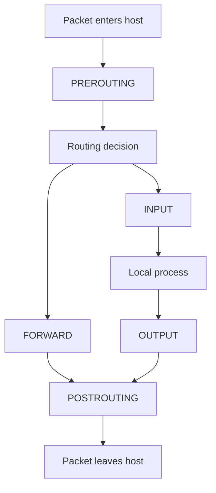

# Firewall

> **📌 Disclaimer**: Any third-party logos, screenshots, or diagrams referenced in this document are used for educational purposes only. All trademarks belong to their respective owners.


Linux firewalling can be managed with `iptables`, `nftables`, `firewalld`, or `ufw` depending on the distribution and preference.

## 4.1 Firewall concepts

A firewall filters traffic based on rules.

Common actions:

- Accept
- Drop
- Reject
- Log
- Masquerade
- DNAT
- SNAT

## 4.2 Packet filtering basics

A packet may be filtered based on:

- Source IP
- Destination IP
- Protocol
- Source port
- Destination port
- Interface
- Connection state
- Packet marks

## 4.3 Netfilter overview

The Linux kernel packet filtering framework is Netfilter.

User-space tools include:

- `iptables`
- `ip6tables`
- `nft`
- `firewalld`
- `ufw`

## 4.4 `iptables` tables

| Table | Purpose |
|---|---|
| `filter` | Packet filtering |
| `nat` | Address translation |
| `mangle` | Packet alteration |
| `raw` | Connection tracking exceptions |
| `security` | SELinux-related hooks |

## 4.5 `iptables` built-in chains

| Table | Common Chains |
|---|---|
| `filter` | `INPUT`, `FORWARD`, `OUTPUT` |
| `nat` | `PREROUTING`, `OUTPUT`, `POSTROUTING` |
| `mangle` | `PREROUTING`, `INPUT`, `FORWARD`, `OUTPUT`, `POSTROUTING` |

## 4.6 `iptables` packet flow Mermaid diagram

### 📸 Netfilter/iptables Packet Flow

> *Source: Wikimedia Commons — Netfilter packet traversal through Linux networking*



## 4.7 List current `iptables` rules

```bash
sudo iptables -L -n -v
sudo iptables -t nat -L -n -v
```

## 4.8 Basic `iptables` rule examples

### 4.8.1 Allow established traffic

```bash
sudo iptables -A INPUT -m conntrack --ctstate ESTABLISHED,RELATED -j ACCEPT
```

### 4.8.2 Allow loopback

```bash
sudo iptables -A INPUT -i lo -j ACCEPT
```

### 4.8.3 Allow SSH

```bash
sudo iptables -A INPUT -p tcp --dport 22 -j ACCEPT
```

### 4.8.4 Allow ICMP echo request

```bash
sudo iptables -A INPUT -p icmp --icmp-type echo-request -j ACCEPT
```

### 4.8.5 Default drop policy

```bash
sudo iptables -P INPUT DROP
sudo iptables -P FORWARD DROP
sudo iptables -P OUTPUT ACCEPT
```

## 4.9 Common `iptables` commands

| Task | Command |
|---|---|
| Append rule | `iptables -A` |
| Insert rule | `iptables -I` |
| Delete rule | `iptables -D` |
| List rules | `iptables -L -n -v` |
| Save rules | distro-specific |
| Flush rules | `iptables -F` |

## 4.10 Stateful firewalling

Connection tracking allows rules like:

```bash
sudo iptables -A INPUT -m conntrack --ctstate ESTABLISHED,RELATED -j ACCEPT
```

States commonly used:

- `NEW`
- `ESTABLISHED`
- `RELATED`
- `INVALID`

## 4.11 NAT with `iptables`

### 4.11.1 Masquerading outbound traffic

```bash
sudo iptables -t nat -A POSTROUTING -o eth0 -j MASQUERADE
```

### 4.11.2 Port forwarding example

```bash
sudo iptables -t nat -A PREROUTING -p tcp --dport 8443 -j DNAT --to-destination 192.168.10.20:443
sudo iptables -A FORWARD -p tcp -d 192.168.10.20 --dport 443 -j ACCEPT
```

## 4.12 Persisting `iptables`

Approaches vary:

- `iptables-save` and `iptables-restore`
- `iptables-persistent` on Debian/Ubuntu
- Distribution startup scripts
- Migration to `nftables`

Examples:

```bash
sudo iptables-save
sudo iptables-save > /etc/iptables/rules.v4
```

## 4.13 `nftables` overview

`nftables` is the modern replacement for `iptables` in many environments.

Advantages:

- Cleaner syntax
- Unified IPv4/IPv6 handling
- Better maintainability
- Improved sets and maps

## 4.14 `nftables` basic objects

- Tables
- Chains
- Rules
- Sets
- Maps
- State tracking

## 4.15 Minimal `nftables` example

```nft
flush ruleset

table inet filter {
  chain input {
    type filter hook input priority 0;
    policy drop;

    iif lo accept
    ct state established,related accept
    tcp dport 22 accept
    ip protocol icmp accept
    ip6 nexthdr icmpv6 accept
  }

  chain forward {
    type filter hook forward priority 0;
    policy drop;
  }

  chain output {
    type filter hook output priority 0;
    policy accept;
  }
}
```

Load rules:

```bash
sudo nft -f /etc/nftables.conf
sudo nft list ruleset
```

## 4.16 `firewalld` overview

`firewalld` is common on RHEL-family distributions.

Concepts:

- Zones
- Services
- Ports
- Rich rules
- Runtime vs permanent config

## 4.17 `firewalld` zones

Common zones:

| Zone | Typical Trust Level |
|---|---|
| `drop` | Very restrictive |
| `block` | Restrictive with rejection |
| `public` | Default public network |
| `external` | NAT gateway |
| `internal` | Trusted internal network |
| `dmz` | Limited access public servers |
| `trusted` | Highly trusted |

## 4.18 `firewalld` examples

### 4.18.1 Check state

```bash
sudo firewall-cmd --state
```

### 4.18.2 List active zones

```bash
sudo firewall-cmd --get-active-zones
```

### 4.18.3 Allow SSH service

```bash
sudo firewall-cmd --permanent --add-service=ssh
sudo firewall-cmd --reload
```

### 4.18.4 Allow HTTP and HTTPS

```bash
sudo firewall-cmd --permanent --add-service=http
sudo firewall-cmd --permanent --add-service=https
sudo firewall-cmd --reload
```

### 4.18.5 Open a custom port

```bash
sudo firewall-cmd --permanent --add-port=8443/tcp
sudo firewall-cmd --reload
```

### 4.18.6 Add source network to internal zone

```bash
sudo firewall-cmd --permanent --zone=internal --add-source=10.10.0.0/16
sudo firewall-cmd --reload
```

## 4.19 `firewalld` rich rules

Example:

```bash
sudo firewall-cmd --permanent --add-rich-rule='rule family="ipv4" source address="192.168.10.0/24" service name="ssh" accept'
sudo firewall-cmd --reload
```

## 4.20 `ufw` overview

`ufw` is common on Ubuntu systems and simplifies common firewall tasks.

### 4.20.1 Basic commands

```bash
sudo ufw status verbose
sudo ufw enable
sudo ufw disable
```

### 4.20.2 Allow SSH

```bash
sudo ufw allow ssh
```

### 4.20.3 Allow HTTP and HTTPS

```bash
sudo ufw allow 80/tcp
sudo ufw allow 443/tcp
```

### 4.20.4 Deny a port

```bash
sudo ufw deny 23/tcp
```

## 4.21 Common firewall rules table

| Use Case | iptables | nftables | firewalld | ufw |
|---|---|---|---|---|
| Allow SSH | `-A INPUT -p tcp --dport 22 -j ACCEPT` | `tcp dport 22 accept` | `--add-service=ssh` | `allow ssh` |
| Allow HTTP | `-A INPUT -p tcp --dport 80 -j ACCEPT` | `tcp dport 80 accept` | `--add-service=http` | `allow 80/tcp` |
| Allow HTTPS | `-A INPUT -p tcp --dport 443 -j ACCEPT` | `tcp dport 443 accept` | `--add-service=https` | `allow 443/tcp` |
| Masquerade | `-t nat -A POSTROUTING -j MASQUERADE` | `masquerade` | `--add-masquerade` | limited direct approach |
| Default deny | `-P INPUT DROP` | `policy drop` | zone policy model | default deny incoming |

## 4.22 Safe firewall workflow on remote systems

1. Confirm console or out-of-band access exists.
2. Allow established traffic first.
3. Allow SSH from your source before default drop.
4. Apply changes in a rollback-friendly way.
5. Test from a second session.

## 4.23 Logging firewall hits

### 4.23.1 `iptables` logging example

```bash
sudo iptables -A INPUT -p tcp --dport 23 -j LOG --log-prefix "TELNET_DROP "
sudo iptables -A INPUT -p tcp --dport 23 -j DROP
```

Be careful. Logging every packet can flood logs.

## 4.24 IPv6 firewalling

Do not forget IPv6.

Common mistake:

- Securing IPv4 only
- Leaving IPv6 wide open

Use:

- `ip6tables`
- `nftables` unified `inet` tables
- `firewalld`
- `ufw` with IPv6 enabled

## 4.25 Common firewall mistakes

- Dropping established traffic
- Locking out SSH
- Forgetting IPv6 rules
- DNAT without FORWARD allow
- No persistence after reboot
- Overly broad allow rules
- Blocking ICMP required for PMTU

## 4.26 SELinux and firewalls

Sometimes the network is fine but SELinux blocks the service.

Useful tools:

```bash
getenforce
sudo ausearch -m AVC
sudo semanage port -l | grep http
```

## 4.27 Example baseline server policy

Recommended baseline:

- Allow loopback
- Allow established and related
- Allow SSH from admin ranges only
- Allow specific app ports only
- Default drop inbound
- Log important denials selectively

## 4.28 Example `nftables` production starter file

```nft
flush ruleset

table inet filter {
  chain input {
    type filter hook input priority 0;
    policy drop;
    iif lo accept
    ct state invalid drop
    ct state established,related accept
    tcp dport { 22, 80, 443 } accept
    ip protocol icmp accept
    ip6 nexthdr ipv6-icmp accept
  }

  chain forward {
    type filter hook forward priority 0;
    policy drop;
  }

  chain output {
    type filter hook output priority 0;
    policy accept;
  }
}
```

## 4.29 Firewall validation commands

```bash
sudo iptables -L -n -v
sudo nft list ruleset
sudo firewall-cmd --list-all
sudo ufw status verbose
ss -tulpen
nmap -Pn <host>
```

## 4.30 Summary

Choose one firewall management approach for operational clarity. On modern systems, `nftables` or `firewalld` is typically preferred. Always test remotely with caution.

---

# Firewall Command Reference

## A.6 Firewall commands

```bash
iptables -L -n -v
nft list ruleset
firewall-cmd --list-all
ufw status verbose
```

---

# Firewall Exercises and Checklists

## C.6 Exercise 6: Build a simple `nftables` input policy

Goal:

- Allow loopback
- Allow established traffic
- Allow SSH
- Default drop inbound

Validate with:

```bash
sudo nft list ruleset
```

---

## D.2 Firewall checklist

- [ ] Default deny inbound unless justified otherwise.
- [ ] Allow only required ports.
- [ ] Restrict admin ports by source IP.
- [ ] Apply IPv6 rules too.
- [ ] Persist rules properly.
- [ ] Log selectively.

---

## E.9 Firewall operational patterns

### E.9.1 Host firewall plus network firewall

A secure environment often uses both:

- Host firewall for local enforcement
- Perimeter or cloud firewall for broader segmentation

### E.9.2 Host firewall baseline template

Allow:

- Loopback
- Established and related
- Monitoring from trusted ranges
- Admin access from bastions
- Application ports only from intended sources

Drop everything else.

---

## E.15 Security controls beyond firewalls

Consider:

- SELinux or AppArmor
- TCP wrappers in legacy environments
- Application allowlists
- Reverse proxy access controls
- Mutual TLS
- IDS or IPS systems

---

## E.24 Safe command ordering for new firewall deployments

1. Allow loopback.
2. Allow established and related.
3. Allow SSH from admin source.
4. Allow required app ports.
5. Set default drop.
6. Save and verify.

## E.25 Basic hardening pattern for Internet-facing hosts

- Minimal open ports
- No password SSH
- Fail2ban or equivalent if needed
- TLS with modern settings
- DNS records correct
- Centralized logging
- Monitoring and alerting enabled
