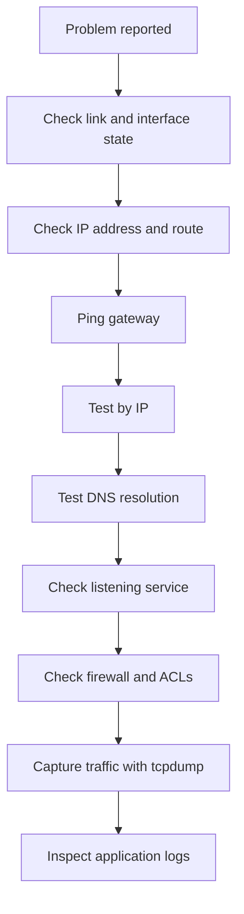

# Network Troubleshooting

Troubleshooting becomes much easier when you move layer by layer.

## 6.1 Troubleshooting mindset

Always ask:

1. Is the interface up?
2. Does it have the expected IP?
3. Is the route correct?
4. Can it reach the gateway?
5. Is DNS working?
6. Is the service listening?
7. Is a firewall blocking traffic?
8. Is the application healthy?

## 6.2 Mermaid troubleshooting decision tree



## 6.3 `ping`

`ping` tests ICMP reachability.

Examples:

```bash
ping -c 4 8.8.8.8
ping -c 4 example.com
ping -I eth0 -c 4 192.168.10.1
ping -6 -c 4 2001:4860:4860::8888
```

Interpretation:

- Success means path and remote response are working.
- Failure can be routing, firewall, link, or policy.

## 6.4 `traceroute`

Shows hop-by-hop path.

### 📸 Traceroute Visualization

> *Source: Wikimedia Commons — Traceroute path visualization*

Examples:

```bash
traceroute example.com
traceroute -n 8.8.8.8
traceroute -T -p 443 example.com
```

Useful for:

- Finding where packets stop
- Identifying asymmetric or unexpected paths

## 6.5 `mtr`

`mtr` combines `ping` and `traceroute` for continuous path analysis.

```bash
mtr -rwzc 20 example.com
```

Great for intermittent packet loss or latency.

## 6.6 `netstat`

Legacy tool for connections and listeners.

```bash
netstat -tulpen
netstat -rn
```

Prefer `ss` on modern systems, but `netstat` is still widely known.

## 6.7 `ss`

`ss` is the modern socket statistics tool.

### 6.7.1 Show listening TCP and UDP sockets

```bash
ss -tulpen
```

### 6.7.2 Show active TCP sessions

```bash
ss -tan
```

### 6.7.3 Filter by port

```bash
ss -tulpen | grep :443
```

### 6.7.4 Show process info

```bash
sudo ss -tulpn
```

## 6.8 `lsof -i`

Shows open files related to network sockets.

Examples:

```bash
sudo lsof -i
sudo lsof -i :443
sudo lsof -iTCP -sTCP:LISTEN -nP
```

Useful when you need to know which process owns a port.

## 6.9 `tcpdump`

One of the most important troubleshooting tools.

### 6.9.1 Capture on interface

```bash
sudo tcpdump -i eth0
```

### 6.9.2 Capture by host

```bash
sudo tcpdump -i eth0 host 192.168.10.20
```

### 6.9.3 Capture by port

```bash
sudo tcpdump -i eth0 port 443
```

### 6.9.4 Capture by protocol

```bash
sudo tcpdump -i eth0 icmp
sudo tcpdump -i eth0 udp port 53
```

### 6.9.5 Write capture to file

```bash
sudo tcpdump -i eth0 -w capture.pcap
```

### 6.9.6 Read a pcap file

```bash
tcpdump -r capture.pcap
```

## 6.10 `nmap`

Use `nmap` to discover open ports and services.

Examples:

```bash
nmap 192.168.10.20
nmap -Pn -p 22,80,443 192.168.10.20
nmap -sV 192.168.10.20
```

Be careful with production and security policies.

## 6.11 `curl`

Powerful application-layer testing tool.

Examples:

```bash
curl -I https://example.com
curl -v https://example.com
curl --resolve example.com:443:192.168.10.20 https://example.com/
curl -k https://192.168.10.20
```

Use `curl` to verify:

- DNS resolution
- TLS handshake
- HTTP status codes
- Redirects
- Headers
- Response timing

## 6.12 `wget`

Examples:

```bash
wget https://example.com/file.tar.gz
wget --server-response https://example.com/
```

## 6.13 `nc` or netcat

Netcat is extremely useful for TCP or UDP testing.

Examples:

```bash
nc -zv 192.168.10.20 22
nc -zv 192.168.10.20 80 443
nc -ul 9999
nc -l 8080
```

## 6.14 `telnet`

Legacy but still useful for quick TCP connection tests.

```bash
telnet 192.168.10.20 25
```

If it connects, the TCP port is open.

## 6.15 `ip addr`, `ip route`, and `ip neigh`

First-line inspection commands:

```bash
ip addr
ip route
ip neigh
```

## 6.16 `ethtool`

Inspect NIC link settings and offloads.

Examples:

```bash
sudo ethtool eth0
sudo ethtool -S eth0
```

Look for:

- Speed
- Duplex
- Link detected
- Driver issues
- Interface counters

## 6.17 `journalctl`

Check service and kernel logs.

Examples:

```bash
journalctl -xe
journalctl -u NetworkManager
journalctl -u systemd-resolved
journalctl -k
```

## 6.18 `dmesg`

Useful for driver or link state issues.

```bash
dmesg | grep -i eth
dmesg | grep -i link
```

## 6.19 Troubleshooting by symptom

### 6.19.1 No network connectivity at all

Check:

- Cable or virtual NIC state
- `ip link`
- IP address presence
- Default route
- Hypervisor or cloud network attachments

### 6.19.2 Can ping gateway but not Internet

Check:

- Default route
- Upstream firewall
- NAT
- DNS if only names fail

### 6.19.3 Can ping IP but not hostname

Check:

- `/etc/resolv.conf`
- Resolver service
- DNS server reachability
- `/etc/nsswitch.conf`

### 6.19.4 Service not reachable remotely

Check:

- Is the service listening?
- Is it bound to `127.0.0.1` only?
- Is host firewall allowing it?
- Is upstream load balancer or security group allowing it?
- Is SELinux blocking the port?

## 6.20 Check service bind address

Example:

```bash
ss -tulpn | grep :8080
```

If it listens only on `127.0.0.1:8080`, remote hosts cannot connect.

## 6.21 TCP handshake troubleshooting with `tcpdump`

Look for:

- SYN sent
- SYN-ACK returned
- ACK completes handshake

Patterns:

- SYN only: path or firewall issue
- SYN then RST: port closed or active reject
- Full handshake then app error: higher-layer issue

## 6.22 DNS troubleshooting checklist

- Does `dig @resolver name` work?
- Does `getent hosts name` work?
- Is `/etc/resolv.conf` correct?
- Is `systemd-resolved` active?
- Are search domains causing wrong results?

## 6.23 Routing troubleshooting

Useful commands:

```bash
ip route get 8.8.8.8
ip rule show
traceroute -n 8.8.8.8
```

Check for:

- Wrong default gateway
- Missing return route
- Source-based routing mismatch

## 6.24 MTU troubleshooting

Symptoms:

- Small pings work, large HTTPS stalls
- VPN connections flaky
- SSH hangs after login

Test with DF bit on IPv4:

```bash
ping -M do -s 1472 8.8.8.8
```

Reduce payload until it works.

## 6.25 Packet capture strategy

Capture on the right place:

- Client interface
- Server interface
- Firewall interface
- Tunnel interface
- Bridge or namespace interface

Ask:

- Did the packet leave?
- Did it arrive?
- Was there a reply?
- Was the reply dropped on the return path?

## 6.26 Analyze listening services

```bash
sudo ss -lntup
sudo systemctl status nginx
sudo systemctl status sshd
```

## 6.27 `arping`

Useful for Layer 2 address resolution tests.

```bash
sudo arping -I eth0 192.168.10.1
```

Good for:

- Duplicate IP checks
- Local subnet reachability
- ARP validation

## 6.28 `tracepath`

Often available by default on Linux.

```bash
tracepath example.com
```

It can help identify PMTU changes.

## 6.29 Common troubleshooting workflow example

Problem:

- Users cannot access `https://app.example.com`

Step-by-step:

1. `dig app.example.com`
2. `ping <resolved-ip>`
3. `traceroute <resolved-ip>`
4. `nc -zv <resolved-ip> 443`
5. `curl -vk https://app.example.com`
6. On server: `ss -tulpn | grep :443`
7. On server: `sudo firewall-cmd --list-all` or `sudo nft list ruleset`
8. On server: `sudo tcpdump -i eth0 port 443`
9. Check application logs

## 6.30 Useful one-liners

```bash
ip -br addr
ip -br link
ss -tulpn
curl -I https://example.com
nmap -Pn -p 80,443 example.com
```

## 6.31 When to suspect upstream issues

Suspect upstream devices when:

- Host config looks correct
- Local firewall permits traffic
- Packet leaves host but no reply returns
- Multiple hosts show same issue

Possible causes:

- Cloud security group
- External firewall
- Load balancer health checks
- Router ACL
- ISP issue

## 6.32 Documentation during incidents

Capture:

- Time of issue
- Affected hosts
- Commands run
- Key outputs
- Interface and route state
- Firewall state
- Packet capture summary

## 6.33 Summary

Troubleshooting is a process of narrowing scope. Start with the basics, move layer by layer, and validate assumptions using observable data.

---

# Troubleshooting Command Reference

## A.4 Socket and port commands

```bash
ss -tulpen
netstat -tulpen
lsof -i
nc -zv host 443
```

## A.5 Packet capture and scanning

```bash
tcpdump -i eth0 port 53
nmap -Pn -p 22,80,443 host
mtr -rwzc 10 host
```

---

## C.8 Exercise 8: Compare `ss`, `netstat`, and `lsof`

Commands:

```bash
ss -tulpen
netstat -tulpen
sudo lsof -iTCP -sTCP:LISTEN -nP
```

---

## C.10 Exercise 10: Trace an HTTP request path

Steps:

1. Resolve hostname.
2. Ping server.
3. Check route.
4. Connect with `curl -v`.
5. Capture with `tcpdump`.

---

## 12.5 Troubleshoot: Server can ping gateway but not Internet

Interpretation:

- Layer 2 and local subnet connectivity probably work
- Failure is likely routing, NAT, upstream firewall, or DNS

Workflow:

```bash
ip addr
ip route
ping -c 3 192.168.10.1
ping -c 3 1.1.1.1
dig @1.1.1.1 example.com
traceroute 8.8.8.8
```

Likely causes:

- Missing default route
- Wrong next hop on the gateway
- No NAT on the edge for private IPs
- Upstream firewall policy
- Reverse path or asymmetric routing problem

---

## 12.6 Troubleshoot: Service listens locally but remote clients cannot connect

Key checks:

```bash
ss -tulpen | grep 8080
sudo nft list ruleset
curl -v http://127.0.0.1:8080/
curl -v http://$(hostname -I | awk '{print $1}'):8080/
```

Common root causes:

- Application bound to `127.0.0.1` instead of `0.0.0.0` or a real interface IP
- Host firewall blocking the port
- Cloud security group missing allow rule
- Upstream load balancer health check failing

---

## 12.12 Troubleshoot: HTTPS works for small pages but large downloads stall

This pattern strongly suggests MTU or MSS trouble on a tunnel, overlay, or mis-sized path.

Workflow:

```bash
ping -M do -s 1472 8.8.8.8
ping -M do -s 1400 8.8.8.8
tracepath 8.8.8.8
sudo tcpdump -ni eth0 'tcp[tcpflags] & (tcp-syn|tcp-rst) != 0'
```

Potential fixes:

- Lower tunnel MTU
- Clamp TCP MSS on the edge firewall
- Verify every hop supports jumbo frames before enabling them

---

## 12.15 Build a lightweight packet-capture workflow during incidents

Goal:

- Capture enough information to explain the failure without collecting noise forever

Examples:

```bash
sudo tcpdump -ni eth0 host 10.20.30.21 and port 443
sudo tcpdump -ni any udp port 53
sudo tcpdump -ni wg0
```

Best practices:

- Capture on both the application host and the edge if possible
- Filter by host and port aggressively
- Record exact timestamps of user-visible failures
- Compare good and bad transactions

---

## 12.16 Scenario selection cheat sheet

| If you need to... | Start with... |
|---|---|
| Reach a private server from a laptop | Scenario 12.1 or 12.8 |
| Connect two sites privately | Scenario 12.2 or 12.11 |
| Publish internal names | Scenario 12.3 |
| Balance raw TCP services | Scenario 12.4 |
| Fix outbound reachability | Scenario 12.5 |
| Fix inbound service access | Scenario 12.6 |
| Expose a local dev app temporarily | Scenario 12.7 |
| Terminate multiple VLANs on one host | Scenario 12.9 |
| Diagnose resolver mismatch | Scenario 12.10 |
| Diagnose MTU issues | Scenario 12.12 |
| Centralize private HTTPS apps | Scenario 12.13 |
| Diagnose asymmetric routing | Scenario 12.14 |
| Capture incident packets | Scenario 12.15 |

---

## 12.17 Summary

Real-world networking work is usually about combining a few simple components correctly: addressing, routing, DNS, security policy, and observability. When incidents happen, use the most direct commands first, prove each layer, and change one variable at a time.

---

## E.1 Layer-by-layer troubleshooting prompts

### E.1.1 Layer 1 questions

- Is the cable connected?
- Is the NIC detected?
- Does `ethtool` show link?
- Is the SFP supported?
- Is the switch port enabled?

### E.1.2 Layer 2 questions

- Is the correct VLAN assigned?
- Are MAC addresses learning on the switch?
- Is ARP working?
- Is there a loop?
- Is STP blocking a path?

### E.1.3 Layer 3 questions

- Does the host have the right IP?
- Is the subnet mask correct?
- Is the gateway correct?
- Is routing symmetric?
- Is reverse path filtering interfering?

### E.1.4 Layer 4 questions

- Is the target port open?
- Is the listener bound to the right address?
- Is the firewall allowing the connection?
- Are there retransmissions or resets?

### E.1.5 Layer 7 questions

- Is the application healthy?
- Are credentials or TLS settings valid?
- Does the service expect a hostname or SNI?
- Are proxies rewriting headers incorrectly?

## E.2 Comparing common tools by task

| Task | Best Tool | Why |
|---|---|---|
| Show current IP config | `ip addr` | Accurate, modern |
| Show routing decision | `ip route get` | Shows chosen path |
| Test name resolution | `dig` | Detailed DNS output |
| Check open ports | `ss -tulpen` | Fast and modern |
| See packet path | `traceroute` or `mtr` | Hop visibility |
| Capture packets | `tcpdump` | Ground truth |
| Scan service exposure | `nmap` | External perspective |
| Test HTTP | `curl` | App-layer visibility |

---

## E.16 Packet capture reading cheatsheet

| Observation | Interpretation |
|---|---|
| SYN repeated, no SYN-ACK | No response or filtered path |
| SYN then RST | Closed port or reject |
| TLS handshake alert | Cert or protocol issue |
| DNS query sent, no reply | Resolver path issue |
| ICMP frag needed | MTU problem |
| ARP request repeated, no reply | L2 reachability problem |

---

## E.18 Common “it works locally but not remotely” causes

- App listening only on `127.0.0.1`
- Host firewall block
- Cloud firewall block
- Reverse proxy misrouting
- Wrong advertised DNS name
- SELinux port labeling issue

---

## E.20 Common “it works from one subnet but not another” causes

- Missing return route
- Firewall source restrictions
- ACL on upstream router
- VRF or policy routing issue
- VLAN trunk missing allowed VLAN

## E.21 Performance troubleshooting prompts

- Is there packet loss?
- Is latency increasing at a particular hop?
- Are retransmissions visible?
- Is CPU saturation causing queue drops?
- Is NIC offload behavior affecting capture interpretation?
- Is the MTU optimal for the path?

---

## E.23 Example baseline validation script ideas

A simple operator checklist might include:

- `hostnamectl`
- `ip -br addr`
- `ip route`
- `resolvectl status`
- `ss -tulpen`
- firewall state command
- `curl` to health endpoint

---

## Q.1 Command to objective mapping

| Objective | Primary Command | Secondary Command |
|---|---|---|
| Show addresses | `ip addr` | `ip -br addr` |
| Show routes | `ip route` | `route -n` |
| Show sockets | `ss -tulpen` | `netstat -tulpen` |
| Resolve DNS | `dig` | `host` |
| Test app | `curl -v` | `wget --server-response` |
| Test TCP port | `nc -zv` | `telnet` |
| Trace path | `traceroute` | `mtr` |
| Capture traffic | `tcpdump` | Wireshark offline |
| Show firewall | `nft list ruleset` | `iptables -L -n -v` |
| Show neighbors | `ip neigh` | `arp -n` |

## Q.2 Problem to likely layer mapping

| Problem | Likely Layer |
|---|---|
| Link light off | 1 |
| ARP incomplete | 2 |
| No route to host | 3 |
| Connection timed out | 3 or 4 |
| Connection refused | 4 or 7 |
| TLS cert error | 7 |
| Hostname not found | DNS/Application |

## Q.3 Admin task to file mapping

| Admin Task | Common File |
|---|---|
| Set static DNS | `/etc/resolv.conf` or NetworkManager/Netplan source |
| Pin local name | `/etc/hosts` |
| Change resolver order | `/etc/nsswitch.conf` |
| Harden SSH | `/etc/ssh/sshd_config` |
| Configure WireGuard | `/etc/wireguard/wg0.conf` |
| Configure HAProxy | `/etc/haproxy/haproxy.cfg` |
| Set sysctl forwarding | `/etc/sysctl.conf` |

---

## Q.2 Problem to likely layer mapping

| Problem | Likely Layer |
|---|---|
| Link light off | 1 |
| ARP incomplete | 2 |
| No route to host | 3 |
| Connection timed out | 3 or 4 |
| Connection refused | 4 or 7 |
| TLS cert error | 7 |
| Hostname not found | DNS/Application |

---

# Additional Line-Oriented Study Notes

The following compact notes are included to make this guide extra practical and to ensure broad topic coverage. Each line is intended to be easy to scan during operations.

- Always verify interface names before applying changes.
- Always validate syntax before restarting a network service.
- Always keep a remote rollback plan.
- Prefer modern tools over deprecated ones.
- `ip` replaces most `ifconfig`, `route`, and `arp` use cases.
- `ss` replaces many `netstat` use cases.
- `nftables` is the strategic replacement for `iptables` in many environments.
- `dig +short` is useful for quick answers.
- `curl -vk` is useful for TLS troubleshooting.
- `tcpdump` shows what really happened on the wire.
- `ip route get` explains the chosen path better than reading routes alone.
- `getent hosts` reflects NSS resolution behavior.
- Use `journalctl` for service-centric logging.
- Use `ethtool` for physical NIC details.
- Use `bridge` for bridge and VLAN-aware bridge visibility.
- Use `wg show` for WireGuard tunnel state.
- Use `resolvectl` when `systemd-resolved` is involved.
- Avoid overlapping subnets across VPN-connected sites.
- Avoid editing generated resolver files blindly.
- Avoid exposing management services on public interfaces.
- Document static routes and policy rules.
- Document VLAN IDs and switch trunk expectations.
- Document bond modes and switch port-channel settings.
- Do not forget IPv6.
- Do not block all ICMP without understanding the impact.
- Prefer bastions over direct public SSH to every server.
- Prefer key-based auth over passwords.
- Prefer health-checked load balancers over blind round-robin DNS alone.
- Prefer split DNS only when operationally justified and documented.
- Prefer simple routing over policy routing unless required.
- Know where DNS is actually managed on your distro.
- Know whether NetworkManager, networkd, or legacy scripts own the interface.
- Know whether host firewall is runtime-only or persistent.
- Remember that NAT affects packet visibility and troubleshooting.
- Remember that UDP issues may be silent compared with TCP.
- Remember that VPN encapsulation changes effective MTU.
- Remember that cloud firewalls are separate from host firewalls.
- Remember that a service may listen but still be unreachable.
- Remember that binding to localhost prevents remote access.
- Remember that DNS issues often look like network issues.
- Remember that application issues often look like network issues.
- Practice namespace labs to understand isolated stacks.
- Practice building routes and deleting them.
- Practice reading packet traces until handshake patterns become familiar.
- Practice deploying a host firewall without locking yourself out.
- Practice recovering from bad DNS settings using IP-based access.
- Practice using `ProxyJump` and client configs for SSH efficiency.
- Practice testing with both hostname and raw IP.
- Practice comparing local and remote perspectives.
- Build repeatable troubleshooting checklists.
- Keep config backups before major changes.
- Test both runtime state and persistent configuration state.
- Verify service behavior after reboot if persistence matters.
- Verify dual-stack behavior if IPv6 is enabled.
- Verify reverse DNS where mail or identity systems depend on it.
- Verify TLS certificates after load balancer or DNS changes.
- Verify firewall counters when debugging packet drops.
- Verify namespace cleanup after lab exercises.
- Verify route symmetry in multi-homed designs.
- Verify health endpoints return success quickly and consistently.
- Verify DNS TTL matches operational needs.
- Verify internal-only services are not Internet exposed.
- Verify jump hosts are monitored and patched.
- Verify passive FTP ports if legacy clients must be supported.
- Verify NFS export permissions carefully.
- Verify Samba permissions and share paths.
- Verify DHCP scopes do not overlap static infrastructure ranges.
- Verify VPN peer AllowedIPs are correct and non-overlapping.
- Verify OpenVPN or WireGuard services start on boot if required.
- Verify HAProxy config with `haproxy -c` before reload.
- Verify Nginx config with `nginx -t` before reload.
- Verify SSH config with `sshd -t` before reload.
- Verify BIND config with `named-checkconf` before restart.
- Verify `nftables` ruleset after load and after reboot.
- Verify the path of return traffic, not only forward traffic.
- Verify source IP preservation requirements for applications.
- Verify logging rate limits if firewall logging is enabled.
- Verify DNS recursion restrictions on public-facing servers.
- Verify link speed and duplex on bare metal.
- Verify STP state if bridging physical networks.
- Verify LACP negotiation if using 802.3ad bonds.
- Verify jumbo frame support end to end before enabling MTU 9000.
- Verify PMTU behavior over tunnels.
- Verify policy routing tables are populated as expected.
- Verify `rp_filter` settings in asymmetric paths.
- Verify cloud route tables when VPN or transit gateways are used.
- Verify services listen on IPv6 if clients may prefer AAAA records.
- Verify AAAA records are correct before publishing them broadly.
- Verify local caching resolvers do not mask stale DNS assumptions.
- Verify app timeouts are sensible for the network path.
- Verify monitoring checks mimic real client behavior when possible.
- Keep packet captures focused with host and port filters.
- Keep changes minimal and observable.
- Keep operational runbooks updated.
- Keep secrets out of configs unless properly protected.
- Keep private keys readable only by intended owners.
- Keep configuration ownership clear across teams.
- Keep training environments available for safe practice.
- Keep the big picture in mind: link, path, policy, application.

---

# End of Guide
