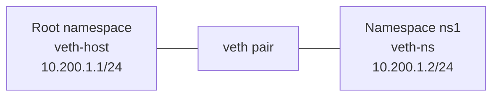

# Advanced Networking

This section covers Linux features often used in container platforms, routers, lab environments, and high-control network designs.

## 11.1 Network namespaces overview
A network namespace provides an isolated network stack.

Each namespace can have its own:

- Interfaces
- Routes
- Firewall rules
- ARP table
- Listening sockets

Use cases:

- Containers
- Network labs
- Tenant isolation
- Advanced testing

## 11.2 Create a namespace
```bash
sudo ip netns add ns1
sudo ip netns list
```

## 11.3 Run a command in a namespace
```bash
sudo ip netns exec ns1 ip addr
sudo ip netns exec ns1 ping -c 2 127.0.0.1
```

## 11.4 `veth` pairs
A `veth` pair acts like a virtual cable.

Packets entering one end exit the other.

## 11.5 Create a `veth` pair and attach to namespace
```bash
sudo ip link add veth-host type veth peer name veth-ns
sudo ip link set veth-ns netns ns1
sudo ip addr add 10.200.1.1/24 dev veth-host
sudo ip link set veth-host up
sudo ip netns exec ns1 ip addr add 10.200.1.2/24 dev veth-ns
sudo ip netns exec ns1 ip link set veth-ns up
sudo ip netns exec ns1 ip link set lo up
```

## 11.6 Test namespace connectivity
```bash
ping -c 3 10.200.1.2
sudo ip netns exec ns1 ping -c 3 10.200.1.1
```

## 11.7 Mermaid namespace connectivity diagram


## 11.8 Add Internet access to namespace via NAT
Steps:

1. Enable IP forwarding.
2. Add default route in namespace.
3. Masquerade traffic on outbound interface.

Example:

```bash
sudo sysctl -w net.ipv4.ip_forward=1
sudo ip netns exec ns1 ip route add default via 10.200.1.1
sudo iptables -t nat -A POSTROUTING -s 10.200.1.0/24 -o eth0 -j MASQUERADE
sudo iptables -A FORWARD -i eth0 -o veth-host -m conntrack --ctstate ESTABLISHED,RELATED -j ACCEPT
sudo iptables -A FORWARD -i veth-host -o eth0 -j ACCEPT
```

## 11.9 Enable persistent IP forwarding
Temporary:

```bash
sudo sysctl -w net.ipv4.ip_forward=1
sudo sysctl -w net.ipv6.conf.all.forwarding=1
```

Persistent example:

```conf
net.ipv4.ip_forward = 1
net.ipv6.conf.all.forwarding = 1
```

Store in:

```text
/etc/sysctl.conf
```

or a file in:

```text
/etc/sysctl.d/
```

Apply:

```bash
sudo sysctl --system
```

## 11.10 NAT concepts
Types:

- SNAT
- DNAT
- Masquerade
- Port forwarding

Use cases:

- Internet access for private subnets
- Publishing internal services
- Lab connectivity

## 11.11 Masquerading example recap
```bash
sudo iptables -t nat -A POSTROUTING -o eth0 -j MASQUERADE
```

Masquerade is convenient when the outbound IP can change.

## 11.12 Static SNAT example
```bash
sudo iptables -t nat -A POSTROUTING -o eth0 -j SNAT --to-source 203.0.113.10
```

Use SNAT when the external IP is stable.

## 11.13 DNAT example
```bash
sudo iptables -t nat -A PREROUTING -p tcp -d 203.0.113.10 --dport 443 -j DNAT --to-destination 10.10.20.15:443
```

## 11.14 Linux router use case
A Linux host can act as:

- Edge router
- NAT gateway
- VPN gateway
- Lab router
- Container bridge host

Basic requirements:

- Multiple interfaces or overlay paths
- IP forwarding enabled
- Correct routes
- Firewall/NAT rules

## 11.15 Traffic shaping with `tc`
`tc` controls queueing, shaping, delay, and loss injection.

Common uses:

- Rate limiting
- Testing latency-sensitive apps
- Simulating bad networks
- Prioritizing traffic

## 11.16 Show `tc` qdisc settings
```bash
tc qdisc show dev eth0
```

## 11.17 Add simple traffic shaping
Limit egress to 10 Mbit:

```bash
sudo tc qdisc add dev eth0 root tbf rate 10mbit burst 32kbit latency 400ms
```

Delete qdisc:

```bash
sudo tc qdisc del dev eth0 root
```

## 11.18 Simulate delay and packet loss with `netem`
```bash
sudo tc qdisc add dev eth0 root netem delay 100ms loss 2%
```

Very useful for testing app behavior under non-ideal conditions.

## 11.19 Packet capture analysis workflow
1. Capture relevant traffic.
2. Check handshake behavior.
3. Check retransmissions.
4. Check resets.
5. Check DNS timing.
6. Check MSS and MTU-related signs.
7. Correlate with app logs.

## 11.20 Read TCP flags in packet traces
Common flags:

- SYN
- ACK
- FIN
- RST
- PSH

Interpretation examples:

- SYN retries: no reply path or firewall drop
- RST: closed port or reject behavior
- Repeated retransmissions: loss or congestion

## 11.21 Policy routing example
Suppose a host has two uplinks.

Use source-based routing:

```bash
echo '100 uplink1' | sudo tee -a /etc/iproute2/rt_tables
echo '200 uplink2' | sudo tee -a /etc/iproute2/rt_tables
sudo ip route add default via 192.168.10.1 table uplink1
sudo ip route add default via 192.168.20.1 table uplink2
sudo ip rule add from 192.168.10.10/32 table uplink1
sudo ip rule add from 192.168.20.10/32 table uplink2
```

## 11.22 Reverse path filtering
Kernel reverse path filtering may drop packets that appear to arrive through the wrong interface.

Check settings:

```bash
sysctl net.ipv4.conf.all.rp_filter
sysctl net.ipv4.conf.eth0.rp_filter
```

This is important in asymmetric or multi-homed setups.

## 11.23 Bridges in advanced networking
Linux bridges are central to:

- KVM networking
- LXC and Docker style connectivity
- Namespaces and veth topologies

Useful commands:

```bash
bridge link
bridge fdb show
bridge vlan show
```

## 11.24 TUN vs TAP
| Type | Layer | Use Case |
|---|---|---|
| TUN | Layer 3 | Routed VPNs |
| TAP | Layer 2 | Bridged VPNs, Ethernet emulation |

## 11.25 GRE and VXLAN overview
Advanced overlays include:

- GRE
- IPIP
- VXLAN
- GENEVE

Used in:

- Data center overlays
- Cloud networking
- SDN environments

## 11.26 VXLAN conceptual note
VXLAN extends Layer 2 over Layer 3 using VNI identifiers and UDP encapsulation.

Often used with:

- Hypervisors
- Kubernetes CNIs
- EVPN fabrics

## 11.27 Packet path analysis tips
When analyzing a packet path, identify:

- Original source and destination
- NAT translation points
- Routing decision points
- Firewall policy points
- Encapsulation and decapsulation boundaries

## 11.28 Performance tuning considerations
Watch:

- MTU
- Ring buffers
- Offloads
- CPU pinning for high packet rates
- IRQ balancing
- Queue count

Useful tools:

```bash
ethtool -k eth0
ethtool -g eth0
sar -n DEV 1 5
```

## 11.29 Namespace cleanup
```bash
sudo ip netns del ns1
sudo ip link del veth-host
```

Delete in the right order if objects remain attached.

## 11.30 Advanced networking best practices
- Make small, reversible changes.
- Document route tables and policy rules.
- Test from both sides of a path.
- Capture packets near the suspected failure point.
- Keep firewall and routing design aligned.

## 11.31 Summary
Advanced Linux networking is powerful because the kernel exposes composable building blocks. Namespaces, routes, bridges, NAT, and shaping can model almost any scenario.

---

## 11.14 Troubleshoot: Dual-homed server replies through the wrong interface
Symptoms:

- Requests arrive on interface A
- Replies leave interface B
- Firewalls or remote peers drop the asymmetric return traffic

Helpful commands:

```bash
ip addr
ip route
ip rule
ip route get 198.51.100.55
sysctl net.ipv4.conf.all.rp_filter
sudo tcpdump -ni any host 198.51.100.55
```

Potential solutions:

- Add policy routing with `ip rule`
- Fix source-based route tables
- Disable overly strict reverse path filtering if the design is intentionally asymmetric

---

# Advanced Command Reference and Labs

## A.8 Namespace and advanced commands

```bash
ip netns list
ip netns exec ns1 ip addr
bridge link
bridge vlan show
tc qdisc show dev eth0
wg show
```

---

## C.5 Exercise 5: Create a namespace pair

Commands:

```bash
sudo ip netns add ns1
sudo ip link add veth-host type veth peer name veth-ns
sudo ip link set veth-ns netns ns1
sudo ip addr add 10.200.1.1/24 dev veth-host
sudo ip link set veth-host up
sudo ip netns exec ns1 ip addr add 10.200.1.2/24 dev veth-ns
sudo ip netns exec ns1 ip link set veth-ns up
sudo ip netns exec ns1 ip link set lo up
```

Test:

```bash
ping -c 3 10.200.1.2
sudo ip netns exec ns1 ping -c 3 10.200.1.1
```

Cleanup:

```bash
sudo ip netns del ns1
sudo ip link del veth-host
```

---

## E.13 Containers and Linux networking

Container runtimes commonly use:

- Bridges
- Veth pairs
- NAT
- Namespaces
- iptables or nftables rules

Useful commands when containers affect networking:

```bash
ip netns list
ip link
bridge link
iptables -t nat -L -n -v
nft list ruleset
```

---

## E.28 Cloud networking caveats

In cloud environments, remember host config is only part of the story.

Also validate:

- Security groups
- Network ACLs
- Route tables
- Subnet attachments
- Public IP or NAT gateway presence
- Metadata service reachability if relevant
