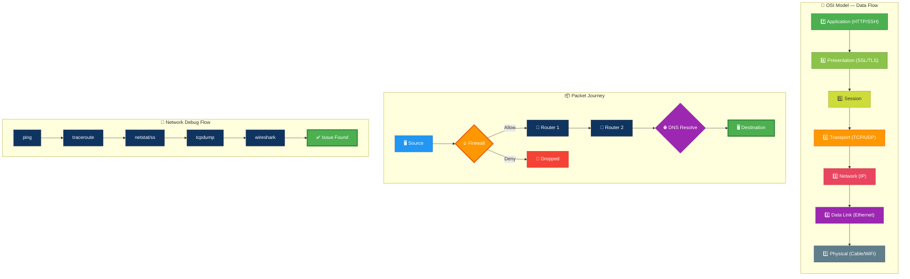
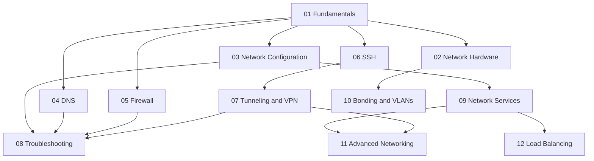

# Linux Networking Guide

> A production-quality reference from basic concepts to advanced Linux networking operations.
>
> Audience: administrators, DevOps engineers, SREs, platform engineers, students, and anyone building or troubleshooting Linux networks.

---

## 🎬 Network Packet Journey — Animated Workflow

---

## Overview

This guide has been split into focused topic files so you can study progressively or jump straight to the area you need. Labs, checklists, practical scenarios, and quick-reference material were redistributed into the most relevant files.

## Learning Path

## Table of Contents

1. [01 Fundamentals](./01-fundamentals.md) — OSI model, TCP/IP, IP addressing, subnetting, CIDR, ports, protocols, and core concepts.
2. [02 Network Hardware](./02-network-hardware.md) — switches, routers, hubs, firewalls, load balancers, and infrastructure troubleshooting.
3. [03 Network Configuration](./03-network-configuration.md) — `ip addr`, `nmcli`, Netplan, routing, DHCP, static addressing, and persistence methods.
4. [04 DNS](./04-dns.md) — resolver behavior, `resolv.conf`, `dig`, `nslookup`, BIND, DNS scenarios, and DNS checklists.
5. [05 Firewall](./05-firewall.md) — `iptables`, `nftables`, `firewalld`, `ufw`, NAT, firewall operations, and safety checklists.
6. [06 SSH](./06-ssh.md) — `ssh`, `sshd_config`, keys, bastions, `ProxyJump`, file transfer, and SSH hardening.
7. [07 Tunneling and VPN](./07-tunneling-and-vpn.md) — SSH tunnels, TUN/TAP, GRE/VXLAN concepts, OpenVPN, WireGuard, and tunnel scenarios.
8. [08 Network Troubleshooting](./08-network-troubleshooting.md) — `ping`, `traceroute`, `tcpdump`, `nmap`, `ss`, incident workflows, and operator notes.
9. [09 Network Services](./09-network-services.md) — HTTP, FTP, NFS, Samba, DHCP, reverse proxies, and service deployment checklists.
10. [10 Bonding and VLANs](./10-bonding-and-vlans.md) — bond modes, LACP, VLAN tagging, bridges, and virtualization connectivity.
11. [11 Advanced Networking](./11-advanced-networking.md) — namespaces, veth, NAT, forwarding, policy routing, traffic shaping, and cloud/container notes.
12. [12 Load Balancing](./12-load-balancing.md) — HAProxy, Nginx load balancing, Keepalived, health checks, and HA patterns.

## What This Guide Covers

- Network models and addressing
- Linux interface and route configuration
- DNS resolver behavior and server setup
- Firewall technologies and packet flow
- SSH usage and secure remote access
- Troubleshooting tools and structured workflows
- Common network services
- Bonding, VLANs, and bridging
- Namespaces, NAT, forwarding, and traffic shaping
- VPNs with OpenVPN and WireGuard
- Load balancing with HAProxy, Nginx, and Keepalived
