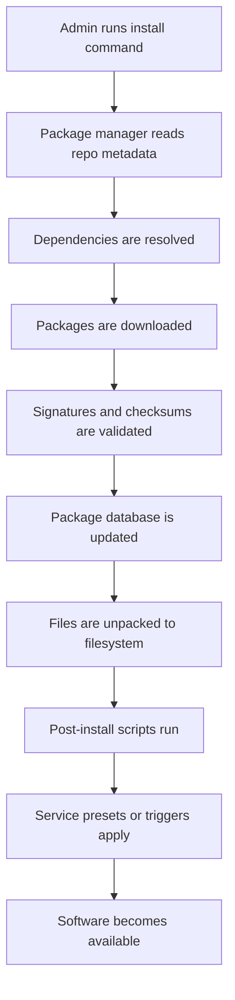

# Package Management

`apt` (Advanced Package Tool), `dpkg` (Debian Package), `yum` (Yellowdog Updater Modified), `dnf` (Dandified YUM), and `rpm` (Red Hat Package Manager) are the package-management names you will see most often in this chapter.

---

Package management is the process of installing, updating, verifying, and removing software in a controlled and reproducible way.

A good administrator understands:
- Which package manager is native to the distribution.
- The difference between high-level and low-level package tools.
- How dependencies are resolved.
- How to verify package integrity.
- How to query package ownership for files.
- How to work with repositories safely.

## 1.1 Package manager families

The Linux ecosystem commonly uses these package management stacks:
- Debian and Ubuntu: `apt` and `dpkg`.
- RHEL, Rocky, AlmaLinux, Fedora, CentOS Stream: `dnf` or `yum` with `rpm`.
- Arch Linux: `pacman`.
- openSUSE and SUSE Linux Enterprise: `zypper`.
- Universal or cross-distribution formats: `snap`, `flatpak`, and AppImage.

## 1.2 Comparison table

| Distribution family | High-level tool | Low-level tool | Package format | Dependency resolution | Typical repo config |
|---|---|---|---|---|---|
| Debian / Ubuntu | `apt` | `dpkg` | `.deb` | Yes | `/etc/apt/sources.list`, `/etc/apt/sources.list.d/` |
| RHEL / Fedora | `dnf` or `yum` | `rpm` | `.rpm` | Yes | `/etc/yum.repos.d/` |
| Arch | `pacman` | `pacman` | `.pkg.tar.zst` | Yes | `/etc/pacman.conf` |
| SUSE | `zypper` | `rpm` | `.rpm` | Yes | `/etc/zypp/repos.d/` |
| Snap | `snap` | managed internally | `.snap` | Yes | Snap store or brand store |
| Flatpak | `flatpak` | managed internally | Flatpak bundle/runtime | Yes | Remotes like Flathub |
| AppImage | direct execution | none | `.AppImage` | Bundled by app | No central repo required |

## 1.3 Package installation flow



## 1.4 Debian and Ubuntu: apt and dpkg

### 1.4.1 apt basics

`apt` is the high-level package management interface for Debian-derived systems.

Common commands:

```bash
sudo apt update
sudo apt install nginx
sudo apt remove nginx
sudo apt purge nginx
sudo apt autoremove
sudo apt full-upgrade
sudo apt search rsync
apt show openssh-server
```

Key ideas:
- `apt update` refreshes repository metadata.
- `apt install` installs packages and required dependencies.
- `apt remove` removes the package but usually keeps config files.
- `apt purge` removes package files and package-managed configuration files.
- `apt autoremove` cleans unused dependencies.
- `apt full-upgrade` can add or remove packages as needed to complete a full upgrade.

Practical workflow:

```bash
sudo apt update && sudo apt full-upgrade -y
sudo apt install -y curl vim git htop
```

Useful query examples:

```bash
apt list --installed
apt list --upgradable
apt-cache policy openssl
apt-cache depends docker.io
apt-cache rdepends systemd
```

### 1.4.2 dpkg basics

`dpkg` works at the local package level and does not resolve dependencies automatically.

Useful commands:

```bash
sudo dpkg -i package.deb
sudo dpkg -r package-name
sudo dpkg -P package-name
dpkg -l
dpkg -L bash
dpkg -S /bin/ls
dpkg -s openssh-client
```

When to use `dpkg`:
- Installing a local `.deb` file.
- Querying which package owns a file.
- Listing files installed by a package.
- Inspecting package metadata.

Dependency fix after manual install:

```bash
sudo dpkg -i custom-package.deb || sudo apt -f install
```

### 1.4.3 APT repository management

Repository definitions are typically stored in:
- `/etc/apt/sources.list`
- `/etc/apt/sources.list.d/*.list`
- `/etc/apt/sources.list.d/*.sources`

Best practices:
- Prefer vendor-provided repositories.
- Avoid mixing incompatible releases.
- Use signed repositories only.
- Document any non-default repository added to production systems.

Example source entry:

```text
deb http://archive.ubuntu.com/ubuntu jammy main universe multiverse restricted
```

Repository maintenance commands:

```bash
sudo add-apt-repository ppa:some/ppa
sudo apt update
```

GPG trust matters.
Do not blindly import keys from untrusted sources.

### 1.4.4 Package troubleshooting on Debian-based systems

Common fixes:

```bash
sudo apt --fix-broken install
sudo dpkg --configure -a
sudo apt clean
sudo apt autoclean
sudo apt update --fix-missing
```

Check lock issues carefully.
Another package manager process may already be running.

Verify package contents:

```bash
debsums -s
```

Verify service impact after upgrades:

```bash
sudo needrestart
```

## 1.5 RHEL, Fedora, Rocky, AlmaLinux: dnf, yum, rpm

### 1.5.1 dnf basics

`dnf` is the modern package manager for Fedora and current RHEL-family systems.
Older systems may still use `yum` commands, many of which map to `dnf`.

Common commands:

```bash
sudo dnf check-update
sudo dnf install nginx
sudo dnf remove nginx
sudo dnf upgrade
sudo dnf search rsync
dnf info openssh-server
sudo dnf group list
sudo dnf groupinstall "Development Tools"
```

Useful admin tasks:

```bash
sudo dnf repolist
sudo dnf module list
sudo dnf module enable nodejs:18
sudo dnf module install nodejs:18/common
```

Important concepts:
- Repositories are defined under `/etc/yum.repos.d/`.
- Metadata can be cached locally.
- Modular content may affect what versions are installable.

### 1.5.2 yum compatibility

On older enterprise Linux systems you may still see:

```bash
sudo yum install httpd
sudo yum update
sudo yum remove httpd
```

When working in legacy estates:
- Confirm the OS release.
- Confirm whether `yum` is a wrapper to `dnf`.
- Be mindful of subscription and repository entitlements.

### 1.5.3 rpm basics

`rpm` is the low-level package tool used by RPM-based systems.
It can query and install local packages, but dependency resolution is limited compared with `dnf`.

Common commands:

```bash
sudo rpm -ivh package.rpm
sudo rpm -Uvh package.rpm
sudo rpm -e package-name
rpm -qa
rpm -qi bash
rpm -ql bash
rpm -qf /usr/bin/ssh
rpm -V bash
```

Meaning of selected flags:
- `-i` installs a package.
- `-U` upgrades or installs.
- `-v` is verbose output.
- `-h` shows progress hashes.
- `-V` verifies installed files against RPM database metadata.

### 1.5.4 Repository management on RPM systems

Repository files are commonly stored in `/etc/yum.repos.d/`.

Example repo file snippet:

```ini
[example-repo]
name=Example Repository
baseurl=https://repo.example.com/rpm/$releasever/$basearch
enabled=1
gpgcheck=1
gpgkey=https://repo.example.com/RPM-GPG-KEY-example
```

Repository inspection:

```bash
dnf repolist all
dnf config-manager --set-enabled crb
dnf clean all
```

### 1.5.5 Troubleshooting RPM-based package issues

Useful commands:

```bash
sudo dnf clean all
sudo dnf makecache
sudo rpm --rebuilddb
sudo dnf distro-sync
```

If a package version mismatch occurs:
- Check enabled repositories.
- Check module streams.
- Check exclusions in config files.
- Check subscription status on enterprise systems.

## 1.6 Arch Linux: pacman

`pacman` is both the package manager and the package database interface for Arch Linux.

Common commands:

```bash
sudo pacman -Syu
sudo pacman -S nginx
sudo pacman -R nginx
sudo pacman -Rns nginx
pacman -Ss rsync
pacman -Qi bash
pacman -Ql bash
pacman -Qo /usr/bin/ls
```

Important flags:
- `-S` sync and install.
- `-Sy` refresh databases.
- `-Syu` refresh and fully upgrade.
- `-R` remove.
- `-Rns` remove package, dependencies, and config-like leftovers when applicable.
- `-Q` query installed packages.

Cache management:

```bash
sudo pacman -Sc
sudo pacman -Scc
```

Package files can be installed locally:

```bash
sudo pacman -U some-package.pkg.tar.zst
```

Notes for production-like use:
- Arch is fast-moving.
- Read upgrade notices before large updates.
- Avoid partial upgrades.
- Keep backup and rollback plans for critical systems.

## 1.7 SUSE and openSUSE: zypper

`zypper` is the package manager for SUSE family systems.

Common commands:

```bash
sudo zypper refresh
sudo zypper update
sudo zypper install nginx
sudo zypper remove nginx
zypper search rsync
zypper info openssh
zypper repos
```

Repository management:

```bash
sudo zypper ar https://download.example.com/repo example-repo
sudo zypper rr example-repo
sudo zypper mr -e example-repo
```

Patch management:

```bash
sudo zypper patch
sudo zypper list-patches
```

`zypper` is strong in enterprise maintenance workflows and clear repository handling.

## 1.8 Snap

Snap packages are self-contained and managed by the `snapd` service.

Commands:

```bash
snap list
sudo snap install hello-world
sudo snap refresh
sudo snap remove hello-world
snap info code
```

Characteristics:
- Sandboxed by design.
- Automatic updates by default.
- Good for desktop apps and some server tools.
- Can feel slower at startup in some cases.
- Uses mounted squashfs packages under `/snap`.

Operational considerations:
- Confirm whether your environment allows automatic updates.
- Understand confinement mode.
- Monitor disk use from multiple revisions.

## 1.9 Flatpak

Flatpak is common on desktops and developer workstations.

Commands:

```bash
flatpak remotes
flatpak search org.gimp.GIMP
flatpak install flathub org.gimp.GIMP
flatpak run org.gimp.GIMP
flatpak update
flatpak uninstall org.gimp.GIMP
```

Characteristics:
- Uses runtimes shared across applications.
- Better suited to desktop software than classic servers.
- Strong isolation model.

Admin notes:
- Per-user vs system-wide installations matter.
- Remote trust and policy should be documented.

## 1.10 AppImage

AppImage is not a package manager.
It is a portable executable application image.

Usage:

```bash
chmod +x SomeApp.AppImage
./SomeApp.AppImage
```

Operational trade-offs:
- Easy to distribute.
- No dependency resolution in the OS package database.
- Harder to inventory centrally.
- Harder to patch at scale.

Use AppImage when portability matters more than centralized management.

## 1.11 Package verification and file ownership

Find which package owns a file:

Debian-based:

```bash
dpkg -S /usr/bin/ssh
```

RPM-based:

```bash
rpm -qf /usr/bin/ssh
```

Arch:

```bash
pacman -Qo /usr/bin/ssh
```

List package files:

Debian-based:

```bash
dpkg -L openssh-client
```

RPM-based:

```bash
rpm -ql openssh-clients
```

Arch:

```bash
pacman -Ql openssh
```

## 1.12 Package management best practices

- Always refresh metadata before major installs.
- Prefer OS-native packages for core services.
- Avoid manually compiling into `/usr` when a package exists.
- Pin or hold packages only with documented justification.
- Mirror or cache repositories in controlled environments.
- Verify signatures.
- Record repository changes in configuration management.
- Test updates before applying to all nodes.
- Monitor post-upgrade service health.
- Keep package inventories for audits.

## 1.13 Safe package maintenance workflow

1. Identify the system distribution and version.
2. Refresh metadata.
3. Review pending updates.
4. Check changelogs for critical packages.
5. Snapshot or back up if the system is important.
6. Apply updates in a maintenance window if required.
7. Restart services only when needed and understood.
8. Validate the application.
9. Document the change.

## 1.14 Example package manager decision guide

Use native repositories when:
- You need predictable patching.
- You need compliance and inventory.
- You want integration with OS dependency management.

Use Snap or Flatpak when:
- Desktop app isolation matters.
- The application is not available in native repos.
- Independent app delivery cadence is beneficial.

Use AppImage when:
- You need single-file portability.
- You accept weaker central management.

---

## 12.5 Patch window checklist

- Confirm maintenance window.
- Confirm backups.
- Review pending updates.
- Review reboot requirement.
- Notify stakeholders.
- Apply updates.
- Reboot if required.
- Validate services.
- Check logs and alerts.
- Record outcome.

---

## 13.1 Package commands reference

### Debian and Ubuntu
- `apt update`
- `apt upgrade`
- `apt full-upgrade`
- `apt install <pkg>`
- `apt remove <pkg>`
- `apt purge <pkg>`
- `apt autoremove`
- `apt search <term>`
- `apt show <pkg>`
- `apt list --installed`
- `apt list --upgradable`
- `apt-cache policy <pkg>`
- `apt-cache depends <pkg>`
- `apt-cache rdepends <pkg>`
- `dpkg -i file.deb`
- `dpkg -r <pkg>`
- `dpkg -P <pkg>`
- `dpkg -l`
- `dpkg -L <pkg>`
- `dpkg -S /path/to/file`
- `dpkg -s <pkg>`
- `apt --fix-broken install`
- `dpkg --configure -a`
- `apt clean`
- `apt autoclean`

### RHEL, Fedora, Rocky, AlmaLinux
- `dnf check-update`
- `dnf install <pkg>`
- `dnf remove <pkg>`
- `dnf upgrade`
- `dnf search <term>`
- `dnf info <pkg>`
- `dnf repolist`
- `dnf module list`
- `dnf module enable <module:stream>`
- `dnf module install <module:stream/profile>`
- `dnf distro-sync`
- `dnf clean all`
- `dnf makecache`
- `rpm -qa`
- `rpm -qi <pkg>`
- `rpm -ql <pkg>`
- `rpm -qf /path/to/file`
- `rpm -V <pkg>`
- `rpm -ivh file.rpm`
- `rpm -Uvh file.rpm`
- `rpm -e <pkg>`
- `rpm --rebuilddb`

### Arch Linux
- `pacman -Syu`
- `pacman -S <pkg>`
- `pacman -R <pkg>`
- `pacman -Rns <pkg>`
- `pacman -Ss <term>`
- `pacman -Qi <pkg>`
- `pacman -Ql <pkg>`
- `pacman -Qo /path/to/file`
- `pacman -Sc`
- `pacman -Scc`
- `pacman -U file.pkg.tar.zst`

### SUSE and openSUSE
- `zypper refresh`
- `zypper update`
- `zypper install <pkg>`
- `zypper remove <pkg>`
- `zypper search <term>`
- `zypper info <pkg>`
- `zypper repos`
- `zypper ar <url> <alias>`
- `zypper rr <alias>`
- `zypper mr -e <alias>`
- `zypper patch`
- `zypper list-patches`

### Universal formats
- `snap list`
- `snap info <pkg>`
- `snap install <pkg>`
- `snap refresh`
- `snap remove <pkg>`
- `flatpak remotes`
- `flatpak search <term>`
- `flatpak install <remote> <app>`
- `flatpak run <app>`
- `flatpak update`
- `flatpak uninstall <app>`
- `chmod +x file.AppImage`
- `./file.AppImage`

---

## B.1 Package management quick reminders
- Always identify the distribution before running package commands.
- Never mix random third-party repositories on production without review.
- Review change windows for kernel, libc, OpenSSL, and database package updates.
- Prefer `apt full-upgrade` only when you understand package removals.
- Prefer `dnf distro-sync` when aligning system state to enabled repositories.
- Avoid partial upgrades on rolling distributions.
- Track package holds and pins in version control.
- Verify repository GPG keys through trusted channels.
- Clean stale caches when troubleshooting metadata problems.
- Confirm service restarts after major package updates.
- Use package queries to locate ownership of suspicious files.
- Remove orphaned dependencies periodically.
- Mirror repositories for controlled environments when feasible.
- Audit installed packages on hardened systems.
- Record exceptions to standard package sources.

---

### Package inspection examples
```bash
apt-cache policy openssh-server
dnf repoquery --requires nginx
rpm -q --changelog openssl | head
pacman -Qi systemd
zypper se -s nginx
```

---

## B.23 Extended distro-specific examples
- Ubuntu security updates can be reviewed with `unattended-upgrades --dry-run --debug` when the package is installed.
- Debian administrators often separate `main`, `contrib`, and `non-free` repository decisions by policy.
- Fedora administrators should be aware of modular streams and fast package cadence.
- RHEL-family administrators should understand AppStream and BaseOS repository separation.
- Arch administrators should review news items before full upgrades.
- SUSE administrators should track repository priorities and patch channels.
- Cross-platform fleet administrators should document command equivalents for every standard workflow.
- Package naming differences matter, especially for Python, PHP, and database packages.
- Default service names may differ across distributions even when functionality is equivalent.
- Log file paths and SSH unit names can differ by platform.
- Firewall tool defaults differ between Ubuntu, RHEL-family, and SUSE-based systems.
- SELinux is commonly central on RHEL-family systems, while AppArmor is more common on Ubuntu.
- Initramfs tooling differs and should be validated before low-level changes.
- Bootloader file locations differ and can surprise mixed-environment teams.
- Build internal standards that abstract those differences without hiding them completely.

---

## B.24 More package management examples
```bash
apt-mark hold kubelet kubeadm kubectl
apt-mark unhold kubelet kubeadm kubectl
dnf versionlock list
pacman -Qdt
zypper ps
flatpak list
snap changes
```
- Use package hold mechanisms sparingly and document why they exist.
- Review held packages during every maintenance cycle.
- A package lock can protect a business-critical version during vendor certification windows.
- A forgotten hold can also silently prevent security updates.
- Package post-install scripts may create users, directories, systemd units, and temporary files.
- Always review service exposure after a new package install.
- Query changelogs before major upgrades where practical.
- Treat repository drift as configuration drift.
- Keep a known-good baseline for critical servers.
- Prefer immutable image patterns for large fleets when operationally possible.
