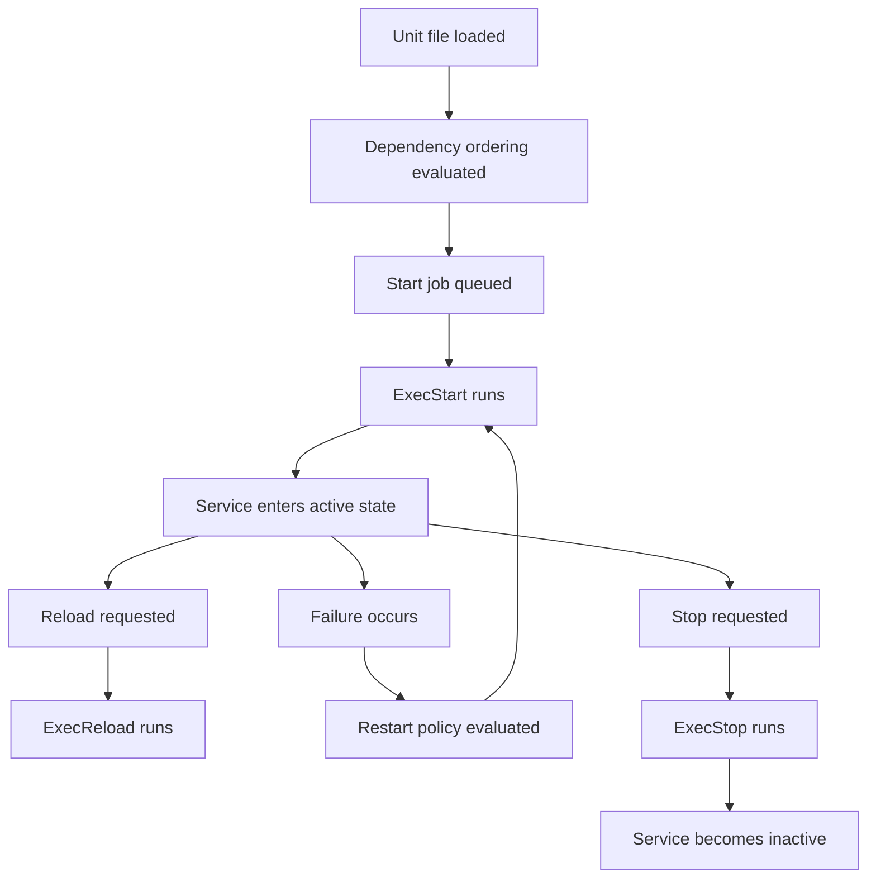

# Service Management with systemd

---

`systemd` is the standard init and service manager on most modern Linux distributions.
It is responsible for:
- Boot sequencing.
- Service supervision.
- Logging integration through `journald`.
- Timers.
- Sockets.
- Targets.
- Resource control and dependency ordering.

## 2.1 Core concepts

Important unit types:
- `service`
- `socket`
- `target`
- `mount`
- `automount`
- `timer`
- `path`
- `device`
- `slice`
- `scope`

A unit is a systemd object represented by a configuration file.

Common locations:
- `/usr/lib/systemd/system/`
- `/lib/systemd/system/`
- `/etc/systemd/system/`
- `/run/systemd/system/`

Precedence matters.
Administrator overrides under `/etc/systemd/system/` take priority over vendor defaults.

## 2.2 systemctl essentials

View service state:

```bash
systemctl status sshd
systemctl status nginx
```

Start and stop services:

```bash
sudo systemctl start nginx
sudo systemctl stop nginx
sudo systemctl restart nginx
sudo systemctl reload nginx
```

Enable or disable services at boot:

```bash
sudo systemctl enable nginx
sudo systemctl disable nginx
sudo systemctl is-enabled nginx
```

Mask or unmask services:

```bash
sudo systemctl mask telnet.socket
sudo systemctl unmask telnet.socket
```

List units:

```bash
systemctl list-units --type=service
systemctl list-unit-files --type=service
```

Check failures:

```bash
systemctl --failed
```

## 2.3 systemd unit lifecycle



## 2.4 Understanding service states

Common states:
- `active (running)` means the service is running.
- `active (exited)` often means a one-shot task completed successfully.
- `inactive` means not running.
- `failed` means startup or runtime failure tracked by systemd.
- `activating` means startup is in progress.
- `deactivating` means shutdown is in progress.

Useful checks:

```bash
systemctl is-active nginx
systemctl is-failed nginx
```

## 2.5 journalctl basics

`journalctl` queries the systemd journal.

Common usage:

```bash
journalctl
journalctl -u nginx
journalctl -u sshd -b
journalctl -xe
journalctl --since "2024-01-01 10:00:00"
journalctl --since yesterday
journalctl -p err..alert
journalctl -f
```

Helpful flags:
- `-u` filters by unit.
- `-b` limits to the current boot.
- `-p` filters by priority.
- `-f` follows live logs.
- `-xe` shows explanatory context.

Persistent journals may require configuration.
Check `/etc/systemd/journald.conf`.

## 2.6 Targets

Targets replace many historical runlevel use cases.

Examples:
- `multi-user.target`
- `graphical.target`
- `rescue.target`
- `emergency.target`
- `network-online.target`

Inspect default target:

```bash
systemctl get-default
```

Set default target:

```bash
sudo systemctl set-default multi-user.target
```

Switch targets immediately:

```bash
sudo systemctl isolate rescue.target
```

Use caution with `isolate` on remote systems.
You can lock yourself out.

## 2.7 Custom service unit file creation

A common sysadmin task is deploying a custom service.

Example Python web service unit:

```ini
[Unit]
Description=Example Python API
After=network.target
Wants=network-online.target

[Service]
Type=simple
User=appuser
Group=appuser
WorkingDirectory=/opt/example-api
Environment=PORT=8080
ExecStart=/usr/bin/python3 /opt/example-api/app.py
Restart=on-failure
RestartSec=5
NoNewPrivileges=yes
PrivateTmp=yes
ProtectSystem=full
ProtectHome=yes

[Install]
WantedBy=multi-user.target
```

Save as:

```text
/etc/systemd/system/example-api.service
```

Then run:

```bash
sudo systemctl daemon-reload
sudo systemctl enable --now example-api.service
systemctl status example-api.service
journalctl -u example-api.service -f
```

Key directives explained:
- `Description` documents the unit.
- `After` controls ordering.
- `Wants` expresses a weaker dependency.
- `User` and `Group` avoid running as root unnecessarily.
- `WorkingDirectory` sets the service working path.
- `Environment` injects environment variables.
- `ExecStart` defines the main process.
- `Restart` specifies recovery behavior.
- `NoNewPrivileges`, `PrivateTmp`, `ProtectSystem`, and `ProtectHome` add hardening.
- `WantedBy` determines how enabling creates symlinks.

## 2.8 Unit file inspection and overrides

Show vendor unit content:

```bash
systemctl cat sshd.service
```

Show full property list:

```bash
systemctl show nginx
```

Create an override without editing vendor files directly:

```bash
sudo systemctl edit nginx
```

Example override:

```ini
[Service]
LimitNOFILE=65535
Environment=APP_ENV=production
```

This creates a drop-in under:

```text
/etc/systemd/system/nginx.service.d/override.conf
```

Best practice:
- Never edit packaged unit files in `/usr/lib/systemd/system/` unless you fully manage the consequence.
- Use drop-ins for upgrades to remain clean.

## 2.9 Timers

Systemd timers are a modern alternative to cron for many recurring tasks.

Example timer pair.

Service file:

```ini
[Unit]
Description=Run backup script

[Service]
Type=oneshot
ExecStart=/usr/local/bin/backup.sh
```

Timer file:

```ini
[Unit]
Description=Daily backup timer

[Timer]
OnCalendar=daily
Persistent=true
RandomizedDelaySec=300

[Install]
WantedBy=timers.target
```

Commands:

```bash
sudo systemctl daemon-reload
sudo systemctl enable --now backup.timer
systemctl list-timers
```

Why timers can be better than cron:
- Strong integration with logs.
- Native dependency handling.
- Missed runs can be caught up with `Persistent=true`.
- Clear status via `systemctl`.

## 2.10 Socket activation

Socket activation means systemd listens on a socket and starts the service when traffic arrives.

Benefits:
- Faster boot.
- Delayed resource usage.
- Better service startup orchestration.

Common examples:
- `sshd.socket` on some systems.
- On-demand internal daemons.

Check socket units:

```bash
systemctl list-units --type=socket
```

## 2.11 systemd-analyze

`systemd-analyze` helps diagnose boot performance and unit timing.

Useful commands:

```bash
systemd-analyze
systemd-analyze blame
systemd-analyze critical-chain
systemd-analyze verify /etc/systemd/system/example-api.service
```

Use cases:
- Finding slow boot services.
- Validating unit file syntax.
- Understanding dependency impact.

## 2.12 Troubleshooting systemd services

Checklist:
- Check `systemctl status <unit>`.
- Check `journalctl -u <unit>`.
- Verify executable path exists.
- Verify permissions.
- Verify environment variables.
- Verify port conflicts.
- Verify the service works manually outside systemd.
- Verify SELinux or AppArmor policy if enforced.
- Check restart loops.

Common problems:
- Wrong `ExecStart` path.
- Running as wrong user.
- Missing working directory.
- PID file mismatch for legacy forking daemons.
- Timeout waiting for a daemonized process.
- Dependencies ordered incorrectly.

## 2.13 Service management best practices

- Use least privilege.
- Prefer one process per service unit unless intentionally supervised otherwise.
- Use `Restart=on-failure` for resilient stateless services.
- Use environment files for configurable values.
- Keep vendor units untouched.
- Log to stdout and stderr where possible.
- Add hardening directives for custom services.
- Monitor failed units.
- Test service behavior after upgrades.
- Version control unit files if you manage them as code.

---

## 12.2 Service deployment checklist

- Confirm package source or binary provenance.
- Create service user.
- Create directories with correct ownership.
- Deploy config.
- Add systemd unit.
- Reload systemd.
- Start service.
- Check status and logs.
- Enable at boot.
- Open firewall only if needed.
- Validate health endpoint or functional test.

---

## 13.2 systemd commands reference

- `systemctl status <unit>`
- `systemctl start <unit>`
- `systemctl stop <unit>`
- `systemctl restart <unit>`
- `systemctl reload <unit>`
- `systemctl enable <unit>`
- `systemctl disable <unit>`
- `systemctl mask <unit>`
- `systemctl unmask <unit>`
- `systemctl is-active <unit>`
- `systemctl is-enabled <unit>`
- `systemctl --failed`
- `systemctl list-units --type=service`
- `systemctl list-unit-files --type=service`
- `systemctl cat <unit>`
- `systemctl show <unit>`
- `systemctl edit <unit>`
- `systemctl daemon-reload`
- `systemctl get-default`
- `systemctl set-default <target>`
- `systemctl isolate <target>`
- `systemctl list-timers --all`
- `journalctl -u <unit>`
- `journalctl -b`
- `journalctl -k`
- `journalctl -xe`
- `journalctl -f`
- `journalctl -p err..alert`
- `systemd-analyze`
- `systemd-analyze blame`
- `systemd-analyze critical-chain`
- `systemd-analyze verify <unitfile>`
- `systemd-cgls`
- `systemd-cgtop`

---

## B.2 systemd quick reminders
- `daemon-reload` is required after unit file changes.
- `enable --now` both enables and starts a unit.
- A failed service may be repeatedly restarted depending on policy.
- `journalctl -u unit -b` is the fastest way to inspect recent startup logs.
- Use drop-in overrides instead of editing vendor units.
- Use `systemd-analyze verify` for custom unit syntax checks.
- Prefer `Type=simple` unless a service truly forks or notifies.
- Use `EnvironmentFile=` for large environment sets.
- Use `ProtectSystem`, `PrivateTmp`, and `NoNewPrivileges` on custom services.
- Use timers for recurring jobs that need visibility.
- Be careful with `isolate` on remote systems.
- Remember that masked units cannot be started normally.
- Check dependencies when a unit seems to start in the wrong order.
- Use `systemctl reset-failed` after resolving some failure cases.
- Review `RestartSec` to avoid rapid crash loops.

---

### Service inspection examples
```bash
systemctl show nginx -p FragmentPath -p MainPID -p ActiveState
journalctl -u nginx --since -30m
systemctl list-dependencies multi-user.target
systemctl cat sshd.service
```

---

## B.16 Mini runbook: service down
1. Confirm whether the service process exists.
2. Check `systemctl status`.
3. Check recent logs with `journalctl -u`.
4. Confirm config syntax if applicable.
5. Confirm port availability.
6. Confirm dependency health.
7. Restart only after understanding likely cause.
8. Validate functionality after recovery.
9. Review restart policy and monitoring.
10. Document findings.

---

### Service cluster
- `systemctl --failed`
- `systemctl status <svc>`
- `journalctl -u <svc> -b`
- `systemctl list-timers --all`

---

## B.25 More systemd examples
```bash
systemctl list-dependencies sshd.service
systemctl show sshd.service -p After -p Wants -p Requires
systemctl show-environment
loginctl list-sessions
loginctl terminate-session <id>
```
- `loginctl` helps manage user sessions on systemd systems.
- Dependencies matter as much as the service definition itself.
- Ordering does not always imply requirement.
- Requirement does not always imply ordering.
- Use `Wants` for softer relationships and `Requires` for hard ones.
- Use `After` and `Before` for ordering.
- Use `ConditionPathExists=` when a service depends on a file or path presence.
- Use `ExecStartPre=` and `ExecStartPost=` for carefully bounded helper steps.
- Keep unit files readable and explicit.
- Test service startup on a clean reboot path, not only manual restarts.
