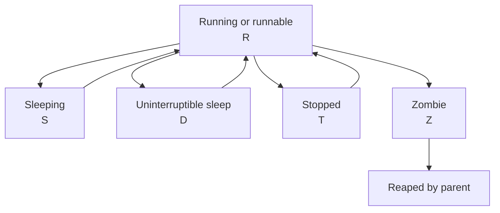

# Process Management

---

A process is an executing instance of a program.
Good process management helps you understand performance, stability, and safety on a Linux host.

## 3.1 Process identifiers and hierarchy

Every process has:
- PID: process ID.
- PPID: parent process ID.
- UID and GID context.
- Scheduling priority.
- State.
- Open files and memory mappings.

The kernel maintains a process tree.
View it with:

```bash
ps -ef --forest
pstree -p
```

## 3.2 ps usage

`ps` is the standard process listing tool.

Common patterns:

```bash
ps aux
ps -ef
ps -eo pid,ppid,user,%cpu,%mem,stat,cmd --sort=-%cpu | head
ps -C nginx -o pid,cmd
```

Field meanings:
- `%CPU` is CPU usage.
- `%MEM` is memory usage percentage.
- `STAT` is process state and flags.
- `CMD` is the full command.

Useful filters:

```bash
ps -u www-data
ps -p 1234 -o pid,ppid,stat,etime,cmd
```

## 3.3 top and htop

`top` shows dynamic process activity.

Launch:

```bash
top
```

Common `top` keys:
- `P` sort by CPU.
- `M` sort by memory.
- `k` kill a process.
- `r` renice a process.
- `1` show per-CPU view.
- `H` show threads.

`htop` provides a friendlier UI.

```bash
htop
```

Advantages of `htop`:
- Better navigation.
- Easier filtering.
- Tree display.
- Colorized metrics.

## 3.4 Signals and termination

Processes are controlled using signals.

Common commands:

```bash
kill -TERM 1234
kill -KILL 1234
kill -HUP 1234
pkill nginx
pkill -f gunicorn
killall ssh-agent
```

Common signals:
- `SIGTERM` asks a process to stop gracefully.
- `SIGKILL` forcibly terminates the process.
- `SIGHUP` often reloads configuration.
- `SIGINT` interrupts the process.
- `SIGSTOP` pauses execution.
- `SIGCONT` resumes execution.

Best practice:
- Try `SIGTERM` first.
- Use `SIGKILL` only when the process is hung or cannot be terminated gracefully.

## 3.5 pkill and killall caveats

`pkill` and `killall` are convenient but can be dangerous.

Safer patterns:

```bash
pgrep -a nginx
pkill -TERM -x nginx
pgrep -f myscript.py
pkill -TERM -f "/opt/app/bin/server"
```

Always preview the target when possible.
Name matching can catch more processes than you expect.

## 3.6 Background and job control

In an interactive shell you can manage jobs with:
- `&`
- `jobs`
- `bg`
- `fg`
- `nohup`

Examples:

```bash
long-running-command &
jobs
fg %1
bg %1
nohup ./backup.sh > backup.log 2>&1 &
```

Use job control only for short-lived admin work.
For persistent services, use systemd.

## 3.7 nice and renice

Scheduling niceness affects CPU priority for normal processes.

Start with a lower priority:

```bash
nice -n 10 tar -czf backup.tar.gz /srv/data
```

Change an existing process priority:

```bash
sudo renice 5 -p 1234
```

Interpretation:
- Lower nice value means higher priority.
- Higher nice value means lower priority.
- Range is typically `-20` to `19`.

Real-time scheduling is different and more advanced.
Use carefully.

## 3.8 /proc filesystem overview

`/proc` exposes kernel and process information.
It is a virtual filesystem.

Useful paths:
- `/proc/cpuinfo`
- `/proc/meminfo`
- `/proc/loadavg`
- `/proc/uptime`
- `/proc/partitions`
- `/proc/<PID>/status`
- `/proc/<PID>/cmdline`
- `/proc/<PID>/environ`
- `/proc/<PID>/fd/`
- `/proc/<PID>/maps`

Examples:

```bash
cat /proc/meminfo
cat /proc/loadavg
cat /proc/1234/status
ls -l /proc/1234/fd
tr '\0' ' ' < /proc/1234/cmdline
```

## 3.9 Process states



Common state letters in `ps`:
- `R` running or runnable.
- `S` interruptible sleep.
- `D` uninterruptible sleep, often I/O wait.
- `T` stopped or traced.
- `Z` zombie.
- `I` idle kernel thread on some systems.

A zombie is already dead but not yet reaped by its parent.
The fix is usually at the parent process level.

## 3.10 Finding resource-heavy processes

Top CPU processes:

```bash
ps -eo pid,user,%cpu,%mem,cmd --sort=-%cpu | head -20
```

Top memory processes:

```bash
ps -eo pid,user,%mem,rss,cmd --sort=-%mem | head -20
```

Open files by process:

```bash
lsof -p 1234
```

Processes listening on ports:

```bash
ss -tulpn
lsof -i :80
```

## 3.11 cgroups and process resource control

On systemd-based systems, services are typically placed into cgroups automatically.
This allows grouping and accounting of resources.

Useful commands:

```bash
systemd-cgls
systemd-cgtop
```

Benefits:
- Better service-level resource visibility.
- CPU, memory, and I/O limits.
- Stronger isolation.

## 3.12 Troubleshooting stuck processes

If a process does not respond:
1. Check state with `ps`.
2. Check what it is waiting on.
3. Check open files and sockets.
4. Check related logs.
5. Send `SIGTERM` first.
6. Use `SIGKILL` only if necessary.

Helpful tools:

```bash
strace -p 1234
lsof -p 1234
cat /proc/1234/stack
```

A process stuck in `D` state often indicates deeper I/O or kernel issues.
Killing it may not work until the kernel wait condition clears.

## 3.13 Practical examples

Restart a runaway process managed by systemd:

```bash
systemctl status myapp
journalctl -u myapp --since -10m
sudo systemctl restart myapp
```

Reduce CPU impact of a batch job:

```bash
nice -n 15 ionice -c2 -n7 rsync -a /data/ /backup/
```

Inspect a suspected memory leak:

```bash
ps -p 4321 -o pid,%mem,rss,vsz,etime,cmd
cat /proc/4321/status
lsof -p 4321 | wc -l
```

## 3.14 Process management best practices

- Prefer service supervisors over ad hoc background processes.
- Capture logs in a predictable place.
- Understand the signal model of major daemons.
- Audit processes listening on ports.
- Avoid force-killing unless justified.
- Monitor for zombies and repeated crashes.
- Use resource priorities on backup and batch workloads.
- Learn `/proc` and `lsof` for quick diagnostics.

---

## 13.3 Process commands reference

- `ps aux`
- `ps -ef`
- `ps -eo pid,ppid,user,%cpu,%mem,stat,cmd`
- `pstree -p`
- `top`
- `htop`
- `pgrep <name>`
- `pgrep -a <name>`
- `pkill <name>`
- `kill -TERM <pid>`
- `kill -KILL <pid>`
- `kill -HUP <pid>`
- `killall <name>`
- `nice -n 10 <cmd>`
- `renice 5 -p <pid>`
- `nohup <cmd> &`
- `jobs`
- `bg %1`
- `fg %1`
- `lsof -p <pid>`
- `ss -tulpn`
- `cat /proc/<pid>/status`
- `ls -l /proc/<pid>/fd`
- `tr '\0' ' ' < /proc/<pid>/cmdline`
- `strace -p <pid>`

---

## B.3 Process quick reminders
- Check `STAT` before killing a process.
- A `D` state process often indicates I/O wait and deeper system issues.
- Zombies are not fixed by killing the zombie itself.
- Use `pgrep -a` before using `pkill`.
- Prefer graceful termination first.
- Use `nohup` only for temporary work, not production services.
- Use `nice` and `ionice` for backup workloads.
- Check open files for deleted-but-still-open disk usage leaks.
- Use `/proc/<pid>/status` for fast process inspection.
- Use `ss -tulpn` to map services to ports.
- Use `lsof` when a filesystem refuses to unmount.
- Use `top` interactively during incidents.
- Use `pstree` to understand parent-child behavior.
- Validate signal behavior per application.
- Restart supervised services through the supervisor, not by killing the process alone.

---

### Process inspection examples
```bash
ps -eo pid,ppid,lstart,etime,stat,cmd | head -20
pgrep -af java
lsof -iTCP -sTCP:LISTEN -P -n
cat /proc/1/cgroup
```

---

## B.26 More process examples
```bash
ps -eo pid,ni,pri,psr,stat,comm --sort=-pri | head
chrt -p 1234
cat /proc/1234/limits
cat /proc/1234/io
```
- Real-time scheduling should be used only with deep understanding.
- CPU affinity and processor assignment can affect performance debugging.
- File descriptor limits can cause application failures before CPU or memory do.
- `/proc/<pid>/io` is helpful when investigating a process generating heavy disk traffic.
- `/proc/<pid>/limits` reveals process-level resource ceilings.
- Some applications trap `SIGHUP` for reload, but others do not.
- Always know how your service handles reload versus restart.
- Parent-child relationships can reveal process supervisors, wrappers, and crash loops.
- Thread-heavy applications may require thread-aware tools.
- Combine process evidence with service manager evidence.
