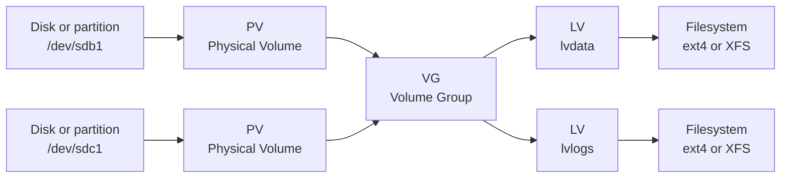

# Logical Volume Management (LVM)

> **📌 Disclaimer**: Any third-party logos, screenshots, or diagrams referenced in this document are used for educational purposes only. All trademarks belong to their respective owners.


LVM (Logical Volume Manager) organizes storage through PV (Physical Volume), VG (Volume Group), and LV (Logical Volume) layers, and tools such as `lsblk` help you confirm how those layers appear on disk.

---

## 4.7 LVM concepts

LVM stands for Logical Volume Manager.
It abstracts storage into flexible layers.

Layers:
- PV: physical volume.
- VG: volume group.
- LV: logical volume.

Benefits:
- Easier resizing.
- Snapshots.
- Flexible allocation across disks.
- Better storage abstraction.

## 4.8 LVM architecture

### 📸 LVM Architecture

> *Source: Wikimedia Commons — Logical Volume Manager architecture*



## 4.9 Creating LVM storage

Create physical volumes:

```bash
sudo pvcreate /dev/sdb1 /dev/sdc1
```

Create a volume group:

```bash
sudo vgcreate vgdata /dev/sdb1 /dev/sdc1
```

Create a logical volume:

```bash
sudo lvcreate -L 100G -n lvdata vgdata
```

Create a filesystem:

```bash
sudo mkfs.xfs /dev/vgdata/lvdata
```

Mount it:

```bash
sudo mkdir -p /data
sudo mount /dev/vgdata/lvdata /data
```

Persist it using `/etc/fstab`.

## 4.10 LVM inspection commands

```bash
pvs
vgs
lvs
pvdisplay
vgdisplay
lvdisplay
lsblk
```

These commands show size, free extents, attributes, and layout details.


```bash
$ pvs
# Expected output:
# PV         VG     Fmt  Attr PSize   PFree
# /dev/sdb1  vgdata lvm2 a--  100.00g 20.00g
# /dev/sdc1  vgdata lvm2 a--  100.00g 30.00g
```

```bash
$ vgs
# Expected output:
# VG     #PV #LV #SN Attr   VSize   VFree
# vgdata   2   2   1 wz--n- 199.99g 50.00g
```

```bash
$ lvs
# Expected output:
# LV          VG     Attr       LSize   Pool Origin Data%  Meta%  Move Log Cpy%Sync Convert
# lvdata      vgdata -wi-ao---- 120.00g
# lvdata_snap vgdata swi-a-s---  10.00g      lvdata 12.34
```

```bash
$ lsblk
# Expected output:
# NAME                MAJ:MIN RM  SIZE RO TYPE MOUNTPOINTS
# sdb                   8:16   0  100G  0 disk
# └─sdb1                8:17   0  100G  0 part
#   └─vgdata-lvdata   253:0    0  120G  0 lvm  /data
```

## 4.11 Extending LVM volumes

Extend the logical volume:

```bash
sudo lvextend -L +50G /dev/vgdata/lvdata
```

For ext4, grow filesystem:

```bash
sudo resize2fs /dev/vgdata/lvdata
```

For XFS, grow while mounted:

```bash
sudo xfs_growfs /data
```

One-step example with ext4:

```bash
sudo lvextend -r -L +50G /dev/vgdata/lvdata
```

`-r` attempts to resize the filesystem automatically.

## 4.12 Reducing LVM volumes

Reducing storage is riskier than extending it.

Rules:
- Back up first.
- Shrink the filesystem first if supported.
- XFS cannot be shrunk.
- Confirm current usage before reducing.

Example for ext4 only:

```bash
sudo umount /data
sudo e2fsck -f /dev/vgdata/lvdata
sudo resize2fs /dev/vgdata/lvdata 80G
sudo lvreduce -L 80G /dev/vgdata/lvdata
sudo mount /data
```

Never reduce XFS.
Migrate data instead.

## 4.13 LVM snapshots

Snapshots capture a point-in-time state for backup or maintenance.

Example:

```bash
sudo lvcreate -L 10G -s -n lvdata_snap /dev/vgdata/lvdata
```

Mount snapshot read-only for backup:

```bash
sudo mount -o ro /dev/vgdata/lvdata_snap /mnt/snap
```

Remove snapshot when done:

```bash
sudo umount /mnt/snap
sudo lvremove /dev/vgdata/lvdata_snap
```

Monitor snapshot space.
If it fills, the snapshot becomes invalid.
