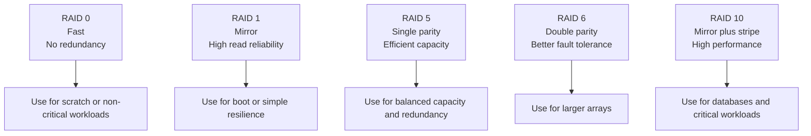

# Software RAID with mdadm

---

## 4.14 RAID basics with mdadm

Software RAID can be managed using `mdadm`.

Common RAID levels:
- RAID 0: striping, no redundancy.
- RAID 1: mirroring.
- RAID 5: striping with single parity.
- RAID 6: striping with double parity.
- RAID 10: mirrored stripes.

## 4.15 RAID levels comparison



### 4.15.1 Create a RAID 1 array

Example:

```bash
sudo mdadm --create /dev/md0 --level=1 --raid-devices=2 /dev/sdb1 /dev/sdc1
```

Create filesystem:

```bash
sudo mkfs.ext4 /dev/md0
```

Watch sync status:

```bash
cat /proc/mdstat
```

Array detail:

```bash
sudo mdadm --detail /dev/md0
```

Persist mdadm config on supported distributions:

```bash
sudo mdadm --detail --scan | sudo tee -a /etc/mdadm/mdadm.conf
```
