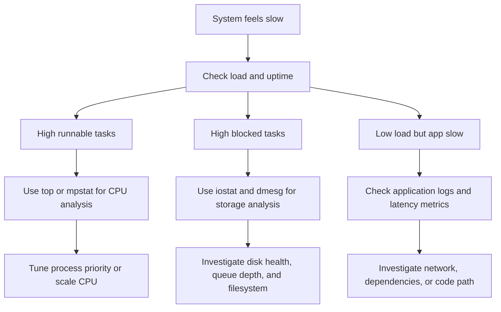

# System Monitoring

---

Monitoring helps you answer four essential questions:
- Is the host healthy?
- What resource is saturated?
- When did the issue begin?
- Is the problem isolated or systemic?

## 10.1 First-look commands
Start with these:

```bash
uptime
free -h
vmstat 1 5
iostat -xz 1 5
mpstat -P ALL 1 5
sar -u 1 5
dmesg | tail -50
```

## 10.2 Load average and uptime
`uptime` shows current time, system uptime, users, and load average.

Example:

```bash
uptime
```

Load average represents runnable and uninterruptible tasks over time windows.
Interpret it relative to CPU count.

Rule of thumb:
- Load below CPU count may be normal.
- Load far above CPU count suggests contention or blocked tasks.

## 10.3 Memory monitoring with free
```bash
free -h
free -m
```

Important fields:
- `used`
- `free`
- `buff/cache`
- `available`
- swap usage

Use `available` rather than raw `free` as the more useful quick indicator.
Linux uses memory for caching aggressively.

## 10.4 vmstat
`vmstat` summarizes process, memory, paging, block I/O, traps, and CPU activity.

Example:

```bash
vmstat 1 10
```

Key columns:
- `r` runnable processes.
- `b` blocked processes.
- `si` swap in.
- `so` swap out.
- `bi` blocks in.
- `bo` blocks out.
- `wa` I/O wait.
- `st` stolen CPU in VMs.

Interpretation examples:
- High `r` may mean CPU contention.
- High `b` may mean I/O or blocked kernel activity.
- Non-zero continuous `si` and `so` suggests memory pressure.
- High `wa` suggests storage wait.

## 10.5 iostat
`iostat` from the `sysstat` package helps diagnose storage behavior.

Example:

```bash
iostat -xz 1 5
```

Useful fields:
- `r/s`
- `w/s`
- `rkB/s`
- `wkB/s`
- `%util`
- `await`
- `svctm` on older versions

Interpretation:
- High `%util` can mean saturation.
- High `await` means requests are waiting too long.
- Compare throughput and latency together.

## 10.6 sar
`sar` provides historical performance data if enabled.

Examples:

```bash
sar -u 1 5
sar -r 1 5
sar -d 1 5
sar -n DEV 1 5
sar -q 1 5
```

Historical view examples:

```bash
sar -u -f /var/log/sa/sa15
sar -r -f /var/log/sa/sa15
```

`sar` is valuable when the issue already happened and you need history.

## 10.7 mpstat
`mpstat` shows per-CPU metrics.

```bash
mpstat -P ALL 1 5
```

Use it when:
- One CPU core may be saturated.
- Interrupt load is uneven.
- NUMA or affinity issues are suspected.

## 10.8 dmesg
`dmesg` reads the kernel ring buffer.

Examples:

```bash
dmesg | tail -100
dmesg -T | grep -i error
dmesg -T | grep -i -E "oom|fail|ext4|xfs|nvme|eth"
```

Common findings:
- Disk I/O errors.
- Driver issues.
- OOM kills.
- Filesystem problems.
- Hardware initialization messages.

## 10.9 /proc exploration
Quick checks:

```bash
cat /proc/loadavg
cat /proc/meminfo
cat /proc/cpuinfo | grep "model name" | head -1
cat /proc/interrupts
cat /proc/net/dev
cat /proc/vmstat | head
```

Use `/proc` when you want raw kernel-provided counters.

## 10.10 /sys exploration
`/sys` exposes kernel device and subsystem data.

Useful paths:
- `/sys/block/`
- `/sys/class/net/`
- `/sys/devices/system/cpu/`
- `/sys/fs/cgroup/`

Examples:

```bash
ls /sys/class/net
cat /sys/block/sda/queue/scheduler
cat /sys/devices/system/cpu/online
```

## 10.11 Monitoring decision tree


## 10.12 Network-adjacent monitoring quick notes
Although this guide is not a full networking manual, basic checks matter.

Useful commands:

```bash
ss -s
ss -tulpn
ip -br addr
ip route
ping -c 4 8.8.8.8
```

These checks help determine whether the problem is compute, storage, or network related.

## 10.13 Capacity indicators to track
Track these over time:
- CPU usage and run queue.
- Memory available and swap activity.
- Disk space and inode usage.
- Disk latency and utilization.
- Filesystem errors.
- Network throughput and errors.
- Service restart counts.
- Log growth rates.

## 10.14 Practical monitoring workflows
Suspected memory pressure:

```bash
free -h
vmstat 1 5
journalctl -k | grep -i oom
ps -eo pid,%mem,rss,cmd --sort=-%mem | head
```

Suspected disk bottleneck:

```bash
iostat -xz 1 5
vmstat 1 5
dmesg -T | tail -50
lsblk -f
df -h
```

Suspected CPU saturation:

```bash
uptime
mpstat -P ALL 1 5
ps -eo pid,%cpu,cmd --sort=-%cpu | head -20
```

## 10.15 Monitoring best practices
- Combine metrics with logs.
- Keep historical data.
- Alert on symptoms and causes.
- Baseline normal behavior.
- Separate host and application monitoring.
- Correlate events with deployments and changes.
- Avoid drawing conclusions from one command alone.

---

## 10.4 Incident triage checklist
- Identify scope.
- Check uptime and load.
- Check CPU, memory, disk, and network basics.
- Check logs for the affected service.
- Check recent changes.
- Check dependencies.
- Mitigate safely.
- Capture evidence.
- Communicate status.
- Follow up with root cause review.

---

## 10.8 Monitoring commands reference
- `uptime`
- `free -h`
- `vmstat 1 5`
- `iostat -xz 1 5`
- `sar -u 1 5`
- `sar -r 1 5`
- `sar -d 1 5`
- `sar -n DEV 1 5`
- `mpstat -P ALL 1 5`
- `dmesg -T | tail -100`
- `cat /proc/loadavg`
- `cat /proc/meminfo`
- `cat /proc/interrupts`
- `cat /proc/net/dev`
- `ss -s`
- `ip -br addr`
- `ip route`

---

## B.8 Monitoring quick reminders
- Start simple with `uptime`, `free`, `vmstat`, `iostat`, and logs.
- Compare symptoms across CPU, memory, disk, and network.
- A high load average is not automatically a CPU problem.
- Use `vmstat` to separate runnable vs blocked work.
- Use `iostat` to confirm storage latency.
- Use `sar` when you need historical evidence.
- Use `dmesg` for hardware and kernel clues.
- Monitor swap usage trends, not just momentary values.
- Watch for inode exhaustion on mail or cache-heavy systems.
- Correlate alerts with recent deployments.
- Alert fatigue reduces effectiveness.
- Baselines matter more than isolated numbers.
- Monitor restart loops and OOMs.
- Verify monitoring agent health itself.
- Keep dashboards tied to operational actions.

---

### Monitoring inspection examples
```bash
sar -q 1 5
sar -B 1 5
mpstat -P ALL 1 3
iostat -xz 1 3
vmstat -Sm 1 3
```

---

## B.18 Mini runbook: slow server
1. Check `uptime` and load.
2. Check `free -h`.
3. Check `vmstat 1 5`.
4. Check `iostat -xz 1 5`.
5. Check top CPU and memory consumers.
6. Check logs for errors or OOM events.
7. Check recent changes and deploys.
8. Mitigate with priority, scaling, or rollback if justified.
9. Capture evidence.
10. Prevent recurrence.

---

### Health cluster
- `uptime`
- `free -h`
- `vmstat 1 5`
- `iostat -xz 1 5`
- `df -h`
- `journalctl -p err..alert -b`

---

## B.31 More monitoring examples
```bash
pidstat 1 5
sar -W 1 5
sar -n TCP,ETCP 1 5
watch -n 2 'df -h && free -h'
```
- `pidstat` is helpful for per-process trends where available.
- Paging metrics help distinguish cache churn from true memory pressure.
- TCP statistics can reveal retransmits and socket stress.
- Repeated watch-based checks are useful for short incidents.
- Monitoring should answer what changed, not just what is broken now.
- Keep alerts actionable and tied to response playbooks.
- Distinguish saturation from backlog from outright failure.
- Capacity planning depends on trends, not snapshots.
- Correlate host metrics with application-level latency.
- Always note the observation time window.
