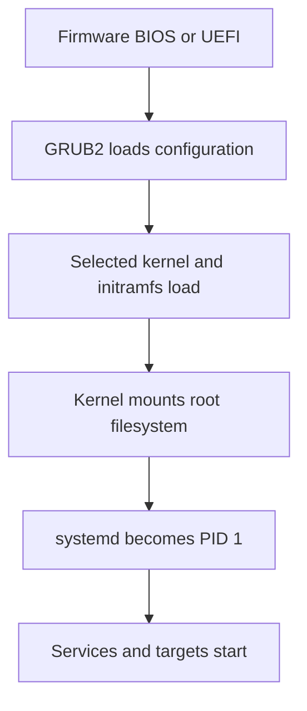

# Kernel Management

> **📌 Disclaimer**: Any third-party logos, screenshots, or diagrams referenced in this document are used for educational purposes only. All trademarks belong to their respective owners.


---

The Linux kernel manages hardware, scheduling, memory, drivers, filesystems, and system calls.
Administrators must know how to inspect the running kernel, manage modules, tune parameters, and handle upgrades.

## 12.1 Kernel version checks
Useful commands:

```bash
uname -a
uname -r
hostnamectl
cat /proc/version
```

Use these when:
- Verifying compatibility.
- Checking if a reboot applied the intended kernel.
- Confirming architecture and build info.

## 12.2 Kernel modules
Modules are loadable pieces of kernel functionality.
They commonly provide:
- Hardware drivers.
- Filesystem support.
- Network features.

Key commands:

```bash
lsmod
modinfo xfs
sudo modprobe br_netfilter
sudo modprobe -r br_netfilter
```

What they do:
- `lsmod` lists loaded modules.
- `modinfo` shows module metadata.
- `modprobe` loads modules with dependency handling.
- `modprobe -r` removes modules where safe.

## 12.3 Module configuration
Persistent module options often go in:
- `/etc/modprobe.d/*.conf`

Example:

```conf
options nf_conntrack hashsize=262144
blacklist firewire_ohci
```

After changes, consider whether an initramfs rebuild is needed on your distribution.

## 12.4 sysctl and kernel parameters
`sysctl` manages many runtime kernel parameters.

View a value:

```bash
sysctl net.ipv4.ip_forward
```

Set temporarily:

```bash
sudo sysctl -w net.ipv4.ip_forward=1
```

Set persistently using:
- `/etc/sysctl.conf`
- `/etc/sysctl.d/*.conf`

Example file:

```conf
net.ipv4.ip_forward = 1
vm.swappiness = 10
kernel.pid_max = 4194304
fs.file-max = 2097152
```

Apply settings:

```bash
sudo sysctl --system
```

## 12.5 Common sysctl examples
Networking:

```conf
net.ipv4.ip_forward = 1
net.ipv4.conf.all.rp_filter = 1
net.ipv4.tcp_syncookies = 1
```

Memory and VM:

```conf
vm.swappiness = 10
vm.dirty_ratio = 15
vm.dirty_background_ratio = 5
```

File handles:

```conf
fs.file-max = 2097152
```

Choose kernel tuning based on evidence, not folklore.

## 12.6 Kernel package management basics
Kernel updates are usually delivered by the OS package manager.

Examples:

Debian-based:

```bash
sudo apt update
sudo apt install linux-image-generic
```

RHEL-family:

```bash
sudo dnf update kernel
```

Arch:

```bash
sudo pacman -Syu linux
```

After a kernel upgrade:
- Check bootloader entries.
- Plan reboot.
- Verify the new kernel after reboot.

## 12.7 Initramfs and early boot images
Many systems boot with an initramfs image.
This contains drivers and tools needed early in boot.

Commands vary by distribution.
Examples include:
- `update-initramfs`
- `dracut`
- `mkinitcpio`

Examples:

```bash
sudo update-initramfs -u
sudo dracut -f
sudo mkinitcpio -P
```

## 12.8 GRUB basics for kernel admins
Common tasks:
- Review boot entries.
- Set default kernel.
- Regenerate config after changes.

Commands differ by distribution.
Examples:

```bash
sudo update-grub
sudo grub2-mkconfig -o /boot/grub2/grub.cfg
```

Be careful editing bootloader settings remotely.
A mistake can leave a system unbootable.

## 12.9 Kernel logs and diagnostics
Useful commands:

```bash
dmesg -T | tail -100
journalctl -k -b
journalctl -k -b -1
```

Look here for:
- Driver probe failures.
- Storage errors.
- Filesystem issues.
- OOM events.
- Module load failures.

## 12.10 Kernel compilation basics
Most administrators do not compile custom kernels daily, but understanding the basics is useful.

High-level steps:
1. Obtain kernel source.
2. Start from a known config.
3. Configure options.
4. Build kernel and modules.
5. Install modules.
6. Install kernel image.
7. Update bootloader.
8. Reboot and validate.

Typical command flow:

```bash
make menuconfig
make -j$(nproc)
sudo make modules_install
sudo make install
```

Reasons to compile a custom kernel:
- Hardware enablement.
- Specialized performance tuning.
- Feature experimentation.
- Vendor or appliance requirements.

Risks:
- Operational complexity.
- Supportability issues.
- Boot failure if configuration is wrong.

## 12.11 Kernel panic and crash basics
A kernel panic is a fatal kernel error.

Actions:
- Capture console output or remote management screenshots.
- Check previous boot logs.
- Review recent changes.
- Review hardware health.
- Consider kdump for crash capture.

Useful areas:
- `journalctl -k -b -1`
- serial console logs
- crash dumps if configured

## 12.12 Kernel management best practices
- Use vendor-supported kernels in production unless you have a strong reason not to.
- Keep old known-good kernels available for rollback.
- Tune sysctl values deliberately.
- Document module blacklists and parameter changes.
- Validate kernel upgrades on staging first.
- Reboot intentionally and verify after change windows.

---

## 12.10 Kernel commands reference
- `uname -a`
- `uname -r`
- `hostnamectl`
- `cat /proc/version`
- `lsmod`
- `modinfo <module>`
- `modprobe <module>`
- `modprobe -r <module>`
- `sysctl -a`
- `sysctl <key>`
- `sysctl -w key=value`
- `sysctl --system`
- `update-initramfs -u`
- `dracut -f`
- `mkinitcpio -P`
- `update-grub`
- `grub2-mkconfig -o /boot/grub2/grub.cfg`
- `journalctl -k -b`
- `journalctl -k -b -1`
- `dmesg -T | grep -i error`

---

## B.10 Kernel quick reminders
- Know which kernel is currently running.
- Keep a fallback kernel installed.
- Review module and driver implications before upgrading.
- Tune with `sysctl` only when you understand workload impact.
- Persist changes in proper config files.
- Validate bootloader updates.
- Use previous boot logs to troubleshoot crashes.
- Rebuild initramfs when required after low-level changes.
- Avoid unsupported custom kernels in standard enterprise estates.
- Capture panic evidence quickly.
- Document module blacklists.
- Review kernel command line arguments if behavior changes.
- Confirm container and virtualization requirements before tuning.
- Reboot only when operationally planned.
- Validate after reboot, not just before.

---

### Kernel inspection examples
```bash
sysctl kernel.hostname
sysctl net.core.somaxconn
modinfo overlay
lsmod | head
```

---

## B.33 More kernel examples
```bash
cat /proc/cmdline
sysctl vm.max_map_count
modprobe configs
zcat /proc/config.gz | head
```
- `/proc/cmdline` shows boot arguments that may explain runtime behavior.
- Some application stacks require kernel parameter adjustments such as map counts.
- Kernel config inspection can help confirm feature availability.
- Not all systems expose `/proc/config.gz`.
- Boot arguments for storage, console, or security settings can be decisive during incidents.
- Revisit temporary tuning changes and decide whether they should be made persistent.
- Avoid collecting folklore kernel tweaks without measurable outcomes.
- Keep reboot dependencies aligned with maintenance planning.
- Check virtualization guest recommendations before changing low-level settings.
- Validate module load state after reboot, not only before.

---

<a id="system-initialization--boot-management-grub"></a>
## 🧰 System Initialization & Boot Management (GRUB)

### Why boot management matters
Bootloader configuration determines how the system passes control from firmware to the kernel.

GRUB administration matters when you need to:
- Add or remove kernel command-line parameters.
- Choose a default kernel version.
- Recover from a failed kernel or initramfs update.
- Boot into rescue or single-user mode.
- Protect boot entries against unauthorized modification.

### GRUB2 boot path overview



### Common GRUB file locations
Debian and Ubuntu:
- Defaults: `/etc/default/grub`
- Generated config: `/boot/grub/grub.cfg`
- Custom entries: `/etc/grub.d/40_custom`
- Regeneration command: `update-grub`

RHEL-family BIOS systems:
- Defaults: `/etc/default/grub`
- Generated config: `/boot/grub2/grub.cfg`
- Custom entries: `/etc/grub.d/40_custom`
- Regeneration command: `grub2-mkconfig -o /boot/grub2/grub.cfg`

RHEL-family UEFI systems often use:
- EFI path: `/boot/efi/EFI/redhat/grub.cfg`
- Regeneration command: `grub2-mkconfig -o /boot/efi/EFI/redhat/grub.cfg`

Important note:
- Do not edit `grub.cfg` directly in normal workflows.
- Edit defaults or scripts, then regenerate the final config.

### Inspect the current kernel and boot arguments

```bash
uname -r
cat /proc/cmdline
```

List installed kernels on Debian/Ubuntu:

```bash
dpkg -l | grep linux-image
```

List installed kernels on RHEL-family:

```bash
rpm -qa | grep '^kernel'
grubby --info=ALL
```

### GRUB2 configuration basics
A common `/etc/default/grub` example:

```bash
GRUB_DEFAULT=0
GRUB_TIMEOUT=5
GRUB_DISTRIBUTOR=`lsb_release -i -s 2> /dev/null || echo Debian`
GRUB_CMDLINE_LINUX_DEFAULT="quiet splash"
GRUB_CMDLINE_LINUX=""
```

Meaning:
- `GRUB_DEFAULT` selects the default entry.
- `GRUB_TIMEOUT` controls how long the menu waits.
- `GRUB_CMDLINE_LINUX_DEFAULT` usually applies normal boot arguments.
- `GRUB_CMDLINE_LINUX` applies arguments to all boot entries.

### Adding kernel parameters
Example: add a serial console and disable predictable network interface names.

Debian and Ubuntu:

```bash
sudo editor /etc/default/grub
```

Update the line:

```bash
GRUB_CMDLINE_LINUX_DEFAULT="quiet splash console=ttyS0,115200n8 net.ifnames=0 biosdevname=0"
```

Regenerate GRUB:

```bash
sudo update-grub
```

RHEL-family using `grubby` for persistent kernel args on all entries:

```bash
sudo grubby --update-kernel=ALL --args="console=ttyS0,115200n8 net.ifnames=0 biosdevname=0"
```

Verify:

```bash
grubby --info=ALL | grep args
cat /proc/cmdline
```

To remove arguments with `grubby`:

```bash
sudo grubby --update-kernel=ALL --remove-args="quiet splash"
```

Common kernel arguments administrators use:
- `systemd.unit=rescue.target`
- `rd.break`
- `selinux=0` for emergency-only troubleshooting, not normal operation
- `audit=1`
- `console=ttyS0,115200n8`
- `ipv6.disable=1` only when policy explicitly requires it

### Setting the default kernel
On RHEL-family systems, show the current default:

```bash
grubby --default-kernel
grubby --default-index
```

Set a specific kernel as default:

```bash
sudo grubby --set-default /boot/vmlinuz-5.14.0-427.13.1.el9_4.x86_64
```

On systems using menu indexes:

```bash
sudo grub2-set-default 0
sudo grub2-editenv list
```

On Debian and Ubuntu, update `/etc/default/grub` if you need a saved or named default, then regenerate.

Menu inspection example:

```bash
awk -F"'" '/menuentry / {print i++ " : " $2}' /boot/grub2/grub.cfg
awk -F"'" '/menuentry / {print i++ " : " $2}' /boot/grub/grub.cfg
```

### Rebuilding GRUB configuration
Debian and Ubuntu:

```bash
sudo update-grub
```

RHEL-family BIOS:

```bash
sudo grub2-mkconfig -o /boot/grub2/grub.cfg
```

RHEL-family UEFI:

```bash
sudo grub2-mkconfig -o /boot/efi/EFI/redhat/grub.cfg
```

Always confirm the correct output path for your platform before writing.

### GRUB password protection
Bootloader protection prevents casual editing of kernel parameters from the console.

Generate a password hash:

```bash
grub-mkpasswd-pbkdf2
```

Example custom snippet in `/etc/grub.d/40_custom`:

```bash
set superusers="grubadmin"
password_pbkdf2 grubadmin grub.pbkdf2.sha512.10000.XXXXXXXXXXXXXXXXXXXXXXXXXXXXXXXXXXXXXXXX
```

Then regenerate the config:

```bash
sudo update-grub
sudo grub2-mkconfig -o /boot/grub2/grub.cfg
```

Operational notes:
- Store the GRUB admin credential securely.
- Test access from the console before declaring success.
- Understand whether normal menu entries remain bootable without authentication in your chosen design.

### Restricting edit access while allowing normal boot
On some deployments you may want users to boot default entries but not edit them.

Example custom entry pattern:

```bash
menuentry 'Linux (restricted edit)' --unrestricted {
    echo 'Booting default Linux entry'
}
```

Use custom entries carefully and test on a non-production system first.

### Booting into rescue or emergency mode
Temporary boot-time changes are useful during recovery.

Common approaches:
- At the GRUB menu, edit the Linux line and append `systemd.unit=rescue.target`.
- For deep initramfs troubleshooting on RHEL-family systems, append `rd.break`.
- For a root shell with minimal services, some systems use `single` or `emergency` targets.

Examples:

```text
linux ... ro systemd.unit=rescue.target
linux ... ro rd.break
```

After booting into rescue mode, validate filesystems and critical configuration before rebooting normally.

### Recovering from GRUB failure
A failed GRUB setup can present as:
- GRUB prompt only.
- Missing menu entries.
- Kernel panic due to wrong root parameters.
- System unable to locate the bootloader after disk changes.

General recovery workflow from rescue media:
1. Boot from a matching Linux ISO or rescue environment.
2. Mount the root filesystem.
3. Mount `/boot` and `/boot/efi` if separate.
4. Bind-mount `/dev`, `/proc`, `/sys`, and `/run`.
5. `chroot` into the installed system.
6. Reinstall or regenerate GRUB.
7. Rebuild initramfs if needed.
8. Exit, unmount cleanly, and reboot.

Example recovery sequence:

```bash
sudo mount /dev/mapper/vgroot-lvroot /mnt
sudo mount /dev/sda2 /mnt/boot
sudo mount /dev/sda1 /mnt/boot/efi
sudo mount --bind /dev /mnt/dev
sudo mount --bind /proc /mnt/proc
sudo mount --bind /sys /mnt/sys
sudo mount --bind /run /mnt/run
sudo chroot /mnt
```

Inside the chroot on Debian/Ubuntu:

```bash
grub-install /dev/sda
update-grub
update-initramfs -u -k all
```

Inside the chroot on RHEL-family BIOS:

```bash
grub2-install /dev/sda
grub2-mkconfig -o /boot/grub2/grub.cfg
dracut -f
```

Inside the chroot on RHEL-family UEFI:

```bash
grub2-mkconfig -o /boot/efi/EFI/redhat/grub.cfg
dracut -f
```

Exit and unmount:

```bash
exit
sudo umount /mnt/run /mnt/sys /mnt/proc /mnt/dev
sudo umount /mnt/boot/efi /mnt/boot /mnt
```

### Recovering a lost root password via GRUB
This is a tightly controlled break-glass task.

Typical RHEL-family flow:
1. Edit the boot entry at GRUB.
2. Append `rd.break`.
3. Boot to the initramfs shell.
4. Remount sysroot read-write.
5. Chroot into sysroot.
6. Reset the password.
7. Create SELinux relabel marker if needed.
8. Exit and reboot.

Example commands from the `rd.break` shell:

```bash
mount -o remount,rw /sysroot
chroot /sysroot
passwd root
touch /.autorelabel
exit
exit
```

Use only under approved operational policy.

### GRUB and initramfs relationship
The bootloader loads both the kernel and initramfs.

Investigate initramfs issues when:
- Storage drivers changed.
- Root device mapping changed.
- LVM, RAID, or encryption modules are missing.
- The system drops into a dracut or initramfs shell.

Useful commands:

```bash
lsinitramfs /boot/initrd.img-$(uname -r) | head
lsinitrd /boot/initramfs-$(uname -r).img | head
```

Rebuild commands:

```bash
sudo update-initramfs -u -k all
sudo dracut -f
```

### UEFI versus BIOS considerations
Key differences:
- UEFI systems use an EFI System Partition.
- BIOS systems install boot code differently.
- Virtual machines may use either mode depending on platform settings.
- Your recovery procedure must match the firmware mode actually in use.

Check current boot mode:

```bash
[ -d /sys/firmware/efi ] && echo UEFI || echo BIOS
```

### Common GRUB troubleshooting

#### Menu does not show expected kernel
Check:
- The kernel package is actually installed.
- The generated config was rebuilt.
- `/boot` is mounted if separate.
- Disk space in `/boot` is sufficient.

#### System boots wrong kernel
Check:
- `grubby --default-kernel`.
- `grub2-editenv list`.
- `GRUB_DEFAULT` in `/etc/default/grub`.
- Whether a saved-entry mechanism overrides the static index.

#### Kernel parameters did not apply
Check:
- Whether you updated the right GRUB defaults file.
- Whether you regenerated the config.
- Whether another boot entry is being selected.
- Whether secure boot or vendor tooling is affecting the path.

#### GRUB install fails in rescue mode
Check:
- Correct disk target.
- Correct firmware mode.
- EFI partition mounted on UEFI systems.
- Chroot has `/dev`, `/proc`, `/sys`, and `/run` mounted.

### Bootloader security practices
- Protect console access physically and procedurally.
- Use GRUB passwords where console tampering risk exists.
- Review serial console exposure on cloud and bare metal systems.
- Log kernel parameter changes through change control.
- Keep at least one known-good kernel available.
- Test new kernel parameters on non-critical systems first.

### GRUB operational checklist
- Confirm current kernel and boot mode.
- Make changes in `/etc/default/grub` or with `grubby`, not directly in generated files.
- Regenerate the config using the correct platform command.
- Validate the next reboot window and rollback path.
- Keep recovery media available for critical systems.
- Test rescue access and password protection in a lab.

### GRUB quick reference

```bash
# Inspect
uname -r
cat /proc/cmdline
grubby --info=ALL
grubby --default-kernel

# Update args
sudo grubby --update-kernel=ALL --args="console=ttyS0,115200n8"
sudo grubby --update-kernel=ALL --remove-args="quiet splash"

# Rebuild config
sudo update-grub
sudo grub2-mkconfig -o /boot/grub2/grub.cfg
sudo grub2-mkconfig -o /boot/efi/EFI/redhat/grub.cfg

# Recovery helpers
sudo grub2-install /dev/sda
sudo dracut -f
sudo update-initramfs -u -k all
```
