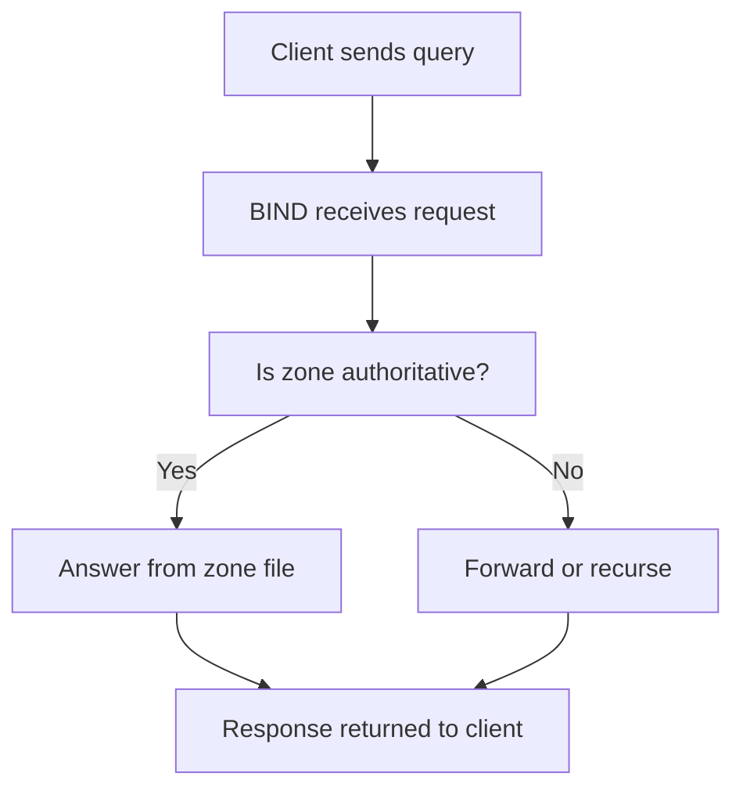

# DNS Server (BIND9)

---

<a id="dns-server-bind9-setup"></a>
## 🌐 DNS Server — BIND9 Setup

### Why run your own DNS server?
A private DNS server gives you authoritative control over internal names and predictable service discovery.

Typical use cases:
- Internal zones such as `example.internal`.
- Stable names for web, database, and application tiers.
- Reverse lookup support for logging and diagnostics.
- Forwarding and caching for branch offices or labs.
- Controlled split-horizon DNS when internal and external answers differ.

### DNS roles at a glance
- Authoritative server: answers for zones it owns.
- Recursive resolver: looks up answers on behalf of clients.
- Caching resolver: stores responses to improve speed.
- Forwarder: sends recursive requests to upstream resolvers.

Production advice:
- Be explicit about whether a BIND server is authoritative, recursive, or both.
- Avoid open recursion.
- Keep zone files in version control or managed automation.
- Use at least two DNS servers for important zones.

### Install BIND9
Ubuntu and Debian:

```bash
sudo apt update
sudo apt install -y bind9 bind9utils bind9-doc dnsutils
```

RHEL, Rocky, AlmaLinux, CentOS:

```bash
sudo dnf install -y bind bind-utils
```

### Configuration files
Common files on Debian and Ubuntu:
- `/etc/bind/named.conf` — main configuration include file.
- `/etc/bind/named.conf.options` — global resolver and listener options.
- `/etc/bind/named.conf.local` — local zone definitions.
- `/etc/bind/zones/` — a sensible location for custom zone files.

Common files on RHEL-family systems:
- `/etc/named.conf` — main configuration.
- `/var/named/` — default location for zone files.
- `/etc/named.rfc1912.zones` — packaged include file for zone declarations.

### DNS service flow



### Baseline hardening options
Example `/etc/bind/named.conf.options` for an internal environment:

```bash
options {
    directory "/var/cache/bind";

    listen-on { 127.0.0.1; 192.168.1.10; };
    listen-on-v6 { none; };

    recursion yes;
    allow-recursion { 127.0.0.1; 192.168.1.0/24; };
    allow-query { 127.0.0.1; 192.168.1.0/24; };
    allow-transfer { none; };

    forwarders {
        1.1.1.1;
        8.8.8.8;
    };

    dnssec-validation auto;
    auth-nxdomain no;
    version "not disclosed";
};
```

Notes:
- Restrict recursion to trusted clients.
- Use approved upstream resolvers instead of public resolvers if your organization requires it.
- `allow-transfer { none; };` is a safe default until you explicitly configure secondary servers.

### Forward Zone Setup (example.internal)
Create a zone directory if needed:

```bash
sudo mkdir -p /etc/bind/zones
```

Add the zone definition to `/etc/bind/named.conf.local`:

```bash
zone "example.internal" {
    type master;
    file "/etc/bind/zones/db.example.internal";
};
```

Create `/etc/bind/zones/db.example.internal`:

```dns
$TTL    604800
@       IN      SOA     ns1.example.internal. admin.example.internal. (
                     2024010101         ; Serial
                         604800         ; Refresh
                          86400         ; Retry
                        2419200         ; Expire
                         604800 )       ; Negative Cache TTL
;
@       IN      NS      ns1.example.internal.
ns1     IN      A       192.168.1.10
web     IN      A       192.168.1.20
db      IN      A       192.168.1.30
app     IN      CNAME   web.example.internal.
mail    IN      MX  10  mail.example.internal.
mail    IN      A       192.168.1.40
```

Record guidance:
- Increment the serial every time you modify a zone file.
- Use a date-based serial such as `YYYYMMDDNN` for clarity.
- CNAME targets should point to canonical names, not to IP addresses.
- MX records should reference names that resolve to A or AAAA records.

### Reverse Zone Setup
Add a reverse zone definition for `192.168.1.0/24`:

```bash
zone "1.168.192.in-addr.arpa" {
    type master;
    file "/etc/bind/zones/db.192.168.1";
};
```

Create `/etc/bind/zones/db.192.168.1`:

```dns
$TTL    604800
@       IN      SOA     ns1.example.internal. admin.example.internal. (
                     2024010101         ; Serial
                         604800         ; Refresh
                          86400         ; Retry
                        2419200         ; Expire
                         604800 )       ; Negative Cache TTL
;
@       IN      NS      ns1.example.internal.
10      IN      PTR     ns1.example.internal.
20      IN      PTR     web.example.internal.
30      IN      PTR     db.example.internal.
40      IN      PTR     mail.example.internal.
```

Why reverse zones matter:
- They improve diagnostics and log readability.
- Some applications and mail systems expect sensible PTR records.
- Reverse lookup failures can complicate troubleshooting and trust decisions.

### RHEL-family equivalent layout
On RHEL-family systems, define zones in `/etc/named.conf` or an included file:

```bash
zone "example.internal" IN {
    type master;
    file "/var/named/db.example.internal";
    allow-update { none; };
};

zone "1.168.192.in-addr.arpa" IN {
    type master;
    file "/var/named/db.192.168.1";
    allow-update { none; };
};
```

Create the zone files under `/var/named/`, then set ownership and SELinux context:

```bash
sudo cp db.example.internal /var/named/db.example.internal
sudo cp db.192.168.1 /var/named/db.192.168.1
sudo chown root:named /var/named/db.example.internal /var/named/db.192.168.1
sudo chmod 640 /var/named/db.example.internal /var/named/db.192.168.1
sudo restorecon -v /var/named/db.example.internal /var/named/db.192.168.1
```

### Validation and startup
Validate configuration syntax:

```bash
named-checkconf
named-checkzone example.internal /etc/bind/zones/db.example.internal
named-checkzone 1.168.192.in-addr.arpa /etc/bind/zones/db.192.168.1
```

Start and enable the service:

```bash
sudo systemctl enable --now bind9      # Debian/Ubuntu
sudo systemctl enable --now named      # RHEL-family
```

Restart after changes:

```bash
sudo systemctl restart bind9
sudo systemctl restart named
```

Use the service name that exists on your distribution.

### Firewall configuration
On RHEL-family systems with firewalld:

```bash
sudo firewall-cmd --permanent --add-service=dns
sudo firewall-cmd --reload
```

If using nftables directly, allow both UDP and TCP on port 53.

### Testing
Local forward lookup:

```bash
dig @localhost web.example.internal
```

Local reverse lookup:

```bash
dig @localhost -x 192.168.1.20
```

Authority answer check:

```bash
dig @localhost example.internal SOA
```

Client-side test against the server IP:

```bash
dig @192.168.1.10 web.example.internal
host 192.168.1.20 192.168.1.10
nslookup db.example.internal 192.168.1.10
```

Expected behaviors:
- The answer section contains the expected record.
- The authority section reflects the correct zone.
- Reverse lookups return PTR records.
- Recursive queries succeed only from permitted clients.

### Resolver integration on clients
To use the DNS server from clients, update resolver settings.

Temporary test with `resolvectl` on systemd-resolved systems:

```bash
sudo resolvectl dns eth0 192.168.1.10
sudo resolvectl domain eth0 example.internal
resolvectl query web.example.internal
```

Traditional `/etc/resolv.conf` example:

```conf
search example.internal
nameserver 192.168.1.10
nameserver 192.168.1.11
```

Keep at least two nameservers for resiliency when possible.

### Zone change workflow
A safe change workflow is:
1. Edit the zone file.
2. Increment the SOA serial.
3. Run `named-checkzone`.
4. Reload or restart BIND.
5. Test with `dig`.
6. Validate from a client.

Reload without full restart:

```bash
sudo rndc reload
sudo rndc reload example.internal
sudo rndc status
```

### Example: adding a new application host
Update the forward zone:

```dns
api     IN      A       192.168.1.50
```

Update the reverse zone:

```dns
50      IN      PTR     api.example.internal.
```

Validation and reload:

```bash
named-checkzone example.internal /etc/bind/zones/db.example.internal
named-checkzone 1.168.192.in-addr.arpa /etc/bind/zones/db.192.168.1
sudo rndc reload
```

Test:

```bash
dig @localhost api.example.internal
host 192.168.1.50 localhost
```

### Secondary DNS server basics
For important environments, use at least one secondary server.

Primary server zone snippet:

```bash
acl internal-secondaries { 192.168.1.11; };

zone "example.internal" {
    type master;
    file "/etc/bind/zones/db.example.internal";
    allow-transfer { internal-secondaries; };
    also-notify { 192.168.1.11; };
};
```

Secondary server zone snippet:

```bash
zone "example.internal" {
    type slave;
    masters { 192.168.1.10; };
    file "/var/cache/bind/db.example.internal";
};
```

Ensure transfer rules, firewalls, and serial increments all line up.

### Common BIND9 troubleshooting

#### `named-checkconf` fails
- Read the exact line number reported.
- Look for missing semicolons.
- Check unmatched braces.
- Confirm include file paths are correct.

#### Zone loads but queries fail
- Verify the zone is declared in the correct file.
- Confirm the zone filename path is readable by the service.
- Check the SOA and NS records.
- Confirm the queried name exists in the zone.

Useful commands:

```bash
sudo journalctl -u bind9 -u named --since -30m
sudo rndc zonestatus example.internal
sudo ss -tulpn | grep :53
```

#### Reverse lookup does not work
- Confirm the reverse zone name matches the subnet.
- Confirm PTR records use the host octet only.
- Check that the IP belongs to the same reverse zone.
- Validate that the reverse zone is loaded.

#### Clients time out
- Confirm the service is listening on the expected interface.
- Confirm TCP and UDP 53 are allowed.
- Check whether another local resolver already occupies port 53.
- Inspect SELinux denials on RHEL-family systems.

#### Zone transfer problems
- Check `allow-transfer` rules.
- Confirm the secondary can reach the primary on TCP 53.
- Confirm the primary increments the serial.
- Use `dig AXFR` only from authorized transfer hosts.

### DNS security practices
- Disable open recursion.
- Restrict zone transfers.
- Keep BIND patched.
- Hide version details where policy requires.
- Use separate authoritative and recursive roles for larger environments.
- Consider DNSSEC for public-facing authoritative zones.
- Log configuration changes and zone updates.
- Back up zone files and config before major changes.

### BIND9 operational checklist
- Keep forward and reverse records aligned.
- Increment serial numbers consistently.
- Validate every zone before reload.
- Run at least two authoritative servers for important zones.
- Monitor service availability and response latency.
- Document client resolver settings.
- Review recursion exposure regularly.
- Test both forward and reverse lookups after maintenance.

### BIND9 quick reference

```bash
# Install
sudo apt install bind9 bind9utils bind9-doc dnsutils
sudo dnf install bind bind-utils

# Validate
named-checkconf
named-checkzone example.internal /etc/bind/zones/db.example.internal

# Service control
sudo systemctl enable --now bind9
sudo systemctl enable --now named
sudo rndc reload

# Test
 dig @localhost web.example.internal
 dig @localhost -x 192.168.1.20
```
