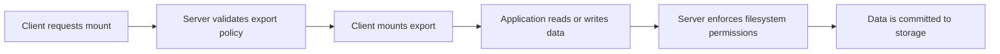
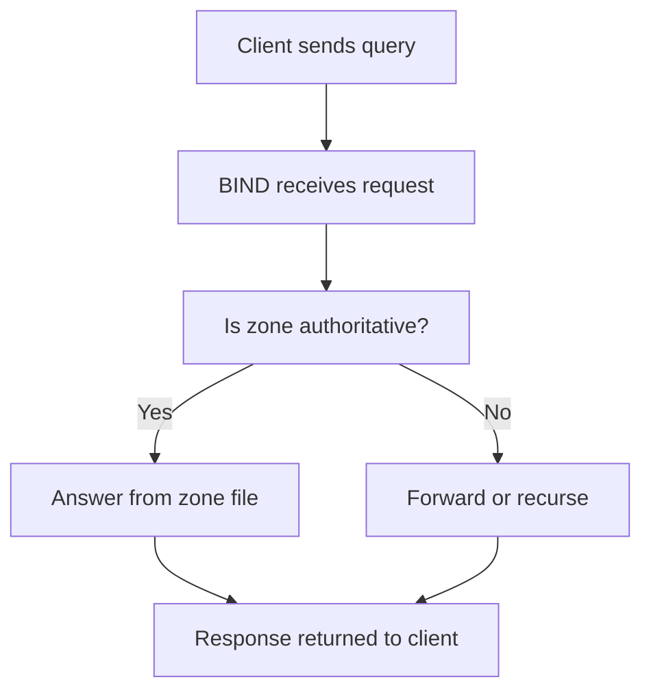
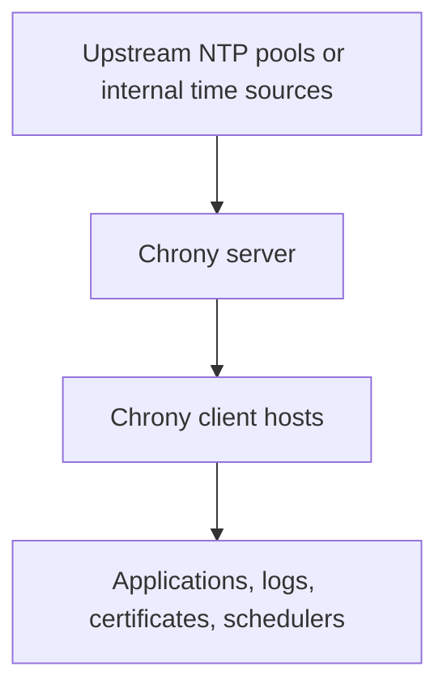
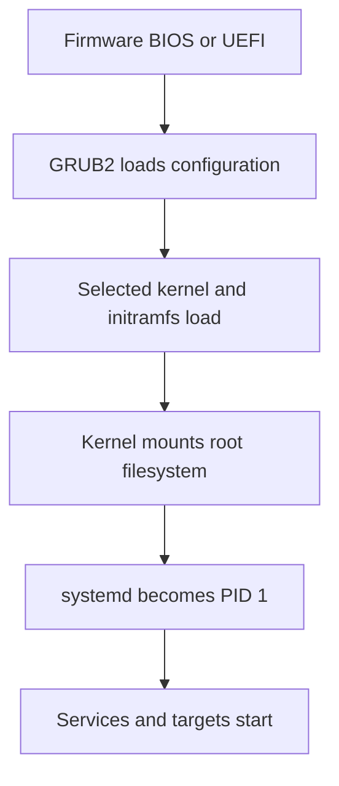

# System Hardening

---

System hardening reduces attack surface and improves resilience.
The right controls depend on workload, compliance requirements, and operational maturity.

## 11.1 Hardening principles

- Minimize exposed services.
- Use least privilege.
- Keep systems patched.
- Log and audit important actions.
- Encrypt sensitive data.
- Restrict remote access.
- Standardize configuration.
- Review regularly.

## 11.2 Disable unnecessary services

List services:

```bash
systemctl list-unit-files --type=service
systemctl list-units --type=service
```

Disable unused services:

```bash
sudo systemctl disable --now avahi-daemon
sudo systemctl disable --now cups
```

Mask if you want to prevent accidental activation:

```bash
sudo systemctl mask telnet.socket
```

Before disabling anything, confirm business need and dependency impact.

## 11.3 SSH hardening

The SSH daemon is a primary admin entry point.
Treat it carefully.

Config file:

```text
/etc/ssh/sshd_config
```

Typical hardening settings:

```conf
PermitRootLogin no
PasswordAuthentication no
PubkeyAuthentication yes
ChallengeResponseAuthentication no
UsePAM yes
X11Forwarding no
MaxAuthTries 3
LoginGraceTime 30
AllowUsers adminuser opsuser
```

After changes:

```bash
sudo sshd -t
sudo systemctl reload sshd
```

Recommended practices:
- Use SSH keys.
- Disable direct root login.
- Restrict user access.
- Use MFA where possible.
- Consider moving SSH to a management network or bastion.

## 11.4 Firewall basics

Firewalls enforce network exposure policy.

Common tools:
- `nftables`
- `iptables`
- `firewalld`
- `ufw`

### 11.4.1 firewalld examples

```bash
sudo firewall-cmd --get-active-zones
sudo firewall-cmd --list-all
sudo firewall-cmd --permanent --add-service=ssh
sudo firewall-cmd --permanent --add-service=https
sudo firewall-cmd --reload
```

### 11.4.2 ufw examples

```bash
sudo ufw status verbose
sudo ufw allow OpenSSH
sudo ufw allow 443/tcp
sudo ufw enable
```

### 11.4.3 nftables note

Modern Linux distributions increasingly prefer `nftables` as the underlying firewall framework.
Understand whether your host uses direct `nft` rules or a higher-level frontend.

## 11.5 SELinux

SELinux is a mandatory access control framework used heavily on RHEL-family systems.

Check status:

```bash
getenforce
sestatus
```

Modes:
- `Enforcing`
- `Permissive`
- `Disabled`

Temporary change:

```bash
sudo setenforce 0
sudo setenforce 1
```

Permanent config file:

```text
/etc/selinux/config
```

View denials:

```bash
ausearch -m avc -ts recent
journalctl | grep AVC
```

Best practice:
- Do not disable SELinux casually.
- Diagnose and apply proper labels or policy changes.

Useful commands:

```bash
ls -Z /var/www/html
restorecon -Rv /var/www/html
semanage port -l | grep http
```

## 11.6 AppArmor

AppArmor is another Linux security module used widely on Ubuntu and SUSE systems.

Check status:

```bash
sudo aa-status
```

Modes include:
- enforce
- complain
- disable

Profile management examples:

```bash
sudo aa-enforce /etc/apparmor.d/usr.sbin.nginx
sudo aa-complain /etc/apparmor.d/usr.sbin.nginx
```

Operational practice:
- Use profiles to constrain high-risk services.
- Investigate denials rather than disabling protection broadly.

## 11.7 auditd

`auditd` provides security auditing of system events.

Common service commands:

```bash
sudo systemctl enable --now auditd
systemctl status auditd
```

Useful tools:

```bash
sudo auditctl -l
sudo ausearch -k passwd_changes
sudo aureport -au
```

Example rule monitoring `/etc/passwd`:

```bash
sudo auditctl -w /etc/passwd -p wa -k passwd_changes
```

Persist rules according to your distribution's audit framework files.

## 11.8 fail2ban

`fail2ban` can ban hosts showing repeated malicious behavior, often from logs.

Common use case:
- Repeated SSH login failures.

Basic flow:
- Install fail2ban.
- Enable the `sshd` jail.
- Tune bantime and retry policy.

Typical local config file:

```text
/etc/fail2ban/jail.local
```

Example snippet:

```ini
[sshd]
enabled = true
port = ssh
logpath = /var/log/auth.log
maxretry = 5
bantime = 1h
findtime = 10m
```

Check status:

```bash
sudo fail2ban-client status
sudo fail2ban-client status sshd
```

## 11.9 Password policies

Strong password policy matters even with SSH keys because local accounts, sudo, and some services may still use passwords.

Areas to review:
- Password complexity.
- Password aging.
- Account lockout.
- MFA where possible.

On many systems, policy is influenced by:
- `/etc/login.defs`
- PAM configuration under `/etc/pam.d/`
- tools like `chage`

Examples:

```bash
sudo chage -l username
sudo chage -M 90 -W 14 -I 7 username
```

## 11.10 PAM

PAM stands for Pluggable Authentication Modules.
It controls authentication, account policy, session policy, and password handling.

Common PAM files:
- `/etc/pam.d/sshd`
- `/etc/pam.d/system-auth`
- `/etc/pam.d/common-auth`
- `/etc/pam.d/sudo`

PAM module categories:
- `auth`
- `account`
- `password`
- `session`

Use caution.
Bad PAM changes can lock out administrators.

## 11.11 Sudo hardening

Use `sudo` instead of direct root usage where practical.

Inspect permissions safely with:

```bash
sudo visudo
sudo visudo -f /etc/sudoers.d/admins
```

Best practices:
- Use least privilege rules.
- Prefer group-based sudo where practical.
- Log sudo usage.
- Require MFA if your environment supports it.
- Avoid overly broad `NOPASSWD` rules.

## 11.12 File permissions and ownership

Essential commands:

```bash
chmod 640 file
chmod 750 dir
chown root:root file
chown -R appuser:appgroup /opt/myapp
umask
```

Security concepts:
- Least privilege on files and directories.
- Protect private keys with strict permissions.
- Use group ownership intentionally.
- Review world-writable paths.

Check for world-writable directories:

```bash
find / -xdev -type d -perm -0002 2>/dev/null
```

Check for SUID binaries:

```bash
find / -xdev -perm -4000 -type f 2>/dev/null
```

## 11.13 Package and patch hygiene

Hardening includes staying current.

Routine:
- Apply security updates promptly.
- Remove unused packages.
- Review installed services and listening ports.
- Monitor end-of-life operating systems.

Inventory listening ports:

```bash
ss -tulpn
```

## 11.14 Kernel and network hardening quick wins

Examples:
- Enable SYN cookies where appropriate.
- Disable IP forwarding unless needed.
- Restrict core dumps if policy requires.
- Disable uncommon protocols or modules if not needed.

Potential sysctl examples:

```conf
net.ipv4.tcp_syncookies = 1
net.ipv4.conf.all.accept_redirects = 0
net.ipv4.conf.all.send_redirects = 0
kernel.kptr_restrict = 2
fs.suid_dumpable = 0
```

Tune based on environment and application needs.

## 11.15 Security monitoring essentials

At minimum, monitor:
- Failed SSH logins.
- sudo activity.
- new listening ports.
- service failures.
- audit events for critical files.
- firewall drops on sensitive hosts.
- SELinux or AppArmor denials.

## 11.16 Hardening workflow

1. Build from a minimal OS image.
2. Patch fully.
3. Remove unnecessary packages and services.
4. Harden SSH.
5. Configure firewall policy.
6. Enable logging and auditing.
7. Enable MAC controls like SELinux or AppArmor.
8. Enforce authentication and password policy.
9. Validate application functionality.
10. Scan and review regularly.

## 11.17 Hardening best practices

- Use configuration management for consistency.
- Avoid one-off manual changes without records.
- Test hardening baselines on staging.
- Keep emergency access procedures documented.
- Harden but do not blind yourself operationally.
- Prefer measured policy over copy-paste checklists.

---

## 12.1 New server checklist

- Confirm OS version and support window.
- Update packages.
- Configure hostname and time sync.
- Create admin accounts.
- Install SSH keys.
- Disable root SSH login.
- Configure sudo access.
- Configure firewall.
- Configure logging and central forwarding.
- Install monitoring agent if used.
- Verify disk layout and mount points.
- Confirm backups are in scope.
- Document the host role.

---

## 13.11 Hardening commands reference

- `systemctl list-unit-files --type=service`
- `systemctl disable --now <service>`
- `sshd -t`
- `systemctl reload sshd`
- `firewall-cmd --list-all`
- `firewall-cmd --reload`
- `ufw status verbose`
- `ufw allow OpenSSH`
- `getenforce`
- `sestatus`
- `setenforce 0`
- `restorecon -Rv /path`
- `aa-status`
- `aa-enforce <profile>`
- `auditctl -l`
- `auditctl -w /etc/passwd -p wa -k passwd_changes`
- `ausearch -k passwd_changes`
- `fail2ban-client status`
- `chage -l <user>`
- `visudo`
- `find / -xdev -type d -perm -0002 2>/dev/null`
- `find / -xdev -perm -4000 -type f 2>/dev/null`
- `ss -tulpn`

---

## 13.12 One-line troubleshooting cookbook

- Service fails to start: `systemctl status <svc> && journalctl -u <svc> -b`
- Disk full: `df -h && du -xh --max-depth=1 / | sort -h | tail`
- Memory pressure: `free -h && vmstat 1 5 && journalctl -k | grep -i oom`
- CPU spike: `uptime && mpstat -P ALL 1 5 && ps -eo pid,%cpu,cmd --sort=-%cpu | head`
- Port conflict: `ss -tulpn | grep :80`
- Filesystem issue: `dmesg -T | tail -100 && lsblk -f && mount`
- RAID degraded: `cat /proc/mdstat && mdadm --detail /dev/md0`
- LVM state: `pvs && vgs && lvs`
- SSH failures: `journalctl -u sshd --since -1h | grep -i failed`
- SELinux issue: `ausearch -m avc -ts recent`

---

## 13.13 Production habits summary

- Prefer package-managed software.
- Prefer systemd services over manual background jobs.
- Prefer UUIDs in `fstab`.
- Prefer central logs.
- Prefer documented timers over mysterious cron entries.
- Prefer backups that are restore-tested.
- Prefer vendor-supported kernels and security controls.
- Prefer least privilege everywhere.
- Prefer evidence-driven troubleshooting.
- Prefer automation for repeatability.

---

## 13.14 Final advice

Linux system administration is a craft built on repetition, caution, and disciplined observation.
The best administrators are not the ones who memorize the most commands.
They are the ones who:
- verify before changing,
- automate after understanding,
- log before guessing,
- back up before risking,
- and document after succeeding.

Keep this guide as a practical reference.
Practice each section in a lab.
Then carry the habits into production carefully and consistently.

---

## B.11 Hardening quick reminders
- Remove what you do not need.
- Restrict who can log in.
- Prefer keys over passwords for SSH.
- Keep a firewall enabled with explicit policy.
- Use SELinux or AppArmor rather than disabling them casually.
- Audit privileged actions.
- Review sudo scope regularly.
- Harden permissions on secrets and keys.
- Scan for unexpected listening ports.
- Patch regularly.
- Use MFA where possible.
- Monitor failed logins and privilege escalation.
- Standardize secure defaults across hosts.
- Test hardening controls with applications.
- Document break-glass procedures.

---

### Hardening inspection examples
```bash
ss -tulpn
find /etc/sudoers.d -type f -maxdepth 1 -print -exec cat {} \;
getenforce
sudo aa-status
sudo fail2ban-client status sshd
```

---

## B.13 Command outcome interpretation guide
- If `df -h` shows 100 percent usage, confirm whether logs, backups, or deleted-open files are the cause.
- If `df -i` shows 100 percent inode usage, investigate directories with many small files.
- If `systemctl status` shows exit code failures, correlate with journal messages and recent config edits.
- If `vmstat` shows steady swap activity, investigate memory pressure before performance collapses.
- If `iostat` shows high `await`, investigate storage latency, queueing, or failing hardware.
- If `journalctl -k` shows I/O errors, prioritize data safety before routine performance tuning.
- If `ausearch` shows repeated denials, adjust policy carefully instead of disabling security globally.
- If `ss -tulpn` shows unexpected listeners, verify ownership and exposure immediately.
- If `sar` history shows regression after a deployment, compare packages, configs, and workload changes.
- If `mdadm` shows a degraded array, replace or re-add devices promptly and monitor rebuild.

---

## B.14 Role-based learning path

### Beginner sysadmin focus
- Learn package updates.
- Learn `systemctl` and `journalctl`.
- Learn `ps`, `top`, and signals.
- Learn `df`, `du`, `mount`, and `fstab`.
- Learn basic cron usage.
- Learn backup basics with `rsync` and `tar`.

### Intermediate sysadmin focus
- Learn LVM thoroughly.
- Learn `vmstat`, `iostat`, `sar`, and `mpstat`.
- Learn journald and logrotate deeply.
- Learn custom systemd units and timers.
- Learn sysctl tuning and module management.
- Learn SSH and firewall hardening.

### Advanced sysadmin focus
- Learn RAID recovery workflows.
- Learn snapshot-based backup strategies.
- Learn SELinux or AppArmor in depth.
- Learn auditd tuning and evidence collection.
- Learn kernel boot troubleshooting and crash handling.
- Learn standardization through automation and policy.

---

## B.15 Production anti-patterns to avoid
- Editing critical config files without backups.
- Running destructive commands against unverified devices.
- Using `chmod 777` as a fix.
- Disabling SELinux or AppArmor as a first response.
- Leaving cron jobs undocumented.
- Relying on local logs only.
- Ignoring inode exhaustion.
- Using `kill -9` reflexively.
- Treating snapshots as backups forever.
- Updating production blindly without review.
- Mixing package sources casually.
- Running services as root unnecessarily.
- Leaving old unused packages and daemons installed.
- Trusting backups that have never been restored.
- Making emergency changes without later cleanup or documentation.

---

## B.19 Mini runbook: failed SSH access
1. Confirm network reachability.
2. Confirm sshd service status.
3. Confirm firewall policy.
4. Review auth logs.
5. Check user account lock or shell.
6. Check permissions on home and `.ssh`.
7. Check SELinux or AppArmor denials.
8. Validate `sshd_config` syntax.
9. Reload or restart carefully.
10. Confirm restored access before ending maintenance.

---

### Security cluster
- `ss -tulpn`
- `getenforce`
- `aa-status`
- `fail2ban-client status`
- `ausearch -m avc -ts recent`
- `journalctl -u sshd --since -1h`

---

## B.22 Closing note
This guide intentionally spans from entry-level administration to advanced operational practice.
Use it actively.
Rehearse commands in a lab.
Turn repeated tasks into documented runbooks.
Then turn stable runbooks into automation.
That progression is how Linux administration becomes reliable at scale.

---

## B.34 More hardening examples
```bash
passwd -S username
faillock --user username
chage -M 90 -W 7 username
nft list ruleset
```
- Account lockout tooling differs across distributions.
- Password aging should align with organization policy.
- Firewall policy should be explicit, minimal, and reviewed.
- New services should not assume public exposure.
- Bastion models often reduce direct admin surface area.
- MFA and centralized identity improve account control.
- Review dormant accounts regularly.
- Ensure security controls are logged and monitored.
- Validate that hardening does not break backup, monitoring, or automation.
- Security posture is a process, not a one-time checklist.

---

## B.35 Extended glossary
- Artifact: a build output or package ready for deployment.
- AVC: access vector cache message from SELinux denials.
- Cgroup: kernel mechanism for grouping and controlling resources.
- Daemon: background service process.
- Filesystem UUID: unique identifier for a filesystem instance.
- Initramfs: early boot image used before the real root filesystem is mounted.
- Inode: metadata structure representing a file.
- Journal: structured log storage used by systemd.
- LUN: logical unit presented from shared storage.
- Mountpoint: directory where a filesystem is attached.
- OOM: out of memory event.
- PV: physical volume in LVM.
- VG: volume group in LVM.
- LV: logical volume in LVM.
- Run queue: tasks ready to run on CPU.
- SELinux context: label used for mandatory access control decisions.
- Snapshot: point-in-time copy using storage or filesystem mechanisms.
- Socket activation: service starts when traffic arrives on a systemd-managed socket.
- Swappiness: kernel tendency to move memory pages toward swap.
- Unit: a systemd configuration object such as a service or timer.
- Zombie: terminated process not yet reaped by its parent.

---

<a id="nfs-network-file-system"></a>
## 📂 NFS — Network File System

### What is NFS?
Network File System (NFS) allows a Linux server to export directories over the network so remote systems can mount them as if they were local filesystems.

Core ideas:
- The server exports one or more directories.
- Clients mount those exports onto local mount points.
- Access is controlled by export rules, host matching, and filesystem permissions.
- NFS relies on both network reachability and consistent identity mapping.
- Production deployments should treat NFS as shared infrastructure, not just a convenience mount.

Common use cases:
- Shared home directories for lab or enterprise users.
- Centralized application content such as media, reports, or build outputs.
- Shared storage for analytics or batch-processing nodes.
- Stateful data for container workloads through persistent volumes.
- Shared repositories for backups, ISO images, or software artifacts.

### NFS version overview

| Feature | NFSv3 | NFSv4 / NFSv4.1 / NFSv4.2 |
|---|---|---|
| State model | Mostly stateless | Stateful |
| Default transport | Commonly TCP, historically UDP | TCP |
| Port usage | Multiple services and rpcbind | Primarily TCP 2049 |
| Locking | Separate protocols | Integrated |
| Firewalling | More complex | Simpler |
| ACL behavior | More limited | Better integrated |
| Kerberos support | Possible but less common | Common for secure enterprise use |
| Recommendation | Legacy compatibility only | Preferred for new deployments |

Operational guidance:
- Prefer NFSv4 unless you have a compatibility requirement.
- Standardize UID and GID mapping across systems.
- Avoid using `no_root_squash` unless there is a documented business need.
- Keep exports explicit and least-privileged.
- Monitor latency and stale handle errors for early warning of storage problems.

### NFS request flow



### NFS server prerequisites
Before configuring an NFS server, verify these points:
- The server has a stable IP address or reliable DNS name.
- The exported filesystem has enough capacity and correct ownership.
- UID and GID values are consistent across clients.
- Firewall rules allow the required NFS traffic.
- SELinux or AppArmor policy is understood before production rollout.
- Backup and recovery expectations are documented.

Recommended directory layout:

```bash
sudo groupadd -f projectshare
sudo mkdir -p /srv/nfs/shared
sudo mkdir -p /srv/nfs/readonly
sudo mkdir -p /srv/nfs/projects
sudo chown nobody:nogroup /srv/nfs/shared
sudo chown nobody:nogroup /srv/nfs/readonly
sudo chown root:projectshare /srv/nfs/projects
sudo chmod 2775 /srv/nfs/projects
```

Notes:
- `/srv` is a sensible default for exported service data.
- Set-group-ID on collaborative directories helps keep a shared group.
- If applications require stricter ownership, assign service users explicitly instead of using `nobody`.

### NFS Server Setup (Ubuntu/Debian)
Install the server components:

```bash
sudo apt update
sudo apt install -y nfs-kernel-server
```

Create export directories:

```bash
sudo groupadd -f projectshare
sudo mkdir -p /srv/nfs/shared
sudo mkdir -p /srv/nfs/readonly
sudo mkdir -p /srv/nfs/projects
sudo chown nobody:nogroup /srv/nfs/shared
sudo chown nobody:nogroup /srv/nfs/readonly
sudo chown root:projectshare /srv/nfs/projects
sudo chmod 2770 /srv/nfs/projects
```

Example `/etc/exports`:

```bash
/srv/nfs/shared    192.168.1.0/24(rw,sync,no_subtree_check,root_squash)
/srv/nfs/readonly  192.168.1.0/24(ro,sync,no_subtree_check,root_squash)
/srv/nfs/projects  192.168.1.0/24(rw,sync,no_subtree_check,root_squash)
```

If you must allow remote root to act as root on the export, the requested form is:

```bash
/srv/nfs/shared  192.168.1.0/24(rw,sync,no_subtree_check,no_root_squash)
/srv/nfs/readonly  192.168.1.0/24(ro,sync,no_subtree_check)
```

Production recommendation:
- Use `root_squash` by default.
- Reserve `no_root_squash` for controlled administrative workflows only.
- Restrict by subnet or host, never `*`, on production networks.

Apply the configuration:

```bash
sudo exportfs -ra
sudo systemctl enable --now nfs-kernel-server
sudo systemctl restart nfs-kernel-server
```

Verify:

```bash
sudo exportfs -v
showmount -e localhost
rpcinfo -p localhost
systemctl status nfs-kernel-server
```

### NFS Server Setup (RHEL/CentOS/Rocky/AlmaLinux)
Install the server package:

```bash
sudo dnf install -y nfs-utils
```

Enable the service:

```bash
sudo systemctl enable --now nfs-server
```

Use the same `/etc/exports` structure:

```bash
/srv/nfs/shared    192.168.1.0/24(rw,sync,no_subtree_check,root_squash)
/srv/nfs/readonly  192.168.1.0/24(ro,sync,no_subtree_check,root_squash)
/srv/nfs/projects  192.168.1.0/24(rw,sync,no_subtree_check,root_squash)
```

Reload exports:

```bash
sudo exportfs -ra
sudo exportfs -v
```

Firewall rules:

```bash
sudo firewall-cmd --permanent --add-service=nfs
sudo firewall-cmd --permanent --add-service=mountd
sudo firewall-cmd --permanent --add-service=rpc-bind
sudo firewall-cmd --reload
```

SELinux considerations on RHEL-family systems:

```bash
sudo setsebool -P nfs_export_all_rw 1
sudo restorecon -Rv /srv/nfs
```

Only enable `nfs_export_all_rw` when it matches your policy. If you export read-only data, consider `nfs_export_all_ro` instead.

### Understanding `/etc/exports` options

| Option | Meaning | Typical use |
|---|---|---|
| `rw` | Read-write export | Shared data and collaborative directories |
| `ro` | Read-only export | Software repositories and reference data |
| `sync` | Reply after data is committed | Safer default |
| `async` | Reply before full commit | Higher performance with higher risk |
| `root_squash` | Map client root to anonymous user | Secure default |
| `no_root_squash` | Preserve client root privileges | Rare, tightly controlled use only |
| `no_subtree_check` | Disable subtree verification | Common and simpler |
| `fsid=0` | NFSv4 pseudo-root | NFSv4 namespace design |
| `sec=krb5p` | Kerberos with privacy | High-security environments |

Example NFSv4 pseudo-root layout:

```bash
/srv/nfs          192.168.1.0/24(ro,fsid=0,sync,no_subtree_check,root_squash)
/srv/nfs/shared   192.168.1.0/24(rw,sync,no_subtree_check,root_squash)
/srv/nfs/projects 192.168.1.0/24(rw,sync,no_subtree_check,root_squash)
```

This lets clients mount from the NFSv4 namespace root instead of separate exports.

### NFS identity mapping and permissions
NFS permission problems are often identity problems.

Best practices:
- Keep the same UID and GID values for shared users on all nodes.
- Use centralized identity such as LDAP or FreeIPA for larger estates.
- Avoid relying only on usernames; the kernel cares about numeric IDs.
- Validate directory ownership before blaming NFS itself.
- Use ACLs only when your team understands how they interact with exports and applications.

Quick verification:

```bash
id appuser
getent passwd appuser
getent group projectshare
ls -ld /srv/nfs/projects
```

### NFS client setup
Install client utilities:

```bash
sudo apt update
sudo apt install -y nfs-common      # Ubuntu/Debian
```

```bash
sudo dnf install -y nfs-utils       # RHEL/CentOS/Rocky/AlmaLinux
```

Discover exports:

```bash
showmount -e server-ip
rpcinfo -p server-ip
```

Create a mount point and mount manually:

```bash
sudo mkdir -p /mnt/nfs
sudo mount -t nfs server-ip:/srv/nfs/shared /mnt/nfs
```

Force NFSv4 explicitly:

```bash
sudo mount -t nfs -o vers=4 server-ip:/shared /mnt/nfs
```

Confirm the mount:

```bash
mount | grep nfs
findmnt /mnt/nfs
df -h /mnt/nfs
touch /mnt/nfs/client-write-test
ls -l /mnt/nfs/client-write-test
```

### Persistent mounts with `/etc/fstab`
A persistent mount survives reboot and is the usual choice for stable infrastructure.

Example entry:

```fstab
server-ip:/srv/nfs/shared  /mnt/nfs  nfs  defaults,_netdev  0  0
```

Recommended production variant:

```fstab
server-ip:/srv/nfs/shared  /mnt/nfs  nfs  vers=4,hard,timeo=600,retrans=2,_netdev,nofail  0  0
```

Option guidance:
- `_netdev` delays mount handling until network is available.
- `nofail` prevents boot failure if the NFS server is temporarily unavailable.
- `hard` is safer for data integrity because operations keep retrying.
- `timeo` and `retrans` control retry behavior.

Test before rebooting:

```bash
sudo umount /mnt/nfs
sudo mount -a
findmnt /mnt/nfs
```

### AutoFS for on-demand mounting
AutoFS is useful when mounts should appear only when accessed.

Install AutoFS:

```bash
sudo apt install -y autofs     # Ubuntu/Debian
sudo dnf install -y autofs     # RHEL-family
```

Add a master map to `/etc/auto.master`:

```bash
/mnt/nfs  /etc/auto.nfs  --timeout=60
```

Create `/etc/auto.nfs`:

```bash
shared   -fstype=nfs4,rw,hard   server-ip:/srv/nfs/shared
readonly -fstype=nfs4,ro,hard   server-ip:/srv/nfs/readonly
projects -fstype=nfs4,rw,hard   server-ip:/srv/nfs/projects
```

Start the service:

```bash
sudo systemctl enable --now autofs
sudo systemctl restart autofs
```

Test:

```bash
ls /mnt/nfs/shared
findmnt | grep /mnt/nfs
```

### Common mount option choices

| Option | Meaning | When to use |
|---|---|---|
| `hard` | Retry indefinitely | Data that must not silently fail |
| `soft` | Return I/O errors sooner | Read-mostly or less critical workloads |
| `timeo=10` | Lower timeout | Faster failure detection on unstable links |
| `rsize=1048576` | Read transfer size | Large sequential read workloads |
| `wsize=1048576` | Write transfer size | Large sequential write workloads |
| `noatime` | Reduce access time writes | Read-heavy workloads |
| `vers=4.1` | Pin protocol version | Standardization and compatibility control |

Guidance:
- Use `hard` for databases only if the application is designed for network storage failure semantics.
- Avoid `soft` on write-heavy applications unless the risk of partial failures is acceptable.
- Tune `rsize` and `wsize` only after measuring.

### NFS security practices
- Use `root_squash` unless a controlled exception exists.
- Limit exports to specific subnets or hostnames.
- Prefer NFSv4 with Kerberos in regulated environments.
- Treat exported directories like shared trust boundaries.
- Keep host firewalls enabled and explicit.
- Log export changes through configuration management or change control.
- Separate read-only from read-write exports.
- Do not export broad system paths such as `/` or `/home` without policy review.

### Example: shared engineering repository
Server-side preparation:

```bash
sudo groupadd projectshare
sudo mkdir -p /srv/nfs/projects/release-artifacts
sudo chown root:projectshare /srv/nfs/projects/release-artifacts
sudo chmod 2775 /srv/nfs/projects/release-artifacts
```

Export entry:

```bash
/srv/nfs/projects  192.168.1.0/24(rw,sync,no_subtree_check,root_squash)
```

Client-side mount:

```bash
sudo mkdir -p /srv/projects
sudo mount -t nfs -o vers=4 server-ip:/srv/nfs/projects /srv/projects
```

Validation:

```bash
touch /srv/projects/release-artifacts/testfile
ls -ld /srv/projects/release-artifacts
```

### NFS troubleshooting

#### `mount.nfs: access denied by server`
Likely causes:
- Client IP does not match the export rule.
- The export was not reloaded after editing `/etc/exports`.
- Hostname resolution differs from what the server expects.
- Firewall rules block NFS-related services.

Checks:

```bash
sudo exportfs -v
showmount -e server-ip
getent hosts client-hostname
sudo journalctl -u nfs-server -u nfs-kernel-server --since -30m
```

#### Stale NFS handle
This commonly happens when the exported directory or underlying inode changed unexpectedly.

Recovery steps:

```bash
sudo umount -f /mnt/nfs
sudo mount /mnt/nfs
```

If that fails:
- Confirm the path still exists on the server.
- Confirm the filesystem backing the export is mounted.
- Check whether a storage failover or restore changed the underlying object.

#### NFS mount hangs
Possible causes:
- Server unreachable.
- Storage latency on the NFS server.
- DNS delay or reverse lookup issues.
- Packet filtering on intermediate devices.

Useful checks:

```bash
ping -c 4 server-ip
rpcinfo -p server-ip
sudo ss -tanp | grep :2049
sudo dmesg | tail -50
```

For less critical mounts you can use a shorter timeout profile:

```fstab
server-ip:/srv/nfs/shared  /mnt/nfs  nfs  vers=4,soft,timeo=10,retrans=3,_netdev  0  0
```

Use that pattern only when the application can tolerate I/O errors.

#### Permission denied on write
Check these layers in order:
- Export mode is `rw`, not `ro`.
- Server directory ownership is correct.
- UID and GID mapping is consistent.
- SELinux or AppArmor is not blocking access.
- The application user actually has write permission on the directory.

#### Slow performance
Investigate:
- Server disk latency.
- Network packet loss or congestion.
- Small I/O patterns from the application.
- Overly strict synchronous write behavior for the workload.
- Inefficient client mount options.

Basic measurement commands:

```bash
iostat -xz 1 5
sar -n DEV 1 5
nfsstat -m
nfsiostat 1 5
```

### NFS operational checklist
- Confirm exports with `exportfs -v` after every change.
- Validate client access from an allowed and a denied host.
- Document UID and GID expectations.
- Keep the exported storage backed up.
- Monitor disk latency and free space on the server.
- Use configuration management for `/etc/exports` and mount units.
- Test reboot behavior for both server and clients.
- Review whether AutoFS is better than static mounts for edge clients.

### NFS quick reference

```bash
# Server
sudo apt install nfs-kernel-server
sudo dnf install nfs-utils
sudo exportfs -ra
sudo exportfs -v
showmount -e localhost

# Client
sudo apt install nfs-common
sudo dnf install nfs-utils
showmount -e server-ip
sudo mount -t nfs server-ip:/srv/nfs/shared /mnt/nfs
findmnt /mnt/nfs
nfsstat -m
```

---

<a id="dns-server-bind9-setup"></a>
## 🌐 DNS Server — BIND9 Setup

### Why run your own DNS server?
A private DNS server gives you authoritative control over internal names and predictable service discovery.

Typical use cases:
- Internal zones such as `example.internal`.
- Stable names for web, database, and application tiers.
- Reverse lookup support for logging and diagnostics.
- Forwarding and caching for branch offices or labs.
- Controlled split-horizon DNS when internal and external answers differ.

### DNS roles at a glance
- Authoritative server: answers for zones it owns.
- Recursive resolver: looks up answers on behalf of clients.
- Caching resolver: stores responses to improve speed.
- Forwarder: sends recursive requests to upstream resolvers.

Production advice:
- Be explicit about whether a BIND server is authoritative, recursive, or both.
- Avoid open recursion.
- Keep zone files in version control or managed automation.
- Use at least two DNS servers for important zones.

### Install BIND9
Ubuntu and Debian:

```bash
sudo apt update
sudo apt install -y bind9 bind9utils bind9-doc dnsutils
```

RHEL, Rocky, AlmaLinux, CentOS:

```bash
sudo dnf install -y bind bind-utils
```

### Configuration files
Common files on Debian and Ubuntu:
- `/etc/bind/named.conf` — main configuration include file.
- `/etc/bind/named.conf.options` — global resolver and listener options.
- `/etc/bind/named.conf.local` — local zone definitions.
- `/etc/bind/zones/` — a sensible location for custom zone files.

Common files on RHEL-family systems:
- `/etc/named.conf` — main configuration.
- `/var/named/` — default location for zone files.
- `/etc/named.rfc1912.zones` — packaged include file for zone declarations.

### DNS service flow



### Baseline hardening options
Example `/etc/bind/named.conf.options` for an internal environment:

```bash
options {
    directory "/var/cache/bind";

    listen-on { 127.0.0.1; 192.168.1.10; };
    listen-on-v6 { none; };

    recursion yes;
    allow-recursion { 127.0.0.1; 192.168.1.0/24; };
    allow-query { 127.0.0.1; 192.168.1.0/24; };
    allow-transfer { none; };

    forwarders {
        1.1.1.1;
        8.8.8.8;
    };

    dnssec-validation auto;
    auth-nxdomain no;
    version "not disclosed";
};
```

Notes:
- Restrict recursion to trusted clients.
- Use approved upstream resolvers instead of public resolvers if your organization requires it.
- `allow-transfer { none; };` is a safe default until you explicitly configure secondary servers.

### Forward Zone Setup (example.internal)
Create a zone directory if needed:

```bash
sudo mkdir -p /etc/bind/zones
```

Add the zone definition to `/etc/bind/named.conf.local`:

```bash
zone "example.internal" {
    type master;
    file "/etc/bind/zones/db.example.internal";
};
```

Create `/etc/bind/zones/db.example.internal`:

```dns
$TTL    604800
@       IN      SOA     ns1.example.internal. admin.example.internal. (
                     2024010101         ; Serial
                         604800         ; Refresh
                          86400         ; Retry
                        2419200         ; Expire
                         604800 )       ; Negative Cache TTL
;
@       IN      NS      ns1.example.internal.
ns1     IN      A       192.168.1.10
web     IN      A       192.168.1.20
db      IN      A       192.168.1.30
app     IN      CNAME   web.example.internal.
mail    IN      MX  10  mail.example.internal.
mail    IN      A       192.168.1.40
```

Record guidance:
- Increment the serial every time you modify a zone file.
- Use a date-based serial such as `YYYYMMDDNN` for clarity.
- CNAME targets should point to canonical names, not to IP addresses.
- MX records should reference names that resolve to A or AAAA records.

### Reverse Zone Setup
Add a reverse zone definition for `192.168.1.0/24`:

```bash
zone "1.168.192.in-addr.arpa" {
    type master;
    file "/etc/bind/zones/db.192.168.1";
};
```

Create `/etc/bind/zones/db.192.168.1`:

```dns
$TTL    604800
@       IN      SOA     ns1.example.internal. admin.example.internal. (
                     2024010101         ; Serial
                         604800         ; Refresh
                          86400         ; Retry
                        2419200         ; Expire
                         604800 )       ; Negative Cache TTL
;
@       IN      NS      ns1.example.internal.
10      IN      PTR     ns1.example.internal.
20      IN      PTR     web.example.internal.
30      IN      PTR     db.example.internal.
40      IN      PTR     mail.example.internal.
```

Why reverse zones matter:
- They improve diagnostics and log readability.
- Some applications and mail systems expect sensible PTR records.
- Reverse lookup failures can complicate troubleshooting and trust decisions.

### RHEL-family equivalent layout
On RHEL-family systems, define zones in `/etc/named.conf` or an included file:

```bash
zone "example.internal" IN {
    type master;
    file "/var/named/db.example.internal";
    allow-update { none; };
};

zone "1.168.192.in-addr.arpa" IN {
    type master;
    file "/var/named/db.192.168.1";
    allow-update { none; };
};
```

Create the zone files under `/var/named/`, then set ownership and SELinux context:

```bash
sudo cp db.example.internal /var/named/db.example.internal
sudo cp db.192.168.1 /var/named/db.192.168.1
sudo chown root:named /var/named/db.example.internal /var/named/db.192.168.1
sudo chmod 640 /var/named/db.example.internal /var/named/db.192.168.1
sudo restorecon -v /var/named/db.example.internal /var/named/db.192.168.1
```

### Validation and startup
Validate configuration syntax:

```bash
named-checkconf
named-checkzone example.internal /etc/bind/zones/db.example.internal
named-checkzone 1.168.192.in-addr.arpa /etc/bind/zones/db.192.168.1
```

Start and enable the service:

```bash
sudo systemctl enable --now bind9      # Debian/Ubuntu
sudo systemctl enable --now named      # RHEL-family
```

Restart after changes:

```bash
sudo systemctl restart bind9
sudo systemctl restart named
```

Use the service name that exists on your distribution.

### Firewall configuration
On RHEL-family systems with firewalld:

```bash
sudo firewall-cmd --permanent --add-service=dns
sudo firewall-cmd --reload
```

If using nftables directly, allow both UDP and TCP on port 53.

### Testing
Local forward lookup:

```bash
dig @localhost web.example.internal
```

Local reverse lookup:

```bash
dig @localhost -x 192.168.1.20
```

Authority answer check:

```bash
dig @localhost example.internal SOA
```

Client-side test against the server IP:

```bash
dig @192.168.1.10 web.example.internal
host 192.168.1.20 192.168.1.10
nslookup db.example.internal 192.168.1.10
```

Expected behaviors:
- The answer section contains the expected record.
- The authority section reflects the correct zone.
- Reverse lookups return PTR records.
- Recursive queries succeed only from permitted clients.

### Resolver integration on clients
To use the DNS server from clients, update resolver settings.

Temporary test with `resolvectl` on systemd-resolved systems:

```bash
sudo resolvectl dns eth0 192.168.1.10
sudo resolvectl domain eth0 example.internal
resolvectl query web.example.internal
```

Traditional `/etc/resolv.conf` example:

```conf
search example.internal
nameserver 192.168.1.10
nameserver 192.168.1.11
```

Keep at least two nameservers for resiliency when possible.

### Zone change workflow
A safe change workflow is:
1. Edit the zone file.
2. Increment the SOA serial.
3. Run `named-checkzone`.
4. Reload or restart BIND.
5. Test with `dig`.
6. Validate from a client.

Reload without full restart:

```bash
sudo rndc reload
sudo rndc reload example.internal
sudo rndc status
```

### Example: adding a new application host
Update the forward zone:

```dns
api     IN      A       192.168.1.50
```

Update the reverse zone:

```dns
50      IN      PTR     api.example.internal.
```

Validation and reload:

```bash
named-checkzone example.internal /etc/bind/zones/db.example.internal
named-checkzone 1.168.192.in-addr.arpa /etc/bind/zones/db.192.168.1
sudo rndc reload
```

Test:

```bash
dig @localhost api.example.internal
host 192.168.1.50 localhost
```

### Secondary DNS server basics
For important environments, use at least one secondary server.

Primary server zone snippet:

```bash
acl internal-secondaries { 192.168.1.11; };

zone "example.internal" {
    type master;
    file "/etc/bind/zones/db.example.internal";
    allow-transfer { internal-secondaries; };
    also-notify { 192.168.1.11; };
};
```

Secondary server zone snippet:

```bash
zone "example.internal" {
    type slave;
    masters { 192.168.1.10; };
    file "/var/cache/bind/db.example.internal";
};
```

Ensure transfer rules, firewalls, and serial increments all line up.

### Common BIND9 troubleshooting

#### `named-checkconf` fails
- Read the exact line number reported.
- Look for missing semicolons.
- Check unmatched braces.
- Confirm include file paths are correct.

#### Zone loads but queries fail
- Verify the zone is declared in the correct file.
- Confirm the zone filename path is readable by the service.
- Check the SOA and NS records.
- Confirm the queried name exists in the zone.

Useful commands:

```bash
sudo journalctl -u bind9 -u named --since -30m
sudo rndc zonestatus example.internal
sudo ss -tulpn | grep :53
```

#### Reverse lookup does not work
- Confirm the reverse zone name matches the subnet.
- Confirm PTR records use the host octet only.
- Check that the IP belongs to the same reverse zone.
- Validate that the reverse zone is loaded.

#### Clients time out
- Confirm the service is listening on the expected interface.
- Confirm TCP and UDP 53 are allowed.
- Check whether another local resolver already occupies port 53.
- Inspect SELinux denials on RHEL-family systems.

#### Zone transfer problems
- Check `allow-transfer` rules.
- Confirm the secondary can reach the primary on TCP 53.
- Confirm the primary increments the serial.
- Use `dig AXFR` only from authorized transfer hosts.

### DNS security practices
- Disable open recursion.
- Restrict zone transfers.
- Keep BIND patched.
- Hide version details where policy requires.
- Use separate authoritative and recursive roles for larger environments.
- Consider DNSSEC for public-facing authoritative zones.
- Log configuration changes and zone updates.
- Back up zone files and config before major changes.

### BIND9 operational checklist
- Keep forward and reverse records aligned.
- Increment serial numbers consistently.
- Validate every zone before reload.
- Run at least two authoritative servers for important zones.
- Monitor service availability and response latency.
- Document client resolver settings.
- Review recursion exposure regularly.
- Test both forward and reverse lookups after maintenance.

### BIND9 quick reference

```bash
# Install
sudo apt install bind9 bind9utils bind9-doc dnsutils
sudo dnf install bind bind-utils

# Validate
named-checkconf
named-checkzone example.internal /etc/bind/zones/db.example.internal

# Service control
sudo systemctl enable --now bind9
sudo systemctl enable --now named
sudo rndc reload

# Test
 dig @localhost web.example.internal
 dig @localhost -x 192.168.1.20
```

---

<a id="dhcp-server"></a>
## 🧷 DHCP Server

### What DHCP provides
Dynamic Host Configuration Protocol (DHCP) assigns network settings to clients automatically.

Typical values provided by DHCP:
- IP address.
- Subnet mask.
- Default gateway.
- DNS servers.
- Search domain.
- Lease duration.
- Optional PXE, NTP, or vendor-specific parameters.

Benefits:
- Centralized IP address management.
- Fewer client-side configuration errors.
- Easier device replacement and lab automation.
- Better control over reservations and options.

### DHCP transaction summary


### Install ISC DHCP server
Ubuntu and Debian:

```bash
sudo apt update
sudo apt install -y isc-dhcp-server
```

RHEL-family systems:

```bash
sudo dnf install -y dhcp-server
```

Important note:
- ISC DHCP is mature and still common.
- Many new deployments evaluate Kea for future growth.
- If you run ISC DHCP today, keep the configuration simple, documented, and tested.

### Service files and key paths
Debian and Ubuntu:
- Main config: `/etc/dhcp/dhcpd.conf`
- Defaults file: `/etc/default/isc-dhcp-server`
- Lease database: `/var/lib/dhcp/dhcpd.leases`
- Service name: `isc-dhcp-server`

RHEL-family:
- Main config: `/etc/dhcp/dhcpd.conf`
- Interface file: `/etc/sysconfig/dhcpd`
- Lease database: `/var/lib/dhcpd/dhcpd.leases`
- Service name: `dhcpd`

### Decide the correct deployment model
Before configuring DHCP, decide:
- Which VLAN or subnet this server will serve.
- Whether the server sits on the same L2 segment as clients.
- Whether a relay agent such as `ip helper-address` is required.
- Which address range is dynamic.
- Which devices need fixed reservations.
- Which DNS and NTP servers clients should receive.

### Basic global configuration
Example `/etc/dhcp/dhcpd.conf`:

```conf
authoritative;
default-lease-time 600;
max-lease-time 7200;
log-facility local7;

option domain-name "example.internal";
option domain-name-servers 192.168.1.10, 192.168.1.11;
option ntp-servers 192.168.1.12;

ddns-update-style none;

subnet 192.168.1.0 netmask 255.255.255.0 {
    range 192.168.1.100 192.168.1.199;
    option routers 192.168.1.1;
    option subnet-mask 255.255.255.0;
    option broadcast-address 192.168.1.255;
    option domain-name "example.internal";
    option domain-name-servers 192.168.1.10, 192.168.1.11;
    option ntp-servers 192.168.1.12;
    default-lease-time 600;
    max-lease-time 3600;
}
```

What this does:
- Declares the server authoritative for the served network.
- Provides a dynamic pool from `.100` to `.199`.
- Returns gateway, DNS, and NTP settings to clients.
- Keeps lease time moderate for office or lab use.

### Multiple subnet definitions
If the server serves more than one network through relay agents, add multiple subnet blocks.

Example:

```conf
authoritative;
default-lease-time 900;
max-lease-time 7200;

option domain-name "example.internal";
option domain-name-servers 192.168.1.10, 192.168.1.11;

subnet 192.168.1.0 netmask 255.255.255.0 {
    range 192.168.1.100 192.168.1.199;
    option routers 192.168.1.1;
    option subnet-mask 255.255.255.0;
    option broadcast-address 192.168.1.255;
}

subnet 192.168.20.0 netmask 255.255.255.0 {
    range 192.168.20.100 192.168.20.199;
    option routers 192.168.20.1;
    option subnet-mask 255.255.255.0;
    option broadcast-address 192.168.20.255;
    option domain-name-servers 192.168.1.10, 192.168.1.11;
}
```

### Fixed reservations
Use reservations for printers, appliances, hypervisors, and hosts that benefit from stable addressing.

Example reservation block:

```conf
host web01 {
    hardware ethernet 52:54:00:ab:cd:01;
    fixed-address 192.168.1.20;
    option host-name "web01";
}

host db01 {
    hardware ethernet 52:54:00:ab:cd:02;
    fixed-address 192.168.1.30;
    option host-name "db01";
}

host printer01 {
    hardware ethernet aa:bb:cc:dd:ee:ff;
    fixed-address 192.168.1.50;
    option host-name "printer01";
}
```

Best practices for reservations:
- Keep reserved addresses outside the dynamic pool where possible.
- Document ownership and purpose of each reservation.
- Verify MAC addresses carefully before rollout.
- Use DHCP reservations instead of hand-configured static IPs when centralized control is preferred.

### Example: production-ready office subnet

```conf
authoritative;
default-lease-time 1800;
max-lease-time 7200;
log-facility local7;
ddns-update-style none;

option domain-name "example.internal";
option domain-name-servers 192.168.1.10, 192.168.1.11;
option ntp-servers 192.168.1.12;
option time-offset 0;

subnet 192.168.1.0 netmask 255.255.255.0 {
    range 192.168.1.100 192.168.1.180;
    option routers 192.168.1.1;
    option subnet-mask 255.255.255.0;
    option broadcast-address 192.168.1.255;
    option domain-name "example.internal";
    option domain-name-servers 192.168.1.10, 192.168.1.11;
    option ntp-servers 192.168.1.12;
    default-lease-time 1800;
    max-lease-time 7200;

    host fileserver01 {
        hardware ethernet 52:54:00:11:22:33;
        fixed-address 192.168.1.21;
        option host-name "fileserver01";
    }

    host app01 {
        hardware ethernet 52:54:00:11:22:34;
        fixed-address 192.168.1.22;
        option host-name "app01";
    }
}
```

### Interface binding
On Debian and Ubuntu, define the interface in `/etc/default/isc-dhcp-server`:

```bash
INTERFACESv4="eth0"
INTERFACESv6=""
```

On RHEL-family systems, define it in `/etc/sysconfig/dhcpd`:

```bash
DHCPDARGS=eth0
```

If you do not bind to the correct interface, the service may start but not answer clients as expected.

### Validate configuration before starting
Run a syntax check:

```bash
sudo dhcpd -t -cf /etc/dhcp/dhcpd.conf
```

Start and enable the service:

```bash
sudo systemctl enable --now isc-dhcp-server
sudo systemctl enable --now dhcpd
```

Use the service name that exists on your system.

Review logs after startup:

```bash
sudo journalctl -u isc-dhcp-server -u dhcpd --since -30m
```

### Firewall and network requirements
Open UDP 67 on the server.

RHEL-family with firewalld:

```bash
sudo firewall-cmd --permanent --add-service=dhcp
sudo firewall-cmd --reload
```

Requirements beyond the server host:
- Clients must be on the same broadcast domain or use a DHCP relay.
- Routers must forward DHCP requests correctly.
- No rogue DHCP server should be present on the segment.

### DHCP relay notes
If the DHCP server is not on the same VLAN as clients, configure the network device to relay DHCP.

Common pattern on routers and L3 switches:
- Cisco-like syntax often uses `ip helper-address <dhcp-server-ip>`.
- Linux relays can use `dhcrelay` where appropriate.

Relay design tips:
- Keep relay targets explicit.
- Confirm relay source interface belongs to the intended subnet.
- Monitor for duplicate or misrouted offers.

### Client testing workflow
From a Linux client using NetworkManager:

```bash
sudo nmcli con down "Wired connection 1"
sudo nmcli con up "Wired connection 1"
ip addr show
ip route
resolvectl status
```

From a traditional client using `dhclient`:

```bash
sudo dhclient -r eth0
sudo dhclient -v eth0
```

What to confirm:
- The client receives an address in the expected range.
- The default route is correct.
- DNS servers match policy.
- Reserved hosts receive their fixed addresses.

### Lease file inspection
Lease state is stored on disk and is useful during troubleshooting.

Examples:

```bash
sudo tail -50 /var/lib/dhcp/dhcpd.leases
sudo grep -n "192.168.1.120" /var/lib/dhcp/dhcpd.leases
```

Use the lease file to confirm:
- A lease was offered and acknowledged.
- A MAC address matches a reservation.
- Lease times are reasonable.
- Old stale entries are not confusing your investigation.

### Optional DHCP options worth knowing

| Option | Purpose | Example |
|---|---|---|
| `option routers` | Default gateway | `option routers 192.168.1.1;` |
| `option domain-name-servers` | DNS servers | `option domain-name-servers 192.168.1.10;` |
| `option domain-name` | Search domain | `option domain-name "example.internal";` |
| `option ntp-servers` | Time servers | `option ntp-servers 192.168.1.12;` |
| `next-server` | PXE/TFTP host | `next-server 192.168.1.60;` |
| `filename` | PXE boot file | `filename "pxelinux.0";` |

PXE example snippet:

```conf
subnet 192.168.1.0 netmask 255.255.255.0 {
    range 192.168.1.100 192.168.1.199;
    option routers 192.168.1.1;
    next-server 192.168.1.60;
    filename "pxelinux.0";
}
```

### Common DHCP troubleshooting

#### Service starts but no clients receive addresses
Check:
- Correct interface binding.
- Firewall rules.
- Relay configuration if clients are on another subnet.
- Another DHCP server on the same segment causing confusion.

Useful commands:

```bash
sudo ss -uapn | grep :67
sudo tcpdump -ni eth0 port 67 or port 68
sudo journalctl -u isc-dhcp-server -u dhcpd --since -30m
```

#### `No subnet declaration for <interface>`
This means the server is listening on an interface whose network is not declared in `dhcpd.conf`.

Fix options:
- Add the corresponding subnet block.
- Bind the service only to the intended interface.

#### Reservations are ignored
Check:
- MAC address accuracy.
- Whether the client already holds a previous lease.
- Whether the reserved address sits inside an overlapping dynamic pool.
- Whether the client identifies with the expected interface.

#### Clients get IP but not DNS or gateway
Check:
- `option routers` and `option domain-name-servers` lines.
- Whether subnet-specific options override global defaults.
- Client-side caching or NetworkManager state.

#### Intermittent lease failures
Investigate:
- VLAN misconfiguration.
- Relay packet loss.
- Duplicate DHCP servers.
- Exhausted pool range.
- Server process restarts or lease database corruption.

### DHCP security and operational practices
- Never run an unauthorized DHCP server on a production segment.
- Keep address pools clearly separated from reserved and infrastructure ranges.
- Back up `dhcpd.conf` and, where appropriate, lease state.
- Use switch protections such as DHCP snooping where supported.
- Log all reservation changes through change control.
- Keep DNS and DHCP data consistent.
- Monitor for pool exhaustion.

### DHCP operational checklist
- Validate config with `dhcpd -t` before restart.
- Confirm the correct interface or relay path.
- Test a dynamic client and a reserved client.
- Confirm DNS and gateway options from the client side.
- Monitor lease pool utilization.
- Remove obsolete reservations.
- Document every served subnet.

### DHCP quick reference

```bash
# Install
sudo apt install isc-dhcp-server
sudo dnf install dhcp-server

# Validate
sudo dhcpd -t -cf /etc/dhcp/dhcpd.conf

# Service control
sudo systemctl enable --now isc-dhcp-server
sudo systemctl enable --now dhcpd

# Troubleshooting
sudo journalctl -u isc-dhcp-server -u dhcpd --since -30m
sudo tcpdump -ni eth0 port 67 or port 68
```

---

<a id="time-synchronization-ntpchrony"></a>
## ⏱️ Time Synchronization (NTP/Chrony)

### Why time synchronization matters
Accurate system time is a foundational operational dependency.

Bad time breaks or degrades:
- Log correlation during incidents.
- TLS certificates and mutual authentication.
- Kerberos and directory-integrated authentication.
- Database replication and transaction ordering.
- Monitoring, alerting, and metrics timelines.
- Scheduled tasks and maintenance windows.

Production takeaway:
- Time drift is not a cosmetic issue.
- Treat time service health as part of baseline host reliability.

### Why Chrony is preferred
Chrony is the preferred NTP implementation on many modern Linux systems because it:
- Synchronizes quickly after boot.
- Handles intermittent connectivity well.
- Works well on VMs and laptops.
- Provides good diagnostics with `chronyc`.
- Is the default or recommended choice on many enterprise distributions.

### Time synchronization model



### Install Chrony
Ubuntu and Debian:

```bash
sudo apt update
sudo apt install -y chrony
```

RHEL-family:

```bash
sudo dnf install -y chrony
```

Enable the service:

```bash
sudo systemctl enable --now chrony
sudo systemctl enable --now chronyd
```

Use the unit name present on your distribution.

### Basic client configuration
Ubuntu and Debian typically use `/etc/chrony/chrony.conf`.
RHEL-family commonly uses `/etc/chrony.conf`.

Example internet-connected client configuration:

```conf
pool 0.pool.ntp.org iburst
pool 1.pool.ntp.org iburst
pool 2.pool.ntp.org iburst
pool 3.pool.ntp.org iburst

driftfile /var/lib/chrony/chrony.drift
rtcsync
makestep 1.0 3
leapsectz right/UTC
```

What these directives mean:
- `pool ... iburst` accelerates initial sync.
- `driftfile` tracks clock drift characteristics.
- `rtcsync` periodically synchronizes the hardware clock.
- `makestep 1.0 3` permits larger corrections during early sync.

### Internal NTP server configuration
In enterprise environments, clients often sync to internal chrony servers instead of public pools.

Example client config pointing to internal servers:

```conf
server ntp01.example.internal iburst
server ntp02.example.internal iburst

driftfile /var/lib/chrony/chrony.drift
rtcsync
makestep 1.0 3
```

Example internal chrony server configuration:

```conf
pool 0.pool.ntp.org iburst
pool 1.pool.ntp.org iburst
pool 2.pool.ntp.org iburst

allow 192.168.1.0/24
local stratum 10

driftfile /var/lib/chrony/chrony.drift
rtcsync
makestep 1.0 3
logdir /var/log/chrony
```

Important note:
- `local stratum 10` can let the host continue serving time if upstream sources disappear.
- Use it only when your policy allows that fallback behavior.

### Restart after changes

```bash
sudo systemctl restart chrony
sudo systemctl restart chronyd
```

### Firewall requirements for a time server
If the host serves time to other clients, allow UDP 123.

RHEL-family with firewalld:

```bash
sudo firewall-cmd --permanent --add-service=ntp
sudo firewall-cmd --reload
```

### Checking synchronization status
Use `timedatectl` for a quick overview:

```bash
timedatectl status
```

Use `chronyc` for detailed health:

```bash
chronyc tracking
chronyc sources -v
chronyc sourcestats -v
chronyc activity
```

What to look for in `chronyc tracking`:
- Small last offset.
- Reasonable RMS offset.
- Stable frequency correction.
- A valid reference ID.
- `Leap status     : Normal`.

What to look for in `chronyc sources -v`:
- At least one reachable source.
- A source marked with `*` for the selected current source.
- Low reachability problems or long delays only when expected.

### Forcing an immediate correction
If a host is significantly out of sync and your change window allows it:

```bash
sudo chronyc makestep
```

Use caution on systems with time-sensitive applications. Large time jumps can affect running workloads.

### Ensuring NTP is enabled through system tools
On many systems:

```bash
sudo timedatectl set-ntp true
```

Verify:

```bash
timedatectl
```

### Time zone management
Time synchronization handles clock correctness. Time zone settings control display and interpretation.

View current settings:

```bash
timedatectl
```

List zones:

```bash
timedatectl list-timezones | grep -i utc
```

Set a zone:

```bash
sudo timedatectl set-timezone UTC
```

Production guidance:
- Use UTC on servers unless a strong policy says otherwise.
- Keep logs and monitoring systems consistent.

### Hardware clock considerations
On virtual machines, the hypervisor may influence guest timekeeping.

Useful checks:

```bash
hwclock --show
```

Recommendations:
- Let chrony manage synchronization.
- Avoid manual `date` commands except for break-glass recovery.
- Verify hypervisor guest tools are not conflicting with NTP policy.

### Common Chrony and NTP troubleshooting

#### System is not synchronized
Check:
- Network reachability to NTP servers.
- DNS resolution for configured sources.
- Firewall access to UDP 123.
- Whether the service is active.

Commands:

```bash
systemctl status chrony chronyd
chronyc tracking
chronyc sources -v
ping -c 4 ntp01.example.internal
```

#### Large time drift after boot
Possible causes:
- VM resumed from a long pause.
- Clock drift on unstable hardware.
- Service did not start early enough.
- No reachable upstream servers.

Mitigations:
- Use `iburst`.
- Allow `makestep` for early boot correction.
- Review virtualization host time behavior.

#### Clients cannot query an internal chrony server
Check:
- Server has `allow` rules for the client subnet.
- Firewall allows UDP 123.
- The server is actually listening and synchronized.

Useful commands:

```bash
sudo ss -uapn | grep :123
sudo journalctl -u chrony -u chronyd --since -30m
chronyc clients
```

#### Time is synchronized but logs look wrong
Check:
- Time zone differences between hosts.
- Container runtime time settings.
- Log pipeline parsing assumptions.
- Application-local formatting and locale settings.

### Chrony best practices
- Prefer internal time servers for fleets.
- Keep at least two or more upstream sources.
- Use UTC on servers.
- Monitor offset and reachability.
- Test time health after VM template deployment.
- Avoid competing time synchronization tools.
- Document approved NTP sources.

### Chrony operational checklist
- Confirm the service is enabled at boot.
- Confirm the host selects a healthy source.
- Confirm client subnets can reach internal NTP servers.
- Verify time on critical hosts after patching or VM migrations.
- Review drift and offset for outliers.
- Keep time zone policy standardized.

### Chrony quick reference

```bash
# Install
sudo apt install chrony
sudo dnf install chrony

# Enable
sudo systemctl enable --now chrony
sudo systemctl enable --now chronyd

# Health
timedatectl status
chronyc tracking
chronyc sources -v
chronyc sourcestats -v

# Correct
sudo chronyc makestep
```

---

<a id="system-initialization--boot-management-grub"></a>
## 🧰 System Initialization & Boot Management (GRUB)

### Why boot management matters
Bootloader configuration determines how the system passes control from firmware to the kernel.

GRUB administration matters when you need to:
- Add or remove kernel command-line parameters.
- Choose a default kernel version.
- Recover from a failed kernel or initramfs update.
- Boot into rescue or single-user mode.
- Protect boot entries against unauthorized modification.

### GRUB2 boot path overview



### Common GRUB file locations
Debian and Ubuntu:
- Defaults: `/etc/default/grub`
- Generated config: `/boot/grub/grub.cfg`
- Custom entries: `/etc/grub.d/40_custom`
- Regeneration command: `update-grub`

RHEL-family BIOS systems:
- Defaults: `/etc/default/grub`
- Generated config: `/boot/grub2/grub.cfg`
- Custom entries: `/etc/grub.d/40_custom`
- Regeneration command: `grub2-mkconfig -o /boot/grub2/grub.cfg`

RHEL-family UEFI systems often use:
- EFI path: `/boot/efi/EFI/redhat/grub.cfg`
- Regeneration command: `grub2-mkconfig -o /boot/efi/EFI/redhat/grub.cfg`

Important note:
- Do not edit `grub.cfg` directly in normal workflows.
- Edit defaults or scripts, then regenerate the final config.

### Inspect the current kernel and boot arguments

```bash
uname -r
cat /proc/cmdline
```

List installed kernels on Debian/Ubuntu:

```bash
dpkg -l | grep linux-image
```

List installed kernels on RHEL-family:

```bash
rpm -qa | grep '^kernel'
grubby --info=ALL
```

### GRUB2 configuration basics
A common `/etc/default/grub` example:

```bash
GRUB_DEFAULT=0
GRUB_TIMEOUT=5
GRUB_DISTRIBUTOR=`lsb_release -i -s 2> /dev/null || echo Debian`
GRUB_CMDLINE_LINUX_DEFAULT="quiet splash"
GRUB_CMDLINE_LINUX=""
```

Meaning:
- `GRUB_DEFAULT` selects the default entry.
- `GRUB_TIMEOUT` controls how long the menu waits.
- `GRUB_CMDLINE_LINUX_DEFAULT` usually applies normal boot arguments.
- `GRUB_CMDLINE_LINUX` applies arguments to all boot entries.

### Adding kernel parameters
Example: add a serial console and disable predictable network interface names.

Debian and Ubuntu:

```bash
sudo editor /etc/default/grub
```

Update the line:

```bash
GRUB_CMDLINE_LINUX_DEFAULT="quiet splash console=ttyS0,115200n8 net.ifnames=0 biosdevname=0"
```

Regenerate GRUB:

```bash
sudo update-grub
```

RHEL-family using `grubby` for persistent kernel args on all entries:

```bash
sudo grubby --update-kernel=ALL --args="console=ttyS0,115200n8 net.ifnames=0 biosdevname=0"
```

Verify:

```bash
grubby --info=ALL | grep args
cat /proc/cmdline
```

To remove arguments with `grubby`:

```bash
sudo grubby --update-kernel=ALL --remove-args="quiet splash"
```

Common kernel arguments administrators use:
- `systemd.unit=rescue.target`
- `rd.break`
- `selinux=0` for emergency-only troubleshooting, not normal operation
- `audit=1`
- `console=ttyS0,115200n8`
- `ipv6.disable=1` only when policy explicitly requires it

### Setting the default kernel
On RHEL-family systems, show the current default:

```bash
grubby --default-kernel
grubby --default-index
```

Set a specific kernel as default:

```bash
sudo grubby --set-default /boot/vmlinuz-5.14.0-427.13.1.el9_4.x86_64
```

On systems using menu indexes:

```bash
sudo grub2-set-default 0
sudo grub2-editenv list
```

On Debian and Ubuntu, update `/etc/default/grub` if you need a saved or named default, then regenerate.

Menu inspection example:

```bash
awk -F"'" '/menuentry / {print i++ " : " $2}' /boot/grub2/grub.cfg
awk -F"'" '/menuentry / {print i++ " : " $2}' /boot/grub/grub.cfg
```

### Rebuilding GRUB configuration
Debian and Ubuntu:

```bash
sudo update-grub
```

RHEL-family BIOS:

```bash
sudo grub2-mkconfig -o /boot/grub2/grub.cfg
```

RHEL-family UEFI:

```bash
sudo grub2-mkconfig -o /boot/efi/EFI/redhat/grub.cfg
```

Always confirm the correct output path for your platform before writing.

### GRUB password protection
Bootloader protection prevents casual editing of kernel parameters from the console.

Generate a password hash:

```bash
grub-mkpasswd-pbkdf2
```

Example custom snippet in `/etc/grub.d/40_custom`:

```bash
set superusers="grubadmin"
password_pbkdf2 grubadmin grub.pbkdf2.sha512.10000.XXXXXXXXXXXXXXXXXXXXXXXXXXXXXXXXXXXXXXXX
```

Then regenerate the config:

```bash
sudo update-grub
sudo grub2-mkconfig -o /boot/grub2/grub.cfg
```

Operational notes:
- Store the GRUB admin credential securely.
- Test access from the console before declaring success.
- Understand whether normal menu entries remain bootable without authentication in your chosen design.

### Restricting edit access while allowing normal boot
On some deployments you may want users to boot default entries but not edit them.

Example custom entry pattern:

```bash
menuentry 'Linux (restricted edit)' --unrestricted {
    echo 'Booting default Linux entry'
}
```

Use custom entries carefully and test on a non-production system first.

### Booting into rescue or emergency mode
Temporary boot-time changes are useful during recovery.

Common approaches:
- At the GRUB menu, edit the Linux line and append `systemd.unit=rescue.target`.
- For deep initramfs troubleshooting on RHEL-family systems, append `rd.break`.
- For a root shell with minimal services, some systems use `single` or `emergency` targets.

Examples:

```text
linux ... ro systemd.unit=rescue.target
linux ... ro rd.break
```

After booting into rescue mode, validate filesystems and critical configuration before rebooting normally.

### Recovering from GRUB failure
A failed GRUB setup can present as:
- GRUB prompt only.
- Missing menu entries.
- Kernel panic due to wrong root parameters.
- System unable to locate the bootloader after disk changes.

General recovery workflow from rescue media:
1. Boot from a matching Linux ISO or rescue environment.
2. Mount the root filesystem.
3. Mount `/boot` and `/boot/efi` if separate.
4. Bind-mount `/dev`, `/proc`, `/sys`, and `/run`.
5. `chroot` into the installed system.
6. Reinstall or regenerate GRUB.
7. Rebuild initramfs if needed.
8. Exit, unmount cleanly, and reboot.

Example recovery sequence:

```bash
sudo mount /dev/mapper/vgroot-lvroot /mnt
sudo mount /dev/sda2 /mnt/boot
sudo mount /dev/sda1 /mnt/boot/efi
sudo mount --bind /dev /mnt/dev
sudo mount --bind /proc /mnt/proc
sudo mount --bind /sys /mnt/sys
sudo mount --bind /run /mnt/run
sudo chroot /mnt
```

Inside the chroot on Debian/Ubuntu:

```bash
grub-install /dev/sda
update-grub
update-initramfs -u -k all
```

Inside the chroot on RHEL-family BIOS:

```bash
grub2-install /dev/sda
grub2-mkconfig -o /boot/grub2/grub.cfg
dracut -f
```

Inside the chroot on RHEL-family UEFI:

```bash
grub2-mkconfig -o /boot/efi/EFI/redhat/grub.cfg
dracut -f
```

Exit and unmount:

```bash
exit
sudo umount /mnt/run /mnt/sys /mnt/proc /mnt/dev
sudo umount /mnt/boot/efi /mnt/boot /mnt
```

### Recovering a lost root password via GRUB
This is a tightly controlled break-glass task.

Typical RHEL-family flow:
1. Edit the boot entry at GRUB.
2. Append `rd.break`.
3. Boot to the initramfs shell.
4. Remount sysroot read-write.
5. Chroot into sysroot.
6. Reset the password.
7. Create SELinux relabel marker if needed.
8. Exit and reboot.

Example commands from the `rd.break` shell:

```bash
mount -o remount,rw /sysroot
chroot /sysroot
passwd root
touch /.autorelabel
exit
exit
```

Use only under approved operational policy.

### GRUB and initramfs relationship
The bootloader loads both the kernel and initramfs.

Investigate initramfs issues when:
- Storage drivers changed.
- Root device mapping changed.
- LVM, RAID, or encryption modules are missing.
- The system drops into a dracut or initramfs shell.

Useful commands:

```bash
lsinitramfs /boot/initrd.img-$(uname -r) | head
lsinitrd /boot/initramfs-$(uname -r).img | head
```

Rebuild commands:

```bash
sudo update-initramfs -u -k all
sudo dracut -f
```

### UEFI versus BIOS considerations
Key differences:
- UEFI systems use an EFI System Partition.
- BIOS systems install boot code differently.
- Virtual machines may use either mode depending on platform settings.
- Your recovery procedure must match the firmware mode actually in use.

Check current boot mode:

```bash
[ -d /sys/firmware/efi ] && echo UEFI || echo BIOS
```

### Common GRUB troubleshooting

#### Menu does not show expected kernel
Check:
- The kernel package is actually installed.
- The generated config was rebuilt.
- `/boot` is mounted if separate.
- Disk space in `/boot` is sufficient.

#### System boots wrong kernel
Check:
- `grubby --default-kernel`.
- `grub2-editenv list`.
- `GRUB_DEFAULT` in `/etc/default/grub`.
- Whether a saved-entry mechanism overrides the static index.

#### Kernel parameters did not apply
Check:
- Whether you updated the right GRUB defaults file.
- Whether you regenerated the config.
- Whether another boot entry is being selected.
- Whether secure boot or vendor tooling is affecting the path.

#### GRUB install fails in rescue mode
Check:
- Correct disk target.
- Correct firmware mode.
- EFI partition mounted on UEFI systems.
- Chroot has `/dev`, `/proc`, `/sys`, and `/run` mounted.

### Bootloader security practices
- Protect console access physically and procedurally.
- Use GRUB passwords where console tampering risk exists.
- Review serial console exposure on cloud and bare metal systems.
- Log kernel parameter changes through change control.
- Keep at least one known-good kernel available.
- Test new kernel parameters on non-critical systems first.

### GRUB operational checklist
- Confirm current kernel and boot mode.
- Make changes in `/etc/default/grub` or with `grubby`, not directly in generated files.
- Regenerate the config using the correct platform command.
- Validate the next reboot window and rollback path.
- Keep recovery media available for critical systems.
- Test rescue access and password protection in a lab.

### GRUB quick reference

```bash
# Inspect
uname -r
cat /proc/cmdline
grubby --info=ALL
grubby --default-kernel

# Update args
sudo grubby --update-kernel=ALL --args="console=ttyS0,115200n8"
sudo grubby --update-kernel=ALL --remove-args="quiet splash"

# Rebuild config
sudo update-grub
sudo grub2-mkconfig -o /boot/grub2/grub.cfg
sudo grub2-mkconfig -o /boot/efi/EFI/redhat/grub.cfg

# Recovery helpers
sudo grub2-install /dev/sda
sudo dracut -f
sudo update-initramfs -u -k all
```
