# ☁️ Cloud Migration Guide: On-Premises to Azure, AWS, and GCP

> **📌 Disclaimer**: Any third-party logos, screenshots, or diagrams referenced in this document are used for educational purposes only. All trademarks belong to their respective owners.


A practical, end-to-end operations guide for planning, executing, validating, and optimizing migrations from on-premises environments to Microsoft Azure, Amazon Web Services (AWS), and Google Cloud Platform (GCP).

This guide is written for Linux administrators, systems engineers, cloud architects, project leads, and operations teams that need a repeatable migration playbook with phased execution, example commands, decision points, and rollback planning.

---

Cloud programs also depend on IaC (Infrastructure as Code), VPC (Virtual Private Cloud), IAM (Identity and Access Management), SLA (Service Level Agreement), RTO (Recovery Time Objective), RPO (Recovery Point Objective), TCO (Total Cost of Ownership), CapEx (Capital Expenditure), OpEx (Operational Expenditure), CUD (Committed Use Discount), and SUD (Sustained Use Discount) planning decisions that influence architecture, risk, and cost.

## 🗂️ Guide Navigation

1. [☁️ Migration Overview](#☁️-migration-overview)
2. [🔎 Pre-Migration Assessment](#🔎-pre-migration-assessment)
3. [🔵 Migration to Azure](#🔵-migration-to-azure)
4. [🟠 Migration to AWS](#🟠-migration-to-aws)
5. [🔴 Migration to GCP](#🔴-migration-to-gcp)
6. [✅ Post-Migration Steps](#✅-post-migration-steps)
7. [📊 Cloud Comparison Table](#📊-cloud-comparison-table)
8. [🔗 Hybrid Cloud Setup](#🔗-hybrid-cloud-setup)
9. [🏢 Real-World Migration Scenarios](#🏢-real-world-migration-scenarios)
10. [📋 Appendices and Operational Checklists](#📋-appendices-and-operational-checklists)

## ☁️ Migration Overview

### 📘 What is cloud migration?

Cloud migration is the structured movement of workloads, applications, data, identities, management processes, and operational practices from on-premises environments into public cloud platforms such as Azure, AWS, and GCP. It is not only a server move. It is a transformation of infrastructure, networking, security, observability, automation, and operating models.

A successful migration includes discovery, dependency mapping, landing zone design, security controls, pilot execution, wave planning, validation, cutover, rollback preparation, and optimization after production traffic is moved.

### 🎯 Why migrate? Benefits and challenges

| Area | Benefits | Challenges |
| --- | --- | --- |
| Scalability | Elastic capacity, autoscaling, regional growth | Requires redesign of quotas, scaling policies, and capacity alarms |
| Availability | Multi-zone and multi-region architectures | Needs resilient application patterns and tested failover |
| Speed | Faster provisioning through APIs and IaC | Teams must learn new tooling and governance models |
| Security | Central IAM, key management, managed controls | Shared responsibility model must be clearly understood |
| Cost | Pay-as-you-go and right-sizing opportunities | Uncontrolled sprawl or data egress can increase cost |
| Operations | Managed services reduce undifferentiated admin work | Monitoring, incident response, and runbooks must be updated |
| Innovation | Access to analytics, AI, serverless, containers | Legacy apps may need refactoring to benefit fully |

- Common business drivers include datacenter exit, hardware refresh avoidance, disaster recovery modernization, global expansion, acquisition integration, and demand for self-service provisioning.
- Technical drivers include virtualization sprawl cleanup, aging SAN replacement, unsupported operating systems, slow provisioning cycles, and weak DR maturity.
- Typical blockers include undocumented dependencies, licensing complexity, security exceptions, bandwidth limits, and applications tightly coupled to physical hardware.

### 🧭 Migration strategies: the 6 R's

| Strategy | Meaning | Best fit | Typical example |
| --- | --- | --- | --- |
| Rehost | Lift and shift with minimal code change | Fast datacenter exit | Move VMware VMs to cloud IaaS |
| Replatform | Small optimizations without full redesign | Reduce ops effort quickly | Move app to managed database or managed disks |
| Repurchase | Replace with SaaS | Commodity business systems | Move from self-hosted CRM to Salesforce |
| Refactor | Redesign application for cloud-native model | Need elasticity or modernization | Break monolith into containers and managed services |
| Retire | Decommission unused systems | Low usage or redundant apps | Remove abandoned reporting server |
| Retain | Keep on-premises for now | Compliance, latency, or hardware dependency | Factory control system stays local |

Most large programs use more than one strategy. For example, an ERP system may be retained, web applications may be rehosted, internal wiki may be repurchased as SaaS, and analytics pipelines may be refactored into managed services.

### 🧱 Migration operating model

- Executive sponsor defines business outcome and risk tolerance.
- Cloud architecture team designs landing zone, IAM guardrails, logging, and network patterns.
- Platform team builds shared services such as connectivity, secrets, DNS, monitoring, images, and automation.
- Application owners validate functionality, data integrity, and non-functional requirements.
- Operations team updates incident handling, backup, patching, and DR processes.
- Security and compliance teams review controls, evidence collection, and exception handling.

### 🗺️ Migration phases overview

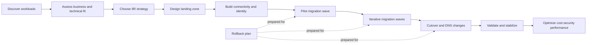

### 🧪 Migration success criteria

- Target workloads meet business recovery objectives such as RPO and RTO.
- Application response time is equal to or better than agreed baseline.
- Security controls, logging, and access reviews are operational before cutover.
- Backups and recovery procedures are tested in the target cloud.
- Runbooks are updated and ownership is clearly assigned.
- Unit cost, total cost, and resource utilization are visible after migration.

## 🔎 Pre-Migration Assessment

### 🧾 Assessment goals

Assessment converts assumptions into evidence. The objective is to understand what exists, how it communicates, how critical it is, what constraints apply, and which migration approach is viable for each workload.

### 1️⃣ Inventory existing infrastructure

- List physical servers, virtual machines, clusters, hypervisors, storage arrays, load balancers, firewalls, DNS servers, and backup systems.
- Capture operating system, version, patch level, CPU, RAM, storage, network interfaces, and virtualization platform details.
- Document application owner, support team, environment tier, maintenance window, and business criticality.
- Record data volumes, growth rate, peak IOPS, latency sensitivity, and backup retention.
- Identify unsupported or end-of-life components early because they may require upgrade before migration.

```bash
# Basic Linux inventory collection example
hostnamectl
uname -r
lsblk
lscpu
free -h
ip -br a
ss -tulpn
systemctl list-units --type=service --state=running
rpm -qa | head -50   # RHEL family
# or
apt list --installed | head -50  # Debian family
```

### 2️⃣ Application dependency mapping

Dependencies determine migration sequencing. A web server may depend on a database, DNS, identity provider, certificate authority, message broker, and SMB or NFS shares. If those dependencies are not moved or reachable at cutover time, the migration fails even if the VM boots.

- Map north-south traffic such as user-to-app, partner-to-API, and internet-to-web.
- Map east-west traffic such as app-to-db, app-to-cache, app-to-message queue, and microservice-to-microservice.
- Identify hard-coded IP addresses, DNS assumptions, TLS certificates, and service account usage.
- Record port and protocol requirements including HTTP, HTTPS, SSH, RDP, SMB, NFS, LDAP, Kerberos, DNS, SMTP, AMQP, and database ports.
- Confirm batch jobs, cron jobs, ETL processes, and backup hooks tied to local network paths.

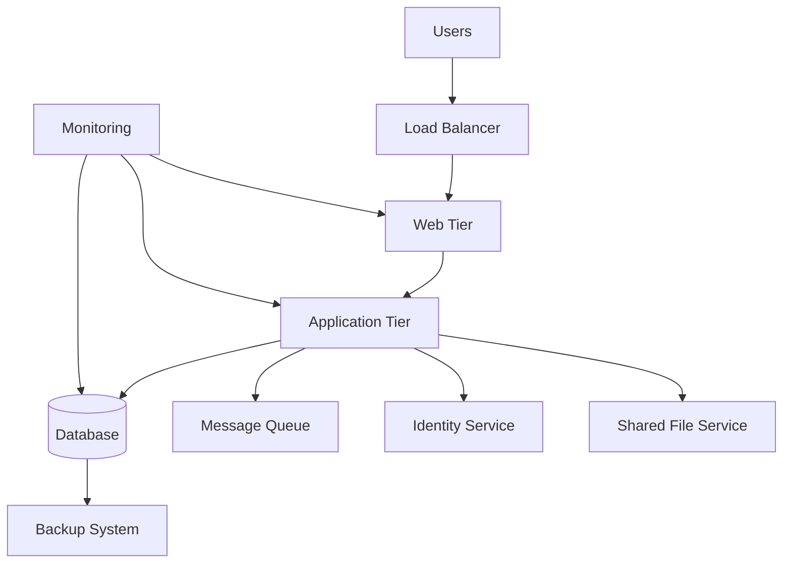

### 3️⃣ Network architecture review

- Document subnets, VLANs, routing domains, NAT paths, MPLS or SD-WAN links, internet breakout, and DMZ placement.
- Measure available WAN throughput and expected replication windows.
- Review firewall policies, proxy requirements, egress restrictions, and DNS forwarding.
- Identify dependencies on multicast, jumbo frames, proprietary appliances, or low-latency east-west traffic.
- Check whether overlapping IP ranges exist, because they complicate hybrid connectivity.

```bash
# Network review examples on Linux jump hosts
ip route
ip -br link
nmcli connection show
traceroute database.internal.example.com
mtr -rw api.partner.example.com
ss -tnp
sudo tcpdump -i eth0 host 10.10.20.15 and port 5432
```

### 4️⃣ Security and compliance requirements

- Classify data: public, internal, confidential, regulated, or restricted.
- Identify encryption requirements for data at rest and in transit.
- Determine IAM model for admins, service accounts, applications, and break-glass access.
- Review logging, retention, time synchronization, and evidence collection requirements.
- Capture geographic residency, sovereignty, and industry controls such as PCI DSS, HIPAA, ISO 27001, SOC 2, and GDPR.

### 5️⃣ Cost analysis and TCO comparison

Total cost of ownership should compare current-state spend and target-state spend across compute, storage, licensing, backup, network egress, support, observability, and staff time. Include transition cost such as replication appliances, contractor effort, dual-running periods, and training.

| Cost domain | On-premises examples | Cloud examples |
| --- | --- | --- |
| Compute | Server purchase, hypervisor licensing | VM hourly cost, reservations, savings plans |
| Storage | SAN, NAS, replication licenses | Managed disks, object storage, snapshots |
| Network | MPLS, internet, firewalls | Data transfer, NAT gateway, load balancer |
| Operations | Patch tooling, backup tooling | Managed monitoring, backup vaults, support plans |
| Facilities | Rack space, power, cooling | Included in provider cost model |
| People | Infrastructure admin time | Cloud platform engineering and FinOps time |

### 🧭 Assessment workflow

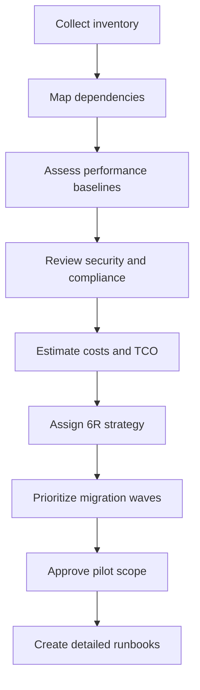

### 📏 Baseline metrics to capture before migration

| Metric | Why it matters | Example collection source |
| --- | --- | --- |
| CPU average and peak | Sizes target instances and scaling policies | hypervisor metrics, sar, top |
| Memory usage | Avoids over-sizing or swap issues | free, vmstat, observability platform |
| Disk IOPS and throughput | Determines disk type and volume layout | storage arrays, iostat |
| Latency to dependencies | Determines whether re-architecture is needed | mtr, app telemetry |
| Transaction rate | Validates performance after cutover | APM, app logs, database metrics |
| Backup duration | Estimates cloud backup windows | backup platform reports |
| Change rate | Influences replication and cutover window | database logs, storage deltas |

### 📝 Assessment deliverables

- Application catalog with owners and criticality.
- Dependency maps and network flow diagrams.
- Landing zone prerequisites and cloud account structure.
- Risk register with mitigation and rollback approach.
- Wave plan that groups workloads by complexity and business tolerance.
- Executive summary that quantifies business value, risks, and estimated cost.

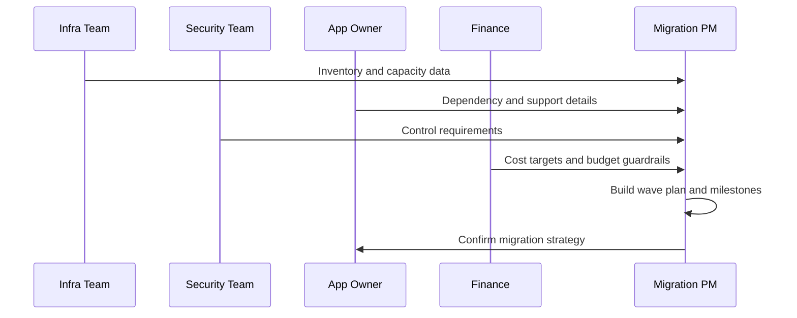

## 🔵 Migration to Azure

### 🏗️ Azure target architecture principles

- Use a landing zone with subscription structure, management groups, policy, logging, RBAC, and connectivity designed before workload migration.
- Create separate subscriptions or resource groups for production, non-production, shared services, and connectivity where appropriate.
- Standardize resource naming, tagging, region selection, backup policies, and key vault usage.
- Prefer Azure Bastion, private endpoints, and managed identities where possible instead of public access and embedded credentials.

### 🧰 Azure Migrate tool setup and usage

1. Create or choose an Azure subscription, resource group, and region for the Azure Migrate project.
2. Open Azure Migrate in the portal and create a new project.
3. Decide whether the source estate is VMware, Hyper-V, physical servers, or other clouds.
4. Deploy the Azure Migrate appliance into the source environment for discovery and assessment.
5. Register the appliance with project credentials and verify connectivity.
6. Start discovery to collect machine inventory, performance history, and dependency data.
7. Run assessments to get right-sized Azure VM recommendations, monthly cost estimates, and readiness warnings.
8. Group machines into migration waves based on dependency and business priority.

```bash
# Log in and set the target subscription
az login
az account set --subscription "Production-Subscription"

# Create a resource group for migration resources
az group create   --name rg-migrate-prod   --location eastus

# Example: create a VNet for migrated workloads
az network vnet create   --resource-group rg-migrate-prod   --name vnet-prod-eastus   --address-prefix 10.50.0.0/16   --subnet-name snet-app   --subnet-prefix 10.50.10.0/24
```


```bash
# Expected output (success):
# [
#   {
#     "cloudName": "AzureCloud",
#     "id": "<subscription-id>",
#     "isDefault": true,
#     "name": "Production-Subscription",
#     "state": "Enabled"
#   }
# ]
# Sample failure:
# ERROR: Please run 'az login' to setup account.
```

```bash
# Expected output (success):
# {
#   "id": "/subscriptions/<subscription-id>/resourceGroups/rg-migrate-prod",
#   "location": "eastus",
#   "name": "rg-migrate-prod",
#   "properties": {"provisioningState": "Succeeded"}
# }
# Sample failure:
# (AuthorizationFailed) The client '<user>' with object id '<object-id>' does not have authorization to perform action 'Microsoft.Resources/subscriptions/resourcegroups/write'.
```

### 🔄 Step-by-step VM migration with Azure Site Recovery (ASR)

1. Prepare the target Azure network, resource group, storage policy, and naming standard.
2. Ensure source servers meet supported OS and replication prerequisites.
3. Install required mobility or replication components if Azure Migrate does not handle them automatically for the chosen source type.
4. Configure replication policy with retention, app-consistent snapshot frequency, and target settings.
5. Enable replication for selected machines.
6. Wait for initial replication to complete and monitor recovery point health.
7. Run a test migration into an isolated test subnet.
8. Validate boot, network connectivity, application startup, agent health, and monitoring hooks.
9. Schedule production cutover window.
10. Quiesce application writes if needed and perform final failover.
11. Commit migration when validation is complete.
12. Decommission or archive source-side replication only after rollback window closes.

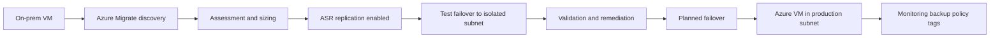

### 🌐 Azure networking setup: VNet, NSG, Load Balancer

A common target pattern is a hub-and-spoke design. Shared services such as firewalls, DNS forwarders, VPN or ExpressRoute gateways, and Bastion stay in the hub. Application VNets or subnets exist in spokes.

1. Create a VNet with address space sized for growth, not only the first wave.
2. Create subnets for web, application, database, management, and test-failover traffic where required.
3. Apply NSGs using deny-by-default logic with explicit inbound and outbound rules.
4. Use Azure Load Balancer for L4 distribution or Application Gateway for L7 features such as TLS termination and WAF.
5. Plan user-defined routes if you insert firewalls or NVA appliances.
6. Integrate private DNS zones or DNS forwarders for hybrid name resolution.

```bash
# Create an NSG and allow HTTPS from the internet
az network nsg create   --resource-group rg-migrate-prod   --name nsg-web-eastus

az network nsg rule create   --resource-group rg-migrate-prod   --nsg-name nsg-web-eastus   --name allow-https-inbound   --priority 100   --direction Inbound   --access Allow   --protocol Tcp   --source-address-prefixes Internet   --source-port-ranges '*'   --destination-address-prefixes '*'   --destination-port-ranges 443

# Associate NSG to subnet
az network vnet subnet update   --resource-group rg-migrate-prod   --vnet-name vnet-prod-eastus   --name snet-app   --network-security-group nsg-web-eastus
```

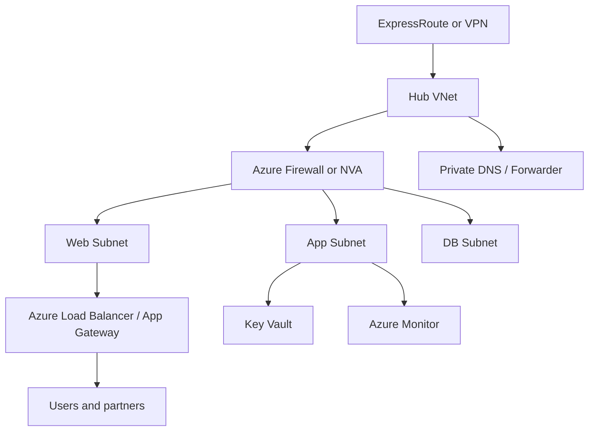

### 🪪 Azure AD integration

- Synchronize identities from on-premises Active Directory using Microsoft Entra Connect when hybrid identity is required.
- Use Microsoft Entra ID groups for RBAC on subscriptions, resource groups, and services.
- Prefer managed identities for Azure-hosted workloads to access Key Vault, storage, or other services without storing credentials.
- Review Conditional Access, MFA, and Privileged Identity Management for administrative access.

```bash
# Assign Reader role to an Azure AD group for a resource group
az role assignment create   --assignee-object-id <group-object-id>   --assignee-principal-type Group   --role Reader   --scope /subscriptions/<subscription-id>/resourceGroups/rg-migrate-prod

# Show available roles
az role definition list --query "[].{roleName:roleName}" -o table
```

### 🛠️ Azure CLI commands for common tasks

```bash
# List VMs in a resource group
az vm list -g rg-migrate-prod -d -o table

# Show VM size options in a region
az vm list-sizes --location eastus -o table

# Create a snapshot before risky changes
az snapshot create   --resource-group rg-migrate-prod   --source /subscriptions/<sub>/resourceGroups/rg-migrate-prod/providers/Microsoft.Compute/disks/app01-osdisk   --name app01-precutover-snap

# Enable boot diagnostics
az vm boot-diagnostics enable   --resource-group rg-migrate-prod   --name app01

# Create Recovery Services vault
az backup vault create   --name rsv-prod-eastus   --resource-group rg-migrate-prod   --location eastus
```

```bash
# Expected output (success):
# Name    ResourceGroup     PowerState    PublicIps    PrivateIps    Location
# ------  ----------------  ------------  -----------  ------------  ----------
# app01   rg-migrate-prod   VM running                 10.50.10.14   eastus
# db01    rg-migrate-prod   VM running                 10.50.20.10   eastus
# Sample failure:
# ERROR: (ResourceGroupNotFound) Resource group 'rg-migrate-prod' could not be found.
```


### 📋 Azure migration runbook

- Confirm Azure region, subscription, and quota availability for the wave.
- Verify connectivity from on-premises to Azure over VPN or ExpressRoute.
- Validate DNS forwarding for migrated subnet resolution.
- Ensure NSGs, routes, and load balancer backends are pre-created.
- Check Azure Policy exemptions are documented if any workload needs temporary deviation.
- Validate backup vault policy and retention assignments.
- Perform test failover and capture screenshots or evidence.
- Confirm application owner sign-off before production failover.
- Freeze source-side changes during final sync window.
- Execute failover and perform smoke tests immediately after boot.
- Update CMDB, diagrams, support contacts, and monitoring dashboards.
- Close the migration only after rollback window expires and backups succeed.

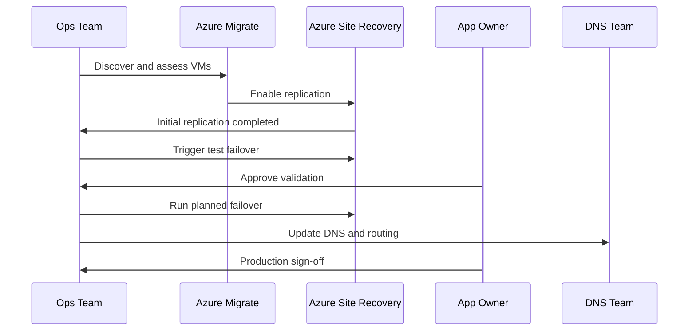


### 📚 Official References
- [Azure Migrate Documentation](https://learn.microsoft.com/en-us/azure/migrate/)
- [Azure Landing Zone](https://learn.microsoft.com/en-us/azure/cloud-adoption-framework/ready/landing-zone/)

## 🟠 Migration to AWS

### 🏗️ AWS target architecture principles

- Build a multi-account strategy using AWS Organizations, separate production from non-production, and centralize logging and security services where possible.
- Use a VPC design that supports future peering, Transit Gateway, and hybrid connectivity.
- Adopt IAM roles, AWS Systems Manager, CloudWatch, and AWS Backup early so operational patterns are consistent before the first migration wave.

### 🧰 AWS Migration Hub

AWS Migration Hub gives a central view across discovery, application grouping, and migration progress. It is especially useful when multiple teams are moving workloads with different migration services.

1. Enable Migration Hub in the target region.
2. Import application grouping information or build groups manually.
3. Connect discovery tools or AWS Application Discovery Service where needed.
4. Track server replication and migration status across waves.
5. Use Migration Hub dashboards in weekly governance reviews.

### 🚚 AWS Server Migration Service / Application Migration Service

AWS Server Migration Service has largely been superseded by AWS Application Migration Service (MGN) for many server migration scenarios. Current programs should generally evaluate MGN first unless a legacy workflow specifically depends on SMS.

1. Create staging area subnets and security groups in the target AWS account.
2. Install the AWS replication agent on source servers.
3. Allow outbound connectivity from source servers to required AWS endpoints.
4. Replicate source disks continuously to the staging area.
5. Right-size launch settings for test and cutover instances.
6. Launch test instances in an isolated subnet.
7. Validate application behavior and adjust instance type, EBS volume, or networking.
8. Schedule cutover, stop source writes if needed, and launch cutover instance.
9. Update DNS, monitoring, and backup configuration.
10. Finalize source decommission after rollback window closes.

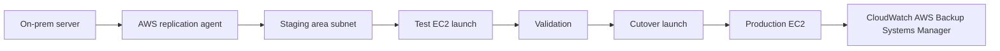

### 🖥️ Step-by-step EC2 migration

1. Create VPC, subnets, route tables, internet or NAT egress, and security groups.
2. Create IAM roles for EC2, Systems Manager, CloudWatch, and backup operations.
3. Install MGN replication agents on source Linux or Windows servers.
4. Wait for initial sync and ensure lag is within acceptable threshold.
5. Launch non-production test instances.
6. Validate hostname strategy, SSH or RDP access, application service startup, and attached storage.
7. Attach or migrate data volumes and verify mount persistence or Windows drive letters.
8. Tune instance family, CPU credits, EBS type, and network performance based on test results.
9. Plan cutover, coordinate downtime, stop source application writes, and launch cutover instance.
10. Repoint DNS or load balancer target groups and validate production traffic.
11. Enable patch baselines, monitoring, and backup policies immediately after cutover.

### 🌐 VPC setup, Security Groups, IAM

```bash
# Create a VPC
aws ec2 create-vpc   --cidr-block 10.60.0.0/16   --tag-specifications 'ResourceType=vpc,Tags=[{Key=Name,Value=vpc-prod}]'

# Create a subnet
aws ec2 create-subnet   --vpc-id vpc-xxxxxxxx   --cidr-block 10.60.10.0/24   --availability-zone us-east-1a   --tag-specifications 'ResourceType=subnet,Tags=[{Key=Name,Value=subnet-app-a}]'

# Create a security group
aws ec2 create-security-group   --group-name sg-web-prod   --description "Allow HTTPS"   --vpc-id vpc-xxxxxxxx

# Allow HTTPS inbound
aws ec2 authorize-security-group-ingress   --group-id sg-xxxxxxxx   --ip-permissions IpProtocol=tcp,FromPort=443,ToPort=443,IpRanges='[{CidrIp=0.0.0.0/0,Description="HTTPS"}]' 
```

```bash
# Expected output (success):
# {
#   "Vpc": {
#     "VpcId": "vpc-0abc123def4567890",
#     "State": "pending",
#     "CidrBlock": "10.60.0.0/16"
#   }
# }
# Sample failure:
# An error occurred (UnauthorizedOperation) when calling the CreateVpc operation: You are not authorized to perform this operation.
```


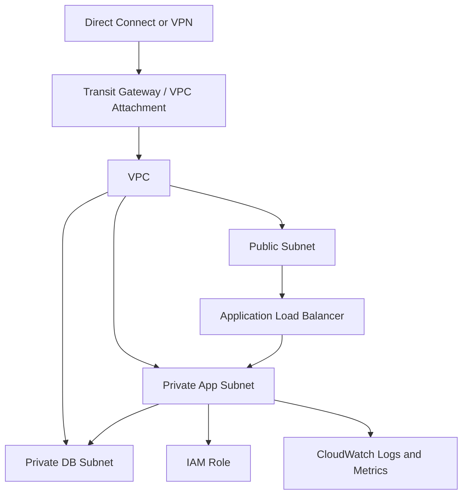

### 🛠️ AWS CLI commands

```bash
# List EC2 instances
aws ec2 describe-instances   --filters Name=instance-state-name,Values=running   --query 'Reservations[].Instances[].{Name:Tags[?Key==`Name`]|[0].Value,ID:InstanceId,Type:InstanceType,PrivateIP:PrivateIpAddress}'   --output table

# Create an AMI for rollback or backup
aws ec2 create-image   --instance-id i-xxxxxxxx   --name app01-precutover-ami   --no-reboot

# Create CloudWatch alarm for CPU
aws cloudwatch put-metric-alarm   --alarm-name app01-high-cpu   --metric-name CPUUtilization   --namespace AWS/EC2   --statistic Average   --period 300   --threshold 80   --comparison-operator GreaterThanThreshold   --dimensions Name=InstanceId,Value=i-xxxxxxxx   --evaluation-periods 2
```

```bash
# Expected output (success):
# --------------------------------------------------------------
# |                      DescribeInstances                      |
# +---------+----------------------+-------------+-------------+
# |   ID    |         Name         |    Type     |  PrivateIP  |
# +---------+----------------------+-------------+-------------+
# | i-0123  | app01                | t3.large    | 10.60.10.14 |
# | i-0456  | db01                 | m6i.xlarge  | 10.60.20.11 |
# +---------+----------------------+-------------+-------------+
# Sample failure:
# An error occurred (AuthFailure) when calling the DescribeInstances operation: AWS was not able to validate the provided access credentials.
```


### 📋 AWS migration runbook

- Confirm target account guardrails, SCPs, and IAM role assumptions are ready.
- Verify VPC CIDR does not overlap with existing on-premises connected networks.
- Check Direct Connect or VPN health and route propagation.
- Validate security group and NACL rules for application ports.
- Ensure Systems Manager access is working for management without broad SSH exposure.
- Test backup policy attachment and snapshot lifecycle.
- Confirm load balancer health checks before cutover.
- Launch test instance and document any init system or network interface changes.
- Execute cutover in maintenance window and watch CloudWatch logs during first transactions.
- Record final source shutdown time and snapshot references for rollback.
- Update tags for owner, environment, application, cost-center, and compliance scope.
- Hold a stabilization review after 24 hours and 7 days.

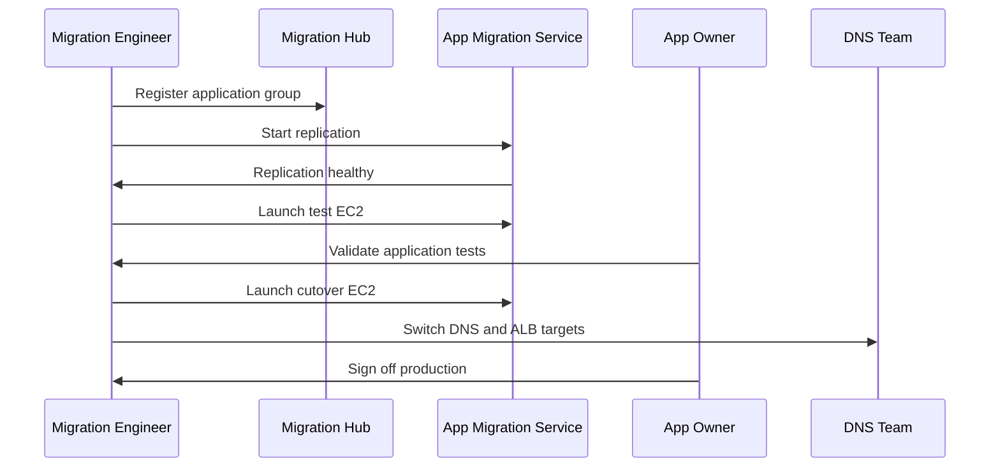


### 📚 Official References
- [AWS Migration Hub](https://docs.aws.amazon.com/migrationhub/)
- [AWS Well-Architected Migration Lens](https://docs.aws.amazon.com/wellarchitected/latest/migration-lens/)

## 🔴 Migration to GCP

### 🏗️ GCP target architecture principles

- Design projects, folders, billing accounts, IAM bindings, and organization policies before moving production workloads.
- Use Shared VPC when central networking teams manage multiple application projects.
- Adopt Cloud Logging, Cloud Monitoring, OS Login, and IAM service accounts for consistent operations.

### 🧰 Google Cloud Migrate for Compute Engine

Migrate for Compute Engine helps move VMware, AWS, Azure, and physical workloads into Compute Engine with migration waves, cloning, testing, and cutover automation.

1. Create a GCP project with required APIs enabled.
2. Set up networking, firewall rules, service accounts, and Cloud VPN or Cloud Interconnect if hybrid connectivity is required.
3. Deploy the migration manager and source connectors as required by the tool version and source platform.
4. Discover source machines and group them by application or wave.
5. Configure target instance settings such as machine type, zone, disk layout, service account, and tags.
6. Create test clones and perform functional validation.
7. Execute cutover migration during approved window.
8. Harden the resulting Compute Engine instances with monitoring, backups, and IAM restrictions.

### 🖥️ Step-by-step VM migration

1. Create or select the target project and billing account.
2. Create VPC network, subnets, Cloud Router, and VPN or Interconnect if needed.
3. Grant IAM roles to migration administrators, network admins, and operations users.
4. Install or deploy required migration components in the source environment.
5. Replicate source workloads and validate that change rate fits the replication window.
6. Create a test clone in a dedicated test subnet with restricted firewall rules.
7. Validate startup scripts, mounted disks, application ports, and identity integration.
8. Run final cutover and preserve the source snapshot or machine image for rollback.
9. Attach backup schedules, alerting policies, and cost labels after cutover.

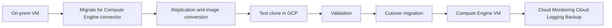

### 🌐 VPC, Firewall Rules, IAM

```bash
# Create a VPC network
gcloud compute networks create vpc-prod   --subnet-mode=custom

# Create a subnet
gcloud compute networks subnets create subnet-app-uscentral1   --network=vpc-prod   --region=us-central1   --range=10.70.10.0/24

# Allow HTTPS to tagged instances
gcloud compute firewall-rules create allow-https-web   --network=vpc-prod   --direction=INGRESS   --action=ALLOW   --rules=tcp:443   --source-ranges=0.0.0.0/0   --target-tags=web

# Grant compute admin role to a group
gcloud projects add-iam-policy-binding my-prod-project   --member='group:cloud-ops@example.com'   --role='roles/compute.admin' 
```

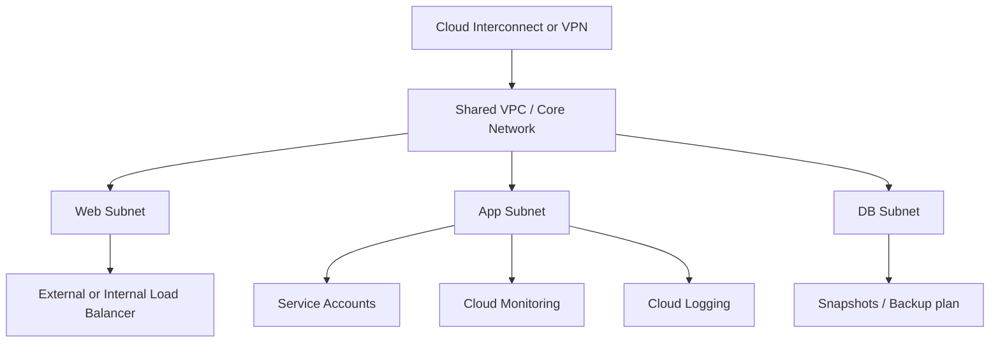

### 🛠️ gcloud CLI commands

```bash
# List instances
gcloud compute instances list

# Create a snapshot before risky changes
gcloud compute disks snapshot app01-disk   --zone=us-central1-a   --snapshot-names=app01-precutover-snap

# Create a health check
gcloud compute health-checks create http app-health-check   --port=8080   --request-path=/health

# Create an instance template example
gcloud compute instance-templates create app-template-v1   --machine-type=e2-standard-4   --subnet=subnet-app-uscentral1   --tags=app,web
```

```bash
# Expected output (success):
# Created [https://www.googleapis.com/compute/v1/projects/my-prod-project/global/networks/vpc-prod].
# Sample failure:
# ERROR: (gcloud.compute.networks.create) Could not fetch resource:
#  - Required 'compute.networks.create' permission for 'projects/my-prod-project'.
```

```bash
# Expected output (success):
# NAME   ZONE           MACHINE_TYPE   INTERNAL_IP   EXTERNAL_IP  STATUS
# app01  us-central1-a  e2-standard-4  10.70.10.14                RUNNING
# db01   us-central1-b  e2-standard-8  10.70.20.12                RUNNING
# Sample failure:
# ERROR: (gcloud.compute.instances.list) Some requests did not succeed:
#  - Insufficient Permission
```


### 📋 GCP migration runbook

- Confirm quotas for CPUs, disks, snapshots, forwarding rules, and addresses in the target region.
- Verify organization policies do not block required APIs or external IP usage if the design needs them.
- Check Shared VPC host project attachments and subnet IAM permissions.
- Validate firewall rules, routes, and Cloud Router advertisement.
- Test OS Login or bastion access patterns for admin operations.
- Confirm Cloud Monitoring agents or Ops Agent are installed after cutover.
- Create test clones and verify service startup ordering and persistent disk mounts.
- Run production cutover and capture serial console logs if boot issues occur.
- Update Cloud DNS or hybrid DNS forwarding as part of the cutover checklist.
- Enable snapshots or backup plans immediately after cutover.
- Label resources for owner, environment, application, and cost tracking.
- Schedule post-cutover rightsizing review after one week of telemetry.

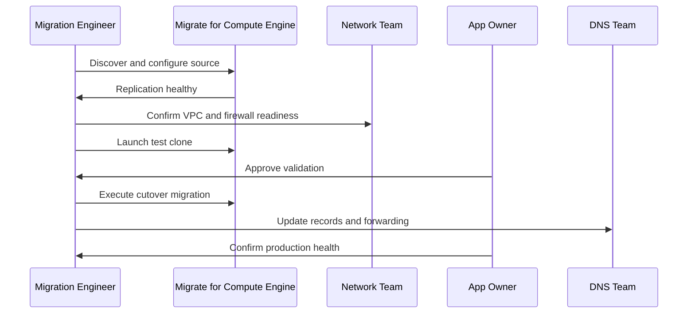


### 📚 Official References
- [Google Cloud Migration Center](https://cloud.google.com/migration-center/docs)
- [Google Cloud Architecture Framework](https://cloud.google.com/architecture/framework)

### 🔧 Common Migration Failures & Fixes

| Issue | Symptoms | Root Cause | Fix |
|-------|----------|-----------|-----|
| VM won't boot after migration | Kernel panic, no bootable device | Missing virtio drivers / wrong boot mode | Install virtio drivers pre-migration, verify UEFI/BIOS |
| Network unreachable after migration | No connectivity, ping fails | NIC naming changed (`eth0` → `ens5`), route missing | Update `/etc/sysconfig/network-scripts` or netplan, check security groups |
| Application slow after migration | High latency, timeouts | Wrong instance size, disk IOPS limit | Right-size instance, use premium SSD, check proximity |
| DNS resolution fails | Can't resolve internal names | DNS forwarder not configured | Configure VPC DNS, add conditional forwarders |
| Permission denied on data | App can't read migrated files | UID/GID mismatch, SELinux context lost | Fix ownership, restore SELinux contexts with `restorecon` |
| Database replication lag | Data inconsistency, stale reads | WAN latency, insufficient bandwidth | Use database-native migration tools (DMS), schedule during low traffic |
| License activation fails | App won't start, license error | Hardware fingerprint changed | Contact vendor for cloud-compatible license, use BYOL programs |
| Time sync issues | Certificates fail, Kerberos errors | NTP not configured for cloud | Configure `chrony` with cloud NTP (`169.254.169.123` for AWS, metadata guidance for GCP) |

## ✅ Post-Migration Steps

### 🧪 Validation and testing checklist

- Verify instance boots cleanly and core services are active.
- Validate application logins, transactions, background jobs, scheduled tasks, and integrations.
- Confirm mounted storage, permissions, encryption, and backup policy attachment.
- Test outbound access to SMTP, APIs, package repositories, and identity providers.
- Review firewall, NSG, Security Group, or GCP firewall hits to ensure no hidden dependency remains blocked.
- Check certificates, TLS chains, and private key access if offloaded services changed.
- Confirm monitoring dashboards and alert routes are receiving telemetry.
- Run failover or restore tests for at least one representative workload.

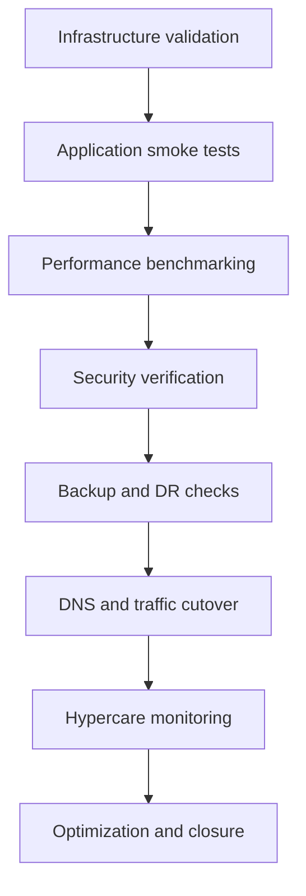

### 🌍 DNS cutover

1. Lower TTL well before cutover if business policy allows.
2. Prepare new A, AAAA, CNAME, or load balancer records in advance.
3. Use split-horizon or hybrid DNS carefully so on-premises and cloud systems resolve consistently during transition.
4. Update records only after application health checks pass in the target cloud.
5. Monitor authoritative and recursive resolver propagation.
6. Keep source environment available for rollback until business validation completes.

```bash
# Example validation commands after DNS cutover
dig +short app.example.com
nslookup app.example.com
curl -Ik https://app.example.com
openssl s_client -connect app.example.com:443 -servername app.example.com </dev/null
```

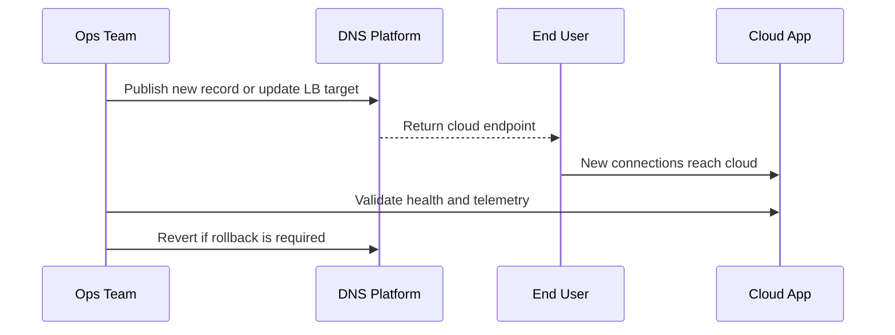

### 📈 Performance benchmarking

- Compare pre-migration and post-migration transaction latency.
- Test peak load, batch windows, cache warmup, and startup times.
- Measure network latency to retained on-premises dependencies.
- Record CPU, memory, disk, and network utilization for sizing corrections.
- Validate autoscaling or scale-up behavior where implemented.

```bash
# Basic Linux benchmarking examples
vmstat 1 5
iostat -xz 1 5
sar -n DEV 1 5
curl -w "dns:%{time_namelookup} connect:%{time_connect} tls:%{time_appconnect} ttfb:%{time_starttransfer} total:%{time_total}
" -o /dev/null -s https://app.example.com
```

### 📡 Monitoring setup

| Platform | Primary service | Key actions after migration |
| --- | --- | --- |
| Azure | Azure Monitor / Log Analytics / Application Insights | Enable VM insights, collect logs, create alerts, wire action groups |
| AWS | CloudWatch / CloudTrail / Systems Manager | Enable metrics, logs, alarms, dashboards, and runbooks |
| GCP | Cloud Monitoring / Cloud Logging / Ops Agent | Install agent, create uptime checks, alerting policies, and dashboards |

### 💾 Backup and DR configuration

- Set backup policy immediately after cutover; do not wait for the next sprint.
- Define retention by data class and compliance requirement.
- Test restore to alternate location or isolated network.
- Document DR topology: same-region, cross-zone, cross-region, or pilot-light.
- Review application-consistent snapshot support for databases and stateful apps.

### 💰 Cost optimization

- Right-size based on real utilization after 7, 30, and 90 days.
- Evaluate reservations, savings plans, committed use discounts, or Azure Reserved Instances.
- Move infrequently accessed data to lower-cost storage tiers.
- Remove unused public IPs, idle disks, test instances, and stale snapshots.
- Use tagging or labels to enforce cost allocation and accountability.
- Monitor inter-region and internet egress charges, especially for retained hybrid dependencies.

## 📊 Cloud Comparison Table

### 🆚 Feature-by-feature comparison

| Capability | Azure | AWS | GCP |
| --- | --- | --- | --- |
| Core identity | Microsoft Entra ID integration is strong for Microsoft estates | IAM with roles and policies is mature and granular | Cloud IAM with strong project and org hierarchy |
| Hybrid connectivity | VPN Gateway and ExpressRoute | Site-to-Site VPN and Direct Connect | Cloud VPN and Cloud Interconnect |
| VM migration tooling | Azure Migrate and ASR | Migration Hub and Application Migration Service | Migrate for Compute Engine |
| Monitoring | Azure Monitor, Log Analytics, Application Insights | CloudWatch, CloudTrail, X-Ray | Cloud Monitoring, Cloud Logging, Trace |
| Backup | Azure Backup and Recovery Services vaults | AWS Backup and snapshots | Backup and DR service, snapshots |
| Managed Kubernetes | AKS | EKS | GKE |
| Strengths often cited | Enterprise Microsoft alignment and hybrid story | Service breadth and ecosystem maturity | Data analytics, Kubernetes, and network simplicity |
| Common concern | Portal and RBAC complexity in large estates | Account sprawl and pricing complexity | Smaller service catalog in some enterprise niches |

### 💵 Pricing models

| Pricing topic | Azure | AWS | GCP |
| --- | --- | --- | --- |
| On-demand | Pay per use by second or hour depending on service | Pay per use, broad marketplace and instance families | Pay per use with sustained use benefits on many services |
| Commitment discounts | Reserved instances and savings plans equivalents | Reserved Instances and Savings Plans | Committed Use Discounts |
| Spot / preemptible | Spot VMs | Spot Instances | Spot VMs |
| Storage tiers | Hot, cool, archive and disk tiers | Standard, infrequent access, glacier-style tiers | Standard, nearline, coldline, archive |
| Cost management | Cost Management + budgets | Cost Explorer + budgets | Billing reports + budgets + recommender |

### 🔁 Equivalent services mapping

| Need | Azure | AWS | GCP |
| --- | --- | --- | --- |
| Virtual machines | Azure Virtual Machines | Amazon EC2 | Compute Engine |
| Object storage | Blob Storage | Amazon S3 | Cloud Storage |
| Block storage | Managed Disks | EBS | Persistent Disk |
| Managed SQL database | Azure SQL / SQL MI | RDS / Aurora | Cloud SQL / AlloyDB |
| Load balancing | Azure Load Balancer / Application Gateway | ELB / ALB / NLB | Cloud Load Balancing |
| Private networking | VNet | VPC | VPC |
| Identity | Microsoft Entra ID | IAM / IAM Identity Center | Cloud IAM / Cloud Identity |
| Secrets | Key Vault | Secrets Manager / Parameter Store | Secret Manager |
| Monitoring | Azure Monitor | CloudWatch | Cloud Monitoring |
| Backup | Azure Backup | AWS Backup | Backup and DR / snapshots |
| VPN | VPN Gateway | Site-to-Site VPN | Cloud VPN |
| Dedicated private link | ExpressRoute | Direct Connect | Cloud Interconnect |

## 🔗 Hybrid Cloud Setup

### 🔐 VPN connectivity

- VPN is usually the fastest way to begin a pilot or initial migration wave.
- Use it to validate routing, DNS forwarding, identity reachability, and management access before investing in dedicated circuits.
- Design with route summarization and failover in mind, and monitor tunnel SLA and packet loss.

### 🚄 ExpressRoute / Direct Connect / Cloud Interconnect

Dedicated connectivity is preferred for sustained high-throughput replication, latency-sensitive traffic, regulated workloads, and large-scale hybrid operations. It also reduces reliance on internet VPN paths during cutover windows.

| Provider | Service | When to use |
| --- | --- | --- |
| Azure | ExpressRoute | Enterprise hybrid connectivity, private peering, predictable latency |
| AWS | Direct Connect | Large migration waves, stable throughput, hybrid data transfer |
| GCP | Cloud Interconnect | High bandwidth hybrid links and shared services connectivity |

### 🧭 Hybrid DNS

- Keep authoritative zones and conditional forwarders documented before migration begins.
- Avoid split-brain surprises by testing resolution paths from both on-premises and cloud networks.
- Consider private DNS zones in cloud plus forwarding back to on-premises for retained services.
- Record which systems own forward and reverse zones, certificate validation flows, and TTL policies.

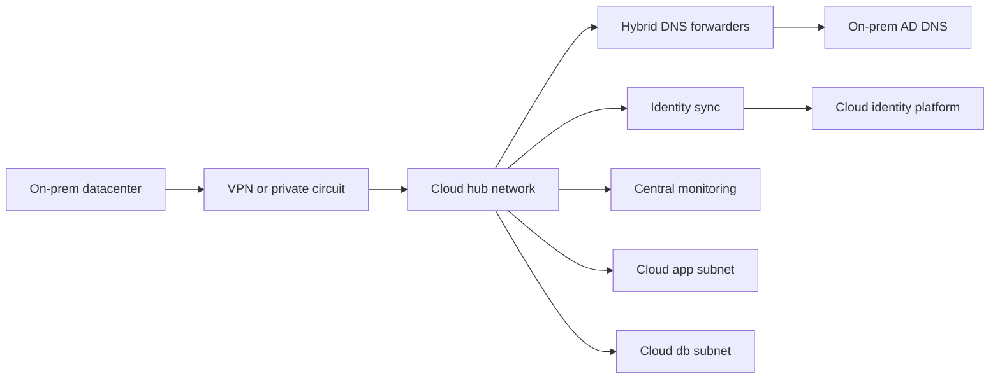

### 🧱 Hybrid operating model tips

- Keep source and target monitoring visible in one dashboard during migration waves.
- Prefer DNS names over hard-coded IP addresses so routing and endpoint ownership can change safely.
- Plan egress cost if cloud apps continue to call on-premises systems long-term.
- Use centralized certificate lifecycle management because hybrid apps often fail due to certificate chain mismatches.
- Design least-privilege firewall rules for both directions, not only inbound to the cloud.

## 🏢 Real-World Migration Scenarios

### Scenario 1: Three-tier customer portal to Azure

A manufacturing company runs a customer portal on VMware: two web VMs, two app VMs, and one SQL Server database. The business needs to close a secondary datacenter within six months, but the application cannot be refactored immediately. The chosen strategy is rehost for web and app tiers, and replatform for database into Azure SQL Managed Instance after the first wave.

1. Assess web and app VMs with Azure Migrate and verify readiness.
2. Deploy hub-and-spoke Azure network with VPN or ExpressRoute back to headquarters.
3. Replicate web and app VMs using ASR.
4. Run test failover in isolated subnet and validate AD login, file shares, and outbound SMTP.
5. Migrate SQL to a managed target in a later, tightly controlled step.
6. Move DNS records to Azure Application Gateway only after database connectivity is confirmed.
7. Enable Azure Monitor, Defender for Cloud, backup, and policy compliance dashboards.

### Scenario 2: ERP system to AWS with minimal downtime

A retail company runs an ERP application on Linux with Oracle database on separate VMs. It needs lower downtime than a weekend rebuild would allow. The team uses AWS Application Migration Service for app servers and a database-native replication pattern for the database. Direct Connect is provisioned to handle sustained replication and cutover traffic.

1. Create production and staging VPCs with private subnets and Transit Gateway attachment.
2. Install MGN agents on Linux app servers and start replication.
3. Build IAM roles and Systems Manager access to avoid direct internet-exposed SSH.
4. Replicate database using native tooling, test consistency, and define cutover freeze window.
5. Launch test EC2 instances and validate ERP transactions end to end.
6. Execute database cutover, launch final app instances, and switch ALB and DNS.
7. Use CloudWatch dashboards and AWS Backup from day one.

### Scenario 3: Analytics platform to GCP for modernization

A media company collects batch analytics workloads on self-managed Linux servers with high storage growth and periodic compute spikes. It chooses GCP because the long-term target includes BigQuery and GKE, but the first stage is a VM migration to reduce hardware dependence and stabilize operations.

1. Use Migrate for Compute Engine to move Linux workers into Compute Engine.
2. Place workloads in a Shared VPC and attach Cloud Monitoring and centralized logging.
3. Benchmark storage and network throughput because analytics jobs are bursty.
4. Gradually offload raw data into Cloud Storage and later refactor ETL steps into managed services.
5. Use labels for cost allocation by data product and department.
6. Implement snapshots and backup plans before retiring source storage.

### Scenario 4: Hybrid compliance workload retained on-premises with cloud DR

A financial services workload cannot move its production database due to regulatory and latency constraints, but the business wants cloud-based disaster recovery and cloud-hosted web services. The database is retained on-premises, while stateless application tiers move to cloud and consume the retained database over a private circuit.

1. Retain the regulated database on-premises for now.
2. Move stateless web and API tiers to the cloud.
3. Use ExpressRoute, Direct Connect, or Cloud Interconnect for stable private connectivity.
4. Implement strict firewall rules, mutual TLS, and end-to-end monitoring.
5. Benchmark round-trip latency before production go-live.
6. Create a future roadmap to refactor the database tier if regulation or architecture later permits.

## 📋 Appendices and Operational Checklists

### Appendix A: Detailed discovery checklist

#### Compute inventory

- [ ] Hostname, FQDN, and asset ID recorded.
- [ ] Environment identified as production, staging, test, or development.
- [ ] Business owner and technical owner documented.
- [ ] Operating system, version, and patch level captured.
- [ ] CPU, memory, and storage profile recorded.
- [ ] Hypervisor or bare-metal platform noted.
- [ ] Installed agents documented: backup, security, monitoring, CMDB.
- [ ] Boot mode, partition scheme, and disk layout understood.
- [ ] Current backup schedule and retention recorded.
- [ ] Maintenance window and change freeze periods documented.

#### Application inventory

- [ ] Application name and business capability mapped.
- [ ] Runtime stack identified: Java, .NET, Python, PHP, Node.js, Go, or other.
- [ ] Application ports, listeners, and URLs documented.
- [ ] Inbound and outbound dependencies captured.
- [ ] Secrets, certificates, and keystore locations documented.
- [ ] Batch jobs and scheduled tasks recorded.
- [ ] Service accounts and credential rotation procedures documented.
- [ ] License model reviewed for cloud suitability.
- [ ] Support escalation contacts identified.
- [ ] Business acceptance test cases collected.

#### Database inventory

- [ ] Engine and version recorded.
- [ ] Database size, growth rate, and backup size captured.
- [ ] Replication mode or clustering model documented.
- [ ] Maintenance jobs and ETL dependencies listed.
- [ ] Encryption settings recorded.
- [ ] Recovery objectives documented.
- [ ] Connection strings and DNS aliases captured.
- [ ] I/O profile and peak transaction periods measured.
- [ ] Restore test history reviewed.
- [ ] Schema change freeze process understood.

#### Network inventory

- [ ] Subnet, VLAN, route, and gateway information captured.
- [ ] Firewall allow rules documented with owner and rationale.
- [ ] Proxy requirements recorded.
- [ ] DNS zones and forwarders mapped.
- [ ] Load balancer VIPs and health checks documented.
- [ ] Bandwidth and latency baselines measured.
- [ ] Overlapping address space identified.
- [ ] NTP sources documented.
- [ ] Remote administration paths recorded.
- [ ] Packet capture points identified for troubleshooting.

#### Security inventory

- [ ] Data classification assigned.
- [ ] Compliance scope recorded.
- [ ] Privileged access flow documented.
- [ ] MFA requirements validated.
- [ ] Encryption keys and HSM dependencies identified.
- [ ] Log retention requirements documented.
- [ ] Vulnerability exceptions reviewed.
- [ ] Endpoint protection compatibility checked.
- [ ] Incident response contacts updated.
- [ ] Evidence requirements for go-live approval captured.

### Appendix B: Migration wave template

| Field | Example value |
| --- | --- |
| Wave name | Wave-01-internal-web |
| Business window | Saturday 22:00 to Sunday 04:00 |
| Applications | Portal web, API gateway, reporting UI |
| Migration strategy | Rehost |
| Source platform | VMware vSphere |
| Target cloud | Azure East US |
| Connectivity | ExpressRoute active-active |
| Rollback trigger | Critical functional test fails or latency > 2x baseline |
| Communication plan | War room bridge, Teams/Slack, status updates every 30 minutes |
| Success owner | Application owner and cloud ops lead |

### Appendix C: Cutover command reference

#### Azure

```bash
# Verify Azure VM power state
az vm get-instance-view -g rg-migrate-prod -n app01 --query instanceView.statuses[].displayStatus -o tsv

# Update private IP if needed
az network nic ip-config update   --resource-group rg-migrate-prod   --nic-name app01-nic   --name ipconfig1   --private-ip-address 10.50.10.21
```

#### AWS

```bash
# Check EC2 state
aws ec2 describe-instances --instance-ids i-xxxxxxxx --query 'Reservations[].Instances[].State.Name' --output text

# Register target in a load balancer target group
aws elbv2 register-targets   --target-group-arn arn:aws:elasticloadbalancing:region:acct:targetgroup/app-tg/123456   --targets Id=i-xxxxxxxx,Port=8080
```

#### GCP

```bash
# Check instance serial port output
gcloud compute instances get-serial-port-output app01 --zone=us-central1-a

# Add tags for firewall targeting
gcloud compute instances add-tags app01   --zone=us-central1-a   --tags=app,web
```

### Appendix D: Rollback planning checklist

- [ ] Source snapshot or VM checkpoint taken and timestamp recorded.
- [ ] Source services remain stopped but restorable during rollback window.
- [ ] DNS rollback steps written and tested.
- [ ] Load balancer target group or backend pool revert procedure documented.
- [ ] Database write divergence plan defined.
- [ ] Stakeholder communication trigger for rollback agreed.
- [ ] Maximum decision time before rollback defined.
- [ ] Restoration owners assigned for app, network, database, and DNS.
- [ ] Rollback validation tests documented.
- [ ] Evidence location for screenshots, logs, and approvals recorded.

### Appendix E: Monitoring minimums by workload tier

#### Web tier

- HTTP success rate
- TLS handshake errors
- Load balancer health
- CPU
- memory
- disk usage
- certificate expiry

#### Application tier

- Queue depth
- request latency
- error rate
- dependency timeout rate
- thread pool saturation
- memory pressure

#### Database tier

- Connection count
- replication lag
- read and write latency
- cache hit ratio
- backup success
- storage free space

#### Platform tier

- VPN or circuit health
- DNS success rate
- IAM auth failures
- configuration drift
- backup job success

### Appendix F: Service mapping quick reference

| Need | Azure | AWS | GCP |
| --- | --- | --- | --- |
| Directory sync | Microsoft Entra Connect | IAM Identity Center / AD Connector patterns | Cloud Identity / federation |
| Server backup | Azure Backup | AWS Backup | Backup and DR / snapshots |
| Policy governance | Azure Policy | AWS Config + SCPs | Org Policy + Config Validator patterns |
| Key management | Key Vault | KMS | Cloud KMS |
| Container registry | ACR | ECR | Artifact Registry |
| Message queue | Service Bus | SQS / SNS / MQ | Pub/Sub |

### Appendix G: Migration risk register examples

| Risk | Impact | Mitigation |
| --- | --- | --- |
| Undocumented dependency | High | Perform flow capture and owner interviews before scheduling wave |
| Bandwidth too low for replication | High | Seed data, compress traffic, or use dedicated connectivity |
| DNS inconsistency | Medium | Lower TTL and test resolution from all segments |
| Identity failure after cutover | High | Validate federation, group sync, and fallback admin path |
| Storage latency regression | High | Benchmark and choose suitable disk class before production |
| Cost overrun | Medium | Apply tags, budgets, and rightsizing review cadence |
| Security policy block | Medium | Review provider policies and required exceptions in advance |
| Backup gap after cutover | High | Attach backup policy as a mandatory go-live step |

### Appendix H: Expanded migration readiness matrix

- [ ] Executive sponsorship
- [ ] Budget approval
- [ ] Network connectivity
- [ ] Cloud IAM design
- [ ] Logging and monitoring
- [ ] Backup and DR
- [ ] Application testing
- [ ] Database migration plan
- [ ] Security sign-off
- [ ] Compliance evidence
- [ ] Cutover communications
- [ ] Rollback documentation

### Appendix I: Day-0, Day-1, Day-2 operations

| Phase | Focus |
| --- | --- |
| Day 0 | Build landing zone, connectivity, IAM, monitoring, backup, base images |
| Day 1 | Migrate workloads, validate functionality, perform cutover, enter hypercare |
| Day 2 | Optimize performance, automate patching, refine alerts, reduce cost, improve resilience |

### Appendix J: Platform-specific validation scripts

```bash
# Generic Linux post-migration validation helper
hostnamectl
ip -br a
ip route
mount | column -t | head -50
systemctl --failed
journalctl -p err -b --no-pager | tail -50
curl -fsS http://127.0.0.1:8080/health || true
ss -tulpn | head -50
```

### Appendix K: Comprehensive pre-cutover checklist

#### Governance

- [ ] Change request approved.
- [ ] Business owner approval recorded.
- [ ] Support teams notified.
- [ ] War room bridge prepared.
- [ ] Status page draft prepared.
- [ ] Escalation matrix confirmed.
- [ ] Freeze window communicated.
- [ ] Vendor contacts on standby.
- [ ] Rollback authority defined.
- [ ] Evidence repository prepared.

#### Source environment

- [ ] Source backups successful.
- [ ] Source snapshots taken.
- [ ] Source monitoring healthy.
- [ ] No critical incidents open.
- [ ] Clock synchronization verified.
- [ ] Enough free storage for replication delta.
- [ ] Source antivirus exclusions reviewed.
- [ ] Replication agent healthy.
- [ ] Last configuration drift reviewed.
- [ ] Application writes freeze procedure tested.

#### Target environment

- [ ] Target subnet created.
- [ ] Route tables attached.
- [ ] Security rules approved.
- [ ] Target IAM roles assigned.
- [ ] Target logging enabled.
- [ ] Target backup policy attached.
- [ ] Jump host or bastion access tested.
- [ ] Load balancer configured.
- [ ] Secrets populated.
- [ ] Tagging standards applied.

#### Testing

- [ ] Smoke tests documented.
- [ ] Performance baseline available.
- [ ] Synthetic monitoring prepared.
- [ ] DB connectivity test ready.
- [ ] External dependency tests ready.
- [ ] User acceptance contacts available.
- [ ] Rollback tests documented.
- [ ] Serial console or boot diagnostics enabled.
- [ ] Post-cutover benchmark plan ready.
- [ ] DNS validation commands prepared.

### Appendix L: Workload archetypes and migration hints

- **Simple web server:** Rehost first, then place behind managed load balancer and WAF.
- **Three-tier business app:** Move tiers in dependency-aware waves and validate DB latency.
- **File server:** Review permissions, SMB or NFS semantics, and backup restoration process.
- **Directory-integrated app:** Validate LDAP, Kerberos, time sync, and group membership resolution.
- **License-bound app:** Check host binding, dongles, MAC locks, and vendor support statements.
- **Batch ETL worker:** Benchmark storage throughput and scheduling window changes.
- **Stateful database:** Use engine-native migration where possible, not only VM replication.
- **Low-latency plant system:** Consider retain or hybrid if circuit latency breaks requirements.
- **Legacy unsupported OS:** Upgrade first or isolate in tightly controlled migration pattern.
- **Internet-facing API:** Prioritize TLS, WAF, DDoS posture, and rate-limiting in target cloud.

### Appendix M: 90-day optimization backlog examples

1. Right-size oversized instances based on telemetry.
2. Move static assets to object storage and CDN.
3. Replace static admin keys with managed identities or IAM roles.
4. Centralize secrets in provider-native secret store.
5. Convert manual patching to automated maintenance windows.
6. Add autoscaling or scheduled scaling where safe.
7. Tune log retention for compliance and cost balance.
8. Remove temporary firewall exceptions from migration window.
9. Refine backup retention and copy policies.
10. Evaluate managed database adoption for next wave.
11. Automate infrastructure through Terraform, Bicep, CloudFormation, or Deployment Manager alternatives.
12. Implement policy-as-code guardrails.
13. Consolidate duplicate monitoring alerts.
14. Measure and reduce cross-zone or cross-region data transfer.
15. Document golden images and baseline hardening.

### Appendix N: Domain-by-domain migration questionnaire

#### Identity

- Which directory is authoritative for users?
- How are privileged accounts separated from daily-use accounts?
- Is MFA required for cloud admins?
- Which service accounts are embedded in config files?
- Are certificates tied to machine names or IP addresses?
- Is there a break-glass admin path?
- How often are groups synchronized?
- Are legacy NTLM dependencies present?
- Do workloads require Kerberos constrained delegation?
- How is password rotation automated?

#### Networking

- What are the source CIDR blocks?
- Do target CIDRs overlap?
- What DNS zones are required?
- Which egress destinations must remain reachable?
- Is asymmetric routing possible after migration?
- Will firewalls inspect east-west traffic?
- Are proxies required for package updates?
- What is the tolerated latency to retained systems?
- Which ports are opened only temporarily for migration?
- Is jumbo frame support required?

#### Storage

- What is the hot data set size?
- What is the cold data set size?
- Do applications rely on block, file, or object semantics?
- How long do restores currently take?
- Do snapshots need application quiescing?
- Is encryption key ownership regulated?
- What is the monthly growth rate?
- Are there archival obligations?
- What are peak write bursts?
- Are backup windows already constrained?

#### Operations

- Who owns patching?
- Who owns backup success review?
- Who approves emergency rollback?
- Are runbooks current?
- What is the change calendar conflict for the next quarter?
- Are NOC dashboards ready for the new cloud targets?
- Will ticket routing change?
- Is there a 24x7 support requirement?
- What evidence is required for closure?
- Are CMDB updates automated?

#### Security

- What logs must be centralized?
- How long must they be retained?
- Is endpoint protection provider-approved in cloud images?
- Which subnets may have internet access?
- Are public IPs prohibited?
- Is customer-managed encryption required?
- What vulnerability scan windows exist?
- What are the critical severity remediation SLAs?
- Is a cloud WAF mandated?
- Are admin sessions recorded?

### Appendix O: Example migration communications timeline

- T-14 days: lower TTL where allowed and confirm stakeholder contacts.
- T-7 days: finalize test evidence, rollback documents, and go/no-go criteria.
- T-3 days: confirm backups, replication health, and network changes.
- T-1 day: freeze non-essential changes and send final migration notice.
- T-2 hours: start war room, confirm all teams present, verify observability dashboards.
- T-0: stop writes as needed, execute cutover, and begin smoke testing.
- T+30 minutes: send first status update.
- T+2 hours: confirm application owner validation and watch error budgets.
- T+24 hours: end hypercare if stable.
- T+7 days: close wave and update lessons learned.

### Appendix P: Lessons learned prompts

- Which dependencies were discovered too late?
- Which access requests slowed execution?
- Did the selected instance sizes match observed usage?
- Which alerts were noisy or missing?
- Was rollback realistically achievable within the window?
- Did DNS behave as expected in hybrid mode?
- Did application owners have sufficient test coverage?
- Which automation should be built before the next wave?
- Were cost estimates accurate enough for executive reporting?
- What should be standardized as a reusable migration pattern?

#### Azure advanced command set

```bash
az monitor action-group create --name ag-prod --resource-group rg-migrate-prod --short-name agprod

az monitor metrics alert create --name cpu-high --resource-group rg-migrate-prod --scopes /subscriptions/<sub>/resourceGroups/rg-migrate-prod/providers/Microsoft.Compute/virtualMachines/app01 --condition "avg Percentage CPU > 80" --description "CPU high"

az network lb create --resource-group rg-migrate-prod --name lb-web --sku Standard --vnet-name vnet-prod-eastus --subnet snet-app

az vm extension set --publisher Microsoft.Azure.Monitor --name AzureMonitorLinuxAgent --resource-group rg-migrate-prod --vm-name app01

az disk list -g rg-migrate-prod -o table

az network private-dns zone create --resource-group rg-migrate-prod --name corp.internal

```

#### AWS advanced command set

```bash
aws ssm describe-instance-information --output table

aws backup list-backup-plans --output table

aws ec2 describe-volumes --filters Name=attachment.instance-id,Values=i-xxxxxxxx --output table

aws ec2 create-snapshot --volume-id vol-xxxxxxxx --description "precutover snapshot"

aws logs describe-log-groups --output table

aws iam list-roles --query "Roles[].RoleName" --output table

```

#### GCP advanced command set

```bash
gcloud compute routes list

gcloud compute networks peerings list --network=vpc-prod

gcloud logging sinks list

gcloud monitoring uptime list-configs

gcloud compute snapshots list

gcloud iam service-accounts list

```

### Appendix Q: Platform readiness matrices

#### Azure readiness matrix

- [ ] Landing zone approved
- [ ] Connectivity tested
- [ ] Identity integration validated
- [ ] Monitoring baseline created
- [ ] Backup policy attached
- [ ] Golden image or base hardening applied
- [ ] Cost tags or labels enforced
- [ ] Firewall rules reviewed
- [ ] Quota confirmed
- [ ] Runbook signed off
- [ ] Rollback checkpoints taken
- [ ] Application owner available for testing

#### AWS readiness matrix

- [ ] Landing zone approved
- [ ] Connectivity tested
- [ ] Identity integration validated
- [ ] Monitoring baseline created
- [ ] Backup policy attached
- [ ] Golden image or base hardening applied
- [ ] Cost tags or labels enforced
- [ ] Firewall rules reviewed
- [ ] Quota confirmed
- [ ] Runbook signed off
- [ ] Rollback checkpoints taken
- [ ] Application owner available for testing

#### GCP readiness matrix

- [ ] Landing zone approved
- [ ] Connectivity tested
- [ ] Identity integration validated
- [ ] Monitoring baseline created
- [ ] Backup policy attached
- [ ] Golden image or base hardening applied
- [ ] Cost tags or labels enforced
- [ ] Firewall rules reviewed
- [ ] Quota confirmed
- [ ] Runbook signed off
- [ ] Rollback checkpoints taken
- [ ] Application owner available for testing

### Appendix R: Sample migration wave backlog

#### Wave 1

- Review assessment output and dependency map.
- Confirm cloud account, project, or subscription placement.
- Validate CIDR allocation and DNS requirements.
- Confirm IAM group assignments and admin access.
- Create or verify backup and monitoring configuration.
- Run test migration and capture results.
- Resolve defects discovered in testing.
- Obtain go-live approval.
- Execute cutover and monitor hypercare.
- Document lessons learned.

#### Wave 2

- Review assessment output and dependency map.
- Confirm cloud account, project, or subscription placement.
- Validate CIDR allocation and DNS requirements.
- Confirm IAM group assignments and admin access.
- Create or verify backup and monitoring configuration.
- Run test migration and capture results.
- Resolve defects discovered in testing.
- Obtain go-live approval.
- Execute cutover and monitor hypercare.
- Document lessons learned.

#### Wave 3

- Review assessment output and dependency map.
- Confirm cloud account, project, or subscription placement.
- Validate CIDR allocation and DNS requirements.
- Confirm IAM group assignments and admin access.
- Create or verify backup and monitoring configuration.
- Run test migration and capture results.
- Resolve defects discovered in testing.
- Obtain go-live approval.
- Execute cutover and monitor hypercare.
- Document lessons learned.

#### Wave 4

- Review assessment output and dependency map.
- Confirm cloud account, project, or subscription placement.
- Validate CIDR allocation and DNS requirements.
- Confirm IAM group assignments and admin access.
- Create or verify backup and monitoring configuration.
- Run test migration and capture results.
- Resolve defects discovered in testing.
- Obtain go-live approval.
- Execute cutover and monitor hypercare.
- Document lessons learned.

#### Wave 5

- Review assessment output and dependency map.
- Confirm cloud account, project, or subscription placement.
- Validate CIDR allocation and DNS requirements.
- Confirm IAM group assignments and admin access.
- Create or verify backup and monitoring configuration.
- Run test migration and capture results.
- Resolve defects discovered in testing.
- Obtain go-live approval.
- Execute cutover and monitor hypercare.
- Document lessons learned.

#### Wave 6

- Review assessment output and dependency map.
- Confirm cloud account, project, or subscription placement.
- Validate CIDR allocation and DNS requirements.
- Confirm IAM group assignments and admin access.
- Create or verify backup and monitoring configuration.
- Run test migration and capture results.
- Resolve defects discovered in testing.
- Obtain go-live approval.
- Execute cutover and monitor hypercare.
- Document lessons learned.

#### Wave 7

- Review assessment output and dependency map.
- Confirm cloud account, project, or subscription placement.
- Validate CIDR allocation and DNS requirements.
- Confirm IAM group assignments and admin access.
- Create or verify backup and monitoring configuration.
- Run test migration and capture results.
- Resolve defects discovered in testing.
- Obtain go-live approval.
- Execute cutover and monitor hypercare.
- Document lessons learned.

#### Wave 8

- Review assessment output and dependency map.
- Confirm cloud account, project, or subscription placement.
- Validate CIDR allocation and DNS requirements.
- Confirm IAM group assignments and admin access.
- Create or verify backup and monitoring configuration.
- Run test migration and capture results.
- Resolve defects discovered in testing.
- Obtain go-live approval.
- Execute cutover and monitor hypercare.
- Document lessons learned.

#### Wave 9

- Review assessment output and dependency map.
- Confirm cloud account, project, or subscription placement.
- Validate CIDR allocation and DNS requirements.
- Confirm IAM group assignments and admin access.
- Create or verify backup and monitoring configuration.
- Run test migration and capture results.
- Resolve defects discovered in testing.
- Obtain go-live approval.
- Execute cutover and monitor hypercare.
- Document lessons learned.

#### Wave 10

- Review assessment output and dependency map.
- Confirm cloud account, project, or subscription placement.
- Validate CIDR allocation and DNS requirements.
- Confirm IAM group assignments and admin access.
- Create or verify backup and monitoring configuration.
- Run test migration and capture results.
- Resolve defects discovered in testing.
- Obtain go-live approval.
- Execute cutover and monitor hypercare.
- Document lessons learned.

### Appendix S: Migration glossary

- **Landing zone:** A pre-built cloud foundation with network, IAM, logging, policy, and management patterns.
- **Cutover:** The point when production traffic or write activity is moved to the target environment.
- **Hypercare:** An intensified support period immediately after cutover.
- **RPO:** Recovery Point Objective: acceptable data loss measured in time.
- **RTO:** Recovery Time Objective: acceptable time to restore service.
- **Right-sizing:** Adjusting instance sizes to fit measured workload demand.
- **Pilot wave:** An early, limited migration used to validate pattern and governance.
- **Shared responsibility model:** The division of security and operations responsibilities between cloud provider and customer.
- **Drift:** Configuration changes that deviate from the approved or automated baseline.
- **FinOps:** Operational discipline that aligns technology, finance, and business teams on cloud cost management.

### Appendix T: Final production go-live checklist

- [ ] All required teams are present in war room.
- [ ] Source system backup completed successfully.
- [ ] Replication status is healthy.
- [ ] Target instance is prepared and reachable.
- [ ] Monitoring dashboards are open.
- [ ] DNS commands are pre-staged.
- [ ] Application owner test script is ready.
- [ ] Rollback criteria are visible to all teams.
- [ ] Status update cadence agreed.
- [ ] Post-cutover ownership confirmed.

### Appendix U: Role-based cutover responsibilities

#### Migration lead

- Own the master runbook and timeline.
- Run go/no-go decision checks.
- Track change approvals and evidence.
- Coordinate war room communications.
- Maintain issue log and remediation owner.
- Authorize rollback if criteria are met.
- Confirm handoff into hypercare.
- Drive lessons-learned review.

#### Network engineer

- Validate VPN or private circuit health.
- Confirm route propagation and firewall policies.
- Stage load balancer updates.
- Validate DNS forwarding paths.
- Monitor packet loss and latency during cutover.
- Prepare rollback route changes.
- Confirm internet egress or proxy behavior.
- Capture flow evidence for closed issues.

#### Security engineer

- Verify IAM groups and privileged access.
- Confirm logging sinks and SIEM integration.
- Validate vulnerability coverage and agent health.
- Review temporary firewall exceptions.
- Check encryption and secret access.
- Approve policy exceptions with expiry.
- Review audit trail after cutover.
- Confirm backup encryption alignment.

#### Application owner

- Provide test script and business checkpoints.
- Attend test failover and production cutover.
- Validate login, transactions, and integrations.
- Approve performance acceptability.
- Communicate business acceptance result.
- Confirm batch jobs and reports.
- Document residual defects.
- Sign off for closure.

#### Database owner

- Validate replication lag and consistency.
- Freeze writes when required.
- Run data integrity queries.
- Verify backup and restore posture.
- Check client connectivity after cutover.
- Confirm maintenance jobs restart.
- Review performance regressions.
- Preserve rollback restore points.

#### Service desk

- Update support runbook and contact tree.
- Prepare incident templates and status messages.
- Watch for user-reported issues after DNS cutover.
- Route tickets to the war room quickly.
- Track closure of top incident categories.
- Update knowledge base articles.
- Confirm user communications are distributed.
- Collect field feedback after stabilization.

### Appendix V: Provider-specific go-live checkpoints

| Provider | Pre-cutover focus | Immediate validation | Rollback pivot |
| --- | --- | --- | --- |
| Azure | Subscription quotas and policy exemptions | VM boots, NIC IPs, NSGs, route tables, Azure Monitor, backup vault | ASR commit, DNS revert, or source service restart |
| AWS | Account SCPs, AMI or snapshot, VPC routes, security groups | EC2 state, Systems Manager, target group health, CloudWatch alarms, AWS Backup | ALB target revert, DNS revert, AMI relaunch, source restart |
| GCP | Project quotas, firewall rules, IAM bindings, snapshots | Compute Engine serial logs, load balancer health, Ops Agent, labels, backup plan | Instance template rollback, DNS revert, snapshot restore, source restart |

### Appendix W: Sample 14-day execution calendar

- **Day -14:** Freeze architecture decisions, lower TTL if permitted, and confirm support roster.
- **Day -13:** Validate quotas, network routes, and IAM group membership.
- **Day -12:** Run backup verification and snapshot checks.
- **Day -11:** Complete last dependency review with application owners.
- **Day -10:** Run test migration in isolated subnet.
- **Day -9:** Record defects and assign remediation owners.
- **Day -8:** Retest after fixes and update runbook timing.
- **Day -7:** Hold formal go-live readiness review.
- **Day -6:** Confirm monitoring dashboards and alert routing.
- **Day -5:** Validate rollback steps end to end.
- **Day -4:** Confirm final change approvals and stakeholder notices.
- **Day -3:** Check replication lag, source health, and circuit stability.
- **Day -2:** Rehearse war room roles and communication cadence.
- **Day -1:** Freeze non-essential changes and capture final baseline metrics.
- **Day 0:** Execute cutover, smoke tests, DNS update, and hypercare entry.
- **Day +1:** Review incidents, telemetry, and user feedback.
- **Day +7:** Close wave or schedule remediation backlog.

### Appendix X: Deep post-migration acceptance checklist

#### Platform

- [ ] Correct region and availability zone placement confirmed.
- [ ] Instance or VM sizing matches approved design.
- [ ] Hostname, tags, and labels are correct.
- [ ] Time synchronization is healthy.
- [ ] Disks are attached in expected order.
- [ ] Boot diagnostics or serial console is enabled.
- [ ] Guest agent is healthy.
- [ ] Configuration management reports success.
- [ ] Base hardening policy is applied.
- [ ] Break-glass admin path is documented.

#### Networking

- [ ] Primary IP matches design or DNS points to the correct endpoint.
- [ ] Default route is correct.
- [ ] Required inbound ports are reachable.
- [ ] Required outbound ports are reachable.
- [ ] Load balancer health checks pass.
- [ ] Private DNS records resolve correctly.
- [ ] Reverse lookup works where required.
- [ ] Proxy configuration works for updates and outbound calls.
- [ ] Firewall logs show expected flows.
- [ ] No unauthorized public exposure exists.

#### Identity and access

- [ ] Admin access works through approved path only.
- [ ] Least-privilege roles are attached.
- [ ] Service accounts use approved secret source.
- [ ] MFA is enforced for privileged users.
- [ ] SSH keys or certificates are rotated as required.
- [ ] Managed identity or instance role access is working.
- [ ] Local break-glass account is controlled and vaulted.
- [ ] Directory group membership is synchronized.
- [ ] Application authentication succeeds.
- [ ] Audit logs capture privileged actions.

#### Application

- [ ] Application starts automatically after reboot.
- [ ] Login flow succeeds.
- [ ] Core transaction completes successfully.
- [ ] Background jobs execute.
- [ ] Reports generate successfully.
- [ ] Outbound integrations respond normally.
- [ ] Inbound integrations reach the application.
- [ ] TLS certificates present correct chain.
- [ ] No hard-coded IP dependency remains broken.
- [ ] Error logs do not show new critical faults.

#### Data

- [ ] Database schema version is correct.
- [ ] Replication or restore state is healthy.
- [ ] Data integrity spot checks pass.
- [ ] Scheduled maintenance jobs are re-enabled.
- [ ] Storage latency is within target.
- [ ] Backup job completes successfully.
- [ ] Restore test is scheduled or completed.
- [ ] Retention policy is attached.
- [ ] Encryption at rest is confirmed.
- [ ] Data residency requirement is satisfied.

#### Observability

- [ ] Metrics arrive in central monitoring.
- [ ] Logs arrive in central logging.
- [ ] Critical alerts are enabled.
- [ ] Notification channels are tested.
- [ ] Dashboard reflects new resource IDs.
- [ ] Synthetic test passes.
- [ ] APM traces appear if used.
- [ ] Security findings are routed correctly.
- [ ] Cost dashboards show new workload allocation.
- [ ] Runbook links are attached to alerts.

#### Operations

- [ ] Patch policy is attached.
- [ ] Backup owner is assigned.
- [ ] On-call ownership is updated.
- [ ] Service desk documentation is updated.
- [ ] CMDB or inventory record is updated.
- [ ] Incident response playbook is updated.
- [ ] Change record contains final evidence.
- [ ] Rollback checkpoint expiry is recorded.
- [ ] Known issues list is published.
- [ ] Closure criteria are defined.

### Appendix Y: Cloud service decision hints

| Need | Prefer VM first when | Prefer managed service when |
| --- | --- | --- |
| Database | App expects OS-level control, custom agents, or unsupported extensions. | Team wants reduced ops burden and supported engine versions fit requirements. |
| File services | Protocol behavior or ACL migration needs close compatibility testing. | Object or managed file service meets application semantics. |
| Load balancing | Lift-and-shift requires minimal change to preserve traffic handling. | You want managed TLS, autoscaling, WAF, and simplified operations. |
| Identity integration | Legacy app requires direct domain join or local trust dependency. | Modern auth, federation, and centralized conditional access are feasible. |
| Backups | Existing tooling must remain temporarily during transition. | Cloud-native backups provide policy, vaulting, and restore speed needed. |
| Monitoring | Existing platform cannot be replaced during the first wave. | Cloud-native observability can cover required metrics, logs, and alerts. |

### Appendix Z: Lessons that improve later migration waves

- Standardize subnet patterns so teams do not redesign networking for every wave.
- Turn repeated manual checks into scripts or pipeline gates.
- Capture failed assumptions explicitly; they are often more valuable than success notes.
- Track access lead time because IAM delays are a common critical path.
- Baseline cost early so optimization is measured, not guessed.
- Retire unused workloads aggressively to reduce migration scope and spend.
- Treat DNS and certificates as first-class migration objects, not last-minute tasks.
- Build one reusable smoke-test pack per application family.
- Require backup attachment and monitoring as cutover exit criteria.
- Prefer dependency-based wave planning over org-chart-based wave planning.

### Appendix AA: Detailed smoke tests by workload type

#### Web applications

- [ ] Open landing page.
- [ ] Test login.
- [ ] Submit form or key transaction.
- [ ] Validate session persistence.
- [ ] Check file upload or download.
- [ ] Confirm TLS certificate and redirect behavior.
- [ ] Verify error page handling.
- [ ] Review application log for 5xx errors.

#### APIs

- [ ] Call health endpoint.
- [ ] Call authenticated endpoint.
- [ ] Validate latency target.
- [ ] Check rate limiting or auth headers.
- [ ] Confirm downstream dependency response.
- [ ] Inspect structured logs.
- [ ] Verify tracing IDs propagate.
- [ ] Review error budget after first hour.

#### Databases

- [ ] Test local listener.
- [ ] Run connection from app tier.
- [ ] Execute read query.
- [ ] Execute controlled write query.
- [ ] Check backup status.
- [ ] Validate replication or HA status.
- [ ] Confirm maintenance job schedule.
- [ ] Review storage latency metrics.

#### File services

- [ ] Mount share from approved client.
- [ ] Read test file.
- [ ] Write test file.
- [ ] Validate ACL inheritance.
- [ ] Check quota or capacity alert.
- [ ] Review snapshot policy.
- [ ] Confirm backup selection.
- [ ] Validate DNS alias if used.

### Appendix AB: Escalation thresholds during hypercare

#### Sev 1

- Production unavailable to majority of users.
- Rollback decision required immediately.
- Executive update every 15 minutes.

#### Sev 2

- Core business function degraded but workaround exists.
- War room remains active until stabilized.
- Status update every 30 minutes.

#### Sev 3

- Minor function degraded or non-critical error rate elevated.
- Track in stabilization backlog.
- Daily review until closed.

### Appendix AC: Per-provider cost watch items

#### Azure

- Unattached managed disks
- Public IPs left allocated
- Oversized VM families
- Log Analytics ingestion growth
- ExpressRoute circuit usage vs plan
- Snapshot sprawl

#### AWS

- Idle NAT gateways
- EBS gp3/io2 overprovisioning
- Cross-AZ data transfer
- Old snapshots and AMIs
- CloudWatch log retention defaults
- Unattached Elastic IPs

#### GCP

- Idle reserved IPs
- Persistent disks not deleted with instances
- Inter-zone traffic
- High snapshot retention
- Excessive logging volume
- Oversized machine types

### Appendix AD: Reusable migration patterns

- Pilot low-risk internal web app
- Database-adjacent app with retained DB
- VM-first then managed database modernization
- File server with staged cutover
- Hybrid identity dependent workload
- Internet-facing API behind managed WAF
- Batch worker wave using golden image
- DR-first replication before production move

### Appendix AE: Migration anti-patterns to avoid

- Do not migrate undocumented systems just because they are powered on; confirm business need first.
- Do not treat DNS as a last-step activity; resolution paths often determine whether cutover succeeds.
- Do not replicate poor security practices such as broad admin access or hard-coded secrets into the cloud.
- Do not size instances based only on allocated CPU and RAM; use measured utilization.
- Do not skip test failover because production windows are tight; that usually increases production risk.
- Do not assume cloud backup is automatic for every service; verify policy attachment explicitly.
- Do not forget egress cost when workloads keep talking to retained on-premises systems.
- Do not mix unrelated applications into one wave simply because they share an owner.
- Do not close a migration before hypercare confirms normal business usage patterns.
- Do not decommission the source until rollback windows and backup validation are complete.

### Appendix AF: Cloud-specific troubleshooting quick triage

#### Azure triage

- Check VM boot diagnostics and serial console output.
- Confirm NSG rules and effective routes.
- Validate Private DNS zone links and forwarders.
- Review Azure Monitor heartbeat and guest agent status.
- Check ASR recovery point state if rollback discussion begins.
- Validate managed identity token access if app authentication fails.

#### AWS triage

- Review EC2 console output and system status checks.
- Confirm security groups, NACLs, and route tables.
- Check target group health and listener rules.
- Validate IAM instance profile and Systems Manager connectivity.
- Review CloudWatch metrics and recent log streams.
- Confirm EBS attachment order and filesystem mounts.

#### GCP triage

- Inspect serial port output and operations logs.
- Validate firewall rules, routes, and load balancer health checks.
- Check service account scopes and IAM bindings.
- Review Cloud Logging for guest agent or startup-script failures.
- Confirm persistent disk attachment and fstab or mount logic.
- Validate Cloud DNS or forwarding policy behavior.

### Appendix AG: Validation query pack for stateful workloads

- [ ] Verify database listener is up and bound to the correct interface.
- [ ] Confirm application can open new connections from the target subnet.
- [ ] Run row-count or checksum validation on representative tables.
- [ ] Confirm scheduled maintenance jobs are enabled in the target.
- [ ] Review replication lag or high availability status.
- [ ] Validate backup catalog sees the migrated instance.
- [ ] Check storage latency and queue depth during smoke tests.
- [ ] Validate disk free space against growth forecast.
- [ ] Confirm temp storage and transaction log placement.
- [ ] Run a controlled write and verify downstream read path.
- [ ] Check reporting jobs, ETL pipelines, and message consumers.
- [ ] Verify time zone and locale settings if business logic depends on them.
- [ ] Validate certificate store or trust chain for encrypted connections.
- [ ] Check application connection pools for stale endpoints.
- [ ] Confirm secrets rotation path works after migration.
- [ ] Review error logs for retry storms or auth failures.
- [ ] Confirm monitoring dashboards reflect new hostnames or resource IDs.
- [ ] Validate restore point creation after cutover.
- [ ] Document final database version, patch level, and parameter differences.
- [ ] Capture evidence for data integrity sign-off.

### Appendix AH: DNS and traffic cutover checklist pack

#### Before change

- [ ] TTL reduced if policy allows.
- [ ] Current records exported or documented.
- [ ] Health checks validated against cloud targets.
- [ ] Split-horizon zones reviewed.
- [ ] Reverse DNS requirements reviewed.
- [ ] Certificate SANs match target hostnames.

#### During change

- [ ] Authoritative record updated.
- [ ] Load balancer target or backend pool updated.
- [ ] Resolver caches sampled from multiple networks.
- [ ] Synthetic transaction started.
- [ ] Error rate watched during first traffic shift.
- [ ] Rollback timer visible to all teams.

#### After change

- [ ] Client traffic reaches target.
- [ ] Old endpoint traffic drops as expected.
- [ ] No unexpected source geographies fail.
- [ ] Support desk has no surge of auth or timeout tickets.
- [ ] Monitoring labels and dashboards reflect new endpoint.
- [ ] TTL reset if desired after stabilization.

### Appendix AI: Backup and restore verification pack

- [ ] Policy attached on day zero.
- [ ] First scheduled backup completed.
- [ ] Manual on-demand backup tested.
- [ ] Restore initiated to alternate location or isolated network.
- [ ] Restore duration measured.
- [ ] Encryption key access validated.
- [ ] Retention matches policy.
- [ ] Cross-region or vault copy verified if required.
- [ ] Application-consistent backup behavior confirmed.
- [ ] Database transaction log or binlog handling documented.
- [ ] Backup alerts wired to on-call.
- [ ] Expired snapshots cleanup policy reviewed.
- [ ] Recovery documentation updated.
- [ ] Ownership for restore testing assigned.
- [ ] Quarterly recovery test date scheduled.

### Appendix AJ: Security evidence checklist for go-live

#### Identity evidence

- [ ] Privileged groups reviewed.
- [ ] Break-glass account vaulted.
- [ ] MFA control documented.
- [ ] Role assignments exported.
- [ ] Service account ownership recorded.

#### Network evidence

- [ ] Firewall rules approved.
- [ ] Public exposure reviewed.
- [ ] Route changes documented.
- [ ] VPN or circuit health captured.
- [ ] DNS forwarding behavior validated.

#### Logging evidence

- [ ] Audit logs retained.
- [ ] Cloud activity logs enabled.
- [ ] Application logs centralized.
- [ ] Alert routing tested.
- [ ] SIEM ingestion confirmed.

#### Data protection evidence

- [ ] Encryption at rest confirmed.
- [ ] Encryption in transit confirmed.
- [ ] Backup encryption verified.
- [ ] Residency requirement mapped to region.
- [ ] Secrets stored in approved service.

### Appendix AK: Wave closure report template

| Field | Suggested content |
| --- | --- |
| Wave ID | Wave-03-api-services |
| Date and window | 2026-03-14 22:00 to 2026-03-15 02:30 |
| Applications included | Customer API, auth API, scheduler |
| Cloud target | AWS us-east-1 |
| Outcome | Successful with minor post-cutover tuning |
| Incidents | Two Sev3 issues resolved in hypercare |
| Rollback invoked? | No |
| Performance result | Median latency 8 percent better than baseline |
| Cost note | Initial sizing reduced after 7-day telemetry review |
| Lessons learned | Pre-stage security group rules and synthetic tests earlier |

### Appendix AL: Provider selection heuristics

- If the estate is heavily Microsoft-centric with AD, Windows Server, SQL Server, and existing Microsoft licensing strategy, Azure often reduces friction.
- If the program needs the broadest service catalog, deep marketplace ecosystem, and mature multi-account patterns, AWS often fits well.
- If the roadmap strongly emphasizes analytics, Kubernetes, and straightforward VPC constructs, GCP can be compelling.
- If latency to retained on-premises dependencies is dominant, choose the provider region and connectivity option that best matches network reality, not brand preference.
- If skills are scarce, bias toward the cloud where the operating team already has the strongest automation and security competency.

### Appendix AM: Post-hypercare handoff checklist

- [ ] Incident queue returns to normal ownership.
- [ ] Dashboards moved from migration war room to steady-state operations.
- [ ] Runbooks published in the operational knowledge base.
- [ ] Known issues backlog assigned to product or platform team.
- [ ] Cost optimization tasks logged for follow-up.
- [ ] Source decommission plan scheduled.
- [ ] Final sign-off from application owner captured.
- [ ] Compliance evidence archived.
- [ ] Lessons learned shared with next migration wave.
- [ ] Project tracker updated to closed or stabilized state.
