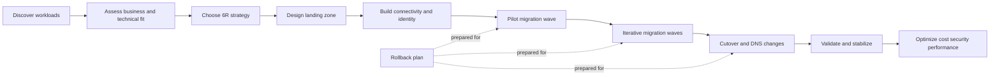
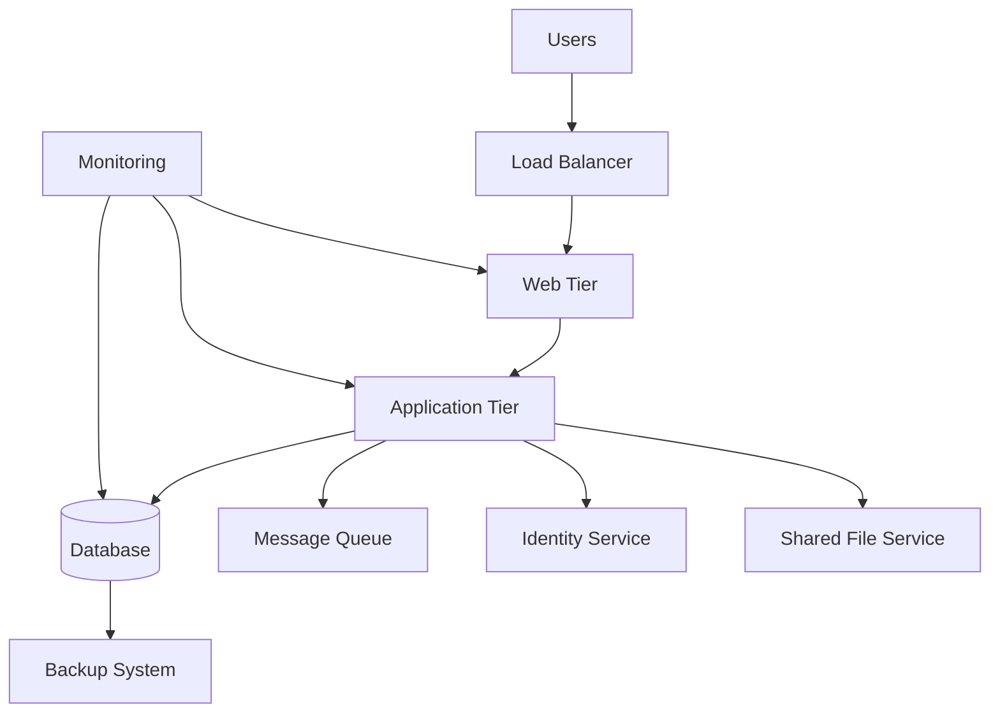
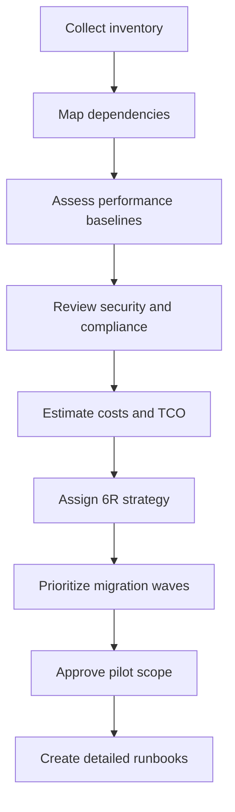
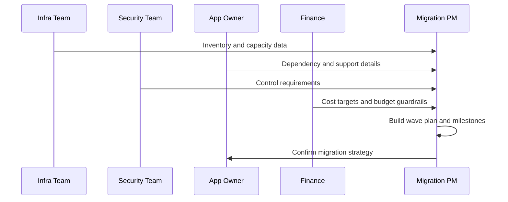

# Migration Planning

← Back to [16-cloud-migration.md](./16-cloud-migration.md)

Migration strategy, assessment, dependency mapping, and wave planning.

---

## ☁️ Migration Overview

### 📘 What is cloud migration?

Cloud migration is the structured movement of workloads, applications, data, identities, management processes, and operational practices from on-premises environments into public cloud platforms such as Azure, AWS, and GCP. It is not only a server move. It is a transformation of infrastructure, networking, security, observability, automation, and operating models.

A successful migration includes discovery, dependency mapping, landing zone design, security controls, pilot execution, wave planning, validation, cutover, rollback preparation, and optimization after production traffic is moved.

### 🎯 Why migrate? Benefits and challenges

| Area | Benefits | Challenges |
| --- | --- | --- |
| Scalability | Elastic capacity, autoscaling, regional growth | Requires redesign of quotas, scaling policies, and capacity alarms |
| Availability | Multi-zone and multi-region architectures | Needs resilient application patterns and tested failover |
| Speed | Faster provisioning through APIs and IaC | Teams must learn new tooling and governance models |
| Security | Central IAM, key management, managed controls | Shared responsibility model must be clearly understood |
| Cost | Pay-as-you-go and right-sizing opportunities | Uncontrolled sprawl or data egress can increase cost |
| Operations | Managed services reduce undifferentiated admin work | Monitoring, incident response, and runbooks must be updated |
| Innovation | Access to analytics, AI, serverless, containers | Legacy apps may need refactoring to benefit fully |

- Common business drivers include datacenter exit, hardware refresh avoidance, disaster recovery modernization, global expansion, acquisition integration, and demand for self-service provisioning.
- Technical drivers include virtualization sprawl cleanup, aging SAN replacement, unsupported operating systems, slow provisioning cycles, and weak DR maturity.
- Typical blockers include undocumented dependencies, licensing complexity, security exceptions, bandwidth limits, and applications tightly coupled to physical hardware.

### 🧭 Migration strategies: the 6 R's

| Strategy | Meaning | Best fit | Typical example |
| --- | --- | --- | --- |
| Rehost | Lift and shift with minimal code change | Fast datacenter exit | Move VMware VMs to cloud IaaS |
| Replatform | Small optimizations without full redesign | Reduce ops effort quickly | Move app to managed database or managed disks |
| Repurchase | Replace with SaaS | Commodity business systems | Move from self-hosted CRM to Salesforce |
| Refactor | Redesign application for cloud-native model | Need elasticity or modernization | Break monolith into containers and managed services |
| Retire | Decommission unused systems | Low usage or redundant apps | Remove abandoned reporting server |
| Retain | Keep on-premises for now | Compliance, latency, or hardware dependency | Factory control system stays local |

Most large programs use more than one strategy. For example, an ERP system may be retained, web applications may be rehosted, internal wiki may be repurchased as SaaS, and analytics pipelines may be refactored into managed services.

### 🧱 Migration operating model

- Executive sponsor defines business outcome and risk tolerance.
- Cloud architecture team designs landing zone, IAM guardrails, logging, and network patterns.
- Platform team builds shared services such as connectivity, secrets, DNS, monitoring, images, and automation.
- Application owners validate functionality, data integrity, and non-functional requirements.
- Operations team updates incident handling, backup, patching, and DR processes.
- Security and compliance teams review controls, evidence collection, and exception handling.

### 🗺️ Migration phases overview



### 🧪 Migration success criteria

- Target workloads meet business recovery objectives such as RPO and RTO.
- Application response time is equal to or better than agreed baseline.
- Security controls, logging, and access reviews are operational before cutover.
- Backups and recovery procedures are tested in the target cloud.
- Runbooks are updated and ownership is clearly assigned.
- Unit cost, total cost, and resource utilization are visible after migration.

## 🔎 Pre-Migration Assessment

### 🧾 Assessment goals

Assessment converts assumptions into evidence. The objective is to understand what exists, how it communicates, how critical it is, what constraints apply, and which migration approach is viable for each workload.

### 1️⃣ Inventory existing infrastructure

- List physical servers, virtual machines, clusters, hypervisors, storage arrays, load balancers, firewalls, DNS servers, and backup systems.
- Capture operating system, version, patch level, CPU, RAM, storage, network interfaces, and virtualization platform details.
- Document application owner, support team, environment tier, maintenance window, and business criticality.
- Record data volumes, growth rate, peak IOPS, latency sensitivity, and backup retention.
- Identify unsupported or end-of-life components early because they may require upgrade before migration.

```bash
# Basic Linux inventory collection example
hostnamectl
uname -r
lsblk
lscpu
free -h
ip -br a
ss -tulpn
systemctl list-units --type=service --state=running
rpm -qa | head -50   # RHEL family
# or
apt list --installed | head -50  # Debian family
```

### 2️⃣ Application dependency mapping

Dependencies determine migration sequencing. A web server may depend on a database, DNS, identity provider, certificate authority, message broker, and SMB or NFS shares. If those dependencies are not moved or reachable at cutover time, the migration fails even if the VM boots.

- Map north-south traffic such as user-to-app, partner-to-API, and internet-to-web.
- Map east-west traffic such as app-to-db, app-to-cache, app-to-message queue, and microservice-to-microservice.
- Identify hard-coded IP addresses, DNS assumptions, TLS certificates, and service account usage.
- Record port and protocol requirements including HTTP, HTTPS, SSH, RDP, SMB, NFS, LDAP, Kerberos, DNS, SMTP, AMQP, and database ports.
- Confirm batch jobs, cron jobs, ETL processes, and backup hooks tied to local network paths.



### 3️⃣ Network architecture review

- Document subnets, VLANs, routing domains, NAT paths, MPLS or SD-WAN links, internet breakout, and DMZ placement.
- Measure available WAN throughput and expected replication windows.
- Review firewall policies, proxy requirements, egress restrictions, and DNS forwarding.
- Identify dependencies on multicast, jumbo frames, proprietary appliances, or low-latency east-west traffic.
- Check whether overlapping IP ranges exist, because they complicate hybrid connectivity.

```bash
# Network review examples on Linux jump hosts
ip route
ip -br link
nmcli connection show
traceroute database.internal.example.com
mtr -rw api.partner.example.com
ss -tnp
sudo tcpdump -i eth0 host 10.10.20.15 and port 5432
```

### 4️⃣ Security and compliance requirements

- Classify data: public, internal, confidential, regulated, or restricted.
- Identify encryption requirements for data at rest and in transit.
- Determine IAM model for admins, service accounts, applications, and break-glass access.
- Review logging, retention, time synchronization, and evidence collection requirements.
- Capture geographic residency, sovereignty, and industry controls such as PCI DSS, HIPAA, ISO 27001, SOC 2, and GDPR.

### 5️⃣ Cost analysis and TCO comparison

Total cost of ownership should compare current-state spend and target-state spend across compute, storage, licensing, backup, network egress, support, observability, and staff time. Include transition cost such as replication appliances, contractor effort, dual-running periods, and training.

| Cost domain | On-premises examples | Cloud examples |
| --- | --- | --- |
| Compute | Server purchase, hypervisor licensing | VM hourly cost, reservations, savings plans |
| Storage | SAN, NAS, replication licenses | Managed disks, object storage, snapshots |
| Network | MPLS, internet, firewalls | Data transfer, NAT gateway, load balancer |
| Operations | Patch tooling, backup tooling | Managed monitoring, backup vaults, support plans |
| Facilities | Rack space, power, cooling | Included in provider cost model |
| People | Infrastructure admin time | Cloud platform engineering and FinOps time |

### 🧭 Assessment workflow



### 📏 Baseline metrics to capture before migration

| Metric | Why it matters | Example collection source |
| --- | --- | --- |
| CPU average and peak | Sizes target instances and scaling policies | hypervisor metrics, sar, top |
| Memory usage | Avoids over-sizing or swap issues | free, vmstat, observability platform |
| Disk IOPS and throughput | Determines disk type and volume layout | storage arrays, iostat |
| Latency to dependencies | Determines whether re-architecture is needed | mtr, app telemetry |
| Transaction rate | Validates performance after cutover | APM, app logs, database metrics |
| Backup duration | Estimates cloud backup windows | backup platform reports |
| Change rate | Influences replication and cutover window | database logs, storage deltas |

### 📝 Assessment deliverables

- Application catalog with owners and criticality.
- Dependency maps and network flow diagrams.
- Landing zone prerequisites and cloud account structure.
- Risk register with mitigation and rollback approach.
- Wave plan that groups workloads by complexity and business tolerance.
- Executive summary that quantifies business value, risks, and estimated cost.



### Appendix A: Detailed discovery checklist

#### Compute inventory

- [ ] Hostname, FQDN, and asset ID recorded.
- [ ] Environment identified as production, staging, test, or development.
- [ ] Business owner and technical owner documented.
- [ ] Operating system, version, and patch level captured.
- [ ] CPU, memory, and storage profile recorded.
- [ ] Hypervisor or bare-metal platform noted.
- [ ] Installed agents documented: backup, security, monitoring, CMDB.
- [ ] Boot mode, partition scheme, and disk layout understood.
- [ ] Current backup schedule and retention recorded.
- [ ] Maintenance window and change freeze periods documented.

#### Application inventory

- [ ] Application name and business capability mapped.
- [ ] Runtime stack identified: Java, .NET, Python, PHP, Node.js, Go, or other.
- [ ] Application ports, listeners, and URLs documented.
- [ ] Inbound and outbound dependencies captured.
- [ ] Secrets, certificates, and keystore locations documented.
- [ ] Batch jobs and scheduled tasks recorded.
- [ ] Service accounts and credential rotation procedures documented.
- [ ] License model reviewed for cloud suitability.
- [ ] Support escalation contacts identified.
- [ ] Business acceptance test cases collected.

#### Database inventory

- [ ] Engine and version recorded.
- [ ] Database size, growth rate, and backup size captured.
- [ ] Replication mode or clustering model documented.
- [ ] Maintenance jobs and ETL dependencies listed.
- [ ] Encryption settings recorded.
- [ ] Recovery objectives documented.
- [ ] Connection strings and DNS aliases captured.
- [ ] I/O profile and peak transaction periods measured.
- [ ] Restore test history reviewed.
- [ ] Schema change freeze process understood.

#### Network inventory

- [ ] Subnet, VLAN, route, and gateway information captured.
- [ ] Firewall allow rules documented with owner and rationale.
- [ ] Proxy requirements recorded.
- [ ] DNS zones and forwarders mapped.
- [ ] Load balancer VIPs and health checks documented.
- [ ] Bandwidth and latency baselines measured.
- [ ] Overlapping address space identified.
- [ ] NTP sources documented.
- [ ] Remote administration paths recorded.
- [ ] Packet capture points identified for troubleshooting.

#### Security inventory

- [ ] Data classification assigned.
- [ ] Compliance scope recorded.
- [ ] Privileged access flow documented.
- [ ] MFA requirements validated.
- [ ] Encryption keys and HSM dependencies identified.
- [ ] Log retention requirements documented.
- [ ] Vulnerability exceptions reviewed.
- [ ] Endpoint protection compatibility checked.
- [ ] Incident response contacts updated.
- [ ] Evidence requirements for go-live approval captured.

### Appendix B: Migration wave template

| Field | Example value |
| --- | --- |
| Wave name | Wave-01-internal-web |
| Business window | Saturday 22:00 to Sunday 04:00 |
| Applications | Portal web, API gateway, reporting UI |
| Migration strategy | Rehost |
| Source platform | VMware vSphere |
| Target cloud | Azure East US |
| Connectivity | ExpressRoute active-active |
| Rollback trigger | Critical functional test fails or latency > 2x baseline |
| Communication plan | War room bridge, Teams/Slack, status updates every 30 minutes |
| Success owner | Application owner and cloud ops lead |

### Appendix C: Cutover command reference

#### Azure

```bash
# Verify Azure VM power state
az vm get-instance-view -g rg-migrate-prod -n app01 --query instanceView.statuses[].displayStatus -o tsv

# Update private IP if needed
az network nic ip-config update   --resource-group rg-migrate-prod   --nic-name app01-nic   --name ipconfig1   --private-ip-address 10.50.10.21
```

#### AWS

```bash
# Check EC2 state
aws ec2 describe-instances --instance-ids i-xxxxxxxx --query 'Reservations[].Instances[].State.Name' --output text

# Register target in a load balancer target group
aws elbv2 register-targets   --target-group-arn arn:aws:elasticloadbalancing:region:acct:targetgroup/app-tg/123456   --targets Id=i-xxxxxxxx,Port=8080
```

#### GCP

```bash
# Check instance serial port output
gcloud compute instances get-serial-port-output app01 --zone=us-central1-a

# Add tags for firewall targeting
gcloud compute instances add-tags app01   --zone=us-central1-a   --tags=app,web
```

### Appendix D: Rollback planning checklist

- [ ] Source snapshot or VM checkpoint taken and timestamp recorded.
- [ ] Source services remain stopped but restorable during rollback window.
- [ ] DNS rollback steps written and tested.
- [ ] Load balancer target group or backend pool revert procedure documented.
- [ ] Database write divergence plan defined.
- [ ] Stakeholder communication trigger for rollback agreed.
- [ ] Maximum decision time before rollback defined.
- [ ] Restoration owners assigned for app, network, database, and DNS.
- [ ] Rollback validation tests documented.
- [ ] Evidence location for screenshots, logs, and approvals recorded.
