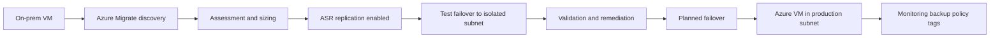
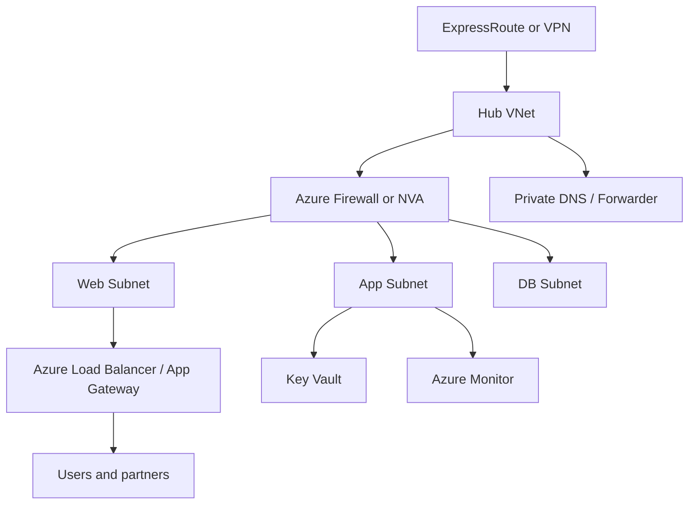
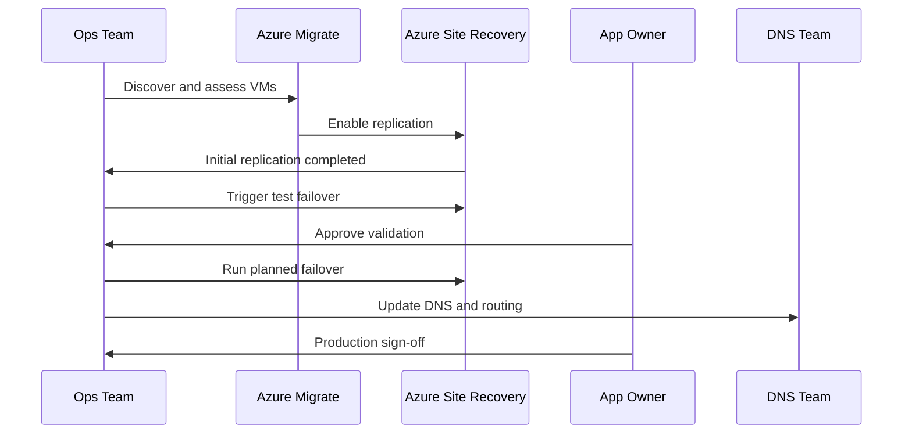

# Azure Migration

← Back to [16-cloud-migration.md](./16-cloud-migration.md)

Azure target design, Azure Migrate, ASR workflows, and Azure-specific operational steps.

---

## 🔵 Migration to Azure

### 🏗️ Azure target architecture principles

- Use a landing zone with subscription structure, management groups, policy, logging, RBAC, and connectivity designed before workload migration.
- Create separate subscriptions or resource groups for production, non-production, shared services, and connectivity where appropriate.
- Standardize resource naming, tagging, region selection, backup policies, and key vault usage.
- Prefer Azure Bastion, private endpoints, and managed identities where possible instead of public access and embedded credentials.

### 🧰 Azure Migrate tool setup and usage

1. Create or choose an Azure subscription, resource group, and region for the Azure Migrate project.
2. Open Azure Migrate in the portal and create a new project.
3. Decide whether the source estate is VMware, Hyper-V, physical servers, or other clouds.
4. Deploy the Azure Migrate appliance into the source environment for discovery and assessment.
5. Register the appliance with project credentials and verify connectivity.
6. Start discovery to collect machine inventory, performance history, and dependency data.
7. Run assessments to get right-sized Azure VM recommendations, monthly cost estimates, and readiness warnings.
8. Group machines into migration waves based on dependency and business priority.

```bash
# Log in and set the target subscription
az login
az account set --subscription "Production-Subscription"

# Create a resource group for migration resources
az group create   --name rg-migrate-prod   --location eastus

# Example: create a VNet for migrated workloads
az network vnet create   --resource-group rg-migrate-prod   --name vnet-prod-eastus   --address-prefix 10.50.0.0/16   --subnet-name snet-app   --subnet-prefix 10.50.10.0/24
```


```bash
# Expected output (success):
# [
#   {
#     "cloudName": "AzureCloud",
#     "id": "<subscription-id>",
#     "isDefault": true,
#     "name": "Production-Subscription",
#     "state": "Enabled"
#   }
# ]
# Sample failure:
# ERROR: Please run 'az login' to setup account.
```

```bash
# Expected output (success):
# {
#   "id": "/subscriptions/<subscription-id>/resourceGroups/rg-migrate-prod",
#   "location": "eastus",
#   "name": "rg-migrate-prod",
#   "properties": {"provisioningState": "Succeeded"}
# }
# Sample failure:
# (AuthorizationFailed) The client '<user>' with object id '<object-id>' does not have authorization to perform action 'Microsoft.Resources/subscriptions/resourcegroups/write'.
```

### 🔄 Step-by-step VM migration with Azure Site Recovery (ASR)

1. Prepare the target Azure network, resource group, storage policy, and naming standard.
2. Ensure source servers meet supported OS and replication prerequisites.
3. Install required mobility or replication components if Azure Migrate does not handle them automatically for the chosen source type.
4. Configure replication policy with retention, app-consistent snapshot frequency, and target settings.
5. Enable replication for selected machines.
6. Wait for initial replication to complete and monitor recovery point health.
7. Run a test migration into an isolated test subnet.
8. Validate boot, network connectivity, application startup, agent health, and monitoring hooks.
9. Schedule production cutover window.
10. Quiesce application writes if needed and perform final failover.
11. Commit migration when validation is complete.
12. Decommission or archive source-side replication only after rollback window closes.



### 🌐 Azure networking setup: VNet, NSG, Load Balancer

A common target pattern is a hub-and-spoke design. Shared services such as firewalls, DNS forwarders, VPN or ExpressRoute gateways, and Bastion stay in the hub. Application VNets or subnets exist in spokes.

1. Create a VNet with address space sized for growth, not only the first wave.
2. Create subnets for web, application, database, management, and test-failover traffic where required.
3. Apply NSGs using deny-by-default logic with explicit inbound and outbound rules.
4. Use Azure Load Balancer for L4 distribution or Application Gateway for L7 features such as TLS termination and WAF.
5. Plan user-defined routes if you insert firewalls or NVA appliances.
6. Integrate private DNS zones or DNS forwarders for hybrid name resolution.

```bash
# Create an NSG and allow HTTPS from the internet
az network nsg create   --resource-group rg-migrate-prod   --name nsg-web-eastus

az network nsg rule create   --resource-group rg-migrate-prod   --nsg-name nsg-web-eastus   --name allow-https-inbound   --priority 100   --direction Inbound   --access Allow   --protocol Tcp   --source-address-prefixes Internet   --source-port-ranges '*'   --destination-address-prefixes '*'   --destination-port-ranges 443

# Associate NSG to subnet
az network vnet subnet update   --resource-group rg-migrate-prod   --vnet-name vnet-prod-eastus   --name snet-app   --network-security-group nsg-web-eastus
```



### 🪪 Azure AD integration

- Synchronize identities from on-premises Active Directory using Microsoft Entra Connect when hybrid identity is required.
- Use Microsoft Entra ID groups for RBAC on subscriptions, resource groups, and services.
- Prefer managed identities for Azure-hosted workloads to access Key Vault, storage, or other services without storing credentials.
- Review Conditional Access, MFA, and Privileged Identity Management for administrative access.

```bash
# Assign Reader role to an Azure AD group for a resource group
az role assignment create   --assignee-object-id <group-object-id>   --assignee-principal-type Group   --role Reader   --scope /subscriptions/<subscription-id>/resourceGroups/rg-migrate-prod

# Show available roles
az role definition list --query "[].{roleName:roleName}" -o table
```

### 🛠️ Azure CLI commands for common tasks

```bash
# List VMs in a resource group
az vm list -g rg-migrate-prod -d -o table

# Show VM size options in a region
az vm list-sizes --location eastus -o table

# Create a snapshot before risky changes
az snapshot create   --resource-group rg-migrate-prod   --source /subscriptions/<sub>/resourceGroups/rg-migrate-prod/providers/Microsoft.Compute/disks/app01-osdisk   --name app01-precutover-snap

# Enable boot diagnostics
az vm boot-diagnostics enable   --resource-group rg-migrate-prod   --name app01

# Create Recovery Services vault
az backup vault create   --name rsv-prod-eastus   --resource-group rg-migrate-prod   --location eastus
```

```bash
# Expected output (success):
# Name    ResourceGroup     PowerState    PublicIps    PrivateIps    Location
# ------  ----------------  ------------  -----------  ------------  ----------
# app01   rg-migrate-prod   VM running                 10.50.10.14   eastus
# db01    rg-migrate-prod   VM running                 10.50.20.10   eastus
# Sample failure:
# ERROR: (ResourceGroupNotFound) Resource group 'rg-migrate-prod' could not be found.
```


### 📋 Azure migration runbook

- Confirm Azure region, subscription, and quota availability for the wave.
- Verify connectivity from on-premises to Azure over VPN or ExpressRoute.
- Validate DNS forwarding for migrated subnet resolution.
- Ensure NSGs, routes, and load balancer backends are pre-created.
- Check Azure Policy exemptions are documented if any workload needs temporary deviation.
- Validate backup vault policy and retention assignments.
- Perform test failover and capture screenshots or evidence.
- Confirm application owner sign-off before production failover.
- Freeze source-side changes during final sync window.
- Execute failover and perform smoke tests immediately after boot.
- Update CMDB, diagrams, support contacts, and monitoring dashboards.
- Close the migration only after rollback window expires and backups succeed.




### 📚 Official References
- [Azure Migrate Documentation](https://learn.microsoft.com/en-us/azure/migrate/)
- [Azure Landing Zone](https://learn.microsoft.com/en-us/azure/cloud-adoption-framework/ready/landing-zone/)
