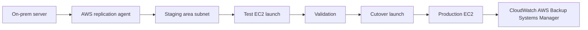
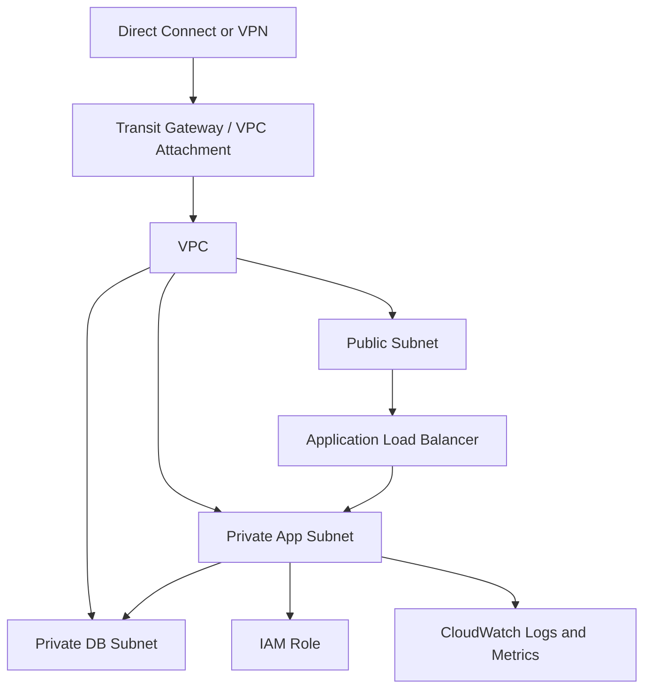
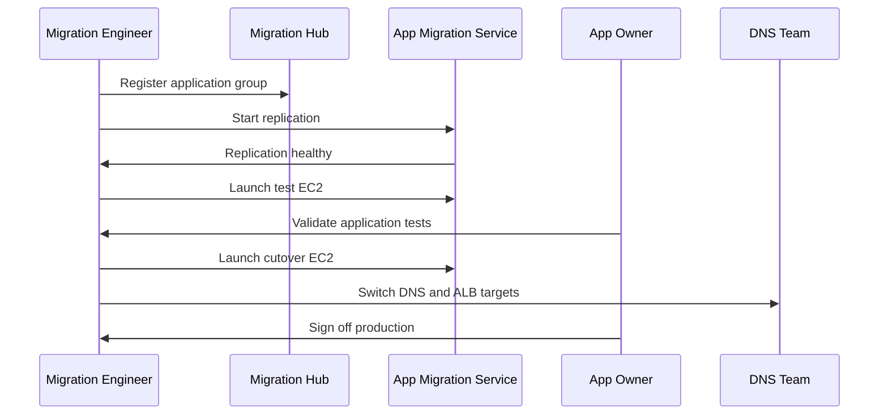

# AWS Migration

← Back to [16-cloud-migration.md](./16-cloud-migration.md)

AWS target design, migration tooling, EC2 workflows, and AWS-specific operating guidance.

---

## 🟠 Migration to AWS

### 🏗️ AWS target architecture principles

- Build a multi-account strategy using AWS Organizations, separate production from non-production, and centralize logging and security services where possible.
- Use a VPC design that supports future peering, Transit Gateway, and hybrid connectivity.
- Adopt IAM roles, AWS Systems Manager, CloudWatch, and AWS Backup early so operational patterns are consistent before the first migration wave.

### 🧰 AWS Migration Hub

AWS Migration Hub gives a central view across discovery, application grouping, and migration progress. It is especially useful when multiple teams are moving workloads with different migration services.

1. Enable Migration Hub in the target region.
2. Import application grouping information or build groups manually.
3. Connect discovery tools or AWS Application Discovery Service where needed.
4. Track server replication and migration status across waves.
5. Use Migration Hub dashboards in weekly governance reviews.

### 🚚 AWS Server Migration Service / Application Migration Service

AWS Server Migration Service has largely been superseded by AWS Application Migration Service (MGN) for many server migration scenarios. Current programs should generally evaluate MGN first unless a legacy workflow specifically depends on SMS.

1. Create staging area subnets and security groups in the target AWS account.
2. Install the AWS replication agent on source servers.
3. Allow outbound connectivity from source servers to required AWS endpoints.
4. Replicate source disks continuously to the staging area.
5. Right-size launch settings for test and cutover instances.
6. Launch test instances in an isolated subnet.
7. Validate application behavior and adjust instance type, EBS volume, or networking.
8. Schedule cutover, stop source writes if needed, and launch cutover instance.
9. Update DNS, monitoring, and backup configuration.
10. Finalize source decommission after rollback window closes.



### 🖥️ Step-by-step EC2 migration

1. Create VPC, subnets, route tables, internet or NAT egress, and security groups.
2. Create IAM roles for EC2, Systems Manager, CloudWatch, and backup operations.
3. Install MGN replication agents on source Linux or Windows servers.
4. Wait for initial sync and ensure lag is within acceptable threshold.
5. Launch non-production test instances.
6. Validate hostname strategy, SSH or RDP access, application service startup, and attached storage.
7. Attach or migrate data volumes and verify mount persistence or Windows drive letters.
8. Tune instance family, CPU credits, EBS type, and network performance based on test results.
9. Plan cutover, coordinate downtime, stop source application writes, and launch cutover instance.
10. Repoint DNS or load balancer target groups and validate production traffic.
11. Enable patch baselines, monitoring, and backup policies immediately after cutover.

### 🌐 VPC setup, Security Groups, IAM

```bash
# Create a VPC
aws ec2 create-vpc   --cidr-block 10.60.0.0/16   --tag-specifications 'ResourceType=vpc,Tags=[{Key=Name,Value=vpc-prod}]'

# Create a subnet
aws ec2 create-subnet   --vpc-id vpc-xxxxxxxx   --cidr-block 10.60.10.0/24   --availability-zone us-east-1a   --tag-specifications 'ResourceType=subnet,Tags=[{Key=Name,Value=subnet-app-a}]'

# Create a security group
aws ec2 create-security-group   --group-name sg-web-prod   --description "Allow HTTPS"   --vpc-id vpc-xxxxxxxx

# Allow HTTPS inbound
aws ec2 authorize-security-group-ingress   --group-id sg-xxxxxxxx   --ip-permissions IpProtocol=tcp,FromPort=443,ToPort=443,IpRanges='[{CidrIp=0.0.0.0/0,Description="HTTPS"}]' 
```

```bash
# Expected output (success):
# {
#   "Vpc": {
#     "VpcId": "vpc-0abc123def4567890",
#     "State": "pending",
#     "CidrBlock": "10.60.0.0/16"
#   }
# }
# Sample failure:
# An error occurred (UnauthorizedOperation) when calling the CreateVpc operation: You are not authorized to perform this operation.
```




### 🛠️ AWS CLI commands

```bash
# List EC2 instances
aws ec2 describe-instances   --filters Name=instance-state-name,Values=running   --query 'Reservations[].Instances[].{Name:Tags[?Key==`Name`]|[0].Value,ID:InstanceId,Type:InstanceType,PrivateIP:PrivateIpAddress}'   --output table

# Create an AMI for rollback or backup
aws ec2 create-image   --instance-id i-xxxxxxxx   --name app01-precutover-ami   --no-reboot

# Create CloudWatch alarm for CPU
aws cloudwatch put-metric-alarm   --alarm-name app01-high-cpu   --metric-name CPUUtilization   --namespace AWS/EC2   --statistic Average   --period 300   --threshold 80   --comparison-operator GreaterThanThreshold   --dimensions Name=InstanceId,Value=i-xxxxxxxx   --evaluation-periods 2
```

```bash
# Expected output (success):
# --------------------------------------------------------------
# |                      DescribeInstances                      |
# +---------+----------------------+-------------+-------------+
# |   ID    |         Name         |    Type     |  PrivateIP  |
# +---------+----------------------+-------------+-------------+
# | i-0123  | app01                | t3.large    | 10.60.10.14 |
# | i-0456  | db01                 | m6i.xlarge  | 10.60.20.11 |
# +---------+----------------------+-------------+-------------+
# Sample failure:
# An error occurred (AuthFailure) when calling the DescribeInstances operation: AWS was not able to validate the provided access credentials.
```


### 📋 AWS migration runbook

- Confirm target account guardrails, SCPs, and IAM role assumptions are ready.
- Verify VPC CIDR does not overlap with existing on-premises connected networks.
- Check Direct Connect or VPN health and route propagation.
- Validate security group and NACL rules for application ports.
- Ensure Systems Manager access is working for management without broad SSH exposure.
- Test backup policy attachment and snapshot lifecycle.
- Confirm load balancer health checks before cutover.
- Launch test instance and document any init system or network interface changes.
- Execute cutover in maintenance window and watch CloudWatch logs during first transactions.
- Record final source shutdown time and snapshot references for rollback.
- Update tags for owner, environment, application, cost-center, and compliance scope.
- Hold a stabilization review after 24 hours and 7 days.




### 📚 Official References
- [AWS Migration Hub](https://docs.aws.amazon.com/migrationhub/)
- [AWS Well-Architected Migration Lens](https://docs.aws.amazon.com/wellarchitected/latest/migration-lens/)
