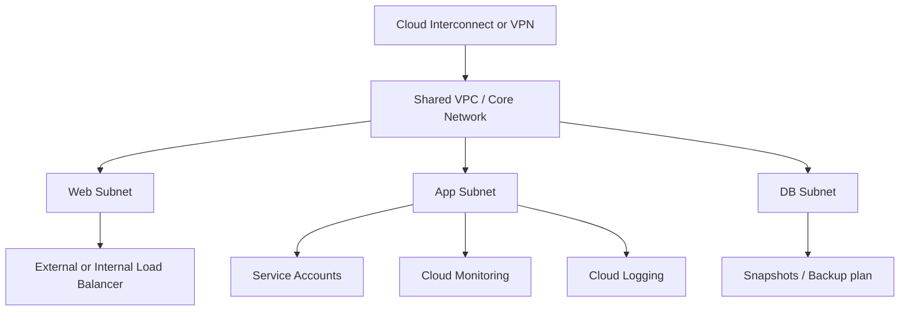
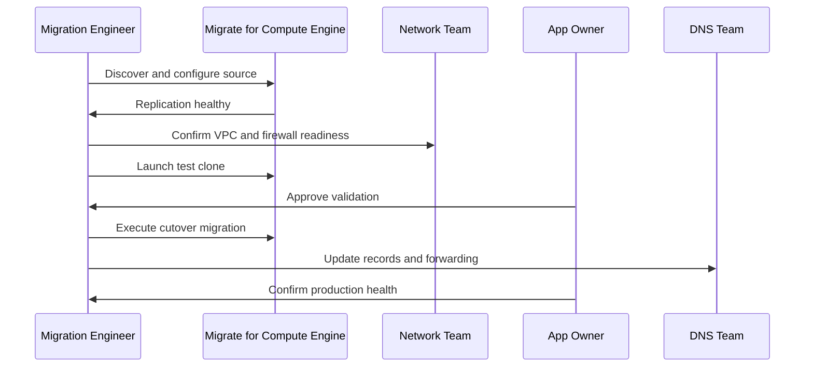

# GCP Migration

← Back to [16-cloud-migration.md](./16-cloud-migration.md)

GCP target design, Migrate to VMs, gcloud-driven cutovers, and GCP-specific operating guidance.

---

## 🔴 Migration to GCP

### 🏗️ GCP target architecture principles

- Design projects, folders, billing accounts, IAM bindings, and organization policies before moving production workloads.
- Use Shared VPC when central networking teams manage multiple application projects.
- Adopt Cloud Logging, Cloud Monitoring, OS Login, and IAM service accounts for consistent operations.

### 🧰 Google Cloud Migrate for Compute Engine

Migrate for Compute Engine helps move VMware, AWS, Azure, and physical workloads into Compute Engine with migration waves, cloning, testing, and cutover automation.

1. Create a GCP project with required APIs enabled.
2. Set up networking, firewall rules, service accounts, and Cloud VPN or Cloud Interconnect if hybrid connectivity is required.
3. Deploy the migration manager and source connectors as required by the tool version and source platform.
4. Discover source machines and group them by application or wave.
5. Configure target instance settings such as machine type, zone, disk layout, service account, and tags.
6. Create test clones and perform functional validation.
7. Execute cutover migration during approved window.
8. Harden the resulting Compute Engine instances with monitoring, backups, and IAM restrictions.

### 🖥️ Step-by-step VM migration

1. Create or select the target project and billing account.
2. Create VPC network, subnets, Cloud Router, and VPN or Interconnect if needed.
3. Grant IAM roles to migration administrators, network admins, and operations users.
4. Install or deploy required migration components in the source environment.
5. Replicate source workloads and validate that change rate fits the replication window.
6. Create a test clone in a dedicated test subnet with restricted firewall rules.
7. Validate startup scripts, mounted disks, application ports, and identity integration.
8. Run final cutover and preserve the source snapshot or machine image for rollback.
9. Attach backup schedules, alerting policies, and cost labels after cutover.


### 🌐 VPC, Firewall Rules, IAM

```bash
# Create a VPC network
gcloud compute networks create vpc-prod   --subnet-mode=custom

# Create a subnet
gcloud compute networks subnets create subnet-app-uscentral1   --network=vpc-prod   --region=us-central1   --range=10.70.10.0/24

# Allow HTTPS to tagged instances
gcloud compute firewall-rules create allow-https-web   --network=vpc-prod   --direction=INGRESS   --action=ALLOW   --rules=tcp:443   --source-ranges=0.0.0.0/0   --target-tags=web

# Grant compute admin role to a group
gcloud projects add-iam-policy-binding my-prod-project   --member='group:cloud-ops@example.com'   --role='roles/compute.admin' 
```



### 🛠️ gcloud CLI commands

```bash
# List instances
gcloud compute instances list

# Create a snapshot before risky changes
gcloud compute disks snapshot app01-disk   --zone=us-central1-a   --snapshot-names=app01-precutover-snap

# Create a health check
gcloud compute health-checks create http app-health-check   --port=8080   --request-path=/health

# Create an instance template example
gcloud compute instance-templates create app-template-v1   --machine-type=e2-standard-4   --subnet=subnet-app-uscentral1   --tags=app,web
```

```bash
# Expected output (success):
# Created [https://www.googleapis.com/compute/v1/projects/my-prod-project/global/networks/vpc-prod].
# Sample failure:
# ERROR: (gcloud.compute.networks.create) Could not fetch resource:
#  - Required 'compute.networks.create' permission for 'projects/my-prod-project'.
```

```bash
# Expected output (success):
# NAME   ZONE           MACHINE_TYPE   INTERNAL_IP   EXTERNAL_IP  STATUS
# app01  us-central1-a  e2-standard-4  10.70.10.14                RUNNING
# db01   us-central1-b  e2-standard-8  10.70.20.12                RUNNING
# Sample failure:
# ERROR: (gcloud.compute.instances.list) Some requests did not succeed:
#  - Insufficient Permission
```


### 📋 GCP migration runbook

- Confirm quotas for CPUs, disks, snapshots, forwarding rules, and addresses in the target region.
- Verify organization policies do not block required APIs or external IP usage if the design needs them.
- Check Shared VPC host project attachments and subnet IAM permissions.
- Validate firewall rules, routes, and Cloud Router advertisement.
- Test OS Login or bastion access patterns for admin operations.
- Confirm Cloud Monitoring agents or Ops Agent are installed after cutover.
- Create test clones and verify service startup ordering and persistent disk mounts.
- Run production cutover and capture serial console logs if boot issues occur.
- Update Cloud DNS or hybrid DNS forwarding as part of the cutover checklist.
- Enable snapshots or backup plans immediately after cutover.
- Label resources for owner, environment, application, and cost tracking.
- Schedule post-cutover rightsizing review after one week of telemetry.




### 📚 Official References
- [Google Cloud Migration Center](https://cloud.google.com/migration-center/docs)
- [Google Cloud Architecture Framework](https://cloud.google.com/architecture/framework)

### 🔧 Common Migration Failures & Fixes

| Issue | Symptoms | Root Cause | Fix |
|-------|----------|-----------|-----|
| VM won't boot after migration | Kernel panic, no bootable device | Missing virtio drivers / wrong boot mode | Install virtio drivers pre-migration, verify UEFI/BIOS |
| Network unreachable after migration | No connectivity, ping fails | NIC naming changed (`eth0` → `ens5`), route missing | Update `/etc/sysconfig/network-scripts` or netplan, check security groups |
| Application slow after migration | High latency, timeouts | Wrong instance size, disk IOPS limit | Right-size instance, use premium SSD, check proximity |
| DNS resolution fails | Can't resolve internal names | DNS forwarder not configured | Configure VPC DNS, add conditional forwarders |
| Permission denied on data | App can't read migrated files | UID/GID mismatch, SELinux context lost | Fix ownership, restore SELinux contexts with `restorecon` |
| Database replication lag | Data inconsistency, stale reads | WAN latency, insufficient bandwidth | Use database-native migration tools (DMS), schedule during low traffic |
| License activation fails | App won't start, license error | Hardware fingerprint changed | Contact vendor for cloud-compatible license, use BYOL programs |
| Time sync issues | Certificates fail, Kerberos errors | NTP not configured for cloud | Configure `chrony` with cloud NTP (`169.254.169.123` for AWS, metadata guidance for GCP) |
